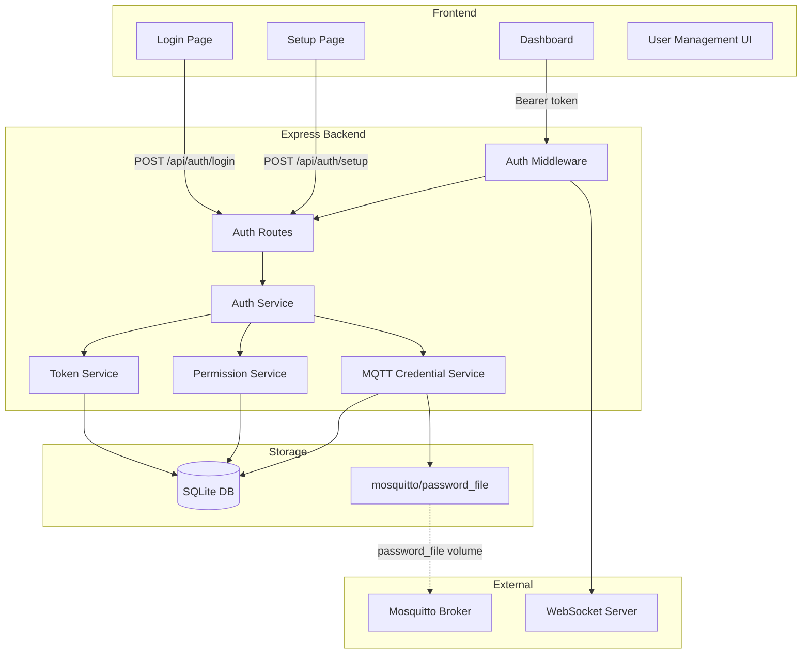
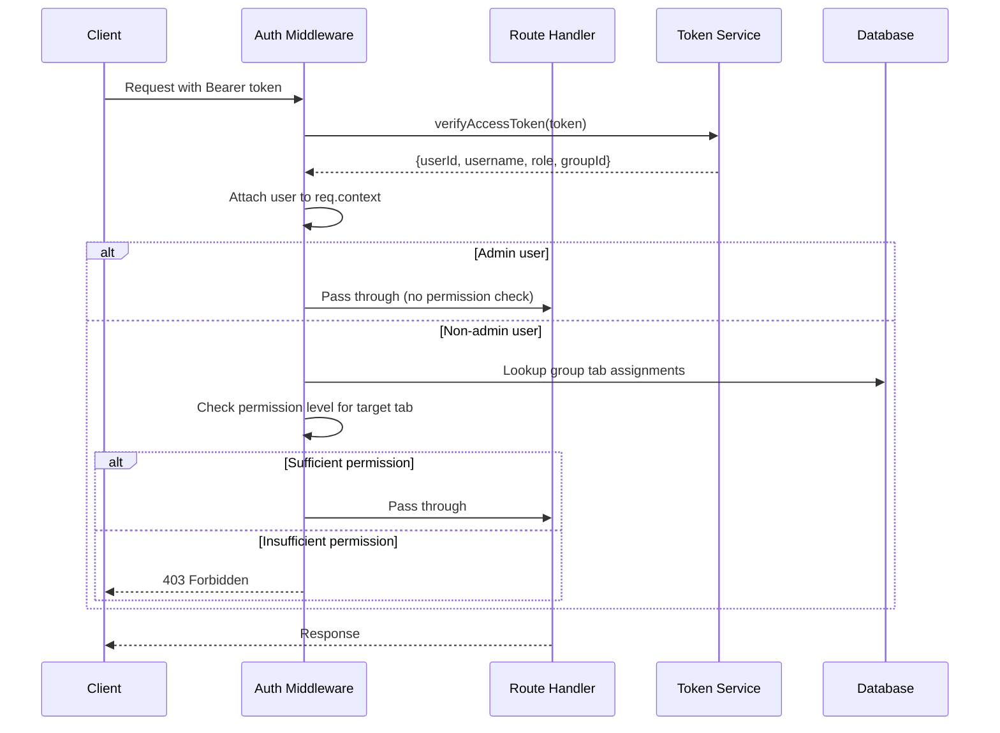
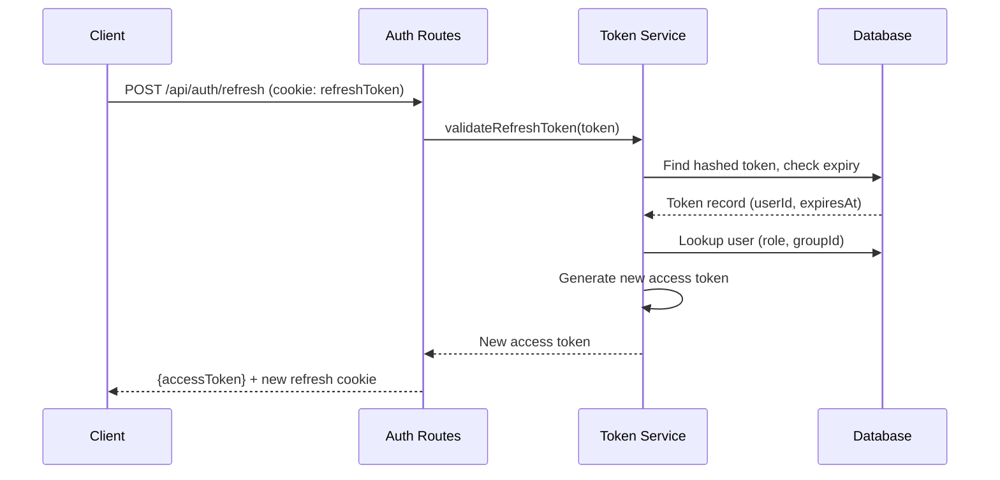

# Design Document: Authentication

## Overview

This design adds a JWT-based authentication system to Aeolus with a group-based, tab-level permission model. The system protects the HTTP API, WebSocket connections, and MQTT broker. It introduces a first-run admin setup flow, user/group management, and three-tier permission levels (read/interact/write) per tab.

Authentication is always active — there is no disabled mode. The admin user bypasses all group restrictions. Non-admin users belong to exactly one group, and each group maps tab IDs to permission levels.

### Key Design Decisions

1. **bcrypt for passwords** — Industry standard, cost factor 12 provides ~250ms hash time on Raspberry Pi, balancing security and UX.
2. **HS256 JWT with short-lived access tokens** — Symmetric signing is appropriate for a single-service deployment. 15-minute access tokens limit exposure if leaked.
3. **Opaque refresh tokens stored hashed** — Not JWTs, so they can be revoked server-side. Stored as SHA-256 hashes to prevent database-leak exploitation.
4. **better-sqlite3 for all auth state** — Consistent with existing architecture. No new dependencies for persistence.
5. **Middleware-based protection** — Follows the existing Express middleware pattern (validate, rate-limit, CORS). Auth middleware slots in before route handlers.
6. **MQTT password file generation** — Aeolus writes Mosquitto-format password files and signals the broker to reload, keeping MQTT auth in sync without manual file editing.

## Architecture



### Request Flow



### Token Refresh Flow



## Components and Interfaces

### Auth Service (`src/auth/auth-service.ts`)

Central orchestrator for authentication operations.

```typescript
interface AuthService {
  /** First-run admin creation */
  setupAdmin(username: string, password: string): Promise<User>;
  
  /** Verify credentials and issue token pair */
  login(username: string, password: string): Promise<LoginResult>;
  
  /** Issue new access token from refresh token */
  refresh(refreshToken: string): Promise<string>;
  
  /** Revoke refresh token */
  logout(refreshToken: string): Promise<void>;
  
  /** Check if setup is needed (no admin exists) */
  needsSetup(): boolean;
}

interface LoginResult {
  accessToken: string;
  refreshToken: string;
  user: { id: string; username: string; role: string };
}
```

### Token Service (`src/auth/token-service.ts`)

Handles JWT signing/verification and refresh token lifecycle.

```typescript
interface TokenService {
  /** Generate a signed access token */
  generateAccessToken(payload: AccessTokenPayload): string;
  
  /** Verify and decode an access token */
  verifyAccessToken(token: string): AccessTokenPayload;
  
  /** Generate an opaque refresh token, store hash in DB */
  generateRefreshToken(userId: string): string;
  
  /** Validate refresh token against stored hash */
  validateRefreshToken(token: string): RefreshTokenRecord | null;
  
  /** Delete a specific refresh token */
  revokeRefreshToken(token: string): void;
  
  /** Delete all refresh tokens for a user */
  revokeAllUserTokens(userId: string): void;
  
  /** Get or generate the JWT signing secret */
  getSecret(): string;
}

interface AccessTokenPayload {
  userId: string;
  username: string;
  role: "admin" | "user";
  groupId: string | null;
}
```

### Permission Service (`src/auth/permission-service.ts`)

Evaluates tab-level access control.

```typescript
type PermissionLevel = "read" | "interact" | "write";

interface PermissionService {
  /** Get all tab assignments for a group */
  getGroupPermissions(groupId: string): TabAssignment[];
  
  /** Check if a user has at least the required permission on a tab */
  hasPermission(userId: string, tabId: string, required: PermissionLevel): boolean;
  
  /** Get the permission level a user has on a specific tab (null = no access) */
  getUserTabPermission(userId: string, tabId: string): PermissionLevel | null;
  
  /** Get all tabs accessible to a user with their permission levels */
  getUserAccessibleTabs(userId: string): TabAssignment[];
}

interface TabAssignment {
  tabId: string;
  permission: PermissionLevel;
}
```

### User Service (`src/auth/user-service.ts`)

CRUD operations for users.

```typescript
interface UserService {
  createUser(username: string, password: string, groupId: string): User;
  getUser(id: string): User | null;
  getUserByUsername(username: string): User | null;
  listUsers(): UserListItem[];
  updateUser(id: string, updates: { groupId?: string; password?: string }): User;
  deleteUser(id: string): void;
  changePassword(userId: string, currentPassword: string, newPassword: string): void;
  verifyPassword(user: User, password: string): boolean;
}

interface User {
  id: string;
  username: string;
  passwordHash: string;
  role: "admin" | "user";
  groupId: string | null;
  createdAt: number;
}

interface UserListItem {
  id: string;
  username: string;
  role: "admin" | "user";
  groupId: string | null;
  createdAt: number;
}
```

### Group Service (`src/auth/group-service.ts`)

CRUD operations for user groups.

```typescript
interface GroupService {
  createGroup(name: string, tabAssignments: TabAssignment[]): Group;
  getGroup(id: string): Group | null;
  listGroups(): Group[];
  updateGroup(id: string, name: string, tabAssignments: TabAssignment[]): Group;
  deleteGroup(id: string): void;
}

interface Group {
  id: string;
  name: string;
  tabAssignments: TabAssignment[];
  createdAt: number;
}
```

### MQTT Credential Service (`src/auth/mqtt-credential-service.ts`)

Manages MQTT device credentials and password file generation.

```typescript
interface MqttCredentialService {
  /** Create a new MQTT credential for a device */
  createCredential(deviceName: string): MqttCredential;
  
  /** List all credentials (without passwords) */
  listCredentials(): MqttCredentialListItem[];
  
  /** Delete a credential and regenerate password file */
  deleteCredential(id: string): void;
  
  /** Ensure the backend's own MQTT credential exists */
  ensureBackendCredential(): MqttCredential;
  
  /** Regenerate the Mosquitto password file from all stored credentials */
  regeneratePasswordFile(): void;
}

interface MqttCredential {
  id: string;
  deviceName: string;
  username: string;
  password: string; // Only returned on creation
}

interface MqttCredentialListItem {
  id: string;
  deviceName: string;
  username: string;
  createdAt: number;
}
```

### Auth Middleware (`src/auth/auth-middleware.ts`)

Express middleware for route protection.

```typescript
/** Verifies JWT and attaches user context. Returns 401 if invalid. */
function authenticate(req: Request, res: Response, next: NextFunction): void;

/** Requires the authenticated user to have role "admin". Returns 403 if not. */
function requireAdmin(req: Request, res: Response, next: NextFunction): void;

/** 
 * Requires the authenticated user to have at least the specified permission 
 * on the tab identified by the request (via tabId param or resource lookup).
 * Admin users always pass. Returns 403 if insufficient.
 */
function requireTabPermission(level: PermissionLevel): RequestHandler;

/** 
 * Skips auth if setup is needed (no admin exists).
 * Used on the setup endpoint.
 */
function setupGuard(req: Request, res: Response, next: NextFunction): void;
```

### Auth Routes (`src/api/routes/auth.routes.ts`)

```typescript
// POST /api/auth/setup        — First-run admin creation
// POST /api/auth/login         — Login, returns access token + refresh cookie
// POST /api/auth/refresh       — Exchange refresh cookie for new access token
// POST /api/auth/logout        — Revoke refresh token, clear cookie
// PUT  /api/auth/password      — Change own password

// GET    /api/auth/users       — List users (admin only)
// POST   /api/auth/users       — Create user (admin only)
// PUT    /api/auth/users/:id   — Update user (admin only)
// DELETE /api/auth/users/:id   — Delete user (admin only)

// GET    /api/auth/groups      — List groups (admin only)
// POST   /api/auth/groups      — Create group (admin only)
// PUT    /api/auth/groups/:id  — Update group (admin only)
// DELETE /api/auth/groups/:id  — Delete group (admin only)

// GET    /api/auth/mqtt-credentials      — List MQTT credentials (admin only)
// POST   /api/auth/mqtt-credentials      — Create MQTT credential (admin only)
// DELETE /api/auth/mqtt-credentials/:id  — Delete MQTT credential (admin only)

// GET    /api/auth/me          — Get current user info + permissions
```

### WebSocket Auth Enhancement (`src/websocket/ws-server.ts`)

The existing `WsServer` class is extended to:
1. Require a `token` query parameter on connection
2. Verify the token before accepting the connection
3. Store user context per connection
4. Filter broadcast messages based on user's tab permissions

```typescript
interface AuthenticatedClient {
  ws: WebSocket;
  userId: string;
  role: "admin" | "user";
  groupId: string | null;
  accessibleTabIds: Set<string>;
}
```

### Frontend Auth Store (`frontend/src/store/auth-store.ts`)

Zustand store managing client-side auth state.

```typescript
interface AuthState {
  accessToken: string | null;
  user: { id: string; username: string; role: string; groupId: string | null } | null;
  isAuthenticated: boolean;
  needsSetup: boolean;
  
  login(username: string, password: string): Promise<void>;
  logout(): Promise<void>;
  refresh(): Promise<boolean>;
  setup(username: string, password: string): Promise<void>;
  checkSetupNeeded(): Promise<void>;
}
```

## Data Models

### Database Schema

```sql
-- Users table
CREATE TABLE IF NOT EXISTS users (
  id TEXT PRIMARY KEY,
  username TEXT NOT NULL UNIQUE,
  password_hash TEXT NOT NULL,
  role TEXT NOT NULL DEFAULT 'user' CHECK(role IN ('admin', 'user')),
  group_id TEXT REFERENCES groups(id) ON DELETE SET NULL,
  created_at INTEGER NOT NULL
);

-- User groups table
CREATE TABLE IF NOT EXISTS groups (
  id TEXT PRIMARY KEY,
  name TEXT NOT NULL UNIQUE,
  created_at INTEGER NOT NULL
);

-- Tab assignments (group → tab permission mapping)
CREATE TABLE IF NOT EXISTS group_tab_assignments (
  group_id TEXT NOT NULL REFERENCES groups(id) ON DELETE CASCADE,
  tab_id TEXT NOT NULL REFERENCES tabs(id) ON DELETE CASCADE,
  permission TEXT NOT NULL CHECK(permission IN ('read', 'interact', 'write')),
  PRIMARY KEY (group_id, tab_id)
);

-- Refresh tokens
CREATE TABLE IF NOT EXISTS refresh_tokens (
  id TEXT PRIMARY KEY,
  user_id TEXT NOT NULL REFERENCES users(id) ON DELETE CASCADE,
  token_hash TEXT NOT NULL UNIQUE,
  expires_at INTEGER NOT NULL,
  created_at INTEGER NOT NULL
);

CREATE INDEX IF NOT EXISTS idx_refresh_tokens_user
ON refresh_tokens(user_id);

CREATE INDEX IF NOT EXISTS idx_refresh_tokens_hash
ON refresh_tokens(token_hash);

-- MQTT credentials
CREATE TABLE IF NOT EXISTS mqtt_credentials (
  id TEXT PRIMARY KEY,
  device_name TEXT NOT NULL,
  username TEXT NOT NULL UNIQUE,
  password_hash TEXT NOT NULL,
  created_at INTEGER NOT NULL
);

-- System settings (JWT secret, etc.)
CREATE TABLE IF NOT EXISTS system_settings (
  key TEXT PRIMARY KEY,
  value TEXT NOT NULL
);
```

### Access Token JWT Payload

```json
{
  "userId": "uuid-string",
  "username": "admin",
  "role": "admin",
  "groupId": null,
  "iat": 1700000000,
  "exp": 1700000900
}
```

### Refresh Token Storage

- Raw token: 32 bytes of `crypto.randomBytes`, encoded as base64url
- Stored in DB: SHA-256 hash of the raw token
- Cookie: `refreshToken=<base64url-encoded-raw-token>; HttpOnly; SameSite=Strict; Path=/api/auth; Max-Age=604800`

### Permission Level Hierarchy

```
write > interact > read
```

A check for "interact" permission passes if the user has "interact" OR "write". A check for "read" passes if the user has any of the three levels.

## Correctness Properties

*A property is a characteristic or behavior that should hold true across all valid executions of a system — essentially, a formal statement about what the system should do. Properties serve as the bridge between human-readable specifications and machine-verifiable correctness guarantees.*

### Property 1: Access token structure and signing

*For any* user (with any valid userId, username, role, and groupId), the generated access token SHALL be signed with HS256, contain exactly the claims `userId`, `username`, `role`, `groupId`, `iat`, and `exp`, with `exp - iat = 900` (15 minutes), and decoding the token SHALL produce values matching the original user record.

**Validates: Requirements 2.3, 3.4, 14.2, 14.4**

### Property 2: Refresh token opacity and secure storage

*For any* generated refresh token, the raw token SHALL NOT be a valid JWT (cannot be decoded as header.payload.signature), and the value stored in the database SHALL be a SHA-256 hash that is not equal to the raw token string.

**Validates: Requirements 2.4, 14.3, 14.5**

### Property 3: Password minimum length enforcement

*For any* string with fewer than 8 characters, the system SHALL reject it as a password during admin setup, user creation, and password change operations, leaving the existing state unchanged.

**Validates: Requirements 1.5, 12.4**

### Property 4: Permission hierarchy enforcement

*For any* non-admin user with a tab assignment at permission level P, and any API operation requiring permission level R on that tab:
- If P ≥ R in the hierarchy (write > interact > read), the operation SHALL be allowed
- If P < R, the operation SHALL return HTTP 403 Forbidden
- If the tab is not in the user's group assignment at all, any operation SHALL return HTTP 403 Forbidden

**Validates: Requirements 3.5, 8.5, 8.6, 8.7, 8.8**

### Property 5: Admin bypasses all permission checks

*For any* user with role "admin" and any API request to any endpoint (regardless of tab assignment or operation type), the auth middleware SHALL allow the request without checking tab permissions.

**Validates: Requirements 3.6, 9.7**

### Property 6: Admin-only endpoint restriction

*For any* non-admin user and any admin-only endpoint (user management, group management, tab creation/deletion, MQTT credential management), the system SHALL return HTTP 403 Forbidden regardless of the user's group or tab assignments.

**Validates: Requirements 3.7, 6.7, 7.6, 9.1, 9.2, 9.3, 9.4, 9.5**

### Property 7: WebSocket event filtering by tab assignment

*For any* non-admin user connected via WebSocket and any event associated with a tab, the user SHALL receive the event only if the tab is in their group's tab assignment. Admin users SHALL receive all events.

**Validates: Requirements 4.5, 4.6**

### Property 8: Group CRUD round-trip

*For any* valid group name and set of tab assignments, creating a group and then retrieving it SHALL return the same name and tab assignments. Updating a group with new values and retrieving it SHALL return the updated values.

**Validates: Requirements 6.1, 6.2, 6.3**

### Property 9: Group deletion cascades to member access

*For any* group with one or more member users, deleting the group SHALL result in all former members having no tab access (null groupId) until reassigned.

**Validates: Requirements 6.5**

### Property 10: User and credential listing excludes secrets

*For any* set of users or MQTT credentials, the list endpoints SHALL return all records but SHALL NOT include password hashes or raw passwords in the response.

**Validates: Requirements 7.2, 10.2**

### Property 11: Last admin protection invariant

*For any* sequence of user deletion operations, the system SHALL reject deletion of the last remaining user with role "admin", ensuring at least one admin always exists.

**Validates: Requirements 7.5**

### Property 12: Password change round-trip

*For any* user and any valid new password (≥ 8 characters), after a successful password change, authentication SHALL succeed with the new password and SHALL fail with the old password.

**Validates: Requirements 12.1**

### Property 13: Permission propagation on token refresh

*For any* non-admin user whose group's tab assignments are modified, the next access token issued via the refresh endpoint SHALL contain the updated groupId, and permission checks SHALL reflect the new assignments.

**Validates: Requirements 8.10**

### Property 14: MQTT password file consistency

*For any* set of MQTT credentials stored in the database, the regenerated password file SHALL contain exactly one entry per credential (no more, no fewer), each in Mosquitto-compatible `username:hash` format.

**Validates: Requirements 10.5**

## Error Handling

### HTTP Error Responses

All auth errors follow the existing `{ error: string, details?: unknown }` response format:

| Scenario | Status | Error Message |
|----------|--------|---------------|
| Missing/invalid/expired token | 401 | "Unauthorized" |
| Invalid credentials (login) | 401 | "Invalid username or password" |
| Wrong current password (change) | 401 | "Current password is incorrect" |
| Insufficient permission | 403 | "Forbidden" |
| Non-admin accessing admin endpoint | 403 | "Forbidden" |
| Validation failure (Zod) | 400 | "Validation failed" + details |
| Rate limit exceeded | 429 | "Too many login attempts" + Retry-After |
| Setup already complete | 409 | "Setup already completed" |
| Delete last admin | 409 | "Cannot delete the last admin user" |
| Username already exists | 409 | "Username already exists" |

### WebSocket Error Handling

| Scenario | Close Code | Reason |
|----------|-----------|--------|
| Missing token param | 4001 | "Authentication required" |
| Invalid/expired token | 4001 | "Invalid token" |
| Server error during auth | 4002 | "Authentication error" |

### Error Classes

New error classes extending the existing `AppError`:

```typescript
export class UnauthorizedError extends AppError {
  constructor(message = "Unauthorized") {
    super(401, message);
  }
}

export class ForbiddenError extends AppError {
  constructor(message = "Forbidden") {
    super(403, message);
  }
}

export class ConflictError extends AppError {
  constructor(message: string) {
    super(409, message);
  }
}
```

### Timing-Safe Comparisons

Login failures (wrong username vs wrong password) SHALL return the same error message and similar response times to prevent user enumeration. Use `crypto.timingSafeEqual` for password comparison results where applicable.

## Testing Strategy

### Property-Based Tests (fast-check, minimum 100 iterations)

Property-based testing is appropriate for this feature because the permission model, token generation, and validation logic are pure functions with clear input/output behavior where input variation reveals edge cases.

**Library:** `fast-check` (already in devDependencies) with `@fast-check/vitest`

**Test files:**
- `src/auth/token-service.property.test.ts` — Properties 1, 2
- `src/auth/permission-service.property.test.ts` — Properties 4, 5, 6, 7
- `src/auth/user-service.property.test.ts` — Properties 3, 10, 11, 12
- `src/auth/group-service.property.test.ts` — Properties 8, 9, 13
- `src/auth/mqtt-credential-service.property.test.ts` — Property 14

Each property test must:
- Run minimum 100 iterations
- Reference its design property with a tag comment: `// Feature: authentication, Property N: <title>`
- Use generators for usernames, passwords, group names, tab IDs, and permission levels

### Unit Tests (example-based)

**Test files:**
- `src/auth/auth-service.test.ts` — Setup flow, login/logout, refresh
- `src/auth/auth-middleware.test.ts` — Route protection, public routes, token attachment
- `src/api/routes/auth.routes.test.ts` — API integration tests with supertest

Focus areas:
- First-run setup happy path and validation
- Login success/failure
- Refresh token exchange
- Rate limiting behavior (5 per minute)
- Cookie attributes (HttpOnly, SameSite=Strict)
- WebSocket connection acceptance/rejection

### Integration Tests

- Full login → access → refresh → logout flow
- Group creation → user assignment → permission enforcement
- MQTT credential creation → password file generation
- JWT secret rotation → token invalidation

### Test Configuration

```typescript
// vitest.config.ts additions
// Property tests use the existing fast-check setup
// Tag format: Feature: authentication, Property {N}: {title}
// Minimum iterations: 100 (configured via fc.configureGlobal or per-test)
```

### Dependencies

New runtime dependencies needed:
- `jsonwebtoken` — JWT signing and verification (HS256)
- `bcrypt` — Password hashing (native addon, faster than pure JS on Pi)

No new dev dependencies needed — `fast-check`, `vitest`, and `supertest` are already available.

