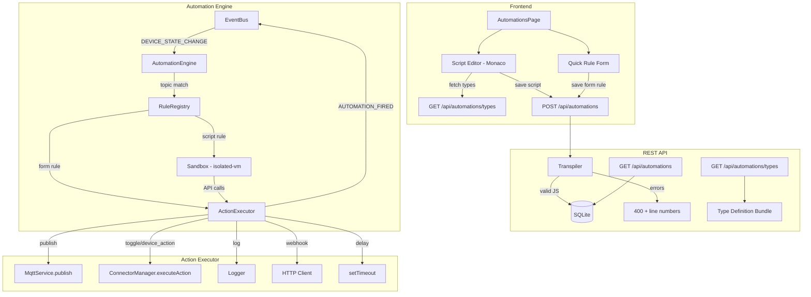

# Design Document: Automation Overhaul

## Overview

The Automation Overhaul transforms Aeolus from a platform that *logs* automation actions into one that *executes* them — publishing MQTT messages, toggling devices, calling connectors, firing webhooks, and running user-authored TypeScript scripts in a secure sandbox. This is the flagship feature that differentiates Aeolus from Home Assistant: real TypeScript automation code with IntelliSense, type safety, and a Monaco-powered editor — not YAML, not a visual block editor, but actual code with a real developer experience.

The overhaul introduces five major subsystems:

1. **Action Executor** — A dispatch service that routes action descriptors to MqttService, ConnectorManager, logger, or HTTP client. All automation actions (form rules, script rules, file rules) flow through this single execution pipeline.
2. **TypeScript Sandbox** — A secure `isolated-vm` execution environment that runs user-authored TypeScript (transpiled to JS) with a controlled API surface (`devices`, `mqtt`, `log`, `context`). No access to Node.js internals, filesystem, or network.
3. **Script Rule Lifecycle** — CRUD operations for TypeScript automation rules stored in SQLite alongside existing form rules, with transpilation on save and live registration in the Rule Registry.
4. **Monaco Code Editor** — A browser-based TypeScript editor with Aeolus dark theme, JetBrains Mono font, and full IntelliSense powered by a `.d.ts` type definition bundle served from the backend.
5. **Richer Form Actions** — Expanded action types (device_action, delay, webhook) in the existing form-based rule creator, all routed through the Action Executor.

### Design Rationale: `isolated-vm` over Node.js `vm`

The Node.js `vm` module is explicitly documented as "not a security mechanism" — it runs code in the same V8 isolate as the host process, allowing escape via prototype pollution, `Function` constructor access, and `this.constructor` chains. The `vm2` library attempted to patch these holes but was deprecated after repeated critical sandbox escape CVEs.

`isolated-vm` creates a separate V8 isolate with its own heap, no access to the host's global scope, and built-in support for memory limits and execution timeouts. This is the same isolation primitive used by Cloudflare Workers and Temporal.io for running untrusted code. For a Raspberry Pi deployment where the automation engine shares a process with the MQTT broker connection and device registry, true V8-level isolation is essential.

The tradeoff: `isolated-vm` is a native addon requiring compilation. On Raspberry Pi (ARM64), this means a C++ build toolchain in the Docker image. This is acceptable — the Dockerfile already uses a Node.js base image, and `node-gyp` builds are a one-time cost during `docker build`.

### Design Rationale: Monaco over CodeMirror

Monaco is the editor engine behind VS Code. It provides native TypeScript language service integration — meaning IntelliSense, type checking, and error squiggles work out of the box when you register `.d.ts` type definitions via `addExtraLib()`. CodeMirror 6 is lighter but requires significant custom work to achieve comparable TypeScript support. Since the code editor is the centrepiece of this feature and DX is paramount, Monaco is the right choice. The `@monaco-editor/react` wrapper provides clean React integration.

## Architecture



### Data Flow

1. A `DEVICE_STATE_CHANGE` event arrives on the event bus (from MQTT or a connector).
2. `AutomationEngine.evaluate()` finds matching rules by topic.
3. For **form rules**: the engine builds an action descriptor from the stored action type/target/params and passes it to `ActionExecutor.execute()`.
4. For **script rules**: the engine creates a `Sandbox` instance, injects the `context` object with the triggering event data, and runs the compiled JavaScript. Sandbox API calls (`devices.action()`, `mqtt.publish()`) delegate to the `ActionExecutor`.
5. `ActionExecutor` dispatches to the appropriate service and emits `AUTOMATION_FIRED` on the event bus.
6. The WebSocket server broadcasts `automation-fired` events to connected dashboard clients.


## Components and Interfaces

### 1. ActionExecutor (`src/automations/action-executor.ts`)

The central dispatch service for all automation actions. Every action — whether from a form rule, script rule, or file-based rule — flows through this single pipeline.

```typescript
interface ActionDescriptor {
  type: "publish" | "toggle" | "device_action" | "log" | "delay" | "webhook";
  target: string;           // topic for publish, deviceId for toggle/device_action, URL for webhook
  params: Record<string, unknown>;
}

interface ActionExecutorDeps {
  mqttService: MqttService;
  connectorManager: ConnectorManager;
  logger: Logger;
}

class ActionExecutor {
  constructor(deps: ActionExecutorDeps) {}

  /** Execute a single action descriptor. Never throws — logs errors and continues. */
  async execute(action: ActionDescriptor, ruleId: string): Promise<void>;

  /** Execute a sequence of actions in order. Continues on individual failures. */
  async executeSequence(actions: ActionDescriptor[], ruleId: string): Promise<void>;
}
```

**Dispatch logic by action type:**

| Action Type      | Target Field     | Dispatches To                                      |
|------------------|------------------|-----------------------------------------------------|
| `publish`        | MQTT topic       | `MqttService.publish(target, params.payload)`       |
| `toggle`         | Device ID        | `ConnectorManager.executeAction(target, toggleAction)` |
| `device_action`  | Device ID        | `ConnectorManager.executeAction(target, action)`    |
| `log`            | —                | `logger.info({ ruleId, message: params.message })`  |
| `delay`          | —                | `await sleep(params.duration)`                      |
| `webhook`        | URL              | `fetch(target, { method, headers, body })`          |

**Error handling:** Each action is wrapped in try/catch. On failure, the error is logged with the rule ID and action details. The executor continues to the next action in a sequence — one failed action does not abort the pipeline.

**Event emission:** After each successful action execution, the executor emits `AUTOMATION_FIRED` on the event bus with `{ ruleId, actionType, target, timestamp }`.

### 2. TypeScript Sandbox (`src/automations/sandbox.ts`)

Uses `isolated-vm` to create a secure V8 isolate for each script execution.

```typescript
interface SandboxDeps {
  actionExecutor: ActionExecutor;
  deviceRegistry: DeviceRegistry;
}

interface SandboxContext {
  topic: string;
  deviceId: string;
  state: Record<string, unknown>;
  timestamp: number;
}

class Sandbox {
  constructor(deps: SandboxDeps) {}

  /**
   * Execute compiled JavaScript in an isolated V8 context.
   * Injects the sandbox API (devices, mqtt, log, context) and
   * enforces a 5-second timeout and 32MB memory limit.
   */
  async execute(compiledJs: string, context: SandboxContext, ruleId: string): Promise<void>;
}
```

**Sandbox API surface exposed to user code:**

```typescript
// Available as globals inside the sandbox — no imports needed

declare const devices: {
  get(id: string): Device | undefined;
  list(): Device[];
  filter(predicate: (d: Device) => boolean): Device[];
  action(deviceId: string, actionType: string, params?: Record<string, unknown>): Promise<void>;
};

declare const mqtt: {
  publish(topic: string, payload: string): void;
};

declare const log: {
  info(message: string): void;
  warn(message: string): void;
  error(message: string): void;
};

declare const context: {
  topic: string;
  deviceId: string;
  state: Record<string, unknown>;
  timestamp: number;
};
```

**Security constraints:**
- Separate V8 isolate via `isolated-vm` — no shared heap with host process
- 32MB memory limit per isolate (suitable for Raspberry Pi's constrained RAM)
- 5-second execution timeout — prevents infinite loops
- No access to `require`, `import`, `process`, `fs`, `child_process`, `eval`, `Function`, `global`
- No network access except through the approved `mqtt.publish()` and `devices.action()` APIs
- `devices.get()`, `devices.list()`, `devices.filter()` receive serialized snapshots (copies, not references)
- `devices.action()` and `mqtt.publish()` are implemented as host-side callbacks that delegate to ActionExecutor

**Implementation approach:**
1. Create a new `ivm.Isolate({ memoryLimit: 32 })` per execution (or pool isolates for performance)
2. Create a `ivm.Context` within the isolate
3. Inject the sandbox API as `Reference` objects on the global scope
4. `devices.get/list/filter` are synchronous — data is copied into the isolate via `ivm.ExternalCopy`
5. `devices.action()` and `mqtt.publish()` use `ivm.Reference` callbacks that call back to the host isolate
6. Compile the user's JS with `isolate.compileScript()` and run with `script.run(context, { timeout: 5000 })`

### 3. TypeScript Transpiler (`src/automations/transpiler.ts`)

Handles TypeScript → JavaScript compilation using the TypeScript compiler API.

```typescript
interface TranspileResult {
  success: boolean;
  js?: string;           // Compiled JavaScript (ES2022 target)
  errors?: TranspileError[];
}

interface TranspileError {
  line: number;
  column: number;
  message: string;
}

function transpile(source: string): TranspileResult;
```

**Behaviour:**
- Uses `ts.transpileModule()` with target ES2022, stripping type annotations
- Rejects source containing `import` or `require` statements (regex pre-check + compiler diagnostic check)
- Returns structured errors with line/column numbers for the frontend to display inline
- Does not perform full type checking — only syntactic transpilation (type checking happens in the Monaco editor via the `.d.ts` bundle)

### 4. Type Definition Bundle (`src/automations/sandbox-types.d.ts`)

A static `.d.ts` file served at `GET /api/automations/types`. The Monaco editor fetches this on mount and registers it via `monaco.languages.typescript.typescriptDefaults.addExtraLib()` to provide IntelliSense.

```typescript
// Served as plain text from GET /api/automations/types

/**
 * Aeolus Sandbox API — Type Definitions
 *
 * These types are available as globals in your automation scripts.
 * No imports needed — just start writing.
 */

/** An IoT device in the Aeolus device registry. */
interface Device {
  /** Unique device identifier */
  id: string;
  /** Human-readable device name */
  name: string;
  /** Device category */
  type: "light" | "sensor" | "switch" | "climate" | "plug";
  /** List of device capabilities (e.g. "on/off", "brightness") */
  capabilities: string[];
  /** Current device state as key-value pairs */
  state: Record<string, unknown>;
  /** Source integration identifier (e.g. "mqtt", "hue", "kasa") */
  integration: string;
  /** Unix timestamp of last state update */
  lastSeen: number;
}

/** Query and control devices in the Aeolus registry. */
declare const devices: {
  /** Get a device by ID. Returns undefined if not found. */
  get(id: string): Device | undefined;
  /** List all registered devices. */
  list(): Device[];
  /** Filter devices by a predicate function. */
  filter(predicate: (device: Device) => boolean): Device[];
  /** Execute an action on a device (e.g. toggle, setBrightness). */
  action(deviceId: string, actionType: string, params?: Record<string, unknown>): Promise<void>;
};

/** Publish messages to the MQTT broker. */
declare const mqtt: {
  /** Publish a message to an MQTT topic. */
  publish(topic: string, payload: string): void;
};

/** Structured logging from your automation script. */
declare const log: {
  /** Log an informational message. */
  info(message: string): void;
  /** Log a warning message. */
  warn(message: string): void;
  /** Log an error message. */
  error(message: string): void;
};

/** The event that triggered this automation. */
declare const context: {
  /** The MQTT topic or synthetic connector topic that fired. */
  topic: string;
  /** The device ID that triggered the event. */
  deviceId: string;
  /** The device state at the time of the event. */
  state: Record<string, unknown>;
  /** Unix timestamp when the event occurred. */
  timestamp: number;
};
```

### 5. Automation Routes (updated `src/api/routes/automation.routes.ts`)

Extended to handle script rules alongside form rules.

**New/modified endpoints:**

| Method | Path | Description |
|--------|------|-------------|
| `GET` | `/api/automations` | List all rules (file, form, script) with `ruleType` field |
| `POST` | `/api/automations` | Create form or script rule (determined by `ruleType` in body) |
| `PUT` | `/api/automations/:id` | Update rule — re-transpiles script source if script type |
| `DELETE` | `/api/automations/:id` | Delete rule from DB and Rule Registry |
| `PATCH` | `/api/automations/:id/toggle` | Enable/disable rule |
| `GET` | `/api/automations/types` | Serve the Type Definition Bundle as `text/plain` |

**POST /api/automations request body (script rule):**
```json
{
  "name": "Smart heating",
  "triggerTopic": "sensor/+/temperature",
  "ruleType": "script",
  "scriptSource": "if (context.state.value < 18) {\n  devices.action('climate-living-room', 'setTemperature', { target: 22 });\n  log.info('Heating activated');\n}"
}
```

**POST /api/automations response (transpilation error):**
```json
{
  "error": "TypeScript compilation failed",
  "statusCode": 400,
  "details": [
    { "line": 3, "column": 12, "message": "Property 'valuee' does not exist on type 'Record<string, unknown>'." }
  ]
}
```

### 6. Monaco Code Editor Component (`frontend/src/components/ScriptEditor.tsx`)

A React component wrapping `@monaco-editor/react` with Aeolus theming and sandbox API IntelliSense.

**Key behaviours:**
- Fetches type definitions from `GET /api/automations/types` on mount
- Registers types via `monaco.languages.typescript.typescriptDefaults.addExtraLib(types, 'aeolus-sandbox.d.ts')`
- Defines a custom Monaco theme (`aeolus-dark`) mapping Aeolus brand colours to token types
- Uses JetBrains Mono as the editor font (loaded via Google Fonts or bundled)
- Displays inline error markers when the backend returns transpilation errors
- Emits `onChange` with the current source and `onSave` when the user triggers save

**Theme mapping:**

| Token | Colour | Aeolus Role |
|-------|--------|-------------|
| Keywords (`if`, `const`, `await`) | `#3BA4FF` | Aeolus Blue |
| Strings | `#5CE1E6` | Wind Cyan |
| Comments | `#6B7785` | Muted Text |
| Functions | `#E6EDF3` | Primary Text |
| Types | `#9AA6B2` | Secondary Text |
| Numbers | `#F59E0B` | Amber |
| Editor background | `#0B0F14` | Deep Void |
| Gutter | `#121821` | Graphite |

### 7. Dual-Mode Automations Page (updated `frontend/src/components/AutomationsPage.tsx`)

The existing AutomationsPage gains a tab/toggle control to switch between "Quick Rule" (existing form) and "Script" (Monaco editor) creation modes.

**Layout:**
- Top bar: page title + mode toggle (segmented control with Lucide icons: `FormInput` for Quick Rule, `Code` for Script)
- Creation area: either the existing form or the ScriptEditor component
- Unified rule list below: all rules (file, form, script) with type badges
- Script rules show a `<Code />` icon badge; form rules show a `<FormInput />` icon badge
- Clicking a script rule opens it in the editor with source pre-loaded
- All styling follows Aeolus design system: `#121821` surface cards, 12-16px border radius, Lucide icons, 150-250ms ease-in-out transitions

### 8. Execution History (`src/automations/execution-log.ts`)

A lightweight in-memory ring buffer (last 200 entries) that records every automation execution for debugging.

```typescript
interface ExecutionLogEntry {
  id: string;
  ruleId: string;
  ruleName: string;
  ruleType: "file" | "form" | "script";
  triggerTopic: string;
  actions: Array<{ type: string; target: string; success: boolean; error?: string }>;
  duration: number;     // ms
  timestamp: number;
}

class ExecutionLog {
  private entries: ExecutionLogEntry[] = [];
  private maxEntries = 200;

  push(entry: ExecutionLogEntry): void;
  list(limit?: number): ExecutionLogEntry[];
  getByRuleId(ruleId: string): ExecutionLogEntry[];
}
```

Exposed via `GET /api/automations/history?limit=50` for the frontend to display in the event log or a dedicated execution history panel.


## Data Models

### SQLite Schema Changes

The `automation_rules` table gains three new columns to support script rules. The migration is backward-compatible — existing rows get `rule_type = 'form'` as the default.

```sql
-- Migration: Add script rule support to automation_rules
ALTER TABLE automation_rules ADD COLUMN rule_type TEXT NOT NULL DEFAULT 'form'
  CHECK(rule_type IN ('form', 'script'));
ALTER TABLE automation_rules ADD COLUMN script_source TEXT DEFAULT NULL;
ALTER TABLE automation_rules ADD COLUMN compiled_js TEXT DEFAULT NULL;
```

**Note:** SQLite's `ALTER TABLE ADD COLUMN` does not support `CHECK` constraints on added columns. The migration will use the `initSchema` pattern — the schema is defined in `database.ts` with the full table definition including the new columns. On first run after upgrade, existing rows without `rule_type` will be migrated via:

```sql
UPDATE automation_rules SET rule_type = 'form' WHERE rule_type IS NULL;
```

**Full updated table schema:**

```sql
CREATE TABLE IF NOT EXISTS automation_rules (
  id TEXT PRIMARY KEY,
  name TEXT NOT NULL,
  trigger_topic TEXT NOT NULL,
  condition_type TEXT DEFAULT NULL,
  condition_value TEXT DEFAULT NULL,
  action_type TEXT NOT NULL DEFAULT 'log',
  action_target TEXT NOT NULL DEFAULT '',
  action_params TEXT NOT NULL DEFAULT '{}',
  rule_type TEXT NOT NULL DEFAULT 'form',
  script_source TEXT DEFAULT NULL,
  compiled_js TEXT DEFAULT NULL,
  enabled INTEGER NOT NULL DEFAULT 1,
  created_at INTEGER NOT NULL
);
```

**Column semantics by rule type:**

| Column | Form Rule | Script Rule |
|--------|-----------|-------------|
| `rule_type` | `'form'` | `'script'` |
| `action_type` | `'log'`, `'publish'`, `'toggle'`, `'device_action'`, `'delay'`, `'webhook'` | `'script'` |
| `action_target` | Topic/device ID/URL | `''` (unused) |
| `action_params` | JSON params | `'{}'` (unused) |
| `script_source` | `NULL` | TypeScript source code |
| `compiled_js` | `NULL` | Transpiled JavaScript |

### TypeScript Interfaces

**ActionDescriptor** — passed to ActionExecutor:
```typescript
interface ActionDescriptor {
  type: "publish" | "toggle" | "device_action" | "log" | "delay" | "webhook";
  target: string;
  params: Record<string, unknown>;
}
```

**StoredRule** — extended for script rules:
```typescript
interface StoredRule {
  id: string;
  name: string;
  trigger_topic: string;
  condition_type: string | null;
  condition_value: string | null;
  action_type: string;
  action_target: string;
  action_params: string;
  rule_type: "form" | "script";
  script_source: string | null;
  compiled_js: string | null;
  enabled: number;
  created_at: number;
}
```

**API response shape** — GET /api/automations:
```typescript
interface AutomationRuleResponse {
  id: string;
  name: string;
  topic: string;
  hasCondition: boolean;
  source: "file" | "ui";
  ruleType: "file" | "form" | "script";
  enabled: boolean;
  // Form rule fields
  actionType?: string;
  actionTarget?: string;
  actionParams?: Record<string, unknown>;
  conditionType?: string | null;
  conditionValue?: string | null;
  // Script rule fields
  scriptSource?: string;
}
```

**TranspileResult:**
```typescript
interface TranspileResult {
  success: boolean;
  js?: string;
  errors?: TranspileError[];
}

interface TranspileError {
  line: number;
  column: number;
  message: string;
}
```

**ExecutionLogEntry:**
```typescript
interface ExecutionLogEntry {
  id: string;
  ruleId: string;
  ruleName: string;
  ruleType: "file" | "form" | "script";
  triggerTopic: string;
  actions: Array<{
    type: string;
    target: string;
    success: boolean;
    error?: string;
  }>;
  duration: number;
  timestamp: number;
}
```


## Correctness Properties

*A property is a characteristic or behavior that should hold true across all valid executions of a system — essentially, a formal statement about what the system should do. Properties serve as the bridge between human-readable specifications and machine-verifiable correctness guarantees.*

### Property 1: Action dispatch correctness

*For any* valid `ActionDescriptor` with a known action type (`publish`, `toggle`, `device_action`, `log`, `webhook`), the `ActionExecutor` SHALL dispatch to the correct underlying service with the exact target and parameters from the descriptor. Specifically:
- `publish` → `MqttService.publish(target, params.payload)`
- `toggle` → `ConnectorManager.executeAction(target, { type: 'toggle', ... })`
- `device_action` → `ConnectorManager.executeAction(target, { type: params.actionType, ... })`
- `log` → `logger.info({ message: params.message })`
- `webhook` → `fetch(target, { method: params.method, headers: params.headers, body: params.body })`

**Validates: Requirements 1.2, 1.3, 1.4, 1.5, 1.7**

### Property 2: Unknown action types are handled gracefully

*For any* string that is not a valid action type (`publish`, `toggle`, `device_action`, `log`, `delay`, `webhook`), executing an `ActionDescriptor` with that type SHALL NOT throw an error, and SHALL log a warning containing the unknown type string.

**Validates: Requirements 1.8**

### Property 3: Sequence failure isolation

*For any* sequence of `ActionDescriptor` objects where some actions are configured to fail, the `ActionExecutor` SHALL still execute all non-failing actions in the sequence. The number of successful executions plus the number of logged errors SHALL equal the total sequence length.

**Validates: Requirements 1.9**

### Property 4: AUTOMATION_FIRED event emission

*For any* successfully executed action, the `ActionExecutor` SHALL emit an `AUTOMATION_FIRED` event on the event bus containing the rule ID, action type, target, and a timestamp within 1 second of the current time.

**Validates: Requirements 2.4**

### Property 5: Sandbox API data correctness

*For any* device registry state (set of devices) and event context (topic, deviceId, state, timestamp), when a script executes in the sandbox:
- `devices.list()` SHALL return an array with the same length and device IDs as the registry
- `devices.get(id)` SHALL return the device matching that ID, or `undefined` if not found
- `devices.filter(pred)` SHALL return only devices satisfying the predicate
- `context.topic`, `context.deviceId`, `context.state`, and `context.timestamp` SHALL match the injected event context

**Validates: Requirements 3.2, 3.5**

### Property 6: Sandbox-to-host delegation

*For any* sandbox script that calls `mqtt.publish(topic, payload)`, `log.info(msg)`, `log.warn(msg)`, `log.error(msg)`, or `devices.action(deviceId, actionType, params)`, the corresponding host-side service SHALL receive the exact arguments passed in the script.

**Validates: Requirements 2.2, 3.3, 3.4, 3.10**

### Property 7: Sandbox security — forbidden globals

*For any* identifier in the set `{require, import, process, fs, child_process, eval, Function, global}`, a script that attempts to access that identifier SHALL either receive `undefined` or trigger a `ReferenceError`. The script SHALL NOT gain access to any Node.js built-in module or the host process.

**Validates: Requirements 3.6**

### Property 8: Sandbox error isolation

*For any* script that throws an uncaught exception (with any error message string), the sandbox SHALL catch the error, log it with the rule ID, and SHALL NOT propagate the error to the calling `AutomationEngine`. The engine SHALL continue processing subsequent rules.

**Validates: Requirements 3.8**

### Property 9: TypeScript transpilation round-trip

*For any* valid TypeScript source string containing type annotations (type aliases, interface usage, typed parameters, return types), the transpiler SHALL produce JavaScript output that:
1. Contains no TypeScript-specific syntax (no `: string`, no `interface`, no `type` keywords used as declarations)
2. Is syntactically valid ES2022 JavaScript
3. When executed in the sandbox, produces the same observable side effects as the original TypeScript intent

**Validates: Requirements 4.1, 4.3, 4.5**

### Property 10: Transpilation error reporting with line numbers

*For any* TypeScript source string with a syntax error at a known line, the transpiler SHALL return a `TranspileResult` with `success: false` and at least one error entry whose `line` field matches the line where the error was introduced.

**Validates: Requirements 4.2**

### Property 11: Import/require rejection

*For any* TypeScript source string containing an `import` declaration or a `require()` call, the transpiler SHALL reject the source with `success: false` and return an error message indicating that imports are not allowed.

**Validates: Requirements 4.4**


## Error Handling

### Action Executor Errors

| Scenario | Behaviour |
|----------|-----------|
| MqttService not connected during publish | Log error with rule ID, skip publish, continue sequence |
| ConnectorManager.executeAction throws | Log error with rule ID and device ID, continue sequence |
| Webhook HTTP request fails (network error, non-2xx) | Log error with URL and status, continue sequence |
| Unknown action type | Log warning with type string, skip, continue sequence |
| Delay with negative/zero duration | Treat as no-op, log warning, continue |

### Sandbox Errors

| Scenario | Behaviour |
|----------|-----------|
| Script throws uncaught exception | Catch, log with rule ID and error message, do not propagate |
| Script exceeds 5-second timeout | `isolated-vm` terminates execution, log timeout error with rule ID |
| Script exceeds 32MB memory limit | `isolated-vm` terminates isolate, log OOM error with rule ID |
| Script attempts forbidden API access | `ReferenceError` or `undefined` — caught by sandbox error handler |
| `devices.action()` fails inside script | Error propagates to script as rejected Promise; if uncaught, sandbox catches it |

### Transpilation Errors

| Scenario | Behaviour |
|----------|-----------|
| Syntax error in TypeScript source | Return 400 with `{ error, details: [{ line, column, message }] }` |
| Source contains `import`/`require` | Return 400 with descriptive error before transpilation |
| Empty source string | Return 400 with "Script source cannot be empty" |
| TypeScript compiler internal error | Return 500 with generic error, log details server-side |

### API Errors

| Scenario | Behaviour |
|----------|-----------|
| POST /api/automations missing required fields | 400 BadRequestError |
| PUT /api/automations/:id — rule not found | 404 NotFoundError |
| DELETE /api/automations/:id — rule not found | 404 NotFoundError |
| PATCH toggle — rule not found | 404 NotFoundError |
| GET /api/automations/types — type file missing | 500 with "Type definitions not available" |

### Database Migration Errors

| Scenario | Behaviour |
|----------|-----------|
| Column already exists (re-run migration) | `ALTER TABLE ADD COLUMN` is idempotent via `IF NOT EXISTS` pattern in schema init |
| Existing rows missing `rule_type` | Migration sets `rule_type = 'form'` for all NULL values |

## Testing Strategy

### Dual Testing Approach

This feature uses both unit tests and property-based tests for comprehensive coverage:

- **Property-based tests** verify universal correctness properties (Properties 1–11) across hundreds of generated inputs using `fast-check` (already a project dependency via `@fast-check/vitest`)
- **Unit tests** verify specific examples, integration points, edge cases, and UI behaviour
- **Integration tests** verify end-to-end flows (API → DB → Engine → ActionExecutor)

### Property-Based Testing Configuration

- Library: `fast-check` via `@fast-check/vitest` (already in `package.json`)
- Minimum 100 iterations per property test
- Each test tagged with: `Feature: automation-overhaul, Property {N}: {title}`
- Test files: `*.property.test.ts` alongside source files

### Test File Layout

| File | Tests |
|------|-------|
| `src/automations/action-executor.property.test.ts` | Properties 1, 2, 3, 4 |
| `src/automations/sandbox.property.test.ts` | Properties 5, 6, 7, 8 |
| `src/automations/transpiler.property.test.ts` | Properties 9, 10, 11 |
| `src/automations/action-executor.test.ts` | Unit tests: delay timing, MQTT disconnected handling |
| `src/automations/sandbox.test.ts` | Unit tests: timeout enforcement, memory limit, integration |
| `src/automations/transpiler.test.ts` | Unit tests: empty source, specific error cases |
| `src/api/routes/automation.routes.test.ts` | Integration tests: CRUD flows, migration, list endpoint |
| `frontend/src/components/ScriptEditor.test.tsx` | Unit tests: type loading, error display, save flow |
| `frontend/src/components/AutomationsPage.test.tsx` | Unit tests: mode toggle, rule list, form actions |

### Generator Strategy for Property Tests

**ActionDescriptor generator:**
```typescript
const actionDescriptorArb = fc.oneof(
  fc.record({ type: fc.constant("publish"), target: fc.string(), params: fc.record({ payload: fc.string() }) }),
  fc.record({ type: fc.constant("toggle"), target: fc.string(), params: fc.constant({}) }),
  fc.record({ type: fc.constant("device_action"), target: fc.string(), params: fc.record({ actionType: fc.string() }) }),
  fc.record({ type: fc.constant("log"), target: fc.constant(""), params: fc.record({ message: fc.string() }) }),
  fc.record({ type: fc.constant("webhook"), target: fc.webUrl(), params: fc.record({ method: fc.constantFrom("GET","POST","PUT"), body: fc.string() }) }),
);
```

**Device generator:**
```typescript
const deviceArb = fc.record({
  id: fc.string({ minLength: 1 }),
  name: fc.string({ minLength: 1 }),
  type: fc.constantFrom("light", "sensor", "switch", "climate", "plug"),
  capabilities: fc.array(fc.string()),
  state: fc.dictionary(fc.string(), fc.jsonValue()),
  integration: fc.constantFrom("mqtt", "hue", "kasa"),
  lastSeen: fc.nat(),
});
```

**SandboxContext generator:**
```typescript
const sandboxContextArb = fc.record({
  topic: fc.string({ minLength: 1 }),
  deviceId: fc.string({ minLength: 1 }),
  state: fc.dictionary(fc.string(), fc.jsonValue()),
  timestamp: fc.nat(),
});
```

### New Dependencies

**Backend:**
- `isolated-vm` — V8 isolate sandbox for secure script execution (native addon, requires build tools in Docker)
- `typescript` — Already a devDependency; used at runtime for `ts.transpileModule()` — move to `dependencies`

**Frontend:**
- `@monaco-editor/react` — React wrapper for Monaco editor
- `monaco-editor` — Peer dependency for `@monaco-editor/react`

### Mocking Strategy

- `MqttService` — mock `publish()` and `isConnected()` for ActionExecutor tests
- `ConnectorManager` — mock `executeAction()` for ActionExecutor tests
- `DeviceRegistry` — mock `getAll()`, `getById()` for sandbox tests
- `fetch` — mock global fetch for webhook action tests
- `isolated-vm` — use real isolates in property tests (they're fast enough); mock only for unit tests testing error paths
- `EventBus` — use real `EventEmitter` instance, assert on emitted events

