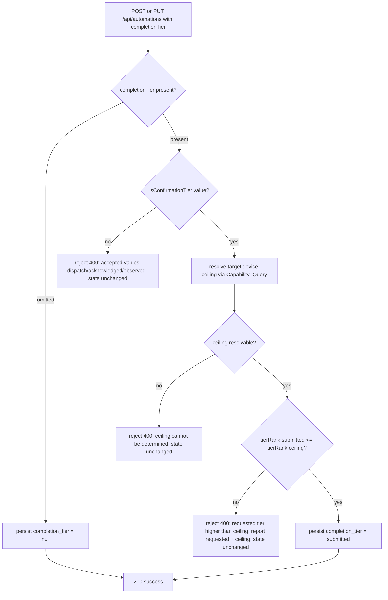
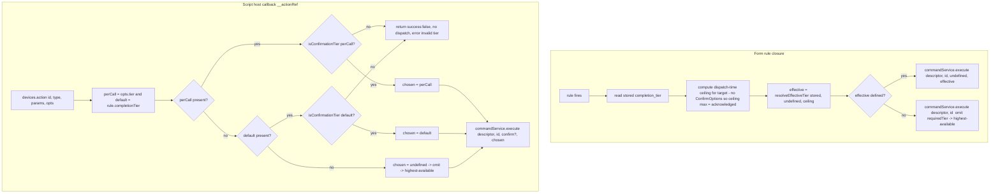

# Design Document

## Overview

Today Aeolus always dispatches an automation's command at the **highest tier the target device can prove**. `selectRequiredTier(hasConfirm, hasAckCapability)` (`src/automations/command-lifecycle.ts`) returns `observed` when `ConfirmOptions` are supplied, else `acknowledged` when the connector declares an acknowledgement capability, else `dispatch`. The author has no say: the form-rule closure in `registerUiRule()` (`src/api/routes/automation.routes.ts`) calls `actionExecutor.execute(descriptor, stored.id)` with no tier, the script host callback `__actionRef` (`src/automations/sandbox.ts`) calls `execute(..., confirm)` with no tier, and the `automation_rules` row (`StoredRule`) has no column for a chosen tier.

This feature makes the **completion tier** — which lifecycle step counts as SUCCESS for a given automation — an author-configurable choice, end to end. It does exactly one new thing conceptually: it **supplies a value** to the `requiredTier?: ConfirmationTier` input that `CommandService.execute()` already exposes (from **unified-command-boundary**). It does **not** build that input, define the lifecycle, or implement tier clamping — those are inherited.

Concretely, this feature adds:

1. **Persistence** — a nullable `completion_tier` column on `automation_rules`, threaded through `StoredRule`, the runtime `Rule`, and rule (de)serialization.
2. **A capability query** — a read operation reporting a device's `Capability_Ceiling` (which tiers it can actually prove), exposed as a REST endpoint the authoring UI consumes.
3. **Authoring validation** — the `POST/PUT /api/automations` routes validate a submitted `completion_tier` against the ceiling before persisting (reject over-ceiling, invalid, or unresolvable; accept equal/lower).
4. **Form-rule wiring** — pass the stored tier into `commandService.execute(descriptor, ruleId, confirm?, requiredTier?)`, falling back to omission when the stored tier is invalid or over-ceiling at dispatch time.
5. **Script-rule wiring** — deliver the rule-level default tier to the sandbox `devices.action()` host callback, support an optional per-call tier that overrides the default, and fail validation (no dispatch, `success:false`) on an invalid tier.
6. **Backward compatibility** — absent tier ⇒ omit `requiredTier` ⇒ today's highest-available behavior; pre-existing rows read as `null`; list/read endpoints stay additive.

### The truthfulness guarantee is inherited, not re-implemented

A hard invariant — **never report or claim a tier that was not actually reached** — is owned by **verified-command-execution** and consumed through the `CommandService` boundary. This feature's only responsibility toward that invariant is to *supply a value* to `requiredTier`; the boundary validates/clamps it against device capability and returns a `lifecycleState` that was actually reached. Requirement 6 (truthful outcome) is therefore satisfied by the inherited mechanism. This feature adds a belt-and-suspenders defense: it never *supplies* a tier that exceeds the ceiling it can see at dispatch time — it omits `requiredTier` instead, so the boundary falls back to highest-available rather than clamping.

### Cross-spec dependencies (reused, not redefined)

- `ConfirmationTier` (`"dispatch" | "acknowledged" | "observed"`) and `selectRequiredTier()` — `src/automations/command-lifecycle.ts` (**verified-command-execution**).
- The `requiredTier` input on `CommandService.execute()`, the `CommandService` boundary, capability clamping, and the never-report-an-unreached-tier guarantee — **unified-command-boundary** (`CommandService`, the renamed `ActionExecutor`).
- `ConnectorManager.getAcknowledgementCapability(deviceId)`, `ConnectorManager.getActionCatalog(deviceId)`, `ActionResult` — **device-action-system-uplift** / **verified-command-execution**.

> Naming note: unified-command-boundary renames `ActionExecutor` → `CommandService` (file `src/automations/command-service.ts`) and adds the 4th `requiredTier` parameter. The current tree still has `ActionExecutor.execute(action, ruleId, confirm?)`. This design is written against the post-unified-command-boundary contract (`CommandService.execute(action, ruleId, confirm?, requiredTier?)`) because the requirements state that spec is complete. Where a symbol name matters below, both names are given.

## Architecture

### Component responsibilities

| Component | File | Change |
| --- | --- | --- |
| `automation_rules` schema | `src/db/migrations/004-automation-rules-completion-tier.ts` (new) | Adds nullable `completion_tier TEXT` column, guarded by `PRAGMA table_info` (Req 1.1, 1.5). Registered as migration id 4. |
| `StoredRule` row shape | `src/api/routes/automation.routes.ts` | Gains `completion_tier: string | null`; read in `SELECT *`, written on create/update, surfaced in list/read (Req 1.2–1.6, 7.6). |
| `Rule` runtime type | `src/core/types.ts` | Gains optional `completionTier?: ConfirmationTier` carried into the dispatch closure (Req 1.6, 4.3). |
| Completion-tier helpers | `src/automations/completion-tier.ts` (new) | Pure functions: `isConfirmationTier()`, `computeCapabilityCeiling()`, `tierRank()`, `resolveEffectiveTier()`, `validateAgainstCeiling()` (Req 2, 3, 4.5–4.6, 5). |
| Capability query | `src/connectors/connector-manager.ts` (read-only add) + `src/api/routes/device.routes.ts` | New `GET /api/devices/:id/completion-tiers` endpoint reporting `Capability_Ceiling` derived from `getAcknowledgementCapability()` + observation availability (Req 2). |
| Authoring validation | `src/api/routes/automation.routes.ts` (`POST`/`PUT`) + `src/api/schemas/automation.schemas.ts` | Accepts optional `completionTier`; validates against ceiling before persisting; rejects invalid/over-ceiling/unresolvable (Req 3, 7.3–7.4). |
| Form-rule wiring | `src/api/routes/automation.routes.ts` (`registerUiRule` form branch) | Passes resolved tier into `commandService.execute(descriptor, id, undefined, effectiveTier)`; omits when invalid/over-ceiling (Req 4). |
| Script-rule wiring | `src/automations/sandbox.ts` (`__actionRef`, `BOOTSTRAP_SCRIPT`) + `registerUiRule` script branch | Threads rule-level default into the sandbox; supports optional per-call tier arg overriding the default; invalid tier ⇒ `success:false` without dispatch (Req 5). |
| Sandbox type surface | `src/automations/sandbox-types.d.ts` | Adds optional `tier` field to the `devices.action()` confirm/options surface (Req 5.2). |
| Authoring UI | `frontend/src/components/AutomationsPage.tsx` | Capability-aware tier selector that fetches `/completion-tiers` and offers only in-ceiling tiers, blocking over-ceiling (Req 2, 3). |

### Where each concept lives

- **Capability_Ceiling computation** is pure and lives in `completion-tier.ts`, fed by two facts read from existing surfaces: (a) `ConnectorManager.getAcknowledgementCapability(deviceId)?.supported === true`, and (b) whether an observation source is available for the command. It is exercised by the REST capability query (authoring time) and by the form/script dispatch fallback (dispatch time).
- **Author choice capture** lives in the Authoring_Endpoint (validation + persistence) and the `automation_rules` row.
- **Choice delivery** lives in the two dispatch paths (form closure, sandbox host callback), each of which computes an *effective* tier via `resolveEffectiveTier()` and either supplies it to `CommandService.execute()` or omits it.

### Observation availability at authoring time vs dispatch time

`observed` requires an observation source: `ConfirmOptions` identifying an `Observed_Device` present in the registry. For **form rules**, the form-rule closure supplies **no** `ConfirmOptions` (`registerUiRule` calls `execute(descriptor, id)` with no confirm), so `observed` is **not** provable for a form rule and the ceiling for a form target is at most `acknowledged`. For **script rules**, whether `observed` is provable depends on the per-call `confirm` the script supplies, which is not known at authoring time. The capability query therefore reports observation availability as a function of an explicitly supplied/known observation source; the authoring UI treats `observed` as selectable for a device only when the query reports it. This keeps the never-claim-unreached guarantee intact: if the author picks `observed` but the runtime command carries no observation source, the dispatch-time ceiling is below `observed` and the path omits `requiredTier` (Req 4.6) rather than claiming observation.

### Flow — authoring validation (POST/PUT /api/automations)



### Flow — dispatch-time tier resolution (form and script)



Note the asymmetry the requirements demand: at **authoring** time an invalid or over-ceiling *form* tier is rejected by the endpoint (Req 3); at **dispatch** time an invalid or over-ceiling *form* tier is defensively **omitted** (Req 4.5, 4.6) rather than failing the command, because the stored value already passed authoring validation and a mismatch means the device capability changed after authoring. For **script** rules, an invalid tier (per-call or rule-level default) is a **hard validation failure** producing `success:false` without dispatch (Req 5.5, 5.6), because a script tier is not pre-validated by the authoring endpoint.

## Components and Interfaces

### A. Migration — `completion_tier` column (Req 1.1, 1.5)

Follows the guarded `PRAGMA table_info` pattern of `002-automation-rules-columns.ts` and is registered in `src/db/migrations/index.ts` as id 4.

```typescript
// src/db/migrations/004-automation-rules-completion-tier.ts (new)
import type { Database as DatabaseType } from "better-sqlite3";
import type { Migration } from "./index.js";

/**
 * Adds the nullable completion_tier column to automation_rules.
 *
 * Guarded: checks PRAGMA table_info before the ALTER so it is a safe no-op when
 * the column already exists. The column has no NOT NULL / DEFAULT so pre-existing
 * rows read as NULL without a rewrite (Req 1.5).
 */
export const automationRulesCompletionTier: Migration = {
  id: 4,
  name: "automation-rules-completion-tier",
  up(db: DatabaseType): void {
    const existing = new Set(
      (db.prepare("PRAGMA table_info(automation_rules)").all() as Array<{ name: string }>)
        .map((c) => c.name),
    );
    if (!existing.has("completion_tier")) {
      db.exec("ALTER TABLE automation_rules ADD COLUMN completion_tier TEXT DEFAULT NULL;");
    }
  },
};
```

```typescript
// src/db/migrations/index.ts (registry addition)
import { automationRulesCompletionTier } from "./004-automation-rules-completion-tier.js";

export const migrations: Migration[] = [
  baseline,                     // id 1
  automationRulesColumns,       // id 2
  devicesRemoveCheck,           // id 3
  automationRulesCompletionTier // id 4
];
```

No stored `CHECK` constraint is added: the value domain (`dispatch|acknowledged|observed|null`) is enforced by the Authoring_Endpoint and by `isConfirmationTier()` at read time, keeping the column tolerant of legacy rows (Req 1.5) and consistent with how `rule_type` is guarded in application code rather than by a DB constraint.

### B. `StoredRule` / `Rule` additions and (de)serialization (Req 1.2–1.6, 7.6)

```typescript
// src/api/routes/automation.routes.ts — StoredRule row shape
interface StoredRule {
  // ...existing fields...
  cron_expression: string | null;
  completion_tier: string | null; // NEW — "dispatch" | "acknowledged" | "observed" | null
  enabled: number;
  created_at: number;
}
```

```typescript
// src/core/types.ts — Rule runtime type
import type { ConfirmationTier } from "../automations/command-lifecycle.js";

export interface Rule {
  id: string;
  topic: string;
  condition?: (context: EventContext) => boolean;
  action: (context: EventContext) => void | Promise<void>;
  name?: string;
  triggerType?: "mqtt" | "cron" | "none";
  cronExpression?: string;
  compiled_js?: string;
  /** Author-chosen completion tier, when stored and valid. Absent ⇒ highest-available. */
  completionTier?: ConfirmationTier; // NEW (Req 1.6, 4.3)
}
```

Serialization touch-points in `automation.routes.ts`:

- **INSERT (create)** — add `completion_tier` to the column list and bind the validated value (or `null`). Both the form and script INSERT statements gain the column.
- **UPDATE** — add `completion_tier = ?` and bind the validated value; on update the value fully replaces the prior one (Req 1.4).
- **`SELECT *`** already returns the new column; `queryRuleById` and the list handler read `row.completion_tier`.
- **List/read response (Req 7.6)** — the existing fields are unchanged; a new `completionTier` field is *added* to each entry (additive only). Clients unaware of it ignore it:

```typescript
// GET /api/automations list handler — additive field
entry.completionTier = normalizeTier(row.completion_tier); // ConfirmationTier | null
```

`registerUiRule()` reads `stored.completion_tier`, normalizes it through `isConfirmationTier`, and attaches `completionTier` to the runtime `Rule` (form path) or treats it as the rule-level default (script path). Requirement 1.7 (internal error resolving a stored tier disables the rule) is handled here: if reading/normalizing the stored tier throws, `registerUiRule` logs and does **not** register the rule (leaving it effectively disabled) rather than registering it with an unresolved tier.

### C. Pure completion-tier helpers (Req 2, 3, 4, 5)

```typescript
// src/automations/completion-tier.ts (new)
import type { ConfirmationTier } from "./command-lifecycle.js";

const TIER_RANK: Record<ConfirmationTier, number> = {
  dispatch: 0,
  acknowledged: 1,
  observed: 2,
};

/** Type guard: exactly one of the three tier strings (Req 3.5, 5.4). */
export function isConfirmationTier(value: unknown): value is ConfirmationTier {
  return value === "dispatch" || value === "acknowledged" || value === "observed";
}

/** Ordinal used for ceiling comparisons: dispatch < acknowledged < observed. */
export function tierRank(tier: ConfirmationTier): number {
  return TIER_RANK[tier];
}

/**
 * Compute the Capability_Ceiling as the ordered list of provable tiers plus the
 * single highest tier. `dispatch` is universal for a dispatchable device (Req 2.1);
 * `acknowledged` requires a declared ack capability (Req 2.2, 2.3); `observed`
 * requires an available observation source (Req 2.4, 2.5).
 */
export function computeCapabilityCeiling(input: {
  dispatchable: boolean;         // false ⇒ device cannot dispatch (Req 2.7)
  ackSupported: boolean;         // getAcknowledgementCapability()?.supported === true
  observationAvailable: boolean; // ConfirmOptions identify a present Observed_Device
}): { tiers: ConfirmationTier[]; ceiling: ConfirmationTier | null } {
  if (!input.dispatchable) return { tiers: [], ceiling: null }; // Req 2.7, 2.8
  const tiers: ConfirmationTier[] = ["dispatch"];
  if (input.ackSupported) tiers.push("acknowledged");
  if (input.observationAvailable) tiers.push("observed");
  const ceiling = tiers.reduce((hi, t) => (tierRank(t) > tierRank(hi) ? t : hi), "dispatch");
  return { tiers, ceiling };
}

/** Authoring-time validation outcome. */
export type TierValidation =
  | { ok: true; tier: ConfirmationTier | null }
  | { ok: false; code: "invalid" | "over_ceiling" | "ceiling_unresolvable"; message: string };

/**
 * Validate a submitted tier against a ceiling for the Authoring_Endpoint (Req 3).
 * - undefined/null submitted ⇒ accept as null (Req 7.4).
 * - not a tier string ⇒ invalid (Req 3.5).
 * - ceiling null ⇒ ceiling_unresolvable (Req 3.6).
 * - rank(submitted) > rank(ceiling) ⇒ over_ceiling (Req 3.4).
 * - rank(submitted) <= rank(ceiling) ⇒ accept (Req 3.2, 3.3).
 */
export function validateAgainstCeiling(
  submitted: unknown,
  ceiling: ConfirmationTier | null,
): TierValidation {
  if (submitted === undefined || submitted === null) return { ok: true, tier: null };
  if (!isConfirmationTier(submitted)) {
    return { ok: false, code: "invalid",
      message: "completionTier must be one of: dispatch, acknowledged, observed" };
  }
  if (ceiling === null) {
    return { ok: false, code: "ceiling_unresolvable",
      message: "Cannot determine the target device's capability ceiling" };
  }
  if (tierRank(submitted) > tierRank(ceiling)) {
    return { ok: false, code: "over_ceiling",
      message: `Requested tier '${submitted}' exceeds device capability ceiling '${ceiling}'` };
  }
  return { ok: true, tier: submitted };
}

/**
 * Resolve the effective dispatch-time tier to hand CommandService.execute().
 * Precedence: an action-specified tier overrides the stored/default (Req 5.2);
 * an unrecognized value ⇒ omit (Req 4.5); a value above the ceiling ⇒ omit
 * (Req 4.6); otherwise the value itself. `undefined` return ⇒ omit requiredTier
 * so the boundary selects highest-available (Req 4.2, 5.3, 7.1, 7.5).
 */
export function resolveEffectiveTier(
  stored: unknown,
  actionSpecified: unknown,
  ceiling: ConfirmationTier | null,
): ConfirmationTier | undefined {
  const chosen = actionSpecified !== undefined ? actionSpecified : stored;
  if (chosen === undefined || chosen === null) return undefined;
  if (!isConfirmationTier(chosen)) return undefined;                 // Req 4.5
  if (ceiling !== null && tierRank(chosen) > tierRank(ceiling)) return undefined; // Req 4.6
  return chosen;
}
```

> `resolveEffectiveTier` is the pure helper the prompt calls out. Note its **omit-on-doubt** contract for the form path. The script path uses `isConfirmationTier` directly for its **fail-on-invalid** semantics (Req 5.5/5.6) *before* calling `resolveEffectiveTier`, because those requirements demand a `success:false` result rather than a silent omit.

### D. Capability query + REST endpoint (Req 2)

A thin read-only method on `ConnectorManager` composes the two existing facts; the REST route surfaces them. `ConnectorManager.getAcknowledgementCapability(deviceId)` and `DeviceRegistry.getById(deviceId)` already exist.

```typescript
// src/connectors/connector-manager.ts (read-only addition)
/**
 * Report the completion-tier capability ceiling for a device. Pure composition of
 * existing capability reads; performs no dispatch. `observationAvailable` reflects
 * a known/observation source supplied by the caller (default false, matching the
 * form-rule reality of no ConfirmOptions).
 */
getCompletionTierCapability(
  deviceId: string,
  observationAvailable = false,
): { resolved: boolean; tiers: ConfirmationTier[]; ceiling: ConfirmationTier | null } {
  const device = this.deviceRegistry.getById(deviceId);
  if (!device) return { resolved: false, tiers: [], ceiling: null }; // Req 2.8
  const ackSupported = this.getAcknowledgementCapability(deviceId)?.supported === true;
  const { tiers, ceiling } = computeCapabilityCeiling({
    dispatchable: true, // a resolvable registered device can dispatch (Req 2.1)
    ackSupported,
    observationAvailable,
  });
  return { resolved: true, tiers, ceiling };
}
```

```typescript
// src/api/routes/device.routes.ts — new endpoint
/** GET /api/devices/:id/completion-tiers — report the device's Capability_Ceiling (Req 2). */
router.get("/:id/completion-tiers", (req, res) => {
  const id = req.params.id as string;
  const cap = connectorManager.getCompletionTierCapability(id);
  if (!cap.resolved) {
    // Req 2.8 — device unresolvable: no tiers + explicit indication.
    res.status(404).json({ deviceId: id, resolved: false, availableTiers: [], ceiling: null,
      error: `Device not found: ${id}` });
    return;
  }
  res.json({ deviceId: id, resolved: true, availableTiers: cap.tiers, ceiling: cap.ceiling });
});
```

**Response shape** (`200`):

```jsonc
{
  "deviceId": "controller-1",
  "resolved": true,
  "availableTiers": ["dispatch", "acknowledged"], // subset of the vocabulary, ordered low→high (Req 2.6)
  "ceiling": "acknowledged"                        // highest provable tier, or null (Req 2.6)
}
```

Unresolvable device (`404`): `{ deviceId, resolved: false, availableTiers: [], ceiling: null, error }` (Req 2.8). This is a **new additive endpoint**; the existing `GET /api/devices/:id/actions` is untouched, keeping list/read responses backward-compatible (Req 7.6).

### E. Authoring validation wiring (Req 3, 7.3–7.4)

```typescript
// src/api/schemas/automation.schemas.ts — additive optional field on both schemas
completionTier: z.enum(["dispatch", "acknowledged", "observed"]).optional().nullable(),
```

The zod enum rejects malformed *types* early; the endpoint still calls `validateAgainstCeiling` so that an over-ceiling or unresolvable case is rejected with the specific error the requirements mandate (and so that a raw non-enum string yields the exact `invalid` message rather than a generic zod error path). In the `POST` and `PUT` handlers, immediately before persisting a form rule:

```typescript
// automation.routes.ts (form branch of POST and PUT)
const ceiling = registry.getById(actionTarget)
  ? connectorManager.getCompletionTierCapability(actionTarget).ceiling
  : null;
const v = validateAgainstCeiling(req.body.completionTier, ceiling);
if (!v.ok) {
  // Nothing is written; stored state unchanged (Req 3.4, 3.5, 3.6, 3.7).
  throw new BadRequestError(v.message);
}
// v.tier is ConfirmationTier | null — bind into INSERT/UPDATE and register.
```

Because validation runs **before** the `INSERT`/`UPDATE` and before `registerUiRule`, a rejected request leaves both the stored row and the registered rule unchanged, and never re-registers with the rejected tier (Req 3.1, 3.7). `createDeviceRoutes`/automation routes need a `ConnectorManager` (or a narrow capability-query dependency) injected — the composition root in `src/index.ts` already constructs both, so this is a wiring addition, not a new dependency source.

> Script rules: the authoring endpoint validates a submitted rule-level default the same way when a single unambiguous target exists; where a script targets many devices, the rule-level default is validated for *format* (`isConfirmationTier`) at authoring time and against each device's ceiling at dispatch time (Section F), consistent with Req 5.6.

### F. Form-rule and script-rule dispatch wiring (Req 4, 5)

**Form rule** (`registerUiRule`, form branch):

```typescript
const params = JSON.parse(stored.action_params);
const storedTier = isConfirmationTier(stored.completion_tier) ? stored.completion_tier : undefined;
const action = async (_ctx: EventContext) => {
  const descriptor: ActionDescriptor = { type: stored.action_type, target: stored.action_target, params };
  // Form rules supply no ConfirmOptions ⇒ dispatch-time ceiling max is "acknowledged".
  const ceiling = connectorManager.getCompletionTierCapability(stored.action_target).ceiling;
  const effective = resolveEffectiveTier(storedTier, undefined, ceiling);
  return commandService.execute(descriptor, stored.id, undefined, effective); // undefined ⇒ omitted
};
```

`effective === undefined` means the closure calls `execute(descriptor, id, undefined, undefined)`, which is behaviorally identical to today's `execute(descriptor, id)` — highest-available (Req 4.2, 4.5, 4.6, 7.1, 7.5). When the stored tier is present, valid, and within ceiling, it is supplied verbatim (Req 4.1, 4.3). Because `registerUiRule` runs on every create/update/toggle, a changed stored tier is reflected on subsequent dispatches (Req 4.4).

**Script rule** — the rule-level default reaches the sandbox host callback, and an optional per-call tier overrides it. The `devices.action()` surface gains an optional `tier` on its 4th options argument.

```typescript
// registerUiRule (script branch): capture rule-level default for the sandbox
const ruleTierDefault = isConfirmationTier(stored.completion_tier) ? stored.completion_tier : undefined;
// passed to the engine/sandbox execution context for this rule (see sandbox wiring)
```

```typescript
// sandbox.ts — __actionRef gains a tier argument (per-call), and the closure is
// constructed with the rule-level default in scope.
const ruleTierDefault: ConfirmationTier | undefined = /* provided per rule execution */;
new ivm.Reference(async function (
  deviceId, actionType, params, condition, confirmDeviceId, confirmTimeoutMs,
  perCallTier?: unknown,
): Promise<ActionResult> {
  // Fail-on-invalid semantics (Req 5.5, 5.6) BEFORE dispatch:
  if (perCallTier !== undefined && !isConfirmationTier(perCallTier)) {
    return { success: false, error: `Invalid completion tier '${String(perCallTier)}'`,
      lifecycleState: "FAILED" };
  }
  if (perCallTier === undefined && ruleTierDefault !== undefined && !isConfirmationTier(ruleTierDefault)) {
    return { success: false, error: `Invalid rule-level completion tier '${String(ruleTierDefault)}'`,
      lifecycleState: "FAILED" };
  }
  const confirm = buildConfirmOptions(condition, confirmDeviceId, confirmTimeoutMs);
  // Precedence handled by resolveEffectiveTier: per-call overrides default (Req 5.1, 5.2, 5.3).
  const chosen = resolveEffectiveTier(ruleTierDefault, perCallTier, /* ceiling */ null);
  return actionExecutor.execute(
    { type: "device_action", target: deviceId, params: { actionType, ...(params ?? {}) } },
    ruleId, confirm, chosen,
  );
});
```

The `BOOTSTRAP_SCRIPT` `devices.action` wrapper forwards the tier from an options object. To stay backward compatible with the existing `confirm` object shape, the 4th script-facing argument is an options bag that may carry `condition`/`deviceId`/`timeoutMs` **and** an optional `tier`:

```javascript
// BOOTSTRAP_SCRIPT devices.action (extended, preserves 3-arg form byte-for-byte)
action: function(deviceId, actionType, params, opts) {
  var hasConfirm = opts && typeof opts.condition === 'function';
  var tier = opts && opts.tier;           // string | undefined
  if (hasConfirm) {
    return actionRef.apply(undefined,
      [deviceId, actionType, params, opts.condition, opts.deviceId, opts.timeoutMs, tier],
      { result: { promise: true } });
  }
  return actionRef.apply(undefined,
    [deviceId, actionType, params, undefined, undefined, undefined, tier],
    { result: { promise: true } });
}
```

The rule-level default is delivered to the sandbox per execution (the engine already constructs sandbox host refs per rule via `setDevicesRefs(jail, ruleId)`); the rule's `completionTier` is passed alongside `ruleId` so the closure closes over `ruleTierDefault`. Note (per unified-command-boundary) truthful script aggregation depends on the script `await`ing its actions; that dependency is inherited and unchanged here.

> `resolveEffectiveTier` is called with `ceiling = null` inside the script host callback because the tier the script supplies is passed straight to `CommandService.execute()`, whose inherited clamping validates it against the *live* device capability and never reports an unreached tier (Req 6). The script path deliberately does not pre-omit on ceiling; it relies on the boundary's clamp, and only hard-fails on a *malformed* tier value (Req 5.5, 5.6).

### G. Authoring UI — capability-aware tier selector (Req 2, 3)

`AutomationsPage.tsx` gains a `completionTier` field in `form` state and a selector rendered in the form-rule editor next to the action target. When `actionTarget` (device id) changes, the page fetches `GET /api/devices/:id/completion-tiers` and:

- Renders one option per `availableTiers` entry plus a default "Highest available (auto)" option that maps to omitting `completionTier`.
- Disables/blocks tiers above `ceiling` (over-ceiling is not selectable), surfacing a short warning if a previously-stored tier is now over-ceiling.
- Sends `completionTier` in the `createFormRule` / update body only when the author picks an explicit tier (otherwise omits it, preserving Req 7.3/7.4).

```typescript
// createFormRule body (additive)
body: JSON.stringify({
  name: form.name,
  triggerTopic: form.triggerTopic,
  conditionType: form.conditionType || undefined,
  conditionValue: form.conditionValue || undefined,
  actionType: form.actionType,
  actionTarget,
  actionParams,
  ...(form.completionTier ? { completionTier: form.completionTier } : {}),
}),
```

The selector is UI presentation; its correctness (only in-ceiling tiers offered, over-ceiling blocked) mirrors the server-side `validateAgainstCeiling` which remains the authoritative guard.

## Data Models

### Persisted: `automation_rules.completion_tier`
Nullable `TEXT` column. Domain: `"dispatch" | "acknowledged" | "observed" | NULL`. Enforced by the Authoring_Endpoint and `isConfirmationTier()`, not a DB `CHECK` (Req 1.1, 1.5). Legacy rows read as `NULL` (Req 1.5).

### Row shape: `StoredRule`
Existing fields unchanged; `completion_tier: string | null` added (Section B).

### Runtime: `Rule.completionTier`
Optional `ConfirmationTier` on the runtime `Rule` (Section B), carried into the form dispatch closure and used as the script rule-level default.

### Reused (not redefined)
- `ConfirmationTier = "dispatch" | "acknowledged" | "observed"` — `src/automations/command-lifecycle.ts`.
- `ActionResult` (with optional `lifecycleState`, `correlationId`) — `src/core/types.ts`.
- `ConfirmOptions`, `DEFAULT_CONFIRM_TIMEOUT_MS` — `src/core/types.ts`.
- `AcknowledgementCapability` — `src/connectors/connector.interface.ts`.

### Capability-query response (transient, API)
```typescript
interface CompletionTierCapabilityResponse {
  deviceId: string;
  resolved: boolean;                        // false ⇒ device unresolvable (Req 2.8)
  availableTiers: ConfirmationTier[];       // ordered low→high, subset of the vocabulary (Req 2.6)
  ceiling: ConfirmationTier | null;         // highest provable tier, or null when unresolvable
}
```

## Correctness Properties

*A property is a characteristic or behavior that should hold true across all valid executions of a system — essentially, a formal statement about what the system should do. Properties serve as the bridge between human-readable specifications and machine-verifiable correctness guarantees.*

These properties were derived from the prework analysis and consolidated to remove redundancy. They target this feature's **pure, deterministic logic** — capability-ceiling computation, authoring validation, effective-tier resolution, the script-tier failure gate, and tier persistence round-tripping — all amenable to property-based testing with `fast-check`. Requirement 6 (truthful outcome relative to the chosen tier) is enforced by the inherited lifecycle/clamping mechanism (verified-command-execution) reached through `CommandService`; it is covered by integration tests in the Testing Strategy rather than by properties here, with the feature-side contribution (never *supply* an over-ceiling tier) captured by Property 5.

### Property 1: Capability ceiling reflects exactly the provable tiers

*For any* capability input `{ dispatchable, ackSupported, observationAvailable }`, `computeCapabilityCeiling` returns `tiers` that (a) is empty when `dispatchable` is false, and otherwise (b) contains `dispatch`, contains `acknowledged` if and only if `ackSupported` is true, and contains `observed` if and only if `observationAvailable` is true; every element of `tiers` is one of `dispatch`/`acknowledged`/`observed`; and `ceiling` is the highest-rank member of `tiers` (or `null` when `tiers` is empty).

**Validates: Requirements 2.1, 2.2, 2.3, 2.4, 2.5, 2.6, 2.7**

### Property 2: Authoring validation classifies every submission against the ceiling

*For any* submitted value and any ceiling (including `null`), `validateAgainstCeiling` returns: `{ ok: true, tier: null }` when the submission is `null`/`undefined`; `{ ok: false, code: "invalid" }` when the submission is a non-`null` value outside the tier vocabulary; `{ ok: false, code: "ceiling_unresolvable" }` when the submission is a valid tier but the ceiling is `null`; `{ ok: false, code: "over_ceiling" }` when the submission is a valid tier whose rank exceeds the ceiling's rank; and `{ ok: true, tier: submitted }` when the submission is a valid tier whose rank is less than or equal to the ceiling's rank.

**Validates: Requirements 3.2, 3.3, 3.4, 3.5, 3.6, 7.4**

### Property 3: Effective-tier resolution honors precedence and passes through in-ceiling tiers

*For any* stored/default tier, action-specified tier, and ceiling, `resolveEffectiveTier` prefers the action-specified value when it is defined and otherwise uses the stored/default value; and when that chosen value is a valid tier within the ceiling (or the ceiling is `null`), the function returns exactly that value.

**Validates: Requirements 1.8, 4.1, 4.3, 5.1, 5.2, 6.7**

### Property 4: Effective-tier resolution omits on absence, invalidity, or over-ceiling, and never returns an out-of-vocabulary value

*For any* stored/default tier, action-specified tier, and ceiling, `resolveEffectiveTier` returns `undefined` (signaling "omit `requiredTier`, use highest-available") whenever the chosen value is absent, is not exactly one of `dispatch`/`acknowledged`/`observed`, or has a rank greater than a non-`null` ceiling; and in all cases the return value is either `undefined` or one of the three vocabulary tiers.

**Validates: Requirements 4.2, 4.5, 4.6, 5.3, 5.4, 7.1, 7.5**

### Property 5: An invalid script tier fails validation without dispatching

*For any* per-call tier and rule-level default where the selected script tier (per-call when defined, else the default) is a non-`null` value outside the tier vocabulary, the `devices.action()` host callback returns a `Command_Result` with `success === false` and an error naming the invalid tier value, and never invokes `CommandService.execute()`.

**Validates: Requirements 5.5, 5.6**

### Property 6: Completion tier persists as a last-write round-trip

*For any* sequence of allowed values (`dispatch`/`acknowledged`/`observed`/`null`) written to a rule's completion tier via create then update, loading the rule returns exactly the most recently written value, and a rule created without a tier loads as `null`.

**Validates: Requirements 1.1, 1.2, 1.4**

## Error Handling

- **Invalid submitted tier (authoring)** — `validateAgainstCeiling` returns `code: "invalid"`; the endpoint throws `BadRequestError` with a message listing the accepted values. No `INSERT`/`UPDATE` runs; the rule is not registered/re-registered (Req 3.5, 3.7).
- **Over-ceiling submitted tier (authoring)** — `code: "over_ceiling"`; `BadRequestError` naming the requested tier and the device's ceiling. Stored state unchanged (Req 3.4, 3.7).
- **Unresolvable ceiling (authoring)** — device not in the registry or no ceiling; `code: "ceiling_unresolvable"`; `BadRequestError` indicating the ceiling cannot be determined. Stored state unchanged (Req 3.6).
- **Unresolvable device (capability query)** — `GET /api/devices/:id/completion-tiers` returns `404` with `{ resolved: false, availableTiers: [], ceiling: null, error }` (Req 2.8).
- **Invalid/over-ceiling stored tier at form dispatch** — never fails the command; `resolveEffectiveTier` returns `undefined` and the closure omits `requiredTier`, so the boundary selects highest-available (Req 4.5, 4.6).
- **Invalid script tier (per-call or rule-level default)** — the host callback returns `{ success: false, error, lifecycleState: "FAILED" }` and does not dispatch (Req 5.5, 5.6). This is a hard failure because script tiers are not pre-validated by the authoring endpoint.
- **Internal error resolving a stored tier at load** — `registerUiRule` logs the error and does not register the rule, so it never dispatches with an unresolved tier (Req 1.7).
- **Truthful outcome** — success-vs-tier semantics and the never-report-an-unreached-tier guarantee are enforced by the inherited `CommandService`/lifecycle mechanism; this feature adds no new reporting path and cannot fabricate a tier (Req 6.4, 6.5).

## Testing Strategy

### Property-based tests (vitest + fast-check)

Repo conventions: co-located `*.property.test.ts`, `fast-check` arbitraries, `{ numRuns: 100 }` minimum (existing tests use 100–200), and each property tagged with a comment `// Feature: command-completion-tier, Property N: <text>`. Each of the six correctness properties maps to a **single** property-based test.

- `src/automations/completion-tier.property.test.ts` — Properties 1–4 over `computeCapabilityCeiling`, `validateAgainstCeiling`, and `resolveEffectiveTier`. Arbitraries: `fc.constantFrom("dispatch","acknowledged","observed")` for tiers, `fc.option(...)`/`fc.oneof` including non-tier strings and `null`/`undefined` for invalid inputs, and `fc.record` of booleans for capability inputs.
- `src/automations/sandbox.property.test.ts` (addition) — Property 5, using a mock `CommandService.execute` (spy) to assert `success:false` and zero invocations for invalid script tiers across generated non-tier values and default/per-call source combinations.
- `src/api/routes/automation.routes.property.test.ts` (addition) or a focused persistence property test with an in-memory better-sqlite3 database + the migration — Property 6, generating sequences of allowed values and asserting last-write round-trip.

### Example / edge-case unit tests

- Migration `004`: applies on a fresh DB and is a guarded no-op when the column exists; a legacy row (created before the column) reads `completion_tier` as `null` without rewrite (Req 1.5, 7.5).
- Authoring endpoint: omitted `completionTier` persists `null` and returns success (Req 1.3, 7.3, 7.4); over-ceiling `PUT` leaves stored tier and registration unchanged (Req 3.1, 3.7); unresolvable-device create is rejected (Req 3.6).
- Capability query endpoint: dispatchable+ack device reports `["dispatch","acknowledged"]` with ceiling `acknowledged`; missing device returns `404` with `resolved:false` (Req 2.8).
- `registerUiRule`: attaches `completionTier` to the runtime `Rule` and the form closure supplies it; a re-registered rule with a changed tier supplies the new value; a throw during tier resolution leaves the rule unregistered (Req 1.6, 1.7, 4.3, 4.4).
- List/read backward compatibility: existing fields present and unchanged, `completionTier` additive (Req 7.6).

### Integration tests (inherited truthfulness — Req 6)

Through `CommandService` (with the inherited lifecycle/tracker), verify that supplying `requiredTier` of `dispatch`/`acknowledged`/`observed` yields success only upon reaching the corresponding lifecycle state, that a lower chosen tier succeeds at the lower state, and that a timeout yields `success:false` with a terminal failure state. These exercise the inherited mechanism reached via the new wiring; 1–3 representative examples each (behavior does not vary meaningfully with input beyond the tier), not property tests.

### Requirement → property / test mapping

| Requirement | Acceptance criteria | Coverage |
| --- | --- | --- |
| 1 Persistence | 1.1, 1.2, 1.4 | Property 6 |
|  | 1.3 | Example (omitted ⇒ null) |
|  | 1.5 | Edge-case (legacy row reads null) |
|  | 1.6 | Example (`registerUiRule` attaches tier) |
|  | 1.7 | Example (error ⇒ rule not registered) |
|  | 1.8 | Property 3 (default precedence) |
| 2 Capability ceiling | 2.1, 2.2, 2.3, 2.4, 2.5, 2.6, 2.7 | Property 1 |
|  | 2.8 | Example (unresolvable device ⇒ 404) |
| 3 Authoring validation | 3.2, 3.3, 3.4, 3.5, 3.6 | Property 2 |
|  | 3.1, 3.7 | Example (reject leaves state unchanged) |
| 4 Form-rule wiring | 4.1, 4.3 | Property 3 |
|  | 4.2, 4.5, 4.6 | Property 4 |
|  | 4.4 | Example (changed tier after re-register) |
| 5 Script-rule wiring | 5.1, 5.2 | Property 3 |
|  | 5.3, 5.4 | Property 4 |
|  | 5.5, 5.6 | Property 5 |
| 6 Truthful outcome | 6.1, 6.2, 6.3, 6.4, 6.5, 6.6 | Integration (inherited mechanism) |
|  | 6.7 | Property 3 (pass-through) + integration |
| 7 Backward compatibility | 7.1, 7.5 | Property 4 |
|  | 7.2, 7.3, 7.4, 7.6 | Example |
|  | 7.4 | Property 2 (null accept) + example |

Every acceptance criterion in Requirements 1–7 is covered by a correctness property, an example/edge-case unit test, or an inherited-mechanism integration test as tabulated above.
