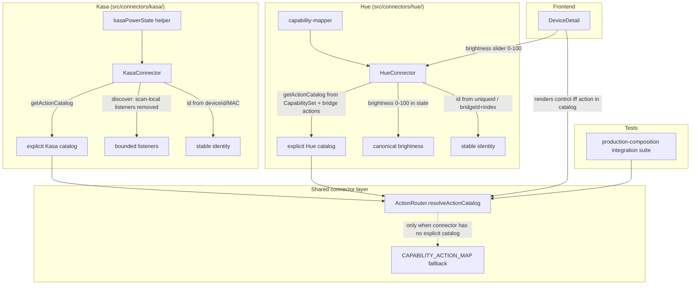

# Design Document: Connector Correctness Release Gates

## Overview

This design brings the bundled Hue and Kasa connectors into conformance with the
Action Catalog and multi-instance contracts the rest of the platform already
enforces, and adds the production-composition integration coverage that would
have caught the divergence. The work is deliberately confined to the connector
layer, the capability/action mapping, the generic `DeviceDetail` pane, connector
snippets, and one new integration test. It does not touch the command boundary,
authorization, scope resolution or the sandbox.

The unifying idea is **each connector becomes the source of truth for what its
devices can do and who they are**:

- power state is read through one canonical helper (Kasa);
- the action catalog is produced explicitly by the connector rather than guessed
  from a generic capability-string fallback (Hue and Kasa);
- brightness is one representation platform-wide, translated only at the Hue API
  boundary;
- device identity comes from an immutable native identifier, not a bridge-local
  index or an editable alias.

## Architecture



### Why explicit catalogs

`ActionRouter.resolveActionCatalog()` already prefers a connector-provided
`getActionCatalog()` over the `CAPABILITY_ACTION_MAP` fallback. The fallback map
was the source of the Hue mismatches (H5): it is keyed `color-temp` while Hue
advertises the `color-temperature` capability, and it has no `rename`/`delete`
entries. Rather than patch the fallback map to match Hue (which would leak
Hue-specific knowledge into a generic table and still guess), each connector
supplies its own catalog. The fallback remains for generic/MQTT devices and any
connector that legitimately has no richer knowledge.

## Components and Interfaces

### Kasa: canonical power-state helper (H1, H2)

A small pure helper, colocated with the connector, is the single place that
interprets Kasa `sysInfo`:

```typescript
// src/connectors/kasa/kasa-power-state.ts

/** Raw Kasa sysInfo shape (subset Aeolus reads). */
export interface KasaSysInfo {
  relay_state?: number;
  light_state?: { on_off?: number };
}

/**
 * Resolve on/off for any Kasa device.
 * Bulbs report light_state.on_off; plugs/switches report relay_state.
 * light_state takes precedence when present; otherwise relay_state.
 * Absent both → false.
 */
export function kasaPowerState(sysInfo: KasaSysInfo | undefined): boolean {
  const lightOnOff = sysInfo?.light_state?.on_off;
  if (lightOnOff !== undefined) return lightOnOff === 1;
  return sysInfo?.relay_state === 1;
}
```

`mapDevice()` and the `toggle` case in `execute()` both call `kasaPowerState()`.
This replaces the current precedence-buggy inline expression and the
`relay_state`-only toggle read.

### Kasa: explicit action catalog and honest capabilities (H3)

`KasaConnector` gains `getActionCatalog(deviceId)` returning only the on/off
family (`toggle`, `on`, `off`) that `execute()` actually implements. Device
registration stops advertising unimplemented capabilities:

- bulbs: `capabilities: ["on/off"]` (was `["on/off", "brightness"]`);
- plugs: `capabilities: ["on/off"]` (was `["on/off", "energy-monitoring"]`).

Energy telemetry already read from `emeter` may remain in `device.state` for
display; it is state, not an advertised action, so it does not need a
`read-energy` action to be truthful. If brightness/energy actions are
implemented later, they are added to both `execute()` and `getActionCatalog()`
together (Req 2.6).

> Design choice: option 3 from the review (explicit `getActionCatalog()`) is
> preferred over option 2 (only trimming capabilities) because it makes the
> connector self-describing and future-proof, and it is symmetric with the Hue
> fix. Trimming the misleading capability strings is done as well, so the
> fallback map cannot re-introduce phantom actions.

### Kasa: bounded discovery listeners (H4)

`discoverDevices()` registers `device-new`/`device-online` for the duration of a
single scan and removes them when the scan settles. The scan promise resolves
from the existing `setTimeout`; listener removal happens in the same completion
path (a `finally`-style cleanup) so it runs on success, timeout and error:

```typescript
const handleDevice = (device: unknown) => { /* unchanged mapping */ };
client.on("device-new", handleDevice);
client.on("device-online", handleDevice);
try {
  await new Promise<void>((resolve) => {
    client.startDiscovery({ /* ... */ });
    setTimeout(() => { client.stopDiscovery(); resolve(); }, this.discoveryTimeout);
  });
} finally {
  client.off("device-new", handleDevice);
  client.off("device-online", handleDevice);
}
```

A fake-timer test asserts `client.listenerCount("device-new")` is identical
before and after N discovery cycles.

### Hue: explicit action catalog (H5)

`HueConnector` gains `getActionCatalog(deviceId)` built from the device's cached
`CapabilitySet` plus the bridge-management actions it implements:

| Capability / support | Descriptors produced |
|---|---|
| `on/off` (always) | `toggle`, `on`, `off` |
| `brightness` | `brightness` `{ brightness: 0–100 }` |
| `color` | `color` `{ hue: 0–65535, saturation: 0–254 }` |
| `color-temperature` | `color-temp` `{ ct: number }` |
| bridge management (always) | `rename` `{ name: string }`, `delete` `{}` |

The descriptor param schemas reuse the shapes already in
`CAPABILITY_ACTION_MAP` so validation semantics are unchanged, except `color-temp`
is now reachable (keyed off the connector, not the mismatched fallback string)
and `brightness` uses the canonical 0–100 schema (Req 5). `execute()` gains
explicit `on`/`off` cases (currently only `toggle` exists) so the advertised
`on`/`off` actions are truthful.

### Hue: canonical brightness (H6)

One representation, translated only at the Hue API boundary:

- `capability-mapper.extractDeviceState()` converts native `bri` (0–254) to
  Canonical_Brightness (0–100) when writing `state.brightness`:
  `Math.round((bri / 254) * 100)`.
- `HueConnector.execute()` already accepts 0–100 and converts to 0–254 for the
  bridge — unchanged.
- `DeviceDetail` slider becomes `min=0 max=100`.
- Hue snippets/examples updated to 0–100.

Because normalized state and command params now share the 0–100 representation,
`ActionRouter`'s optimistic `Object.assign(updatedState, action.params)` writes a
0–100 `brightness` into a 0–100 state model — no visible jump (Req 5.6). No
change to `ActionRouter` is required for this; it falls out of the unit choice.

### Device identity (H7)

Both connectors move identity to an immutable native identifier and keep the
display name separate.

- **Hue**: `uniqueid` is present on every raw light and is globally unique
  (it is the Zigbee MAC + endpoint). Device_Identity becomes
  `hue-<sanitised uniqueid>`. `deviceMap` (Aeolus id → bridge light index) is
  retained for API calls, keyed by the new id.
- **Kasa**: `deviceId`/MAC from `sysInfo` (`device.deviceId` on the
  tplink-smarthome device) becomes the identity: `kasa-<deviceId>`. The alias
  becomes `name` only.

Migration: **none.** Aeolus has no production users yet, so the identity change
is applied directly. Existing device IDs simply change; any panes, automations,
`automation_tab_assignments` or stored device state that referenced the old IDs
are acceptable collateral and are re-created by re-discovery / re-authoring. No
migration step, no `migrate-legacy-*` shim, and no known-limitation downgrade of
the multi-instance claim are added for this change. The one requirement is that
the new scheme is itself correct: IDs derive from an immutable native identity so
they are stable across polls and unique across instances going forward.

### Production-composition integration suite (Req 7)

A new suite under `src/__integration__/` (matching existing integration suites)
imports the same composition helpers `src/index.ts` uses. Where `src/index.ts`
performs side-effecting startup (HTTP listen, MQTT connect), the suite injects a
stub `MqttService` and stub connector instances but wires them through the real
`ConnectorManager`, `ActionRouter`, `CommandService`, `AutomationScopeResolver`
and resource-authorization middleware — i.e. it exercises the real dependency
graph, not hand-called setters.

## Data Models

### Kasa capability change

```typescript
// Before
capabilities: ["on/off", "brightness"]        // bulb
capabilities: ["on/off", "energy-monitoring"] // plug
// After
capabilities: ["on/off"]                       // both; energy stays in state only
```

### Hue device state brightness

```typescript
// Before (native)
state.brightness = rawLight.state.bri;            // 0–254
// After (canonical)
state.brightness = Math.round((rawLight.state.bri / 254) * 100); // 0–100
```

### Device identity

```typescript
// Hue: before → after
`hue-light-${index}`  →  `hue-${sanitise(rawLight.uniqueid)}`
// Kasa: before → after
`kasa-${alias-slug}`  →  `kasa-${device.deviceId}`   // deviceId = native id/MAC
```

## Correctness Properties

*A property is a characteristic that should hold across all valid executions.*

### Property 1: Kasa power state precedence is total and correct

*For any* `KasaSysInfo` value, `kasaPowerState` SHALL return `true` exactly when
`light_state.on_off === 1` (if `light_state` present) or, when `light_state` is
absent, when `relay_state === 1`; and `false` otherwise. It SHALL never throw.

**Validates: Requirements 1.2, 1.3, 1.4, 1.5, 1.7**

### Property 2: Kasa catalog advertises only implemented actions

*For any* discovered Kasa device, every action type in its `getActionCatalog`
result SHALL be one of `toggle`, `on`, `off`, and each SHALL be handled by
`execute()` without throwing an "unsupported action" error.

**Validates: Requirements 2.1, 2.2, 2.3, 2.4**

### Property 3: Kasa discovery listener count is invariant

*For any* number N ≥ 1 of consecutive `discoverDevices()` calls, the
`device-new` and `device-online` listener counts on the client after the N-th
scan SHALL equal the counts before the first scan.

**Validates: Requirements 3.1, 3.2, 3.3**

### Property 4: Hue catalog matches executable actions

*For any* Hue device with a given `CapabilitySet`, an action type is present in
`getActionCatalog` if and only if `execute()` implements it for that capability
set: `toggle`/`on`/`off`/`rename`/`delete` always; `brightness` iff
`hasBrightness`; `color` iff `hasColor`; `color-temp` iff `hasColorTemp`. No
catalog entry SHALL resolve to an "unsupported action type" in `execute()`.

**Validates: Requirements 4.1, 4.2, 4.3, 4.4, 4.6**

### Property 5: Hue brightness round-trips within canonical range

*For any* native `bri` in [0, 254], `extractDeviceState` SHALL produce a
`brightness` in [0, 100]; and *for any* canonical brightness in [0, 100],
`execute()` SHALL send a `bri` in [0, 254]. The stored state value and the value
a 0–100 slider emits SHALL be in the same representation.

**Validates: Requirements 5.1, 5.2, 5.3, 5.4, 5.6**

### Property 6: Device identity is stable and unique

*For any* two devices from two connector instances, their Device_Identity values
SHALL differ. *For any* single device observed across renames (Kasa) or index
shuffles (Hue), the Device_Identity SHALL be unchanged as long as the native
identifier is unchanged.

**Validates: Requirements 6.1, 6.2, 6.3, 6.4**

## Error Handling

| Scenario | Handling | User-facing result |
|---|---|---|
| Kasa `sysInfo` missing both state fields | `kasaPowerState` returns `false` | Device shown off (best available) |
| Kasa action not in catalog | ActionRouter rejects pre-flight | Truthful `unsupported` failure |
| Hue `color-temp` on non-ct light | catalog omits it → rejected pre-flight; or connector throws | "does not support color temperature" |
| Hue `on`/`off` executed | new explicit cases PUT `{ on: true/false }` | Light turns on/off |
| Hue raw light missing `uniqueid` | fall back to `hue-light-<index>` and log a warning | Device still registered (rare bridges) |
| Kasa device missing native `deviceId` | fall back to host-based id and log a warning | Device still registered |
| Identity migration mapping absent for an old id | leave old device untouched, log; do not delete authored references | No silent orphaning |

## Testing Strategy

Follows the project stack: Vitest + fast-check, supertest for routes.

### Property-based tests (fast-check, ≥100 runs)

| Property | File |
|---|---|
| P1 Kasa power state | `src/connectors/kasa/kasa-power-state.property.test.ts` |
| P2 Kasa catalog | `src/connectors/kasa/kasa-connector.property.test.ts` |
| P4 Hue catalog | `src/connectors/hue/hue-connector.property.test.ts` (extend) |
| P5 Hue brightness | `src/connectors/hue/capability-mapper.property.test.ts` (extend) |
| P6 Identity | per-connector property tests |

### Unit tests

| Area | File |
|---|---|
| Kasa plug on, bulb on, both absent | `src/connectors/kasa/kasa-connector.test.ts` |
| Kasa toggle uses canonical state | same |
| Kasa listener count invariant (fake timers) | same |
| Hue catalog includes color-temp/rename/delete/on/off | `src/connectors/hue/hue-connector.test.ts` |
| Hue on/off execute cases | same |
| DeviceDetail brightness slider is 0–100 | `frontend/src/components/DeviceDetail.test.tsx` |

### Integration test (Req 7)

`src/__integration__/production-command-path.integration.test.ts` — wires the
real composition graph and asserts the six/eight scenarios in Requirement 7.

## Out of scope

- Hue application-level error parsing of 2xx responses (review M1) — tracked in
  `docs/BACKLOG.md`.
- Removing devices absent from a successful non-empty discovery (review M2) —
  tracked in `docs/BACKLOG.md`.
- Optimistic `on`/`off` state provenance (review M3) — tracked in
  `docs/BACKLOG.md`.
- Any change to the command boundary, authorization, scope resolution or
  sandbox.
