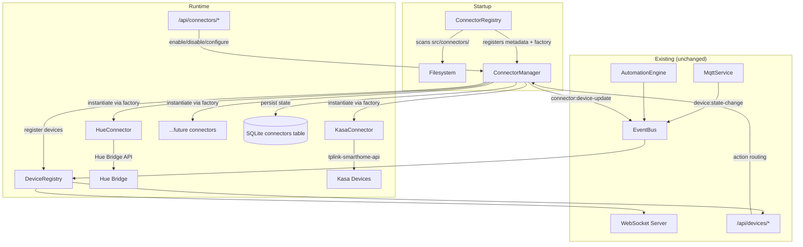

# Design Document: Connector Framework

## Overview

The Connector Framework replaces Aeolus's current `Integration` interface and `IntegrationManager` with a richer, pluggable architecture. Today, integrations are hardcoded in `index.ts`, each gets its own route file (e.g. `hue.routes.ts`), configuration lives in environment variables or ad-hoc JSON files, and there is no runtime management from the dashboard. The new framework introduces:

- A **Connector interface** with metadata, config schemas, health tracking, and optional setup flows
- A **ConnectorRegistry** that auto-discovers connector modules by scanning `src/connectors/` at startup
- A **ConnectorManager** that handles the full lifecycle: enable → configure → connect → discover → poll → execute → disable → dispose
- A **generic REST API** at `/api/connectors/*` that replaces per-connector route files
- A **SQLite `connectors` table** that persists enabled state and configuration across restarts
- A **dashboard Connectors page** for managing all connectors from one place

The Hue integration is migrated to the new framework as `src/connectors/hue/`, and a new TP-Link Kasa connector (`src/connectors/kasa/`) is built as the first new implementation targeting the HS110 smart plug with on/off control and energy monitoring. The `DeviceType` union is extended with `"plug"`.

The design prioritises clean separation of concerns, comprehensive TSDoc documentation on all interfaces, and a developer experience where adding a new connector means creating a folder with three exports — no core file changes required.

## Architecture



### Key Design Decisions

1. **Static metadata + factory function over class inheritance.** Each connector module exports `metadata`, `configSchema`, and `createConnector(config)`. This avoids abstract base classes and keeps the contract explicit. The registry validates exports at scan time.

2. **Generic REST API over per-connector routes.** A single `connector.routes.ts` handles all CRUD, setup flows, and health checks. Connector-specific behaviour is driven through the interface (e.g. `getSetupSteps()`, `executeSetupStep()`), not custom endpoints.

3. **SQLite persistence over JSON files.** The `connectors` table stores enabled state and config in the same database as devices and automations. This replaces the ad-hoc `hue-credentials.json` approach and ensures atomic persistence via `sql.js`.

4. **Polling-based device discovery over push.** ConnectorManager periodically calls `discoverDevices()` on each enabled connector. This is simpler than requiring connectors to implement event-based discovery and works well for LAN protocols (Hue, Kasa) where devices appear/disappear.

5. **Health status as a first-class concept.** Every connector reports `connected | degraded | disconnected` with timestamps. This enables the dashboard to show real-time health indicators and offer retry actions.

6. **Setup flows through the connector interface.** Multi-step pairing (like Hue button-press) is modelled as `getSetupSteps()` + `executeSetupStep()` on the connector itself, driven through `POST /api/connectors/:id/setup/:stepId`. No custom routes needed.

## Components and Interfaces

### Directory Structure

```
src/connectors/
├── README.md                          # Developer guide: how to build a connector
├── _template/                         # Skeleton connector for copy-paste
│   ├── index.ts                       # Template exports (metadata, configSchema, createConnector)
│   └── connector.ts                   # Template connector class
├── connector.interface.ts             # Core TypeScript interfaces (Connector, Metadata, ConfigSchema, etc.)
├── connector-registry.ts             # Auto-discovery service
├── connector-manager.ts              # Lifecycle management service
├── connector-store.ts                # SQLite persistence layer
├── hue/
│   ├── index.ts                       # Module exports
│   └── hue-connector.ts              # Hue implementation
└── kasa/
    ├── index.ts                       # Module exports
    └── kasa-connector.ts             # Kasa implementation
```

### Core Interfaces (`connector.interface.ts`)


```typescript
/**
 * Static metadata descriptor for a Connector module.
 * Exported as `metadata` from each connector's index.ts.
 */
export interface ConnectorMetadata {
  /** Unique identifier, used as the connector_type in the database. e.g. "hue", "kasa" */
  id: string;
  /** Human-readable name shown in the dashboard. e.g. "Philips Hue" */
  displayName: string;
  /** Lucide icon name for the dashboard card. e.g. "lightbulb", "plug" */
  icon: string;
  /** Short description of what this connector does. */
  description: string;
  /** Device types this connector can produce. e.g. ["light"] or ["plug", "light", "switch"] */
  supportedDeviceTypes: DeviceType[];
  /** Whether this connector requires a multi-step setup flow (e.g. button-press pairing). */
  requiresSetup: boolean;
}

/**
 * A single field descriptor in a connector's configuration schema.
 * Used to render dynamic config forms in the dashboard.
 */
export interface ConfigFieldDescriptor {
  /** Unique field identifier, used as the key in the config object. */
  id: string;
  /** Human-readable label for the form field. */
  label: string;
  /** Input type: "text", "number", "password", "boolean", "select". */
  type: "text" | "number" | "password" | "boolean" | "select";
  /** Whether this field must be provided before enabling the connector. */
  required: boolean;
  /** Default value if the user doesn't provide one. */
  default?: string | number | boolean;
  /** Placeholder text for the input field. */
  placeholder?: string;
  /** Help text shown below the field. */
  helpText?: string;
  /** Options for "select" type fields. */
  options?: Array<{ label: string; value: string }>;
}

/** The config schema is an array of field descriptors. */
export type ConnectorConfigSchema = ConfigFieldDescriptor[];

/**
 * Health status reported by a connector instance.
 */
export interface HealthStatus {
  /** Current connection state. */
  status: "connected" | "degraded" | "disconnected";
  /** Unix timestamp (ms) of last successful communication with the external system. */
  lastSeen: number;
  /** Human-readable error message when status is not "connected". */
  errorMessage?: string;
}

/**
 * Descriptor for a single step in a connector's setup flow.
 */
export interface SetupStepDescriptor {
  /** Unique step identifier. e.g. "discover-bridges", "press-button" */
  id: string;
  /** Human-readable title. e.g. "Discover Bridges" */
  title: string;
  /** Instructions shown to the user. */
  description: string;
  /** Input fields required for this step (if any). */
  fields?: ConfigFieldDescriptor[];
}

/**
 * Result returned after executing a setup step.
 */
export interface SetupStepResult {
  /** Whether the step completed successfully. */
  success: boolean;
  /** Message to display to the user. */
  message: string;
  /** Data produced by this step (e.g. discovered bridges, generated API key). */
  data?: Record<string, unknown>;
  /** If true, the setup flow is complete and the connector can be connected. */
  complete?: boolean;
}

/**
 * The core Connector interface that all connector implementations must satisfy.
 * Instances are created by the module's `createConnector(config)` factory function.
 */
export interface Connector {
  /** Connect to the external device system. Throws on failure. */
  connect(): Promise<void>;

  /** Gracefully disconnect from the external system. */
  disconnect(): Promise<void>;

  /** Discover devices and return them in Aeolus Device format. */
  discoverDevices(): Promise<Device[]>;

  /** Execute a control action on a device managed by this connector. */
  execute(action: Action): Promise<void>;

  /** Return the current health status of this connector. */
  getHealthStatus(): HealthStatus;

  /** Called when configuration is updated at runtime. */
  onConfigUpdate(config: Record<string, unknown>): void;

  /** Release all resources. Called when the connector is disabled or the system shuts down. */
  dispose(): Promise<void>;

  /**
   * Return the setup flow steps for this connector.
   * Only required when metadata.requiresSetup is true.
   */
  getSetupSteps?(): SetupStepDescriptor[];

  /**
   * Execute a single setup step.
   * Only required when metadata.requiresSetup is true.
   */
  executeSetupStep?(stepId: string, params: Record<string, unknown>): Promise<SetupStepResult>;
}

/**
 * The standard export shape for a connector module.
 * Every `src/connectors/{name}/index.ts` must export these three members.
 */
export interface ConnectorModule {
  metadata: ConnectorMetadata;
  configSchema: ConnectorConfigSchema;
  createConnector: (config: Record<string, unknown>) => Connector;
}
```

### ConnectorRegistry (`connector-registry.ts`)

Scans `src/connectors/` at startup, validates each subdirectory's exports, and stores the module references.

```typescript
class ConnectorRegistry {
  /** Map of connector type id → ConnectorModule */
  private modules: Map<string, ConnectorModule>;

  /** Scan the connectors directory and register valid modules. */
  async discover(): Promise<void>;

  /** Return all discovered connector types with metadata and config schemas. */
  listAvailable(): Array<{ metadata: ConnectorMetadata; configSchema: ConnectorConfigSchema }>;

  /** Get a specific connector module by its metadata id. Returns undefined if not found. */
  getModule(connectorType: string): ConnectorModule | undefined;
}
```

Discovery logic:
1. Read subdirectories of `src/connectors/` (skip `_template`, `README.md`, and files starting with `connector`)
2. Dynamically import each subdirectory's `index.ts` (or `index.js` in built output)
3. Validate that the module exports `metadata`, `configSchema`, and `createConnector`
4. Log a warning and skip if validation fails
5. Store valid modules keyed by `metadata.id`

### ConnectorManager (`connector-manager.ts`)

Manages the lifecycle of enabled connector instances. Depends on ConnectorRegistry, ConnectorStore, DeviceRegistry, and EventBus.

```typescript
class ConnectorManager {
  /** Enable a connector: instantiate, configure, connect, discover devices. */
  async enable(connectorType: string, config: Record<string, unknown>): Promise<string>;

  /** Disable a connector: disconnect, dispose, remove devices. */
  async disable(instanceId: string): Promise<void>;

  /** Update configuration on a running connector. */
  async updateConfig(instanceId: string, config: Record<string, unknown>): Promise<void>;

  /** Retry connection for a disconnected connector. */
  async retry(instanceId: string): Promise<void>;

  /** Execute a setup step on a connector instance. */
  async executeSetupStep(instanceId: string, stepId: string, params: Record<string, unknown>): Promise<SetupStepResult>;

  /** Route an action to the correct connector based on device integration field. */
  async executeAction(deviceId: string, action: Action): Promise<void>;

  /** Get status of all enabled connectors. */
  listEnabled(): ConnectorInstanceInfo[];

  /** Get detailed status of a specific connector. */
  getStatus(instanceId: string): ConnectorInstanceInfo | undefined;

  /** Restore previously enabled connectors from the store on startup. */
  async restoreFromStore(): Promise<void>;

  /** Dispose all connectors (called during shutdown). */
  async disposeAll(): Promise<void>;
}
```

Polling: ConnectorManager runs a `setInterval` per enabled connector that calls `discoverDevices()` at the connector's configured polling interval (default 60s). Discovered devices are upserted into the DeviceRegistry with `integration` set to the connector's metadata id.

### ConnectorStore (`connector-store.ts`)

Thin persistence layer over the SQLite `connectors` table.

```typescript
class ConnectorStore {
  /** Save or update a connector record. */
  save(record: ConnectorRecord): void;

  /** Mark a connector as disabled (sets enabled = 0, preserves config). */
  disable(instanceId: string): void;

  /** Delete a connector record entirely. */
  delete(instanceId: string): void;

  /** Load all connector records. */
  loadAll(): ConnectorRecord[];

  /** Load only enabled connector records. */
  loadEnabled(): ConnectorRecord[];
}
```

### Generic REST API (`connector.routes.ts`)

A single Express router replaces all per-connector route files.

| Method | Path | Description | Req 5 AC |
|--------|------|-------------|----------|
| GET | `/api/connectors/available` | List discovered connector types | 5.1 |
| GET | `/api/connectors` | List enabled connector instances | 5.2 |
| POST | `/api/connectors` | Enable a new connector | 5.3 |
| PATCH | `/api/connectors/:id` | Update connector config | 5.4 |
| DELETE | `/api/connectors/:id` | Disable a connector | 5.5 |
| GET | `/api/connectors/:id/status` | Get connector health | 5.6 |
| POST | `/api/connectors/:id/setup/:stepId` | Execute setup step | 5.7 |
| POST | `/api/connectors/:id/retry` | Retry connection | 5.8 |

Validation: The route handler validates `connector_type` against the registry (404 if not found) and validates config against the `configSchema` required fields (400 if missing).

### Hue Connector (`src/connectors/hue/`)

Migrates the existing `HueIntegration` class and `hue.routes.ts` into the connector framework.

- **metadata**: `{ id: "hue", displayName: "Philips Hue", icon: "lightbulb", description: "Philips Hue smart lighting via local bridge API", supportedDeviceTypes: ["light"], requiresSetup: true }`
- **configSchema**: `[{ id: "bridgeIp", label: "Bridge IP", type: "text", required: true }, { id: "apiKey", label: "API Key", type: "password", required: true }]`
- **Setup flow**: Two steps — `discover-bridges` (calls meethue.com discovery) and `press-button` (initiates pairing, returns API key on success)
- **Migration**: On first startup, if `data/hue-credentials.json` exists, import `bridgeIp` and `apiKey` into the connectors table and delete the JSON file

### Kasa Connector (`src/connectors/kasa/`)

New connector for TP-Link Kasa devices using the `tplink-smarthome-api` npm package.

- **metadata**: `{ id: "kasa", displayName: "TP-Link Kasa", icon: "plug", description: "TP-Link Kasa smart plugs and switches via local Wi-Fi", supportedDeviceTypes: ["plug", "light", "switch"], requiresSetup: false }`
- **configSchema**: `[{ id: "broadcastAddress", label: "Broadcast Address", type: "text", required: false, default: "255.255.255.255", helpText: "UDP broadcast address for device discovery" }, { id: "discoveryTimeout", label: "Discovery Timeout (ms)", type: "number", required: false, default: 10000 }]`
- **Discovery**: Uses `Client.startDiscovery()` from `tplink-smarthome-api`, maps discovered devices to Aeolus `Device` objects with type `"plug"` and capabilities `["on/off", "energy-monitoring"]`
- **Energy monitoring**: Polls `getSysInfo()` and `emeter.getRealtime()` on each discovered plug, updates device state with `{ on, voltage, current, power, totalConsumption }`
- **Health**: `connected` if ≥1 device reachable, `degraded` if some unreachable, `disconnected` if none respond

### Template Connector (`src/connectors/_template/`)

A skeleton connector that developers copy to create new connectors. Contains placeholder implementations of all required exports with inline comments explaining each method.

## Data Models

### ConnectorRecord (SQLite `connectors` table)

```sql
CREATE TABLE IF NOT EXISTS connectors (
  id TEXT PRIMARY KEY,                -- UUID, unique instance identifier
  connector_type TEXT NOT NULL,       -- References ConnectorMetadata.id (e.g. "hue", "kasa")
  enabled INTEGER NOT NULL DEFAULT 1, -- 1 = enabled, 0 = disabled (config preserved)
  config TEXT NOT NULL DEFAULT '{}',  -- JSON-serialized configuration object
  created_at INTEGER NOT NULL,        -- Unix timestamp ms
  updated_at INTEGER NOT NULL         -- Unix timestamp ms
);
```

### Extended DeviceType

```typescript
/** Valid device type categories — extended with "plug" for smart plugs */
export type DeviceType = "light" | "sensor" | "switch" | "climate" | "plug";
```

The SQLite `devices` table CHECK constraint is updated:
```sql
CHECK(type IN ('light', 'sensor', 'switch', 'climate', 'plug'))
```

### Device State Shapes by Type

Existing types are unchanged. The new `plug` type adds:

```typescript
// Plug device state (Kasa HS110)
interface PlugState {
  on: boolean;
  voltage: number;      // Volts
  current: number;      // Amps
  power: number;        // Watts (real-time)
  totalConsumption: number; // kWh (cumulative)
  online: boolean;
}
```

### Capability Inference Update

```typescript
// In DeviceRegistry.inferCapabilities()
case "plug": return ["on/off", "energy-monitoring"];
```

### ConnectorInstanceInfo (API response shape)

```typescript
interface ConnectorInstanceInfo {
  id: string;                    // Instance UUID
  connectorType: string;         // e.g. "hue"
  displayName: string;           // From metadata
  icon: string;                  // From metadata
  config: Record<string, unknown>; // Current config (passwords redacted)
  health: HealthStatus;          // Current health
  deviceCount: number;           // Number of discovered devices
  enabled: boolean;
}
```


## Correctness Properties

*A property is a characteristic or behavior that should hold true across all valid executions of a system — essentially, a formal statement about what the system should do. Properties serve as the bridge between human-readable specifications and machine-verifiable correctness guarantees.*

### Property 1: Registry discovers exactly valid connector modules

*For any* set of subdirectories under `src/connectors/` where each directory either exports a valid `ConnectorModule` (metadata, configSchema, createConnector) or is missing one or more required exports, after discovery the registry should contain exactly those modules with all three valid exports, and no others.

**Validates: Requirements 2.1, 2.3, 10.4**

### Property 2: Registry lookup invariant

*For any* connector module registered in the ConnectorRegistry, calling `listAvailable()` should include that module's metadata and config schema, and calling `getModule(metadata.id)` should return that exact module. For any id not in the registry, `getModule(id)` should return `undefined`.

**Validates: Requirements 2.2, 2.4**

### Property 3: ConnectorStore persistence round-trip

*For any* valid ConnectorRecord (with id, connector_type, enabled flag, and config object), saving it to the ConnectorStore and then loading it back should produce an equivalent record. When a connector is disabled, the record should still exist with `enabled = 0` and the original config preserved.

**Validates: Requirements 4.2, 4.3**

### Property 4: Enable then disable is a clean round-trip

*For any* valid connector type and configuration, enabling a connector through the ConnectorManager should add it to `listEnabled()`, and subsequently disabling it should remove it from `listEnabled()` and remove all devices it registered from the DeviceRegistry.

**Validates: Requirements 3.1, 3.2**

### Property 5: Restore from store matches persisted state

*For any* set of ConnectorRecords with `enabled = 1` in the ConnectorStore, after calling `restoreFromStore()`, the ConnectorManager's `listEnabled()` should contain an entry for each persisted enabled record with matching connector type and configuration.

**Validates: Requirements 3.6, 4.4**

### Property 6: Failed connect marks health as disconnected

*For any* connector whose `connect()` method throws an error, the ConnectorManager should set that connector's health status to `"disconnected"` with an error message, and the connector should still appear in `listEnabled()` (not silently removed).

**Validates: Requirements 3.5**

### Property 7: Action routing to correct connector

*For any* device managed by a connector, when an action is dispatched for that device, the ConnectorManager should route the action to the connector instance whose metadata.id matches the device's `integration` field. For MQTT devices (integration = "mqtt"), the action should not be routed to any connector.

**Validates: Requirements 3.4, 11.4**

### Property 8: API validation rejects invalid requests

*For any* POST to `/api/connectors` with a `connector_type` not found in the ConnectorRegistry, the API should return 404. *For any* POST to `/api/connectors` where the provided config is missing one or more fields marked `required: true` in the connector's configSchema, the API should return 400.

**Validates: Requirements 5.9, 5.10**

### Property 9: Legacy Hue credential migration round-trip

*For any* valid `hue-credentials.json` file containing `bridgeIp` and `apiKey` fields, the migration logic should produce a ConnectorRecord in the ConnectorStore with `connector_type = "hue"`, `enabled = 1`, and a config object containing the same `bridgeIp` and `apiKey` values.

**Validates: Requirements 6.5, 11.3**

### Property 10: Kasa health status follows reachability rules

*For any* set of Kasa devices where each device is either reachable or unreachable, the Kasa connector's `getHealthStatus()` should return `"connected"` when all devices are reachable, `"degraded"` when at least one but not all are reachable, and `"disconnected"` when none are reachable. Unreachable devices should remain in the DeviceRegistry with `online = false` in their state.

**Validates: Requirements 7.7, 7.8**

### Property 11: Kasa discovered plugs have correct type and capabilities

*For any* device discovered by the Kasa connector that is identified as a plug, it should be registered in the DeviceRegistry with `type = "plug"` and `capabilities` containing `["on/off", "energy-monitoring"]`.

**Validates: Requirements 7.4**

## Error Handling

| Component | Error | Handling |
|-----------|-------|----------|
| ConnectorRegistry | Invalid module export | Log warning with missing export name and module path, skip directory |
| ConnectorRegistry | Directory read failure | Log error, return empty registry (system still starts) |
| ConnectorManager | `connect()` throws | Set health to "disconnected", log error, allow retry via API |
| ConnectorManager | `discoverDevices()` throws | Log error, keep existing devices, retry on next poll cycle |
| ConnectorManager | `execute()` throws | Propagate error to API caller as 500 |
| ConnectorManager | `dispose()` throws | Log error, continue disposing other connectors |
| ConnectorStore | SQLite write failure | Log error, throw (caller handles) |
| ConnectorStore | Malformed JSON in config column | Log warning, skip record during restore |
| Connector API | Unknown connector type | 404 with `{ error: "Connector type 'xyz' not found" }` |
| Connector API | Missing required config fields | 400 with `{ error: "Missing required fields: bridgeIp", fields: ["bridgeIp"] }` |
| Connector API | Unknown instance ID | 404 with `{ error: "Connector instance 'xyz' not found" }` |
| Hue Connector | Bridge unreachable | Health → "disconnected", log error |
| Hue Connector | Pairing button not pressed | Setup step returns `{ success: false, message: "Press the link button..." }` |
| Kasa Connector | No devices found on network | Health → "disconnected", empty device list |
| Kasa Connector | Device becomes unreachable | Mark device state `online: false`, health → "degraded" |
| Kasa Connector | Energy monitoring read fails | Log warning, keep last known values in state |
| Migration | Legacy credentials file malformed | Log warning, skip migration (user can configure manually) |

## Testing Strategy

### Property-Based Testing

Use `fast-check` (already in devDependencies) with `@fast-check/vitest` for property-based tests. Each property test runs a minimum of 100 iterations.

Property tests target the core logic layers that are independent of I/O:

| Property | Test Target | Generator Strategy |
|----------|-------------|-------------------|
| P1: Registry discovery | ConnectorRegistry | Generate arrays of mock module objects, some valid (all 3 exports), some missing exports |
| P2: Registry lookup | ConnectorRegistry | Generate random metadata ids, register subset, verify lookup |
| P3: Store round-trip | ConnectorStore | Generate random ConnectorRecords with varied configs, save/load |
| P4: Enable/disable | ConnectorManager | Generate connector types with mock factories, enable then disable |
| P5: Restore from store | ConnectorManager + Store | Generate random enabled records, persist, restore, compare |
| P6: Failed connect | ConnectorManager | Generate connectors with factories that throw random errors |
| P7: Action routing | ConnectorManager | Generate devices with random integration fields, dispatch actions |
| P8: API validation | Connector routes | Generate random type strings and partial config objects |
| P9: Migration | Migration logic | Generate random bridgeIp/apiKey pairs, write to JSON, run migration |
| P10: Kasa health | KasaConnector | Generate arrays of devices with random reachability booleans |
| P11: Kasa plug type | KasaConnector | Generate discovered device info, verify type and capabilities |

Each test file references its design property:
```typescript
// Feature: connector-framework, Property 3: ConnectorStore persistence round-trip
```

### Unit Tests

Unit tests cover specific examples, edge cases, and integration points:

- ConnectorRegistry: empty directory, directory with only `_template`, single valid connector, mixed valid/invalid
- ConnectorStore: create table on init, CRUD operations, disable preserves config, load empty table
- ConnectorManager: enable with setup flow, disable removes devices, retry after failure
- Config validation: empty config, partial config, extra fields ignored, type coercion
- Hue connector: metadata shape, config schema shape, setup step descriptors
- Kasa connector: metadata shape, device mapping from tplink-smarthome-api types to Aeolus Device
- Migration: no legacy file (no-op), valid legacy file, malformed legacy file
- DeviceType: "plug" accepted in SQLite CHECK, inferCapabilities returns correct array

### Test File Locations

```
src/connectors/connector-registry.test.ts
src/connectors/connector-registry.property.test.ts
src/connectors/connector-store.test.ts
src/connectors/connector-store.property.test.ts
src/connectors/connector-manager.test.ts
src/connectors/connector-manager.property.test.ts
src/api/routes/connector.routes.test.ts
src/connectors/hue/hue-connector.test.ts
src/connectors/kasa/kasa-connector.test.ts
```
