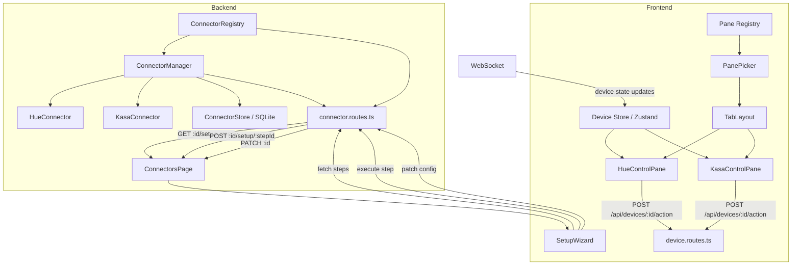

# Design Document: Connector UI System

## Overview

The Connector UI System replaces the fragmented, hardcoded approach to connector setup and device control with a fully generic, backend-driven architecture. Three core changes:

1. **Generic Setup Wizard** — The ConnectorsPage setup wizard fetches step descriptors from a new `GET /api/connectors/:id/setup-steps` endpoint instead of using the hardcoded `getSetupStepsForType()` function. The wizard renders steps dynamically, accumulates data across steps, and propagates final configuration back to the connector via `PATCH /api/connectors/:id`.

2. **Connector Control Panes** — New `HueControlPane` and `KasaControlPane` components replace the standalone `LightingPage`. These panes read device data from the Zustand device store (filtering by `integration` field), send actions through the existing `/api/devices/:id/action` endpoint, and are registered in the pane registry so users can add them to any custom tab via the PanePicker.

3. **Clean Default Layout** — The default layout drops the "Lighting" custom tab and its `hue-lights` pane, leaving only the four pinned system tabs (Dashboard, Automations, Connectors, System). Users create custom tabs and add control panes themselves.

## Architecture



### Data Flow: Setup Wizard

1. User enables a connector with `requiresSetup: true` via `POST /api/connectors`
2. Frontend calls `GET /api/connectors/:id/setup-steps` to fetch `SetupStepDescriptor[]`
3. Wizard renders each step dynamically from the descriptor's `title`, `description`, `fields`
4. User completes a step → `POST /api/connectors/:id/setup/:stepId` with params + accumulated data
5. Backend returns `SetupStepResult` with `success`, `message`, `data`, `complete`
6. Wizard accumulates `data` from each step, passes it forward to subsequent steps
7. On `complete: true`, wizard sends `PATCH /api/connectors/:id` with accumulated config, then closes
8. ConnectorsPage refreshes the enabled connectors list

### Data Flow: Control Panes

1. Connector's `discoverDevices()` runs on poll interval → devices emitted via EventBus → DeviceRegistry → WebSocket broadcast
2. Frontend device store receives updates via WebSocket subscription
3. Control pane component subscribes to device store, filters by `integration` field (e.g. `"hue"`, `"kasa"`)
4. User interacts with a device card (toggle, brightness, colour) → `POST /api/devices/:id/action`
5. Optimistic UI update applied immediately; real state confirmed on next WebSocket update

## Components and Interfaces

### Backend: New Route — `GET /api/connectors/:id/setup-steps`

Added to `connector.routes.ts`. Delegates to the connector instance's `getSetupSteps()` method.

```typescript
// New route in connector.routes.ts
router.get("/:id/setup-steps", (req, res) => {
  const { id } = req.params;
  const instance = connectorManager.getStatus(id);
  if (!instance) {
    res.status(404).json({ error: `Connector instance '${id}' not found` });
    return;
  }
  const steps = connectorManager.getSetupSteps(id);
  res.json(steps);
});
```

### Backend: New Method — `ConnectorManager.getSetupSteps()`

Returns the setup steps for a managed connector instance. Returns `[]` if the connector doesn't implement `getSetupSteps()`.

```typescript
// New method on ConnectorManager
getSetupSteps(instanceId: string): SetupStepDescriptor[] {
  const instance = this.instances.get(instanceId);
  if (!instance) throw new Error(`Connector instance '${instanceId}' not found`);
  return instance.connector.getSetupSteps?.() ?? [];
}
```

### Frontend: API Client — New Functions

```typescript
// New function in api-client.ts
export async function fetchSetupSteps(connectorId: string) {
  return request<SetupStepDescriptor[]>(`/api/connectors/${connectorId}/setup-steps`);
}

export async function patchConnectorConfig(connectorId: string, config: Record<string, unknown>) {
  return request<{ success: boolean }>(`/api/connectors/${connectorId}`, {
    method: "PATCH",
    body: JSON.stringify({ config }),
  });
}
```

### Frontend: ConnectorsPage Changes

- Remove `getSetupStepsForType()` helper function entirely
- After enabling a connector with `requiresSetup: true`, call `fetchSetupSteps(instanceId)` to get steps from backend
- Pass fetched steps to `SetupWizard`
- On wizard completion (`complete: true`), call `patchConnectorConfig()` with accumulated data, then refresh

### Frontend: SetupWizard Changes

- Accept steps from props (already does this) — no structural change needed
- Add accumulated data propagation: merge `result.data` into a running `accumulatedConfig` object
- On `complete: true`, call `patchConnectorConfig(connectorId, accumulatedConfig)` before calling `onComplete()`
- Step progress indicator already exists — no change needed

### Frontend: HueControlPane Component

New component at `frontend/src/components/panes/HueControlPane.tsx`.

```typescript
interface HueControlPaneProps {
  config: PaneConfig;
}
```

Behaviour:
- Reads devices from `useDeviceStore` where `integration === "hue"` and `type === "light"`
- Renders a responsive grid of light cards
- Each card shows: name, on/off toggle, online/offline badge, brightness slider, colour picker (for color-capable lights)
- Toggle sends `POST /api/devices/:id/action` with `{ type: "toggle" }` and optimistically flips `state.on`
- Brightness slider tracks local value during drag, sends `{ type: "brightness", params: { brightness } }` on release only
- Colour picker shows preset swatches, sends `{ type: "color", params: { hue, saturation } }` on swatch click
- Colour capability detected by checking if device `type` string contains "color" or "extended" (same logic as existing LightingPage)

### Frontend: KasaControlPane Component

New component at `frontend/src/components/panes/KasaControlPane.tsx`.

```typescript
interface KasaControlPaneProps {
  config: PaneConfig;
}
```

Behaviour:
- Reads devices from `useDeviceStore` where `integration === "kasa"`
- Renders a responsive grid of device cards
- Each card shows: name, on/off toggle, online badge, device type badge (plug/light/switch)
- Toggle sends `POST /api/devices/:id/action` with `{ type: "toggle" }` and optimistically flips `state.on`
- If device state contains energy monitoring fields (`voltage`, `current`, `power`, `totalConsumption`), display them in a stats section on the card

### Frontend: Pane Registry Updates

Replace the existing `"hue-lights"` entry and add `"kasa-control"`:

```typescript
// Updated pane-registry.ts entries
"hue-control": {
  component: HueControlPane,
  displayName: "Hue Lights",
  defaultIcon: "lightbulb",
  defaultConfig: {},
  defaultSize: { w: 12, h: 6 },
},
"kasa-control": {
  component: KasaControlPane,
  displayName: "Kasa Devices",
  defaultIcon: "plug",
  defaultConfig: {},
  defaultSize: { w: 12, h: 6 },
},
```

The old `"hue-lights"` entry (which wraps `LightingPage`) is removed.

### Frontend: Default Layout Changes

In `frontend/src/types/dashboard.ts`:
- Remove the `"default-lighting"` tab from `DEFAULT_TABS`
- Remove the `"dp-hue-lights"` pane from `DEFAULT_PANES` (empty array)
- Only 4 pinned tabs remain: Dashboard, Automations, Connectors, System

### Frontend: LightingPage Removal

After `HueControlPane` is functional:
- Delete `frontend/src/components/LightingPage.tsx`
- Delete `frontend/src/components/panes/HueLightsPane.tsx`
- Remove the `LightingPage` import from `App.tsx` (it's not directly used there, but verify)
- Remove the `HueLightsPane` import from `pane-registry.ts`

## Data Models

### SetupStepDescriptor (existing, no changes)

```typescript
interface SetupStepDescriptor {
  id: string;           // e.g. "discover-bridges"
  title: string;        // e.g. "Discover Bridges"
  description: string;  // Instructions for the user
  fields?: ConfigFieldDescriptor[];  // Optional input fields
}
```

### SetupStepResult (existing, no changes)

```typescript
interface SetupStepResult {
  success: boolean;
  message: string;
  data?: Record<string, unknown>;  // Accumulated across steps
  complete?: boolean;              // true = setup flow done
}
```

### Device (existing Zustand store shape, no changes)

```typescript
interface Device {
  id: string;
  name: string;
  type: "light" | "sensor" | "switch" | "climate";
  capabilities: string[];
  state: Record<string, unknown>;  // { on, brightness, reachable, voltage, current, power, ... }
  integration: string;             // "hue", "kasa", "mqtt"
  lastSeen: number;
}
```

Control panes filter on `integration` to select their devices:
- HueControlPane: `integration === "hue" && type === "light"`
- KasaControlPane: `integration === "kasa"`

### PaneRegistryEntry (existing, no changes)

```typescript
interface PaneRegistryEntry {
  component: ComponentType<{ config: PaneConfig }>;
  displayName: string;
  defaultIcon: string;
  defaultConfig: PaneConfig;
  defaultSize: { w: number; h: number };
}
```

### Default Layout Constants (modified)

```typescript
// Only 4 pinned tabs, no custom tabs
export const DEFAULT_TABS: Tab[] = [
  { id: "default-dashboard",   name: "Dashboard",   icon: "cpu",    order: 0, pinned: true, createdAt: NOW },
  { id: "default-automations", name: "Automations", icon: "zap",    order: 1, pinned: true, createdAt: NOW },
  { id: "default-connectors",  name: "Connectors",  icon: "plug",   order: 2, pinned: true, createdAt: NOW },
  { id: "default-system",      name: "System",      icon: "server", order: 3, pinned: true, createdAt: NOW },
];

// No default panes — users add their own
export const DEFAULT_PANES: Pane[] = [];
```


## Correctness Properties

*A property is a characteristic or behavior that should hold true across all valid executions of a system — essentially, a formal statement about what the system should do. Properties serve as the bridge between human-readable specifications and machine-verifiable correctness guarantees.*

### Property 1: Setup steps API faithfully returns connector steps

*For any* connector instance that implements `getSetupSteps()`, a `GET /api/connectors/:id/setup-steps` request shall return an array identical to the connector's `getSetupSteps()` output — same length, same step IDs, titles, descriptions, and fields. For any connector instance that does not implement `getSetupSteps()`, the endpoint shall return an empty array.

**Validates: Requirements 1.1, 1.2, 1.4**

### Property 2: Wizard renders step content dynamically from descriptors

*For any* array of `SetupStepDescriptor` objects passed to the SetupWizard, the rendered output for the current step shall contain the step's `title` text, `description` text, and one input element per entry in the step's `fields` array.

**Validates: Requirements 2.2**

### Property 3: Wizard step progress indicator reflects position

*For any* setup flow with N total steps and current step index I (0-based), the wizard's progress indicator shall display N step markers with exactly the (I+1)th marker highlighted as active.

**Validates: Requirements 2.6**

### Property 4: Wizard accumulates data across steps

*For any* sequence of setup step results where each result contains a `data` object, the parameters sent to step K shall include the merged data from all previous steps 0..K-1. That is, for all keys present in any prior step's `data`, those keys and values shall be present in the params of subsequent step executions.

**Validates: Requirements 3.2**

### Property 5: Hue control pane renders exactly the Hue lights from the device store

*For any* device store state containing a mix of devices with different `integration` and `type` values, the HueControlPane shall render exactly one card per device where `integration === "hue"` AND `type === "light"`, and no cards for any other devices.

**Validates: Requirements 4.1, 4.7**

### Property 6: Hue light card displays required device information

*For any* Hue light device (with `integration === "hue"` and `type === "light"`), the rendered card shall contain the device's `name`, its on/off state representation, its online/offline status, and its brightness level.

**Validates: Requirements 4.2**

### Property 7: Colour picker visibility determined by device type

*For any* Hue light device, the colour picker UI element shall be rendered if and only if the device's type string (from the Hue API, stored in state or metadata) contains the substring "color" or "extended" (case-insensitive).

**Validates: Requirements 4.5**

### Property 8: Kasa control pane renders exactly the Kasa devices from the device store

*For any* device store state containing a mix of devices with different `integration` values, the KasaControlPane shall render exactly one card per device where `integration === "kasa"`, and no cards for any other devices.

**Validates: Requirements 5.1, 5.6**

### Property 9: Kasa device card displays required device information

*For any* Kasa device (with `integration === "kasa"`), the rendered card shall contain the device's `name`, its on/off state representation, its online status, and its device type (plug, light, or switch).

**Validates: Requirements 5.2**

### Property 10: Kasa energy stats displayed conditionally

*For any* Kasa device, if its state contains energy monitoring fields (`voltage`, `current`, `power`, `totalConsumption`), the rendered card shall display those values. If the state does not contain those fields, the energy stats section shall not be rendered.

**Validates: Requirements 5.4**

### Property 11: PanePicker creates panes with registry default sizes

*For any* pane type key present in the PANE_REGISTRY, when that pane type is selected via the PanePicker for a given tab, the resulting pane object shall have `w` and `h` values equal to the `defaultSize.w` and `defaultSize.h` from the corresponding registry entry.

**Validates: Requirements 7.3**

### Property 12: ConnectorsPage renders all available connector types

*For any* set of available connector types returned by the backend, the ConnectorsPage shall render one card per connector type, and each card shall contain the connector's `displayName`, `description`, `icon`, supported device type badges, and a setup-required badge if `requiresSetup` is true.

**Validates: Requirements 8.1**

### Property 13: ConnectorsPage renders enabled connectors with status and controls

*For any* set of enabled connector instances returned by the backend, the ConnectorsPage shall render one card per instance showing `displayName`, health status indicator, device count, and last seen time. Each enabled connector card shall include a disable button, and connectors with `health.status === "disconnected"` shall additionally include a retry button.

**Validates: Requirements 8.2, 8.4**

## Error Handling

### Backend

| Scenario | Response | Details |
|---|---|---|
| `GET /api/connectors/:id/setup-steps` with non-existent ID | 404 | `{ error: "Connector instance ':id' not found" }` |
| `GET /api/connectors/:id/setup-steps` for connector without `getSetupSteps()` | 200 | Returns `[]` (empty array, not an error) |
| `POST /api/connectors/:id/setup/:stepId` fails | 200 | Returns `{ success: false, message: "..." }` — error is in the result, not HTTP status |
| `PATCH /api/connectors/:id` with non-existent ID | 404 | Thrown by ConnectorManager, caught by error handler |
| Connector `connect()` fails during enable | 200 | Instance is created but health is "disconnected"; no 500 error |

### Frontend

| Scenario | Handling |
|---|---|
| `fetchSetupSteps()` network error | Show error toast, allow retry |
| Setup step returns `success: false` | Display `message` in error banner within wizard, stay on current step |
| Setup step returns `complete: true` but PATCH fails | Show error toast, wizard closes but connector may need manual config |
| Control pane has no devices (connector not enabled or no devices discovered) | Show empty state message: "No devices found. Enable the connector on the Connectors page." |
| `sendAction()` fails for toggle/brightness/colour | Revert optimistic update, show error toast |
| Device goes offline (`state.reachable === false` or `state.online === false`) | Show "offline" badge on card, disable interactive controls |

## Testing Strategy

### Unit Tests

- **Backend route tests** (`connector.routes.test.ts`): Test the new `GET /:id/setup-steps` endpoint with mock ConnectorManager — verify 200 with steps, 200 with empty array, 404 for missing ID.
- **ConnectorManager.getSetupSteps()**: Test with a mock connector that has/doesn't have `getSetupSteps()`.
- **Default layout constants**: Verify `DEFAULT_TABS` has exactly 4 pinned tabs, `DEFAULT_PANES` is empty.
- **Pane registry entries**: Verify `"hue-control"` and `"kasa-control"` entries exist with correct metadata.
- **HueControlPane rendering**: Test with mock device store containing mixed devices — verify correct filtering and card rendering.
- **KasaControlPane rendering**: Same pattern — verify filtering, card content, conditional energy stats.
- **SetupWizard completion flow**: Test that `complete: true` triggers PATCH and onComplete callback.

### Property-Based Tests

Use `fast-check` as the property-based testing library. Each test runs a minimum of 100 iterations.

- **Property 1** — Generate random `SetupStepDescriptor[]` arrays, mock a connector returning them, call the API route, assert response matches.
  Tag: `Feature: connector-ui-system, Property 1: Setup steps API faithfully returns connector steps`

- **Property 4** — Generate random sequences of `SetupStepResult` objects with `data` fields, simulate wizard step execution, assert accumulated params contain all prior data keys.
  Tag: `Feature: connector-ui-system, Property 4: Wizard accumulates data across steps`

- **Property 5** — Generate random device store states with mixed integrations/types, render HueControlPane, assert card count equals count of devices with `integration=hue AND type=light`.
  Tag: `Feature: connector-ui-system, Property 5: Hue control pane renders exactly the Hue lights from the device store`

- **Property 7** — Generate random device type strings, apply the `isColorLight()` function, assert it returns true iff the string contains "color" or "extended" (case-insensitive).
  Tag: `Feature: connector-ui-system, Property 7: Colour picker visibility determined by device type`

- **Property 8** — Generate random device store states, render KasaControlPane, assert card count equals count of devices with `integration=kasa`.
  Tag: `Feature: connector-ui-system, Property 8: Kasa control pane renders exactly the Kasa devices from the device store`

- **Property 10** — Generate random Kasa device states with/without energy fields, render card, assert energy stats section presence matches field presence.
  Tag: `Feature: connector-ui-system, Property 10: Kasa energy stats displayed conditionally`

- **Property 11** — Generate random pane type selections from PANE_REGISTRY keys, call `addPane()`, assert resulting pane dimensions match registry defaults.
  Tag: `Feature: connector-ui-system, Property 11: PanePicker creates panes with registry default sizes`

Each property-based test must be implemented as a single test using `fast-check`'s `fc.assert(fc.property(...))` pattern with `{ numRuns: 100 }` minimum. Each test file must include a comment referencing the design property it validates.
