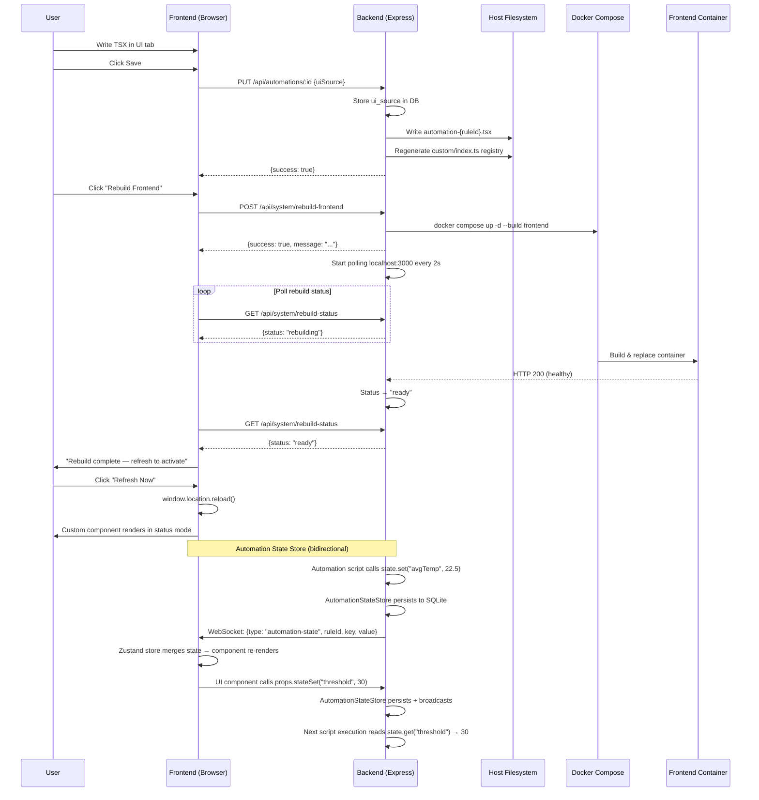
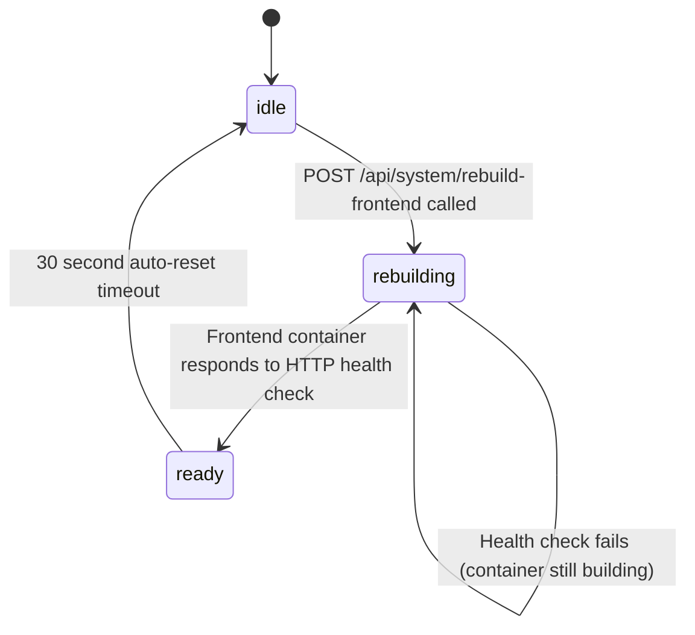

# Design Document: Custom Automation UI

## Overview

This feature activates the "UI" tab in the AutomationPane, allowing users to write custom React/TSX components that serve as visual dashboards for their automations. The approach is build-time compilation: user-authored TSX is saved to disk as a `.tsx` file, an auto-generated registry imports all custom components, and a "Rebuild Frontend" action triggers `docker compose up -d --build frontend` to compile through the normal Vite/React pipeline. This avoids runtime eval entirely — custom components are statically compiled and bundled like any other React component.

The system flow is:

1. User writes TSX in a Monaco editor (UI tab) → saves
2. Backend stores `ui_source` in the DB and writes the `.tsx` file to the frontend source tree via the `AEOLUS_PROJECT_DIR` host mount
3. Backend regenerates `frontend/src/components/panes/custom/index.ts` (the registry) with static imports for all custom component files
4. User clicks "Rebuild Frontend" → backend runs `docker compose up -d --build frontend` in the background
5. Backend polls `http://localhost:3000` every 2s to track rebuild status (idle → rebuilding → ready)
6. Frontend polls `GET /api/system/rebuild-status` every 3s and shows live status
7. User refreshes → custom component renders in the AutomationPane status mode, wrapped in an error boundary

## Architecture



### Key Architectural Decisions

1. **Build-time compilation over runtime eval**: Custom TSX goes through the standard Vite build pipeline. No `eval()`, no dynamic imports at runtime, no sandboxing needed on the frontend. The security model is identical to the rest of the codebase.

2. **Static registry over dynamic imports**: The auto-generated `custom/index.ts` uses static `import` statements so Vite can tree-shake and bundle everything at build time. No `import()` calls, no code splitting for custom components.

3. **Host filesystem writes via AEOLUS_PROJECT_DIR**: The backend container has the project root bind-mounted at `/aeolus-host`. Writing to `${AEOLUS_PROJECT_DIR}/frontend/src/components/panes/custom/` places files directly in the frontend source tree on the host, which Docker then picks up during the build.

4. **Health-poll-based rebuild tracking**: Rather than parsing Docker build output or using Docker events, the backend simply polls the frontend container's HTTP endpoint. When it stops responding (container being replaced) the status is "rebuilding"; when it responds again, "ready". Simple and reliable.

5. **Error boundary isolation**: Custom components are wrapped in a React error boundary so that user code errors don't crash the dashboard. The boundary shows the error message and a fallback button.

6. **Per-rule key-value state store for backend↔frontend communication**: Rather than coupling the sandbox script and UI component through MQTT topics or custom WebSocket channels, a dedicated `AutomationStateStore` provides a simple `state.set(key, value)` / `state.get(key)` API scoped per rule. The backend persists to SQLite and broadcasts changes via the existing WebSocket. The frontend receives updates reactively and can write back via `props.stateSet()`. This creates a clean bidirectional channel: the script computes values, the UI displays them; the UI sets thresholds, the script reads them on next execution.

## Components and Interfaces

### Backend Components

#### 1. Custom UI File Manager (`src/automations/custom-ui-manager.ts`)

Responsible for writing/deleting custom component `.tsx` files and regenerating the registry.

```typescript
export class CustomUiManager {
  private projectDir: string; // from AEOLUS_PROJECT_DIR

  constructor(projectDir: string);

  /** Write a custom component file and regenerate the registry */
  writeComponent(ruleId: string, uiSource: string): void;

  /** Delete a custom component file and regenerate the registry */
  deleteComponent(ruleId: string): void;

  /** Regenerate custom/index.ts by scanning existing .tsx files in the custom/ directory */
  regenerateRegistry(): void;

  /** Check if the project dir is mounted and writable */
  isAvailable(): boolean;
}
```

File paths:
- Component file: `${projectDir}/frontend/src/components/panes/custom/automation-{ruleId}.tsx`
- Registry file: `${projectDir}/frontend/src/components/panes/custom/index.ts`

#### 2. Rebuild Status Tracker (in `src/api/routes/system.routes.ts`)

In-memory state machine tracking frontend rebuild status.

```typescript
type RebuildState = "idle" | "rebuilding" | "ready";

// Module-level state in system.routes.ts
let rebuildStatus: RebuildState = "idle";
let pollInterval: NodeJS.Timeout | null = null;
let readyTimeout: NodeJS.Timeout | null = null;

function startRebuildTracking(): void;  // Begin polling localhost:3000 every 2s
function stopRebuildTracking(): void;   // Clear intervals/timeouts
```

#### 3. New API Endpoints

| Endpoint | Method | Description |
|---|---|---|
| `/api/system/rebuild-frontend` | POST | Trigger `docker compose up -d --build frontend` |
| `/api/system/rebuild-status` | GET | Return `{ status: "idle" \| "rebuilding" \| "ready" }` |
| `/api/automations/ui-types` | GET | Serve `CustomComponentProps` type definitions as `text/plain` |

#### 4. Modified Automation Routes

The existing `POST /api/automations`, `PUT /api/automations/:id`, and `DELETE /api/automations/:id` endpoints are extended to handle the `uiSource` field. On save, if `uiSource` is non-empty, the `CustomUiManager` writes the file and regenerates the registry. On delete, it cleans up the file.

#### 5. UI Component Snippets (in `src/automations/snippet-catalog.ts`)

A new "UI Components" category is added to the `PLATFORM_SNIPPETS` array with snippets for device status cards, toggle buttons, and execution history lists.

#### 6. Automation State Store (`src/automations/automation-state-store.ts`)

Per-rule key-value store enabling bidirectional communication between backend automation scripts and frontend custom UI components.

```typescript
export class AutomationStateStore {
  /** In-memory cache: ruleId → Map<key, value> */
  private cache = new Map<string, Map<string, unknown>>();

  constructor(private db: Database);

  /** Load all state from SQLite into memory on startup */
  loadFromDb(): void;

  /** Get a single value for a rule */
  get(ruleId: string, key: string): unknown;

  /** Get all key-value pairs for a rule */
  getAll(ruleId: string): Record<string, unknown>;

  /** Set a value — persists to SQLite and returns the value for WebSocket broadcast */
  set(ruleId: string, key: string, value: unknown): void;

  /** Delete a single key */
  delete(ruleId: string, key: string): void;

  /** Delete all state for a rule (called on rule deletion) */
  deleteAll(ruleId: string): void;
}
```

Data flow:
```
Script: state.set("avgTemp", 22.5)
  → Host-side ivm.Reference callback
    → AutomationStateStore.set(ruleId, "avgTemp", 22.5)
      → SQLite upsert (automation_state table)
      → WebSocket broadcast: { type: "automation-state", ruleId, key: "avgTemp", value: 22.5 }
        → Frontend Zustand store merges into per-rule state map
          → Custom component re-renders with updated props.state
```

The `state` sandbox global is wired in `sandbox.ts` alongside the existing `devices`, `mqtt`, `log`, etc. globals:
```typescript
// In the bootstrap script
globalThis.state = {
  get: function(key) { return stateGetRef.applySync(undefined, [key]); },
  set: function(key, value) { stateSetRef.applySync(undefined, [key, JSON.stringify(value)]); },
  getAll: function() { return stateGetAllRef.applySync(undefined, []); },
  delete: function(key) { stateDeleteRef.applySync(undefined, [key]); },
};
```

#### 7. New State API Endpoints

| Endpoint | Method | Description |
|---|---|---|
| `/api/automations/:id/state` | GET | Return all key-value pairs for a rule |
| `/api/automations/:id/state` | PUT | Upsert a key-value pair `{ key, value }`, persist + broadcast |
| `/api/automations/:id/state/:key` | DELETE | Remove a single key-value pair |

#### 8. WebSocket State Broadcast

A new WebSocket message type `automation-state` is added to the existing WebSocket server:

```typescript
// Server → Client
{
  type: "automation-state",
  data: {
    ruleId: "abcd-1234",
    key: "avgTemp",
    value: 22.5
  }
}
```

### Frontend Components

#### 1. UI Editor (`frontend/src/components/UiEditor.tsx`)

A new component wrapping Monaco editor configured for TSX. Reuses the `aeolus-dark` theme definition from `ScriptEditor.tsx` but sets language to `typescriptreact` and loads UI-specific type definitions from `GET /api/automations/ui-types`.

```typescript
interface UiEditorProps {
  initialValue?: string;
  onChange?: (value: string) => void;
  onSave?: (value: string) => void;
  onEditorReady?: (api: { insertText: (text: string) => void }) => void;
}
```

#### 2. Custom Component Error Boundary (`frontend/src/components/CustomComponentBoundary.tsx`)

A React class component implementing `componentDidCatch`. Renders the custom component in a try/catch boundary and shows an error state with a "Show Default View" fallback button.

```typescript
interface BoundaryProps {
  children: React.ReactNode;
  onFallback: () => void;  // Called when user clicks "Show Default View"
}

interface BoundaryState {
  hasError: boolean;
  error: Error | null;
}
```

#### 3. Rebuild Status Indicator (inline in AutomationPane)

Not a separate component — integrated directly into the AutomationPane's UI tab action bar. Polls `GET /api/system/rebuild-status` every 3s while a rebuild is in progress and renders:
- Spinning animation + "Rebuilding…" during `rebuilding`
- Green check + "Rebuild complete — refresh to activate" + "Refresh Now" button when `ready`
- Warning message if `rebuilding` persists > 120s

#### 4. Modified AutomationPane

The existing `AutomationPane` is extended with:
- `uiSource` state alongside `scriptSource`
- Tab bar visible in both setup and editing modes (removing the "Experimental" badge)
- UI tab renders `UiEditor` instead of the placeholder
- Snippet panel available in UI tab
- "Rebuild Frontend" button in the action bar when on the UI tab
- Status mode checks `CUSTOM_COMPONENTS[ruleId]` from the registry and renders the custom component (wrapped in error boundary) when available
- Banner "Custom UI saved — rebuild frontend to activate" when `ui_source` exists but no compiled component is in the registry

#### 5. Custom Component Registry (`frontend/src/components/panes/custom/index.ts`)

Auto-generated file. Example when two rules have custom UIs:

```typescript
// ⚠️ AUTO-GENERATED — Do not edit manually.
// Regenerated by the Aeolus backend when custom UI components are saved or deleted.

import type { ComponentType } from "react";
import type { CustomComponentProps } from "./types";
import AutomationAbcd1234 from "./automation-abcd1234";
import AutomationEfgh5678 from "./automation-efgh5678";

export const CUSTOM_COMPONENTS: Record<string, ComponentType<CustomComponentProps>> = {
  "abcd1234": AutomationAbcd1234,
  "efgh5678": AutomationEfgh5678,
};
```

When empty:

```typescript
// ⚠️ AUTO-GENERATED — Do not edit manually.
// Regenerated by the Aeolus backend when custom UI components are saved or deleted.

import type { ComponentType } from "react";
import type { CustomComponentProps } from "./types";

export const CUSTOM_COMPONENTS: Record<string, ComponentType<CustomComponentProps>> = {};
```

#### 6. Custom Component Props Types (`frontend/src/components/panes/custom/types.ts`)

Checked-in file (not auto-generated) defining the props interface:

```typescript
import type { Device } from "../../../types/dashboard";

export interface ExecutionEntry {
  id: string;
  ruleId: string;
  ruleName: string;
  ruleType: string;
  triggerTopic: string;
  actions: Array<{ type: string; target: string; success: boolean; error?: string }>;
  duration: number;
  timestamp: number;
}

export interface CustomComponentProps {
  devices: Device[];
  ruleId: string;
  ruleName: string;
  lastFired: number | null;
  enabled: boolean;
  deviceAction: (deviceId: string, actionType: string, params?: Record<string, unknown>) => Promise<void>;
  mqttPublish: (topic: string, payload: string) => void;
  executionHistory: ExecutionEntry[];
  /** Live key-value state from the Automation State Store, updated via WebSocket */
  state: Map<string, unknown>;
  /** Write a key-value pair back to the Automation State Store (persisted + broadcast) */
  stateSet: (key: string, value: unknown) => void;
}
```

## Data Models

### Database Changes

A new `automation_state` table is required for persisting per-rule key-value state:

```sql
CREATE TABLE IF NOT EXISTS automation_state (
  rule_id TEXT NOT NULL,
  key TEXT NOT NULL,
  value TEXT NOT NULL,  -- JSON-serialized
  PRIMARY KEY (rule_id, key)
);
```

The `ui_source` column already exists in the `automation_rules` table. No changes needed there.

### API Request/Response Changes

#### POST /api/automations (create)
```typescript
// Request body — new optional field
{
  name: string;
  triggerTopic: string;
  ruleType: "script" | "form";
  scriptSource?: string;
  uiSource?: string;        // NEW — optional TSX source
  // ... existing fields
}
```

#### PUT /api/automations/:id (update)
```typescript
// Request body — new optional field
{
  name?: string;
  triggerTopic?: string;
  scriptSource?: string;
  uiSource?: string;        // NEW — optional TSX source
  // ... existing fields
}
```

#### GET /api/automations (list)
```typescript
// Response — new field on each rule
{
  id: string;
  name: string;
  // ... existing fields
  uiSource?: string;         // NEW — included when non-null
}
```

#### POST /api/system/rebuild-frontend
```typescript
// Response
{ success: true, message: "Frontend rebuild started" }
// or
{ error: "Project directory not mounted — rebuild only works on deployed Pi" }
```

#### GET /api/system/rebuild-status
```typescript
// Response
{ status: "idle" | "rebuilding" | "ready" }
```

#### GET /api/automations/ui-types
```typescript
// Response: text/plain
// Contains TypeScript declarations for CustomComponentProps, React.FC, useState, useEffect, etc.
```

### File System Layout

```
frontend/src/components/panes/custom/
├── types.ts                          # CustomComponentProps interface (checked in)
├── index.ts                          # Auto-generated registry (CUSTOM_COMPONENTS map)
├── automation-{ruleId1}.tsx          # User-authored component for rule 1
├── automation-{ruleId2}.tsx          # User-authored component for rule 2
└── ...
```

### Rebuild Status State Machine




## Correctness Properties

*A property is a characteristic or behavior that should hold true across all valid executions of a system — essentially, a formal statement about what the system should do. Properties serve as the bridge between human-readable specifications and machine-verifiable correctness guarantees.*

### Property 1: UI source round-trip through API

*For any* valid non-empty TSX string used as `uiSource`, creating or updating an automation rule with that string and then retrieving the rule via `GET /api/automations` should return the exact same `uiSource` string.

**Validates: Requirements 4.1, 10.1, 10.2, 10.3, 14.2**

### Property 2: Registry generation matches component files on disk

*For any* set of rule IDs with non-empty UI source strings, after writing all components via `CustomUiManager.writeComponent()` and calling `regenerateRegistry()`, the generated registry file should contain exactly one static import statement and one `CUSTOM_COMPONENTS` map entry per rule ID, and no entries for rule IDs not in the set.

**Validates: Requirements 4.2, 4.3, 5.2, 5.4**

### Property 3: Cleanup removes files and registry entries

*For any* rule ID that has a custom component file on disk, calling `CustomUiManager.deleteComponent()` should remove the file from disk and regenerate the registry without that rule ID's entry. The resulting registry should contain only the remaining component files.

**Validates: Requirements 4.4, 10.4, 12.1, 12.2**

### Property 4: Empty uiSource does not create files

*For any* string that is empty or composed entirely of whitespace, attempting to save it as `uiSource` should not create a custom component file on disk. If a file previously existed for that rule, it should be deleted.

**Validates: Requirements 10.5**

### Property 5: Rebuild status state machine transitions

*For any* sequence of HTTP health check results (success/failure) after a rebuild is triggered, the rebuild status state machine should transition correctly: `idle` → `rebuilding` when rebuild is triggered, `rebuilding` → `ready` when the first successful health check occurs, and `ready` → `idle` after the 30-second auto-reset timeout. The state should never skip transitions or enter an invalid state.

**Validates: Requirements 13.1, 13.3, 13.4, 13.5**

### Property 6: Tab switch preserves editor content

*For any* pair of strings (scriptSource, uiSource) entered into the Logic and UI editors respectively, switching between the Logic and UI tabs any number of times should preserve both strings exactly as entered.

**Validates: Requirements 1.4**

### Property 7: Automation state round-trip through sandbox and API

*For any* valid JSON-serializable value, calling `state.set(key, value)` from the sandbox and then `state.get(key)` should return a value that is deeply equal to the original. Similarly, `PUT /api/automations/:id/state` followed by `GET /api/automations/:id/state` should return the same value for that key.

**Validates: Requirements 15.2, 15.3, 15.6, 17.2, 17.3**

### Property 8: State cleanup on rule deletion

*For any* rule ID with associated state entries, deleting the rule should remove all state entries from both the in-memory cache and the SQLite `automation_state` table. Subsequent `GET /api/automations/:id/state` should return an empty object.

**Validates: Requirements 17.5**

### Property 9: State WebSocket broadcast reaches frontend

*For any* `state.set(key, value)` call from the sandbox, a WebSocket message of type `automation-state` with the matching ruleId, key, and value should be broadcast to all connected clients. The frontend state map for that rule should be updated with the new key-value pair without clearing other existing keys.

**Validates: Requirements 15.7, 16.3, 16.6**

## Error Handling

### Backend Errors

| Scenario | Handling |
|---|---|
| `AEOLUS_PROJECT_DIR` not set or directory doesn't exist | `POST /api/system/rebuild-frontend` returns 400 with descriptive error. `CustomUiManager.writeComponent()` logs a warning and skips file write (DB save still succeeds). |
| File write fails (permissions, disk full) | `CustomUiManager` catches the error, logs it, and throws a 500 to the API caller. The DB transaction is not rolled back — the `ui_source` column is still saved so the user doesn't lose their code. |
| File delete fails (file already gone) | `CustomUiManager.deleteComponent()` catches `ENOENT` silently and proceeds to regenerate the registry. (Requirement 12.3) |
| Docker compose command fails | The rebuild status remains `rebuilding`. After 120s the frontend shows a warning suggesting the user check system logs. The status eventually resets if the frontend container comes back, or stays stuck until the next rebuild attempt. |
| Health check polling fails (network error) | Treated as "container not responding" — status stays `rebuilding`. |
| Invalid TSX in uiSource | The backend does not validate TSX syntax — it's saved as-is. Validation happens at Vite build time. If the build fails, the Docker container won't start, and the rebuild status will remain `rebuilding` until timeout. |
| `state.set()` with non-serializable value | Host-side callback attempts `JSON.stringify()`. If it throws (circular reference, BigInt, etc.), the error is logged with the ruleId and the set is silently dropped. |
| `state.set()` with very large value | No hard limit enforced, but SQLite TEXT column has practical limits. Values > 1MB are logged as warnings. |
| State API called for non-existent rule | `GET /api/automations/:id/state` returns `{}` (empty object). `PUT` creates the entry regardless — orphaned state is cleaned up on next rule deletion. |

### Frontend Errors

| Scenario | Handling |
|---|---|
| Custom component throws during render | Error boundary catches the error, displays the error message and a "Show Default View" button that falls back to FlowDiagram/ActivityFeed. |
| Custom component throws during effect/callback | Error boundary catches it (React propagates effect errors to the nearest boundary). Same fallback behavior. |
| `CUSTOM_COMPONENTS[ruleId]` is undefined | AutomationPane shows the default view with a banner: "Custom UI saved — rebuild frontend to activate". |
| Rebuild status API unreachable | Polling silently fails. The status indicator shows the last known state. |
| Type definitions endpoint unreachable | UiEditor still works — just without IntelliSense, same as the existing ScriptEditor behavior. |

## Testing Strategy

### Unit Tests (Example-Based)

Focus on specific scenarios and edge cases:

- **AutomationPane rendering**: Tab bar visibility in setup/editing modes, tab switching, "Experimental" badge removal, "Rebuild Frontend" button presence
- **UiEditor configuration**: Monaco language set to `typescriptreact`, theme applied, options match ScriptEditor
- **Error boundary**: Catches render errors, displays error message and fallback button
- **Default template**: Contains required props usage, Aeolus design system colors, explanatory comments
- **Snippet catalog**: "UI Components" category exists with device status card, toggle button, and execution history snippets
- **API endpoints**: `POST /api/system/rebuild-frontend` returns correct responses for mounted/unmounted project dir, `GET /api/system/rebuild-status` returns valid states, `GET /api/automations/ui-types` returns type definitions
- **Rebuild status indicator**: Shows correct UI for each state (spinning during rebuilding, green check when ready, warning after 120s)

### Property-Based Tests

Using `fast-check` (already available in the project's test toolchain via vitest). Each test runs a minimum of 100 iterations.

- **Property 1**: Generate random non-empty strings, round-trip through the automation API (mock DB), verify exact match
- **Property 2**: Generate random sets of rule IDs and source strings, write components, verify registry content matches
- **Property 3**: Generate random subsets to delete from a set of written components, verify cleanup
- **Property 4**: Generate whitespace-only strings, verify no files are created
- **Property 5**: Generate random sequences of health check results, drive the state machine, verify transitions
- **Property 6**: Generate random string pairs, simulate tab switches, verify preservation

### Integration Tests

- **File write round-trip**: Write a component file via `CustomUiManager`, read it back, verify content matches
- **API + file system**: Create a rule with `uiSource` via the API, verify the file exists on disk and the registry is correct
- **Delete + cleanup**: Delete a rule via the API, verify the file is removed and registry is updated
- **Rebuild endpoint**: Mock `child_process.spawn`, call the rebuild endpoint, verify the correct docker compose command is spawned

### Test Configuration

- Property-based tests: minimum 100 iterations per property
- Tag format: `Feature: custom-automation-ui, Property {number}: {property_text}`
- Test framework: vitest with fast-check for property tests
- Frontend tests: vitest + @testing-library/react + jsdom
