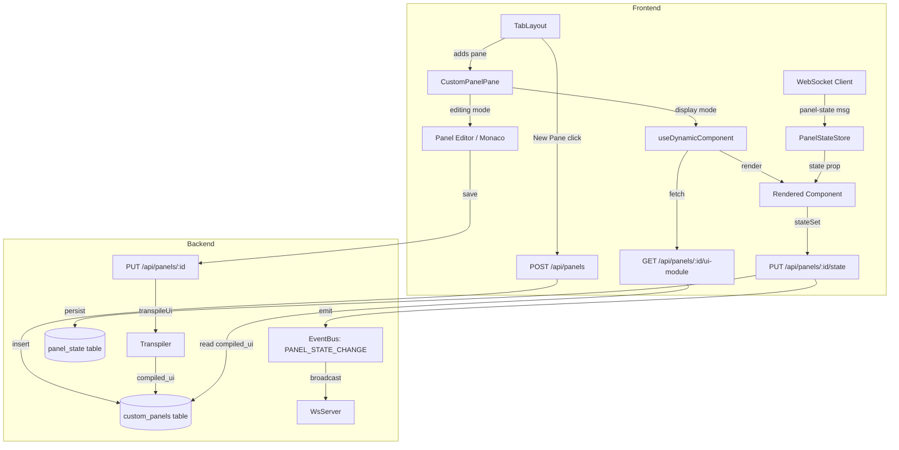

# Design Document: Custom Panels

## Overview

Custom Panels introduce a new first-class entity in Aeolus for UI-only dashboard components. They share the existing transpilation pipeline (`transpileUi`), dynamic component loading (blob URL + `import()`), and Monaco editor infrastructure with automations, but are purpose-built for data visualization and manual controls — no trigger topics, no conditions, no reactive logic.

The design mirrors the automation system's architecture (state store, CRUD API, WebSocket broadcasting, pane registration) while keeping the two systems fully independent at the data layer. This ensures Custom Panels can evolve without affecting the battle-tested automation engine.

### Key Design Decisions

1. **Separate tables, parallel architecture**: `custom_panels` and `panel_state` tables mirror `automation_rules` and `automation_state` but are completely independent. This avoids schema coupling and allows independent lifecycle management.

2. **Reuse `transpileUi` directly**: The existing TSX transpiler already handles the exact compilation needed. No wrapper or adapter required.

3. **Adapt `useDynamicComponent` with a URL parameter**: Rather than duplicating the hook, we parameterize the fetch URL so it works for both `/api/automations/:id/ui-module` and `/api/panels/:id/ui-module`.

4. **New event bus constant for panel state**: `PANEL_STATE_CHANGE` event type keeps panel state broadcasts distinct from automation state broadcasts in the WebSocket message stream.

5. **PanePicker exclusion via existing pattern**: The `custom-panel` pane type is added to the `EXCLUDED_FROM_PICKER` set, matching how `automation` is already excluded.

## Architecture



## Components and Interfaces

### Backend Components

#### 1. `PanelStateStore` (new class: `src/panels/panel-state-store.ts`)

Mirrors `AutomationStateStore` — per-panel key-value store with SQLite persistence and in-memory cache.

```typescript
export class PanelStateStore {
  private cache = new Map<string, Map<string, unknown>>();
  constructor(private readonly db: Database) {}

  loadFromDb(): void;
  get(panelId: string, key: string): unknown;
  getAll(panelId: string): Record<string, unknown>;
  set(panelId: string, key: string, value: unknown): void;
  delete(panelId: string, key: string): void;
  deleteAll(panelId: string): void;
}
```

#### 2. Panel Routes (new file: `src/api/routes/panel.routes.ts`)

```typescript
export function createPanelRoutes(
  db: Database,
  panelStateStore: PanelStateStore,
  eventBus: EventEmitter,
): Router;
```

Endpoints:
- `GET /api/panels` — list all panels
- `POST /api/panels` — create panel (body: `{ name }`)
- `GET /api/panels/:id` — get single panel
- `PUT /api/panels/:id` — update panel (body: `{ name?, uiSource? }`)
- `DELETE /api/panels/:id` — delete panel + state
- `GET /api/panels/:id/state` — get panel state
- `PUT /api/panels/:id/state` — set panel state key (body: `{ key, value }`)
- `GET /api/panels/:id/ui-module` — serve compiled JS as `application/javascript`

#### 3. Event Bus Extension (`src/core/event-bus.ts`)

```typescript
export const PANEL_STATE_CHANGE = "panel:state-change" as const;
```

#### 4. WebSocket Mapping (in `src/index.ts`)

Add to `WS_MAPPINGS`:
```typescript
{ eventName: PANEL_STATE_CHANGE, messageType: "panel-state" }
```

### Frontend Components

#### 5. `CustomPanelPane` (new file: `frontend/src/components/panes/CustomPanelPane.tsx`)

A self-contained pane component with two modes:
- **Editing mode**: Monaco editor (reuses `UiEditor` or `ScriptEditor` pattern) with save/cancel buttons
- **Display mode**: Renders the compiled component via `useDynamicComponent`, passing `CustomPanelProps`

```typescript
interface Props {
  config: PaneConfig; // { panelId: string }
  paneId?: string;
}
```

#### 6. `PanelStateStore` (frontend: `frontend/src/store/panel-state-store.ts`)

Zustand store mirroring `automation-state-store.ts`:

```typescript
interface PanelStateState {
  stateByPanel: Record<string, Record<string, unknown>>;
  setPanelState: (panelId: string, key: string, value: unknown) => void;
  initPanelState: (panelId: string, state: Record<string, unknown>) => void;
  clearPanelState: (panelId: string) => void;
}
```

#### 7. `useDynamicComponent` adaptation

The existing hook is parameterized to accept a module URL:

```typescript
export function useDynamicComponent(
  entityId: string,
  hasUiSource: boolean,
  moduleUrl?: string, // defaults to automation URL for backward compat
): DynamicComponentState;
```

For panels: `moduleUrl = \`${API_URL}/api/panels/${panelId}/ui-module\``

#### 8. Pane Registry Entry

```typescript
"custom-panel": {
  component: CustomPanelPane,
  displayName: "Custom Panel",
  defaultIcon: "layout-dashboard",
  defaultConfig: { panelId: "" },
  defaultSize: { w: 6, h: 8 },
  category: "controls",
}
```

#### 9. TabLayout Changes

Three buttons in header:
- **"New Automation"** (existing, unchanged) — gradient primary style
- **"New Pane"** — gradient primary style, creates panel via API then adds `custom-panel` pane
- **"Browse Panes"** (renamed from "Add Pane") — secondary outline style, opens PanePicker

#### 10. WebSocket Client Extension (`frontend/src/lib/ws-client.ts`)

Add handler for `panel-state` message type:
```typescript
} else if (msg.type === "panel-state") {
  const { panelId, key, value } = msg.data;
  usePanelStateStore.getState().setPanelState(panelId, key, value);
}
```

### Type Definitions

#### 11. `CustomPanelProps` (new file: `src/panels/panel-types.d.ts`)

```typescript
interface Device {
  id: string;
  name: string;
  type: string;
  capabilities: string[];
  state: Record<string, unknown>;
  integration: string;
  lastSeen: number;
}

interface CustomPanelProps {
  devices: Device[];
  panelId: string;
  panelName: string;
  deviceAction: (deviceId: string, actionType: string, params?: Record<string, unknown>) => Promise<void>;
  mqttPublish: (topic: string, payload: string) => void;
  state: Map<string, unknown>;
  stateSet: (key: string, value: unknown) => void;
}
```

This type definition is served to the Monaco editor for IntelliSense, analogous to `ui-types.d.ts` for automations.

## Data Models

### Database Schema

#### `custom_panels` table

| Column | Type | Constraints | Description |
|--------|------|-------------|-------------|
| id | TEXT | PRIMARY KEY | UUID v4 |
| name | TEXT | NOT NULL | User-provided panel name |
| ui_source | TEXT | DEFAULT NULL | Raw TSX source |
| compiled_ui | TEXT | DEFAULT NULL | Transpiled JavaScript |
| created_at | INTEGER | NOT NULL | Unix timestamp (ms) |
| updated_at | INTEGER | NOT NULL | Unix timestamp (ms) |

#### `panel_state` table

| Column | Type | Constraints | Description |
|--------|------|-------------|-------------|
| panel_id | TEXT | NOT NULL | FK to custom_panels.id |
| key | TEXT | NOT NULL | State key |
| value | TEXT | NOT NULL | JSON-serialized value |
| | | PRIMARY KEY (panel_id, key) | Composite PK |

### SQL DDL (added to `initSchema`)

```sql
CREATE TABLE IF NOT EXISTS custom_panels (
  id TEXT PRIMARY KEY,
  name TEXT NOT NULL,
  ui_source TEXT DEFAULT NULL,
  compiled_ui TEXT DEFAULT NULL,
  created_at INTEGER NOT NULL,
  updated_at INTEGER NOT NULL
);

CREATE TABLE IF NOT EXISTS panel_state (
  panel_id TEXT NOT NULL,
  key TEXT NOT NULL,
  value TEXT NOT NULL,
  PRIMARY KEY (panel_id, key)
);
```

### API Response Shapes

#### Panel Object (GET/POST/PUT responses)

```typescript
interface PanelResponse {
  id: string;
  name: string;
  uiSource: string | null;
  compiledUi: string | null;
  createdAt: number;
  updatedAt: number;
}
```

#### Panel State (GET /api/panels/:id/state)

```typescript
// Returns: Record<string, unknown>
{ "lastReading": 42, "mode": "auto" }
```

#### WebSocket Panel State Message

```typescript
{ type: "panel-state", data: { panelId: string, key: string, value: unknown } }
```

### Default Template

When a new panel is created, `ui_source` is populated with:

```tsx
import type { CustomPanelProps } from "./types";

export default function MyPanel(props: CustomPanelProps) {
  const { devices, panelName } = props;

  return (
    <div style={{ padding: "1rem" }}>
      <h2>{panelName}</h2>
      <p>{devices.length} devices available</p>
    </div>
  );
}
```


## Correctness Properties

*A property is a characteristic or behavior that should hold true across all valid executions of a system — essentially, a formal statement about what the system should do. Properties serve as the bridge between human-readable specifications and machine-verifiable correctness guarantees.*

### Property 1: Panel CRUD round-trip

*For any* valid panel name string, creating a panel via POST, then retrieving it by ID via GET, SHALL return a panel object with the same name, a valid UUID id, and the panel SHALL appear in the GET /api/panels list.

**Validates: Requirements 2.1, 2.2, 2.3**

### Property 2: Panel update persists source and compiled output

*For any* existing panel and any valid TSX source string that transpiles successfully, updating the panel via PUT with that source SHALL result in the stored panel having both `uiSource` equal to the input and `compiledUi` equal to the output of `transpileUi(source)`.

**Validates: Requirements 2.5, 4.3**

### Property 3: Panel deletion cascades to state

*For any* panel with any number of associated state entries, deleting the panel via DELETE SHALL remove the panel record and all entries in the `panel_state` table for that panel_id, leaving zero state entries.

**Validates: Requirements 1.4, 2.6**

### Property 4: Panel state round-trip

*For any* existing panel and any set of key-value pairs (where keys are non-empty strings and values are JSON-serializable), writing each pair via PUT `/api/panels/:id/state` then reading via GET `/api/panels/:id/state` SHALL return an object containing all written key-value pairs with values equal to what was written.

**Validates: Requirements 3.1, 3.2, 6.3**

### Property 5: Transpilation round-trip

*For any* valid TSX source that exports a default function component accepting `CustomPanelProps`, calling `transpileUi(source)` SHALL produce a success result whose JavaScript output, when loaded as an ES module, exports a default function (a renderable React component).

**Validates: Requirements 4.4**

### Property 6: Frontend store merges panel state updates

*For any* sequence of panel state update messages (each containing panelId, key, value), applying them to the `PanelStateStore` SHALL result in the store's `stateByPanel[panelId]` containing the latest value for each key, with earlier values for the same key being overwritten.

**Validates: Requirements 11.2**

### Property 7: Default template transpiles without errors

*For all* default templates generated for new Custom Panels, calling `transpileUi(template)` SHALL return a success result (no errors).

**Validates: Requirements 12.3**

## Error Handling

### Backend Errors

| Scenario | HTTP Status | Response Body | Behavior |
|----------|-------------|---------------|----------|
| POST /api/panels with missing `name` | 400 | `{ error: "name is required" }` | Reject creation |
| GET /api/panels/:id with non-existent ID | 404 | `{ error: "Panel not found" }` | Return not found |
| PUT /api/panels/:id with non-existent ID | 404 | `{ error: "Panel not found" }` | Return not found |
| PUT /api/panels/:id with invalid TSX | 200 | `{ ...panel, errors: [...] }` | Return errors, do NOT update compiled_ui |
| DELETE /api/panels/:id with non-existent ID | 404 | `{ error: "Panel not found" }` | Return not found |
| PUT /api/panels/:id/state for non-existent panel | 404 | `{ error: "Panel not found" }` | Return not found |
| PUT /api/panels/:id/state with missing key/value | 400 | `{ error: "key and value are required" }` | Reject update |

### Frontend Error Handling

- **Transpilation errors**: Displayed inline in the editor via Monaco markers (same pattern as `ScriptEditor`). Source is preserved — user can fix and retry.
- **Module load failure**: `useDynamicComponent` returns `{ error: "..." }` — the pane displays an error message with a retry option.
- **WebSocket disconnection**: State updates queue locally; on reconnect, a full state fetch re-syncs.
- **API unreachable**: Toast notification with retry guidance. Panel remains in last-known state.

### Error Boundary

The `CustomComponentBoundary` (existing React error boundary) wraps rendered panel components, catching runtime errors and displaying a fallback UI without crashing the entire dashboard.

## Testing Strategy

### Property-Based Tests (fast-check)

Property-based testing is appropriate for this feature because:
- The CRUD API has clear input/output behavior with a large input space (arbitrary strings for names, arbitrary valid TSX for sources)
- State management has round-trip properties (write/read)
- Transpilation has a round-trip property (source → compiled → loadable module)

**Library**: `fast-check` (already available in the project via vitest)
**Minimum iterations**: 100 per property test
**Tag format**: `Feature: custom-panels, Property {N}: {title}`

Each correctness property maps to a single property-based test:

1. **Property 1** — Generate random name strings, create panels, verify round-trip
2. **Property 2** — Generate random valid TSX templates, update panels, verify source + compiled stored
3. **Property 3** — Generate panels with random state entries, delete, verify cascade
4. **Property 4** — Generate random key-value pairs, write to state, read back, verify equality
5. **Property 5** — Generate valid TSX component sources, transpile, verify loadable output
6. **Property 6** — Generate sequences of state update messages, apply to store, verify final state
7. **Property 7** — Transpile the default template, verify success

### Unit Tests (example-based)

- Panel creation assigns default name "Untitled Pane"
- PanePicker excludes `custom-panel` from listing
- PanePicker header displays "Browse Panes"
- TabLayout renders three buttons with correct labels
- CustomPanelPane passes correct props (no automation-specific props)
- CustomPanelPane shows placeholder when no compiled UI exists
- Panel editor preserves source on transpilation failure
- 404 responses for non-existent panel IDs
- 400 response for missing required fields

### Integration Tests

- WebSocket broadcasts panel state changes to connected clients
- `deviceAction` from panel component reaches ActionExecutor
- Full flow: create panel → save TSX → render component → interact with state
- Panel removal from dashboard triggers API DELETE

### Test File Locations

- `src/panels/panel-state-store.test.ts` — PanelStateStore unit + property tests
- `src/api/routes/panel.routes.test.ts` — API route property + unit tests
- `frontend/src/store/panel-state-store.test.ts` — Frontend store property tests
- `frontend/src/components/panes/CustomPanelPane.test.tsx` — Component unit tests
