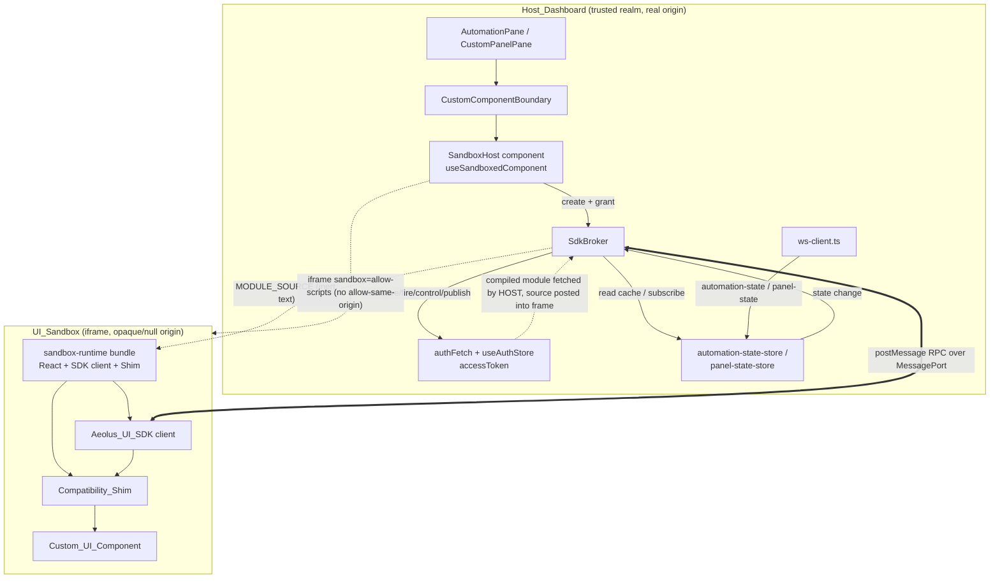
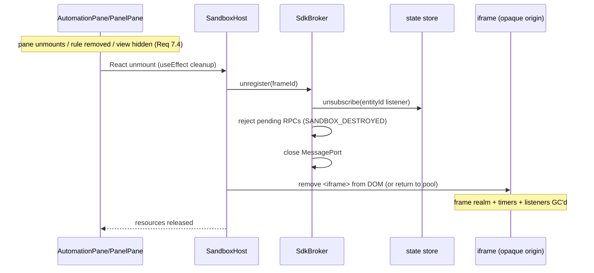

# Design Document: Custom UI Sandboxing

## Overview

Today a custom UI component authored for an automation (or a custom panel) is compiled to an ES module on the backend and then executed **directly in the dashboard page**. `frontend/src/hooks/useDynamicComponent.ts` fetches the compiled module via `authFetch`, rewrites its React import specifiers to `window.__AEOLUS_EXTERNALS__` (set in `frontend/src/main.tsx`), builds a `Blob`, and calls `import(blobUrl)`. The resulting component runs in the same JavaScript realm as the rest of the SPA, so it can read `useAuthStore.getState().accessToken`, call `authFetch` as the signed-in user, reach into other components' Zustand state, and touch the top-window DOM. There is no frontend trust boundary.

This design closes that gap by moving every custom component into an **opaque-origin sandboxed iframe** (Requirements 1–2). Each component renders inside `<iframe sandbox="allow-scripts">` — deliberately **without** `allow-same-origin` — so the browser assigns the frame a unique opaque origin. Same-origin policy then blocks the frame from scripting the host: it cannot read `window.parent.*`, `useAuthStore`, `authFetch`, or `window.__AEOLUS_EXTERNALS__`. The only channel between the frame and the host is a `postMessage`-based **RPC channel** (Requirement 4) that carries a small, capability-scoped **Aeolus UI SDK** (Requirement 3). A host-side **SDK broker** validates the origin and schema of every message, scopes each privileged operation to the one rule/panel the frame was granted, and performs the operation with the host's trusted credentials (`authFetch`, the state stores, the WebSocket stream).

A first-class product constraint is **experience parity** (Requirement 5): existing components must keep working unchanged. A **compatibility shim** loaded inside the frame reconstructs the exact `CustomComponentProps` object (`frontend/src/components/panes/custom/types.ts`) from SDK calls, so an author's component sees the same `read`/`save`/`saveAndFire`/`fire`/`control`/`publish`/`devices`/`history`/`lastFired`/`enabled`/`ruleId`/`ruleName` surface it sees today. Because custom code no longer runs in the host page, the host CSP is tightened (Requirement 11): `'unsafe-eval'` and `blob:` are removed from the host `script-src`, while a separate, narrow CSP governs the sandbox document.

The same iframe host serves both entities:
- **Automations** — module from `GET /api/automations/:id/ui-module`, props contract `CustomComponentProps` (`read/save/saveAndFire/fire/control/publish/...`), live state via `automation-state` WebSocket messages (`frontend/src/store/automation-state-store.ts`).
- **Panels** — module from `GET /api/panels/:id/ui-module`, props contract `CustomPanelProps` (`deviceAction/mqttPublish/state/stateSet/...` per the `custom-panels` spec), live state via `panel-state` WebSocket messages.

### Scope

In scope: the iframe isolation layer, the RPC channel, the Aeolus UI SDK + broker, the compatibility shim, the replacement of `useDynamicComponent`, CSP hardening in `frontend/nginx.conf`, sandbox lifecycle/pooling for Raspberry-Pi-class hardware, trusted/untrusted modes, the v1 fallback, and documentation accuracy.

Out of scope (referenced, not restated): backend transpilation/storage/module endpoints and the `CustomComponentProps` contract itself (owned by `runtime-custom-ui` and `custom-panels`); the backend `isolated-vm` automation sandbox; a marketplace; and the optional **dedicated separate server origin** hardening (Requirement 2.10) — noted as future defense-in-depth, not built in v1.

### Key Design Decisions

1. **Opaque-origin iframe over a second server origin.** `sandbox="allow-scripts"` without `allow-same-origin` yields a null origin with no extra port, subdomain, or DNS — which matters on a bare-IP Raspberry Pi (Requirement 2.2, 2.10). The tradeoff (shared server origin means a sandbox-escape bug is less defended than a truly separate origin) is accepted for v1 and documented as a future hardening.

2. **Host fetches the module; the frame evaluates it.** A sandboxed opaque-origin frame has a null origin and therefore cannot attach the bearer token, and `import(blobUrl)` from the *parent* realm would execute in the parent, defeating isolation. So the **host** fetches the compiled module text via `authFetch` (keeping Requirement 2.9 — same `UI_Module_Endpoint`) and posts the **source string** into the frame over the RPC channel. The frame builds its *own* `Blob` in its *own* realm and `import()`s it there. The token never crosses into the frame; only inert source text does. This is the crux of the design and is worked through in "The sandbox runtime."

3. **A self-contained sandbox runtime bundle.** Because `window.__AEOLUS_EXTERNALS__` is unreachable, React, the SDK client, and the compatibility shim are bundled into a small static asset (`sandbox-runtime`) that the sandbox document loads. The author's module still imports `react`/`react-dom`/`react/jsx-runtime`; the frame rewrites those specifiers to the runtime's in-frame React instance (same `rewriteImports` idea, different target).

4. **One broker, per-frame capability grant.** A single host `SdkBroker` manages all frames. Each frame is registered with an immutable `{ frameId, entityType, entityId }` grant at creation. Every inbound message is matched to its grant by `MessagePort` identity; the broker ignores any `entityId` the *frame* sends and always uses the granted one (Requirements 1.5, 4.5).

5. **Dedicated `MessagePort` per frame.** The handshake transfers one half of a `MessageChannel` to the frame. All subsequent RPC flows over that port, so origin/target validation is structural (a port belongs to exactly one frame) rather than string-comparing `event.origin` (which is `"null"` for every opaque-origin frame and therefore not distinguishing on its own).

6. **Reuse the existing error boundary and stores.** Load/exec failures surface through `CustomComponentBoundary` (Requirement 2.7); live state continues to flow through the existing `automation-state-store` / panel store fed by `ws-client.ts`.

## Architecture

### Component / message-flow



Two representative flows:

**State change (host → sandbox).** A WebSocket `automation-state` message arrives; `ws-client.ts` calls `setRuleState(ruleId, key, value)` on the store. The `SdkBroker` subscribes to the store for the frame's granted `ruleId`; on change it posts a `state-event` over that frame's port. The in-frame SDK delivers it to the shim, which updates the reactive value the component reads via `aeolus.read(key)`, triggering a re-render (Requirement 5.2).

**SDK call (sandbox → host → effect → response).** The component calls `aeolus.control(deviceId, "toggle")`. The shim turns it into an SDK `request` (`op: "control"`, unique `id`) posted over the port. The broker validates origin (port identity) + schema, confirms `control` is on the allowlist, then runs `authFetch(POST /api/devices/:id/action)` with the host token, and posts back a `response` with the same `id`. The shim resolves the `Promise` the component `await`ed (Requirement 4.6, 5.1).

### Component teardown



## Components and Interfaces

All new frontend code lives under `frontend/src/`. Proposed layout:

```
frontend/src/sandbox/
  rpc-types.ts          # shared RPC envelope + op schemas (host & frame import)
  sdk-broker.ts         # host-side SdkBroker
  useSandboxedComponent.ts  # host-side hook
  SandboxHost.tsx       # host-side iframe wrapper component
  runtime/
    entry.ts            # sandbox-runtime bundle entry (runs INSIDE the frame)
    sdk-client.ts       # Aeolus_UI_SDK client (inside frame)
    shim.ts             # Compatibility_Shim (inside frame)
    module-loader.ts    # in-frame rewriteImports + blob import
frontend/public/sandbox.html   # static sandbox document (served by nginx)
```

### RPC envelope and operation schema (`sandbox/rpc-types.ts`)

Shared by host and frame so both validate against one definition.

```typescript
/** Entities that can host a sandboxed component. */
export type EntityType = "automation" | "panel";

/** Capability operations the SDK may request. This list IS the allowlist. */
export type SdkOp =
  | "read"        // read one state key (from host cache) → value
  | "save"        // persist key/value (PUT state)
  | "saveAndFire" // persist + fire logic (state-set)
  | "fire"        // fire a named UI event with payload
  | "control"     // device action (async, returns after host round-trip)
  | "publish"     // MQTT publish
  | "subscribe";  // subscribe to state changes for this entity (idempotent)

/** Direction: frame → host request. */
export interface RpcRequest {
  channel: "aeolus-sdk";           // fixed discriminator
  kind: "request";
  id: string;                      // uuid, unique per frame; correlates the response
  op: SdkOp;
  /** Operation payload; shape validated per-op by the broker. */
  params: Record<string, unknown>;
}

/** Direction: host → frame response to a specific request. */
export interface RpcResponse {
  channel: "aeolus-sdk";
  kind: "response";
  id: string;                      // echoes RpcRequest.id
  ok: boolean;
  /** Present when ok === true. */
  result?: unknown;
  /** Present when ok === false. */
  error?: RpcError;
}

/** Direction: host → frame unsolicited event (state updates, prop updates). */
export interface RpcEvent {
  channel: "aeolus-sdk";
  kind: "event";
  event: "state" | "props";
  /** For "state": { key, value }. For "props": a PropsPayload patch. */
  data: Record<string, unknown>;
}

/** Direction: host → frame one-time bootstrap after handshake. */
export interface RpcInit {
  channel: "aeolus-sdk";
  kind: "init";
  entityType: EntityType;
  /** Compiled module source text fetched by the host via authFetch. */
  moduleSource: string;
  /** Initial props payload (devices, ids, history, etc.). */
  props: PropsPayload;
}

export type RpcMessage = RpcRequest | RpcResponse | RpcEvent | RpcInit;

export interface RpcError {
  code:
    | "UNKNOWN_OP"          // op not on the allowlist
    | "BAD_SCHEMA"          // params failed validation
    | "OP_FAILED"           // host operation threw / network error
    | "TIMEOUT"             // no response within budget
    | "SANDBOX_DESTROYED";  // frame torn down before response
  message: string;
}
```

Notes:
- `kind: "handshake"` is sent by the frame via `window.parent.postMessage` (the only message ever sent that way). Everything else uses the transferred `MessagePort`. The handshake carries no privileged data — it only tells the host "I'm ready; give me my port."
- The broker validates `params` per `op` (see Data Models). Any message missing `channel === "aeolus-sdk"`, or with an unknown `op`, is discarded (Requirements 4.3, 4.4, 3.7).

### Aeolus UI SDK client (`sandbox/runtime/sdk-client.ts`, runs in frame)

The only interface custom code (through the shim) uses to reach Aeolus (Requirement 3.1).

```typescript
export interface AeolusUiSdk {
  /** Read the latest known value for a state key (served from host cache). */
  read(key: string): Promise<unknown>;
  /** Persist a key/value for this entity. */
  save(key: string, value: unknown): Promise<void>;
  /** Persist and fire the logic tab (state-set). */
  saveAndFire(key: string, value: unknown): Promise<void>;
  /** Fire a named UI event with optional payload. */
  fire(eventName: string, payload?: Record<string, unknown>): Promise<void>;
  /** Control a device; resolves after the host completes the action. */
  control(deviceId: string, actionType: string, params?: Record<string, unknown>): Promise<void>;
  /** Publish an MQTT message. */
  publish(topic: string, payload: string): Promise<void>;
  /** Subscribe to state changes for this entity. Returns an unsubscribe fn. */
  subscribeState(listener: (key: string, value: unknown) => void): () => void;
  /** Subscribe to props patches (devices/history/lastFired/enabled changes). */
  subscribeProps(listener: (patch: Partial<PropsPayload>) => void): () => void;
  /** The most recent full props payload (synchronously available after init). */
  getProps(): PropsPayload;
}
```

Implementation sketch: the client owns the frame's `MessagePort`, keeps a `Map<id, {resolve, reject, timer}>` of pending requests, generates `id`s, applies a per-request timeout (default 8 s, Requirement 7.2), and dispatches `event` messages to registered listeners. `read` is answered from the host cache rather than a network call so it stays synchronous-ish and cheap; the shim exposes it as a synchronous getter over a locally-mirrored snapshot (see shim).

### SDK broker (`sandbox/sdk-broker.ts`, host)

```typescript
export interface FrameGrant {
  frameId: string;
  entityType: EntityType;
  /** The ONLY rule/panel id this frame may act on. Frame-supplied ids are ignored. */
  entityId: string;
  port: MessagePort;
}

export interface BrokerDeps {
  /** Bound to authFetch + API_URL; performs the privileged effect for an op. */
  control: (entityId: string, deviceId: string, actionType: string, params?: Record<string, unknown>) => Promise<void>;
  save: (entityType: EntityType, entityId: string, key: string, value: unknown) => void;
  saveAndFire: (entityType: EntityType, entityId: string, key: string, value: unknown) => void;
  fire: (entityType: EntityType, entityId: string, eventName: string, payload?: Record<string, unknown>) => void;
  publish: (topic: string, payload: string) => void;
  /** Read latest cached state value for a key. */
  readState: (entityType: EntityType, entityId: string, key: string) => unknown;
  /** Subscribe to state changes for an entity; returns unsubscribe. */
  subscribeState: (entityType: EntityType, entityId: string, cb: (key: string, value: unknown) => void) => () => void;
}

export class SdkBroker {
  constructor(deps: BrokerDeps);
  /** Register a frame + its immutable grant; wires the port's onmessage. */
  register(grant: FrameGrant): void;
  /** Tear down a frame: unsubscribe, reject pending, close port. */
  unregister(frameId: string): void;
  /** Push a state change into a frame (called by the store subscription). */
  private emitState(frameId: string, key: string, value: unknown): void;
  /** Validate + dispatch a single inbound message (pure enough to unit/property test). */
  private handleMessage(grant: FrameGrant, raw: unknown): Promise<void>;
}
```

Message handling algorithm (`handleMessage`):
1. Structurally validate `raw` is an `RpcRequest` with `channel === "aeolus-sdk"`, `kind === "request"`, string `id`, and `op ∈ SdkOp`. Else **discard** (no effect) — Requirements 4.3, 4.4.
2. Validate `params` against the op schema (Data Models table). On failure, respond `{ ok:false, error:{ code:"BAD_SCHEMA" } }` and perform **no** privileged action — Requirement 3.7, 4.4.
3. Execute the op through `deps`, **always** passing `grant.entityId` (never a frame-supplied id) — Requirements 1.5, 4.5.
4. Post an `RpcResponse` with the same `id`; on a thrown/rejected effect, respond `{ ok:false, error:{ code:"OP_FAILED" } }` — Requirement 4.6.

The broker exposes no token, no `authFetch`, and no generic request op (Requirement 3.6): the `deps` functions are the entire privileged surface, each pre-bound on the host side.

### Sandbox runtime bootstrap (`sandbox/runtime/entry.ts` + `public/sandbox.html`)

`frontend/public/sandbox.html` is a tiny static document served by nginx at `/sandbox.html`. It has no inline privileged data; it only loads the runtime bundle:

```html
<!doctype html>
<html>
  <head><meta charset="utf-8" /><!-- sandbox CSP set by nginx (see CSP section) --></head>
  <body><div id="sandbox-root"></div><script type="module" src="/assets/sandbox-runtime.js"></script></body>
</html>
```

The frame is created by the host as `<iframe sandbox="allow-scripts" src="/sandbox.html">`. Because the sandbox attribute omits `allow-same-origin`, the browser loads `/sandbox.html` into a **null (opaque) origin** even though the URL is same-site. The runtime `entry.ts`, executing inside that opaque origin:

1. Posts a `handshake` to `window.parent` (`postMessage({channel:"aeolus-sdk", kind:"handshake"}, "*")`). This is the only `parent` message; it carries nothing sensitive.
2. Receives the host reply whose `event.ports[0]` is the frame's dedicated `MessagePort`; keeps it and ignores all further `window` messages.
3. Receives the `init` message (over the port): `{ entityType, moduleSource, props }`.
4. Calls `module-loader.ts`: `rewriteImports(moduleSource)` rewrites `react` / `react-dom` / `react/jsx-runtime` specifiers to the runtime's bundled React (not `window.__AEOLUS_EXTERNALS__`), builds a `Blob`, and `import()`s it **inside the frame's realm**. The token was never here; only text was.
5. Builds the SDK client bound to the port, builds the shim from `entityType` + `props`, then `createRoot(#sandbox-root).render(<Shim Component={mod.default} />)`.

Bundling: `sandbox-runtime` is a separate Vite entry/rollup input producing `assets/sandbox-runtime.js` (contains React 19, `react-dom/client`, `jsx-runtime`, the SDK client, the shim, and the loader). It is the *only* React copy in the frame, so hook identity is consistent — the reason the current design uses shared externals is preserved, just relocated into the frame.

### Host hook and wrapper (`sandbox/useSandboxedComponent.ts`, `SandboxHost.tsx`)

`SandboxHost` replaces the render path that `useDynamicComponent` + `<Component .../>` occupied inside `DynamicCustomSection` (in `frontend/src/components/panes/AutomationPane.tsx`) and the equivalent in `CustomPanelPane`.

```typescript
export interface SandboxHostProps {
  entityType: EntityType;
  entityId: string;              // ruleId or panelId (the grant)
  hasUiSource: boolean;
  /** Full initial props payload assembled by the pane (devices, ids, history…). */
  props: PropsPayload;
  /** Live props the pane already computes (devices, lastFired, enabled, history). */
  className?: string;
}
```

`useSandboxedComponent(entityType, entityId, hasUiSource)` returns `{ status: "idle"|"loading"|"ready"|"error", error, frameRef, sendPropsPatch }` and, in a `useEffect`:
1. If `!hasUiSource` → idle.
2. `authFetch(moduleUrl)` where `moduleUrl` is `/api/automations/:id/ui-module` or `/api/panels/:id/ui-module` (Requirement 2.9) → module source text (on non-OK, set `error`).
3. Create/adopt an iframe (see pooling), await its `handshake`, `MessageChannel`, transfer `port2` to the frame and give `port1` to the `SdkBroker.register(grant)`.
4. Post `init` with `{ entityType, moduleSource, props }`.
5. Return cleanup that calls `SdkBroker.unregister(frameId)` and releases/pools the iframe (Requirement 7.4).

`SandboxHost` renders the `<iframe>` and, on the host side, is wrapped by `CustomComponentBoundary` exactly as today. Load/exec errors reported by the frame (or a handshake timeout) set `status:"error"`, which renders the same inline error UI `DynamicCustomSection` already shows; a thrown host-side error is still caught by the boundary (Requirement 2.7).

Integration points changed:
- `frontend/src/components/panes/AutomationPane.tsx` — `DynamicCustomSection` swaps `useDynamicComponent(ruleId, hasUiSource)` + `<Component {...props}/>` for `<SandboxHost entityType="automation" entityId={ruleId} hasUiSource={hasUiSource} props={...} />`. The `control`, `publish`, `read`, `save`, `saveAndFire`, `fire` callbacks the pane already builds become the `BrokerDeps` for automations (same `authFetch` calls, now invoked by the broker on the frame's behalf).
- `CustomPanelPane` (from `custom-panels`) — same swap with `entityType="panel"`, mapping `CustomPanelProps` (`deviceAction`/`mqttPublish`/`state`/`stateSet`) onto the broker deps.
- `frontend/src/hooks/useDynamicComponent.ts` — removed once both call sites migrate. `rewriteImports` is **moved** into `sandbox/runtime/module-loader.ts` (retargeted to the in-frame React) and its existing unit tests move with it.

### Compatibility shim (`sandbox/runtime/shim.ts`, runs in frame)

The shim reconstructs the exact props object the author's component expects, routing every call through the SDK. For automations it produces `CustomComponentProps`:

```typescript
export function buildAutomationProps(sdk: AeolusUiSdk): CustomComponentProps {
  const snapshot = sdk.getProps(); // devices, ruleId, ruleName, lastFired, enabled, history + initial state map
  const stateMirror = new Map<string, unknown>(Object.entries(snapshot.state ?? {}));
  // subscribeState keeps stateMirror current and triggers a React re-render.
  return {
    devices: snapshot.devices,
    ruleId: snapshot.ruleId,
    ruleName: snapshot.ruleName,
    lastFired: snapshot.lastFired,
    enabled: snapshot.enabled,
    history: snapshot.history,
    read: (key) => stateMirror.get(key),                 // sync, matches current AutomationPane.read
    save: (key, value) => void sdk.save(key, value),      // fire-and-forget, matches current save
    saveAndFire: (key, value) => void sdk.saveAndFire(key, value),
    fire: (eventName, payload) => void sdk.fire(eventName, payload),
    control: (deviceId, actionType, params) => sdk.control(deviceId, actionType, params), // returns Promise<void>
    publish: (topic, payload) => void sdk.publish(topic, payload),
  };
}
```

Reactive updates: the shim wraps the author's component in a small host component (inside the frame) that subscribes via `sdk.subscribeState` and `sdk.subscribeProps`. A state change updates `stateMirror` and bumps a `useState` version so `read(key)` returns the new value on re-render (Requirement 5.2). Props patches (devices/history/lastFired/enabled) replace the corresponding fields and re-render (Requirement 5.3). Styling is unaffected because the author's className/JSX render normally inside the frame document, which loads the same compiled CSS (Requirement 5.4).

`control` correctly returns a `Promise<void>` that resolves only when the broker's response for that `id` arrives, preserving the current `await aeolus.control(...)` behavior over async RPC (Requirement 5.1). `save`/`saveAndFire` remain fire-and-forget with the same observable result (persist + broadcast) as the current `sendStateUpdate`/`sendStateUpdateAndFire` (Requirement 5.5).

For panels, `buildPanelProps(sdk)` produces `CustomPanelProps` from the same SDK: `deviceAction → control`, `mqttPublish → publish`, `state → the mirrored Map`, `stateSet → save`.

## Data Models

### Handshake and init sequence

```
frame (opaque origin)                     host (SandboxHost)
  | -- postMessage({kind:"handshake"}, "*") -->  |   (host verifies event.source === iframe.contentWindow)
  |                                              |   channel = new MessageChannel()
  | <-- postMessage({kind:"ack"}, "*", [port2]) |   SdkBroker.register({frameId, entityType, entityId, port: port1})
  |  (frame keeps port2, ignores further        |
  |   window messages)                          |
  | <== init {entityType, moduleSource, props} =|   (over port1)
  |  import(blob(rewrite(moduleSource)))         |
  |  render(<Shim/>)                             |
```

The host identifies the frame by `event.source === iframeEl.contentWindow` at handshake time (the one place a `window`-level message is trusted), then never trusts `window` messages again — all RPC is port-scoped, so `event.origin` being `"null"` for every opaque frame is not relied upon for distinguishing frames (Requirement 4.2).

### Props payload (host → frame)

```typescript
export interface PropsPayload {
  entityType: EntityType;
  ruleId: string;          // == panelId for panels
  ruleName: string;        // == panelName for panels
  lastFired: number | null;
  enabled: boolean;
  devices: Device[];       // frontend/src/store/device-store Device[]
  history: ExecutionEntry[]; // custom/types ExecutionEntry[]
  state: Record<string, unknown>; // initial state snapshot
}
```

Sent in full at `init`, then as partial patches via `RpcEvent{event:"props"}` when the pane's `devices`/`history`/`lastFired`/`enabled` change (Requirement 5.3).

### Per-op params schema (validated by the broker)

| op | params shape | privileged effect (always scoped to grant.entityId) |
|----|--------------|------------------------------------------------------|
| `read` | `{ key: string }` | return cached state value for key |
| `save` | `{ key: string, value: JSON-serializable }` | `PUT /api/{entity}s/:id/state` |
| `saveAndFire` | `{ key: string, value: JSON-serializable }` | PUT state + `POST /:id/fire` (`ui/{id}/state-set`) |
| `fire` | `{ eventName: string, payload?: object }` | `POST /:id/fire` with eventName |
| `control` | `{ deviceId: string, actionType: string, params?: object }` | `POST /api/devices/:deviceId/action` |
| `publish` | `{ topic: string, payload: string }` | `POST /api/mqtt/publish` |
| `subscribe` | `{}` | idempotent: start forwarding state-events for entityId |

Validation rules: required string fields must be non-empty strings; `value` must be structured-cloneable/JSON-serializable; unknown extra keys are ignored; any violation → `BAD_SCHEMA`, no effect.

### State event (host → frame)

```typescript
{ channel:"aeolus-sdk", kind:"event", event:"state", data:{ key: string, value: unknown } }
```

Emitted when the store's `stateByRule[entityId]` (or `stateByPanel[entityId]`) changes, sourced from the existing `automation-state` / `panel-state` WebSocket messages routed by `ws-client.ts`.


## Correctness Properties

*A property is a characteristic or behavior that should hold true across all valid executions of a system — essentially, a formal statement about what the system should do. Properties serve as the bridge between human-readable specifications and machine-verifiable correctness guarantees.*

The **pure logic** of this feature is well-suited to property-based testing: the `SdkBroker` message-validation/dispatch/scoping, the compatibility shim's props reconstruction, the save/read round-trip, and the sandbox lifecycle bookkeeping. These are functions with clear input/output behavior over a large input space (arbitrary ops, arbitrary entity ids, arbitrary malformed envelopes, arbitrary props payloads, arbitrary mount/unmount sequences). The browser-enforced isolation guarantees (Requirements 1.2–1.4, 2.5, 2.8) and CSP/config assertions (Requirement 11) are **not** property-based — they are verified by e2e (Playwright) and deterministic config/smoke checks, per the Testing Strategy.

The broker is designed so `handleMessage` can be driven with an in-memory fake `MessagePort` and spy `BrokerDeps`, making these properties executable without a real iframe.

### Property 1: Every privileged operation is scoped to the frame's granted entity

*For any* registered frame with grant `{entityId: G}`, and *for any* well-formed SDK request carrying *any* frame-supplied identifier `F` (including `F ≠ G` or a spoofed `entityId` field), the broker SHALL invoke the corresponding `BrokerDeps` effect with `G` and never with `F`; and when multiple frames are registered, a message delivered on a given frame's port SHALL be attributed to that frame's grant only.

**Validates: Requirements 1.5, 3.2, 3.3, 3.4, 4.2, 4.5**

### Property 2: State subscriptions are delivered only for the granted entity

*For any* registered frame granted entity `G`, and *for any* sequence of state changes each targeting some entity id, the frame SHALL receive a `state` event for exactly those changes whose entity id equals `G`, and SHALL receive no state event for changes targeting any other entity id.

**Validates: Requirements 3.5, 5.2**

### Property 3: Invalid messages are rejected with no privileged effect

*For any* inbound message that is malformed (missing `channel === "aeolus-sdk"`, wrong `kind`, missing/ non-string `id`), or names an `op` not on the capability allowlist, or carries `params` that fail the op schema, the broker SHALL perform zero `BrokerDeps` effects, and SHALL either discard the message (structural/origin failure) or return a structured error response (recognized request that fails schema/allowlist) — never a success.

**Validates: Requirements 3.7, 4.3, 4.4**

### Property 4: Every well-formed request yields exactly one correlated response

*For any* sequence of well-formed SDK requests with unique ids (whose underlying effects may succeed or throw), the broker SHALL produce exactly one response per request, each response's `id` SHALL equal its request's `id` (a one-to-one correlation), and each response SHALL be either `{ok:true, result}` or `{ok:false, error}` with a well-formed `RpcError`.

**Validates: Requirements 4.6, 5.1**

### Property 5: The shim reconstructs the full CustomComponentProps surface

*For any* `PropsPayload`, the object produced by the compatibility shim SHALL expose `devices`, `ruleId`, `ruleName`, `lastFired`, `enabled`, and `history` equal to the payload's corresponding values, expose `read`/`save`/`saveAndFire`/`fire`/`control`/`publish` as callable functions, and `read(key)` SHALL return the payload's initial state value for `key` (or `undefined` when absent).

**Validates: Requirements 5.3, 6.1**

### Property 6: Save/read round-trip preserves values through the SDK

*For any* key (non-empty string) and *any* JSON-serializable value, calling the shim's `save(key, value)` (which dispatches an SDK `save` and mirrors it locally) followed by `read(key)` SHALL return a value equal to the saved value, and the broker SHALL have issued the persist effect scoped to the frame's granted entity id.

**Validates: Requirements 5.5, 3.3**

### Property 7: Sandbox lifecycle releases resources and respects the pool bound

*For any* sequence of frame register/unregister (mount/unmount) operations, at every step the number of live sandbox frames SHALL not exceed the configured pool cap, and after a frame is unregistered the broker SHALL hold no registration for it, hold no active state subscription for it, and SHALL have rejected every still-pending request for it with a `SANDBOX_DESTROYED` error.

**Validates: Requirements 7.3, 7.4**

## Error Handling

### Sandbox load and execution errors (Requirement 2.7)

| Scenario | Detection | Host behavior |
|----------|-----------|---------------|
| Module fetch non-OK (404/500) | `authFetch` response in `useSandboxedComponent` | `status:"error"`, inline error (same UI as today's `dynamicError`); no frame created |
| Network error fetching module | `authFetch` throws | `status:"error"` with connection message |
| Handshake never arrives | timeout (default 5 s) | `status:"error"` ("sandbox failed to initialize"); frame removed/pooled |
| Module fails to `import()` inside frame | frame posts an `error` event after `init` | `status:"error"`; frame torn down |
| Component throws during render inside frame | frame's in-frame error boundary posts `error`; host sets error status | inline fallback; dashboard unaffected |
| Host-side throw while wiring the frame | React render throw | caught by `CustomComponentBoundary` → "Show Default View" fallback |

In all cases the host page keeps operating; a failing component never takes down the dashboard.

### RPC and message errors

| Scenario | Broker behavior |
|----------|-----------------|
| Malformed envelope / wrong `channel` / bad `id` | Discard silently; no response, no effect (Property 3) |
| Unknown `op` (not on allowlist) | Respond `{ok:false, error:{code:"UNKNOWN_OP"}}`; no effect |
| Well-formed op, bad `params` | Respond `{ok:false, error:{code:"BAD_SCHEMA"}}`; no effect |
| Effect throws / `authFetch` rejects | Respond `{ok:false, error:{code:"OP_FAILED", message}}` |
| No response within request timeout (frame side) | SDK client rejects the pending promise with `{code:"TIMEOUT"}`; the shim surfaces it to the component (e.g. `control` promise rejects) |
| Frame torn down with requests pending | Reject each pending with `{code:"SANDBOX_DESTROYED"}` (Property 7) |
| Message on an unknown/closed port | Ignored (port not registered) |

Errors returned to the frame are structured (`RpcError`), never raw host exceptions or stack traces that could leak host internals.

### Trusted vs Untrusted mode and the v1 fallback

- **Untrusted_Mode (default, drives the design):** full iframe isolation (`sandbox="allow-scripts"` only) + broker allowlist enforced for every component (Requirements 8.2, 8.4).
- **Trusted_Mode (v1):** the *provenance* assumption relaxes (components are assumed self-authored by the single admin), but the **runtime isolation posture is identical** — the same opaque-origin iframe and the same SDK allowlist apply. v1 does not relax the sandbox or grant extra capabilities (Requirement 8.3). This keeps a single, well-tested runtime path.
- **V1 fallback (Requirement 9):** if full isolation must be deferred, the system formally designates custom UI as trusted-administrator code and the documentation is corrected to state that custom UI runs with dashboard-level privileges and is **not** isolated — removing any "sandboxed" claim (Requirements 9.2–9.4, 10.2). Because this design ships the isolation, the fallback is documented but not activated.

### Backward compatibility and migration (Requirement 6)

The compatibility shim reconstructs `CustomComponentProps` exactly, so components authored against the current contract run unchanged (Requirement 6.2). Known edge cases that require a documented migration:
- Components that read host globals directly (`window.parent`, `useAuthStore`, `window.__AEOLUS_EXTERNALS__`) instead of using the `aeolus` props — these break by design and must switch to the provided props/SDK.
- Components that reach into the top-window DOM or other panes — must confine themselves to their own render tree.
- Components performing their own `fetch`/network calls — must route through the provided capabilities (`control`, `publish`, `save`, `fire`); arbitrary egress is blocked by the sandbox CSP.

The migration path for each is: replace direct global/DOM/network access with the corresponding `aeolus.*` prop. Unmigrated components that only use the documented props need no changes.

## Content Security Policy Changes (`frontend/nginx.conf`)

The tightening targets `script-src` execution of user code in the host page. `worker-src` is evaluated separately so Monaco keeps working (Requirements 11.2, 11.5).

**Before (host document):**

```
default-src 'self'; script-src 'self' 'unsafe-inline' 'unsafe-eval' blob:; worker-src 'self' blob:; style-src 'self' 'unsafe-inline'; img-src 'self' data: blob:; font-src 'self' data:; connect-src 'self' http: https: ws: wss:; object-src 'none'; base-uri 'self'
```

**After (host document):** remove `'unsafe-eval'` and `blob:` from `script-src` (the in-page `import(blobUrl)` loader no longer exists); keep `worker-src 'self' blob:` for Monaco; allow the host to frame the same-origin sandbox document via `frame-src 'self'`.

```
default-src 'self'; script-src 'self' 'unsafe-inline'; worker-src 'self' blob:; style-src 'self' 'unsafe-inline'; img-src 'self' data: blob:; font-src 'self' data:; connect-src 'self' http: https: ws: wss:; frame-src 'self'; object-src 'none'; base-uri 'self'
```

**Sandbox document (`/sandbox.html`), new nginx `location = /sandbox.html`:** its own CSP permits in-frame module execution (the frame builds its own blob and imports it) while denying network egress so the SDK/RPC channel is the only path out (Requirements 11.3, 2.8):

```
default-src 'none'; script-src 'self' blob:; style-src 'self' 'unsafe-inline'; img-src 'self' data: blob:; font-src 'self' data:; connect-src 'none'; base-uri 'none'; form-action 'none'
```

Framing headers: the current global `X-Frame-Options SAMEORIGIN` allows the host to frame its own `/sandbox.html` (same site), so it is retained on the host document. The isolation does not depend on `X-Frame-Options` — it depends on the iframe `sandbox` attribute omitting `allow-same-origin`. `frame-ancestors 'self'` may be added to the sandbox document to ensure only the Aeolus host can embed it. `connect-src 'none'` on the sandbox document is what enforces "no arbitrary egress" (Requirement 2.8); note the compiled module is delivered as posted text (not a network fetch by the frame), so `'none'` does not impede loading.

The `/sandbox.html` document and its `sandbox-runtime.js` asset must be reachable, so the SPA-fallback `location /` and `location /assets/` continue to serve them; only the two CSP strings and the new `frame-src` change. All edits are in `frontend/nginx.conf` (Requirement 11.4).

## Performance on Constrained Hardware (Raspberry Pi)

An iframe-per-component has real cost on a Pi (each frame is a document + its own React runtime instance). The design bounds this:

- **Runtime bundle is loaded once per frame but cached by the browser** — `sandbox-runtime.js` is a single immutable asset (`Cache-Control: immutable`), so only the first frame pays the network cost; subsequent frames load it from cache.
- **Frame pooling and reuse (Requirement 7.3).** `SandboxHost` draws frames from a pool (`SANDBOX_POOL_CAP`, default **4** concurrent live frames, tuned for a typical Pi dashboard view). When a component unmounts, its frame is reset (`init` with a fresh grant) and returned to the pool rather than destroyed; when the pool is exhausted the least-recently-used idle frame is evicted. Property 7 guarantees the live count never exceeds the cap.
- **Teardown on unmount (Requirement 7.4).** Unmount unregisters the broker entry, unsubscribes from the store, rejects pending RPCs, and closes the port; the frame is pooled or removed. No listeners/timers leak.
- **RPC overhead bound (Requirement 7.2).** State updates are the hot path. Target upper bound: **≤ 5 ms per state update** end-to-end on the Pi (store change → `postMessage` → shim re-render dispatch), and the broker coalesces multiple synchronous state changes for the same frame into a single `state` event per animation frame to avoid message storms. `read` is answered from the mirrored snapshot with **zero** RPC round-trips.
- **Concurrency guidance (Requirement 7.1).** A dashboard view showing more custom components than the pool cap still works — off-pool components render on demand as they scroll into view; the validated acceptable concurrent count for the Target_Platform is the pool cap (4), with graceful reuse beyond it.

## Testing Strategy

The repo already uses **vitest** for frontend unit tests (`frontend/package.json`), **fast-check** + **@fast-check/vitest** for property tests (used on the backend, available in the workspace), and **@playwright/test** for e2e against the Docker Compose stack (`playwright.config.ts`, `e2e/`). This feature uses all three.

### Property-based tests (fast-check, ≥ 100 iterations each)

Library: `fast-check`. Each test runs a minimum of **100 iterations** and is tagged:
`Feature: custom-ui-sandboxing, Property {N}: {title}`. Each of the seven correctness properties maps to exactly one property test. The `SdkBroker` is exercised with a fake `MessagePort` (an `EventTarget` pair mimicking `MessageChannel`, or jsdom's real `MessageChannel`) and spy `BrokerDeps`, so no real iframe is needed.

| Property | Generators | Assertion |
|----------|-----------|-----------|
| P1 scoping/attribution | random `op`, random valid params, random frame-supplied `entityId` (incl. spoofed), 1–3 registered frames | effect called with `grant.entityId`, never the frame-supplied id; message attributed to the port's frame |
| P2 state-sub scoping | granted id `G`, random list of `(entityId, key, value)` changes | frame receives `state` events iff `entityId === G` |
| P3 invalid rejection | arbitrary malformed envelopes ∪ unknown op strings ∪ bad params | zero effects; discard or structured error, never success |
| P4 totality + id correlation | list of well-formed requests (unique ids), effect randomly succeeds/throws | exactly one response per id; ids echoed; ok/error well-formed |
| P5 props reconstruction | random `PropsPayload` | shim object fields equal payload; methods callable; `read` reflects state map |
| P6 save/read round-trip | non-empty key, JSON-serializable value | `read` after `save` equals value; persist effect scoped to grant id |
| P7 lifecycle | random register/unregister sequences | live frames ≤ pool cap; unregistered frames leave no registration/subscription; pending rejected |

Proposed files:
- `frontend/src/sandbox/sdk-broker.property.test.ts` — P1, P2, P3, P4, P7
- `frontend/src/sandbox/shim.property.test.ts` — P5, P6

### Unit tests (example-based)

- `sdk-broker.test.ts` — SDK client exposes no `token`/`fetch`/generic-request member (Req 3.6); each shim method dispatches the correct op; `control` resolves only after the matching response (Req 5.1); `saveAndFire` triggers both persist and fire effects.
- `useSandboxedComponent.test.ts` — creates an iframe with `sandbox` token set to exactly `allow-scripts` (Reqs 2.2–2.4); fetches the module from `/api/automations/:id/ui-module` and, for panels, `/api/panels/:id/ui-module` (Req 2.9); on non-OK fetch sets error status; trusted and untrusted modes both emit the allow-scripts-only frame in v1 (Reqs 8.2, 8.3).
- `SandboxHost.test.tsx` — error status renders the inline fallback and a host throw is caught by `CustomComponentBoundary` (Req 2.7); the dashboard around it stays mounted.
- `module-loader.test.ts` — the relocated `rewriteImports` still rewrites `react`/`react-dom`/`react/jsx-runtime` (its existing tests move here, retargeted to the in-frame React).
- Shim render example — the default UI template component mounts through the shim and its `aeolus.fire("clicked")` dispatches an SDK `fire` (Req 6.2).

### Updating the existing `AutomationPane.test.tsx`

`AutomationPane.test.tsx` currently mocks `useDynamicComponent` and asserts the dynamic component renders inside `CustomComponentBoundary`. After migration it mocks `SandboxHost` (e.g. `vi.mock("../../sandbox/SandboxHost")` returning a stub that renders `data-testid="sandbox-host"` and echoes the `entityType`/`entityId` props). The status-mode test that asserts "renders the dynamic custom component when the rule has uiSource" becomes "renders SandboxHost with entityType=automation and the rule id when uiSource is present." The pane's own logic (fetch/save/toggle/fire/mode transitions) is unchanged and its tests stay as-is. The `CustomPanelPane` test gets an equivalent `SandboxHost` stub assertion with `entityType=panel`.

### Integration / e2e (Playwright)

The browser-enforced guarantees can only be validated in a real browser, so they are e2e (against the Compose stack per `playwright.config.ts`):

- A component that tries `window.parent.useAuthStore` / reads the token / calls `fetch` to a host API is blocked (Reqs 1.2–1.4, 2.5, 2.8) — assert the token is never obtained and the direct fetch is refused by CSP.
- A component rendered end-to-end can `save`/`read` state and receives a live `automation-state` update that re-renders it (Reqs 5.2, 5.5) — full happy path through the real RPC channel.
- Authored styling renders correctly inside the frame (Req 5.4) — visual assertion.
- The rendered iframe carries `sandbox="allow-scripts"` without `allow-same-origin` (Req 2.2) and `/sandbox.html` responds with the sandbox CSP (Req 11.3).

### Config / smoke checks (Requirement 11)

A small test (or CI lint step) parses the two CSP strings from `frontend/nginx.conf` and asserts: host `script-src` contains neither `'unsafe-eval'` nor `blob:` (11.1); host `worker-src` still contains `'self' blob:` (11.2); host has `frame-src 'self'`; and the `/sandbox.html` CSP has `connect-src 'none'` and allows `script-src 'self' blob:` (11.3).

### Documentation tasks (Requirement 10)

`docs/COMPREHENSIVE_DOCUMENTATION.md` currently describes custom UI as loaded via blob URL + `import()` in the page and must be updated to describe: the opaque-origin iframe isolation, the Trust_Boundary, the Aeolus_UI_SDK capability surface and the prohibited capabilities from Requirement 1, and the distinction between backend `isolated-vm` isolation (out of scope here) and this frontend isolation (Reqs 10.1, 10.3, 10.4). Any statement implying the previous in-page loader is a sandbox is corrected.
