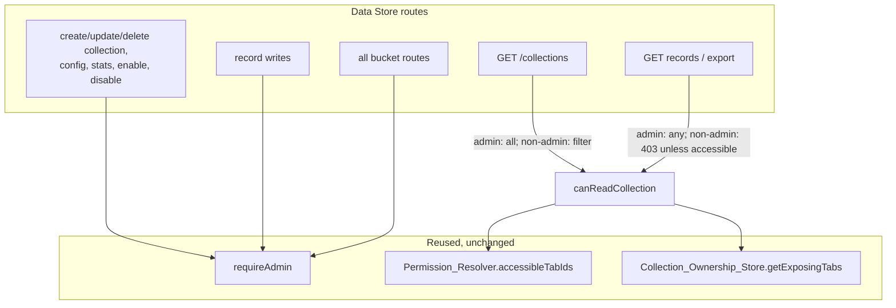

# Design: Data Store Access Control

## Overview

The Data Store REST API is currently authenticated but not authorized. This
feature adds authorization by reusing existing building blocks — the
`requireAdmin` middleware, the `Permission_Resolver.accessibleTabIds` lookup, and
the `Collection_Ownership_Store` — with no new tables and no migration.

Two authorization tiers:

1. **Admin-only** — management, lifecycle, all mutations, and all bucket routes.
   Enforced with the existing `requireAdmin` middleware.
2. **Non-admin read, collection-scoped** — the collection list and per-collection
   record/export reads. A non-admin sees only collections surfaced by a tab their
   group can reach; admins see everything.

The scoping rule is identical to the one already used for live Data Store
WebSocket events (`createDataStoreVisibility` + `Collection_Ownership_Store`), so
the REST surface and the live stream agree.

## Architecture



## Components and Interfaces

### Route factory signature

`createDataStoreRoutes` gains two injected dependencies (both already built at
the composition root):

```ts
export function createDataStoreRoutes(
  dataStore: DataStore,
  resolver: PermissionResolver,
  collectionOwnership: CollectionOwnershipStore,
): Router
```

### The `canReadCollection` helper

A small closure inside the factory, mirroring `canReadAutomation` in the
automation routes:

```ts
function canReadCollection(req: Request, name: string): boolean {
  if (req.user?.role === "admin") return true;
  const accessible = new Set(resolver.accessibleTabIds(req.user?.userId ?? ""));
  return collectionOwnership.getExposingTabs(name).some((t) => accessible.has(t));
}
```

- Admin → always true.
- Non-admin → true iff the collection's surfacing tabs intersect the user's
  accessible tabs. A collection surfaced by no tab yields `[]` → false
  (fail-closed, R4.1). A non-existent collection also yields `[]` → false, so a
  non-admin cannot probe collection existence.

### Route authorization map

| Route | Guard |
|---|---|
| `POST /collections` | `requireAdmin` |
| `PATCH /collections/:name` | `requireAdmin` |
| `DELETE /collections/:name` | `requireAdmin` |
| `POST /collections/:name/records` | `requireAdmin` |
| `GET /buckets`, `GET /buckets/:bucket` | `requireAdmin` |
| `PUT /buckets/:bucket/:key`, `DELETE /buckets/:bucket/:key` | `requireAdmin` |
| `GET /config`, `PUT /config`, `GET /stats` | `requireAdmin` |
| `POST /enable`, `POST /disable` | `requireAdmin` |
| `GET /collections` | in-handler: admin → all; non-admin → filter by `canReadCollection` |
| `GET /collections/:name/records` | in-handler: `canReadCollection` else 403 |
| `GET /collections/:name/export` | in-handler: `canReadCollection` else 403 |

`requireAdmin` is applied as route middleware (same pattern as the auth and
layout routes). The three read routes keep in-handler checks because they need
per-collection resolution and, for the list, filtering rather than a hard gate.

### `GET /collections` filtering

```ts
router.get("/collections", (req, res) => {
  const all = dataStore.listCollections();
  if (req.user?.role === "admin") { res.json(all); return; }
  const accessible = new Set(resolver.accessibleTabIds(req.user?.userId ?? ""));
  res.json(all.filter((c) => collectionOwnership.getExposingTabs(c.name).some((t) => accessible.has(t))));
});
```

(The exact `listCollections()` item shape is preserved; only the array is
filtered. `c.name` is the collection identifier used by
`collection_tab_assignments`.)

### Record / export read gate

```ts
router.get("/collections/:name/records", asyncHandler((req, res) => {
  const name = req.params.name as string;
  if (!canReadCollection(req, name)) { res.status(403).json({ error: "Forbidden" }); return; }
  // ...existing query logic unchanged...
}));
```

Same 403 gate prepended to `GET /collections/:name/export`.

## Design Decisions

1. **Buckets are admin-only.** `collection_tab_assignments` maps *collections*,
   not buckets; there is no server-side ownership for the shared key/value
   namespace. Rather than invent one now, buckets are treated as admin/trusted
   (the recommended short-term posture for the shared bucket namespace). A future
   bucket→tab model can relax this.
2. **Writes are admin-only.** The REST record-write endpoint is a
   management/dashboard surface; automations write through the sandbox `db.*`
   API (scoped by `automation-scope-resolver`), not this route. Admin-gating REST
   writes avoids inventing per-collection write permission now.
3. **Non-admin reads mirror the live WS scope.** Using the
   `Collection_Ownership_Store` for REST read filtering makes the REST list and
   the live event stream consistent, exactly as the device snapshot mirrors live
   device events in `read-surface-authorization`.
4. **Fail-closed, no existence probing for non-admins.** A collection with no
   surfacing tab (or one that does not exist) resolves to no accessible tabs, so
   a non-admin gets 403 on reads and never learns whether it exists. Admins get
   the existing 404/`Collection not found` mapping. This is a deliberate, minor
   deviation from the device routes' 404-before-403 ordering, justified because
   the Data Store route has no cheap existence predicate and fail-closed is
   safer here.
5. **`requireAdmin` middleware, not a new guard.** Reuses the exact middleware
   the auth and layout routes use; no new authorization primitive.

## Composition Root Wiring

`src/index.ts` and `src/__test-helpers__/app-factory.ts` already construct
`permissionResolver` and `collectionOwnershipStore`. Wiring is limited to passing
them into `createDataStoreRoutes(dataStore, permissionResolver, collectionOwnershipStore)`.

## Error Handling

- Admin-only routes: `requireAdmin` throws `ForbiddenError` (403) / 401 via the
  existing error handler.
- Non-admin read gate: `403 { error: "Forbidden" }`, matching the automation
  `ui-module`/`history` denial shape.
- The existing `dataStoreErrorMapper` (503 not-enabled, 409 conflict, 404 not
  found, 400 bad duration) is unchanged and still runs after authorization.

## Testing Strategy

Integration tests with `createTestApp` and the seeded group/tab topology, plus
updates to the existing `data-store.routes.test.ts` unit suite so it compiles and
runs as an admin (its focus is route logic, not authorization).

Key cases:
- Non-admin gets 403 on create/patch/delete collection, record write, every
  bucket route, config get/put, stats, enable, disable.
- Admin proceeds on all of the above.
- `GET /collections`: admin sees all; non-admin sees only collections surfaced by
  an accessible tab; a collection on an unreachable tab and an unsurfaced
  collection are both absent.
- `GET records`/`export`: non-admin 200 for an accessible collection, 403 for an
  unreachable/unsurfaced/nonexistent one; admin unrestricted.
