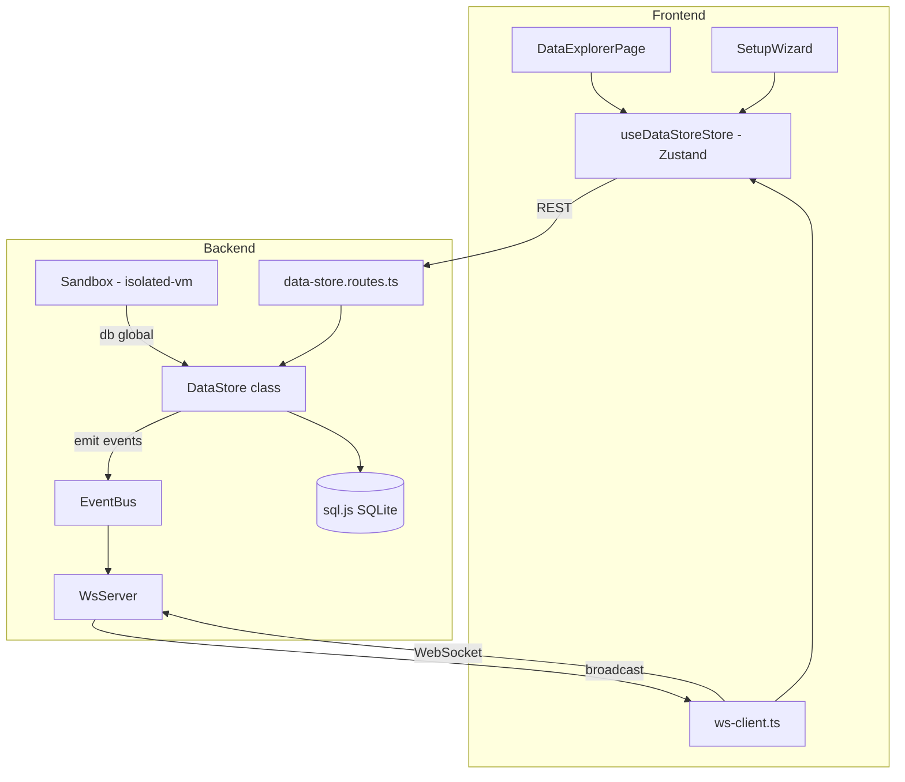

# Design Document: Data Store

## Overview

The Data Store is a persistent time-series and key-value storage system built on the existing sql.js (pure JS SQLite) infrastructure. It enables automations to accumulate structured data over time, share computed values across rules, and query historical records with aggregation. The system is exposed through three interfaces:

1. **Sandbox `db` global** — for automation scripts running in isolated-vm
2. **REST API** — mounted at `/api/data-store` for the frontend and external consumers
3. **Data Explorer UI** — a pinned sidebar tab with collection browsing, charts, and management

The design prioritizes Raspberry Pi constraints (limited storage, SD card wear) with configurable limits, FIFO eviction, and retention policies. The Data Store is disabled by default and requires a setup wizard to enable, ensuring users understand storage implications.

## Architecture



### Key Design Decisions

1. **Single DataStore class** — All logic (write, query, buckets, retention, config, safeguards) lives in one class that receives the sql.js `Database` instance. This mirrors the existing `StateHistory` and `ConnectorStore` patterns.

2. **Duration parser as a pure module** — The duration parser is a standalone pure function module (`src/data-store/duration.ts`) with no dependencies, making it ideal for property-based testing.

3. **Event-driven real-time updates** — Writes emit events on the existing `eventBus`, which the `WsServer` broadcasts via its data-driven mapping array. No new WebSocket infrastructure needed.

4. **Disabled by default** — The `ds_config` table stores an `enabled` flag. When disabled, the sandbox `db` global is `undefined` and REST write endpoints return 503.

5. **Reuse existing chart component** — The Data Explorer reuses the `StateHistoryChart` SVG component (Catmull-Rom spline rendering) with minor adaptations for multi-field time-series data.

## Components and Interfaces

### Backend Components

#### `DataStoreConfig` (interface)

```typescript
interface DataStoreConfig {
  enabled: boolean;
  maxStorageMb: number;           // Default: 500
  maxRecordsPerCollection: number; // Default: 100_000
  maxCollections: number;          // Default: 50
}
```

#### `DataStore` (class)

```typescript
// src/data-store/data-store.ts

class DataStore {
  constructor(db: Database, eventBus: EventEmitter, config?: Partial<DataStoreConfig>);

  // Lifecycle
  isEnabled(): boolean;
  enable(config: DataStoreConfig): void;
  disable(): void;
  getConfig(): DataStoreConfig;
  updateConfig(partial: Partial<DataStoreConfig>): void;

  // Time-series operations
  write(collection: string, payload: Record<string, unknown>, options?: WriteOptions): void;
  query(collection: string, options?: QueryOptions): QueryResult;

  // Key-value bucket operations
  get(bucket: string, key: string): unknown | undefined;
  set(bucket: string, key: string, value: unknown): void;
  delete(bucket: string, key: string): void;
  listBucket(bucket: string): Array<{ key: string; value: unknown; updatedAt: number }>;
  listBuckets(): Array<{ bucket: string; keyCount: number }>;

  // Collection management
  createCollection(name: string, description?: string, retentionDays?: number | null): void;
  updateCollection(name: string, updates: { description?: string; retentionDays?: number | null }): void;
  deleteCollection(name: string): void;
  listCollections(): CollectionMetadata[];
  getStats(): DataStoreStats;

  // Retention enforcement (called by internal timer)
  enforceRetention(): void;

  // Lifecycle
  startRetentionTimer(): void;
  stopRetentionTimer(): void;
  dispose(): void;
}
```

#### `WriteOptions` (interface)

```typescript
interface WriteOptions {
  tags?: Record<string, string>;
  timestamp?: number; // epoch ms, defaults to Date.now()
}
```

#### `QueryOptions` (interface)

```typescript
interface QueryOptions {
  from?: string | number;  // Duration string ("7d") or epoch ms
  to?: number;             // Epoch ms, defaults to now
  limit?: number;          // Max records to return
  offset?: number;         // Skip N records (pagination)
  tags?: Record<string, string>; // Filter by tag key-value pairs
  aggregate?: "sum" | "avg" | "min" | "max" | "count";
  field?: string;          // Required when aggregate is specified
}
```

#### `QueryResult` (type)

```typescript
type QueryResult =
  | { records: DataRecord[]; total: number }  // Normal query
  | { value: number };                         // Aggregation query

interface DataRecord {
  id: number;
  collection: string;
  payload: Record<string, unknown>;
  tags: Record<string, string>;
  timestamp: number;
}
```

#### `CollectionMetadata` (interface)

```typescript
interface CollectionMetadata {
  name: string;
  description: string | null;
  retentionDays: number | null;
  recordCount: number;
  oldestRecord: number | null;
  newestRecord: number | null;
  createdAt: number;
  updatedAt: number;
}
```

#### `DataStoreStats` (interface)

```typescript
interface DataStoreStats {
  totalRecords: number;
  totalBucketEntries: number;
  totalCollections: number;
  estimatedStorageMb: number;
  maxStorageMb: number;
  storagePercent: number;
}
```

#### Duration Parser (`src/data-store/duration.ts`)

```typescript
// Pure functions — no side effects, no dependencies

/** Parse a duration string like "7d", "24h", "30m" into milliseconds */
export function parseDuration(input: string): number;

/** Format milliseconds back into the shortest valid duration string */
export function formatDuration(ms: number): string;

/** Supported units with their millisecond multipliers */
const UNITS: Record<string, number> = {
  m: 60_000,
  h: 3_600_000,
  d: 86_400_000,
  w: 604_800_000,
  y: 31_536_000_000,
};
```

#### REST Routes (`src/api/routes/data-store.routes.ts`)

```typescript
export function createDataStoreRoutes(dataStore: DataStore): Router;
```

### Sandbox Integration

The `db` global is wired into the isolated-vm sandbox following the same pattern as `state`, `http`, and `services`:

1. **Host-side references** are set on the jail (`__dbWriteRef`, `__dbQueryRef`, `__dbGetRef`, `__dbSetRef`, `__dbDeleteRef`, `__dbCollectionsRef`)
2. **Bootstrap script** wires them into a clean `globalThis.db` object
3. **DataStore dependency** is passed to the `Sandbox` constructor as an optional dep (like `stateStore`)

```typescript
// Addition to SandboxDeps interface
interface SandboxDeps {
  // ... existing deps
  dataStore?: DataStore;
}
```

The bootstrap script addition:

```javascript
// Inside BOOTSTRAP_SCRIPT
var dbWriteRef = __dbWriteRef;
var dbQueryRef = __dbQueryRef;
var dbGetRef = __dbGetRef;
var dbSetRef = __dbSetRef;
var dbDeleteRef = __dbDeleteRef;
var dbCollectionsRef = __dbCollectionsRef;

if (dbWriteRef) {
  globalThis.db = {
    write: function(collection, payload, options) {
      dbWriteRef.applySync(undefined, [collection, JSON.stringify(payload), JSON.stringify(options || {})]);
    },
    query: function(collection, options) {
      var result = dbQueryRef.applySync(undefined, [collection, JSON.stringify(options || {})]);
      return JSON.parse(result);
    },
    get: function(bucket, key) {
      var result = dbGetRef.applySync(undefined, [bucket, key]);
      return result === undefined ? undefined : JSON.parse(result);
    },
    set: function(bucket, key, value) {
      dbSetRef.applySync(undefined, [bucket, key, JSON.stringify(value)]);
    },
    delete: function(bucket, key) {
      dbDeleteRef.applySync(undefined, [bucket, key]);
    },
    collections: function() {
      var result = dbCollectionsRef.applySync(undefined, []);
      return JSON.parse(result);
    }
  };
}
```

When the DataStore is disabled, the references are not set, so `globalThis.db` remains `undefined`.

### Frontend Components

#### Component Hierarchy

```mermaid
graph TB
    APP[App.tsx] --> ROUTE["/data-store" route]
    ROUTE --> DSP[DataStorePage]
    DSP -->|disabled| SW[SetupWizard]
    DSP -->|enabled| DE[DataExplorer]

    DE --> SB[SummaryBar]
    DE --> TABS[TabSwitcher: Collections | Buckets | Settings]

    TABS -->|Collections| CL[CollectionList]
    CL --> CD[CollectionDetail]
    CD --> CHART[TimeSeriesChart]
    CD --> RT[RecordTable]

    TABS -->|Buckets| BL[BucketList]
    BL --> BD[BucketDetail]

    TABS -->|Settings| SETTINGS[SettingsPanel]

    SW --> SYS_INFO[SystemInfoDisplay]
    SW --> CONFIG_FORM[ConfigForm]
```

#### `useDataStoreStore` (Zustand store)

```typescript
// frontend/src/store/data-store-store.ts

interface DataStoreState {
  // Config & status
  config: DataStoreConfig | null;
  enabled: boolean;
  stats: DataStoreStats | null;

  // Collections
  collections: CollectionMetadata[];
  selectedCollection: string | null;

  // Records for selected collection
  records: DataRecord[];
  recordsTotal: number;
  recordsLoading: boolean;

  // Buckets
  buckets: BucketSummary[];
  selectedBucket: string | null;
  bucketEntries: BucketEntry[];

  // Query state
  timeRange: string; // "1h" | "6h" | "24h" | "7d" | "30d"
  queryTags: Record<string, string>;

  // Actions
  fetchConfig: () => Promise<void>;
  fetchCollections: () => Promise<void>;
  fetchRecords: (collection: string, options?: QueryOptions) => Promise<void>;
  fetchBuckets: () => Promise<void>;
  fetchBucketEntries: (bucket: string) => Promise<void>;
  fetchStats: () => Promise<void>;
  selectCollection: (name: string | null) => void;
  selectBucket: (name: string | null) => void;
  setTimeRange: (range: string) => void;
  addRealtimeRecord: (collection: string, record: DataRecord) => void;
  removeCollection: (name: string) => void;
}
```

#### `DataStorePage` (component)

The top-level page component that checks enabled status and renders either the SetupWizard or DataExplorer.

#### `SetupWizard` (component)

Displays system info (disk space, RAM, current DB size), recommends defaults based on available disk, and presents an editable configuration form. Calls `POST /api/data-store/enable` on confirmation.

#### `DataExplorer` (component)

The main explorer with:
- **SummaryBar** — total collections, records, buckets, storage usage with progress bar and warning indicators
- **Tab switcher** — Collections | Buckets | Settings
- **CollectionList** — card grid showing each collection with name, description, record count, retention, last write
- **CollectionDetail** — time-series chart + paginated record table + management controls
- **TimeSeriesChart** — reuses the existing `StateHistoryChart` component with adapted props for DataStore records
- **BucketList** — expandable list of buckets with key-value pairs
- **SettingsPanel** — view/edit DataStore configuration

#### Sidebar Integration

A new pinned tab entry is added to the dashboard store's default tabs:

```typescript
{
  id: "default-data-store",
  name: "Data",
  icon: "database",
  pinned: true,
  order: 3, // After Connectors (order 2)
}
```

The `PINNED_ROUTES` map in `Sidebar.tsx` gets a new entry:
```typescript
"default-data-store": "/data-store"
```

A route is added in `App.tsx`:
```typescript
<Route path="/data-store" element={<DataStorePage />} />
```

## Data Models

### SQLite Schema DDL

```sql
-- Configuration table (key-value pairs for DataStore settings)
CREATE TABLE IF NOT EXISTS ds_config (
  key TEXT PRIMARY KEY,
  value TEXT NOT NULL
);

-- Collections table
CREATE TABLE IF NOT EXISTS ds_collections (
  name TEXT PRIMARY KEY,
  description TEXT,
  retention_days INTEGER,
  created_at INTEGER NOT NULL,
  updated_at INTEGER NOT NULL
);

-- Records table (time-series data)
CREATE TABLE IF NOT EXISTS ds_records (
  id INTEGER PRIMARY KEY AUTOINCREMENT,
  collection TEXT NOT NULL REFERENCES ds_collections(name) ON DELETE CASCADE,
  payload TEXT NOT NULL,
  tags TEXT NOT NULL DEFAULT '{}',
  timestamp INTEGER NOT NULL
);

-- Buckets table (key-value storage)
CREATE TABLE IF NOT EXISTS ds_buckets (
  bucket TEXT NOT NULL,
  key TEXT NOT NULL,
  value TEXT NOT NULL,
  updated_at INTEGER NOT NULL,
  PRIMARY KEY (bucket, key)
);

-- Indexes for query performance
CREATE INDEX IF NOT EXISTS idx_ds_records_collection_ts
  ON ds_records(collection, timestamp DESC);

CREATE INDEX IF NOT EXISTS idx_ds_records_collection_tags
  ON ds_records(collection, tags);
```

### Event Bus Constants

```typescript
// Added to src/core/event-bus.ts
export const DATA_STORE_WRITE = "data-store:write" as const;
export const DATA_STORE_COLLECTION_DELETED = "data-store:collection-deleted" as const;
```

### WebSocket Message Types

| Event Constant | WS Message Type | Payload |
|---|---|---|
| `DATA_STORE_WRITE` | `data-store-write` | `{ collection: string, record: DataRecord }` |
| `DATA_STORE_COLLECTION_DELETED` | `data-store-collection-deleted` | `{ collection: string }` |

Added to the `WS_MAPPINGS` array in `index.ts`:
```typescript
{ eventName: DATA_STORE_WRITE, messageType: "data-store-write" },
{ eventName: DATA_STORE_COLLECTION_DELETED, messageType: "data-store-collection-deleted" },
```

## API Endpoint Specifications

### Collections

| Method | Path | Request Body | Response | Status |
|--------|------|-------------|----------|--------|
| GET | `/api/data-store/collections` | — | `CollectionMetadata[]` | 200 |
| POST | `/api/data-store/collections` | `{ name, description?, retentionDays? }` | `{ success: true }` | 201 |
| PATCH | `/api/data-store/collections/:name` | `{ description?, retentionDays? }` | `{ success: true }` | 200 |
| DELETE | `/api/data-store/collections/:name` | — | `{ success: true }` | 200 |

### Records

| Method | Path | Query/Body | Response | Status |
|--------|------|-----------|----------|--------|
| POST | `/api/data-store/collections/:name/records` | Body: `{ payload, tags? }` | `{ success: true, id }` | 201 |
| GET | `/api/data-store/collections/:name/records` | Query: `from, to, limit, offset, tags, aggregate, field` | `QueryResult` | 200 |
| GET | `/api/data-store/collections/:name/export` | — | CSV file download | 200 |

### Buckets

| Method | Path | Request Body | Response | Status |
|--------|------|-------------|----------|--------|
| GET | `/api/data-store/buckets` | — | `Array<{ bucket, keyCount }>` | 200 |
| GET | `/api/data-store/buckets/:bucket` | — | `Array<{ key, value, updatedAt }>` | 200 |
| PUT | `/api/data-store/buckets/:bucket/:key` | `{ value }` | `{ success: true }` | 200 |
| DELETE | `/api/data-store/buckets/:bucket/:key` | — | `{ success: true }` | 200 |

### Configuration & Lifecycle

| Method | Path | Request Body | Response | Status |
|--------|------|-------------|----------|--------|
| GET | `/api/data-store/config` | — | `DataStoreConfig` | 200 |
| PUT | `/api/data-store/config` | `Partial<DataStoreConfig>` | `{ success: true }` | 200 |
| GET | `/api/data-store/stats` | — | `DataStoreStats` | 200 |
| POST | `/api/data-store/enable` | `DataStoreConfig` | `{ success: true }` | 200 |
| POST | `/api/data-store/disable` | — | `{ success: true }` | 200 |

### Error Responses

- **400** — Invalid query parameters (bad duration format, non-numeric limit, missing required fields)
- **404** — Collection not found (for PATCH/DELETE on non-existent collection)
- **409** — Collection already exists (for POST create with duplicate name)
- **503** — Data Store is disabled (for write operations when not enabled)

## Correctness Properties

*A property is a characteristic or behavior that should hold true across all valid executions of a system — essentially, a formal statement about what the system should do. Properties serve as the bridge between human-readable specifications and machine-verifiable correctness guarantees.*

### Property 1: Write round-trip preserves data

*For any* valid collection name, JSON payload, tag object, and timestamp, writing a record and then querying it back should return a record with identical payload, tags, and timestamp.

**Validates: Requirements 2.1, 2.3, 2.4**

### Property 2: Auto-create collection on write

*For any* valid collection name that does not already exist, writing a record to that collection should result in the collection being created with `retentionDays = null` (keep forever) and the record being stored successfully.

**Validates: Requirements 2.2**

### Property 3: Time-range filtering correctness

*For any* set of records with various timestamps and any time range (specified as either a relative duration string or absolute from/to timestamps), querying with that range should return exactly the records whose timestamps fall within the inclusive range [from, to], and no others.

**Validates: Requirements 3.1, 3.2**

### Property 4: Aggregation correctness

*For any* set of records containing a numeric field and any aggregation function (sum, avg, min, max, count), the aggregation result returned by the DataStore should equal the result of applying that function to the matching field values computed independently.

**Validates: Requirements 3.3**

### Property 5: Tag filtering completeness

*For any* set of records with various tags and any tag filter, the query result should contain exactly the records whose tags are a superset of the filter (contain all specified key-value pairs), and no others.

**Validates: Requirements 3.4**

### Property 6: Pagination and ordering invariant

*For any* set of records in a collection, querying with limit L and offset O should return at most L records, starting from position O in the timestamp-descending ordered sequence. The concatenation of paginated results (offset 0..L, L..2L, etc.) should equal the full result set.

**Validates: Requirements 3.5, 3.6, 3.8**

### Property 7: Bucket set/get/delete round-trip

*For any* valid bucket name, key, and JSON-serializable value: (a) setting then getting should return the original value, (b) setting then deleting then getting should return undefined, (c) setting the same key twice should return the latest value.

**Validates: Requirements 4.1, 4.2, 4.3**

### Property 8: Bucket list completeness

*For any* set of key-value pairs written to a bucket, listing that bucket should return exactly those keys with their current values (after any overwrites or deletes).

**Validates: Requirements 4.4**

### Property 9: Retention enforcement correctness

*For any* collection with `retentionDays = R` (where R > 0) and any set of records with various timestamps, after running retention enforcement, all records older than R days should be deleted and all records within R days should be preserved. For collections with `retentionDays = null`, all records should be preserved regardless of age.

**Validates: Requirements 5.1, 5.4**

### Property 10: Duration parser round-trip

*For any* valid duration string (integer followed by a supported unit suffix: m, h, d, w, y), parsing to milliseconds then formatting back to a string then parsing again should produce the same millisecond value.

**Validates: Requirements 12.1, 12.3**

### Property 11: Invalid duration rejection

*For any* string that does not match the pattern of a positive integer followed by a supported unit suffix (m, h, d, w, y) — including empty strings, decimal numbers, unknown suffixes, and negative numbers — the duration parser should throw a descriptive error.

**Validates: Requirements 12.4, 12.5**

### Property 12: FIFO eviction maintains collection size invariant

*For any* sequence of write operations to a collection with `maxRecordsPerCollection = N`, the collection should never contain more than N records. When a write would exceed N, the oldest records are evicted first, and the newest write is always preserved.

**Validates: Requirements 13.5**

### Property 13: Storage safeguard enforcement

*For any* DataStore configuration with `maxStorageMb = S` and `maxCollections = C`: (a) when total estimated storage exceeds S, write operations should be rejected with an error, (b) when the number of collections equals C, creating a new collection should be rejected with an error.

**Validates: Requirements 13.4, 13.6**

## Error Handling

| Error Scenario | Behavior | HTTP Status |
|---|---|---|
| Write to disabled DataStore | Reject with "Data Store is not enabled" | 503 |
| Invalid payload (not JSON-serializable) | Throw descriptive error, no data corruption | 400 |
| Invalid duration string | Throw error identifying the invalid input | 400 |
| Non-numeric limit/offset | Return 400 with validation details | 400 |
| Collection not found (for update/delete) | Return 404 with message | 404 |
| Query non-existent collection | Return empty result set (no error) | 200 |
| Storage limit exceeded | Reject write, log warning | 400 |
| Max collections exceeded | Reject creation with error | 400 |
| FIFO eviction triggered | Log eviction count, proceed with write | — |
| Sandbox `db.write()` failure | Log error via sandbox log, continue script | — |
| Retention enforcement failure | Log error, continue with next collection | — |

Error responses follow the existing pattern using `BadRequestError` and `NotFoundError` from `src/api/middleware/error-handler.ts`.

## Testing Strategy

### Property-Based Tests (fast-check)

The project uses Vitest as its test runner. Property-based tests will use **fast-check** (the standard PBT library for TypeScript/Vitest).

**Configuration:**
- Minimum 100 iterations per property test
- Each test tagged with: `Feature: data-store, Property {N}: {title}`

**Target modules for PBT:**
- `src/data-store/duration.ts` — Pure functions, ideal for PBT (Properties 10, 11)
- `src/data-store/data-store.ts` — Core logic with in-memory SQLite (Properties 1-9, 12-13)

### Unit Tests (example-based)

- Schema initialization (smoke tests for table/index creation)
- REST route handlers with supertest (integration)
- Sandbox `db` global wiring (integration)
- Event emission on write/delete (integration)
- CSV export formatting
- Config persistence and loading
- Enable/disable lifecycle

### Frontend Tests

- Component rendering tests for SetupWizard, DataExplorer, SummaryBar
- Store action tests for `useDataStoreStore`
- WebSocket message handling for real-time updates

### Test File Structure

```
src/data-store/__tests__/
  duration.test.ts          — PBT for duration parser (Properties 10, 11)
  data-store.test.ts        — PBT for DataStore core logic (Properties 1-9, 12-13)
  data-store.routes.test.ts — Integration tests for REST API
  data-store.sandbox.test.ts — Integration tests for sandbox wiring
```
