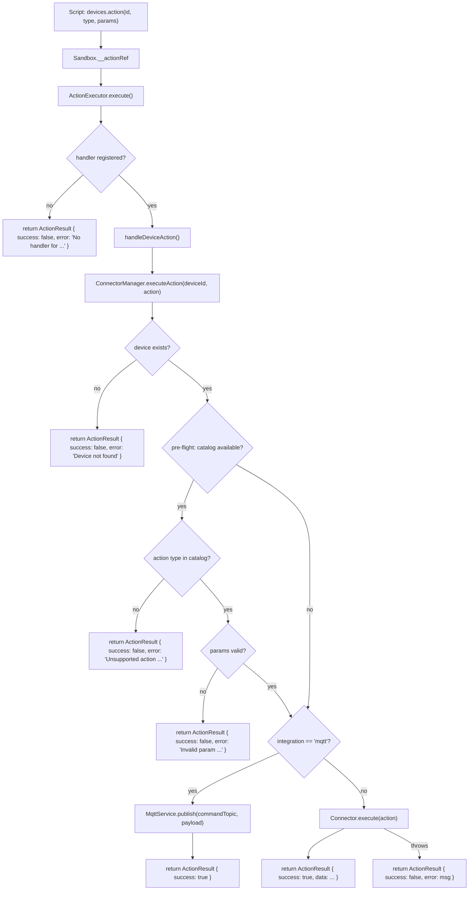
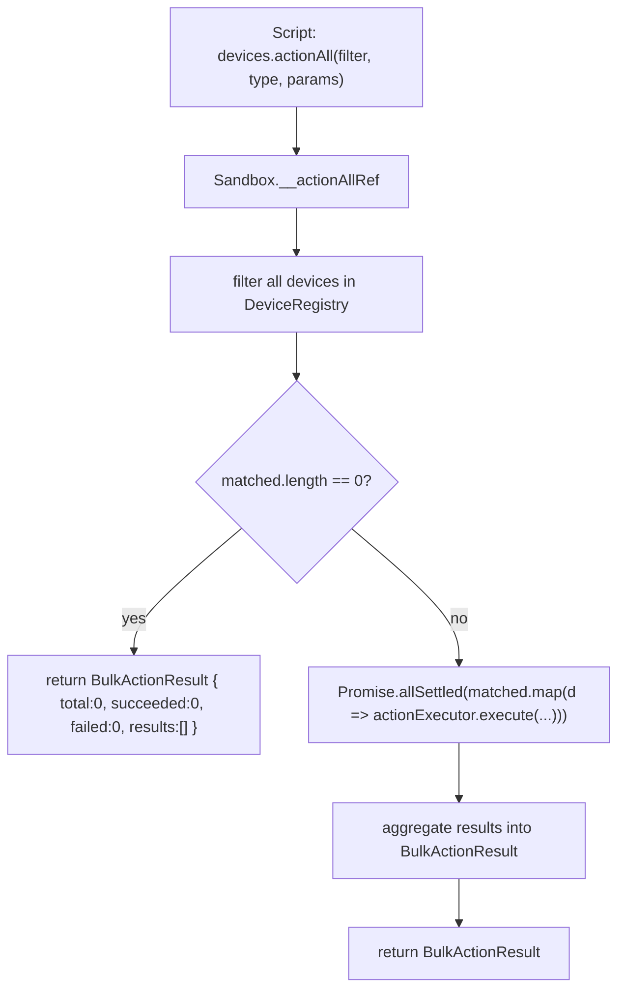
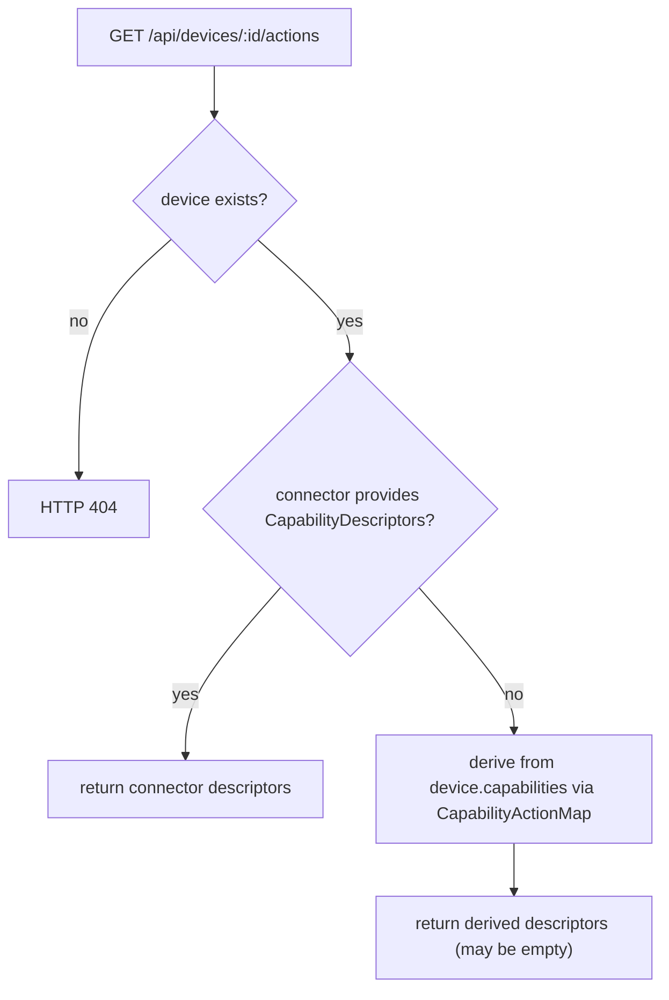

# Design Document: Device Action System Uplift

## Overview

The device action system uplift closes seven gaps in Aeolus's current action pipeline:

1. **Action results** — `devices.action()` and `ConnectorManager.executeAction()` return `void`; scripts cannot inspect outcomes.
2. **Error propagation** — `ActionExecutor` swallows errors; sandbox scripts have no feedback path.
3. **Action discovery** — no API to enumerate what a device supports; the frontend hardcodes button sets.
4. **Capability mapping** — no formal link between a device's `capabilities[]` strings and the actions they enable.
5. **MQTT command support** — MQTT devices are silently skipped in `executeAction()`.
6. **Pre-flight validation** — invalid action types and parameters reach the connector before being rejected.
7. **Bulk execution** — toggling many devices requires sequential per-device calls.

The design introduces four new types (`ActionResult`, `BulkActionResult`, `CapabilityDescriptor`, `CapabilityActionMap`), changes `ConnectorManager.executeAction()` to return `ActionResult`, adds a `GET /api/devices/:id/actions` endpoint, wires MQTT command publishing, adds pre-flight validation in `ConnectorManager`, and exposes `devices.actionAll()` in the sandbox.

No new infrastructure is required. All changes are confined to the existing TypeScript source tree.

---

## Architecture

### Updated Action Pipeline



### Bulk Action Pipeline



### Action Discovery Pipeline



---

## Components and Interfaces

### `ActionResult` (new — `src/core/types.ts`)

```typescript
/** Result returned by ConnectorManager.executeAction() and devices.action(). */
export interface ActionResult {
  /** Whether the action completed without error. Always a boolean, never undefined. */
  success: boolean;
  /** Connector-supplied data payload (e.g. energy readings). Present on success when the connector returns data. */
  data?: Record<string, unknown>;
  /** Human-readable error message. Present when success is false. */
  error?: string;
}
```

### `BulkActionResult` (new — `src/core/types.ts`)

```typescript
/** Result returned by devices.actionAll(). */
export interface BulkActionResult {
  /** Total number of devices the filter matched. */
  total: number;
  /** Number of individual actions that returned success: true. */
  succeeded: number;
  /** Number of individual actions that returned success: false. */
  failed: number;
  /** Per-device results. succeeded + failed === total always holds. */
  results: Array<{ deviceId: string } & ActionResult>;
}
```

### `CapabilityDescriptor` (new — `src/connectors/connector.interface.ts`)

```typescript
/**
 * Machine-readable record declaring one action type a device supports.
 * Connectors return arrays of these from getActionCatalog().
 * The GET /api/devices/:id/actions endpoint returns them to the frontend.
 */
export interface CapabilityDescriptor {
  /** Action type string passed to devices.action() / POST /api/devices/:id/action. */
  type: string;
  /** Human-readable label for the action button (e.g. "Toggle", "Set Brightness"). */
  label: string;
  /** One-line description of what the action does. */
  description: string;
  /**
   * JSON Schema object describing accepted parameters.
   * Empty object {} when the action takes no parameters.
   */
  params: Record<string, unknown>;
}
```

### `CapabilityActionMap` (new — `src/connectors/capability-action-map.ts`)

```typescript
/**
 * Fallback mapping from capability strings to CapabilityDescriptor arrays.
 * Used when a connector does not provide explicit descriptors for a device.
 */
export const CAPABILITY_ACTION_MAP: Record<string, CapabilityDescriptor[]> = {
  "on/off": [
    { type: "toggle", label: "Toggle", description: "Toggle the device on or off", params: {} },
    { type: "on",     label: "Turn On",  description: "Turn the device on",  params: {} },
    { type: "off",    label: "Turn Off", description: "Turn the device off", params: {} },
  ],
  "brightness": [
    {
      type: "brightness",
      label: "Set Brightness",
      description: "Set brightness level (0–100)",
      params: {
        type: "object",
        required: ["level"],
        properties: { level: { type: "number", minimum: 0, maximum: 100 } },
      },
    },
  ],
  "color": [
    {
      type: "color",
      label: "Set Color",
      description: "Set hue and saturation",
      params: {
        type: "object",
        required: ["hue", "saturation"],
        properties: {
          hue:        { type: "number", minimum: 0, maximum: 65535 },
          saturation: { type: "number", minimum: 0, maximum: 254 },
        },
      },
    },
  ],
  "color-temp": [
    {
      type: "color-temp",
      label: "Set Color Temperature",
      description: "Set color temperature in mireds",
      params: {
        type: "object",
        required: ["ct"],
        properties: { ct: { type: "number" } },
      },
    },
  ],
  "energy-monitoring": [
    {
      type: "read-energy",
      label: "Read Energy",
      description: "Read current power consumption data",
      params: {},
    },
  ],
};

/** MQTT command descriptor — always present for integration === "mqtt" devices. */
export const MQTT_COMMAND_DESCRIPTOR: CapabilityDescriptor = {
  type: "command",
  label: "Send Command",
  description: "Publish a command payload to the device's command topic",
  params: {
    type: "object",
    properties: {
      payload: { type: ["string", "object"] },
    },
  },
};
```

### Updated `Connector` interface — `getActionCatalog()` (optional method)

```typescript
// Addition to the Connector interface in src/connectors/connector.interface.ts

/**
 * Return the action catalog for a specific device managed by this connector.
 * When provided, ConnectorManager uses these descriptors directly for the
 * GET /api/devices/:id/actions endpoint and pre-flight validation.
 * When absent, ConnectorManager falls back to CAPABILITY_ACTION_MAP.
 *
 * @param deviceId - The device to return descriptors for.
 * @returns Array of CapabilityDescriptor, or undefined to use the fallback map.
 */
getActionCatalog?(deviceId: string): CapabilityDescriptor[] | undefined;
```

### Updated `ConnectorModule` interface — `getActionCatalog` on module level (optional)

```typescript
// Addition to ConnectorModule in src/connectors/connector.interface.ts

/**
 * Optional module-level action catalog factory.
 * Called by ConnectorManager when the connector instance does not implement
 * getActionCatalog() at the instance level. Receives the device to describe.
 */
getActionCatalog?: (device: Device) => CapabilityDescriptor[] | undefined;
```

### Updated `ConnectorManager.executeAction()` signature

```typescript
// src/connectors/connector-manager.ts
async executeAction(deviceId: string, action: Action): Promise<ActionResult>
```

The method no longer throws. All error paths return `ActionResult { success: false, error: ... }`.

### Updated `ActionExecutor.execute()` signature

```typescript
// src/automations/action-executor.ts
async execute(action: ActionDescriptor, ruleId: string): Promise<ActionResult>
```

Returns `ActionResult` instead of `void`. Errors are caught and returned rather than only logged.

---

## Data Models

### `ActionResult` field semantics

| Field | Type | Always present | Notes |
|-------|------|---------------|-------|
| `success` | `boolean` | Yes | `true` on clean execution, `false` on any error |
| `data` | `Record<string, unknown>` | No | Connector-supplied payload (e.g. energy readings) |
| `error` | `string` | No | Present when `success === false`; exact message from the thrown error |

### `BulkActionResult` field semantics

| Field | Type | Invariant |
|-------|------|-----------|
| `total` | `number` | Equals `matched.length` |
| `succeeded` | `number` | Count of results where `success === true` |
| `failed` | `number` | Count of results where `success === false` |
| `results` | `Array<{deviceId} & ActionResult>` | `succeeded + failed === total` always |

### `CapabilityDescriptor` field semantics

| Field | Type | Notes |
|-------|------|-------|
| `type` | `string` | Matches the `type` field in `ActionRequest` |
| `label` | `string` | Human-readable button label |
| `description` | `string` | One-line description |
| `params` | `Record<string, unknown>` | JSON Schema object or `{}` |

### MQTT device command topic derivation

Given a device's inbound `topic` string, the command topic is derived as:

```
commandTopic = topic.split("/").slice(0, -1).concat("set").join("/")
```

Examples:
- `home/plug1/state` → `home/plug1/set`
- `sensors/room1/temperature` → `sensors/room1/set`
- `device` → `set` (single-segment edge case)

If the device record contains an explicit `commandTopic` field in its `state` or a top-level `commandTopic` property, that value takes precedence over the derived topic.

### `GET /api/devices/:id/actions` response shape

```typescript
// HTTP 200
CapabilityDescriptor[]

// HTTP 404
{ error: string }
```

---

## Correctness Properties

*A property is a characteristic or behavior that should hold true across all valid executions of a system — essentially, a formal statement about what the system should do. Properties serve as the bridge between human-readable specifications and machine-verifiable correctness guarantees.*

### Property 1: executeAction success wraps connector data

*For any* connector that returns a data payload from `execute()`, `ConnectorManager.executeAction()` shall return an `ActionResult` with `success: true` and `data` equal to the connector's return value.

**Validates: Requirements 1.2, 1.4**

---

### Property 2: executeAction failure wraps error message without modification

*For any* error message string thrown by a connector's `execute()`, `ConnectorManager.executeAction()` shall return an `ActionResult` with `success: false` and `error` equal to the original thrown message, unchanged.

**Validates: Requirements 1.3, 2.2**

---

### Property 3: ActionResult.success is always a boolean

*For any* call to `devices.action()` — whether the underlying action succeeds or fails — the resolved `ActionResult.success` shall be a boolean (`true` or `false`) and shall never be `undefined` or `null`.

**Validates: Requirements 1.7**

---

### Property 4: devices.action() always resolves, never rejects

*For any* action execution that fails (connector throws, validation fails, device not found), `devices.action()` shall resolve the returned promise with `ActionResult.success === false` rather than rejecting the promise.

**Validates: Requirements 1.6, 2.3**

---

### Property 5: Missing handler returns typed error

*For any* action type string that is not registered in the `ActionExecutor` handler map, `ActionExecutor.execute()` shall return an `ActionResult` with `success: false` and `error` containing the unregistered action type name.

**Validates: Requirements 2.5**

---

### Property 6: CapabilityDescriptor structural invariant

*For any* `Action_Catalog` returned by `GET /api/devices/:id/actions`, every element shall have `type` (string), `label` (string), `description` (string), and `params` (object) fields present and non-null.

**Validates: Requirements 3.5, 3.6**

---

### Property 7: Connector-provided catalog takes precedence over fallback map

*For any* connector that returns a non-empty `CapabilityDescriptor` array from `getActionCatalog()`, the `Action_Catalog` for that device shall equal the connector-provided array and shall not be derived from `CAPABILITY_ACTION_MAP`.

**Validates: Requirements 4.2**

---

### Property 8: Capability-to-action mapping completeness

*For any* device whose `capabilities` array contains one or more of `"on/off"`, `"brightness"`, `"color"`, `"color-temp"`, or `"energy-monitoring"`, the fallback `Action_Catalog` shall contain all action types mapped from those capabilities in `CAPABILITY_ACTION_MAP`. Specifically:
- `"on/off"` → catalog contains `toggle`, `on`, `off`
- `"brightness"` → catalog contains `brightness` with `level` param schema (0–100)
- `"color"` → catalog contains `color` with `hue` (0–65535) and `saturation` (0–254) param schema
- `"color-temp"` → catalog contains `color-temp` with `ct` param schema
- `"energy-monitoring"` → catalog contains `read-energy`

**Validates: Requirements 4.3, 4.4, 4.5, 4.6, 4.7, 4.8**

---

### Property 9: MQTT command topic derivation

*For any* MQTT device topic string, the derived command topic shall equal the original topic with the last path segment replaced by `"set"`.

**Validates: Requirements 5.2**

---

### Property 10: Pre-flight blocks connector call on invalid action type

*For any* action type string that is not present in a device's `Action_Catalog` (when a catalog is available), `ConnectorManager.executeAction()` shall return `ActionResult { success: false }` and shall not call `Connector.execute()`.

**Validates: Requirements 6.1, 6.4**

---

### Property 11: Validation error messages identify device, action type, and reason

*For any* pre-flight validation failure, the `ActionResult.error` string shall contain the device ID, the requested action type, and a human-readable reason for rejection.

**Validates: Requirements 6.7**

---

### Property 12: BulkActionResult arithmetic invariant

*For any* `devices.actionAll()` call — regardless of how many individual actions succeed or fail — the returned `BulkActionResult` shall satisfy `succeeded + failed === total`.

**Validates: Requirements 7.8**

---

### Property 13: actionAll dispatches only to filter-matched devices

*For any* device list and filter predicate, `devices.actionAll()` shall dispatch the action to exactly the devices for which the predicate returns `true`, and shall not dispatch to any device for which the predicate returns `false`.

**Validates: Requirements 7.2, 7.3**

---

## Error Handling

| Scenario | Where caught | Response |
|----------|-------------|----------|
| Device ID not in registry | `ConnectorManager.executeAction()` | `ActionResult { success: false, error: "Device '<id>' not found" }` |
| Action type not in catalog | `ConnectorManager.executeAction()` pre-flight | `ActionResult { success: false, error: "Device '<id>': unsupported action '<type>'. Supported: [...]" }` |
| Params fail schema validation | `ConnectorManager.executeAction()` pre-flight | `ActionResult { success: false, error: "Device '<id>' action '<type>': invalid param '<field>': <reason>" }` |
| No connector instance for integration | `ConnectorManager.executeAction()` | `ActionResult { success: false, error: "No enabled connector for device '<id>' (integration: '<int>')" }` |
| `Connector.execute()` throws | `ConnectorManager.executeAction()` catch | `ActionResult { success: false, error: <original message> }` |
| MQTT broker disconnected on command | `ConnectorManager.executeAction()` MQTT path | `ActionResult { success: false, error: "MQTT broker not connected" }` |
| No handler registered in ActionExecutor | `ActionExecutor.execute()` | `ActionResult { success: false, error: "No handler for action type: '<type>'" }` |
| Handler throws | `ActionExecutor.execute()` catch | `ActionResult { success: false, error: <original message> }` |
| Filter predicate throws in actionAll | Sandbox `__actionAllRef` | `BulkActionResult { total: 0, succeeded: 0, failed: 0, results: [{ deviceId: "", success: false, error: <msg> }] }` |
| `GET /api/devices/:id/actions` — device not found | `device.routes.ts` | HTTP 404 `{ error: "Device not found: <id>" }` |
| `POST /api/devices/:id/action` — action fails | `device.routes.ts` | HTTP 200 `ActionResult { success: false, error: ... }` (not HTTP 500) |

**Note on HTTP status for failed actions:** `POST /api/devices/:id/action` now returns HTTP 200 with `ActionResult.success === false` rather than HTTP 500 when the action fails. This is intentional — the request was well-formed and the server processed it; the failure is a domain-level outcome, not a server error. Callers should inspect `success` rather than the HTTP status code.

---

## Testing Strategy

### Unit Tests

Unit tests cover specific examples, edge cases, and integration points:

- `ConnectorManager.executeAction()` returns `ActionResult { success: true, data }` on connector success
- `ConnectorManager.executeAction()` returns `ActionResult { success: false, error }` on connector throw (error message unchanged)
- `ConnectorManager.executeAction()` publishes to derived MQTT command topic for `integration === "mqtt"` devices
- `ConnectorManager.executeAction()` returns `success: false` when MQTT broker is disconnected
- `ConnectorManager.executeAction()` returns `success: false` without calling `Connector.execute()` when action type is not in catalog
- `ActionExecutor.execute()` returns `ActionResult` and logs errors at `error` level
- `ActionExecutor.execute()` returns `success: false` with error message when no handler is registered
- `GET /api/devices/:id/actions` returns 404 for unknown device ID
- `GET /api/devices/:id/actions` returns `[]` when no catalog is available
- `devices.actionAll()` returns `BulkActionResult` with `total: 0` when filter matches nothing
- `devices.actionAll()` returns error result when filter predicate throws

### Property-Based Tests (fast-check)

Each property test runs a minimum of 100 iterations. Tests are tagged with the feature and property number.

**Library:** `fast-check` (already in the project's test stack)

**Tag format:** `// Feature: device-action-system-uplift, Property N: <property text>`

| Property | Generator inputs | Assertion |
|----------|-----------------|-----------|
| P1: executeAction success wraps data | Random `Record<string, unknown>` data payloads | `result.success === true && deepEqual(result.data, connectorData)` |
| P2: executeAction wraps error unchanged | Random error message strings (including unicode, special chars) | `result.success === false && result.error === thrownMessage` |
| P3: success is always boolean | Random mix of success/failure scenarios | `typeof result.success === "boolean"` |
| P4: devices.action() always resolves | Random failure scenarios | Promise resolves (never rejects), `result.success === false` |
| P5: Missing handler returns typed error | Random unregistered action type strings | `result.success === false && result.error.includes(actionType)` |
| P6: CapabilityDescriptor structure | Random catalogs from connectors | Every element has `type`, `label`, `description`, `params` |
| P7: Connector catalog takes precedence | Random `CapabilityDescriptor[]` from connector | Returned catalog equals connector array |
| P8: Capability mapping completeness | Random subsets of known capability strings | Catalog contains all expected action types for each capability |
| P9: MQTT topic derivation | Random topic strings (1–5 segments, alphanumeric + `/`) | `commandTopic === topic.split("/").slice(0,-1).concat("set").join("/")` |
| P10: Pre-flight blocks connector call | Random action types not in catalog | `Connector.execute` spy never called, `result.success === false` |
| P11: Validation error message content | Random device IDs, action types, rejection reasons | `error` contains deviceId, actionType, and reason |
| P12: BulkActionResult arithmetic | Random device lists with random success/failure mix | `succeeded + failed === total` |
| P13: actionAll dispatches to matched only | Random device lists and predicates | Only predicate-matching devices receive dispatch |

---

## File Organisation

### New files

| File | Purpose |
|------|---------|
| `src/connectors/capability-action-map.ts` | `CAPABILITY_ACTION_MAP` constant and `MQTT_COMMAND_DESCRIPTOR` |

### Modified files

| File | Change |
|------|--------|
| `src/core/types.ts` | Add `ActionResult`, `BulkActionResult` interfaces |
| `src/connectors/connector.interface.ts` | Add `CapabilityDescriptor` interface; add optional `getActionCatalog?(deviceId)` to `Connector`; add optional `getActionCatalog?` to `ConnectorModule` |
| `src/connectors/connector-manager.ts` | Change `executeAction()` return type to `Promise<ActionResult>`; add pre-flight validation; add MQTT command publishing path; import `CAPABILITY_ACTION_MAP` |
| `src/automations/action-executor.ts` | Change `execute()` return type to `Promise<ActionResult>`; return `ActionResult` instead of `void`; catch and return errors instead of only logging |
| `src/api/routes/device.routes.ts` | Add `GET /:id/actions` route; update `POST /:id/action` to return `ActionResult` from `executeAction()` |
| `src/automations/sandbox.ts` | Update `__actionRef` to return `ActionResult`; add `__actionAllRef` for `devices.actionAll()`; add `devices.actionAll` to `BOOTSTRAP_SCRIPT` |

### No changes required

| File | Reason |
|------|--------|
| `src/mqtt/mqtt-service.ts` | `publish()` API is sufficient; no changes needed |
| `src/core/device-registry.ts` | No changes to device storage model |
| `src/connectors/connector-registry.ts` | No changes to module discovery |
| Individual connector implementations (`hue/`, `kasa/`) | May optionally implement `getActionCatalog()` in a follow-up; not required for this uplift |
