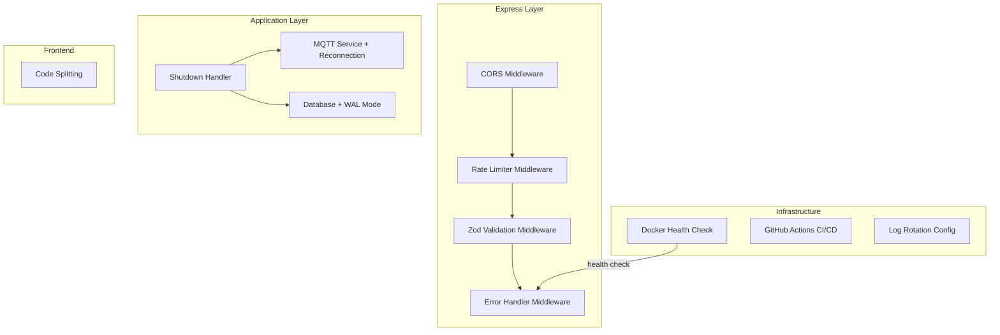
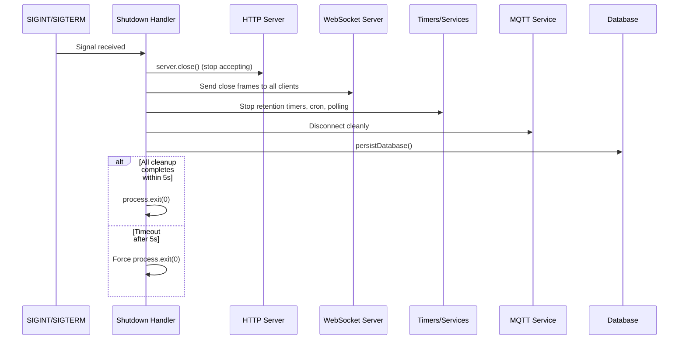
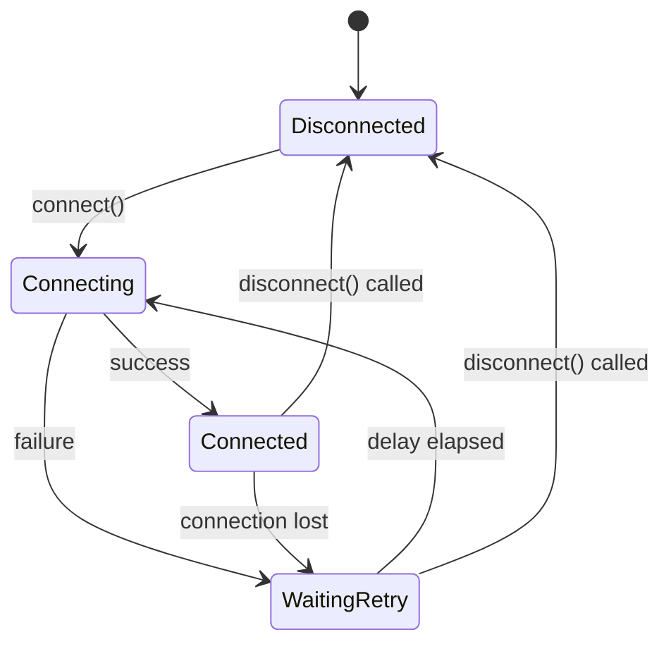
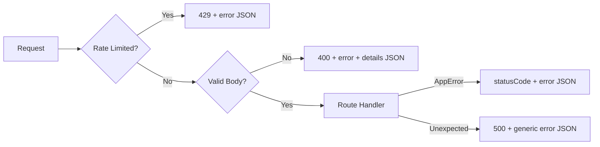

# Design Document: Engineering Quality Uplift

## Overview

This design covers a comprehensive set of engineering quality improvements for the Aeolus IoT platform. The changes span security hardening (parameterized SQL, input validation, rate limiting, CORS), reliability (graceful shutdown, MQTT reconnection, Docker health checks), developer experience (CI/CD, ESLint, type safety, structured errors), and operational robustness (WAL mode, code splitting, log rotation, deployment docs).

The platform runs self-hosted on Raspberry Pi hardware with a single-user threat model. These improvements follow defense-in-depth principles — not because external attackers are expected, but because good engineering practices prevent accidental bugs, improve debuggability, and make the codebase safe to refactor.

### Design Decisions

| Decision | Rationale |
|----------|-----------|
| Zod for validation | Already TypeScript-native, generates types, composable schemas |
| express-rate-limit | Lightweight, well-maintained, minimal config for single-user scenario |
| Middleware pattern for validation | Keeps route handlers clean, reusable across routes |
| Docker json-file log driver | Built-in, no extra dependencies, sufficient for Pi |
| WAL mode via PRAGMA | sql.js supports it, improves concurrent read/write |
| React.lazy for code splitting | Native React API, no extra bundler config needed with Vite |
| fast-check for PBT | Already in devDependencies, integrates with Vitest |
| ESLint flat config | Modern standard, simpler than legacy .eslintrc |

## Architecture

The quality uplift touches multiple layers of the existing architecture. No new services are introduced — all changes are modifications to existing components.



### Middleware Pipeline Order

```
Request → CORS → Rate Limiter → Body Parser → Request Logger → Route (Zod Validation) → Error Handler → Response
```

The rate limiter sits before body parsing to reject over-limit requests without wasting resources parsing bodies. Zod validation is applied per-route as middleware rather than globally, since each route has its own schema.

## Components and Interfaces

### 1. Zod Validation Middleware

A reusable middleware factory that validates `req.body`, `req.params`, and `req.query` against Zod schemas.

```typescript
// src/api/middleware/validate.ts
import { type ZodSchema, ZodError } from "zod";
import type { Request, Response, NextFunction } from "express";

interface ValidateOptions {
  body?: ZodSchema;
  params?: ZodSchema;
  query?: ZodSchema;
}

export function validate(schemas: ValidateOptions) {
  return (req: Request, res: Response, next: NextFunction): void => {
    try {
      if (schemas.body) req.body = schemas.body.parse(req.body);
      if (schemas.params) req.params = schemas.params.parse(req.params) as typeof req.params;
      if (schemas.query) req.query = schemas.query.parse(req.query) as typeof req.query;
      next();
    } catch (err) {
      if (err instanceof ZodError) {
        res.status(400).json({
          error: "Validation failed",
          details: err.errors,
        });
        return;
      }
      next(err);
    }
  };
}
```

Route schemas are co-located with route files:

```typescript
// src/api/schemas/automation.schemas.ts
import { z } from "zod";

export const createAutomationSchema = z.object({
  name: z.string().min(1).max(200),
  trigger_topic: z.string().min(1).max(500),
  action_type: z.enum(["publish", "toggle", "device_action", "log", "delay", "webhook"]),
  action_target: z.string().max(500),
  action_params: z.record(z.unknown()).optional(),
  script_source: z.string().max(102400).optional(), // 100KB limit
  enabled: z.boolean().optional().default(true),
});
```

### 2. Rate Limiter Configuration

```typescript
// src/api/middleware/rate-limiter.ts
import rateLimit from "express-rate-limit";
import { config } from "../../config.js";

export const apiRateLimiter = rateLimit({
  windowMs: 60 * 1000, // 1 minute
  max: config.rateLimitRpm, // default 200
  standardHeaders: true,
  legacyHeaders: false,
  message: { error: "Too many requests, please try again later" },
});
```

Config addition:

```typescript
// Added to config.ts
rateLimitRpm: parseInt(process.env.RATE_LIMIT_RPM || "200", 10),
corsOrigins: process.env.CORS_ORIGINS?.split(",").map(s => s.trim()) || [],
```

### 3. CORS Configuration

```typescript
// src/api/middleware/cors-config.ts
import cors from "cors";
import { config } from "../../config.js";

function buildAllowedOrigins(): (string | RegExp)[] {
  const origins: (string | RegExp)[] = [
    /^https?:\/\/localhost(:\d+)?$/,
    /^https?:\/\/127\.0\.0\.1(:\d+)?$/,
  ];
  for (const origin of config.corsOrigins) {
    if (origin) origins.push(origin);
  }
  return origins;
}

export const corsMiddleware = cors({
  origin: buildAllowedOrigins(),
  credentials: true,
});
```

### 4. Graceful Shutdown Handler

The shutdown handler orchestrates an ordered teardown of all subsystems.



```typescript
// Shutdown handler implementation sketch
async function shutdown(): Promise<void> {
  logger.info("Shutting down Aeolus...");
  
  const timeout = setTimeout(() => {
    logger.warn("Shutdown timeout reached, forcing exit");
    process.exit(0);
  }, 5000);

  try {
    // 1. Stop accepting new connections
    await new Promise<void>((resolve) => server.close(() => resolve()));
    
    // 2. Close WebSocket connections
    wsServer.closeAll();
    
    // 3. Stop timers and services
    dataStore.dispose();
    await serviceManager.disposeAll();
    await connectorManager.disposeAll();
    
    // 4. Disconnect MQTT
    await mqttService.disconnect();
    
    // 5. Stop automation engine
    engine.dispose();
    
    // 6. Persist database
    persistDatabase();
  } finally {
    clearTimeout(timeout);
    process.exit(0);
  }
}
```

### 5. MQTT Reconnection State Machine

The MQTT service is enhanced with a proper reconnection state machine using exponential backoff with a 30-second cap and indefinite retries.



```typescript
// Key changes to MqttService
export interface MqttServiceConfig {
  brokerUrl: string;
  topics: string[];
  maxBackoffMs: number;    // 30000 (30s cap)
  baseRetryDelayMs: number; // 1000 (1s initial)
}

export type MqttConnectionState = "disconnected" | "connecting" | "connected" | "waiting_retry";

// Backoff computation (already exists, updated for cap)
export function computeRetryDelay(attempt: number, baseDelayMs: number, maxDelayMs: number): number {
  return Math.min(baseDelayMs * Math.pow(2, attempt - 1), maxDelayMs);
}
```

The reconnection loop runs indefinitely (no `maxRetries` cap) until either the connection is restored or `disconnect()` is called during shutdown.

### 6. Docker Health Check

Added to `docker-compose.yml` for the backend service:

```yaml
backend:
  # ... existing config ...
  healthcheck:
    test: ["CMD", "wget", "--no-verbose", "--tries=1", "--spider", "http://localhost:3001/api/health"]
    interval: 30s
    timeout: 5s
    start_period: 10s
    retries: 3
```

Uses `wget` (available in Alpine) rather than `curl` to avoid adding packages. The health endpoint already returns 200 on success.

### 7. Docker Image Optimization

The Dockerfile is restructured to eliminate build tools from the production stage:

```dockerfile
FROM node:22-alpine AS builder
WORKDIR /app
RUN apk add --no-cache python3 make g++
COPY package.json package-lock.json* ./
RUN npm install
COPY tsconfig.json ./
COPY src/ ./src/
RUN npx tsup src/index.ts --format esm --target node22

# Production stage — no build tools
FROM node:22-alpine AS production
WORKDIR /app
RUN apk add --no-cache git docker-cli docker-cli-compose util-linux
COPY package.json package-lock.json* ./
RUN npm install --omit=dev && npm cache clean --force
COPY --from=builder /app/dist ./dist/
COPY src/automations/sandbox-types.d.ts ./dist/automations/sandbox-types.d.ts
COPY automations/ ./automations/
RUN mkdir -p /app/data
RUN git config --global --add safe.directory /aeolus-host
EXPOSE 3001
HEALTHCHECK --interval=30s --timeout=5s --start-period=10s --retries=3 \
  CMD wget --no-verbose --tries=1 --spider http://localhost:3001/api/health || exit 1
CMD ["node", "dist/index.js"]
```

Key changes:
- `python3`, `make`, `g++` removed from production stage (only in builder)
- `git` and `docker-cli` retained (required for self-update feature)
- `npm cache clean --force` reduces layer size
- `HEALTHCHECK` directive added directly in Dockerfile as well

### 8. CI/CD Pipeline (GitHub Actions)

```yaml
# .github/workflows/ci.yml
name: CI

on:
  pull_request:
    branches: [main]
  push:
    branches: [main]

jobs:
  check:
    runs-on: ubuntu-latest
    steps:
      - uses: actions/checkout@v4
      - uses: actions/setup-node@v4
        with:
          node-version: 22
          cache: npm
      - run: npm ci
      - run: npx tsc --noEmit
      - run: npm test
      - run: npx eslint . || true  # Non-blocking during rollout

  build-images:
    if: github.event_name == 'push' && github.ref == 'refs/heads/main'
    needs: check
    runs-on: ubuntu-latest
    steps:
      - uses: actions/checkout@v4
      - uses: docker/setup-buildx-action@v3
      - uses: docker/build-push-action@v5
        with:
          context: .
          push: false
          tags: aeolus-backend:${{ github.sha }}
      - uses: docker/build-push-action@v5
        with:
          context: ./frontend
          push: false
          tags: aeolus-frontend:${{ github.sha }}
```

### 9. ESLint Configuration

Using the modern flat config format:

```typescript
// eslint.config.js
import tseslint from "typescript-eslint";

export default tseslint.config(
  {
    ignores: ["dist/", "node_modules/", "automations/"],
  },
  ...tseslint.configs.recommended,
  {
    rules: {
      "@typescript-eslint/no-unused-vars": ["error", { argsIgnorePattern: "^_" }],
      "@typescript-eslint/no-explicit-any": "warn",
      "consistent-return": "error",
    },
  },
);
```

The `no-explicit-any` rule is set to `warn` (not `error`) to allow incremental adoption. The CI pipeline runs ESLint but does not fail the build on warnings during initial rollout.

### 10. Structured Error Responses

The existing `errorHandler` middleware is enhanced to include a `details` field and suppress stack traces in production:

```typescript
// Updated error-handler.ts
export function errorHandler(
  err: Error,
  _req: Request,
  res: Response,
  _next: NextFunction,
): void {
  // Log full error server-side always
  logger.error(err, "Request error");

  if (err instanceof AppError) {
    const response: { error: string; details?: unknown } = { error: err.message };
    if (err.details) response.details = err.details;
    res.status(err.statusCode).json(response);
    return;
  }

  res.status(500).json({
    error: config.nodeEnv === "production" ? "Internal server error" : err.message,
  });
}
```

Status code mapping:
- 400: Validation errors (Zod failures, bad request body)
- 404: Resource not found (device, automation, connector)
- 409: Conflict (duplicate resource creation)
- 429: Rate limit exceeded
- 500: Unexpected/unhandled errors

### 11. Database WAL Mode

Added as the first PRAGMA in `initSchema()`:

```typescript
export function initSchema(database: Database): void {
  database.run("PRAGMA journal_mode=WAL;");
  database.run("PRAGMA foreign_keys = ON;");
  // ... rest of schema
}
```

WAL mode persists across restarts because it's stored in the database file itself. The PRAGMA is idempotent — running it on an already-WAL database is a no-op.

### 12. Frontend Code Splitting

The Monaco Editor and DataStorePage are lazy-loaded since they are heavy modules not needed for initial dashboard render:

```typescript
// frontend/src/App.tsx
import { lazy, Suspense } from "react";

const DataStorePage = lazy(() => import("./pages/DataStorePage"));
const MonacoEditor = lazy(() => import("./components/MonacoEditor"));

// In routes:
<Route path="/data-store" element={
  <Suspense fallback={<LoadingSpinner />}>
    <DataStorePage />
  </Suspense>
} />
```

The Monaco Editor component is wrapped in Suspense wherever it's used (automation editor). This defers ~2MB of JavaScript until the user actually navigates to the editor.

### 13. Log Rotation

Configured via Docker Compose logging driver:

```yaml
# docker-compose.yml — added to each service
services:
  backend:
    logging:
      driver: json-file
      options:
        max-size: "10m"
        max-file: "5"
  frontend:
    logging:
      driver: json-file
      options:
        max-size: "10m"
        max-file: "5"
  mosquitto:
    logging:
      driver: json-file
      options:
        max-size: "10m"
        max-file: "5"
```

This caps total log storage at 50MB per container (5 × 10MB). No application-level log rotation is needed since pino writes to stdout and Docker captures it.

### 14. Eliminating `any` Types — Strategy

**Approach**: Audit all explicit `any` annotations, determine the actual type from context, and replace with specific types. Only use `unknown` as a last resort when the type genuinely cannot be determined.

**Key files to address**:

| File | Current `any` | Replacement |
|------|--------------|-------------|
| `src/automations/sandbox.ts` | `IvmGlobal = any` | Proper `IvmGlobal` interface with known sandbox API shape |
| `src/automations/condition-registry.ts` | `(ctx.state as any).value` | Typed `DeviceState` interface with `value` field |
| `src/connectors/connector.interface.ts` | `Record<string, any>` config | `Record<string, unknown>` + type guards at access points |
| `src/api/routes/*.ts` | Various `any` in request handlers | Zod-inferred types from validation schemas |
| `src/automations/action-executor.ts` | Action params as `any` | Union type of known action param shapes |

**tsconfig.json change**:
```jsonc
{
  "compilerOptions": {
    // ... existing
    "noImplicitAny": true
  }
}
```

The strategy is:
1. Enable `noImplicitAny` — this surfaces all implicit `any` at compile time
2. For each explicit `any`, trace the data flow to determine the actual type
3. Replace with the specific type (interface, union, generic constraint)
4. Only fall back to `unknown` + type narrowing when the type is genuinely dynamic (e.g., JSON parsed from MQTT payloads)
5. Where third-party libraries force `any`, add an eslint-disable comment with explanation

## Data Models

No new database tables are introduced. The changes affect:

1. **Config model** — Extended with `rateLimitRpm` and `corsOrigins` fields
2. **Error response shape** — Standardized to `{ error: string, details?: unknown }`
3. **MQTT connection state** — New enum type `MqttConnectionState`
4. **Zod schemas** — New schema definitions per route (not persisted, compile-time only)

```typescript
// Extended Config interface
export interface Config {
  // ... existing fields
  rateLimitRpm: number;
  corsOrigins: string[];
}

// Standardized error response
export interface ErrorResponse {
  error: string;
  details?: unknown;
}

// MQTT connection state
export type MqttConnectionState = "disconnected" | "connecting" | "connected" | "waiting_retry";
```


## Correctness Properties

*A property is a characteristic or behavior that should hold true across all valid executions of a system — essentially, a formal statement about what the system should do. Properties serve as the bridge between human-readable specifications and machine-verifiable correctness guarantees.*

### Property 1: Validation Constraint Enforcement

*For any* Zod schema field with a defined constraint (max string length, numeric range, or required presence), and *for any* input value that violates that constraint, the validation middleware SHALL reject the request with HTTP 400.

**Validates: Requirements 2.3, 2.4, 2.7**

### Property 2: Validation Error Response Shape

*For any* request body that fails Zod schema validation, the HTTP response SHALL have status 400 and a JSON body matching the shape `{ error: string, details: unknown }` where `details` is a non-empty array of Zod issue objects.

**Validates: Requirements 2.2**

### Property 3: Rate Limiter Threshold Enforcement

*For any* sequence of N HTTP requests from the same source IP within a 1-minute window where N exceeds the configured limit, the (limit + 1)th and subsequent requests SHALL receive HTTP 429 responses.

**Validates: Requirements 3.1**

### Property 4: CORS Origin Validation

*For any* HTTP request with an `Origin` header, if the origin matches `localhost` or `127.0.0.1` on any port, or is present in the `CORS_ORIGINS` list, the response SHALL include `Access-Control-Allow-Origin`. *For any* origin not matching these criteria, the response SHALL omit CORS headers.

**Validates: Requirements 4.1, 4.3**

### Property 5: Exponential Backoff Computation

*For any* reconnection attempt number `n` (where n ≥ 1), the computed retry delay SHALL equal `min(baseDelayMs × 2^(n-1), maxBackoffMs)` where baseDelayMs = 1000 and maxBackoffMs = 30000.

**Validates: Requirements 6.2**

### Property 6: Error Response Shape Consistency

*For any* error thrown during request processing (whether AppError, validation error, or unexpected error), the HTTP response body SHALL be valid JSON matching the shape `{ error: string, details?: unknown }` and SHALL NOT include stack traces when `NODE_ENV` is `production`.

**Validates: Requirements 12.1, 12.2**

## Error Handling

### Error Classification

| Error Type | HTTP Status | Source | Example |
|-----------|-------------|--------|---------|
| Validation | 400 | Zod middleware | Missing required field, string too long |
| Not Found | 404 | Route handlers | Device ID doesn't exist |
| Conflict | 409 | Route handlers | Duplicate automation name |
| Rate Limited | 429 | Rate limiter middleware | Too many requests |
| Internal | 500 | Uncaught exceptions | Null pointer, DB corruption |

### Error Flow



### Error Response Contract

All error responses follow this shape:

```typescript
interface ErrorResponse {
  error: string;        // Human-readable error message
  details?: unknown;    // Additional context (Zod issues, constraint info)
}
```

In production (`NODE_ENV=production`):
- Stack traces are never included in responses
- Generic "Internal server error" message for 500s
- Full error details are logged server-side via pino

In development:
- Actual error messages are included in 500 responses
- Full Zod validation details in 400 responses

### Unhandled Rejection / Uncaught Exception

The process registers handlers for `unhandledRejection` and `uncaughtException` that log the error and trigger graceful shutdown rather than crashing immediately.

## Testing Strategy

### Property-Based Tests (fast-check + Vitest)

The project already uses `@fast-check/vitest` and `fast-check`. Property tests are configured with minimum 100 iterations.

| Property | Test File | What's Generated |
|----------|-----------|-----------------|
| Validation Constraint Enforcement | `src/api/middleware/validate.property.test.ts` | Random strings exceeding max length, numbers outside ranges, objects with missing required fields |
| Validation Error Response Shape | `src/api/middleware/validate.property.test.ts` | Random invalid request bodies against each schema |
| Rate Limiter Threshold | `src/api/middleware/rate-limiter.property.test.ts` | Random request counts above/below threshold |
| CORS Origin Validation | `src/api/middleware/cors.property.test.ts` | Random origin strings (localhost with random ports, random domains) |
| Exponential Backoff | `src/mqtt/mqtt-service.property.test.ts` | Random attempt numbers (1 to 1000) |
| Error Response Shape | `src/api/middleware/error-handler.property.test.ts` | Random error types (AppError, Error, string throws) |

Each property test is tagged with:
```typescript
// Feature: engineering-quality-uplift, Property 5: Exponential Backoff Computation
```

### Unit Tests (Vitest)

- Zod schema definitions: specific valid/invalid examples per route
- Rate limiter: boundary cases (exactly at limit, one over)
- CORS: specific allowed and rejected origins
- Shutdown handler: mock-based verification of cleanup order
- WAL mode: verify PRAGMA is set on init

### Integration Tests (supertest + Vitest)

- All REST API routes: happy path + error cases
- WebSocket: connection, snapshot, broadcast
- Graceful shutdown: signal handling, in-flight request completion
- MQTT reconnection: simulated broker disconnect/reconnect

### Frontend Tests (Vitest + @testing-library/react)

- Component render tests for dashboard, device detail, automation editor
- Code splitting: verify lazy components render after loading
- Suspense fallback: verify loading indicator appears

### Test Configuration

```typescript
// vitest.config.ts — updated to include property tests
export default defineConfig({
  test: {
    globals: true,
    root: "src/",
    include: ["**/*.test.ts", "**/*.property.test.ts"],
  },
});
```

Property test minimum iterations:
```typescript
import { fc } from "@fast-check/vitest";

// All property tests use at least 100 runs
fc.assert(fc.property(/* ... */), { numRuns: 100 });
```

### CI Integration

The CI pipeline runs all tests (unit + property + integration) via `npm test`. ESLint runs separately. The pipeline fails on test failures but only warns on ESLint violations during the initial rollout period.
