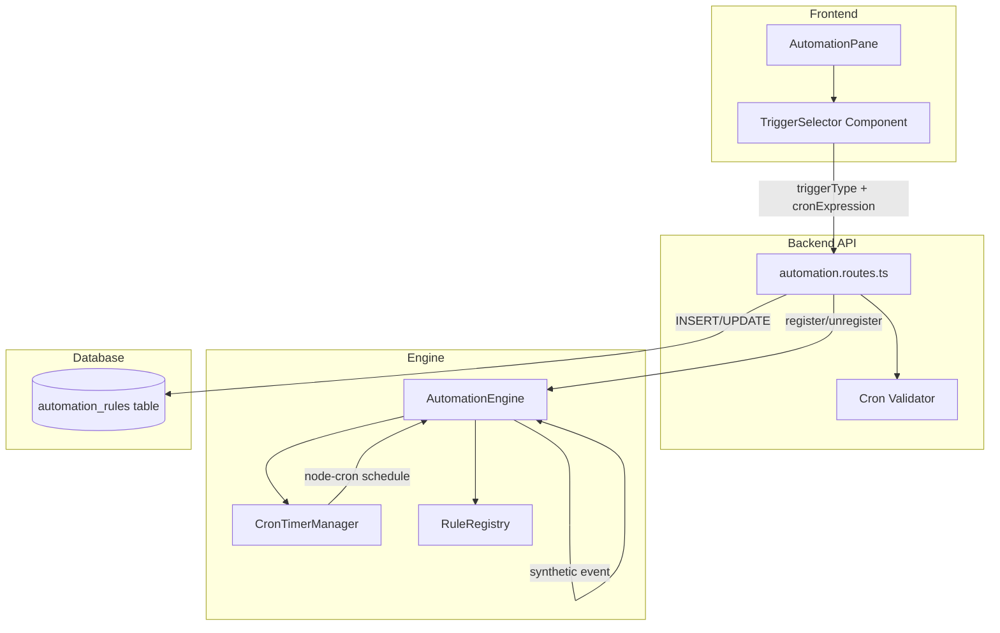
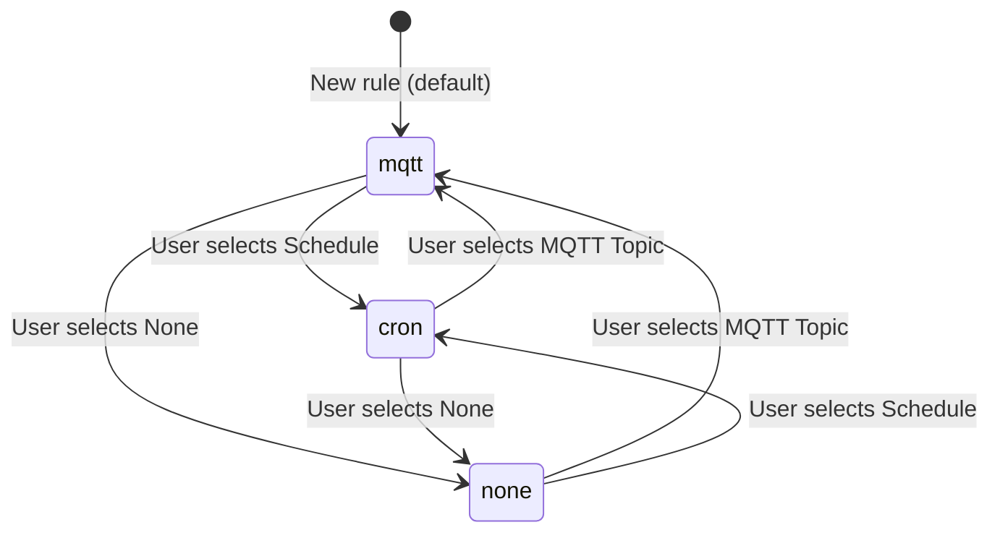

# Design Document: Inline Trigger Selector

## Overview

The Inline Trigger Selector replaces the single text input for `trigger_topic` in the Automation Pane with a structured three-way selector (MQTT Topic / Schedule / None). Cron-based scheduling is managed directly by the AutomationEngine via per-rule timers using `node-cron`, decoupled from the standalone Cron Service. This keeps the user experience simple — pick a trigger type, configure it, and the engine handles the rest.

### Design Goals

- Minimal schema change: two new columns with safe defaults
- Reuse existing `node-cron` dependency for per-rule timers
- Zero impact on existing MQTT-triggered and manual-only rules
- Frontend validation mirrors backend validation (both use `node-cron`'s `validate()`)
- Clean timer lifecycle: timers are created/stopped atomically with rule registration changes

## Architecture



The flow is:
1. User selects trigger type in `TriggerSelector` → sends `triggerType` + `cronExpression` to API
2. API validates cron expression (if applicable), persists to DB
3. API calls `engine.register()` / `engine.unregister()` which manages cron timers internally
4. When a cron timer fires, the engine creates a synthetic `NormalizedEvent` and runs it through the normal `evaluate()` path

## Components and Interfaces

### 1. TriggerSelector (Frontend Component)

A self-contained React component that replaces the current trigger topic `<input>`.

```typescript
// frontend/src/components/TriggerSelector.tsx

interface TriggerSelectorProps {
  triggerType: TriggerType;
  mqttTopic: string;
  cronExpression: string;
  onTriggerTypeChange: (type: TriggerType) => void;
  onMqttTopicChange: (topic: string) => void;
  onCronExpressionChange: (expr: string) => void;
  /** Reports whether the current configuration is valid */
  onValidityChange: (valid: boolean) => void;
}

type TriggerType = "mqtt" | "cron" | "none";

interface CronPreset {
  label: string;
  expression: string;
}
```

**Behavior:**
- Renders a segmented control with three options
- Conditionally renders sub-inputs based on selected type
- For "Schedule": shows preset dropdown + cron expression preview/input + human-readable description
- Calls `onValidityChange(false)` when cron expression is invalid (disables parent save button)

### 2. Cron Utilities (Shared)

```typescript
// src/automations/cron-utils.ts (backend)
// frontend/src/lib/cron-utils.ts (frontend copy — same logic)

export const CRON_PRESETS: CronPreset[] = [
  { label: "Every 1 minute",    expression: "* * * * *" },
  { label: "Every 5 minutes",   expression: "*/5 * * * *" },
  { label: "Every 15 minutes",  expression: "*/15 * * * *" },
  { label: "Every 30 minutes",  expression: "*/30 * * * *" },
  { label: "Every hour",        expression: "0 * * * *" },
  { label: "Every 6 hours",     expression: "0 */6 * * *" },
  { label: "Every 12 hours",    expression: "0 */12 * * *" },
  { label: "Daily at midnight", expression: "0 0 * * *" },
];

/** Validate a cron expression (five-field standard syntax) */
export function isValidCron(expression: string): boolean;

/** Convert a cron expression to a human-readable description */
export function describeCron(expression: string): string;
```

The `describeCron` function uses pattern matching on common cron patterns to produce descriptions like:
- `"* * * * *"` → "Runs every minute"
- `"*/5 * * * *"` → "Runs every 5 minutes"
- `"0 */6 * * *"` → "Runs every 6 hours"
- `"0 0 * * *"` → "Runs daily at midnight"
- `"30 9 * * 1-5"` → "Runs at 09:30 on weekdays"
- Fallback: "Runs on custom schedule"

### 3. CronTimerManager (Backend — Engine Internal)

```typescript
// src/automations/cron-timer-manager.ts

import cron from "node-cron";

export interface CronTimerEntry {
  ruleId: string;
  expression: string;
  task: cron.ScheduledTask;
}

export class CronTimerManager {
  private timers = new Map<string, CronTimerEntry>();

  /** Start a cron timer for a rule. Returns false if expression is invalid. */
  start(ruleId: string, expression: string, onFire: () => void): boolean;

  /** Stop and remove a timer for a rule. No-op if no timer exists. */
  stop(ruleId: string): void;

  /** Check if a rule has an active timer */
  has(ruleId: string): boolean;

  /** Stop all timers (used on engine shutdown) */
  stopAll(): void;

  /** Get count of active timers */
  get size(): number;
}
```

### 4. AutomationEngine Changes

The `AutomationEngine` class gains:
- A `CronTimerManager` instance (created in constructor)
- Modified `register()` to start cron timers for rules with `triggerType === "cron"`
- Modified `unregister()` to stop cron timers
- A new `dispose()` method to stop all timers on shutdown
- The `Rule` interface extended with optional `triggerType` and `cronExpression` fields

```typescript
// Extended Rule interface (in src/core/types.ts)
export interface Rule {
  id: string;
  topic: string;
  condition?: (ctx: EventContext) => boolean;
  action: (ctx: EventContext) => void | Promise<void>;
  name?: string;
  triggerType?: "mqtt" | "cron" | "none";
  cronExpression?: string;
}
```

When a cron timer fires, the engine constructs a synthetic `NormalizedEvent`:
```typescript
{
  deviceId: `automation-cron-${ruleId}`,
  deviceType: "automation",
  state: { ruleId, cronExpression, firedAt: Date.now() },
  topic: `automation/cron/${ruleId}`,
  timestamp: Date.now(),
  integration: "automation",
}
```

This event is passed directly to the rule's `action()` — bypassing the normal `evaluate()` topic-matching loop since we already know which rule to fire.

### 5. API Route Changes

**POST /api/automations** and **PUT /api/automations/:id** accept two new optional fields:
- `triggerType`: `"mqtt" | "cron" | "none"` (defaults to `"mqtt"`)
- `cronExpression`: string (required when `triggerType === "cron"`)

**Validation logic:**
```
if triggerType === "cron":
  - cronExpression must be present and non-empty
  - cronExpression must pass node-cron validate()
  - trigger_topic is set to "" (ignored for cron rules)
if triggerType === "none":
  - trigger_topic is set to ""
  - cronExpression is set to NULL
if triggerType === "mqtt" (or omitted):
  - existing behavior unchanged
  - cronExpression is set to NULL
```

**GET /api/automations** response objects gain:
- `triggerType`: string (derived from DB column, defaults to "mqtt" if NULL)
- `cronExpression`: string | null

## Data Models

### Database Schema Change

Two new columns added to `automation_rules`:

```sql
ALTER TABLE automation_rules ADD COLUMN trigger_type TEXT DEFAULT 'mqtt';
ALTER TABLE automation_rules ADD COLUMN cron_expression TEXT DEFAULT NULL;
```

**Migration strategy** (in `initSchema` using the existing `addColumn` pattern):
```typescript
addColumn("trigger_type", "TEXT DEFAULT 'mqtt'");
addColumn("cron_expression", "TEXT DEFAULT NULL");
```

This is safe because:
- `ALTER TABLE ADD COLUMN` with a default value backfills all existing rows
- Existing rows get `trigger_type = 'mqtt'` which preserves their current behavior
- `cron_expression = NULL` is correct for existing MQTT/manual rules

### State Diagram: Trigger Type Transitions



### Timer Lifecycle on Rule Update

When a rule is updated via PUT:
1. Engine `unregister(id)` — stops any existing cron timer
2. DB row is updated with new trigger_type / cron_expression / trigger_topic
3. Engine `register(updatedRule)` — starts new cron timer if type is "cron"

This ensures no orphaned timers and no gap in scheduling.

## Correctness Properties

*A property is a characteristic or behavior that should hold true across all valid executions of a system — essentially, a formal statement about what the system should do. Properties serve as the bridge between human-readable specifications and machine-verifiable correctness guarantees.*

### Property 1: Preset mapping populates correct cron expression

*For any* preset from the CRON_PRESETS list (excluding "Custom"), selecting that preset should result in the cron expression field containing exactly the `expression` value defined in the preset object.

**Validates: Requirements 2.2**

### Property 2: Cron validation correctness

*For any* string input, the `isValidCron()` utility function should return `true` if and only if the string is a valid five-field cron expression as determined by `node-cron`'s `validate()` function.

**Validates: Requirements 3.1, 5.5**

### Property 3: Human-readable cron description is non-empty for valid expressions

*For any* valid five-field cron expression, the `describeCron()` function should return a non-empty string that starts with "Runs".

**Validates: Requirements 3.4**

### Property 4: API trigger configuration round-trip

*For any* valid automation rule creation payload with a valid `triggerType` and corresponding `cronExpression` (when type is "cron"), creating the rule via POST and then retrieving it via GET should return an object where `triggerType` and `cronExpression` match the original payload.

**Validates: Requirements 5.1, 5.3**

### Property 5: API rejects invalid cron expressions

*For any* string that is not a valid five-field cron expression, attempting to create or update an automation with `triggerType: "cron"` and that string as `cronExpression` should return HTTP 400.

**Validates: Requirements 5.2**

### Property 6: API update persists trigger configuration

*For any* existing automation rule and any valid new `triggerType`/`cronExpression` combination, updating via PUT and then retrieving via GET should reflect the updated values.

**Validates: Requirements 5.4**

### Property 7: Registering a cron rule creates a timer

*For any* valid cron expression, registering a rule with `triggerType: "cron"` and that expression should result in the CronTimerManager having an active timer for that rule ID.

**Validates: Requirements 6.1, 7.3**

### Property 8: Unregistering a cron rule stops its timer

*For any* rule that has an active cron timer, calling `unregister(ruleId)` or changing its `triggerType` away from "cron" should result in the CronTimerManager no longer having a timer for that rule ID.

**Validates: Requirements 6.3, 7.2**

### Property 9: Cron fire event contains required context fields

*For any* cron-triggered rule, when its timer fires, the synthetic event context passed to the rule's action should contain `ruleId` (matching the rule), `cronExpression` (matching the stored expression), and a `firedAt` timestamp that is a valid number greater than zero.

**Validates: Requirements 6.2**

### Property 10: Backward compatibility — null trigger_type treated as mqtt

*For any* automation rule in the database that has a NULL or missing `trigger_type` value, the system should treat it as `triggerType: "mqtt"` and continue to match events using `topicMatches()` against its `trigger_topic`.

**Validates: Requirements 8.1, 8.4**

## Error Handling

| Scenario | Handling |
|----------|----------|
| Invalid cron expression on frontend | `TriggerSelector` shows inline error, disables save button |
| Invalid cron expression on API (POST/PUT) | Return HTTP 400 with `{ error: "Invalid cron expression", statusCode: 400 }` |
| Cron timer fails to start (engine) | Log warning, skip rule, do not affect other rules |
| Timer fires but rule action throws | Existing error handling in `evaluate()` catches and logs |
| Migration fails (column already exists) | Existing `addColumn` pattern silently catches the error |
| Rule with `triggerType: "cron"` but NULL `cronExpression` in DB | Treat as invalid — log warning, skip timer creation |

## Testing Strategy

### Property-Based Tests (using `fast-check`)

The project uses Vitest. Property-based tests will use `fast-check` for generation.

Each property test runs a minimum of **100 iterations** and is tagged with a comment referencing the design property.

**Target properties for PBT:**
- Property 2 (cron validation) — generate random strings, verify `isValidCron()` matches `node-cron.validate()`
- Property 3 (describeCron) — generate valid cron expressions, verify non-empty "Runs..." output
- Property 5 (API rejects invalid cron) — generate invalid strings, verify 400 response
- Property 7 (register creates timer) — generate valid expressions, verify timer exists
- Property 8 (unregister stops timer) — generate rules, register then unregister, verify no timer
- Property 9 (cron fire event shape) — generate rules, fire timer, verify event context fields

**Tag format:** `// Feature: inline-trigger-selector, Property {N}: {title}`

### Unit Tests (example-based)

- TriggerSelector renders three options (Req 1.1)
- Selecting each type shows/hides correct sub-inputs (Req 1.2–1.4)
- Default selection is "MQTT Topic" (Req 1.5)
- All presets are listed (Req 2.1)
- Custom mode enables free-text input (Req 2.3)
- Invalid cron shows error + disables save (Req 3.2, 3.3)
- Edit mode pre-populates current values (Req 7.1)
- Backward compat: empty trigger_topic + null trigger_type = "none" behavior (Req 8.4)

### Integration Tests

- Full create → read → update → delete cycle with each trigger type
- Engine startup loads cron timers for all enabled cron rules (Req 6.4)
- Timer lifecycle across rule updates (stop old, start new)
- Migration preserves existing data (Req 4.5, 8.3)

### Smoke Tests

- Database migration adds columns without error (Req 4.1, 4.2)
- Existing automations continue to function after deployment (Req 8.2)
