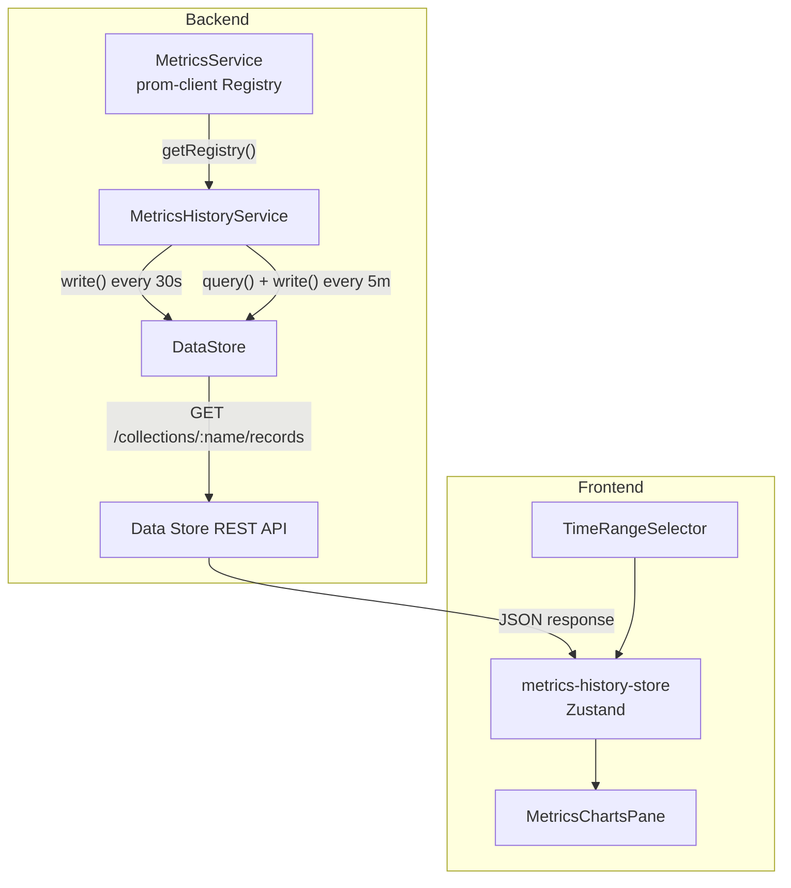
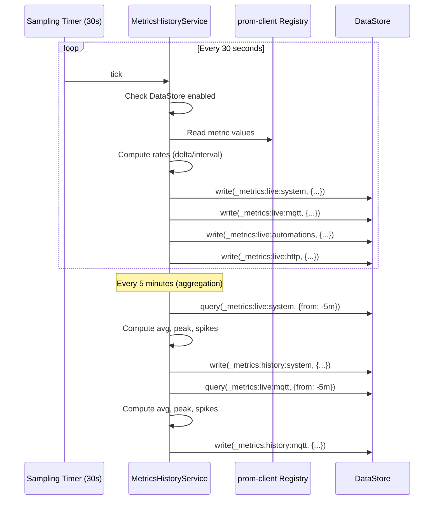
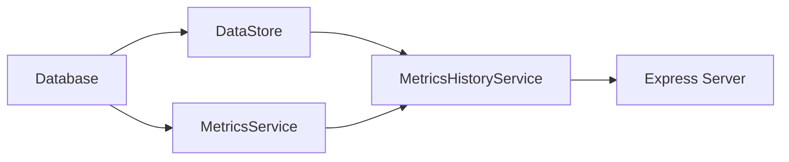

# Design Document: Metrics History

## Overview

This design introduces a **MetricsHistoryService** — a backend singleton that periodically samples metric values from the existing prom-client registry and persists them into the Data Store as time-series records. It operates in two tiers:

- **Tier 1 (Live):** Samples raw metric values every 30 seconds into ephemeral `_metrics:live:*` collections with 10-minute retention. Powers the 1-hour sparkline view at full resolution (~120 data points).
- **Tier 2 (History):** Every 5 minutes, aggregates the accumulated Tier 1 samples into a single summary record (avg, peak, spikes) written to permanent `_metrics:history:*` collections. Powers long-term trend views (6h–30d).

The frontend gains a new `MetricsChartsPane` component with SVG sparkline/trend charts, a time-range selector, and spike markers — all built on the existing `StateHistoryChart` rendering patterns and querying the Data Store REST API.

### Key Design Decisions

1. **Reuse Data Store for persistence** — No new storage layer. The existing DataStore class already provides time-series writes, time-range queries, retention enforcement, and FIFO eviction. Metrics history collections are just regular collections with a `_metrics:` prefix convention.

2. **Two-tier architecture over single-tier** — A single high-resolution tier would consume ~2.5 GB/year. The two-tier approach gives full resolution for the last hour (where it matters most) and compact 5-minute aggregates for long-term trends (~70 MB/year).

3. **Rate computation from counters** — prom-client counters are monotonically increasing totals. Displaying raw totals on a chart is meaningless; users need rates (messages/sec). The service computes delta/interval between consecutive samples.

4. **Spike detection at aggregation time** — Rather than a separate anomaly detection pass, spikes are identified during the 5-minute aggregation cycle using a simple 2× average threshold. This is cheap, deterministic, and requires no additional storage.

5. **Polling over event-driven sampling** — The MetricsService already collects metrics via event bus listeners. The history service reads the accumulated registry values on a timer rather than subscribing to every event, keeping the two concerns decoupled.

6. **SVG charts reusing StateHistoryChart patterns** — The existing `StateHistoryChart` component already implements smooth path interpolation, responsive width, tooltips, and the Aeolus color palette. The new charts follow the same approach with minor adaptations for sparkline density.

7. **System collections hidden by default** — `_metrics:*` collections are internal infrastructure. They're hidden from the Data Store Explorer to avoid cluttering the user's view, with a toggle to reveal them when needed.

## Architecture



### Sampling & Aggregation Flow



### Service Initialization Order



The `MetricsHistoryService` is instantiated after both `DataStore` and `MetricsService` are initialized, and disposed before them during shutdown.

## Components and Interfaces

### MetricsHistoryService (`src/metrics/metrics-history-service.ts`)

The core backend service responsible for both Tier 1 sampling and Tier 2 aggregation.

```typescript
export interface MetricsHistoryConfig {
  /** Sampling interval in milliseconds (default: 30,000, min: 5,000) */
  samplingIntervalMs: number;
  /** Aggregation interval in milliseconds (default: 300,000, min: 60,000) */
  aggregationIntervalMs: number;
  /** Retention for live collections in minutes (default: 10, min: 5) */
  liveRetentionMinutes: number;
}

export interface MetricsHistoryDeps {
  /** DataStore instance for persistence */
  dataStore: DataStore;
  /** prom-client Registry for reading metric values */
  registry: Registry;
  /** Logger instance */
  logger: Logger;
}

export interface Tier1Sample {
  timestamp: number;
  [field: string]: number;
}

export interface SpikeEntry {
  at: number;
  value: number;
}

export interface Tier2Aggregate {
  timestamp: number;
  spikes: Record<string, SpikeEntry> | null;
  [field: string]: unknown;
}

export class MetricsHistoryService {
  constructor(deps: MetricsHistoryDeps, config?: Partial<MetricsHistoryConfig>);

  /** Start both sampling and aggregation timers */
  start(): void;

  /** Stop timers, attempt final aggregation, clear state */
  dispose(): Promise<void>;

  /** Execute one sampling cycle (exposed for testing) */
  sampleOnce(): void;

  /** Execute one aggregation cycle (exposed for testing) */
  aggregateOnce(): void;

  /** Check if the service is currently running */
  isRunning(): boolean;
}
```

### Configuration Validator (`src/metrics/metrics-history-config.ts`)

Pure function that validates and clamps environment variable values.

```typescript
export interface ValidatedMetricsHistoryConfig {
  samplingIntervalMs: number;
  aggregationIntervalMs: number;
  liveRetentionMinutes: number;
}

/**
 * Parse and validate metrics history configuration from environment variables.
 * Invalid values are clamped to safe minimums with warning logs.
 */
export function parseMetricsHistoryConfig(env: Record<string, string | undefined>): ValidatedMetricsHistoryConfig;
```

### Rate Computer (`src/metrics/rate-computer.ts`)

Stateful helper that tracks previous counter values and computes per-second rates.

```typescript
export class RateComputer {
  /** Store a counter value. Returns the computed rate, or null if first sample or counter reset. */
  computeRate(metricName: string, currentValue: number, intervalSeconds: number): number | null;

  /** Clear all stored previous values */
  reset(): void;
}
```

### Aggregation Functions (`src/metrics/aggregation.ts`)

Pure functions for computing aggregates and detecting spikes.

```typescript
export interface AggregateResult {
  avg: number;
  peak: number;
}

export interface SpikeDetectionResult {
  spikes: Record<string, SpikeEntry> | null;
}

/** Compute average and peak for a numeric array */
export function computeAggregate(values: number[]): AggregateResult;

/** Detect spikes in a set of timestamped values. Returns null if < 3 samples. */
export function detectSpikes(
  samples: Array<{ timestamp: number; value: number }>,
  thresholdMultiplier?: number,
): SpikeEntry | null;

/** Align a timestamp to the nearest 5-minute boundary (floor) */
export function alignToWindow(timestampMs: number, windowMs: number): number;
```

### Frontend: MetricsChartsPane (`frontend/src/components/panes/MetricsChartsPane.tsx`)

New dashboard pane component displaying metric sparkline/trend charts.

```typescript
interface MetricsChartsPaneProps {
  config: PaneConfig;
  paneId?: string;
}

export function MetricsChartsPane(props: MetricsChartsPaneProps): JSX.Element;
```

### Frontend: MetricSparkline (`frontend/src/components/MetricSparkline.tsx`)

Individual metric chart component with SVG rendering.

```typescript
interface MetricSparklineProps {
  /** Chart title/label */
  label: string;
  /** Primary data points (avg values) */
  data: Array<{ timestamp: number; value: number }>;
  /** Optional peak data points (secondary line) */
  peakData?: Array<{ timestamp: number; value: number }>;
  /** Optional spike markers */
  spikes?: Array<{ at: number; value: number }>;
  /** Current (most recent) value to display prominently */
  currentValue?: number;
  /** Unit suffix (e.g., "MB", "msg/s", "ms") */
  unit?: string;
  /** Chart height in pixels */
  height?: number;
  /** Line color override */
  color?: string;
}

export function MetricSparkline(props: MetricSparklineProps): JSX.Element;
```

### Frontend: TimeRangeSelector (`frontend/src/components/TimeRangeSelector.tsx`)

Pill-button toggle for selecting the chart time range.

```typescript
type TimeRange = "1h" | "6h" | "24h" | "7d" | "30d";

interface TimeRangeSelectorProps {
  value: TimeRange;
  onChange: (range: TimeRange) => void;
}

export function TimeRangeSelector(props: TimeRangeSelectorProps): JSX.Element;
```

### Frontend: metrics-history-store (`frontend/src/store/metrics-history-store.ts`)

Zustand store managing chart data fetching and polling.

```typescript
interface MetricsHistoryState {
  timeRange: TimeRange;
  chartData: Record<string, MetricChartData>;
  loading: boolean;
  error: string | null;

  setTimeRange(range: TimeRange): void;
  fetchChartData(): Promise<void>;
  startPolling(): void;
  stopPolling(): void;
}

interface MetricChartData {
  points: Array<{ timestamp: number; value: number }>;
  peakPoints?: Array<{ timestamp: number; value: number }>;
  spikes?: Array<{ at: number; value: number }>;
  currentValue: number;
}
```

## Data Models

### Tier 1 Collection Records

Each collection stores records with the following payload structures:

**`_metrics:live:system`**
```json
{
  "memoryUsageMb": 85.3,
  "eventLoopLagMs": 2.1,
  "uptimeSeconds": 3600,
  "timestamp": 1700000000000
}
```

**`_metrics:live:mqtt`**
```json
{
  "messagesReceivedRate": 12.5,
  "messagesPublishedRate": 3.2,
  "connected": 1,
  "timestamp": 1700000000000
}
```

**`_metrics:live:automations`**
```json
{
  "executionRate": 0.8,
  "errorRate": 0.02,
  "activeRules": 15,
  "timestamp": 1700000000000
}
```

**`_metrics:live:http`**
```json
{
  "requestRate": 5.1,
  "timestamp": 1700000000000
}
```

### Tier 2 Aggregate Records

**`_metrics:history:system`**
```json
{
  "avgMemoryMb": 84.7,
  "peakMemoryMb": 92.1,
  "avgEventLoopLagMs": 1.8,
  "peakEventLoopLagMs": 5.2,
  "spikes": {
    "eventLoopLagMs": { "at": 1700000120000, "value": 5.2 }
  },
  "timestamp": 1700000000000
}
```

**`_metrics:history:mqtt`**
```json
{
  "avgMessagesPerSec": 11.2,
  "peakMessagesPerSec": 28.5,
  "connectedPct": 100,
  "spikes": {
    "messagesReceivedRate": { "at": 1700000090000, "value": 28.5 }
  },
  "timestamp": 1700000000000
}
```

**`_metrics:history:automations`**
```json
{
  "totalExecutions": 24,
  "totalErrors": 1,
  "avgActiveRules": 15,
  "spikes": null,
  "timestamp": 1700000000000
}
```

**`_metrics:history:http`**
```json
{
  "totalRequests": 153,
  "avgResponseMs": 12.4,
  "spikes": null,
  "timestamp": 1700000000000
}
```

### Collection Configuration

| Collection | Retention | Created By |
|-----------|-----------|-----------|
| `_metrics:live:system` | 10 minutes | MetricsHistoryService (auto-create) |
| `_metrics:live:mqtt` | 10 minutes | MetricsHistoryService (auto-create) |
| `_metrics:live:automations` | 10 minutes | MetricsHistoryService (auto-create) |
| `_metrics:live:http` | 10 minutes | MetricsHistoryService (auto-create) |
| `_metrics:history:system` | None (permanent) | MetricsHistoryService (auto-create) |
| `_metrics:history:mqtt` | None (permanent) | MetricsHistoryService (auto-create) |
| `_metrics:history:automations` | None (permanent) | MetricsHistoryService (auto-create) |
| `_metrics:history:http` | None (permanent) | MetricsHistoryService (auto-create) |

### Environment Variables

| Variable | Default | Min | Description |
|----------|---------|-----|-------------|
| `METRICS_HISTORY_INTERVAL_MS` | 30,000 | 5,000 | Tier 1 sampling interval |
| `METRICS_HISTORY_AGGREGATION_INTERVAL_MS` | 300,000 | 60,000 | Tier 2 aggregation interval |
| `METRICS_HISTORY_LIVE_RETENTION_MINUTES` | 10 | 5 | Ephemeral collection retention |

## Correctness Properties

*A property is a characteristic or behavior that should hold true across all valid executions of a system — essentially, a formal statement about what the system should do. Properties serve as the bridge between human-readable specifications and machine-verifiable correctness guarantees.*

### Property 1: Rate computation correctness

*For any* pair of consecutive counter values where `current >= previous` and any positive interval in seconds, the computed rate SHALL equal `(current - previous) / intervalSeconds`. *For any* pair where `current < previous` (counter reset), the rate SHALL be `null`.

**Validates: Requirements 2.2, 2.4**

### Property 2: Tier 1 record structure and routing

*For any* valid metric registry state (with arbitrary non-negative numeric values for each metric), sampling SHALL produce exactly one record per defined collection (`system`, `mqtt`, `automations`, `http`), each written to a collection with the `_metrics:live:` prefix, and each record SHALL contain exactly the specified payload fields with numeric values and a valid epoch-millisecond timestamp.

**Validates: Requirements 1.2, 3.1, 3.2, 3.3, 3.4, 3.5, 3.6**

### Property 3: DataStore-disabled guard

*For any* metric registry state, when the DataStore is disabled, invoking the sampling function SHALL produce zero writes to any collection.

**Validates: Requirements 1.3**

### Property 4: Aggregation computation correctness

*For any* non-empty array of Tier 1 sample records (length ≥ 2) with arbitrary non-negative numeric field values, the computed aggregate SHALL have `avg` equal to the arithmetic mean of the values and `peak` equal to the maximum value. The aggregate record SHALL be written to the corresponding `_metrics:history:*` collection with a timestamp aligned to the 5-minute window boundary.

**Validates: Requirements 4.3, 4.4, 5.1, 5.2, 5.3, 5.4, 5.5, 5.6**

### Property 5: Spike detection

*For any* array of timestamped numeric samples with length ≥ 3, a spike SHALL be detected for a field if and only if at least one sample value exceeds `2.0 × average`. When detected, the recorded spike SHALL be the sample with the maximum value among all samples exceeding the threshold, with its exact timestamp and value. When no sample exceeds the threshold, the field SHALL be absent from the spikes object. When fewer than 3 samples exist, spikes SHALL be `null`.

**Validates: Requirements 6.2, 6.3, 6.4, 6.5, 6.7**

### Property 6: Sampling resilience

*For any* sampling cycle where a subset of metric reads throw errors, all non-erroring metrics SHALL still be written to their respective collections, and the service SHALL remain in a running state (timer not stopped).

**Validates: Requirements 7.1, 7.2, 7.3, 7.5**

### Property 7: Configuration validation

*For any* string value provided as an environment variable for sampling interval, aggregation interval, or retention minutes: if the value is non-numeric or non-positive, the output SHALL be the default value; if the value is numeric but below the minimum, the output SHALL be clamped to the minimum; if the value is numeric and at or above the minimum, the output SHALL be the parsed numeric value.

**Validates: Requirements 13.1, 13.2, 13.3, 13.4, 13.5, 13.6**

### Property 8: Timestamp window alignment

*For any* timestamp in milliseconds and any positive window size in milliseconds, the aligned timestamp SHALL equal `Math.floor(timestamp / windowMs) * windowMs`, which is always ≤ the input timestamp and always a multiple of the window size.

**Validates: Requirements 5.6**

## Error Handling

### Sampling Errors

| Scenario | Behavior |
|----------|----------|
| Single metric read throws | Log warning, skip that metric, continue with others |
| All metric reads throw | Log warning ("all metrics failed"), skip entire cycle |
| DataStore write throws for one collection | Log error, continue writing other collections |
| DataStore is disabled | Skip all writes silently (no error log) |
| Counter value decreases (reset) | Treat as baseline reset, skip rate for this sample |

### Aggregation Errors

| Scenario | Behavior |
|----------|----------|
| Query returns < 2 samples for a collection | Log info, skip aggregation for that collection |
| Query throws for one collection | Log error, continue aggregating other collections |
| Write throws for one aggregate | Log error, continue with other collections |
| DataStore unavailable | Log warning, retry on next 5-minute cycle |

### Configuration Errors

| Scenario | Behavior |
|----------|----------|
| Non-numeric env var value | Log warning with the invalid value, use default |
| Value below minimum | Log warning with the value and minimum, clamp to minimum |
| Missing env var | Use default silently (no warning) |

### Frontend Error States

| Scenario | UI Behavior |
|----------|-------------|
| API returns empty data | Show "No data" placeholder in chart area |
| API returns < 2 points | Show "Not enough data" with guidance message |
| API request fails | Show error message, retry on next poll |
| DataStore disabled | Show "Metrics history requires Data Store" message |

All errors follow the existing Aeolus pattern: log with pino structured logging, never crash the process, degrade gracefully.

## Testing Strategy

### Property-Based Tests (fast-check, minimum 100 iterations)

Property-based testing is appropriate for this feature because the core logic consists of pure computational functions (rate computation, aggregation, spike detection, config validation) with clear input/output behavior where input variation reveals edge cases.

**Library:** `fast-check` (already in devDependencies) with `@fast-check/vitest`

**Test files:**

- `src/metrics/rate-computer.property.test.ts` — Property 1
- `src/metrics/metrics-history-service.property.test.ts` — Properties 2, 3, 6
- `src/metrics/aggregation.property.test.ts` — Properties 4, 5, 8
- `src/metrics/metrics-history-config.property.test.ts` — Property 7

Each property test must:
- Run minimum 100 iterations
- Reference its design property with a tag comment: `// Feature: metrics-history, Property N: <title>`
- Use generators for metric values, counter pairs, sample arrays, and env var strings

**Generators needed:**
- `arbMetricRegistryState` — generates valid metric registry states with non-negative values
- `arbCounterPair` — generates `{ previous: number, current: number, intervalSeconds: number }`
- `arbSampleArray` — generates arrays of `{ timestamp: number, value: number }` with configurable length
- `arbEnvVarValue` — generates strings that may be numeric, non-numeric, negative, or valid
- `arbTier1Samples` — generates realistic Tier 1 sample records for aggregation testing

### Unit Tests (example-based)

**Test files:**
- `src/metrics/metrics-history-service.test.ts` — Lifecycle, DataStore enable/disable transitions, first-sample skip, shutdown aggregation
- `src/metrics/rate-computer.test.ts` — Specific examples: first call returns null, reset detection, normal rate
- `src/metrics/aggregation.test.ts` — Specific examples: empty array, single sample, known values

Focus areas:
- Service start/stop lifecycle
- DataStore enabled → disabled → enabled transitions
- First sample produces no rate (only baseline)
- Counter reset detection with specific values
- Aggregation skipped when < 2 samples
- Spike detection skipped when < 3 samples
- Final aggregation on dispose

### Frontend Tests

- `frontend/src/components/MetricSparkline.test.tsx` — Renders SVG, handles empty data, shows spike markers
- `frontend/src/components/TimeRangeSelector.test.tsx` — Renders all options, calls onChange
- `frontend/src/store/metrics-history-store.test.ts` — Fetches correct endpoints per time range, polling lifecycle

### Integration Tests

- Full sampling → query → aggregation → query cycle with real DataStore
- Retention enforcement prunes expired Tier 1 records
- Data Store Explorer hides `_metrics:*` collections by default

### Test Configuration

```typescript
// Property tests use fast-check with minimum 100 iterations
// Tag format: Feature: metrics-history, Property {N}: {title}
// Example:
// // Feature: metrics-history, Property 1: Rate computation correctness
// test.prop([arbCounterPair], { numRuns: 100 })("rate = delta / interval", (pair) => { ... });
```

### Dependencies

No new runtime dependencies needed — the implementation uses:
- `prom-client` (existing) — reading registry values
- `DataStore` (existing) — persistence
- `pino` (existing) — logging

No new dev dependencies needed — `fast-check`, `vitest`, and `@fast-check/vitest` are already available.
