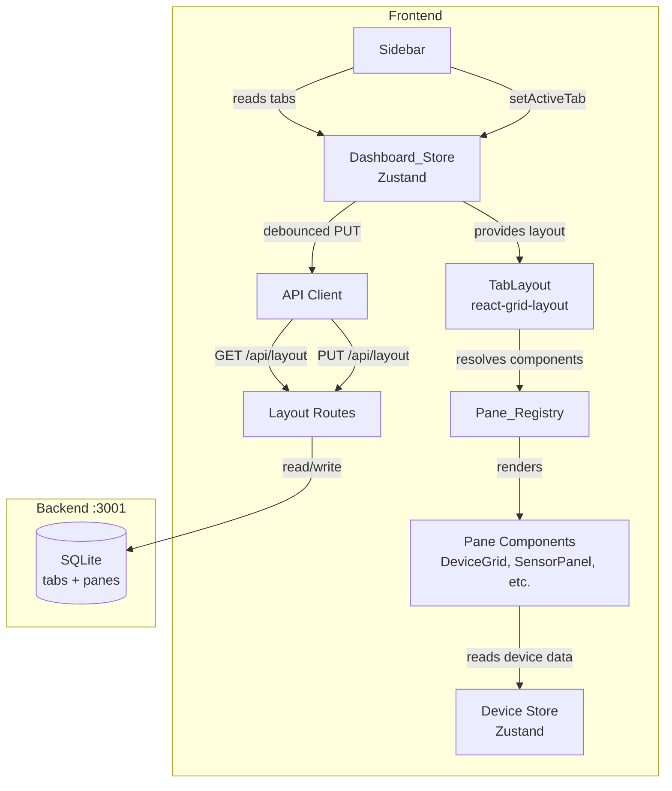
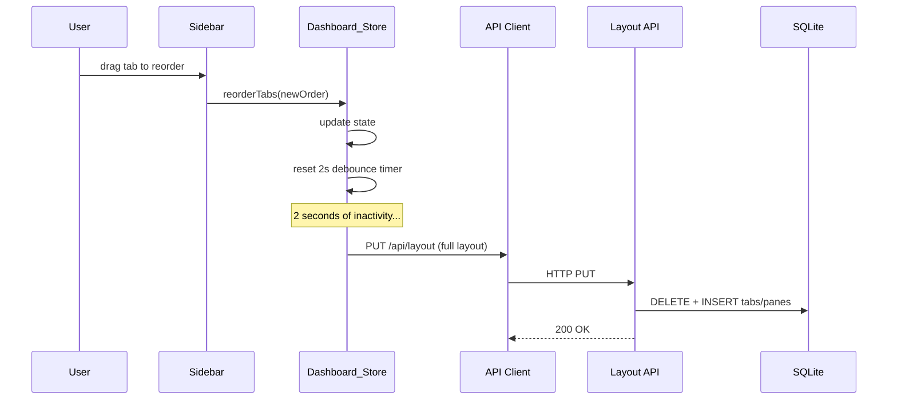
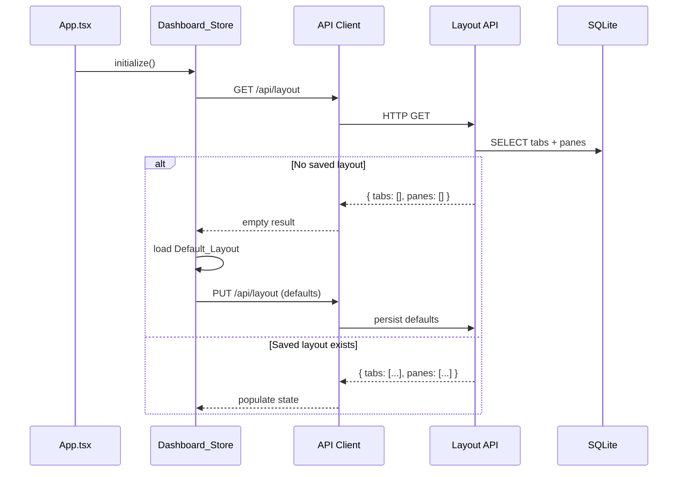

# Design Document: Modular Dashboard

## Overview

The modular dashboard replaces Aeolus's hardcoded four-page navigation (Dashboard, Lighting, Automations, System) with a user-defined tab system. Each Tab contains a configurable grid of Panes — reusable UI building blocks that wrap existing React components (DeviceGrid, SensorPanel, MqttInspector, etc.) and accept a Pane_Config object for filtering and display control.

The feature touches three layers:

1. **Frontend**: A new Zustand store slice (`Dashboard_Store`) manages Tab/Pane state. The Sidebar renders dynamic tabs instead of hardcoded buttons. A `TabLayout` component renders Panes in a responsive CSS grid. A `Pane_Registry` module maps Pane_Type identifiers to React components.
2. **Backend**: Two new SQLite tables (`tabs` and `panes`) persist layout configuration. Two new REST endpoints (`GET /api/layout`, `PUT /api/layout`) serve and accept the full layout.
3. **Serialization**: Layout data round-trips through JSON for SQLite storage and HTTP transport.

First-time users receive a Default_Layout that replicates the current four-page experience. All default tabs are fully editable and deletable.

### Key Design Decisions

- **CSS Grid over drag-and-drop library**: Use `react-grid-layout` for the responsive grid with drag/resize. It's lightweight, well-maintained, and handles overlap reflow natively — avoiding a custom grid implementation.
- **Full-layout PUT over granular CRUD**: A single `PUT /api/layout` endpoint replaces the entire layout atomically. This avoids complex partial-update logic and race conditions from debounced saves. The layout payload is small (< 10KB for typical configurations).
- **Debounced save (2s) over immediate persist**: Frontend batches rapid edits (drag, resize, rename) into a single PUT after 2 seconds of inactivity. Reduces backend writes without risking data loss.
- **Pane_Registry as a plain object over plugin system**: At this stage, Pane types are known at compile time. A simple `Record<string, PaneRegistryEntry>` is sufficient. A dynamic plugin system can be added later if needed.
- **Separate Zustand slice over extending device-store**: Dashboard layout state is orthogonal to device state. A separate store file (`dashboard-store.ts`) keeps concerns clean and avoids bloating the existing store.

## Architecture

### System Integration Diagram



### Layout Save Flow



### Default Layout Initialization Flow



## Components and Interfaces

### Backend Components

#### Layout Routes (`src/api/routes/layout.routes.ts`)

Two endpoints for layout persistence:

```typescript
// GET /api/layout → { tabs: Tab[], panes: Pane[] }
// PUT /api/layout ← { tabs: Tab[], panes: Pane[] } → { success: true }

function createLayoutRoutes(db: Database): Router;
```

The GET endpoint joins `tabs` and `panes` tables, deserializes JSON fields (`config`, `icon`), and returns the full layout. The PUT endpoint wraps a DELETE-all + INSERT-all in a single transaction for atomicity.

#### Layout Schema Migration (`src/db/database.ts`)

Two new tables added to `initSchema()`:

```sql
CREATE TABLE IF NOT EXISTS tabs (
  id TEXT PRIMARY KEY,
  name TEXT NOT NULL,
  icon TEXT NOT NULL DEFAULT 'layout',
  "order" INTEGER NOT NULL,
  pinned INTEGER NOT NULL DEFAULT 0,
  created_at INTEGER NOT NULL
);

CREATE TABLE IF NOT EXISTS panes (
  id TEXT PRIMARY KEY,
  tab_id TEXT NOT NULL REFERENCES tabs(id) ON DELETE CASCADE,
  pane_type TEXT NOT NULL,
  config TEXT NOT NULL DEFAULT '{}',
  x INTEGER NOT NULL DEFAULT 0,
  y INTEGER NOT NULL DEFAULT 0,
  w INTEGER NOT NULL DEFAULT 6,
  h INTEGER NOT NULL DEFAULT 4,
  created_at INTEGER NOT NULL
);
```

### Frontend Components

#### Pane_Registry (`frontend/src/lib/pane-registry.ts`)

Maps Pane_Type identifiers to React components and metadata:

```typescript
interface PaneRegistryEntry {
  component: React.ComponentType<{ config: PaneConfig }>;
  displayName: string;
  defaultIcon: string;       // Lucide icon name
  defaultConfig: PaneConfig;
  defaultSize: { w: number; h: number };
}

const PANE_REGISTRY: Record<string, PaneRegistryEntry> = {
  "device-grid":       { component: DeviceGridPane, displayName: "Device Grid", ... },
  "sensor-panel":      { component: SensorPanelPane, displayName: "Sensor Panel", ... },
  "mqtt-inspector":    { component: MqttInspectorPane, displayName: "MQTT Inspector", ... },
  "hue-lights":        { component: HueLightsPane, displayName: "Hue Lights", ... },
  "automation-rules":  { component: AutomationRulesPane, displayName: "Automation Rules", ... },
  "system-stats":      { component: SystemStatsPane, displayName: "System Stats", ... },
  "topic-tree":        { component: TopicTreePane, displayName: "Topic Tree", ... },
  "event-log":         { component: EventLogPane, displayName: "Event Log", ... },
};
```

Each Pane wrapper component accepts a `config` prop and passes the relevant filters down to the existing component (e.g., `DeviceGridPane` passes `config.room` and `config.deviceType` to `DeviceGrid`).

#### Dashboard_Store (`frontend/src/store/dashboard-store.ts`)

Separate Zustand store for layout state:

```typescript
interface DashboardState {
  tabs: Tab[];
  panes: Pane[];
  activeTabId: string | null;
  initialized: boolean;

  // Tab actions
  addTab: (name: string, icon: string) => void;
  renameTab: (tabId: string, name: string) => void;
  reorderTabs: (orderedIds: string[]) => void;
  deleteTab: (tabId: string) => void;
  setActiveTab: (tabId: string) => void;

  // Pane actions
  addPane: (tabId: string, paneType: string) => void;
  updatePanePosition: (paneId: string, x: number, y: number) => void;
  updatePaneSize: (paneId: string, w: number, h: number) => void;
  updatePaneConfig: (paneId: string, config: PaneConfig) => void;
  removePane: (paneId: string) => void;

  // Persistence
  initialize: () => Promise<void>;
  persistLayout: () => void;  // debounced, calls PUT /api/layout
}
```

Every mutation action updates local state immediately and triggers the debounced `persistLayout()`.

#### TabLayout (`frontend/src/components/TabLayout.tsx`)

Renders the active tab's panes using `react-grid-layout`:

```typescript
interface TabLayoutProps {
  tabId: string;
}

function TabLayout({ tabId }: TabLayoutProps): JSX.Element;
// - Reads panes for tabId from Dashboard_Store
// - Maps each pane through Pane_Registry to resolve component
// - Renders react-grid-layout ResponsiveGridLayout
// - Handles drag/resize callbacks → updatePanePosition/updatePaneSize
// - Renders PaneErrorBoundary for unknown pane types
```

#### PanePicker (`frontend/src/components/PanePicker.tsx`)

Modal/dropdown listing all available Pane_Types from the registry:

```typescript
interface PanePickerProps {
  tabId: string;
  onClose: () => void;
}

function PanePicker({ tabId, onClose }: PanePickerProps): JSX.Element;
// - Lists PANE_REGISTRY entries with displayName + icon
// - On select: calls Dashboard_Store.addPane(tabId, paneType)
```

#### PaneConfigPanel (`frontend/src/components/PaneConfigPanel.tsx`)

Settings panel for configuring a Pane's filters:

```typescript
interface PaneConfigPanelProps {
  paneId: string;
  paneType: string;
  config: PaneConfig;
  onSave: (config: PaneConfig) => void;
  onClose: () => void;
}

function PaneConfigPanel(props: PaneConfigPanelProps): JSX.Element;
// - Renders form fields based on paneType
// - device-grid: room filter, deviceType filter
// - mqtt-inspector: topic pattern filter
// - system-stats: show/hide sections
// - On save: calls Dashboard_Store.updatePaneConfig
```

#### Updated Sidebar (`frontend/src/components/Sidebar.tsx`)

The existing Sidebar is modified to:
- Render pinned tabs (Dashboard, Automations, System) at the top in a fixed section — these cannot be deleted, renamed, or reordered
- Render a visual separator line below the pinned tabs
- Render custom (non-pinned) tabs below the separator from `Dashboard_Store.tabs`
- Add an "Add Tab" button at the bottom of the custom tab list
- Support double-click to rename, drag to reorder, and delete icon on custom tabs only
- Keep simulator toggle, MQTT status, and WebSocket status in their current positions at the bottom

#### Updated App.tsx

The `currentPage` routing logic is replaced:
- On mount, call `Dashboard_Store.initialize()`
- Render `TabLayout` for the active tab instead of switching on `currentPage`
- Keep global overlays (ToastContainer, CommandPalette, DeviceDetail modal)


## Data Models

### Tab

```typescript
interface Tab {
  id: string;          // UUID v4
  name: string;        // User-provided, non-empty
  icon: string;        // Lucide icon name, e.g. "cpu", "lightbulb", "zap"
  order: number;       // Display order (0-based, ascending)
  pinned: boolean;     // Pinned tabs appear at the top, cannot be deleted or reordered
  createdAt: number;   // Unix timestamp ms
}
```

### Pane

```typescript
interface Pane {
  id: string;          // UUID v4
  tabId: string;       // Foreign key → Tab.id
  paneType: string;    // Key into Pane_Registry, e.g. "device-grid"
  config: PaneConfig;  // Type-specific filter/display config
  x: number;           // Grid column position (0-based)
  y: number;           // Grid row position (0-based)
  w: number;           // Width in grid columns (1-12)
  h: number;           // Height in grid rows (min 2)
  createdAt: number;   // Unix timestamp ms
}
```

### PaneConfig

```typescript
interface PaneConfig {
  room?: string;           // Filter by room (parsed from MQTT topic location)
  deviceType?: string;     // Filter by device type ("light", "sensor", etc.)
  topicPattern?: string;   // MQTT topic filter for mqtt-inspector
  showSections?: string[]; // For system-stats: which sections to display
  [key: string]: unknown;  // Extensible for future Pane_Types
}
```

### Layout Payload (API transport)

```typescript
interface LayoutPayload {
  tabs: Tab[];
  panes: Pane[];
}
```

This is the shape used by both `GET /api/layout` and `PUT /api/layout`.

### SQLite Schema (new tables)

```sql
CREATE TABLE IF NOT EXISTS tabs (
  id TEXT PRIMARY KEY,
  name TEXT NOT NULL,
  icon TEXT NOT NULL DEFAULT 'layout',
  "order" INTEGER NOT NULL,
  pinned INTEGER NOT NULL DEFAULT 0,
  created_at INTEGER NOT NULL
);

CREATE TABLE IF NOT EXISTS panes (
  id TEXT PRIMARY KEY,
  tab_id TEXT NOT NULL REFERENCES tabs(id) ON DELETE CASCADE,
  pane_type TEXT NOT NULL,
  config TEXT NOT NULL DEFAULT '{}',
  x INTEGER NOT NULL DEFAULT 0,
  y INTEGER NOT NULL DEFAULT 0,
  w INTEGER NOT NULL DEFAULT 6,
  h INTEGER NOT NULL DEFAULT 4,
  created_at INTEGER NOT NULL
);
```

The `config` column stores a JSON string. The `tab_id` foreign key with `ON DELETE CASCADE` ensures panes are removed when their parent tab is deleted. The `pinned` column (0 or 1) marks system tabs that cannot be deleted or reordered.

### Default_Layout Seed Data

```typescript
const DEFAULT_TABS: Tab[] = [
  // Pinned system tabs — always at the top, cannot be deleted or reordered
  { id: "default-dashboard",    name: "Dashboard",   icon: "cpu",       order: 0, pinned: true,  createdAt: Date.now() },
  { id: "default-automations",  name: "Automations", icon: "zap",       order: 1, pinned: true,  createdAt: Date.now() },
  { id: "default-system",       name: "System",      icon: "server",    order: 2, pinned: true,  createdAt: Date.now() },
  // Default custom tab — user can rename, reorder, or delete
  { id: "default-lighting",     name: "Lighting",    icon: "lightbulb", order: 3, pinned: false, createdAt: Date.now() },
];

const DEFAULT_PANES: Pane[] = [
  // Dashboard tab
  { id: "dp-system-stats",   tabId: "default-dashboard",   paneType: "system-stats",    config: {}, x: 0, y: 0, w: 12, h: 3, createdAt: Date.now() },
  { id: "dp-sensor-panel",   tabId: "default-dashboard",   paneType: "sensor-panel",    config: {}, x: 0, y: 3, w: 12, h: 4, createdAt: Date.now() },
  { id: "dp-device-grid",    tabId: "default-dashboard",   paneType: "device-grid",     config: {}, x: 0, y: 7, w: 12, h: 5, createdAt: Date.now() },
  { id: "dp-mqtt-inspector", tabId: "default-dashboard",   paneType: "mqtt-inspector",  config: {}, x: 0, y: 12, w: 6, h: 5, createdAt: Date.now() },
  { id: "dp-topic-tree",     tabId: "default-dashboard",   paneType: "topic-tree",      config: {}, x: 6, y: 12, w: 6, h: 5, createdAt: Date.now() },
  { id: "dp-event-log",      tabId: "default-dashboard",   paneType: "event-log",       config: {}, x: 0, y: 17, w: 12, h: 4, createdAt: Date.now() },
  // Automations tab
  { id: "dp-auto-rules",     tabId: "default-automations", paneType: "automation-rules", config: {}, x: 0, y: 0, w: 12, h: 8, createdAt: Date.now() },
  // System tab
  { id: "dp-sys-diag",       tabId: "default-system",      paneType: "system-stats",    config: { showSections: ["host", "cpu", "temperature", "memory", "disk", "network"] }, x: 0, y: 0, w: 12, h: 8, createdAt: Date.now() },
  // Lighting tab (custom, not pinned)
  { id: "dp-hue-lights",     tabId: "default-lighting",    paneType: "hue-lights",      config: {}, x: 0, y: 0, w: 12, h: 8, createdAt: Date.now() },
];
```

### Pane_Registry Entry Shape

```typescript
interface PaneRegistryEntry {
  component: React.ComponentType<{ config: PaneConfig }>;
  displayName: string;
  defaultIcon: string;
  defaultConfig: PaneConfig;
  defaultSize: { w: number; h: number };
}
```

### Updated Zustand Store Type (currentPage removal)

The existing `currentPage` field and `setCurrentPage` action in `device-store.ts` are removed. Navigation is now driven entirely by `Dashboard_Store.activeTabId`.


## Correctness Properties

*A property is a characteristic or behavior that should hold true across all valid executions of a system — essentially, a formal statement about what the system should do. Properties serve as the bridge between human-readable specifications and machine-verifiable correctness guarantees.*

### Property 1: Tab Creation Invariant

*For any* non-empty tab name and any icon string, calling `addTab(name, icon)` on a Dashboard_Store with N existing tabs should produce a new Tab with: a unique non-empty id, the provided name, the provided icon, and an order value equal to N (placing it at the end). The total tab count should increase by exactly one.

**Validates: Requirements 1.2**

### Property 2: Tab Rename Preserves Identity

*For any* existing Tab and any non-empty new name, calling `renameTab(tabId, newName)` should update only the Tab's name to the new value. The Tab's id, icon, order, and createdAt fields should remain unchanged.

**Validates: Requirements 1.4**

### Property 3: Tab Reorder Produces Correct Sequence

*For any* list of N tabs and any valid permutation of their ids, calling `reorderTabs(orderedIds)` should result in each tab's order field matching its index in the provided permutation. No tabs should be added or removed.

**Validates: Requirements 1.5, 1.8**

### Property 4: Tab Deletion Cascades to Panes

*For any* tab with K associated panes, calling `deleteTab(tabId)` should remove the tab from the tabs list and remove all K panes that reference that tabId. Tabs and panes belonging to other tabs should be unaffected.

**Validates: Requirements 1.7, 6.6**

### Property 5: Empty Tab Names Are Rejected

*For any* string composed entirely of whitespace (including the empty string), calling `addTab(name, icon)` should not create a new tab. The tab list should remain unchanged.

**Validates: Requirements 1.9**

### Property 6: Pinned Tabs Cannot Be Deleted or Reordered

*For any* tab with `pinned: true`, calling `deleteTab(tabId)` should not remove the tab — the tab list and pane list should remain unchanged. Calling `reorderTabs(orderedIds)` should only reorder non-pinned tabs; pinned tabs should retain their original order values regardless of the provided permutation.

**Validates: Requirements 1.6, 1.7, 7.1**

### Property 7: Pane Addition With Registry Defaults

*For any* valid Pane_Type string present in the Pane_Registry and any existing tab, calling `addPane(tabId, paneType)` should create a new Pane with: a unique non-empty id, the given tabId, the given paneType, the default size from the registry entry, and a default config from the registry entry. The pane count for that tab should increase by exactly one.

**Validates: Requirements 2.2, 3.4**

### Property 8: Pane Field Updates Preserve Other Fields

*For any* existing Pane, updating its position (x, y), size (w, h), or config should change only the targeted fields. All other Pane fields (id, tabId, paneType, createdAt, and any non-targeted spatial/config fields) should remain unchanged.

**Validates: Requirements 2.3, 2.4, 3.3**

### Property 9: Pane Removal Decreases Count

*For any* tab with K panes (K ≥ 1) and any pane belonging to that tab, calling `removePane(paneId)` should reduce the pane count for that tab by exactly one. The removed pane should no longer appear in the panes list. All other panes should be unaffected.

**Validates: Requirements 2.5**

### Property 10: Pane Registry Completeness

*For any* entry in the Pane_Registry, the entry should contain a non-null component, a non-empty displayName, a non-empty defaultIcon, a defined defaultConfig object, and a defaultSize with positive w and h values.

**Validates: Requirements 3.4, 4.1**

### Property 11: Active Tab Selection

*For any* tab in the tabs list, calling `setActiveTab(tabId)` should set the activeTabId to that tab's id. The tabs list and panes list should remain unchanged.

**Validates: Requirements 7.3**

### Property 12: Layout Serialization Round-Trip

*For any* valid LayoutPayload (containing tabs and panes with all required fields), serializing to JSON and persisting via `PUT /api/layout`, then retrieving via `GET /api/layout` and deserializing, should produce a LayoutPayload equivalent to the original — same tab ids, names, icons, orders, pinned flags, and same pane ids, tabIds, paneTypes, configs, positions, and sizes.

**Validates: Requirements 6.2, 8.1, 8.2, 8.3**

### Property 13: Unknown Pane Type Produces Error Placeholder

*For any* string that is not a key in the Pane_Registry, looking it up should return undefined, and the TabLayout should render a placeholder identifying the unknown type rather than crashing.

**Validates: Requirements 4.4**

## Error Handling

| Scenario | Handling |
|----------|----------|
| `GET /api/layout` — SQLite read failure | Log error, return `{ tabs: [], panes: [] }` (triggers default layout on frontend) |
| `PUT /api/layout` — SQLite write failure | Log error, return 500 with `{ error: "Failed to persist layout" }` |
| `PUT /api/layout` — Invalid payload (missing tabs/panes arrays) | Return 400 with `{ error: "Invalid layout payload" }` |
| Malformed JSON in `config` column on read | Log warning, substitute empty config `{}` for that pane |
| Pane references unknown Pane_Type | Render `PaneErrorBoundary` placeholder with message "Unknown pane type: {type}" |
| Pane references non-existent tabId | Pane is orphaned and not rendered (filtered out during state initialization) |
| Tab name is empty on rename | Reject rename, keep existing name, show validation message |
| `react-grid-layout` drag/resize error | Catch in error boundary, log warning, keep previous layout state |
| Network failure on debounced PUT | Log warning in console, retry on next mutation (layout is still in Zustand state) |
| Frontend loads with no backend available | Show loading state, retry `GET /api/layout` with exponential backoff (3 attempts), then initialize Default_Layout locally |

## Testing Strategy

### Dual Testing Approach

The modular dashboard uses both unit tests and property-based tests:

- **Unit tests**: Verify specific examples (default layout content, API endpoint responses, UI rendering of specific states), edge cases (malformed JSON, empty payloads), and integration points (store ↔ API client).
- **Property tests**: Verify universal properties across randomly generated inputs (tab/pane CRUD invariants, serialization round-trip, registry completeness).

### Test Framework

- **Runner**: Vitest (existing project setup)
- **Property-based testing library**: fast-check (already used in the project — see `src/core/device-registry.property.test.ts`)
- **Frontend component tests**: Vitest + React Testing Library (if needed for UI examples)

### Property-Based Test Configuration

- Each property test runs a minimum of **100 iterations**
- Each property test is tagged with a comment referencing the design property:
  ```typescript
  // Feature: modular-dashboard, Property 11: Layout Serialization Round-Trip
  ```
- Each correctness property is implemented by a **single** property-based test
- Generators produce random but valid instances of Tab, Pane, PaneConfig, and LayoutPayload

### Test Coverage by Component

| Component | Unit Tests | Property Tests |
|-----------|-----------|---------------|
| Dashboard_Store (tab ops) | Add/rename/delete examples, default layout init | P1: Creation invariant, P2: Rename preserves identity, P3: Reorder sequence, P4: Deletion cascade, P5: Empty name rejection, P6: Pinned tab protection |
| Dashboard_Store (pane ops) | Add/remove/configure examples | P7: Addition with defaults, P8: Field update preservation, P9: Removal count |
| Pane_Registry | Registry contains all 8 types, lookup examples | P10: Registry completeness, P13: Unknown type placeholder |
| Dashboard_Store (navigation) | Set active tab example | P11: Active tab selection |
| Layout API (backend) | GET/PUT endpoint integration tests, 400/500 cases | P12: Serialization round-trip |
| Sidebar | Renders pinned tabs, separator, custom tabs, system controls | (unit tests only — UI rendering) |
| TabLayout | Renders panes from registry, error boundary | (unit tests only — UI rendering) |
| PaneConfigPanel | Renders correct fields per type | (unit tests only — UI rendering) |
| Default Layout | Contains correct tabs (3 pinned + 1 custom) and panes | (unit tests only — specific enumeration) |

### Example Property Test

```typescript
import { test, fc } from "@fast-check/vitest";
import { describe, expect } from "vitest";

// Feature: modular-dashboard, Property 11: Layout Serialization Round-Trip
describe("Layout Serialization", () => {
  const tabArb = fc.record({
    id: fc.uuid(),
    name: fc.string({ minLength: 1, maxLength: 50 }),
    icon: fc.constantFrom("cpu", "lightbulb", "zap", "server", "layout"),
    order: fc.nat({ max: 100 }),
    createdAt: fc.nat(),
  });

  const paneArb = fc.record({
    id: fc.uuid(),
    tabId: fc.uuid(),
    paneType: fc.constantFrom(
      "device-grid", "sensor-panel", "mqtt-inspector",
      "hue-lights", "automation-rules", "system-stats",
      "topic-tree", "event-log"
    ),
    config: fc.dictionary(fc.string(), fc.jsonValue()),
    x: fc.nat({ max: 11 }),
    y: fc.nat({ max: 50 }),
    w: fc.integer({ min: 1, max: 12 }),
    h: fc.integer({ min: 2, max: 12 }),
    createdAt: fc.nat(),
  });

  test.prop([fc.array(tabArb), fc.array(paneArb)], { numRuns: 100 })(
    "PUT then GET returns equivalent layout",
    async (tabs, panes) => {
      // Ensure pane tabIds reference actual tab ids
      const validPanes = panes.map(p => ({
        ...p,
        tabId: tabs.length > 0 ? tabs[0].id : p.tabId,
      }));

      await putLayout({ tabs, panes: validPanes });
      const result = await getLayout();

      expect(result.tabs).toHaveLength(tabs.length);
      for (const tab of tabs) {
        const found = result.tabs.find(t => t.id === tab.id);
        expect(found).toBeDefined();
        expect(found?.name).toBe(tab.name);
        expect(found?.icon).toBe(tab.icon);
        expect(found?.order).toBe(tab.order);
      }
    }
  );
});
```

