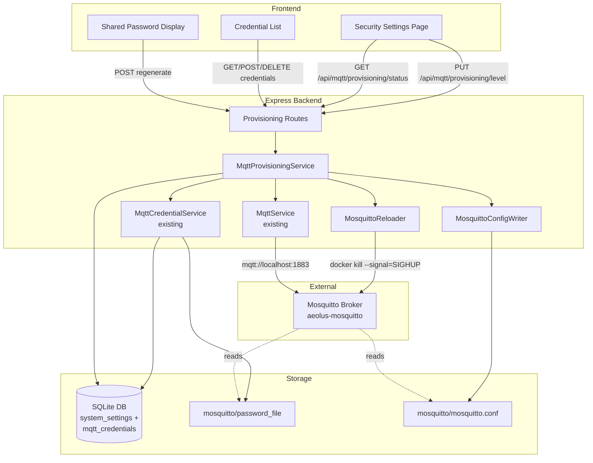
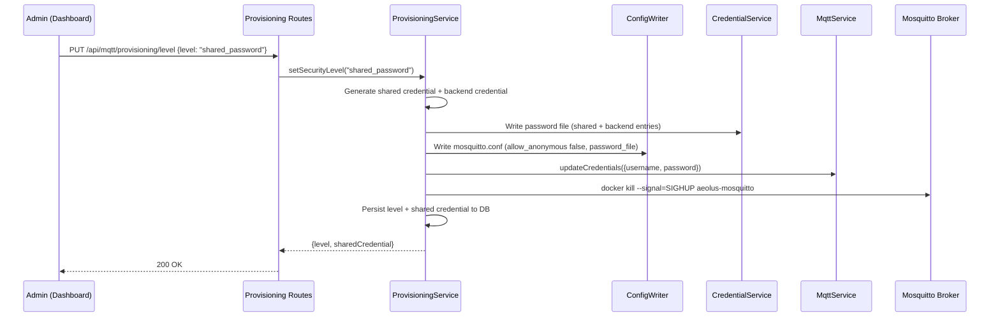

# Design Document: MQTT Device Provisioning

## Overview

This design extends the existing MQTT credential system with configurable security levels managed from the Aeolus dashboard. The admin can switch between three modes — Open (no auth), Shared Password (single credential for all devices), and Per-Device (unique credentials) — and the system handles Mosquitto configuration file management, password file generation, broker reloads, and backend MQTT reconnection transparently.

### Key Design Decisions

1. **Extend, don't replace** — The existing `mqtt-credential-service.ts` already handles per-device credential CRUD and password file generation. This feature adds a `MqttProvisioningService` layer on top that manages security levels, Mosquitto config file writes, shared password mode, and backend reconnection orchestration.
2. **Mosquitto-native hashes via `mosquitto_passwd`** — The current service uses bcrypt hashes, but Mosquitto's native password file format uses PBKDF2-SHA512. The provisioning service will generate hashes by executing `mosquitto_passwd` inside the container via `docker exec`, producing Mosquitto-compatible entries.
3. **Atomic file writes** — Both the password file and mosquitto.conf are written atomically (write to temp file, then rename) to prevent partial reads by the broker during reload.
4. **Ordered operations for security level changes** — When switching levels: (1) write password file, (2) write config file, (3) update backend MQTT client credentials, (4) signal broker reload. This ensures the backend can reconnect before the broker enforces new auth.
5. **`system_settings` table for state** — The active security level and shared credential are stored in the existing `system_settings` key-value table, keeping the schema simple.
6. **Backend credential always present** — In Shared_Password and Per_Device modes, a dedicated `aeolus-backend` credential is always included in the password file so the backend's own MQTT connection works.
7. **Retry queue for container unavailability** — If the Mosquitto container isn't running during a password file operation, the service queues the operation and retries on a timer until the container is available.

## Architecture



### Security Level Change Flow



## Components and Interfaces

### MqttProvisioningService (`src/mqtt/mqtt-provisioning-service.ts`)

Central orchestrator for security level management. Coordinates between the credential service, config writer, reloader, and MQTT service.

```typescript
type SecurityLevel = "open" | "shared_password" | "per_device";

interface SecurityStatus {
  level: SecurityLevel;
  sharedCredential?: { username: string; password: string } | null;
  backendConnected: boolean;
}

interface MqttProvisioningService {
  /** Get the current security level and associated state */
  getStatus(): SecurityStatus;

  /** Change the security level, orchestrating all side effects */
  setSecurityLevel(level: SecurityLevel): Promise<SecurityStatus>;

  /** Regenerate the shared password (only valid in shared_password mode) */
  regenerateSharedPassword(): Promise<{ username: string; password: string }>;

  /** Create a per-device credential (delegates to existing credential service) */
  createDeviceCredential(deviceName: string): Promise<MqttCredential>;

  /** Revoke a per-device credential (delegates to existing credential service) */
  revokeDeviceCredential(id: string): Promise<void>;

  /** List all device credentials (delegates to existing credential service) */
  listDeviceCredentials(): MqttCredentialListItem[];

  /** Initialize on startup: read persisted state, regenerate files, connect */
  initialize(): Promise<void>;
}
```

### MosquittoConfigWriter (`src/mqtt/mosquitto-config-writer.ts`)

Responsible for writing the Mosquitto configuration file atomically.

```typescript
interface MosquittoConfigWriterOptions {
  configPath: string; // Path to mosquitto.conf on host (via /aeolus-host mount)
}

interface MosquittoConfigWriter {
  /** Write config for open mode (allow_anonymous true, no password_file) */
  writeOpenConfig(): void;

  /** Write config for authenticated mode (allow_anonymous false, password_file directive) */
  writeAuthenticatedConfig(passwordFilePath: string): void;
}
```

### MosquittoReloader (`src/mqtt/mosquitto-reloader.ts`)

Handles signaling the Mosquitto container to reload its configuration.

```typescript
interface MosquittoReloader {
  /** Send SIGHUP to reload config. Falls back to container restart. Returns success. */
  reload(): Promise<boolean>;
}
```

### Enhanced MqttService (modifications to existing `src/mqtt/mqtt-service.ts`)

The existing MqttService gains a method to update connection credentials and reconnect:

```typescript
// Added to existing MqttService class
interface MqttCredentialUpdate {
  username?: string;
  password?: string;
}

class MqttService {
  // ... existing methods ...

  /** Update connection credentials and reconnect to the broker */
  async reconnectWithCredentials(credentials: MqttCredentialUpdate | null): Promise<void>;
}
```

### Password File Generator (enhanced in `src/auth/mqtt-credential-service.ts`)

The existing `regeneratePasswordFile()` is enhanced to use `mosquitto_passwd` for Mosquitto-native hashes instead of bcrypt:

```typescript
// Enhanced function signature — generates Mosquitto-compatible hashes
interface PasswordFileEntry {
  username: string;
  plaintextPassword: string;
}

/** Generate password file using mosquitto_passwd inside the container */
function generatePasswordFileWithMosquittoPasswd(entries: PasswordFileEntry[]): void;
```

### Provisioning Routes (`src/api/routes/provisioning.routes.ts`)

```typescript
// GET    /api/mqtt/provisioning/status       — Get current security level + state
// PUT    /api/mqtt/provisioning/level        — Change security level (admin only)
// POST   /api/mqtt/provisioning/shared/regenerate — Regenerate shared password (admin only)
// GET    /api/mqtt/provisioning/credentials  — List device credentials (admin only)
// POST   /api/mqtt/provisioning/credentials  — Create device credential (admin only)
// DELETE /api/mqtt/provisioning/credentials/:id — Revoke device credential (admin only)
```

### Provisioning Schemas (`src/api/schemas/provisioning.schemas.ts`)

```typescript
import { z } from "zod";

export const setSecurityLevelSchema = z.object({
  level: z.enum(["open", "shared_password", "per_device"]),
});

export const createDeviceCredentialSchema = z.object({
  deviceName: z.string().min(1).max(64).trim(),
});
```

### Frontend Components

#### MqttSecurityPage (`frontend/src/pages/MqttSecurityPage.tsx`)

Top-level page component for MQTT security management.

#### SecurityLevelSelector (`frontend/src/components/mqtt/SecurityLevelSelector.tsx`)

Radio-card UI for selecting between Open, Shared Password, and Per-Device modes. Shows confirmation dialogs when switching away from modes with active credentials.

#### SharedPasswordPanel (`frontend/src/components/mqtt/SharedPasswordPanel.tsx`)

Displays the shared username/password with copy-to-clipboard. Provides a regenerate button.

#### DeviceCredentialList (`frontend/src/components/mqtt/DeviceCredentialList.tsx`)

Table of device credentials with revoke actions. Includes a "Create Credential" form.

#### CredentialCreatedDialog (`frontend/src/components/mqtt/CredentialCreatedDialog.tsx`)

One-time-view modal showing the generated password with copy-to-clipboard after credential creation.

### Frontend Store (`frontend/src/store/mqtt-provisioning-store.ts`)

```typescript
interface MqttProvisioningState {
  level: SecurityLevel;
  sharedCredential: { username: string; password: string } | null;
  credentials: MqttCredentialListItem[];
  loading: boolean;

  fetchStatus(): Promise<void>;
  setLevel(level: SecurityLevel): Promise<void>;
  regenerateSharedPassword(): Promise<void>;
  createCredential(deviceName: string): Promise<MqttCredential>;
  revokeCredential(id: string): Promise<void>;
  fetchCredentials(): Promise<void>;
}
```

## Data Models

### Database Schema (additions to existing)

The feature uses the existing `mqtt_credentials` and `system_settings` tables. No new tables are needed.

```sql
-- Already exists: mqtt_credentials table
-- Used for per-device credentials AND the backend credential

-- Already exists: system_settings table
-- Used for:
--   key = 'mqtt_security_level'     → value = 'open' | 'shared_password' | 'per_device'
--   key = 'mqtt_shared_username'    → value = 'aeolus-shared'
--   key = 'mqtt_shared_password'    → value = '<plaintext password for display>'
--   key = 'mqtt_backend_password'   → value = '<plaintext password for backend connection>'
```

### System Settings Keys

| Key | Value | Description |
|-----|-------|-------------|
| `mqtt_security_level` | `open` \| `shared_password` \| `per_device` | Active security level |
| `mqtt_shared_username` | string | Username for shared password mode |
| `mqtt_shared_password` | string | Plaintext password for shared mode (displayed to admin) |
| `mqtt_backend_password` | string | Plaintext password for backend's own MQTT connection |

### Mosquitto Configuration Templates

**Open Mode:**
```
listener 1883
allow_anonymous true
persistence true
persistence_location /mosquitto/data/
log_dest stdout
```

**Authenticated Mode (Shared or Per-Device):**
```
listener 1883
allow_anonymous false
password_file /mosquitto/config/password_file
persistence true
persistence_location /mosquitto/data/
log_dest stdout
```

### Password File Format

Each line: `username:<mosquitto_passwd hash>`

Generated by running `mosquitto_passwd` inside the container:
```bash
docker exec aeolus-mosquitto mosquitto_passwd -b /dev/null <username> <password>
```

This outputs the hash to stdout which is captured and written to the file.

### API Response Shapes

**GET /api/mqtt/provisioning/status**
```json
{
  "level": "shared_password",
  "sharedCredential": {
    "username": "aeolus-shared",
    "password": "base64url-encoded-random-password"
  },
  "backendConnected": true
}
```

**POST /api/mqtt/provisioning/credentials (response)**
```json
{
  "id": "uuid",
  "deviceName": "living-room-sensor",
  "username": "mqtt-living-room-sensor",
  "password": "base64url-encoded-random-password"
}
```


## Correctness Properties

*A property is a characteristic or behavior that should hold true across all valid executions of a system — essentially, a formal statement about what the system should do. Properties serve as the bridge between human-readable specifications and machine-verifiable correctness guarantees.*

### Property 1: Security level validation

*For any* string value, the provisioning service SHALL accept it as a security level if and only if it is one of "open", "shared_password", or "per_device". All other values SHALL be rejected with a validation error.

**Validates: Requirements 1.1, 9.8**

### Property 2: Security level persistence round-trip

*For any* valid security level, after setting it via `setSecurityLevel()`, reading the `mqtt_security_level` key from the `system_settings` table SHALL return the same value, and `getStatus().level` SHALL return the same value.

**Validates: Requirements 1.2, 10.1**

### Property 3: Mosquitto config file correctness per security level

*For any* valid security level, after setting it, the generated `mosquitto.conf` file SHALL contain `allow_anonymous true` and no `password_file` directive if the level is "open", OR `allow_anonymous false` and a `password_file` directive pointing to the password file if the level is "shared_password" or "per_device".

**Validates: Requirements 1.5, 2.1, 2.2, 3.3, 4.1**

### Property 4: Password generation meets minimum entropy

*For any* credential generation (shared password activation, shared password regeneration, or device credential creation), the generated password SHALL be at least 32 characters long (24 bytes encoded as base64url) and SHALL consist only of base64url-safe characters.

**Validates: Requirements 3.1, 4.2**

### Property 5: Password file entry invariant

*For any* sequence of credential create and delete operations, the password file SHALL contain exactly one `username:hash` line per credential record in the database — no duplicates, no missing entries, no extra entries (except the backend credential and shared credential when applicable).

**Validates: Requirements 4.3, 5.2, 5.5, 10.2**

### Property 6: Backend credential presence in authenticated modes

*For any* security level that is not "open" (i.e., "shared_password" or "per_device"), the password file SHALL contain an entry for the backend credential username (`aeolus-backend`). When the level is "open", the password file MAY be empty or absent.

**Validates: Requirements 3.2, 4.8, 6.1**

### Property 7: Credential secrecy in list responses

*For any* set of MQTT credentials, the list endpoint response SHALL include `id`, `deviceName`, `username`, and `createdAt` for every credential, and SHALL NOT include `password` or `passwordHash` fields. The creation response SHALL include the plaintext `password` field exactly once.

**Validates: Requirements 4.4, 4.7**

### Property 8: Credential revocation removes from database and password file

*For any* credential that has been created and then revoked, the credential SHALL NOT exist in the `mqtt_credentials` table, and the password file SHALL NOT contain a line starting with that credential's username.

**Validates: Requirements 4.5**

### Property 9: Shared password regeneration produces a distinct value

*For any* regeneration request in shared_password mode, the new password SHALL differ from the previous password, and the password file SHALL be updated to reflect the new credential hash.

**Validates: Requirements 3.5**

### Property 10: Mode-mismatch operations return HTTP 409

*For any* mode-specific endpoint (credential creation in non-per_device mode, shared password regeneration in non-shared_password mode), calling the endpoint SHALL return HTTP 409 Conflict with a descriptive error message.

**Validates: Requirements 9.7**

### Property 11: Status endpoint reflects current state

*For any* security level that has been set, the GET status endpoint SHALL return that level. If the level is "shared_password", the response SHALL include the shared credential (username and password). If the level is "open" or "per_device", the shared credential SHALL be null.

**Validates: Requirements 1.4, 10.3**

### Property 12: Startup state reconstruction

*For any* persisted security level in the database, after calling `initialize()`, the Mosquitto config file and password file SHALL match the expected state for that level, and the backend credential SHALL exist in the password file if the level is not "open".

**Validates: Requirements 10.4, 10.5**

### Property 13: Username derivation is deterministic and sanitized

*For any* device name string, the derived username SHALL be deterministic (same input always produces same output), SHALL be prefixed with "mqtt-", SHALL contain only lowercase alphanumeric characters and hyphens, and SHALL not start or end with a hyphen.

**Validates: Requirements 4.2**

## Error Handling

### HTTP Error Responses

All provisioning errors follow the existing `{ error: string, details?: unknown }` response format:

| Scenario | Status | Error Message |
|----------|--------|---------------|
| Invalid security level value | 400 | "Validation failed" + Zod details |
| Invalid device name (empty/too long) | 400 | "Validation failed" + Zod details |
| Credential creation while not in per_device mode | 409 | "Operation requires per_device security level" |
| Shared password regeneration while not in shared_password mode | 409 | "Operation requires shared_password security level" |
| Duplicate device credential username | 409 | "MQTT credential with username \"...\" already exists" |
| Credential not found for deletion | 404 | "MQTT credential not found" |
| Non-admin user accessing provisioning endpoints | 403 | "Forbidden" |
| Unauthenticated request | 401 | "Unauthorized" |
| Mosquitto broker reload failed (SIGHUP + restart both failed) | 502 | "Failed to reload Mosquitto broker" |
| Mosquitto container not available for password hashing | 503 | "Mosquitto container unavailable, operation queued for retry" |

### Retry Behavior

When the Mosquitto container is unavailable during password file generation:
1. Log a warning with the operation details
2. Queue the operation (regenerate password file) for retry
3. Retry every 10 seconds, up to 30 attempts (5 minutes)
4. If all retries fail, log an error — the operation will be retried on next startup via `initialize()`

### Broker Reload Fallback

```
1. Send SIGHUP via: docker kill --signal=SIGHUP aeolus-mosquitto
2. If SIGHUP fails → attempt: docker restart aeolus-mosquitto
3. If restart fails → log error, return 502 to caller
```

### Security Level Change Error Recovery

If any step in the security level change fails:
- File writes are atomic (temp + rename), so partial writes don't corrupt state
- The database update is the last step — if it fails, the files are ahead of the DB, and the next `initialize()` call will reconcile
- If the MQTT client fails to reconnect, the existing reconnection loop (exponential backoff) handles recovery

## Testing Strategy

### Property-Based Tests (fast-check, minimum 100 iterations)

Property-based testing is appropriate for this feature because the provisioning logic involves pure transformations (config generation, password file generation, username sanitization) and invariants (file contents match database state) that benefit from randomized input testing.

**Library:** `fast-check` (already in devDependencies) with `@fast-check/vitest`

**Test files:**
- `src/mqtt/mqtt-provisioning-service.property.test.ts` — Properties 1, 2, 3, 4, 5, 6, 9, 11, 12
- `src/mqtt/mosquitto-config-writer.property.test.ts` — Property 3
- `src/auth/mqtt-credential-service.property.test.ts` — Properties 5, 7, 8, 13
- `src/api/routes/provisioning.routes.property.test.ts` — Properties 10, 11

Each property test must:
- Run minimum 100 iterations
- Reference its design property with a tag comment: `// Feature: mqtt-device-provisioning, Property N: <title>`
- Use generators for device names, security levels, credential sets, and password strings

**Key generators needed:**
- `arbitraryDeviceName`: strings of 1-64 chars with various unicode, spaces, special chars
- `arbitrarySecurityLevel`: one of "open", "shared_password", "per_device"
- `arbitraryInvalidSecurityLevel`: strings that are NOT one of the three valid values
- `arbitraryCredentialSet`: arrays of {deviceName, username} pairs

### Unit Tests (example-based)

**Test files:**
- `src/mqtt/mqtt-provisioning-service.test.ts` — Initialization, level changes, shared password flow
- `src/mqtt/mosquitto-config-writer.test.ts` — Config file templates, atomic write behavior
- `src/mqtt/mosquitto-reloader.test.ts` — SIGHUP, restart fallback, both-fail scenario
- `src/api/routes/provisioning.routes.test.ts` — API integration tests with supertest

Focus areas:
- First startup defaults to open mode
- Level change orchestration order (files → credentials → reload)
- Retry queue when container is unavailable
- MQTT client reconnection after level change
- Admin-only access enforcement
- Confirmation warnings in frontend (component tests)

### Integration Tests

- Full level change flow: open → shared_password → per_device → open
- Credential lifecycle: create → list → revoke → verify removal
- Startup reconstruction: set level, restart service, verify files match
- Backend MQTT connection survives level changes (with mocked broker)

### Test Configuration

```typescript
// Property tests use fast-check with minimum 100 iterations
// Tag format: Feature: mqtt-device-provisioning, Property {N}: {title}
// Mock docker exec for mosquitto_passwd calls in unit/property tests
// Mock file system for atomic write verification
```

### Dependencies

No new runtime dependencies needed. The feature uses:
- `crypto` (Node.js built-in) — random password generation
- `child_process` (Node.js built-in) — docker exec for mosquitto_passwd and SIGHUP
- `fs` (Node.js built-in) — atomic file writes
- `zod` (existing) — request validation
- Existing `mqtt-credential-service.ts` — credential CRUD
- Existing `mqtt-service.ts` — broker connection (extended with `reconnectWithCredentials`)
