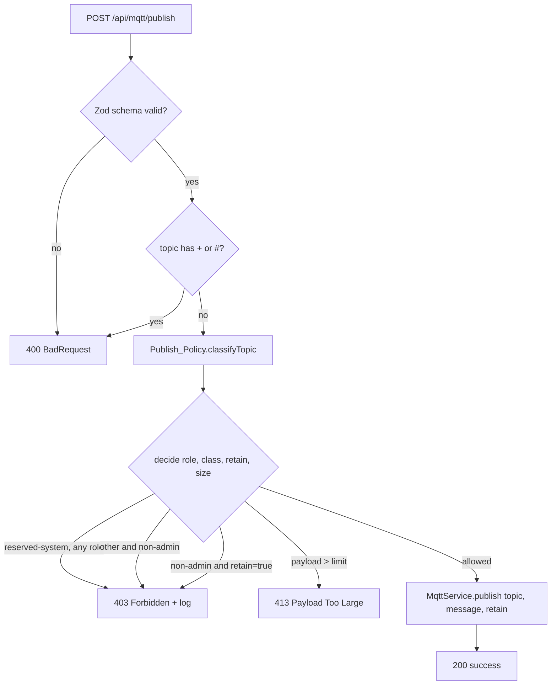
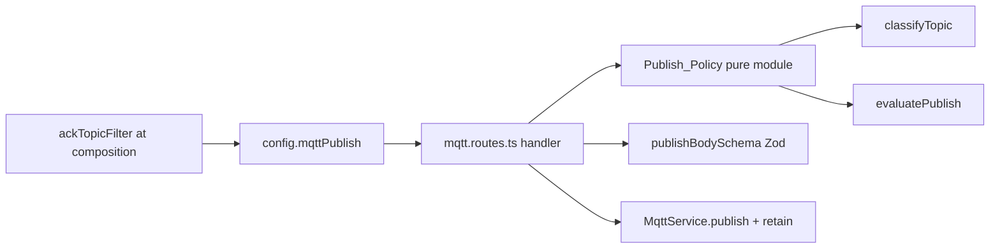

# Design Document

## Overview

This feature confines the raw MQTT publish endpoint, `POST /api/mqtt/publish`
(`createMqttRoutes` in `src/api/routes/mqtt.routes.ts`). Today the handler is
gated only by `requireTabPermission("interact")`, hand-validates `{ topic,
payload }`, and calls `MqttService.publish(topic, message)` with no options —
so any `interact` user can publish any topic, and anyone can publish to
`aeolus/acks/#` and forge a device acknowledgement (the ack ingestion path,
`MqttService.handleAckMessage` → `AckRouter` → `PendingCommandTracker.route`,
trusts the message's `correlationId` + `status`).

The fix partitions the topic space and enforces it **at the HTTP boundary**, so
internal publishers (`CommandService`, ack responders, connectors) that call
`MqttService.publish` directly are unaffected:

- A pure **Publish_Policy** classifies the topic into `reserved-system`,
  `user-namespace`, or `other` using segment-boundary prefix matching, then
  makes an allow/deny decision from `(role, class, retain, payloadBytes)`.
- **Reserved-system** topics (starting with the acknowledgement namespace) are
  denied for **every** role, closing the forged-ack surface.
- **Non-admins** may publish only in the **user namespace** (`aeolus/pub/`).
- **Admins** may publish `user-namespace` or `other`, never `reserved-system`.
- Guardrails: `retain=true` is rejected for non-admins; a configurable payload
  size cap applies to all.

The endpoint gains a Zod schema and runs validation (400) before authorization
(403) before the size guard (413). The reserved-system prefix is **derived from
the same ack topic filter the ingestion path consumes** so the denied namespace
and the forged-ack surface cannot drift apart. Configuration is centralized in
`src/config.ts` with a fail-closed invariant: if the user namespace is
mis-configured to fall inside a reserved prefix, all non-admin publishes are
denied.

### Goals

- Publish authorization derives solely from the server-side topic and config —
  never from a caller-supplied role, tab, or namespace hint.
- The acknowledgement namespace is unpublishable via the endpoint for all roles.
- Non-admin traffic is bounded to `aeolus/pub/`, keeping raw publish useful for
  automations that listen there.
- Internal (non-HTTP) publishers are behaviorally unchanged.

### Non-goals (per requirements)

- Broker-level Mosquitto ACLs (the `aeolus/pub/` prefix just makes them easy later).
- WebSocket fail-closed visibility (separate spec).
- Routing raw device commands through the command lifecycle, or removing the endpoint.
- Denylisting device command topics (`.../set`) — there is no central command
  prefix today; non-admins are already blocked from them as `other`, and admin
  diagnostics remain allowed. The reserved denylist is prefix-based and
  extensible if a command control-plane prefix is later introduced.

## Architecture



The policy runs after `authenticate` (which populates `req.user`) and replaces
the `requireTabPermission("interact")` guard on this route. `req.user.role`
(`admin` | `user`) is the only principal input; no tab id is read.



## Components and Interfaces

### Publish_Policy (new pure module)

New module `src/mqtt/publish-policy.ts`. Pure and dependency-free so it is
directly unit- and property-testable.

```typescript
export type TopicClass = "reserved-system" | "user-namespace" | "other";

export interface PublishPolicyConfig {
  /** User-namespace prefix, e.g. "aeolus/pub/". */
  userNamespacePrefix: string;
  /** Reserved system prefixes denied for all roles, e.g. ["aeolus/acks/"]. */
  reservedSystemPrefixes: string[];
  /** Max serialized payload bytes. */
  maxPayloadBytes: number;
}

export type PublishDecision =
  | { allow: true }
  | { allow: false; status: 400 | 403 | 413; reason: string };

/** Segment-boundary prefix match: "aeolus/pub" matches "aeolus/pub" and
 *  "aeolus/pub/x" but NOT "aeolus/public/x". */
export function segmentBoundaryMatch(topic: string, prefix: string): boolean;

/** Classify a topic; reserved-system takes precedence over user-namespace. */
export function classifyTopic(topic: string, config: PublishPolicyConfig): TopicClass;

/** True iff the user namespace does not fall within any reserved prefix. */
export function isPolicyConfigValid(config: PublishPolicyConfig): boolean;

/**
 * Full allow/deny decision. Assumes the topic already passed schema validation
 * (non-empty string). Encapsulates: wildcard rejection (400), reserved-system
 * denial (403, all roles), non-admin confinement (403), retain guardrail (403,
 * non-admin), payload size (413), and the fail-closed config invariant.
 */
export function evaluatePublish(
  input: { role: "admin" | "user"; topic: string; retain: boolean; payloadBytes: number },
  config: PublishPolicyConfig,
): PublishDecision;
```

Decision order inside `evaluatePublish` (matches the requirements' status
precedence): wildcard → 400; invalid config → treat non-admin as denied (403);
`reserved-system` → 403 (any role); non-admin & `other` → 403; non-admin &
`retain` → 403; `payloadBytes > maxPayloadBytes` → 413; else allow. Authorization
(403) is decided before size (413) so an unauthorized caller cannot probe the
size limit.

`segmentBoundaryMatch(topic, prefix)`: normalize the prefix to end without a
trailing `/`, then return `topic === base || topic.startsWith(base + "/")`. This
prevents `aeolus/public/...` from matching an `aeolus/pub` prefix.

### Publish request schema (new)

New `src/api/schemas/mqtt.schemas.ts` (mirrors the existing `schemas/` pattern):

```typescript
export const publishBodySchema = z.object({
  topic: z.string().trim().min(1),
  payload: z.unknown().optional(),
  retain: z.boolean().optional(),
});
```

Applied with the existing `validate({ body: publishBodySchema })` middleware,
which yields a 400 with a consistent JSON error for malformed input (R7.1,
R7.2, R7.4). Wildcard rejection (R7.3) is enforced in `evaluatePublish`
(returns status 400) rather than the schema, keeping the topic-shape rules in
one place; the route maps a 400 decision to `BadRequestError`.

### Route wiring (`src/api/routes/mqtt.routes.ts`)

`createMqttRoutes` gains a `PublishPolicyConfig` parameter (built at the
composition root). The handler:

1. Runs `validate({ body: publishBodySchema })` (400 on failure).
2. Serializes the payload exactly as today (string verbatim; else
   `JSON.stringify(payload ?? "")`) and computes `payloadBytes =
   Buffer.byteLength(message)`.
3. Calls `evaluatePublish({ role: req.user.role, topic, retain: retain ?? false,
   payloadBytes }, policyConfig)`.
4. On `allow: false`, throws the mapped typed error (`BadRequestError` 400,
   `ForbiddenError` 403, or a new `PayloadTooLargeError` 413) and logs
   `{ userId, role, topic, reason }` at `warn` for any denial (R2.4, R3.4).
5. On `allow: true`, calls `mqttService.publish(topic, message, { retain })`.

The `requireTabPermission("interact")` guard is removed from this route;
`authenticate` still runs globally, so an unauthenticated request is 401 (R9.3).

### MqttService.publish — retain option

`publish(topic, payload, options?)` gains an optional `retain?: boolean` in its
options object and passes it to the underlying client:

```typescript
this.client.publish(topic, payload, { retain: options?.retain ?? false, properties }, cb);
```

All existing callers omit `retain`, so behavior is unchanged for them (R9.1).

### Error type (new)

Add `PayloadTooLargeError` (HTTP 413) to `src/api/middleware/error-handler.ts`,
following the existing typed-error pattern (`BadRequestError`, `ForbiddenError`,
`NotFoundError`), so the error handler renders a consistent JSON body (R7.5).

### Configuration (`src/config.ts`)

Add an `mqttPublish` block to `Config`:

```typescript
mqttPublish: {
  userNamespacePrefix: string;   // MQTT_PUBLISH_USER_NAMESPACE, default "aeolus/pub/"
  maxPayloadBytes: number;       // MQTT_PUBLISH_MAX_BYTES, default 262144 (256 KiB)
};
```

The **reserved system prefixes are not a standalone config value**; they are
derived at the composition root from the same ack topic filter passed to
`MqttService` (`ackTopicFilter`, default `aeolus/acks/#`) by stripping the
trailing `/#` → `aeolus/acks/` (R8.2). The composition root assembles the full
`PublishPolicyConfig` (`{ userNamespacePrefix, reservedSystemPrefixes: [ackPrefix],
maxPayloadBytes }`) and passes it to `createMqttRoutes`. This guarantees the
denied namespace and the ingested ack namespace are the same string source and
cannot drift.

## Data Models

There is no persistent state. The only new data is the in-memory
`PublishPolicyConfig`, assembled once at startup:

```
PublishPolicyConfig = {
  userNamespacePrefix:  config.mqttPublish.userNamespacePrefix,   // "aeolus/pub/"
  reservedSystemPrefixes: [ stripWildcard(ackTopicFilter) ],      // ["aeolus/acks/"]
  maxPayloadBytes:      config.mqttPublish.maxPayloadBytes,        // 262144
}
```

Classification relation (pure):

```
class(topic) =
  reserved-system   if ∃ p ∈ reservedSystemPrefixes . segmentBoundaryMatch(topic, p)
  user-namespace    else if segmentBoundaryMatch(topic, userNamespacePrefix)
  other             otherwise
```

## Correctness Properties

*A property is a characteristic that should hold across all valid executions.*

### Property 1: Classification precedence and determinism
For any topic and config, `classifyTopic` returns exactly one class; a topic
matching a reserved prefix is `reserved-system` even if it also matches the user
prefix; classification depends only on the topic and configured prefixes.
**Validates: Requirements 1.1, 1.2, 1.3, 1.4, 1.6**

### Property 2: Segment-boundary matching
For any prefix `p` and topic `t`, `segmentBoundaryMatch(t, p)` is true iff `t`
equals `p` (modulo a trailing slash) or `t` begins with `p` at a topic-level
boundary; it is never true for a topic that only shares a partial final segment
(e.g. `aeolus/public/x` vs prefix `aeolus/pub`).
**Validates: Requirements 1.5**

### Property 3: Reserved-system is denied for every role
For any role, a `reserved-system` topic yields a 403 deny decision.
**Validates: Requirements 2.1, 2.2, 2.3**

### Property 4: Non-admin confinement
For a non-admin and any allowed guardrail state, `evaluatePublish` allows iff the
class is `user-namespace`; `other` and `reserved-system` both yield 403.
**Validates: Requirements 3.1, 3.2, 3.3**

### Property 5: Admin latitude
For an admin, `evaluatePublish` allows `user-namespace` and `other` and denies
only `reserved-system`.
**Validates: Requirements 4.1, 4.2**

### Property 6: Retain guardrail
For a non-admin, `retain=true` on an otherwise-allowed topic yields 403; for an
admin, retain does not by itself cause denial.
**Validates: Requirements 5.2, 5.3**

### Property 7: Payload size guardrail
For any allowed (role, topic) with `payloadBytes > maxPayloadBytes`, the decision
is 413; within the limit it is allowed.
**Validates: Requirements 6.1, 6.2**

### Property 8: Wildcard rejection
For any topic containing `+` or `#`, the decision is 400 regardless of role.
**Validates: Requirements 7.3**

### Property 9: Fail-closed on invalid config
For any config where the user namespace falls within a reserved prefix, every
non-admin publish is denied.
**Validates: Requirements 8.3**

### Property 10: Authorization is independent of request-supplied hints
For any decision, the outcome depends only on `role`, `topic`, `retain`, and
`payloadBytes`; injecting extra fields (tabId, role hints) into the topic/body
never changes it.
**Validates: Requirements 1.6**

## Error Handling

- Malformed body / wildcard topic → `BadRequestError` (400).
- Reserved-system, non-admin `other`, non-admin `retain` → `ForbiddenError` (403).
- Oversized payload → `PayloadTooLargeError` (413).
- Unauthenticated → 401 via `authenticate` (unchanged).
- Every denial logs `{ userId, role, topic, reason }` at `warn`; payloads are not
  logged. The publish path is never reached on a denial.
- `MqttService.publish` throwing (client not connected) surfaces as today.

## Testing Strategy

### Property-based tests (fast-check, ≥100 runs)
`src/mqtt/publish-policy.property.test.ts` drives the pure policy over generated
topics (mixing user/ack/other prefixes, partial-segment near-misses, wildcards),
roles, retain flags, payload sizes, and configs (including invalid ones). Each
test is tagged `// Feature: mqtt-publish-confinement, Property N: <text>` and
covers Properties 1–10. `@fast-check/vitest` is the standard here.

### Unit tests
`src/mqtt/publish-policy.test.ts` — concrete examples for `segmentBoundaryMatch`
(`aeolus/pub` vs `aeolus/public`), classification precedence, and each decision
branch. `MqttService` retain plumbing test asserting `client.publish` receives
`retain: true` only when requested.

### Route integration tests
Extend `src/api/routes/mqtt.routes.test.ts` (mock `MqttService`, set `req.user`
role via a stub `authenticate`/injected middleware): non-admin allowed in
`aeolus/pub/#`; non-admin 403 on `other` and on `aeolus/acks/#`; admin 403 on
`aeolus/acks/#` but allowed on `home/...`; non-admin `retain=true` → 403; admin
`retain=true` → publishes with retain; oversized payload → 413; wildcard → 400;
missing topic → 400. Assert the mock publish is not called on any denial.

### Test data cleanup
Pure/policy tests need no fixtures; route tests use the existing in-memory mock
service and Express app harness.
