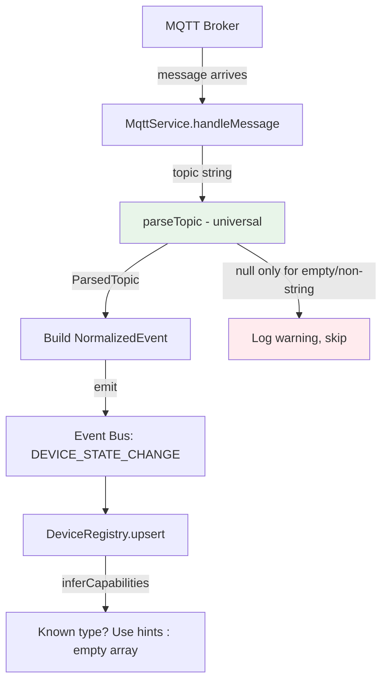

# Design Document: MQTT Topic Parser Overhaul

## Overview

This design replaces the current restrictive `parseTopic()` implementation — which uses a hardcoded `TYPE_MAP` and returns `null` for unrecognized topic prefixes — with a single universal parser that always succeeds for any valid MQTT topic. The refactor touches the parser itself, the `DeviceType` type definition, the MQTT service's message handler, the device registry's capability inference, and project documentation.

The guiding principle is simplicity: one function, no registry, no fallback layers, no priority system. Known device types (sensor, switch, light, climate, plug) become a heuristic hint for capability inference — not a gate that rejects messages.

### Key Design Decisions

1. **One parser, always succeeds** — `parseTopic()` returns `ParsedTopic | null`, where `null` only means "invalid input" (empty string, non-string). Any syntactically valid topic with ≥1 segment produces a result.

2. **DeviceType becomes `string`** — The fixed union `"light" | "sensor" | "switch" | "climate" | "plug"` is replaced with `string`. This is a breaking type change that ripples through `Device`, `NormalizedEvent`, and `ConnectorMetadata.supportedDeviceTypes`.

3. **Known types are a hint** — A `KNOWN_TYPES` set is retained for capability inference in the device registry and for name derivation logic (known-type topics derive names from segments after the type; unknown-type topics use all segments). It never gates acceptance.

4. **Pretty-printer added** — A `prettyPrintTopic()` function reconstructs a canonical topic string from a `ParsedTopic`, enabling round-trip verification.

5. **MQTT service drops the null guard** — The current `if (!parsed) return` that silently drops messages is replaced with a guard that only fires for truly invalid inputs (which shouldn't occur in practice since MQTT topics are always non-empty strings).

## Architecture

The change is localized to the MQTT ingestion pipeline. No changes to the event bus, automation engine, WebSocket layer, or REST API are needed.



## Components and Interfaces

### ParsedTopic Interface

```typescript
/** Result of parsing an MQTT topic */
export interface ParsedTopic {
  /** Deterministic ID: all topic segments joined with hyphens */
  deviceId: string;
  /** Device type: first segment (verbatim) */
  deviceType: string;
  /** Human-readable name derived from topic segments */
  name: string;
}
```

### parseTopic Function

```typescript
/**
 * Parse any valid MQTT topic into structured device metadata.
 * Returns null ONLY for invalid inputs (empty string, non-string).
 * Never rejects a topic based on its content.
 */
export function parseTopic(topic: string): ParsedTopic | null;
```

**Behavior:**
- Input validation: returns `null` for empty strings and non-string values
- Device ID: all segments joined with hyphens, casing preserved
- Device type: first segment, lowercased
- Name derivation:
  - If first segment is in `KNOWN_TYPES` and topic has ≥2 segments → title-case remaining segments, join with spaces
  - If first segment is NOT in `KNOWN_TYPES` and topic has ≥2 segments → title-case ALL segments, join with spaces
  - If topic has exactly 1 segment → title-case that segment

### KNOWN_TYPES Set

```typescript
/**
 * Recognized device type strings used as a heuristic hint for:
 * 1. Name derivation (known types strip the type from the display name)
 * 2. Capability inference in the device registry
 * 
 * NOT used as a gate — topics with unknown types are still fully parsed.
 */
export const KNOWN_TYPES: ReadonlySet<string> = new Set([
  "sensor", "switch", "light", "climate", "plug",
  "valve", "pump", "motion", "fan", "lock", "cover",
]);
```

### prettyPrintTopic Function

```typescript
/**
 * Reconstruct a canonical MQTT topic string from a ParsedTopic.
 * Uses the deviceId (hyphen-separated) split back into segments joined with "/".
 */
export function prettyPrintTopic(parsed: ParsedTopic): string;
```

**Implementation:** Split `parsed.deviceId` on hyphens, join with `/`. This preserves segment order and casing.

### Updated DeviceType

```typescript
// src/core/types.ts
/** Device type — open string, not restricted to a fixed set */
export type DeviceType = string;
```

### Updated inferCapabilities

```typescript
// src/core/device-registry.ts
private inferCapabilities(type: string): string[] {
  switch (type) {
    case "light": return ["on/off", "brightness"];
    case "switch": return ["on/off"];
    case "sensor": return ["temperature"];
    case "climate": return ["temperature", "humidity"];
    case "plug": return ["on/off", "energy-monitoring"];
    case "valve": return ["on/off"];
    case "pump": return ["on/off"];
    case "fan": return ["on/off", "speed"];
    case "lock": return ["lock/unlock"];
    case "motion": return ["motion-detection"];
    default: return [];
  }
}
```

The `default: return []` case means unknown device types get an empty capabilities array — they're still accepted and stored, just without inferred capabilities until the user configures them.

### Updated MqttService.handleMessage

```typescript
private handleMessage(topic: string, payload: Buffer): void {
  const raw = payload.toString();
  this.eventBus.emit(MQTT_RAW_MESSAGE, { topic, payload: raw, timestamp: Date.now() });

  const parsed = parseTopic(topic);
  if (!parsed) {
    // Only fires for truly invalid inputs (empty string, non-string)
    // Should never happen in practice — MQTT topics are always non-empty
    logger.warn({ topic }, "Received message on unparseable topic");
    return;
  }

  // ... rest unchanged — build state, emit DEVICE_STATE_CHANGE
}
```

The logic is identical but the semantic changes: `parseTopic` now only returns `null` for malformed inputs, not for "unknown" topic prefixes.

## Data Models

### Device (updated type field)

```typescript
export interface Device {
  id: string;
  name: string;
  type: string;          // was: DeviceType (fixed union)
  capabilities: string[];
  state: Record<string, unknown>;
  integration: string;
  lastSeen: number;
}
```

### NormalizedEvent (updated deviceType field)

```typescript
export interface NormalizedEvent {
  deviceId: string;
  deviceType: string;    // was: DeviceType (fixed union)
  state: Record<string, unknown>;
  topic: string;
  timestamp: number;
  integration?: string;
}
```

### ConnectorMetadata (updated supportedDeviceTypes)

```typescript
export interface ConnectorMetadata {
  // ...
  supportedDeviceTypes: string[];  // was: DeviceType[]
  // ...
}
```

### Database Schema

No schema changes needed. The `type` column in the `devices` table is already `TEXT` — it just previously only contained values from the fixed union. Now it can contain any string.

## Correctness Properties

*A property is a characteristic or behavior that should hold true across all valid executions of a system — essentially, a formal statement about what the system should do. Properties serve as the bridge between human-readable specifications and machine-verifiable correctness guarantees.*

### Property 1: Universal Acceptance

*For any* non-empty string containing at least one segment (no leading/trailing "/" producing empty segments aside), `parseTopic` SHALL return a non-null `ParsedTopic` with all three fields (`deviceId`, `deviceType`, `name`) populated as non-empty strings.

**Validates: Requirements 1.1, 1.2**

### Property 2: Device Type Equals First Segment (Unknown Types)

*For any* topic string whose first segment (lowercased) is NOT in the `KNOWN_TYPES` set, the returned `deviceType` SHALL equal the first segment lowercased.

**Validates: Requirements 1.3**

### Property 3: Device Type Equals First Segment (Known Types)

*For any* topic string whose first segment (lowercased) IS in the `KNOWN_TYPES` set, the returned `deviceType` SHALL equal that known type string.

**Validates: Requirements 1.4**

### Property 4: Deterministic Device ID from Segments

*For any* valid topic string, the returned `deviceId` SHALL equal all topic segments joined with hyphens, and parsing the same topic string multiple times SHALL always produce the same `deviceId`.

**Validates: Requirements 2.1, 2.2, 2.3, 2.4**

### Property 5: Name Derivation — Known Type Multi-Segment

*For any* topic with ≥2 segments where the first segment is in `KNOWN_TYPES`, the returned `name` SHALL equal the remaining segments title-cased and joined with spaces.

**Validates: Requirements 3.1**

### Property 6: Name Derivation — Unknown Type Multi-Segment

*For any* topic with ≥2 segments where the first segment is NOT in `KNOWN_TYPES`, the returned `name` SHALL equal ALL segments title-cased and joined with spaces.

**Validates: Requirements 3.2**

### Property 7: Name Derivation — Single Segment

*For any* topic with exactly one segment, the returned `name` SHALL equal that segment title-cased.

**Validates: Requirements 3.3**

### Property 8: Registry Accepts Any Device Type

*For any* arbitrary non-empty string used as a `deviceType` in a `NormalizedEvent`, the device registry SHALL store the device and the retrieved device's `type` field SHALL equal the original string exactly.

**Validates: Requirements 4.2, 4.3**

### Property 9: Parse–Print Round Trip

*For any* valid MQTT topic string, `parseTopic(prettyPrintTopic(parseTopic(topic)))` SHALL produce a `ParsedTopic` deeply equal to `parseTopic(topic)`.

**Validates: Requirements 5.1, 5.2, 5.3**

## Error Handling

| Scenario | Behavior |
|----------|----------|
| `parseTopic("")` | Returns `null` |
| `parseTopic(null)` / `parseTopic(undefined)` | Returns `null` (type guard) |
| `parseTopic("///")` (all empty segments) | After filtering empty segments, if no segments remain → returns `null` |
| Topic with special characters (`sensor/kitchen-2/temp+humidity`) | Parsed normally — segments are split on `/` only |
| Very long topic (>256 segments) | Parsed normally — no artificial limits |
| MQTT service receives message where `parseTopic` returns `null` | Logs a warning, skips event emission (same as current behavior) |
| Device registry receives unknown device type | Stores with empty capabilities array, no error |

## Testing Strategy

### Property-Based Tests (fast-check + @fast-check/vitest)

Each correctness property maps to a single property-based test with ≥100 iterations. The project already uses `@fast-check/vitest` and `fast-check` — no new dependencies needed.

**Test file:** `src/mqtt/topic-parser.property.test.ts` (rewritten)

Each test is tagged with:
```
Feature: mqtt-topic-overhaul, Property {N}: {title}
```

**Generators needed:**
- `validTopicArb`: generates valid MQTT topic strings (1–10 segments, each segment is a non-empty string of `[a-zA-Z0-9_-]` characters)
- `knownTypeArb`: picks from `KNOWN_TYPES` set
- `unknownTypeArb`: generates segment strings NOT in `KNOWN_TYPES`
- `multiSegmentTopicArb`: generates topics with ≥2 segments
- `singleSegmentTopicArb`: generates single-segment topics
- `deviceTypeStringArb`: generates arbitrary non-empty strings for device type testing

### Unit Tests (example-based)

**Test file:** `src/mqtt/topic-parser.test.ts` (rewritten)

- Backward compatibility: existing known-type topics (`sensor/kitchen/temp`, `switch/bedroom`, `light/living-room`) still parse correctly
- New unknown-type topics (`valve/irrigation/command`, `pump/well/status`, `thermostat/living`) now parse successfully instead of returning null
- Single-segment topics (`heartbeat`, `status`) parse successfully
- Edge cases: empty string → null, non-string → null, all-empty-segments → null
- Pretty-printer: reconstructs expected topic strings

### Integration Tests

- MQTT service emits `DEVICE_STATE_CHANGE` for previously-rejected topics (e.g., `thermostat/living`)
- Device registry stores devices with novel type strings
- No messages silently dropped (except truly invalid inputs)

### Configuration

- Minimum 100 iterations per property test
- Tests run via `vitest run` (already configured)
- Property tests use `test.prop()` from `@fast-check/vitest`
