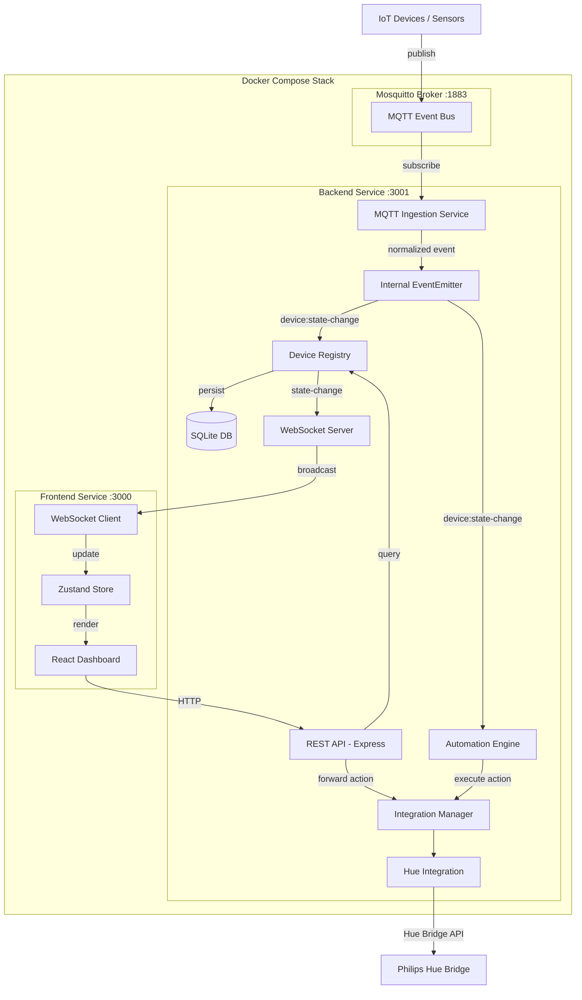
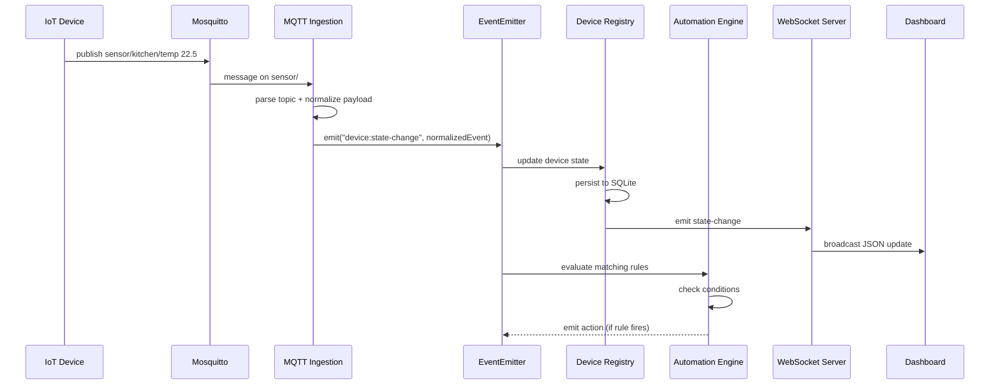

# Design Document: Aeolus MVP Core Platform

## Overview

The Aeolus MVP Core Platform is a local-first, developer-centric IoT automation system. It ingests MQTT messages from IoT devices, maintains a persistent device registry, evaluates code-driven automation rules, and exposes device state through a REST API, WebSocket real-time updates, and a React dashboard.

The system runs as a Docker Compose stack with three services: a Mosquitto MQTT broker (central event bus), an Express.js + TypeScript backend (core engine), and a React + Vite frontend (dashboard). All data stays local — no cloud dependency.

### Key Design Decisions

- **Express.js over Fastify**: Aligns with lol-main reference patterns; broader middleware ecosystem for WebSocket integration via `ws`.
- **SQLite (better-sqlite3) over JSON file**: Provides atomic writes, concurrent read safety, and query capability while remaining zero-config and file-based — ideal for Raspberry Pi deployment.
- **Zustand over Redux**: Lightweight, minimal boilerplate state management matching lol-main patterns.
- **EventEmitter-based internal bus**: Simple pub/sub for connecting MQTT ingestion → Device Registry → Automation Engine → WebSocket. No need for a separate internal message queue at MVP scale.
- **Synchronous better-sqlite3**: Avoids callback complexity; SQLite operations are fast enough for local IoT workloads.

## Architecture

### System Architecture Diagram



### Event Flow



## Components and Interfaces

### Backend Components

#### 1. MQTT Ingestion Service (`src/mqtt/mqtt-service.ts`)

Connects to Mosquitto, subscribes to configurable topic patterns, parses topics, normalizes payloads, and emits internal events.

```typescript
interface MqttServiceConfig {
  brokerUrl: string;
  topics: string[];          // e.g. ["sensor/#", "switch/#", "motion/#"]
  maxRetries: number;        // default 5
  baseRetryDelayMs: number;  // default 1000
}

class MqttService {
  constructor(config: MqttServiceConfig, eventBus: EventEmitter);
  connect(): Promise<void>;
  disconnect(): Promise<void>;
  // Internal: parseTopic(topic: string) → { deviceType, deviceId }
  // Internal: normalizePayload(topic: string, payload: Buffer) → NormalizedEvent
}
```

Topic parsing convention: `{type}/{location}/{metric}` or `{type}/{id}` → extracts device type and constructs a deterministic device ID.

#### 2. Device Registry (`src/core/device-registry.ts`)

In-memory cache backed by SQLite. Handles device CRUD, state updates, and emits change events.

```typescript
class DeviceRegistry {
  constructor(db: Database, eventBus: EventEmitter);
  getAll(): Device[];
  getById(id: string): Device | undefined;
  upsert(event: NormalizedEvent): Device;
  remove(id: string): boolean;
  loadFromDb(): void;   // Called on startup
  // Emits "ws:state-change" on eventBus after each upsert
}
```

#### 3. Automation Engine (`src/automations/automation-engine.ts`)

Evaluates rules against incoming events. Provides the `when()` DSL.

```typescript
// DSL API
function when(topic: string): RuleBuilder;

interface RuleBuilder {
  if(condition: (ctx: EventContext) => boolean): RuleBuilder;
  then(action: (ctx: EventContext) => void | Promise<void>): Rule;
}

interface Rule {
  id: string;
  topic: string;
  condition?: (ctx: EventContext) => boolean;
  action: (ctx: EventContext) => void | Promise<void>;
}

interface EventContext {
  topic: string;
  deviceId: string;
  state: Record<string, unknown>;
  timestamp: number;
}

class AutomationEngine {
  constructor(eventBus: EventEmitter, integrationManager: IntegrationManager);
  register(rule: Rule): void;
  unregister(ruleId: string): void;
  listRules(): Rule[];
  getRule(id: string): Rule | undefined;
  loadRulesFromDirectory(dir: string): Promise<void>;
  // Listens to "device:state-change" on eventBus
  // Evaluates matching rules within 500ms
}
```

#### 4. REST API (`src/api/`)

Express router modules following lol-main patterns (separate route files, error handler middleware, request logger).

```
src/api/
  routes/
    device.routes.ts     # GET /api/devices, GET /api/devices/:id, POST /api/devices/:id/action
    state.routes.ts      # GET /api/state
    health.routes.ts     # GET /api/health
  middleware/
    error-handler.ts     # AppError classes + global handler (adapted from lol-main)
    request-logger.ts    # pino request logging
    validators.ts        # Action payload validation
```

#### 5. WebSocket Server (`src/websocket/ws-server.ts`)

Uses `ws` library attached to the Express HTTP server.

```typescript
class WsServer {
  constructor(server: http.Server, deviceRegistry: DeviceRegistry, eventBus: EventEmitter);
  // Sends initial snapshot on client connect
  // Broadcasts state changes to all connected clients
  // Cleans up on disconnect
}
```

WebSocket message protocol:

```typescript
// Server → Client: Initial snapshot
{ type: "snapshot", data: Record<string, Device> }

// Server → Client: State update
{ type: "state-change", data: { deviceId: string, state: Record<string, unknown>, timestamp: number } }
```

#### 6. Integration Manager (`src/integrations/integration-manager.ts`)

Manages integration lifecycle and routes actions to the correct integration.

```typescript
class IntegrationManager {
  register(integration: Integration): void;
  connectAll(): Promise<void>;
  discoverAll(): Promise<Device[]>;
  execute(deviceId: string, action: Action): Promise<void>;
  disposeAll(): Promise<void>;
}
```

#### 7. Hue Integration (`src/integrations/hue/hue-integration.ts`)

Reference implementation of the Integration interface.

```typescript
class HueIntegration implements Integration {
  name = "hue";
  constructor(config: { bridgeIp: string; apiKey: string });
  connect(): Promise<void>;
  discoverDevices(): Promise<Device[]>;
  execute(action: Action): Promise<void>;
  dispose(): Promise<void>;
}
```

### Frontend Components

#### Zustand Store (`frontend/src/store/device-store.ts`)

Following lol-main's Zustand pattern — flat state with action setters.

```typescript
interface DeviceState {
  devices: Record<string, Device>;
  health: HealthStatus | null;
  wsConnected: boolean;
  setDevices: (devices: Record<string, Device>) => void;
  updateDevice: (deviceId: string, state: Record<string, unknown>) => void;
  setHealth: (health: HealthStatus) => void;
  setWsConnected: (connected: boolean) => void;
}
```

#### Component Hierarchy

```
App.tsx
├── Layout.tsx
│   ├── Sidebar.tsx              # Navigation + system health indicator
│   └── MainContent.tsx
│       ├── DeviceGrid.tsx       # Grid of device cards
│       │   └── DeviceCard.tsx   # Individual device with type icon + toggle
│       ├── SensorPanel.tsx      # Live sensor data with timestamps
│       └── SystemHealth.tsx     # MQTT status, device count, rule count, uptime
```

#### WebSocket Client (`frontend/src/lib/ws-client.ts`)

Connects to `ws://localhost:3001/ws`, handles reconnection, and dispatches updates to the Zustand store.

### Integration Interface Contract

```typescript
interface Integration {
  name: string;
  connect(): Promise<void>;
  discoverDevices(): Promise<Device[]>;
  execute(action: Action): Promise<void>;
  dispose(): Promise<void>;
}

interface Action {
  type: string;           // "toggle", "brightness", etc.
  deviceId: string;
  params: Record<string, unknown>;
}
```


## Data Models

### Device

The core domain entity representing any IoT device in the system.

```typescript
interface Device {
  id: string;                                          // Deterministic ID from topic, e.g. "sensor-kitchen-temp"
  name: string;                                        // Human-readable, e.g. "Kitchen Temperature"
  type: "light" | "sensor" | "switch" | "climate";
  capabilities: string[];                              // e.g. ["on/off", "brightness"], ["temperature"]
  state: Record<string, unknown>;                      // e.g. { on: true, brightness: 80 }
  integration: string;                                 // Source: "mqtt", "hue", etc.
  lastSeen: number;                                    // Unix timestamp ms
}
```

### SQLite Schema

```sql
CREATE TABLE IF NOT EXISTS devices (
  id TEXT PRIMARY KEY,
  name TEXT NOT NULL,
  type TEXT NOT NULL CHECK(type IN ('light', 'sensor', 'switch', 'climate')),
  capabilities TEXT NOT NULL DEFAULT '[]',   -- JSON array
  state TEXT NOT NULL DEFAULT '{}',          -- JSON object
  integration TEXT NOT NULL DEFAULT 'mqtt',
  last_seen INTEGER NOT NULL
);
```

Serialization: `capabilities` and `state` are stored as JSON strings. On load, they are parsed back into their typed representations. This is the round-trip path validated by Requirement 13.

### NormalizedEvent

Internal event emitted by the MQTT Ingestion Service after parsing and normalizing an incoming message.

```typescript
interface NormalizedEvent {
  deviceId: string;
  deviceType: "light" | "sensor" | "switch" | "climate";
  state: Record<string, unknown>;
  topic: string;
  timestamp: number;
}
```

### Rule

An automation rule registered in the Rule Registry.

```typescript
interface Rule {
  id: string;
  topic: string;                                        // Trigger topic pattern
  condition?: (ctx: EventContext) => boolean;
  action: (ctx: EventContext) => void | Promise<void>;
  name?: string;                                        // Optional human-readable name
}
```

### HealthStatus

Response shape for the `GET /api/health` endpoint.

```typescript
interface HealthStatus {
  mqtt: "connected" | "disconnected";
  deviceCount: number;
  ruleCount: number;
  uptime: number;          // seconds
  timestamp: string;       // ISO 8601
}
```

### Action

Command sent to an integration to control a device.

```typescript
interface Action {
  type: string;            // "toggle", "brightness", "set-temperature", etc.
  deviceId: string;
  params: Record<string, unknown>;  // e.g. { brightness: 200 }
}
```

### API Response Shapes

```typescript
// GET /api/devices → Device[]
// GET /api/devices/:id → Device
// GET /api/state → Record<string, Device>
// GET /api/health → HealthStatus

// POST /api/devices/:id/action
// Request body:
interface ActionRequest {
  type: string;
  params?: Record<string, unknown>;
}
// Response: { success: true, deviceId: string }

// Error responses:
interface ApiError {
  error: string;
  statusCode: number;
}
```

### WebSocket Message Types

```typescript
// Server → Client
type WsMessage =
  | { type: "snapshot"; data: Record<string, Device> }
  | { type: "state-change"; data: { deviceId: string; state: Record<string, unknown>; timestamp: number } };
```

### File/Folder Structure

```
aeolus/
├── src/                          # Backend source
│   ├── api/
│   │   ├── routes/
│   │   │   ├── device.routes.ts
│   │   │   ├── state.routes.ts
│   │   │   └── health.routes.ts
│   │   └── middleware/
│   │       ├── error-handler.ts
│   │       ├── request-logger.ts
│   │       └── validators.ts
│   ├── core/
│   │   ├── device-registry.ts
│   │   ├── device-registry.test.ts
│   │   ├── event-bus.ts
│   │   └── types.ts              # Device, Action, NormalizedEvent, etc.
│   ├── mqtt/
│   │   ├── mqtt-service.ts
│   │   ├── mqtt-service.test.ts
│   │   └── topic-parser.ts
│   ├── automations/
│   │   ├── automation-engine.ts
│   │   ├── automation-engine.test.ts
│   │   ├── dsl.ts                # when().if().then() builder
│   │   └── rule-registry.ts
│   ├── integrations/
│   │   ├── integration-manager.ts
│   │   ├── integration.interface.ts
│   │   └── hue/
│   │       ├── hue-integration.ts
│   │       └── hue-integration.test.ts
│   ├── websocket/
│   │   └── ws-server.ts
│   ├── db/
│   │   └── database.ts           # better-sqlite3 setup + migrations
│   ├── config.ts                 # Environment variable loading
│   ├── logger.ts                 # pino logger (adapted from lol-main)
│   └── index.ts                  # Entry point: wire everything together
├── frontend/
│   ├── src/
│   │   ├── components/
│   │   │   ├── Layout.tsx
│   │   │   ├── Sidebar.tsx
│   │   │   ├── DeviceGrid.tsx
│   │   │   ├── DeviceCard.tsx
│   │   │   ├── SensorPanel.tsx
│   │   │   └── SystemHealth.tsx
│   │   ├── store/
│   │   │   └── device-store.ts
│   │   ├── lib/
│   │   │   ├── api-client.ts
│   │   │   └── ws-client.ts
│   │   ├── App.tsx
│   │   └── main.tsx
│   ├── index.html
│   ├── tailwind.config.js
│   ├── vite.config.ts
│   ├── tsconfig.json
│   └── package.json
├── automations/                  # User-defined rule files
│   └── example.ts
├── mosquitto/
│   └── mosquitto.conf            # Broker configuration
├── docker-compose.yml
├── Dockerfile                    # Backend Dockerfile
├── package.json
├── tsconfig.json
├── vitest.config.ts
└── .env.example
```

### Docker Compose Configuration

```yaml
version: "3.8"

services:
  mosquitto:
    image: eclipse-mosquitto:2
    container_name: aeolus-mosquitto
    ports:
      - "${MQTT_PORT:-1883}:1883"
    volumes:
      - ./mosquitto/mosquitto.conf:/mosquitto/config/mosquitto.conf
      - mosquitto_data:/mosquitto/data
      - mosquitto_log:/mosquitto/log
    healthcheck:
      test: ["CMD-SHELL", "mosquitto_sub -t '$$SYS/#' -C 1 -W 3 || exit 1"]
      interval: 10s
      timeout: 5s
      retries: 5
    networks:
      - aeolus-network

  backend:
    build:
      context: .
      dockerfile: Dockerfile
    container_name: aeolus-backend
    environment:
      NODE_ENV: ${NODE_ENV:-development}
      PORT: ${API_PORT:-3001}
      MQTT_BROKER_URL: mqtt://mosquitto:1883
      MQTT_TOPICS: "sensor/#,switch/#,motion/#,light/#"
      HUE_BRIDGE_IP: ${HUE_BRIDGE_IP:-}
      HUE_API_KEY: ${HUE_API_KEY:-}
      DB_PATH: /app/data/aeolus.db
    ports:
      - "${API_PORT:-3001}:${API_PORT:-3001}"
    depends_on:
      mosquitto:
        condition: service_healthy
    volumes:
      - ./src:/app/src
      - ./automations:/app/automations
      - backend_data:/app/data
      - /app/node_modules
    networks:
      - aeolus-network

  frontend:
    build:
      context: ./frontend
      dockerfile: Dockerfile
    container_name: aeolus-frontend
    environment:
      VITE_API_URL: http://localhost:${API_PORT:-3001}
      VITE_WS_URL: ws://localhost:${API_PORT:-3001}/ws
    ports:
      - "${FRONTEND_PORT:-3000}:3000"
    depends_on:
      - backend
    volumes:
      - ./frontend/src:/app/src
      - /app/node_modules
    networks:
      - aeolus-network

volumes:
  mosquitto_data:
  mosquitto_log:
  backend_data:

networks:
  aeolus-network:
    driver: bridge
```


## Correctness Properties

*A property is a characteristic or behavior that should hold true across all valid executions of a system — essentially, a formal statement about what the system should do. Properties serve as the bridge between human-readable specifications and machine-verifiable correctness guarantees.*

### Property 1: Exponential Backoff Retry Delay

*For any* retry attempt number n (1 through 5), the computed retry delay should equal `baseDelay * 2^(n-1)`, producing an exponentially increasing sequence of wait times.

**Validates: Requirements 1.3**

### Property 2: Topic Parsing Extracts Device Type and Identifier

*For any* valid MQTT topic string following the convention `{type}/{location}` or `{type}/{location}/{metric}`, parsing the topic should extract the correct device type as the first segment and construct a deterministic device identifier from the remaining segments.

**Validates: Requirements 2.2**

### Property 3: Message Normalization Correctness

*For any* MQTT message, if the payload is valid JSON, the normalization should produce a NormalizedEvent containing a non-empty deviceId, a valid deviceType, and a non-empty state object, and an internal event should be emitted. If the payload is not valid JSON, no normalized event should be emitted and the message should be discarded.

**Validates: Requirements 2.3, 2.4, 2.5**

### Property 4: Device Registry Upsert Invariant

*For any* NormalizedEvent, upserting into the Device Registry should: (a) increase the device count by one if the deviceId is new, or keep it the same if the deviceId already exists; (b) result in the stored device having the updated state values from the event; and (c) the stored device always contains all required fields (id, name, type, capabilities, state, integration).

**Validates: Requirements 3.1, 3.2, 3.3**

### Property 5: DSL Rule Registration

*For any* valid topic string and action function, calling `when(topic).then(action)` should register a Rule in the Rule Registry with a unique non-empty id, the given topic, and the given action function. If an `.if(condition)` is chained, the registered Rule should also contain that condition function.

**Validates: Requirements 4.1, 4.2**

### Property 6: Rule Registry CRUD Consistency

*For any* sequence of register and remove operations on the Rule Registry, the list of rules should always reflect the current state: a registered rule should be retrievable by id and appear in the list, a removed rule should not be retrievable by id and should not appear in the list, and the list length should equal the number of registered minus removed rules.

**Validates: Requirements 4.3**

### Property 7: Fault-Tolerant Rule Loading

*For any* set of rule files where some contain syntax errors and some are valid, loading the set should result in all valid rules being registered in the Rule Registry, and the count of registered rules should equal the count of valid files in the set.

**Validates: Requirements 4.5**

### Property 8: Rule Evaluation with Conditional Execution

*For any* event and set of registered rules, the Automation Engine should execute the action of a matching rule if and only if: (a) the rule's trigger topic matches the event topic, AND (b) the rule has no condition, or the condition function returns true for the event context. Rules whose topic does not match should not have their action executed.

**Validates: Requirements 5.1, 5.2, 5.3**

### Property 9: Fault Isolation in Rule Execution

*For any* event that matches multiple rules where one or more rule actions throw errors, all non-throwing rule actions should still execute successfully. The number of successfully executed actions should equal the total matching rules minus the number of throwing rules.

**Validates: Requirements 5.4**

### Property 10: API Reflects Device Registry State

*For any* device registry state, `GET /api/devices` should return a JSON array with length equal to the registry size, `GET /api/devices/:id` for any registered device should return that device's data, and `GET /api/state` should return a JSON object with keys equal to all registered device IDs.

**Validates: Requirements 6.1, 6.2, 6.7**

### Property 11: Invalid Action Request Validation

*For any* POST request to `/api/devices/:id/action` where the action type is missing or empty, the API should return HTTP status 400 with a JSON error body, regardless of whether the device exists.

**Validates: Requirements 6.6**

### Property 12: WebSocket Snapshot on Connect

*For any* device registry state, when a new WebSocket client connects, the first message received should be of type "snapshot" and contain all devices currently in the registry, keyed by device id.

**Validates: Requirements 7.2**

### Property 13: WebSocket Broadcast on State Change

*For any* device state change event and set of connected WebSocket clients, all connected clients should receive a "state-change" message containing the updated device id and new state values.

**Validates: Requirements 7.3**

### Property 14: Device Card Rendering Completeness

*For any* list of devices, the Dashboard should render exactly one card per device, and each card should contain the device name, a type-appropriate icon, and the current state values.

**Validates: Requirements 8.1, 8.2**

### Property 15: Toggle Rendering for Controllable Devices

*For any* device of type "light" or "switch", the rendered device card should include a toggle control. For any device of type "sensor" or "climate", no toggle control should be rendered.

**Validates: Requirements 8.3**

### Property 16: Sensor Panel Filtering

*For any* list of devices, the sensor panel should display exactly the devices of type "sensor", each with their most recent values and a timestamp.

**Validates: Requirements 8.7**

### Property 17: Health Endpoint Response Completeness

*For any* system state, the `GET /api/health` response should contain all required fields: mqtt status (string "connected" or "disconnected"), deviceCount (non-negative integer), ruleCount (non-negative integer), uptime (non-negative number), and timestamp (valid ISO 8601 string).

**Validates: Requirements 9.1**

### Property 18: Hue Discovered Devices Type Invariant

*For any* device returned by `HueIntegration.discoverDevices()`, the device type should be "light" and the capabilities array should include both "on/off" and "brightness".

**Validates: Requirements 10.4**

### Property 19: Integration Fault Tolerance on Connect

*For any* set of registered integrations where one or more throw errors during `connect()`, the remaining integrations should still have `connect()` and `discoverDevices()` called successfully. The number of connected integrations should equal the total minus the number of failing ones.

**Validates: Requirements 11.5**

### Property 20: Device Serialization Round-Trip

*For any* valid Device object, serializing it to JSON and then deserializing back should produce a Device object with identical id, name, type, capabilities, state, and integration values.

**Validates: Requirements 13.1, 13.2, 13.3**

### Property 21: Malformed JSON Deserialization Safety

*For any* string that is not valid JSON or does not conform to the Device schema, attempting to deserialize it should not throw an exception, should skip the entry, and should not add any device to the registry.

**Validates: Requirements 13.4**


## Error Handling

### Backend Error Strategy

Following the lol-main pattern, the backend uses custom error classes with a global Express error handler middleware.

```typescript
// src/api/middleware/error-handler.ts
class AppError extends Error {
  constructor(public statusCode: number, message: string, public isOperational = true) {
    super(message);
  }
}

class NotFoundError extends AppError {
  constructor(message: string) { super(404, message); }
}

class BadRequestError extends AppError {
  constructor(message: string) { super(400, message); }
}
```

### Error Handling by Component

| Component | Error Type | Handling |
|-----------|-----------|----------|
| MQTT Ingestion | Broker connection failure | Exponential backoff retry (max 5 attempts), log each attempt |
| MQTT Ingestion | Unparseable payload | Log warning with topic + raw payload, discard message |
| Device Registry | Malformed JSON on load | Log warning, skip entry, continue loading |
| Device Registry | SQLite write failure | Log error, throw — caller handles |
| Automation Engine | Rule file syntax error | Log error with file path, skip file, continue loading |
| Automation Engine | Rule action throws | Log error with rule ID + event, continue evaluating remaining rules |
| REST API | Device not found | Return 404 with `{ error, statusCode }` |
| REST API | Invalid action payload | Return 400 with `{ error, statusCode }` |
| REST API | Unexpected error | Return 500 with generic message (no internal details) |
| Integration Manager | Integration connect() fails | Log error, skip integration, continue with remaining |
| Hue Integration | Bridge communication failure | Log error, mark affected devices as offline |
| WebSocket Server | Client disconnect | Clean up connection, remove from broadcast list |

### Logging Strategy

Using pino (adapted from lol-main pattern):

```typescript
// src/logger.ts
import pino from "pino";

const logger = pino({
  level: process.env.LOG_LEVEL || (process.env.NODE_ENV === "production" ? "info" : "debug"),
  transport: process.env.NODE_ENV !== "production"
    ? { target: "pino-pretty", options: { colorize: true, translateTime: "HH:MM:ss Z", ignore: "pid,hostname" } }
    : undefined,
  timestamp: pino.stdTimeFunctions.isoTime,
});

export default logger;
```

All log messages include context: device IDs, topics, action types, rule IDs. Sensitive data (API keys) is never logged.

## Testing Strategy

### Dual Testing Approach

The project uses both unit tests and property-based tests for comprehensive coverage:

- **Unit tests**: Verify specific examples, edge cases, integration points, and error conditions
- **Property-based tests**: Verify universal properties across randomly generated inputs

### Test Framework

- **Runner**: Vitest
- **Property-based testing library**: fast-check (via `@fast-check/vitest` or direct `fast-check` import)
- **Test file location**: Co-located with source files (e.g., `device-registry.test.ts` next to `device-registry.ts`)

### Property-Based Test Configuration

- Each property test runs a minimum of **100 iterations**
- Each property test is tagged with a comment referencing the design property:
  ```typescript
  // Feature: mvp-core-platform, Property 20: Device Serialization Round-Trip
  ```
- Each correctness property from this design document is implemented by a **single** property-based test
- Generators produce random but valid instances of Device, NormalizedEvent, Rule, Action, and topic strings

### Test Coverage by Component

| Component | Unit Tests | Property Tests |
|-----------|-----------|---------------|
| Topic Parser | Parse known topics, edge cases (empty, malformed) | P2: All valid topic formats |
| MQTT Service | Connection mock, retry mock | P1: Backoff delay, P3: Normalization |
| Device Registry | CRUD examples, load from DB | P4: Upsert invariant, P20: Round-trip, P21: Malformed JSON |
| Automation DSL | Build rule examples | P5: DSL registration |
| Rule Registry | Add/remove/list examples | P6: CRUD consistency |
| Automation Engine | Execute matching rule, skip non-matching | P7: Fault-tolerant loading, P8: Conditional execution, P9: Fault isolation |
| REST API | Endpoint integration tests, 404/400 cases | P10: Registry reflection, P11: Validation, P17: Health response |
| WebSocket Server | Connect/disconnect examples | P12: Snapshot, P13: Broadcast |
| Dashboard Components | Render with mock data | P14: Card completeness, P15: Toggle rendering, P16: Sensor filtering |
| Hue Integration | Mock bridge responses | P18: Device type invariant |
| Integration Manager | Lifecycle examples | P19: Fault tolerance |

### Example Property Test

```typescript
import { test, fc } from "@fast-check/vitest";
import { describe } from "vitest";
import { serializeDevice, deserializeDevice } from "./device-registry";

// Feature: mvp-core-platform, Property 20: Device Serialization Round-Trip
describe("Device Serialization", () => {
  const deviceArb = fc.record({
    id: fc.string({ minLength: 1 }),
    name: fc.string({ minLength: 1 }),
    type: fc.constantFrom("light", "sensor", "switch", "climate"),
    capabilities: fc.array(fc.string()),
    state: fc.dictionary(fc.string(), fc.jsonValue()),
    integration: fc.string({ minLength: 1 }),
    lastSeen: fc.nat(),
  });

  test.prop([deviceArb])("serialize then deserialize is identity", (device) => {
    const json = serializeDevice(device);
    const result = deserializeDevice(json);
    expect(result).toEqual(device);
  });
});
```

### Frontend Testing

- Component tests using Vitest + React Testing Library
- Property tests for rendering logic (P14, P15, P16) using fast-check to generate device lists
- WebSocket client tested with mock WebSocket server

### What Unit Tests Cover (Not Property Tests)

- Specific integration scenarios (broker connect, Hue bridge mock)
- Startup/shutdown lifecycle sequences
- Docker compose configuration validation (manual/integration)
- UI interaction flows (toggle click → API call)
- Timing constraints (100ms event emission, 200ms UI update, 500ms rule execution)
- Visual/design compliance (branding colors, fonts)
