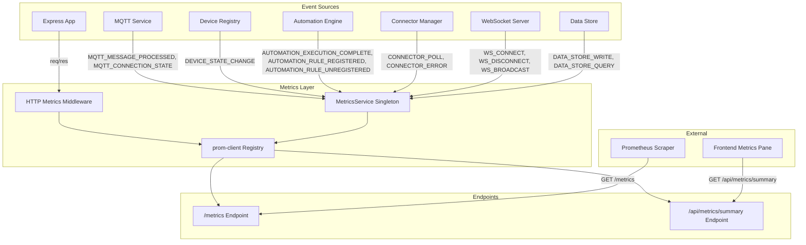
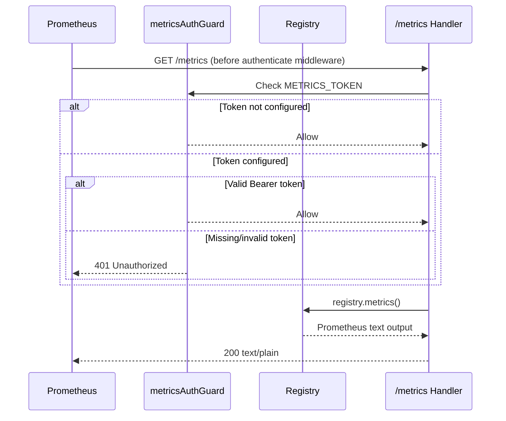
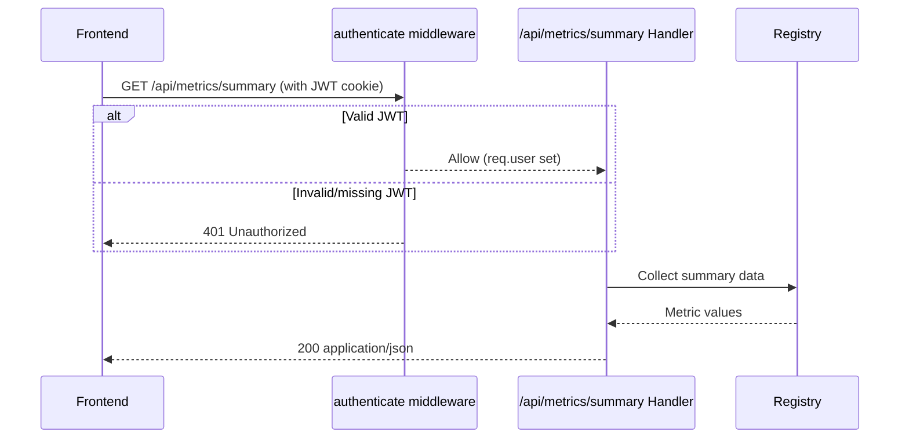
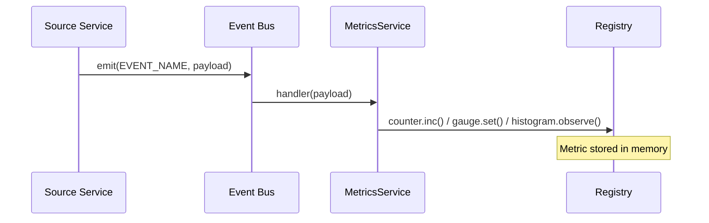
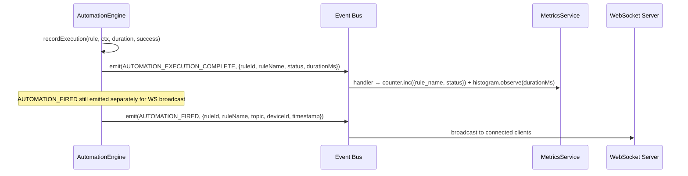
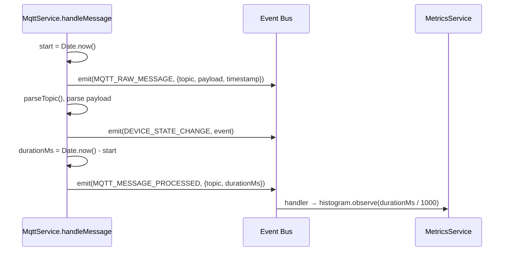

# Design Document: Observability Metrics

## Overview

This design adds Prometheus-compatible metrics export to Aeolus using the `prom-client` library. A dedicated `MetricsService` singleton subscribes to the internal Event Bus to collect telemetry from MQTT, devices, automations, connectors, WebSocket, data store, and HTTP layers — without modifying existing service code. The `/metrics` endpoint serves metrics in Prometheus text exposition format with optional bearer token authentication, bypassing the application-level JWT middleware.

The frontend gains an optional "Metrics" dashboard pane that polls a lightweight JSON summary endpoint for at-a-glance system health.

### Key Design Decisions

1. **prom-client default registry** — Single shared registry avoids coordination issues. All custom metrics use the `aeolus_` prefix for namespace isolation.
2. **Event Bus subscription** — Metrics collection hooks into existing events (`DEVICE_STATE_CHANGE`, `MQTT_MESSAGE_PROCESSED`, `AUTOMATION_EXECUTION_COMPLETE`, etc.) rather than modifying service internals. New events are added only where no suitable event exists (e.g., `AUTOMATION_EXECUTION_COMPLETE` for status/duration, `MQTT_MESSAGE_PROCESSED` for processing time).
3. **Separate auth models per endpoint** — The `/metrics` endpoint uses its own `METRICS_TOKEN` env var (bearer token) for Prometheus scrapers that don't support JWT refresh flows. The `/api/metrics/summary` endpoint uses standard JWT auth (same as all other `/api/` routes) since it's consumed by the authenticated frontend. When `METRICS_TOKEN` is unset, `/metrics` is open (suitable for local-only deployments).
4. **Dependency injection for gauges** — The MetricsService accepts `getDeviceCount` and `getRuleCount` functions (or subscribes to dedicated events) to keep gauge values accurate without polling.
5. **Label cardinality control** — Device IDs are never used as labels. Grouping is by `device_type`, `connector_type`, `topic_prefix` (first topic segment), and `rule_name`. Route paths are normalized to parameter placeholders.
6. **Express middleware for HTTP metrics** — A lightweight middleware records request duration and status before the response is sent, using `res.on('finish', ...)`.
7. **Frontend polling (not WebSocket)** — The metrics pane polls a `/api/metrics/summary` JSON endpoint every 15 seconds. This avoids coupling the metrics system to the WebSocket auth/filter layer and keeps the pane simple.
8. **Rate limiter exclusion** — The `/metrics` endpoint is mounted before the `authenticate` middleware and before any future global rate limiter. If `apiRateLimiter` is applied globally in the future, `/metrics` must be added to the exclusion list since Prometheus scrapes at fixed intervals and should never be throttled.

## Architecture



### Request Flow — Prometheus Scrape



### Request Flow — Frontend Summary



### Event Flow — Metric Collection



### Event Flow — Automation Metrics (Issue 1 Fix)



### Event Flow — MQTT Processing Duration (Issue 2 Fix)



## Components and Interfaces

### MetricsService (`src/metrics/metrics-service.ts`)

Singleton service that registers all custom metrics and subscribes to Event Bus events.

```typescript
interface MetricsServiceConfig {
  /** Whether to collect default Node.js metrics (memory, GC, event loop) */
  collectDefaults: boolean;
  /** Custom histogram buckets per metric (optional overrides) */
  httpDurationBuckets?: number[];
  mqttDurationBuckets?: number[];
  automationDurationBuckets?: number[];
  datastoreDurationBuckets?: number[];
}

interface MetricsServiceDeps {
  /** Event bus for subscribing to system events */
  eventBus: EventEmitter;
  /** Returns current registered device count (from DeviceRegistry) */
  getDeviceCount: () => number;
  /** Returns current active automation rule count (from AutomationEngine) */
  getRuleCount: () => number;
}

interface MetricsService {
  /** Initialize metrics, subscribe to Event Bus events, and set up gauge data sources */
  initialize(deps: MetricsServiceDeps): void;

  /** Get the prom-client registry instance */
  getRegistry(): Registry;

  /** Record an HTTP request (called by middleware) */
  recordHttpRequest(method: string, route: string, statusCode: number, durationSeconds: number): void;

  /** Record a WebSocket connection event */
  recordWsConnect(): void;
  recordWsDisconnect(): void;
  recordWsBroadcast(messageType: string): void;

  /** Record a connector poll result */
  recordConnectorPoll(connectorType: string): void;
  recordConnectorError(connectorType: string): void;
  recordConnectorDevices(connectorType: string, count: number): void;

  /** Clean up: clear registry, remove event listeners */
  dispose(): void;
}
```

**Initialization in `src/index.ts`:**

```typescript
// MetricsService is initialized with dependency injection
metricsService.initialize({
  eventBus,
  getDeviceCount: () => registry.getAll().length,
  getRuleCount: () => engine.ruleCount,
});
```

**Gauge update strategy:**
- `aeolus_devices_registered_total`: Updated on every `DEVICE_STATE_CHANGE` event by calling `deps.getDeviceCount()`.
- `aeolus_automations_active_rules`: Updated on `AUTOMATION_RULE_REGISTERED` and `AUTOMATION_RULE_UNREGISTERED` events by calling `deps.getRuleCount()`.

### Metrics Middleware (`src/metrics/metrics-middleware.ts`)

Express middleware that records HTTP request duration and status.

```typescript
/**
 * Express middleware that measures request duration and records it
 * via MetricsService. Must be mounted before route handlers.
 *
 * Normalizes route paths: /api/devices/abc123 → /api/devices/:id
 */
function metricsMiddleware(): RequestHandler;

/**
 * Normalize a request path by replacing dynamic segments with placeholders.
 * Exported for unit testing.
 *
 * Rules:
 * - UUID patterns → :id
 * - Numeric-only segments → :id
 * - Segments after known resource paths (devices, users, groups, etc.) → :id
 */
function normalizeRoutePath(path: string, method: string): string;
```

### Metrics Route (`src/api/routes/metrics.routes.ts`)

Two separate route registrations with different auth models:

```typescript
/**
 * Creates the Prometheus metrics router.
 * - GET /metrics — Prometheus text exposition format
 *
 * Auth: Uses METRICS_TOKEN env var (bearer token), NOT JWT.
 * This router is mounted BEFORE the `authenticate` middleware in the Express stack.
 * It is also mounted before any future global rate limiter — Prometheus scrapes
 * at fixed intervals and must never be throttled.
 */
function createPrometheusMetricsRoute(metricsService: MetricsService): Router;

/**
 * Creates the JSON summary router for the frontend dashboard pane.
 * - GET /api/metrics/summary — JSON summary for frontend pane
 *
 * Auth: Uses standard JWT authentication (same as all other /api/ routes).
 * This router is mounted AFTER the `authenticate` middleware alongside other API routes.
 */
function createMetricsSummaryRoute(metricsService: MetricsService): Router;
```

**Express mounting order in `src/index.ts`:**

```typescript
// BEFORE authenticate middleware — protected by METRICS_TOKEN bearer
app.use(createPrometheusMetricsRoute(metricsService));

// Standard middleware stack
app.use(corsMiddleware);
app.use(express.json({ limit: "1mb" }));
app.use(cookieParser());
app.use(requestLogger);
app.use(authenticate);

// AFTER authenticate — uses JWT auth like all /api/ routes
app.use("/api/metrics", createMetricsSummaryRoute(metricsService));
// ... other API routes
```

**Rate limiter note:** If `apiRateLimiter` is applied globally in the future, it must be placed AFTER the `/metrics` route mount point. Since `/metrics` is mounted before `authenticate`, it is inherently excluded from any middleware applied after it in the stack.

### Metrics Auth Guard (`src/metrics/metrics-auth.ts`)

Standalone middleware for bearer token validation on the `/metrics` Prometheus endpoint only.

```typescript
/**
 * Middleware that checks the METRICS_TOKEN environment variable.
 * - If METRICS_TOKEN is not set: allow all requests (no auth required)
 * - If METRICS_TOKEN is set: require Authorization: Bearer <token> header
 *
 * Returns 401 with JSON body on failure.
 *
 * NOTE: This guard is ONLY applied to GET /metrics (Prometheus scraper endpoint).
 * The /api/metrics/summary endpoint uses standard JWT auth via the `authenticate` middleware.
 */
function metricsAuthGuard(req: Request, res: Response, next: NextFunction): void;
```

### Frontend Metrics Store (`frontend/src/store/metrics-store.ts`)

Zustand store for the metrics dashboard pane.

```typescript
interface MetricsSummary {
  mqtt: {
    messagesReceivedRate: number;  // messages/sec over last scrape interval
    messagesPublishedRate: number;
    connected: boolean;
  };
  devices: {
    registeredCount: number;
  };
  automations: {
    executionRate: number;  // executions/sec
    activeRules: number;
    errorRate: number;
  };
  websocket: {
    activeConnections: number;
  };
  system: {
    uptimeSeconds: number;
    memoryUsageMb: number;
    eventLoopLagMs: number;
  };
}

interface MetricsState {
  summary: MetricsSummary | null;
  loading: boolean;
  error: string | null;
  lastUpdated: number | null;

  fetchSummary(): Promise<void>;
  startPolling(): void;
  stopPolling(): void;
}
```

### Frontend Metrics Pane (`frontend/src/components/panes/MetricsPane.tsx`)

Dashboard pane component displaying key metrics.

```typescript
/**
 * Metrics pane registered in the pane registry.
 * Displays cards for: MQTT rate, device count, automation rate,
 * WebSocket connections, uptime, and memory usage.
 * Auto-polls every 15 seconds via the metrics store.
 */
function MetricsPane(): JSX.Element;
```

## Data Models

### New Event Bus Events

```typescript
// Added to src/core/event-bus.ts
export const AUTOMATION_EXECUTION_COMPLETE = "automation:execution-complete" as const;
export const AUTOMATION_RULE_REGISTERED = "automation:rule-registered" as const;
export const AUTOMATION_RULE_UNREGISTERED = "automation:rule-unregistered" as const;
export const MQTT_MESSAGE_PROCESSED = "mqtt:message-processed" as const;
export const CONNECTOR_POLL = "connector:poll" as const;
export const CONNECTOR_ERROR = "connector:error" as const;
export const DATA_STORE_QUERY = "data-store:query" as const;
export const WS_CLIENT_CONNECT = "ws:client-connect" as const;
export const WS_CLIENT_DISCONNECT = "ws:client-disconnect" as const;
export const WS_BROADCAST = "ws:broadcast" as const;
export const MQTT_MESSAGE_PUBLISHED = "mqtt:message-published" as const;
```

### Event Payloads

```typescript
/** Emitted from AutomationEngine.recordExecution() after every rule execution completes (success or error).
 *  The MetricsService subscribes to this for counters and histograms.
 *  Note: AUTOMATION_FIRED is kept for the existing WebSocket broadcast use case. */
interface AutomationExecutionCompleteEvent {
  ruleId: string;
  ruleName: string;
  status: "success" | "error";
  durationMs: number;
}

/** Emitted from AutomationEngine.register() when a new rule is added. */
interface AutomationRuleRegisteredEvent {
  ruleId: string;
  ruleName: string;
}

/** Emitted from AutomationEngine.unregister() when a rule is removed. */
interface AutomationRuleUnregisteredEvent {
  ruleId: string;
}

/** Emitted from MqttService.handleMessage() at the end of message processing.
 *  Provides the duration from message receipt to DEVICE_STATE_CHANGE emission. */
interface MqttMessageProcessedEvent {
  topic: string;
  durationMs: number;
}

interface ConnectorPollEvent {
  connectorType: string;
  instanceId: string;
  devicesDiscovered: number;
}

interface ConnectorErrorEvent {
  connectorType: string;
  instanceId: string;
  error: string;
}

interface DataStoreQueryEvent {
  collection: string;
  durationMs: number;
}

interface WsBroadcastEvent {
  messageType: string;
  clientCount: number;
}

interface MqttPublishEvent {
  topic: string;
}
```

### Source Code Modifications for New Events

**`src/automations/automation-engine.ts` — `recordExecution` method:**

```typescript
private recordExecution(
  rule: Rule,
  ctx: EventContext,
  duration: number,
  success: boolean,
  error?: string,
): void {
  // Emit AUTOMATION_EXECUTION_COMPLETE for MetricsService (counters + histograms)
  this.eventBus.emit(AUTOMATION_EXECUTION_COMPLETE, {
    ruleId: rule.id,
    ruleName: rule.name || "Unnamed Rule",
    status: success ? "success" : "error",
    durationMs: duration,
  });

  // Existing execution log logic unchanged...
  if (!this.executionLog) return;
  // ...
}
```

**`src/automations/automation-engine.ts` — `register` and `unregister` methods:**

```typescript
register(rule: Rule): void {
  this.registry.register(rule);
  this.eventBus.emit(AUTOMATION_RULE_REGISTERED, { ruleId: rule.id, ruleName: rule.name || "Unnamed Rule" });
  // ... existing cron logic ...
}

unregister(ruleId: string): void {
  this.cronTimerManager.stop(ruleId);
  this.registry.unregister(ruleId);
  this.eventBus.emit(AUTOMATION_RULE_UNREGISTERED, { ruleId });
}
```

**`src/mqtt/mqtt-service.ts` — `handleMessage` method:**

```typescript
private handleMessage(topic: string, payload: Buffer): void {
  const start = Date.now();
  const raw = payload.toString();

  // Emit raw message for MQTT inspector (existing behavior, unchanged)
  this.eventBus.emit(MQTT_RAW_MESSAGE, { topic, payload: raw, timestamp: Date.now() });

  // ... existing parsing logic ...

  this.eventBus.emit(DEVICE_STATE_CHANGE, event);

  // Emit processing complete event for MetricsService histogram
  const durationMs = Date.now() - start;
  this.eventBus.emit(MQTT_MESSAGE_PROCESSED, { topic, durationMs });
}
```

### Metric Definitions

| Metric Name | Type | Labels | Description |
|-------------|------|--------|-------------|
| `aeolus_mqtt_messages_received_total` | Counter | `topic_prefix` | Total MQTT messages received |
| `aeolus_mqtt_messages_published_total` | Counter | — | Total MQTT messages published |
| `aeolus_mqtt_connection_state` | Gauge | — | MQTT broker connection (1=connected, 0=disconnected) |
| `aeolus_mqtt_message_processing_duration_seconds` | Histogram | — | MQTT message processing time |
| `aeolus_devices_registered_total` | Gauge | — | Current registered device count |
| `aeolus_device_messages_total` | Counter | `device_type` | Device state change messages |
| `aeolus_automations_executions_total` | Counter | `rule_name`, `status` | Automation rule executions |
| `aeolus_automations_execution_duration_seconds` | Histogram | — | Automation execution time |
| `aeolus_automations_active_rules` | Gauge | — | Currently loaded automation rules |
| `aeolus_connector_polls_total` | Counter | `connector_type` | Connector poll cycles completed |
| `aeolus_connector_errors_total` | Counter | `connector_type` | Connector poll errors |
| `aeolus_connector_devices_discovered` | Gauge | `connector_type` | Devices discovered per connector |
| `aeolus_http_requests_total` | Counter | `method`, `route`, `status_code` | HTTP requests served |
| `aeolus_http_request_duration_seconds` | Histogram | `method`, `route` | HTTP response time |
| `aeolus_process_uptime_seconds` | Gauge | — | Process uptime |
| `aeolus_websocket_connections_active` | Gauge | — | Active WebSocket connections |
| `aeolus_websocket_messages_sent_total` | Counter | `message_type` | WebSocket messages broadcast |
| `aeolus_datastore_records_written_total` | Counter | `collection` | Data store records written |
| `aeolus_datastore_query_duration_seconds` | Histogram | — | Data store query time |

### Histogram Bucket Configurations

```typescript
const BUCKETS = {
  mqtt: [0.001, 0.005, 0.01, 0.025, 0.05, 0.1, 0.25, 0.5, 1, 2.5],
  automation: [0.001, 0.005, 0.01, 0.05, 0.1, 0.5, 1, 2.5, 5],
  http: [0.005, 0.01, 0.025, 0.05, 0.1, 0.25, 0.5, 1, 2.5, 5],
  datastore: [0.001, 0.005, 0.01, 0.025, 0.05, 0.1, 0.25, 0.5, 1],
};
```

### Environment Variables

| Variable | Default | Description |
|----------|---------|-------------|
| `METRICS_TOKEN` | _(unset)_ | Bearer token for `/metrics` endpoint. When unset, endpoint is open. |

### JSON Summary Response (`GET /api/metrics/summary`)

```json
{
  "mqtt": {
    "messagesReceivedRate": 12.5,
    "messagesPublishedRate": 3.2,
    "connected": true
  },
  "devices": {
    "registeredCount": 24
  },
  "automations": {
    "executionRate": 0.8,
    "activeRules": 7,
    "errorRate": 0.01
  },
  "websocket": {
    "activeConnections": 2
  },
  "system": {
    "uptimeSeconds": 86400,
    "memoryUsageMb": 78.3,
    "eventLoopLagMs": 1.2
  }
}
```

## Correctness Properties

*A property is a characteristic or behavior that should hold true across all valid executions of a system — essentially, a formal statement about what the system should do. Properties serve as the bridge between human-readable specifications and machine-verifiable correctness guarantees.*

### Property 1: Bearer token authentication correctness

*For any* configured `METRICS_TOKEN` value T and any request to `/metrics`: access SHALL be granted if and only if `METRICS_TOKEN` is not set OR the request includes an `Authorization: Bearer T` header with a value exactly matching T. All other requests SHALL receive HTTP 401. The `/api/metrics/summary` endpoint SHALL use standard JWT authentication and SHALL NOT require `METRICS_TOKEN`.

**Validates: Requirements 2.1, 2.2, 2.3, 2.4**

### Property 2: Registered metrics completeness

*For any* set of custom metrics registered with the MetricsService, the `/metrics` endpoint response text SHALL contain a `# HELP` or `# TYPE` line for every registered metric name, and every metric name SHALL start with the `aeolus_` prefix.

**Validates: Requirements 1.3, 10.1**

### Property 3: MQTT message receive metrics recording

*For any* sequence of N MQTT messages received on topics with various first segments, the `aeolus_mqtt_messages_received_total` counter SHALL equal N (summed across all `topic_prefix` labels), and the `aeolus_mqtt_message_processing_duration_seconds` histogram SHALL have exactly N observations (one per `MQTT_MESSAGE_PROCESSED` event).

**Validates: Requirements 3.1, 3.4**

### Property 4: MQTT connection state gauge correctness

*For any* sequence of MQTT connection state changes (connected/disconnected), the `aeolus_mqtt_connection_state` gauge SHALL always reflect the most recent state: 1 for connected, 0 for disconnected.

**Validates: Requirements 3.3**

### Property 5: Device metrics label cardinality safety

*For any* set of device state change events with arbitrary device IDs, the serialized metrics output SHALL NOT contain any label whose value matches a device ID. The `aeolus_device_messages_total` counter SHALL use only `device_type` as a label dimension.

**Validates: Requirements 4.2, 4.3**

### Property 6: Automation execution metrics recording

*For any* sequence of `AUTOMATION_EXECUTION_COMPLETE` events with rule names and statuses (success/error), the `aeolus_automations_executions_total` counter SHALL increment with the correct `rule_name` and `status` labels, and the `aeolus_automations_execution_duration_seconds` histogram observation count SHALL equal the total number of executions.

**Validates: Requirements 5.1, 5.2**

### Property 7: Connector poll metrics recording

*For any* sequence of connector poll events (success or error) with various `connector_type` values, the `aeolus_connector_polls_total` counter SHALL increment for successful polls and the `aeolus_connector_errors_total` counter SHALL increment for error polls, each with the correct `connector_type` label.

**Validates: Requirements 6.1, 6.2**

### Property 8: HTTP request metrics and route normalization

*For any* HTTP request with a method, path containing dynamic segments (UUIDs, numeric IDs), and response status code, the `aeolus_http_requests_total` counter SHALL increment with the normalized route (dynamic segments replaced with `:id`), and the `aeolus_http_request_duration_seconds` histogram SHALL record the response duration.

**Validates: Requirements 7.3, 7.4, 7.5**

### Property 9: WebSocket connection gauge accuracy

*For any* sequence of WebSocket connect and disconnect events, the `aeolus_websocket_connections_active` gauge SHALL equal the number of connects minus the number of disconnects (i.e., the net active connection count), and SHALL never be negative.

**Validates: Requirements 8.1**

### Property 10: Data store metrics recording

*For any* sequence of data store write events with various collection names, the `aeolus_datastore_records_written_total` counter SHALL increment with the correct `collection` label for each write, and the `aeolus_datastore_query_duration_seconds` histogram observation count SHALL equal the number of query events.

**Validates: Requirements 9.1, 9.2**

### Property 11: Route path normalization is idempotent

*For any* already-normalized route path (containing only `:id` placeholders, no raw UUIDs or numeric IDs), applying `normalizeRoutePath` again SHALL produce the same string (idempotent).

**Validates: Requirements 7.5**

### Property 12: Device count gauge accuracy

*For any* sequence of `DEVICE_STATE_CHANGE` events, the `aeolus_devices_registered_total` gauge SHALL always reflect the value returned by `getDeviceCount()` (i.e., `registry.getAll().length`) after each event is processed.

**Validates: Requirements 4.1**

### Property 13: Active automation rules gauge accuracy

*For any* sequence of `AUTOMATION_RULE_REGISTERED` and `AUTOMATION_RULE_UNREGISTERED` events, the `aeolus_automations_active_rules` gauge SHALL always reflect the value returned by `getRuleCount()` (i.e., `engine.ruleCount`) after each event is processed.

**Validates: Requirements 5.3**

## Error Handling

### Metrics Endpoint Errors

| Scenario | Status | Response |
|----------|--------|----------|
| Registry collection fails | 500 | `{ "error": "Failed to collect metrics" }` |
| Missing/invalid bearer token (when METRICS_TOKEN set) | 401 | `{ "error": "Unauthorized" }` |
| Summary endpoint internal error | 500 | `{ "error": "Failed to collect metrics summary" }` |

### Graceful Degradation

- If an Event Bus listener throws during metric recording, the error is logged via pino but does NOT propagate to the source service. Metric recording failures are non-fatal.
- If `prom-client` throws during metric registration (e.g., duplicate metric name), the MetricsService logs a warning and skips that metric rather than crashing.
- The HTTP metrics middleware catches its own errors and calls `next()` without blocking the request pipeline.

### Shutdown Behavior

On graceful shutdown (`SIGINT`/`SIGTERM`):
1. The MetricsService `dispose()` method is called
2. All Event Bus listeners are removed
3. The prom-client registry is cleared (`registry.clear()`)
4. No new metrics are recorded after dispose

## Testing Strategy

### Property-Based Tests (fast-check, minimum 100 iterations)

Property-based testing is appropriate for this feature because the metrics recording logic, route normalization, and auth guard are pure or near-pure functions where input variation reveals edge cases (different topic prefixes, route patterns, token values, event sequences).

**Library:** `fast-check` (already in devDependencies) with `@fast-check/vitest`

**Test files:**
- `src/metrics/metrics-auth.property.test.ts` — Property 1
- `src/metrics/metrics-service.property.test.ts` — Properties 2, 3, 4, 5, 6, 7, 9, 10, 12, 13
- `src/metrics/metrics-middleware.property.test.ts` — Properties 8, 11

Each property test must:
- Run minimum 100 iterations
- Reference its design property with a tag comment: `// Feature: observability-metrics, Property N: <title>`
- Use generators for topic strings, device types, rule names, connector types, route paths, token values, and event sequences

### Unit Tests (example-based)

**Test files:**
- `src/metrics/metrics-service.test.ts` — Initialization, dispose, singleton behavior, gauge updates via deps
- `src/metrics/metrics-middleware.test.ts` — Specific route normalization examples (UUID, numeric, nested)
- `src/api/routes/metrics.routes.test.ts` — API integration tests with supertest (endpoint responses, content type, auth models)

Focus areas:
- `/metrics` returns correct content type header
- `/metrics` bypasses JWT auth middleware (mounted before `authenticate`)
- `/metrics` is protected by `metricsAuthGuard` (METRICS_TOKEN bearer)
- `/api/metrics/summary` uses JWT auth (same as other `/api/` routes)
- `/api/metrics/summary` does NOT require METRICS_TOKEN
- Summary endpoint returns valid JSON structure
- MetricsService singleton returns same instance
- Dispose clears registry and removes listeners
- Default Node.js metrics are present in output
- Uptime gauge value is positive and increasing
- `AUTOMATION_EXECUTION_COMPLETE` event correctly updates counter and histogram
- `MQTT_MESSAGE_PROCESSED` event correctly updates histogram
- `AUTOMATION_RULE_REGISTERED`/`UNREGISTERED` events update active rules gauge
- `DEVICE_STATE_CHANGE` event triggers device count gauge update via `getDeviceCount()`

### Integration Tests

- Full scrape flow: emit events → GET /metrics → verify counters/gauges in output text
- Auth flow for `/metrics`: set METRICS_TOKEN → verify 401 without token → verify 200 with token
- Auth flow for `/api/metrics/summary`: verify 401 without JWT → verify 200 with valid JWT → verify METRICS_TOKEN is NOT required
- Shutdown flow: dispose → verify no new metrics recorded
- Event flow: emit `AUTOMATION_EXECUTION_COMPLETE` → verify counter/histogram updated
- Event flow: emit `MQTT_MESSAGE_PROCESSED` → verify histogram updated
- Event flow: emit `AUTOMATION_RULE_REGISTERED` → verify gauge updated via `getRuleCount()`
- Event flow: emit `DEVICE_STATE_CHANGE` → verify gauge updated via `getDeviceCount()`

### Test Configuration

```typescript
// Property tests use existing fast-check setup
// Tag format: Feature: observability-metrics, Property {N}: {title}
// Minimum iterations: 100
```

### Dependencies

New runtime dependency:
- `prom-client` — Prometheus metrics client for Node.js (counters, gauges, histograms, registry, default metrics)

No new dev dependencies needed — `fast-check`, `vitest`, and `supertest` are already available.
