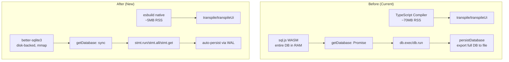
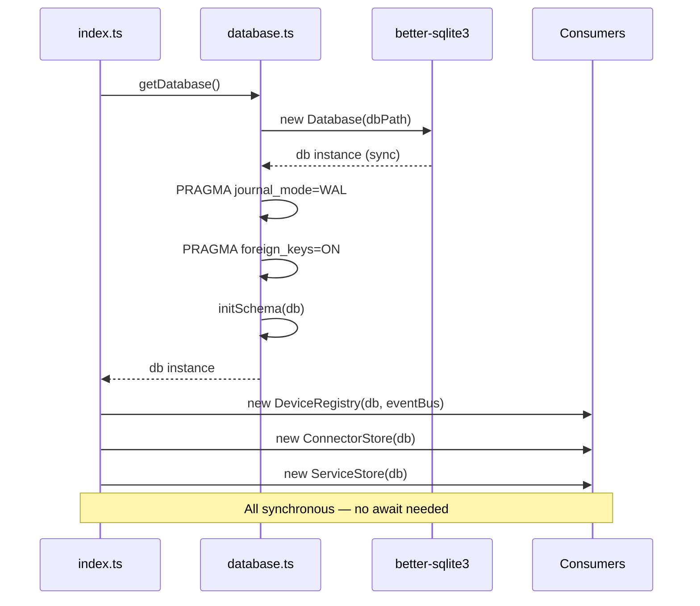

# Design Document: Performance Architecture Uplift

## Overview

This design replaces two memory-heavy runtime dependencies — the TypeScript compiler (`typescript` package, ~60-80MB RSS) and sql.js (entire database in WASM heap) — with lightweight, native alternatives: **esbuild** for transpilation and **better-sqlite3** for database access. Combined with a V8 heap cap and Node.js 24 upgrade, the target is ≤200MB idle RSS on Raspberry Pi 4.

The changes are purely internal. All external API surfaces, automation script behavior, and frontend interactions remain identical.

### Key Design Decisions

| Decision | Rationale |
|----------|-----------|
| esbuild `transformSync()` over async | Scripts are small (<10KB), sync avoids Promise overhead in hot paths, matches existing synchronous call sites |
| better-sqlite3 over node:sqlite | Mature ecosystem, WAL mode support, prepared statements, well-tested on ARM/Alpine |
| Synchronous `getDatabase()` | Eliminates async initialization cascade, simplifies startup, better-sqlite3 is inherently sync |
| Remove `persistDatabase()` entirely | better-sqlite3 writes to disk on every statement execution — no manual flush needed |
| `--max-old-space-size=1024` | Prevents unbounded heap growth; Docker restart policy handles OOM gracefully |
| Node.js 24 LTS | Latest V8 optimizations, security patches, aligns with LTS schedule |

## Architecture



### Startup Flow (After)



## Components and Interfaces

### 1. Transpiler Module (`src/automations/transpiler.ts`)

The public API remains unchanged. Only the internal implementation switches from `ts.transpileModule()` to `esbuild.transformSync()`.

```typescript
// Public interface — unchanged
export interface TranspileError {
  line: number;
  column: number;
  message: string;
}

export type TranspileResult =
  | { success: true; js: string }
  | { success: false; errors: TranspileError[] };

export function transpile(source: string): TranspileResult;
export function transpileUi(source: string): TranspileResult;
```

#### esbuild Configuration — Logic Scripts

```typescript
import { transformSync, type Message } from "esbuild";

// For logic scripts (no imports allowed, pure TypeScript → JS)
const logicOptions = {
  loader: "ts" as const,
  target: "es2022",
  format: "esm" as const,
  sourcemap: false,
  // No JSX needed for logic scripts
};
```

#### esbuild Configuration — UI Components

```typescript
// For UI components (TSX with React JSX automatic runtime)
const uiOptions = {
  loader: "tsx" as const,
  target: "es2022",
  format: "esm" as const,
  jsx: "automatic" as const,
  jsxImportSource: "react",
  sourcemap: false,
};
```

#### Error Mapping

esbuild returns errors as `Message[]` with `{ text, location }` where `location` has `{ line, column }`. The mapping to `TranspileError`:

```typescript
function mapEsbuildErrors(messages: Message[]): TranspileError[] {
  return messages.map((msg) => ({
    line: msg.location?.line ?? 1,
    column: msg.location?.column ?? 0,
    message: msg.text,
  }));
}
```

Note: esbuild's `location.line` is 1-based (matching our existing interface). `location.column` is 0-based (also matching).

#### Implementation Flow

```typescript
export function transpile(source: string): TranspileResult {
  // 1. Empty/whitespace check (unchanged)
  if (source.trim() === "") {
    return { success: false, errors: [{ line: 1, column: 0, message: "Script source cannot be empty" }] };
  }

  // 2. Import/require rejection (unchanged regex check)
  if (IMPORT_REQUIRE_RE.test(source)) {
    return { success: false, errors: [{ line: 1, column: 0, message: "Import and require statements are not allowed..." }] };
  }

  // 3. esbuild transform (replaces ts.transpileModule)
  try {
    const result = transformSync(source, logicOptions);
    if (result.warnings.length > 0) {
      // Warnings are non-fatal — still return success
    }
    return { success: true, js: result.code };
  } catch (err: unknown) {
    // esbuild throws on syntax errors with .errors array
    const esbuildErr = err as { errors?: Message[] };
    if (esbuildErr.errors?.length) {
      return { success: false, errors: mapEsbuildErrors(esbuildErr.errors) };
    }
    return { success: false, errors: [{ line: 1, column: 0, message: String(err) }] };
  }
}
```

### 2. Database Module (`src/db/database.ts`)

Complete rewrite from sql.js (async WASM) to better-sqlite3 (sync native).

```typescript
import Database from "better-sqlite3";
import type { Database as DatabaseType } from "better-sqlite3";
import fs from "node:fs";
import path from "node:path";
import { config } from "../config.js";
import logger from "../logger.js";

let db: DatabaseType | null = null;

/**
 * Get the database instance. Creates and initializes on first call.
 * Synchronous — no Promise, no WASM compilation.
 */
export function getDatabase(): DatabaseType {
  if (db) return db;

  const dir = path.dirname(config.dbPath);
  fs.mkdirSync(dir, { recursive: true });

  db = new Database(config.dbPath);

  // Enable WAL mode for better concurrent read performance
  db.pragma("journal_mode = WAL");
  db.pragma("foreign_keys = ON");

  initSchema(db);

  logger.info({ dbPath: config.dbPath }, "Database initialized (better-sqlite3, WAL mode)");
  return db;
}

/**
 * Close the database connection gracefully.
 * Called during shutdown.
 */
export function closeDatabase(): void {
  if (db) {
    db.close();
    db = null;
  }
}
```

#### Schema Initialization

The `initSchema()` function remains structurally identical but uses better-sqlite3's `exec()` for DDL statements:

```typescript
export function initSchema(database: DatabaseType): void {
  database.exec(`
    CREATE TABLE IF NOT EXISTS devices ( ... );
    CREATE TABLE IF NOT EXISTS automation_rules ( ... );
    CREATE TABLE IF NOT EXISTS tabs ( ... );
    CREATE TABLE IF NOT EXISTS panes ( ... );
    CREATE TABLE IF NOT EXISTS connectors ( ... );
    CREATE TABLE IF NOT EXISTS services ( ... );
    CREATE TABLE IF NOT EXISTS automation_state ( ... );
    CREATE TABLE IF NOT EXISTS device_history ( ... );
    CREATE INDEX IF NOT EXISTS idx_device_history_device_ts
      ON device_history(device_id, timestamp DESC);
  `);

  // Column migrations use try/catch pattern (unchanged logic)
  migrateAddColumns(database);
  migrateRemoveTypeCheck(database);
}
```

#### Key API Differences (sql.js → better-sqlite3)

| Operation | sql.js | better-sqlite3 |
|-----------|--------|----------------|
| Open DB | `await initSqlJs(); new SQL.Database(buffer)` | `new Database(filePath)` |
| Run DDL | `db.run(sql)` | `db.exec(sql)` or `db.prepare(sql).run()` |
| Insert/Update | `db.run(sql, params)` | `db.prepare(sql).run(...params)` |
| Select all | `db.exec(sql, params)` → `{columns, values}[]` | `db.prepare(sql).all(...params)` → `object[]` |
| Select one | `db.exec(sql, params)[0].values[0]` | `db.prepare(sql).get(...params)` → `object \| undefined` |
| Persist | `persistDatabase()` (manual export) | Automatic (WAL flush) |
| Transaction | `db.run("BEGIN"); ... db.run("COMMIT")` | `db.transaction(() => { ... })()` |

### 3. Database Consumer Migration Pattern

Each consumer module changes from:
- `import type { Database } from "sql.js"` → `import type { Database } from "better-sqlite3"`
- `db.exec(sql, params)` with manual column/value parsing → `db.prepare(sql).all(...params)` returning objects directly
- `db.run(sql, params)` → `db.prepare(sql).run(...params)`
- Remove all `import { persistDatabase }` and `persistDatabase()` calls

#### Example: ConnectorStore (Before → After)

**Before:**
```typescript
import type { Database } from "sql.js";
import { persistDatabase } from "../db/database.js";

save(record: ConnectorRecord): void {
  this.db.run(
    `INSERT OR REPLACE INTO connectors (...) VALUES (?, ?, ?, ?, ?, ?)`,
    [record.id, record.connectorType, ...]
  );
  persistDatabase();
}

loadAll(): ConnectorRecord[] {
  const results = this.db.exec("SELECT * FROM connectors");
  if (results.length === 0) return [];
  const { columns, values } = results[0];
  // Manual column-index mapping...
}
```

**After:**
```typescript
import type { Database } from "better-sqlite3";

save(record: ConnectorRecord): void {
  this.db.prepare(
    `INSERT OR REPLACE INTO connectors (...) VALUES (?, ?, ?, ?, ?, ?)`
  ).run(record.id, record.connectorType, ...);
  // No persistDatabase() — WAL handles it
}

loadAll(): ConnectorRecord[] {
  const rows = this.db.prepare("SELECT * FROM connectors").all() as ConnectorRow[];
  return rows.map(row => ({
    id: row.id,
    connectorType: row.connector_type,
    // Direct property access — no column-index gymnastics
  }));
}
```

#### Modules Requiring Migration

| Module | File | Key Changes |
|--------|------|-------------|
| DeviceRegistry | `src/core/device-registry.ts` | Replace `db.exec()` → `db.prepare().all()`, `db.run()` → `db.prepare().run()`, remove `persistDatabase()` |
| AutomationStateStore | `src/automations/automation-state-store.ts` | Same pattern, remove `persistDatabase()` |
| ConnectorStore | `src/connectors/connector-store.ts` | Same pattern, remove `persistDatabase()` |
| ServiceStore | `src/services/service-store.ts` | Same pattern, remove `persistDatabase()` |
| DataStore | `src/data-store/data-store.ts` | Largest migration — many `db.exec()` calls with complex result parsing, remove `persistDatabase()` |
| Layout Routes | `src/api/routes/layout.routes.ts` | Replace `db.exec()` → `db.prepare().all()`, transactions via `db.transaction()`, remove `persistDatabase()` |
| Automation Routes | `src/api/routes/automation.routes.ts` | Replace query patterns, remove `persistDatabase()` |

#### Transaction Pattern Change

**Before (sql.js):**
```typescript
db.run("BEGIN TRANSACTION");
try {
  db.run("DELETE FROM panes");
  db.run("DELETE FROM tabs");
  // ... inserts ...
  db.run("COMMIT");
} catch (err) {
  db.run("ROLLBACK");
  throw err;
}
persistDatabase();
```

**After (better-sqlite3):**
```typescript
const replaceLayout = db.transaction((tabs, panes) => {
  db.prepare("DELETE FROM panes").run();
  db.prepare("DELETE FROM tabs").run();
  // ... inserts ...
});
replaceLayout(tabs, panes); // auto-commit or rollback
```

### 4. Dockerfile Changes

```dockerfile
# Change base images from node:22-alpine to node:24-alpine
FROM node:24-alpine AS builder
WORKDIR /app
RUN apk add --no-cache python3 make g++
COPY package.json package-lock.json* ./
RUN npm install
COPY tsconfig.json ./
COPY src/ ./src/
RUN npx tsup src/index.ts --format esm --target node24

FROM node:24-alpine AS production
WORKDIR /app
RUN apk add --no-cache git docker-cli docker-cli-compose util-linux
COPY package.json package-lock.json* ./
RUN npm install --omit=dev && npm cache clean --force
COPY --from=builder /app/dist ./dist/
COPY src/automations/sandbox-types.d.ts ./dist/automations/sandbox-types.d.ts
COPY automations/ ./automations/
RUN mkdir -p /app/data
RUN git config --global --add safe.directory /aeolus-host
EXPOSE 3001
HEALTHCHECK --interval=30s --timeout=5s --start-period=10s --retries=3 \
  CMD wget --no-verbose --tries=1 --spider http://localhost:3001/api/health || exit 1
CMD ["node", "--max-old-space-size=1024", "dist/index.js"]
```

Key changes:
1. `node:22-alpine` → `node:24-alpine` (both stages)
2. `--target node22` → `--target node24` (tsup)
3. CMD adds `--max-old-space-size=1024` flag
4. No new build dependencies needed — `python3 make g++` already present for isolated-vm

### 5. Package.json Changes

```json
{
  "dependencies": {
    "better-sqlite3": "^11.0.0",
    "esbuild": "^0.25.0",
    // Remove: "sql.js": "^1.14.1"
    // Remove: "typescript": "^5.7.3"
  },
  "devDependencies": {
    "typescript": "^5.7.3",
    "@types/better-sqlite3": "^7.6.0",
    // ... existing devDeps unchanged
  }
}
```

## Data Models

### Database File Format

No change to the SQLite schema. better-sqlite3 operates on the same `.sqlite` file format as sql.js. The file at `DB_PATH` (default: `./data/aeolus.db`) is opened directly by better-sqlite3 rather than being loaded entirely into a WASM heap buffer.

### Type Definitions for better-sqlite3 Rows

Each consumer defines typed row interfaces for type-safe access:

```typescript
// Example: ConnectorStore row type
interface ConnectorRow {
  id: string;
  connector_type: string;
  enabled: number; // SQLite stores booleans as 0/1
  config: string;  // JSON string
  created_at: number;
  updated_at: number;
}
```

### TranspileResult (unchanged)

```typescript
export type TranspileResult =
  | { success: true; js: string }
  | { success: false; errors: TranspileError[] };
```

## Correctness Properties

*A property is a characteristic or behavior that should hold true across all valid executions of a system — essentially, a formal statement about what the system should do. Properties serve as the bridge between human-readable specifications and machine-verifiable correctness guarantees.*

### Property 1: Type annotation stripping produces valid JavaScript

*For any* valid TypeScript source string containing type annotations (type aliases, interfaces, parameter types, return types, generics), the transpiler SHALL produce output that contains none of the original type syntax and is parseable as valid ES2022 JavaScript.

**Validates: Requirements 1.1, 2.1**

### Property 2: Import/require patterns are always rejected

*For any* source string containing an import declaration, dynamic import expression, require call, or re-export statement, the `transpile()` function SHALL return a failure result with a structured error, without invoking esbuild.

**Validates: Requirements 1.2**

### Property 3: Whitespace-only input rejection

*For any* string composed entirely of whitespace characters (spaces, tabs, newlines, carriage returns), both `transpile()` and `transpileUi()` SHALL return a failure result with an error indicating the source cannot be empty.

**Validates: Requirements 1.4, 2.3**

### Property 4: Syntax error structure correctness

*For any* syntactically invalid TypeScript or TSX source that is not empty and not rejected by the import check, the transpiler SHALL return a failure result where every error object has a `line` field ≥ 1, a `column` field ≥ 0, and a non-empty `message` string.

**Validates: Requirements 1.3, 2.2**

### Property 5: JSX automatic runtime transform in UI output

*For any* valid TSX source containing JSX elements, `transpileUi()` SHALL produce output that includes references to the React JSX runtime (e.g., `jsx`, `jsxs`, or `Fragment` from `react/jsx-runtime`) and does not contain raw JSX syntax (`<`, `/>` as element delimiters).

**Validates: Requirements 2.1, 2.5**

### Property 6: Database write round-trip persistence

*For any* valid key-value pair written to the database via a prepared statement, immediately reading back that row (without any explicit flush call) SHALL return the same data that was written.

**Validates: Requirements 4.7, 5.8**

### Property 7: Transpilation performance bound

*For any* valid TypeScript source string of length ≤ 10KB, the `transpile()` function SHALL complete execution in under 10 milliseconds.

**Validates: Requirements 9.2**

## Error Handling

### Transpiler Errors

| Scenario | Handling |
|----------|----------|
| Empty/whitespace source | Return `{ success: false, errors: [{ line: 1, column: 0, message: "...cannot be empty" }] }` |
| Import/require detected | Return structured error before invoking esbuild |
| Syntax error | Catch esbuild exception, map `err.errors` to `TranspileError[]` |
| Unexpected esbuild failure | Catch generic error, return single error with `String(err)` as message |

esbuild throws an exception (rather than returning errors in the result) when transformation fails. The catch block inspects the thrown object for an `.errors` array.

### Database Errors

| Scenario | Handling |
|----------|----------|
| DB file doesn't exist | better-sqlite3 creates it automatically |
| DB file corrupted | better-sqlite3 throws on open — log error, crash (Docker restarts) |
| Schema migration failure | Transaction rollback, log error, re-throw (prevents startup) |
| Query constraint violation | Throws `SqliteError` — consumers catch and map to appropriate HTTP errors |
| Disk full | Throws on write — log error, return 500 to client |

### OOM Handling

When V8 heap exceeds 1024MB, Node.js terminates with a fatal error. Docker's `restart: unless-stopped` policy restarts the container automatically. This is intentional — it prevents the backend from consuming all Pi RAM and affecting other services (Mosquitto, frontend).

## Testing Strategy

### Unit Tests (Example-Based)

- **Transpiler**: Known TypeScript inputs → expected JavaScript outputs (specific examples)
- **Database initialization**: Verify WAL mode, foreign keys, all tables created
- **Consumer modules**: CRUD operations with known data, verify correct results
- **Error cases**: Empty input, malformed SQL, constraint violations

### Property-Based Tests (fast-check)

The project already uses `fast-check` and `@fast-check/vitest`. Each correctness property maps to a property-based test with minimum 100 iterations.

**Library**: fast-check (already in devDependencies)
**Runner**: Vitest with `@fast-check/vitest` integration
**Minimum iterations**: 100 per property

Each property test is tagged with a comment referencing the design property:
```typescript
// Feature: performance-architecture-uplift, Property 1: Type annotation stripping produces valid JavaScript
```

**Test file structure:**
- `src/automations/transpiler.property.test.ts` — Properties 1-5, 7
- `src/db/database.property.test.ts` — Property 6

### Integration Tests

- **API endpoint tests** (supertest): Verify all existing endpoints return identical responses
- **Startup test**: Verify backend starts successfully with new dependencies
- **Seed script test**: Verify seed data loads correctly

### Smoke Tests

- **Dependency audit**: Verify `typescript` not in production deps, `sql.js` removed entirely
- **Dockerfile inspection**: Verify `node:24-alpine` base, `--max-old-space-size=1024` in CMD
- **No `persistDatabase()` calls**: Grep verification that all calls are removed

### Performance Benchmarks (Manual/CI)

- Idle RSS measurement (target: ≤200MB)
- Transpilation latency for representative scripts (target: <10ms)
- Startup time comparison (before/after)
- Database query latency comparison (before/after)
