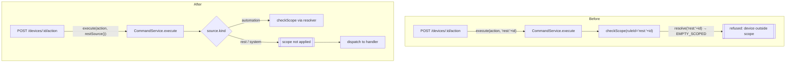

# Design Document

## Overview

This feature closes the five pre-promotion gates found in the 2 August 2026 fresh review, plus the production-composition test gap that let them pass CI. They are grouped into one spec because they share a single goal — the ordinary control and authoring path must be trustworthy before promotion — and a single verification strategy (a production-composition integration suite that several gates exercise at once).

The five gates are largely independent fixes across different subsystems, so the design treats each as its own section and the tasks are sequenced smallest-blast-radius-first. Only Gate 1 (the command-source composition) is architectural; the rest are localized.

Grounded in the current code:

- **Gate 1.** `src/index.ts` constructs `CommandService` with `scopeResolver: automationScopeResolver` always present, and the REST route (`src/api/routes/device.routes.ts`) calls `commandService.execute({ type: req.body.type, target: id, params }, ` + "`rest:${id}`" + `)`. `CommandService.checkScope()` (`src/automations/command-service.ts`) calls `scopeResolver.resolve(ruleId)` for every source; `AutomationScopeResolver.resolve()` fail-closes an unknown id to an empty scoped scope, so `` `rest:${id}` `` is treated as an unknown automation and device-directed actions are refused. Native action types other than the six registered handlers (`publish`, `toggle`, `device_action`, `log`, `delay`, `webhook`) return `unsupported`. `connectorManager.setMqttService()` is never called in `src/index.ts`. The generic fallback brightness descriptor uses `{ level: 0..100 }` (`src/connectors/capability-action-map.ts`) while the Hue connector reads `action.params.brightness` clamped to `0..254` (`src/connectors/hue/hue-connector.ts`).
- **Gate 2.** `Sandbox.setDevicesRefs()` computes a scoped `allDevices` list, but the `__actionAllRef` callback re-reads `deviceRegistry.getAll()` and filters that (`src/automations/sandbox.ts`).
- **Gate 3.** `TabLayout.handleRemovePane()` sends `DELETE /api/automations/:id`, then `dashboard-store.removePane()` sends a second delete via `deleteAutomation()`; the backend `DELETE /api/automations/:id` is a hard delete plus `stateStore.deleteAll()` (`src/api/routes/automation.routes.ts`).
- **Gate 4.** `PUT /api/layout` is `requireAdmin` (`src/api/routes/layout.routes.ts`) while the frontend offers layout controls to any `canWrite` user.
- **Gate 5.** `PUT /api/automations/:id` writes `completion_tier = normalizeTier(completionTier)` (script) or a `null`-defaulted value (form), always overwriting the stored value when the field is omitted.

## Scope

**In scope:** the explicit `Command_Source` model and source-gated scoping; REST-native action normalization; MQTT wiring at composition; one canonical brightness contract; `devices.actionAll()` scoped-inventory fix; pane/automation deletion decoupling + confirmation; non-admin layout truthfulness (frontend gating + permission-doc wording); completion-tier (and condition-field) PATCH semantics; and the production-composition test suite with targeted regressions.

**Out of scope (reused/deferred):** lifecycle states, `PendingCommandTracker`, correlation, and tier selection (**verified-command-execution**, **command-completion-tier**); the boundary's result/event contracts (**unified-command-boundary**); `ActionResult`/`executeAction()` and the action catalog (**device-action-system-uplift**); full soft-delete/archive and export-import; the custom-UI capability manifest; device rename/delete management routes.

## Cross-spec dependencies

- **`unified-command-boundary`** (implemented) — `CommandService`, `execute()`, the built-in handlers, and single-boundary wiring are reused. This feature changes the *source* argument and *when* scope is applied, and completes the MQTT wiring.
- **`scoped-automation-authoring`** (implemented) — `AutomationScopeResolver` and its fail-closed semantics are reused unchanged; only the trigger condition for `checkScope` narrows to automation sources.
- **`command-completion-tier`** (implemented) — `completion_tier`, `normalizeTier`, `isConfirmationTier`, and tier validation are reused; only the update route's omitted-field handling changes.

## Architecture

### Component responsibilities

| Component | File | Change | Gate |
| --- | --- | --- | --- |
| `CommandService.execute()` / `checkScope()` | `src/automations/command-service.ts` | Accept an explicit `Command_Source`; apply the scope resolver only for `kind === "automation"`; coerce a bare-string source to an automation source for existing callers. | 1 |
| Command source types + helpers | `src/automations/command-service.ts` (or `execution-types.ts`) | Add `Command_Source` union and `automationSource()` / `restSource()` / `systemSource()` helpers. | 1 |
| REST device-action route | `src/api/routes/device.routes.ts` | Pass `restSource()`; normalize `req.body.type` into `{ type: "device_action", params: { actionType, ... } }`. | 1, 2 |
| Composition root | `src/index.ts` | Call `connectorManager.setMqttService(mqttService)` before commands can flow. | 3 |
| Brightness contract | `src/connectors/capability-action-map.ts`, `src/connectors/hue/hue-connector.ts`, `frontend/src/components/panes/HueControlPane.tsx`, examples/docs | Adopt one canonical brightness param + range; connectors translate to native scale. | 4 |
| `Sandbox.setDevicesRefs()` `__actionAllRef` | `src/automations/sandbox.ts` | Filter the already-computed scoped `allDevices`, not `deviceRegistry.getAll()`. | 5 |
| Pane removal | `frontend/src/components/TabLayout.tsx`, `frontend/src/store/dashboard-store.ts` | Remove the automation DELETE from pane removal (both call sites). | 6 |
| Explicit delete + confirm | automation editing/management surface (`frontend/src/components/AutomationsPage.tsx` / `AutomationPane.tsx`) | Add an explicit delete action guarded by a confirmation. | 6 |
| Layout truthfulness | `frontend/src/components/TabLayout.tsx` (+ `useTabPermission`/role), `docs/security/permissions.md` | Gate `Layout_Mutation` controls to what the backend persists; correct permission wording. | 7 |
| Automation update route | `src/api/routes/automation.routes.ts` | PATCH semantics: omitted preserves, explicit `null` clears, valid replaces — for `completion_tier`, `condition_type`, `condition_value`. | 8 |
| Production-composition suite | `src/__integration__/` (new) + targeted regressions | Wire like `src/index.ts`; exercise real sources. | 9 |

### Gate 1 — before / after



## Detailed design

### A. Explicit command source (Req 1)

Introduce a discriminated union so the service can tell an automation from a non-automation source without inspecting a string:

```typescript
// src/automations/command-service.ts
export type CommandSource =
  | { kind: "automation"; ruleId: string }
  | { kind: "rest"; label?: string }
  | { kind: "system"; label: string };

export const automationSource = (ruleId: string): CommandSource => ({ kind: "automation", ruleId });
export const restSource = (label?: string): CommandSource => ({ kind: "rest", label });
export const systemSource = (label: string): CommandSource => ({ kind: "system", label });
```

`execute()` accepts `CommandSource | string`. A bare string is coerced to an automation source, preserving every existing automation call site (sandbox host callbacks, form-rule closures, `executeSequence`) without edits (Req 1.7). This coercion is an explicit fallback for automation callers, **not** string-pattern inference of a REST source (Req 1.5).

```typescript
async execute(
  action: ActionDescriptor,
  source: CommandSource | string,
  confirm?: ConfirmOptions,
  requiredTier?: ConfirmationTier,
): Promise<ActionResult> {
  const src: CommandSource = typeof source === "string" ? automationSource(source) : source;
  const logId = src.kind === "automation" ? src.ruleId : (src.label ?? src.kind);
  // ...handler lookup uses logId for logging and the handler ruleId param...
  const scopeRefusal = this.checkScope(action, src);   // now takes the source
  if (scopeRefusal) return scopeRefusal;
  // ...unchanged dispatch/confirmation pipeline, passing logId to handlers/logTerminal...
}
```

`checkScope` applies the resolver only for automation sources:

```typescript
private checkScope(action: ActionDescriptor, source: CommandSource): ActionResult | null {
  if (source.kind !== "automation") return null;   // Req 1.3, 1.4
  if (!this.deps.scopeResolver) return null;
  const scope = this.deps.scopeResolver.resolve(source.ruleId);   // Req 1.2
  // ...existing unrestricted / publish / webhook / device-scope logic unchanged (Req 1.6)...
}
```

Handler signature (`(action, ruleId, deps)`) is unchanged; the derived `logId` is passed as the `ruleId` argument so logging is preserved. `executeSequence(actions, ruleId)` keeps its string parameter (coerced).

### B. Native device action normalization (Req 2)

The REST route normalizes every device control action through the `Generic_Device_Handler` so it reaches the device's `Action_Catalog`, instead of passing raw `req.body.type` as the command type (only six types have handlers today):

```typescript
// src/api/routes/device.routes.ts — POST /:id/action
const result = await withTimeout(
  commandService.execute(
    { type: "device_action", target: id, params: { actionType: req.body.type, ...(req.body.params ?? {}) } },
    restSource(),
  ),
  config.restActionTimeoutMs,
  (): ActionResult => ({ success: false, lifecycleState: "TIMED_OUT", error: "Device command timed out" }),
);
```

`handleDeviceAction` already maps `params.actionType` to `connectorManager.executeAction(target, { type: actionType, ... })`, which routes through `ActionRouter` and the device's catalog. So `toggle`, `on`, `off`, `brightness`, `color`, `color-temp` all reach the catalog uniformly (Req 2.1, 2.2), parameters preserved (Req 2.3). An action the catalog does not support returns a truthful failure from the connector layer (Req 2.4). Device management operations (rename/delete) use their own routes and are untouched (Req 2.5).

### C. MQTT wiring at composition (Req 3)

`ActionRouter` requires an MQTT service before it can publish MQTT device commands; `ConnectorManager.setMqttService()` exposes it but production never calls it. Add the call in `src/index.ts` right after the connector manager and MQTT service both exist:

```typescript
// src/index.ts — after `const connectorManager = new ConnectorManager(...)` and mqttService is ready
connectorManager.setMqttService(mqttService);
```

With the live service wired, a generic MQTT device command publishes when the broker is connected (Req 3.1, 3.2); a genuine disconnect still reports broker-not-connected reflecting real state (Req 3.3).

### D. Canonical brightness contract (Req 4)

Today three layers disagree: the generic fallback descriptor (`level`, 0–100), the Hue connector (`brightness`, 0–254), and the dashboard. `ActionRouter` validates against the descriptor before the connector, so a valid dashboard brightness can be rejected once the command path is reconnected.

**Decision (open for review):** adopt **`brightness` as an integer percentage `0–100`** as the single canonical contract at the descriptor, REST, and UI boundary, and have each connector translate to its device-native scale. Rationale: a percentage is connector-agnostic (Hue is 0–254, Kasa is already 0–100, generic MQTT varies), so "brightness 50" means the same thing on every device, and the generic descriptor already uses a 0–100 range.

Changes:
- `src/connectors/capability-action-map.ts`: rename the brightness param `level` → `brightness`, keep `0–100`, update the description.
- `src/connectors/hue/hue-connector.ts`: map the incoming `0–100` percentage to Hue's `0–254` (`bri = Math.round((pct / 100) * 254)`), clamped.
- `frontend/src/components/panes/HueControlPane.tsx`: send `brightness` in `0–100`.
- Any brightness examples/snippets and connector docs: use `0–100`.

After this, descriptor validation accepts a canonical dashboard brightness (Req 4.2), the descriptor and the accepted connector action agree (Req 4.4), and connectors own the native translation (Req 4.3).

> **Alternative if the team prefers minimal churn to the working Hue path:** canonicalize on Hue-native `brightness` `0–254` instead — the dashboard Hue control already sends that, so only the generic descriptor (`level 0–100` → `brightness 0–254`) and any 0–100 connector (Kasa) need alignment. This is lower-risk today but a less clean public contract. This is the one genuinely debatable decision in the spec; the tasks assume the `0–100` percentage decision and can be flipped in one place if the team chooses the alternative.

### E. `devices.actionAll()` scoped inventory (Req 5)

`setDevicesRefs()` already computes the correct `allDevices`:

```typescript
const allDevices = scope.kind === "scoped"
  ? this.deviceRegistry.getAll().filter((d) => scope.deviceIds.has(d.id))
  : this.deviceRegistry.getAll();
```

The `__actionAllRef` callback must filter *this* list, not the registry. Capture an immutable scoped copy for the callback and remove the `deviceRegistry.getAll()` call inside it:

```typescript
// build once, outside the callback
const scopedInventory: Device[] = allDevices;   // already scope-filtered

// inside __actionAllRef, replace `const all = deviceRegistry.getAll();`
let matched: Device[];
try {
  matched = scopedInventory.filter(filter);   // Req 5.1, 5.6
} catch (err) { /* unchanged */ }
```

Because dispatch, results, and counts all derive from `matched`, hidden devices never reach the predicate, the `BulkActionResult`, the counts, or `CommandService` (Req 5.1–5.4). An unrestricted automation's `allDevices` is the full inventory, so full-inventory behavior is retained (Req 5.5). The `deviceRegistry` capture inside the callback is removed so the full registry cannot be reached from `actionAll()`.

### F. Pane removal decoupled from automation deletion (Req 6)

Two call sites currently delete the automation when a pane is removed. Remove both:

- `frontend/src/components/TabLayout.tsx` `handleRemovePane()`: drop the `authFetch(DELETE /api/automations/:id)` call; call only `removePane(paneId)` (Req 6.1, 6.4).
- `frontend/src/store/dashboard-store.ts` `removePane()`: drop the `deleteAutomation(...)` call; remove only the pane from local state and persist (Req 6.1).

Add an explicit delete on the automation editing/management surface (`AutomationsPage`/`AutomationPane`) that calls `DELETE /api/automations/:id` **only** behind a confirmation dialog (Req 6.2, 6.3, 6.6). Because the automation row is untouched by pane removal, an automation exposed by multiple panes/tabs survives removing one view (Req 6.5). The backend hard-delete is unchanged here; recoverability (soft-delete/archive) remains the roadmap item.

### G. Truthful non-admin layout editing (Req 7)

`PUT /api/layout` is admin-only and full-layout-replacing. **Chosen fix (small, matches the backlog preference):** gate the `Layout_Mutation` controls in the frontend to admins so a non-admin is never offered edits the backend will discard.

- `frontend/src/components/TabLayout.tsx`: derive an `canEditLayout` flag from the user's admin role (not from tab `write`) and use it for the add-pane / browse-panes buttons, the per-pane settings and remove controls, and `dragConfig`/`resizeConfig` `enabled`. Non-admins get a read/interact view of panes (Req 7.1, 7.2, 7.3).
- Keep `canInteract` and automation authoring/editing (`AutomationsPage`) on tab `write`, unchanged (Req 7.6).
- `docs/security/permissions.md`: reword `write` so layout/pane composition is described as admin-only for now, while `write` covers scoped automation authoring/editing and interacting with panes (Req 7.4).

The `useTabPermission` hook's `canWrite` continues to serve automation authoring; a separate admin check governs layout editing. Introducing an `canEditLayout` value (admin-only) keeps the two concerns distinct.

> **Documented alternative (Req 7.5):** a tab-scoped `PUT /api/layout/tabs/:tabId` guarded by `requireTabPermission("write")` that accepts only panes belonging to that tab and never a full-layout replacement. This enables genuine non-admin dashboard composition and would replace the frontend admin-gate. It is more work and is recorded as the alternative; the tasks implement the small fix.

### H. Partial-update PATCH semantics (Req 8)

The update route must distinguish omitted (`undefined` → preserve) from explicit clear (`null` → clear) from replace (valid → set). Apply to both script and form branches:

```typescript
// completion tier — replaces both current branches
const completionTierValue: ConfirmationTier | null =
  completionTier === undefined
    ? normalizeTier(existing.completion_tier)   // preserve (Req 8.1)
    : completionTier === null
      ? null                                     // explicit clear (Req 8.2)
      : (isConfirmationTier(completionTier)
          ? completionTier                       // replace (Req 8.3)
          : (() => { throw new BadRequestError("completionTier must be one of: dispatch, acknowledged, observed"); })());
```

The validation error for an invalid non-null value is preserved (Req 8.6), and the behavior is identical on both rule types (Req 8.4). Apply the same preserve/clear discipline to `condition_type` and `condition_value`: today `conditionType ?? existing.condition_type` cannot clear via explicit `null`; change to `conditionType === undefined ? existing.condition_type : conditionType` (and likewise for `conditionValue`) so an explicit `null` clears while omission preserves (Req 8.5). A small helper keeps the three fields consistent:

```typescript
const preserve = <T>(incoming: T | null | undefined, current: T | null): T | null =>
  incoming === undefined ? current : incoming;
```

## Data Models

No schema changes. `automation_rules.completion_tier`, `condition_type`, `condition_value` already exist; this feature changes only how the update route computes the written value. The `Command_Source` union is a transient in-memory type. The brightness change alters a capability *descriptor* (in-memory/derived), not stored data.

## Correctness Properties

*A property is a characteristic that should hold across all valid executions — a machine-verifiable statement about system behavior.*

Property-based testing fits the deterministic logic this feature touches (source-gated scoping, scoped `actionAll` filtering, PATCH merge). The wiring/UX gates (MQTT composition, brightness alignment, pane-removal decoupling, layout gating) are covered by example/integration/architecture tests. Property tests use Vitest + fast-check at `{ numRuns: 200 }`, tagged `// Feature: pre-promotion-release-gates, Property {n}: {text}`.

### Property 1: Scope is applied only to automation sources
*For any* command descriptor and any `Command_Source`, `CommandService.execute()` invokes the `AutomationScopeResolver` if and only if the source is an automation source; a `rest` or `system` source is never refused for being outside an automation scope, and a bare-string source behaves exactly like the equivalent automation source.
**Validates: Requirements 1.2, 1.3, 1.4, 1.5, 1.7**

### Property 2: Automation scoping is unchanged for automation sources
*For any* automation source and device-directed action, the refuse/allow decision matches the existing `checkScope` behavior (unrestricted allows; scoped allows only in-set devices; raw publish/webhook refused).
**Validates: Requirements 1.6**

### Property 3: `actionAll` never escapes the scoped inventory
*For any* scoped inventory, any predicate, and any registry that also contains out-of-scope devices, the `actionAll` callback evaluates the predicate only against in-scope devices, dispatches only to in-scope devices, and returns a `BulkActionResult` whose device ids and counts are drawn only from in-scope devices; for an unrestricted scope it operates over the full inventory.
**Validates: Requirements 5.1, 5.2, 5.3, 5.4, 5.5, 5.6**

### Property 4: Partial update preserves, clears, or replaces correctly
*For any* existing stored value and any incoming field (omitted, explicit `null`, or a valid value), the computed written value is the existing value when omitted, `null` when explicitly null, and the incoming value when valid; an invalid non-null completion tier is rejected; the rule applies identically to completion tier, condition type, and condition value.
**Validates: Requirements 8.1, 8.2, 8.3, 8.4, 8.5, 8.6**

## Error Handling

- **Rest/system source with a scoped resolver present:** `checkScope` returns `null` immediately (no resolver call), so a resolver lookup can never fail-close a non-automation command (Gate 1).
- **Unsupported normalized action:** `handleDeviceAction` → `ConnectorManager.executeAction()` returns a truthful failure for an action the catalog does not support; `CommandService` surfaces it as a terminal failure without throwing (Req 2.4).
- **MQTT genuinely disconnected:** the dispatch returns the connector/`ActionRouter` broker-not-connected failure reflecting real state (Req 3.3).
- **Brightness out of canonical range:** the connector clamps to its native range after translation; descriptor validation rejects a value outside `0–100` with the standard validation error.
- **Explicit automation delete failure:** the confirmation-guarded delete surfaces backend errors to the user; pane removal no longer depends on it, so a failed delete cannot orphan a pane (Req 6).
- **Non-admin layout intent:** with controls admin-gated, a non-admin cannot initiate a `Layout_Mutation`, so there is no silently-discarded local change (Req 7.3).
- **Invalid completion tier on update:** rejected with `BadRequestError` as today (Req 8.6).

## Testing Strategy

Follows repo conventions (Vitest + fast-check; supertest for routes; Testing Library for frontend; Playwright for E2E).

### Property-based tests
- `src/automations/command-service.property.test.ts` (extend) — Properties 1, 2 (spy resolver; assert resolver invoked iff automation source).
- `src/automations/sandbox-actionall.property.test.ts` (new) — Property 3 (registry with in- and out-of-scope devices; spy `CommandService`).
- `src/api/routes/automation-update.property.test.ts` (new) — Property 4 (pure merge over `undefined`/`null`/valid inputs).

### Example / integration / architecture tests
- **Production-composition suite** `src/__integration__/command-path-composition.integration.test.ts` (new) — wire like `src/index.ts` (real `AutomationScopeResolver`, `connectorManager.setMqttService(stubMqtt)`, registered handlers): authorized REST `toggle` reaches the connector for admin and permitted non-admin (Req 9.2); brightness reaches the connector with the canonical param/range (Req 9.3); explicit `off` reaches the connector (Req 9.4); a generic MQTT command publishes through the stub `MqttService` (Req 9.5); an in-scope REST action is not rejected as an unknown automation while an unauthorized one is denied at the route (Req 9.6); a scoped automation cannot act on a fabricated/out-of-scope device id (Req 9.7).
- **MQTT wiring** — example asserting `setMqttService` is called at composition and an MQTT device dispatch publishes rather than reporting "broker not connected".
- **Brightness alignment** — example asserting descriptor validation accepts the canonical dashboard brightness and the Hue connector maps it to native scale.
- **Pane removal** — frontend test asserting removing an automation pane issues no automation DELETE (neither in `TabLayout` nor the store) and the rule persists; a separate test asserting the explicit delete requires confirmation.
- **Layout gating** — frontend test asserting a non-admin `write` user is not shown add/remove/drag/resize/settings controls, while an admin is; and that automation authoring remains available to `write`.
- **`actionAll` regression** — example proving predicate/dispatch/results exclude hidden devices (complements Property 3) (Req 9.8).
- **Completion-tier regression** — examples: name-only update preserves tier; `uiSource`-only update preserves tier; explicit `null` clears; valid tier replaces (Req 9.9).
- **Optional E2E** — extend the adversarial non-admin Playwright pass (backlog) to click a device control and observe a real state change through the production graph.

## Requirements-to-test mapping

| Requirement | Covered by |
| --- | --- |
| 1.1 Explicit source accepted | Composition suite + command-service tests |
| 1.2 Resolver applied for automation | Property 1 |
| 1.3 Resolver not applied otherwise | Property 1 |
| 1.4 Rest source not scope-refused | Property 1 + composition suite (9.6) |
| 1.5 No string-pattern inference | Property 1 |
| 1.6 Automation scoping unchanged | Property 2 |
| 1.7 Bare string ⇒ automation source | Property 1 |
| 2.1 Native action via generic handler | Composition suite (9.2–9.4) |
| 2.2 Catalog-supported action not `unsupported` | Composition suite |
| 2.3 Params preserved | Composition suite (9.3) |
| 2.4 Unsupported ⇒ truthful failure | Example test |
| 2.5 Management ops untouched | Example/review |
| 3.1 MQTT service provided at composition | MQTT wiring example |
| 3.2 Connected broker publishes | Composition suite (9.5) |
| 3.3 Genuine disconnect truthful | Example test |
| 4.1 One canonical brightness contract | Brightness example |
| 4.2 Valid brightness accepted | Brightness example + composition (9.3) |
| 4.3 Connector translates native scale | Brightness example |
| 4.4 Descriptor/connector agree | Brightness example |
| 5.1–5.6 actionAll scoped | Property 3 + regression (9.8) |
| 6.1 Pane removal deletes no automation | Pane-removal test |
| 6.2 Delete only via explicit op | Pane-removal + delete test |
| 6.3 Explicit delete confirmed | Delete-confirmation test |
| 6.4 No duplicate delete | Pane-removal test |
| 6.5 Shared automation survives | Pane-removal test |
| 6.6 Delete reachable from editor | Delete test |
| 7.1–7.3 Layout controls match backend | Layout-gating test |
| 7.4 Permission wording corrected | Doc review |
| 7.5 Tab-scoped alternative | Documented (not implemented) |
| 7.6 Write authoring unchanged | Layout-gating test |
| 8.1–8.6 PATCH semantics | Property 4 + regression (9.9) |
| 9.1–9.9 Production composition + regressions | Composition suite + regressions |
