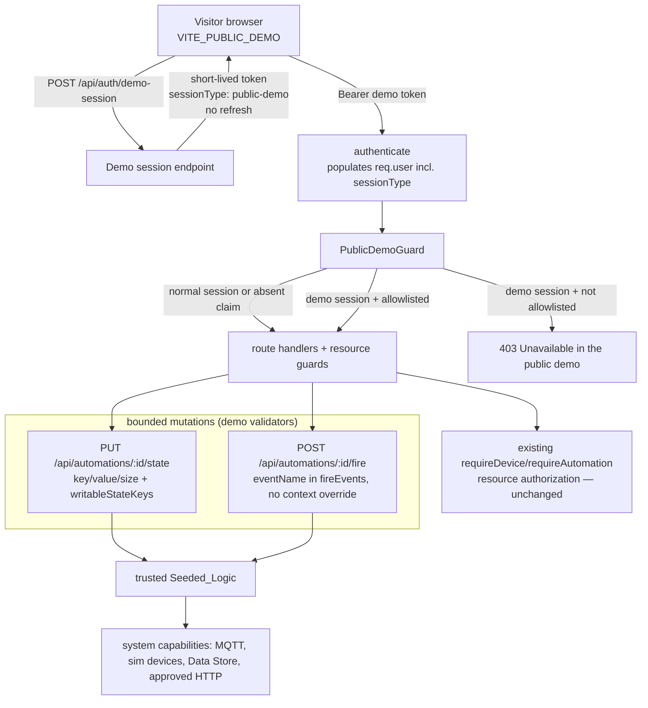

# Design Document: Public Demo Mode

## Overview

Public Demo Mode adds a fail-closed capability envelope for anonymous visitors
without forking Aeolus or weakening any existing control. It rests on four small,
well-isolated additions plus a deployment stack:

1. **One token claim** — `sessionType: "public-demo"` on the access token.
2. **One guard** — `PublicDemoGuard`, inserted after `authenticate` and before
   route handlers, that constrains demo sessions to an allowlist (`demo-policy`).
3. **Two bounded mutations** — demo-specific validators on the automation
   *state-write* and *fire* routes (the only visitor-writable surfaces).
4. **One seeded identity** — a minimally-privileged `demo` user/group, plus
   optional per-automation `demoAccess` metadata.

Everything else the requirements describe (reads, Data Store admin, MQTT,
connectors, system) is already gated by the existing fail-closed authorization
and simply stays denied; the guard makes that denial explicit and total for demo
sessions. Phase B wraps this in an isolated, disposable deployment.

The governing rule (requirements §33): *if a visitor could choose arbitrary code,
IDs, topics, URLs, credentials, durable public text or host behaviour → deny by
default; only bounded interactions against trusted seeded content are allowed.*

## Architecture



Key placement: the guard sits at the **app level** in `src/index.ts`, right after
`app.use(authenticate)` and before any `app.use("/api/...")`. Because
`authenticate` already runs first and public routes leave `req.user` undefined,
the guard's demo-branch only triggers for authenticated demo tokens; normal and
unauthenticated traffic pass straight through.

## Components and Interfaces

### 1. Token claim (`src/auth/token-service.ts`)

Extend the payload and thread the claim through every sign/verify site:

```ts
export interface AccessTokenPayload {
  userId: string;
  username: string;
  role: "admin" | "user";
  groupId: string | null;
  sessionType?: "normal" | "public-demo"; // absent ⇒ normal
}
```

- `generateAccessToken` includes `sessionType` when present.
- `verifyAccessToken` and `verifyAccessTokenWithExpiry` return it (defaulting to
  `"normal"` when absent).
- The `Express.Request.user` augmentation in `src/auth/auth-middleware.ts` gains
  `sessionType?: "normal" | "public-demo"`, and `authenticate` copies it onto
  `req.user`.

This is additive and backward compatible: existing tokens decode with
`sessionType` undefined → treated as normal everywhere.

### 2. Config (`src/config.ts`)

Add a `publicDemo` block following the existing plain-`process.env` pattern:

```ts
publicDemo: {
  enabled: process.env.AEOLUS_PUBLIC_DEMO === "true",      // default false
  sessionMinutes: parseInt(process.env.DEMO_SESSION_MINUTES || "120", 10),
  resetTime: process.env.DEMO_RESET_TIME || "03:30",
}
```

`enabled` is the single activation switch; nothing infers it from hostname or
`NODE_ENV`.

### 3. Demo session endpoint (`src/api/routes/auth.routes.ts`)

`POST /api/auth/demo-session`, added to `PUBLIC_ROUTES` (unauthenticated), behind
a dedicated `demoSessionRateLimiter` (~10/min/IP):

```ts
if (!config.publicDemo.enabled) throw new NotFoundError(); // inert when off
const demoUser = authService.getDemoUser();               // seeded 'demo'
const token = generateAccessToken({
  userId: demoUser.id, username: demoUser.username,
  role: "user", groupId: demoUser.groupId,
  sessionType: "public-demo",
}, { expiresInMinutes: config.publicDemo.sessionMinutes });
res.json({ accessToken: token });   // NO refresh token, NO cookie
```

`generateAccessToken` gains an optional expiry override so demo tokens can use
`DEMO_SESSION_MINUTES` instead of the 15-minute default. No refresh path is
wired, so demo sessions cannot be extended silently — the frontend re-requests a
session on expiry.

### 4. PublicDemoGuard + Demo_Policy (`src/demo/`)

Two new files:

- `src/demo/demo-policy.ts` — the allowlist as data.
- `src/demo/public-demo-guard.ts` — the middleware.

```ts
// demo-policy.ts
export interface DemoPolicyEntry {
  method: string;                 // "GET" | "POST" | "PUT"
  pattern: string;                // "/api/devices/:id/history"
  validate?: (req: Request) => void; // throws 4xx to reject; only for mutations
}

export const DEMO_POLICY: DemoPolicyEntry[] = [
  { method: "GET",  pattern: "/api/auth/me" },
  { method: "GET",  pattern: "/api/layout" },
  { method: "GET",  pattern: "/api/devices" },
  { method: "GET",  pattern: "/api/devices/:id" },
  { method: "GET",  pattern: "/api/devices/:id/history" },
  { method: "GET",  pattern: "/api/devices/:id/actions" },
  { method: "GET",  pattern: "/api/devices/:id/completion-tiers" },
  { method: "GET",  pattern: "/api/state" },
  { method: "GET",  pattern: "/api/automations" },
  { method: "GET",  pattern: "/api/automations/:id" },
  { method: "GET",  pattern: "/api/automations/:id/ui-module" },
  { method: "GET",  pattern: "/api/automations/:id/state" },
  { method: "GET",  pattern: "/api/automations/history" },
  { method: "GET",  pattern: "/api/data-store/collections" },
  { method: "GET",  pattern: "/api/data-store/collections/:name/records" },
  { method: "GET",  pattern: "/api/health" },
  { method: "GET",  pattern: "/api/system/version" },
  { method: "PUT",  pattern: "/api/automations/:id/state", validate: validateDemoStateWrite },
  { method: "POST", pattern: "/api/automations/:id/fire",  validate: validateDemoFire },
];
```

Pattern matching is a tiny segment matcher (split on `/`; a `:param` segment
matches any single non-empty segment) compiled once — no `path-to-regexp`
dependency, mirroring the existing exact-match `PUBLIC_ROUTES` approach but with
params. `req.path` and `req.method` are available at app-level middleware.

```ts
// public-demo-guard.ts
export function createPublicDemoGuard(cfg = config.publicDemo): RequestHandler {
  const matcher = compile(DEMO_POLICY);
  return (req, _res, next) => {
    if (!cfg.enabled || req.user?.sessionType !== "public-demo") return next();
    const entry = matcher.match(req.method, req.path);
    if (!entry) throw new ForbiddenError("Unavailable in the public demo");
    if (entry.validate) entry.validate(req); // throws 4xx on violation
    next();
  };
}
```

Wiring in `src/index.ts`:

```ts
app.use(authenticate);
app.use(createPublicDemoGuard());   // ← new, before all route mounts
// ...existing route mounts unchanged...
```

Because the guard runs before the route's own `requireAutomation`/`requireDevice`
guard, an allowlisted request still faces full resource authorization — the demo
envelope is strictly additive (Req 4.1, 4.5).

### 5. Bounded mutation validators (`src/demo/demo-validators.ts`)

```ts
const MAX_KEY = 64, MAX_VALUE_BYTES = 8 * 1024, MAX_KEYS = 100;

export function validateDemoStateWrite(req: Request): void {
  const ruleId = req.params.id;
  const { key, value } = req.body ?? {};
  if (typeof key !== "string" || key.length > MAX_KEY) throw new BadRequestError(...);
  if (Buffer.byteLength(JSON.stringify(value ?? null)) > MAX_VALUE_BYTES) throw new BadRequestError(...);
  const access = getDemoRuleAccess(ruleId);               // per-rule metadata
  if (access?.writableStateKeys && !access.writableStateKeys.includes(key))
    throw new ForbiddenError("Key not writable in the public demo");
  if (isNewKeyBeyondLimit(ruleId, key, MAX_KEYS)) throw new BadRequestError(...);
}

export function validateDemoFire(req: Request): void {
  const ruleId = req.params.id;
  const body = req.body ?? {};
  if ("context" in body) throw new ForbiddenError("Custom context not allowed in the public demo");
  const eventName = body.eventName;
  if (typeof eventName !== "string") throw new BadRequestError("eventName required");
  const access = getDemoRuleAccess(ruleId);
  if (access?.fireEvents && !access.fireEvents.includes(eventName))
    throw new ForbiddenError("Event not allowed in the public demo");
}
```

These validators encode the size/shape limits **for demo sessions only** — they
run from the guard, so normal sessions are unaffected. They complement (do not
replace) the route's own Zod validation and authorization.

### 6. Demo_Rule_Access metadata

Per-automation demo policy (`writableStateKeys`, `fireEvents`) is stored in a new
nullable `demo_access TEXT` (JSON) column on `automation_rules`, added by a
numbered migration under `src/db/migrations/`. It is seeded per demo rule and
read by the validators via a small `getDemoRuleAccess(ruleId)` accessor (cached
like other rule reads). When absent, the generic size/shape limits still apply,
but per-key/per-event allowlisting is the **preferred** stricter policy for any
publicly exposed control.

### 7. Rate & payload limits (`src/api/middleware/rate-limiter.ts`)

Add dedicated limiters (only meaningful under demo mode):

- `demoSessionRateLimiter` — ~10/min/IP on `/api/auth/demo-session`.
- `demoWriteRateLimiter` — ~60/min keyed by session (userId) on the state route.
- `demoFireRateLimiter` — ~30–60/min keyed by session on the fire route.
- A small `express.json({ limit })` (e.g. 16 KB) mounted specifically on the two
  demo mutation routes, below the global 1 MB.
- WebSocket: cap connection attempts per IP/session in the WS server.

All are application-level (Req 9.2) and independent of Cloudflare.

### 8. Seed (`scripts/seed/` + a demo tab set)

Extend the seed to provision the demo identity and per-rule access:

- Create `Public Demo` group and `demo` user (role `user`); grant the group
  `read`/`interact` on the seeded demo tabs only.
- Attach `demoAccess` metadata to each publicly interactive seeded automation.
- Reviewed flagship tabs (Agriculture, Escape Room, Stage/Show, Research Vessel,
  Mining, Spacecraft, Wildlife, Off-grid Bunker) using only trusted Logic/UI and
  simulated devices.

`authService` gains `getDemoUser()` (looks up the seeded demo user) used by the
session endpoint.

### 9. Frontend demo mode

- A `demoMode` flag from `VITE_PUBLIC_DEMO`; on load, if set, call
  `/api/auth/demo-session`, store the token, skip the login screen, open the
  default demo tab; on `401`/expiry, transparently re-request.
- A persistent `DemoBanner` component (simulated · shared · resets nightly + link
  to `aeolus.com.au`), and a build-SHA display.
- Hide admin/authoring surfaces when `demoMode` (reuse the existing `isAdmin`
  gating pattern plus a `demoMode` check): automation/Logic/UI editors, layout
  edit, connectors, MQTT security, security/users pages, system diagnostics,
  account/password, Data Store admin, destructive actions.
- A maintenance state shown during the reset window instead of raw connection
  errors.

### 10. Deployment (Phase B)

- `docker-compose.demo.yml`: `frontend`, `backend`, `mosquitto`, `cloudflared`;
  bridge network; `NODE_ENV=production`, `AEOLUS_PUBLIC_DEMO=true`; no host
  networking; no published `1883`/backend/DB ports; `no-new-privileges`, dropped
  capabilities, `mem_limit`/`cpus`; no Docker socket; `read_only` golden mount.
- Golden/active split under `/opt/aeolus-demo/{golden,data}`; backend mounts only
  `data/`. `scripts/reset-demo.sh` performs the orderly reset sequence;
  `scripts/demo-health-check.sh` gates availability. A cron (or systemd timer)
  runs the reset at `03:30` Australia/Sydney.
- `.github/workflows/` gains a `workflow_dispatch` "Deploy Aeolus Demo" and an
  admin-only "Reset Public Demo".
- Cloudflare Tunnel is the sole ingress.

## Data Models

```ts
// automation_rules: new nullable column
demo_access TEXT NULL   // JSON: { writableStateKeys?: string[]; fireEvents?: string[] }
```

```ts
// AccessTokenPayload (extended, optional)
sessionType?: "normal" | "public-demo"
```

No other schema changes. The demo user/group reuse existing `users` / `groups` /
`group_tab_assignments` tables.

## Correctness Properties

*A property is a characteristic that should hold across all valid executions.*

### Property 1: Demo sessions are confined to the allowlist (fail closed)

*For any* request carrying a `public-demo` token, the request reaches a handler
only if its (method, path) matches a `DEMO_POLICY` entry; every other
(method, path), including unknown/newly-added routes, is denied with `403`.

**Validates: Requirements 4.3, 4.4, 4.6, 8.***

### Property 2: The guard is strictly additive

*For any* request whose `sessionType` is normal or absent, `createPublicDemoGuard`
calls `next()` unconditionally and changes nothing; and *for any* allowlisted
demo request, the route's own resource authorization still executes.

**Validates: Requirements 4.1, 4.2, 4.5, 17.1, 17.3**

### Property 3: State writes are bounded

*For any* demo state write, persistence occurs only if key ≤ 64 chars, serialized
value ≤ 8 KB, the rule holds < 100 keys (or the key already exists), and — when
`writableStateKeys` is declared — the key is in that set; otherwise the store is
unchanged and a `4xx` is returned.

**Validates: Requirements 6.2, 6.3, 6.4**

### Property 4: Fire inputs are bounded

*For any* demo fire, the request is accepted only in `{eventName, payload?}` form
with `eventName` in the rule's `fireEvents` (when declared); any `context`
override or undeclared event is rejected, so trusted Seeded_Logic never receives
a visitor-chosen topic/device/state.

**Validates: Requirements 7.2, 7.3, 7.4, 11.2**

### Property 5: Normal installations are unchanged

*For any* execution with `AEOLUS_PUBLIC_DEMO=false`, the demo endpoint is
unavailable, the guard is a pass-through, and token/auth/authorization behaviour
is byte-for-byte the pre-feature behaviour.

**Validates: Requirements 1.1, 1.5, 17.***

### Property 6: Golden database is never mutated by the app

*For any* sequence of normal demo operations, the Golden_Database file is
unchanged; only the Active_Database is written.

**Validates: Requirements 13.2, 16.5**

## Error Handling

| Scenario | Handling | Result |
|---|---|---|
| Demo request to non-allowlisted route | guard throws `ForbiddenError` | 403 "Unavailable in the public demo" |
| Demo state write too large / bad key | validator throws `BadRequestError` | 400, store unchanged |
| Demo write to non-writable key | validator throws `ForbiddenError` | 403, store unchanged |
| Demo fire with `context` override | validator throws `ForbiddenError` | 403 |
| Demo fire undeclared event | validator throws `ForbiddenError`/`BadRequestError` | 403/400 |
| Demo-session endpoint when demo off | `NotFoundError` | 404 (inert) |
| Rate limit exceeded | limiter | 429 |
| Expired demo token | `authenticate` → `UnauthorizedError` | 401 → frontend re-requests session |
| Forged normal-JWT claim (bad signature) | `verifyAccessToken` throws | 401 |
| Reset window | frontend maintenance state | friendly maintenance page, no 500 |

No path returns `500`, crashes, or leaks host/secret state for hostile demo
input (Req 16.4).

## Testing Strategy

Follows the project stack (Vitest, supertest, fast-check; Playwright for
frontend flows). New backend suites under `src/__integration__/` and unit tests
beside the new `src/demo/` modules.

### Unit

| Area | File |
|---|---|
| Policy path/method matcher (params, fail-closed) | `src/demo/demo-policy.test.ts` |
| Guard: normal pass-through, demo allow/deny, validator invocation | `src/demo/public-demo-guard.test.ts` |
| State/fire validators (size, keys, writableStateKeys, context, events) | `src/demo/demo-validators.test.ts` |
| Token `sessionType` round-trip + default | `src/auth/token-service.test.ts` (extend) |

### Integration (production composition)

`src/__integration__/public-demo.integration.test.ts` — wires the app as
`index.ts` does with `AEOLUS_PUBLIC_DEMO=true` and a seeded demo identity, then
asserts the **allow matrix** (Req 16.1), the **deny matrix** (Req 16.2, every
Requirement 8 capability + arbitrary context + oversized value + unknown route),
and **fail-closed** for an unmapped route. A companion suite asserts that with
demo off, the same demo-shaped requests behave normally (Req 17).

### Adversarial

`src/__integration__/public-demo-adversarial.integration.test.ts` — hostile
client: route fuzzing, forged/expired tokens, hidden resource IDs, rapid fire,
oversized bodies, context overrides; expects only 4xx/429; asserts no 500.

### Reset (Phase B)

A scripted test (or CI job) that seeds golden, mutates active state, runs
`reset-demo.sh`, and asserts restoration + golden immutability (Req 16.5).

## Out of scope (per requirements §30)

Per-visitor isolation/containers/databases, multi-tenancy, registration,
persistent public accounts, public authoring/connector/MQTT/custom-UI, real
hardware, fleet management, autoscaling, Kubernetes. Simulated device actions
for demo sessions are deferred until explicitly declared safe and added to the
Demo_Policy.
