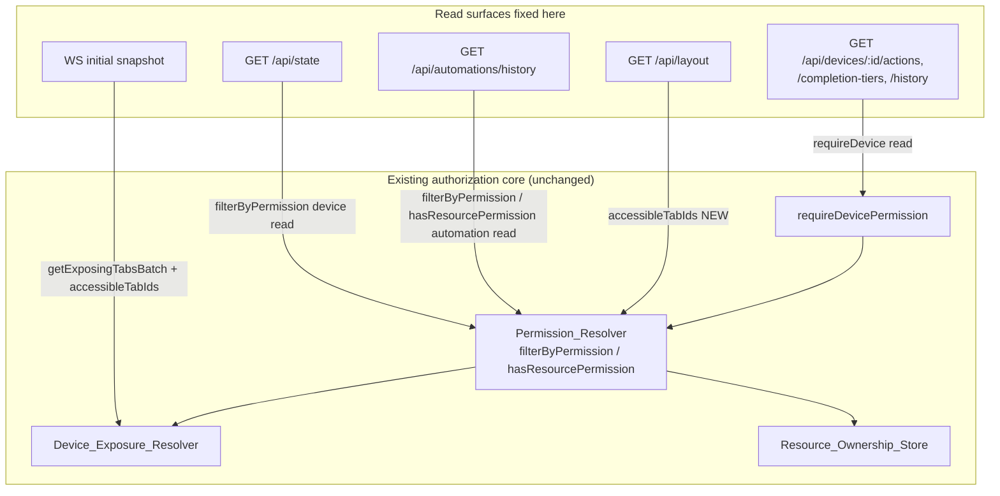

# Design: Read-Surface Authorization

## Overview

This feature applies the **existing** resource-authorization stack to seven read
surfaces that were left unfiltered by `resource-level-authorization`. There is no
new persisted state, no new table, and no new authorization concept. Every
decision reuses one of:

- `Permission_Resolver.filterByPermission(userId, kind, ids, "read")` — batch
  read filtering (already used by `GET /api/devices` and `GET /api/automations`);
- `Permission_Resolver.hasResourcePermission(userId, kind, id, "read")` — single
  resource read check (already used by `canReadAutomation` and `GET /api/devices/:id`);
- `requireDevicePermission("read", deps)` — the device route guard (already used
  by `POST /api/devices/:id/action` at `interact`);
- `Device_Exposure_Resolver.getExposingTabsBatch(ids)` + the client's accessible
  tabs — the exact rule the live WebSocket device broadcast already uses.

The single genuinely new primitive is a server-side **Accessible_Tabs** lookup on
the `Permission_Resolver`, used only to filter the layout endpoint. It reads the
same `group_tab_assignments` rows the resolver already reads.

The guiding principle, inherited from the previous feature: **authorization is
derived from server-side resource identity and the user's server-side group
assignments — never from a caller-supplied tab identifier.** Admins bypass at the
route level, exactly as the existing device/automation list routes do.

## Architecture



## Components and Interfaces

### 1. Permission_Resolver — new `accessibleTabIds`

Add one method to the existing `PermissionResolver` interface and its factory in
`src/auth/permission-resolver.ts`:

```ts
export interface PermissionResolver {
  // ...existing methods unchanged...

  /**
   * The tab ids on which the user's group holds any permission level (i.e. at
   * least `read`). Empty when the user has no group. Derived solely from
   * group_tab_assignments; reads no tab id from the request. Admins are handled
   * at the call site (they see all tabs), not here.
   */
  accessibleTabIds(userId: string): string[];
}
```

Implementation reuses the existing private helpers `getUserGroupId` and
`groupRankByTab`:

```ts
function accessibleTabIds(userId: string): string[] {
  const groupId = getUserGroupId(userId);
  if (groupId === null) return [];
  return Array.from(groupRankByTab(groupId).keys());
}
```

`groupRankByTab` already maps every assigned tab to its rank, so its key set is
exactly "tabs the group has any assignment on". This is DB-handle-consistent
(`dbOverride`-aware) with the rest of the resolver, so tests using an injected
database work without touching the `getDatabase()` singleton.

> **Why not reuse `permission-service.getUserAccessibleTabs`?** That helper reads
> the `getDatabase()` singleton, which diverges from the injected test database
> the route factories use. Keeping the lookup on the resolver keeps all
> permission DB access behind one `dbOverride`-aware component and matches how the
> device/automation list routes already resolve permissions.

### 2. `GET /api/state` — device read filtering

`createStateRoutes` gains a `PermissionResolver` parameter and mirrors
`GET /api/devices`:

```ts
export function createStateRoutes(
  registry: DeviceRegistry,
  resolver: PermissionResolver,
): Router {
  router.get("/", (req, res) => {
    const all = registry.getAll();
    const visible =
      req.user?.role === "admin"
        ? all
        : (() => {
            const readable = new Set(
              resolver.filterByPermission(
                req.user?.userId ?? "",
                "device",
                all.map((d) => d.id),
                "read",
              ),
            );
            return all.filter((d) => readable.has(d.id));
          })();

    const state: Record<string, unknown> = {};
    for (const device of visible) state[device.id] = device;
    res.json(state);
  });
}
```

This guarantees R1.5 (same device set as `GET /api/devices`) because both call
`filterByPermission(..., "device", ..., "read")` on the same inventory.

### 3. WebSocket initial snapshot — scoped to Client_Observable_Devices

The live broadcast path already computes device visibility as
`canObserve(client, { visibility: "tabs", tabIds: deviceExposureResolver.getExposingTabs(deviceId) })`.
The snapshot must use the **same rule** so the two agree (R2.3).

`WsServer` gains a `Device_Exposure_Resolver` dependency (constructor parameter).
In `authenticateAndSetup`, after building the `client` (which already carries
`accessibleTabIds` and `role`), the snapshot is filtered:

```ts
const devices = registry.getAll();
const snapshot: Record<string, Device> = {};
if (client.role === "admin") {
  for (const d of devices) snapshot[d.id] = d;
} else {
  const exposingByDevice = this.deviceExposureResolver.getExposingTabsBatch(
    devices.map((d) => d.id),
  );
  for (const d of devices) {
    const tabs = exposingByDevice.get(d.id) ?? [];
    if (canObserve(client, { visibility: "tabs", tabIds: tabs })) {
      snapshot[d.id] = d;
    }
  }
}
this.send(ws, { type: "snapshot", data: snapshot });
```

`canObserve` already returns `true` for admins and for a tab intersection with
`client.accessibleTabIds`, so reusing it keeps the snapshot rule identical to the
live path by construction. A single batch call avoids N pane reloads.

> **Why the exposure resolver rather than `filterByPermission`?** The live device
> broadcast is scoped by `accessibleTabIds ∩ exposingTabs`. Using the same inputs
> for the snapshot makes snapshot/live consistency (R2.3) true by construction
> rather than by coincidence. The result is equivalent to
> `filterByPermission(read)` because any group assignment implies at least `read`.

### 4. Device auxiliary reads — `requireDevice("read")`

The composition root already builds `requireDevice = (level) =>
requireDevicePermission(level, { resolver, exists })`. `createDeviceRoutes`
already receives `requireDevice`. Apply it as route middleware:

```ts
router.get("/:id/actions",          requireDevice("read"), handler);
router.get("/:id/completion-tiers", requireDevice("read"), handler);
router.get("/:id/history",          requireDevice("read"), handler);
```

`requireDevicePermission` already implements the exact semantics R3 needs:
401 → admin bypass → 404-before-403 (via the injected `exists` predicate) →
`hasResourcePermission("device", id, "read")` → 403 or proceed. The handlers keep
their own existence/`501`/empty-history branches for the admin-and-exists path;
those now run only after the guard has authorized the request.

`DELETE /:id/history` and `DELETE /history/all` keep `requireAdmin` unchanged
(R3.6).

**Ordering note:** these routes are registered with the `:id` path parameter, so
the guard reads `req.params.id` correctly. `DELETE /history/all` is a distinct
literal path and continues to be matched independently.

### 5. `GET /api/automations/history` — resource filtering

The automation routes already close over `executionLog`, the `resolver`, and the
`canReadAutomation(req, id)` helper. The handler becomes:

```ts
router.get("/history", (req, res) => {
  const limit = req.query.limit !== undefined ? Number(req.query.limit) : undefined;
  const ruleId = req.query.ruleId as string | undefined;
  const isAdmin = req.user?.role === "admin";

  if (ruleId) {
    if (!canReadAutomation(req, ruleId)) {        // admin → true; else read check
      res.status(403).json({ error: "Forbidden" });
      return;
    }
    let entries = executionLog.getByRuleId(ruleId);
    if (limit !== undefined && limit >= 0) entries = entries.slice(0, limit);
    res.json(entries);
    return;
  }

  if (isAdmin) {
    res.json(executionLog.list(limit));
    return;
  }

  // Non-admin global list: filter by readable rule, THEN limit (R4.5).
  const all = executionLog.list();                 // newest-first, unlimited
  const ruleIds = [...new Set(all.map((e) => e.ruleId))];
  const readable = new Set(
    resolver.filterByPermission(req.user?.userId ?? "", "automation", ruleIds, "read"),
  );
  let entries = all.filter((e) => readable.has(e.ruleId));
  if (limit !== undefined && limit >= 0) entries = entries.slice(0, limit);
  res.json(entries);
});
```

`canReadAutomation` already returns `true` for admins and otherwise calls
`hasResourcePermission("automation", id, "read")`, giving R4.2/R4.3/R4.4 for the
`ruleId` form. The global form dedupes rule ids, filters them once with
`filterByPermission`, and filters entries against the readable set. Filtering
before slicing satisfies R4.5.

### 6. `GET /api/layout` — tab/pane filtering

`createLayoutRoutes` gains a `PermissionResolver` parameter. The read handler
filters after loading rows:

```ts
router.get("/", (req, res) => {
  // ...load tabRows, paneRows, map to tabs[]/panes[] as today...
  if (req.user?.role === "admin") {
    res.json({ tabs, panes });
    return;
  }
  const accessible = new Set(resolver.accessibleTabIds(req.user?.userId ?? ""));
  res.json({
    tabs: tabs.filter((t) => accessible.has(t.id)),
    panes: panes.filter((p) => accessible.has(p.tabId)),
  });
});
```

`PUT /api/layout` is untouched (still `requireAdmin`). A non-admin with no group
gets an empty accessible set → empty `tabs`/`panes` (R5.4). This matches the
frontend, which already hides tabs a user cannot access.

## Data Models

No schema changes. All reads use existing tables: `devices` (via the registry),
`panes` and `tabs`, `group_tab_assignments`, `automation_tab_assignments`, and
`automation_rules.owner_tab_id` (through the existing resolvers). No migration.

## Composition Root Wiring

`src/index.ts` and `src/__test-helpers__/app-factory.ts` already build
`permissionResolver`, `deviceExposureResolver`, and `requireDevice`. Wiring
changes are limited to passing existing objects into three factories and the WS
server:

- `createStateRoutes(registry, permissionResolver)`
- `createLayoutRoutes(db, permissionResolver)`
- `new WsServer(server, registry, eventBus, WS_MAPPINGS, deviceExposureResolver)`
- device routes: apply `requireDevice("read")` to the three aux routes (already
  receives `requireDevice`)
- automation routes: no new dependency (already receives `resolver` and
  `executionLog`)

## Error Handling

- Device aux reads: `requireDevicePermission` throws `NotFoundError` (404) /
  `ForbiddenError` (403) via the existing error handler, and logs the fail-closed
  denial at `warn` with `{ userId, kind, resourceId }` — identical to the other
  device routes.
- Automation history `ruleId` denial: `403 { error: "Forbidden" }`, matching the
  existing `GET /:id/ui-module` denial shape in the same file.
- State / snapshot / layout / automation global list: filtering never errors; an
  empty result is a normal `200` (or an empty snapshot map).

## Testing Strategy

Unit/route tests per surface (Vitest + the in-memory DB + `createTestApp`), plus
targeted WS tests. Non-admin vs admin vs missing-resource matrices, mirroring the
existing `resource-level-authorization` route tests. Property tests are not
required here because the underlying resolvers are already property-tested; these
are integration/wiring assertions over the already-verified core.

Key cases:
- **State:** admin sees all; non-admin sees exactly their readable devices and
  the set equals `GET /api/devices` for the same user; no-group → `{}`.
- **Snapshot:** admin snapshot = all devices; non-admin snapshot = observable
  devices; snapshot device set equals the set for which a live `state-change`
  broadcast reaches the client (consistency); no-observable → empty map.
- **Device aux reads:** for each of the three routes, non-admin gets 404 (missing),
  403 (exists, no read), 200 (exists, read); admin always proceeds (404 only when
  missing); destructive history routes stay admin-only.
- **Automation history:** non-admin global list filtered to readable rules;
  filter-before-limit honored; `ruleId` form 403/200 by read permission; admin
  unfiltered.
- **Layout:** admin sees all tabs/panes; non-admin sees only accessible tabs and
  their panes; no-group → empty arrays; `PUT` still admin-only.
- **Resolver:** `accessibleTabIds` returns the group's assigned tabs and `[]` for
  a groupless user, under an injected DB.

## Design Decisions

1. **Reuse, don't rebuild.** Every surface routes through an existing resolver or
   guard. The only addition is `accessibleTabIds`, and even that reuses the
   resolver's existing private helpers. This keeps the security model in one place
   and avoids a second, divergent authorization path.
2. **Snapshot reuses the live rule, not `filterByPermission`.** Consistency
   between the snapshot and live device events (R2.3) is the explicit goal, so the
   snapshot is scoped with the same `getExposingTabs`-plus-`canObserve` inputs the
   broadcast path uses. The outcome equals a `read` filter but is consistent by
   construction.
3. **Admin bypass at the call site.** Matching the existing device/automation list
   routes, admins are short-circuited in each handler/guard before any resolver
   work, so admin behavior is provably unchanged.
4. **Filter before limit for the automation global list.** Applying the read
   filter before the limit prevents a non-admin from receiving fewer than `limit`
   readable entries just because unreadable entries occupied the newest slots.
5. **Filtered single layout endpoint, not a split endpoint.** Either option is
   reasonable; per-user filtering of the existing endpoint is smaller,
   keeps one client contract, and matches the frontend's existing tab-access
   filtering.
