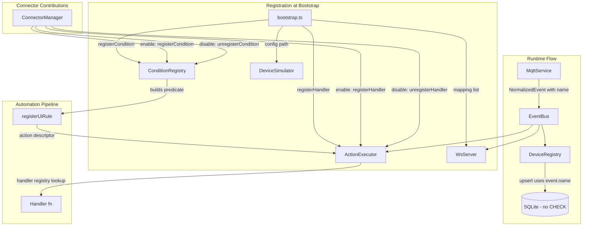

# Design Document: Remove Hardcoded Restrictions

## Overview

This design removes all hardcoded restrictions from Aeolus's downstream components, replacing fixed switch statements, union types, and inline lists with open registries and data-driven configuration. The guiding principle is: **everything is registered the same way** — no "built-in vs custom" distinction.

The changes span seven areas:
1. Database schema — remove CHECK constraint on device type
2. Action executor — replace switch/case with a handler registry
3. Condition evaluator — replace if/else chain with a factory registry
4. WebSocket server — replace hardcoded event listeners with a data-driven mapping list
5. Device simulator — replace hardcoded device array with a JSON config file
6. Device registry + MQTT service — flow ParsedTopic.name into NormalizedEvent
7. Connector module — allow connectors to contribute action handlers and condition factories

## Architecture



The architecture is intentionally flat. Each registry is a simple `Map<string, handler>`. No plugin system, no lifecycle hooks, no abstract base classes. Registration happens at bootstrap for built-in handlers, and dynamically when connectors are enabled/disabled. Runtime dispatch is always a map lookup.

## Components and Interfaces

### 1. ActionExecutor (refactored)

```typescript
/** A handler function that executes a single action type */
export type ActionHandler = (
  action: ActionDescriptor,
  ruleId: string,
  deps: ActionExecutorDeps,
) => void | Promise<void>;

/** Action descriptor — type is now any string */
export interface ActionDescriptor {
  type: string;
  target: string;
  params: Record<string, unknown>;
}

export class ActionExecutor {
  private handlers = new Map<string, ActionHandler>();
  private deps: ActionExecutorDeps;

  constructor(deps: ActionExecutorDeps) { ... }

  /** Register a handler for an action type. Overwrites if already registered. */
  registerHandler(type: string, handler: ActionHandler): void {
    this.handlers.set(type, handler);
  }

  /** Unregister a handler for an action type. No-op if not registered. */
  unregisterHandler(type: string): void {
    this.handlers.delete(type);
  }

  /** Dispatch an action. Looks up handler by type, warns if missing. */
  async execute(action: ActionDescriptor, ruleId: string): Promise<void> {
    const handler = this.handlers.get(action.type);
    if (!handler) {
      this.deps.logger.warn({ ruleId, actionType: action.type }, `No handler for action type: ${action.type}`);
      return;
    }
    try {
      await handler(action, ruleId, this.deps);
      eventBus.emit(AUTOMATION_FIRED, { ... });
    } catch (err) { ... }
  }
}
```

At bootstrap, the six existing handlers (publish, toggle, device_action, log, delay, webhook) are registered via `registerHandler()`.

### 2. ConditionRegistry (new module)

```typescript
/** A factory that builds a condition predicate from a condition_value string */
export type ConditionFactory = (conditionValue: string) => (ctx: EventContext) => boolean;

export class ConditionRegistry {
  private factories = new Map<string, ConditionFactory>();

  registerCondition(type: string, factory: ConditionFactory): void {
    this.factories.set(type, factory);
  }

  /** Unregister a condition factory. No-op if not registered. */
  unregisterCondition(type: string): void {
    this.factories.delete(type);
  }

  /** Build a condition predicate. Returns undefined if type is unregistered. */
  buildCondition(type: string | null, value: string | null): ((ctx: EventContext) => boolean) | undefined {
    if (!type || !value) return undefined;
    const factory = this.factories.get(type);
    if (!factory) {
      logger.warn({ conditionType: type }, `No factory for condition type: ${type}`);
      return undefined;
    }
    return factory(value);
  }
}
```

At bootstrap, the three existing condition types are registered:
- `value_above` → `(v) => (ctx) => Number(ctx.state.value) > Number(v)`
- `value_below` → `(v) => (ctx) => Number(ctx.state.value) < Number(v)`
- `equals` → `(v) => (ctx) => String(ctx.state.value) === v`

### 3. WsServer (refactored)

```typescript
/** Maps an internal event bus event to a WebSocket message type string */
export interface WsEventMapping {
  eventName: string;
  messageType: string;
}

export class WsServer {
  constructor(
    server: Server,
    registry: DeviceRegistry,
    eventBus: EventEmitter,
    mappings: WsEventMapping[],
  ) {
    // ... connection handling (unchanged) ...

    // Data-driven broadcast registration
    for (const { eventName, messageType } of mappings) {
      eventBus.on(eventName, (data: unknown) => {
        this.broadcast({ type: messageType, data });
      });
    }
  }
}
```

The current four mappings become a list passed in at construction:
```typescript
const WS_MAPPINGS: WsEventMapping[] = [
  { eventName: WS_STATE_CHANGE, messageType: "state-change" },
  { eventName: MQTT_RAW_MESSAGE, messageType: "mqtt-message" },
  { eventName: AUTOMATION_FIRED, messageType: "automation-fired" },
  { eventName: AUTOMATION_STATE_CHANGE, messageType: "automation-state" },
];
```

### 4. DeviceSimulator (refactored)

```typescript
/** JSON config schema for a simulated device */
export interface SimDeviceConfig {
  topic: string;
  deviceId: string;
  deviceType: string;
  intervalMs: number;
  generator: GeneratorConfig;
}

export type GeneratorConfig =
  | { type: "drift"; min: number; max: number; step: number; initial: number; key?: string }
  | { type: "toggle"; key?: string }
  | { type: "random_boolean"; probability?: number; key?: string };

export class DeviceSimulator {
  constructor(eventBus: EventEmitter, configPath: string) { ... }

  start(): void {
    const configs = this.loadConfig();
    for (const config of configs) {
      this.startDevice(config);
    }
  }

  private loadConfig(): SimDeviceConfig[] {
    // Read and parse JSON file; warn and return [] if missing/invalid
  }
}
```

A default config file ships at `data/simulator-devices.json` containing the current 7 devices.

### 5. Database Schema (migration)

```typescript
function initSchema(database: Database): void {
  // New table creation — no CHECK constraint
  database.run(`
    CREATE TABLE IF NOT EXISTS devices (
      id TEXT PRIMARY KEY,
      name TEXT NOT NULL,
      type TEXT NOT NULL,
      capabilities TEXT NOT NULL DEFAULT '[]',
      state TEXT NOT NULL DEFAULT '{}',
      integration TEXT NOT NULL DEFAULT 'mqtt',
      last_seen INTEGER NOT NULL
    );
  `);

  // Migration for existing databases
  migrateRemoveTypeCheck(database);
}

function migrateRemoveTypeCheck(database: Database): void {
  // SQLite doesn't support ALTER TABLE DROP CONSTRAINT.
  // Strategy: check if the CHECK exists via sqlite_master, and if so,
  // recreate the table without it (rename → create → copy → drop old).
}
```

### 6. NormalizedEvent + DeviceRegistry + MqttService

```typescript
// types.ts — add optional name
export interface NormalizedEvent {
  deviceId: string;
  deviceType: DeviceType;
  state: Record<string, unknown>;
  topic: string;
  timestamp: number;
  integration?: string;
  name?: string;  // NEW — populated from ParsedTopic.name
}
```

**MqttService.handleMessage** populates `name`:
```typescript
const event: NormalizedEvent = {
  deviceId: parsed.deviceId,
  deviceType: parsed.deviceType,
  state,
  topic,
  timestamp: Date.now(),
  name: parsed.name,  // NEW
};
```

**DeviceRegistry.upsert** uses `event.name` when present:
```typescript
const device: Device = existing
  ? { ...existing, state: { ...existing.state, ...event.state }, lastSeen: event.timestamp }
  : {
      id: event.deviceId,
      name: event.name ?? this.deriveNameFromId(event.deviceId),  // name from event, fallback to derivation
      type: event.deviceType,
      ...
    };
```

### 7. ConnectorModule (extended)

The `ConnectorModule` interface gains two optional fields that allow connectors to contribute action handlers and condition factories:

```typescript
import type { ActionHandler } from "../automations/action-executor.js";
import type { ConditionFactory } from "../automations/condition-registry.js";

export interface ConnectorModule {
  metadata: ConnectorMetadata;
  configSchema: ConnectorConfigSchema;
  createConnector: (config: Record<string, unknown>) => Connector;
  snippets?: SnippetDescriptor[];

  /** Optional action handlers contributed by this connector. */
  actionHandlers?: Record<string, ActionHandler>;

  /** Optional condition factories contributed by this connector. */
  conditions?: Record<string, ConditionFactory>;
}
```

Both fields are entirely optional. Connectors that don't export them continue to work exactly as before.

### 8. ConnectorManager (extended enable/disable)

The `ConnectorManager` constructor gains references to `ActionExecutor` and `ConditionRegistry` so it can register/unregister contributed handlers:

```typescript
export class ConnectorManager {
  private instances = new Map<string, ManagedInstance>();
  /** Tracks which action handler types each instance contributed, for cleanup on disable. */
  private contributedHandlers = new Map<string, string[]>();
  /** Tracks which condition types each instance contributed, for cleanup on disable. */
  private contributedConditions = new Map<string, string[]>();

  constructor(
    private readonly registry: ConnectorRegistry,
    private readonly store: ConnectorStore,
    private readonly deviceRegistry: DeviceRegistry,
    private readonly eventBus: EventEmitter,
    private readonly actionExecutor: ActionExecutor,
    private readonly conditionRegistry: ConditionRegistry,
  ) {}
}
```

**Updated `enable()` flow** — after connecting and discovering devices, register contributed handlers/conditions:

```typescript
async enable(connectorType: string, config: Record<string, unknown>): Promise<string> {
  const mod = this.registry.getModule(connectorType);
  // ... existing validation, instantiation, connect, discover ...

  // Register contributed action handlers
  if (mod.actionHandlers) {
    const types = Object.keys(mod.actionHandlers);
    for (const [type, handler] of Object.entries(mod.actionHandlers)) {
      this.actionExecutor.registerHandler(type, handler);
    }
    this.contributedHandlers.set(instanceId, types);
  }

  // Register contributed condition factories
  if (mod.conditions) {
    const types = Object.keys(mod.conditions);
    for (const [type, factory] of Object.entries(mod.conditions)) {
      this.conditionRegistry.registerCondition(type, factory);
    }
    this.contributedConditions.set(instanceId, types);
  }

  // ... persist, start polling, return instanceId ...
}
```

**Updated `disable()` flow** — before disconnecting, unregister contributed handlers/conditions:

```typescript
async disable(instanceId: string): Promise<void> {
  const instance = this.instances.get(instanceId);
  // ... existing validation ...

  // Unregister contributed action handlers
  const handlerTypes = this.contributedHandlers.get(instanceId);
  if (handlerTypes) {
    for (const type of handlerTypes) {
      this.actionExecutor.unregisterHandler(type);
    }
    this.contributedHandlers.delete(instanceId);
  }

  // Unregister contributed condition factories
  const conditionTypes = this.contributedConditions.get(instanceId);
  if (conditionTypes) {
    for (const type of conditionTypes) {
      this.conditionRegistry.unregisterCondition(type);
    }
    this.contributedConditions.delete(instanceId);
  }

  // ... existing: stop polling, disconnect, dispose, remove devices, update store ...
}
```

The same registration logic applies in `restoreFromStore()` so that contributed handlers/conditions are re-registered on application restart.

## Data Models

### SimDeviceConfig (JSON schema)

```json
{
  "devices": [
    {
      "topic": "sensor/kitchen/temp",
      "deviceId": "sensor-kitchen-temp",
      "deviceType": "sensor",
      "intervalMs": 5000,
      "generator": {
        "type": "drift",
        "min": 18,
        "max": 28,
        "step": 0.3,
        "initial": 22.0,
        "key": "value"
      }
    },
    {
      "topic": "switch/desk",
      "deviceId": "switch-desk",
      "deviceType": "switch",
      "intervalMs": 20000,
      "generator": {
        "type": "toggle",
        "key": "on"
      }
    },
    {
      "topic": "motion/hallway",
      "deviceId": "motion-hallway",
      "deviceType": "sensor",
      "intervalMs": 8000,
      "generator": {
        "type": "random_boolean",
        "probability": 0.3,
        "key": "value"
      }
    }
  ]
}
```

### WsEventMapping

```typescript
interface WsEventMapping {
  eventName: string;   // Internal event bus event name
  messageType: string; // WebSocket message type sent to clients
}
```

### Handler and Factory Registries

Both are simple `Map<string, Function>` instances — no persistence, no serialization. They exist only in memory and are populated at bootstrap and dynamically when connectors are enabled/disabled.

### Contributed Handler Tracking

The `ConnectorManager` maintains two internal maps to track which handler/condition types each connector instance contributed:

```typescript
// Map<instanceId, handlerTypeKeys[]>
contributedHandlers: Map<string, string[]>
// Map<instanceId, conditionTypeKeys[]>
contributedConditions: Map<string, string[]>
```

These are not persisted — they are rebuilt from the connector module's exports during `restoreFromStore()` on startup.

## Correctness Properties

*A property is a characteristic or behavior that should hold true across all valid executions of a system — essentially, a formal statement about what the system should do. Properties serve as the bridge between human-readable specifications and machine-verifiable correctness guarantees.*

### Property 1: Database accepts any non-empty device type string

*For any* non-empty string used as a device type, inserting a device row with that type into the database SHALL succeed without error and the row SHALL be retrievable with the same type value.

**Validates: Requirements 1.1, 1.2**

### Property 2: Action executor dispatches to registered handler

*For any* action type string that has a registered handler, calling `execute()` with an ActionDescriptor of that type SHALL invoke exactly that handler and no other.

**Validates: Requirements 2.1, 2.3**

### Property 3: Action executor warns on unregistered action type

*For any* action type string that has NO registered handler, calling `execute()` SHALL log a warning containing the unrecognised action type and the rule ID, and SHALL not throw.

**Validates: Requirements 2.4**

### Property 4: Condition evaluator uses registered factory

*For any* condition type string that has a registered factory, calling `buildCondition()` with that type and a value SHALL return a predicate produced by that factory.

**Validates: Requirements 3.1, 3.3**

### Property 5: Condition evaluator returns undefined for unregistered type

*For any* condition type string that has NO registered factory, calling `buildCondition()` SHALL return undefined and log a warning containing the unrecognised condition type.

**Validates: Requirements 3.4**

### Property 6: WebSocket server registers a listener for every mapping

*For any* list of WsEventMapping entries provided at construction, the WebSocket server SHALL register a broadcast listener on the event bus for each entry's eventName, and emitting that event SHALL produce a broadcast with the corresponding messageType.

**Validates: Requirements 4.2, 4.3**

### Property 7: Simulator creates devices from JSON config

*For any* valid JSON configuration file containing device definitions, the Device Simulator SHALL create exactly one simulated device per entry, emitting events on the specified topic with the specified deviceId and deviceType.

**Validates: Requirements 5.1, 5.2**

### Property 8: Simulator generators produce type-conforming values

*For any* generator configuration of type "drift" with min/max bounds, the generated numeric value SHALL always be within [min, max]. *For any* generator of type "toggle" or "random_boolean", the generated value SHALL always be a boolean.

**Validates: Requirements 5.3, 5.4**

### Property 9: MQTT service populates NormalizedEvent.name from ParsedTopic

*For any* valid MQTT topic that parseTopic can parse, the NormalizedEvent produced by the MQTT service's message handler SHALL have its `name` field equal to `parseTopic(topic).name`.

**Validates: Requirements 6.2**

### Property 10: Device registry uses event.name when present

*For any* NormalizedEvent with a non-undefined `name` field, upserting a new device SHALL produce a device whose `name` equals the event's `name` field.

**Validates: Requirements 6.3**

### Property 11: Device registry falls back to ID-derived name when name absent

*For any* NormalizedEvent with an undefined `name` field, upserting a new device SHALL produce a device whose `name` is derived from the deviceId (splitting on hyphens, title-casing segments).

**Validates: Requirements 6.4**

### Property 12: Connector enable registers contributed action handlers

*For any* connector module that exports an `actionHandlers` map, enabling that connector SHALL register every handler in the map with the ActionExecutor, and subsequently disabling that connector SHALL unregister all of those handlers.

**Validates: Requirements 7.3, 7.5**

### Property 13: Connector enable registers contributed condition factories

*For any* connector module that exports a `conditions` map, enabling that connector SHALL register every factory in the map with the ConditionRegistry, and subsequently disabling that connector SHALL unregister all of those factories.

**Validates: Requirements 7.4, 7.6**

## Error Handling

| Scenario | Behaviour |
|----------|-----------|
| Unknown action type in `execute()` | Log warning with type + ruleId, return without throwing |
| Unknown condition type in `buildCondition()` | Log warning, return `undefined` (rule fires unconditionally) |
| Simulator config file missing/unreadable | Log warning, start with zero simulated devices |
| Simulator config file has invalid JSON | Log warning with parse error, start with zero devices |
| Simulator config entry has invalid generator type | Log warning for that entry, skip it, continue with others |
| Database migration fails (table recreation) | Log error, throw — application cannot start with broken schema |
| Handler throws during `execute()` | Catch, log error with ruleId + action type, continue to next action |
| Connector exports `actionHandlers` with a type that conflicts with a bootstrap handler | Overwrites the existing handler (last-write-wins); log info noting the override |
| Connector exports `conditions` with a type that conflicts with a bootstrap factory | Overwrites the existing factory (last-write-wins); log info noting the override |
| Connector disable called but contributed handler was already overwritten by another connector | `unregisterHandler` deletes whatever is at that key; no error |

## Testing Strategy

### Property-Based Tests (fast-check)

Each correctness property above maps to a single property-based test with minimum 100 iterations. Tests use `fast-check` (already available in the Node.js ecosystem, pairs with vitest).

**Tag format:** `Feature: remove-hardcoded-restrictions, Property N: <title>`

Key generators needed:
- `arbitraryNonEmptyString` — for device types, action types, condition types
- `arbitraryActionDescriptor` — random type + target + params
- `arbitrarySimDeviceConfig` — random valid simulator config entries
- `arbitraryNormalizedEvent` — with and without `name` field
- `arbitraryWsEventMapping` — random event name + message type pairs
- `arbitraryConnectorModuleWithHandlers` — random connector module with varying `actionHandlers` and `conditions` maps

### Unit Tests (example-based)

- Database migration: create DB with old CHECK, run init, verify arbitrary types work
- Bootstrap registration: verify all 6 action handlers and 3 condition factories are registered
- Simulator missing file: verify warning logged, no crash
- Default config file: verify it exists and is valid JSON matching the schema
- WsServer source: verify no hardcoded `eventBus.on` calls (static check)
- Connector without actionHandlers/conditions: enable succeeds, no handlers/conditions registered
- Connector with actionHandlers: verify handlers are callable via ActionExecutor after enable
- Connector disable: verify contributed handlers are no longer dispatched after disable

### Integration Tests

- End-to-end: publish MQTT message with novel device type → verify device appears in registry with correct name and type → verify WebSocket broadcast received
- Automation pipeline: create rule with custom condition type (after registering factory) → trigger → verify action fires

### Test Configuration

- Framework: vitest (already configured in project)
- PBT library: fast-check
- Minimum iterations: 100 per property test
- Each property test references its design document property number in a comment
