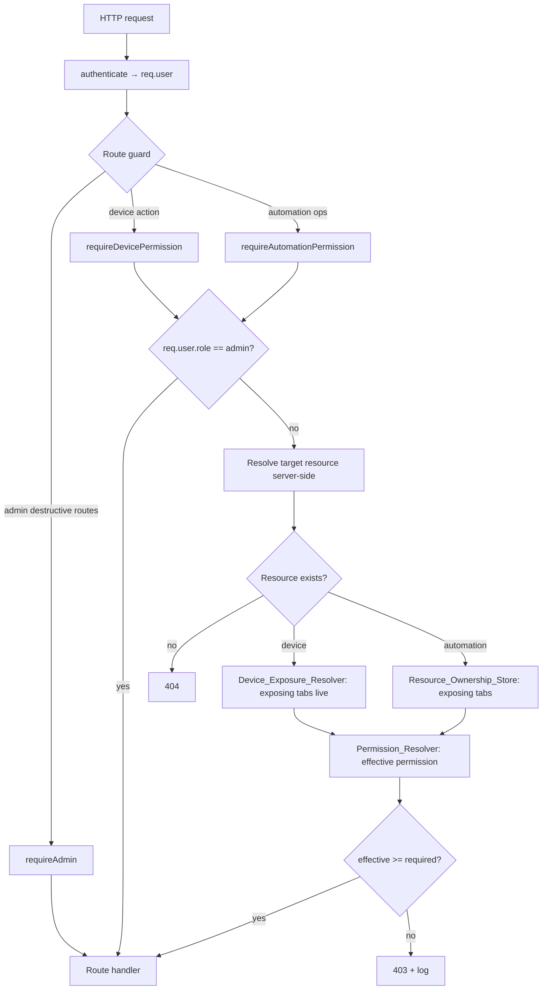
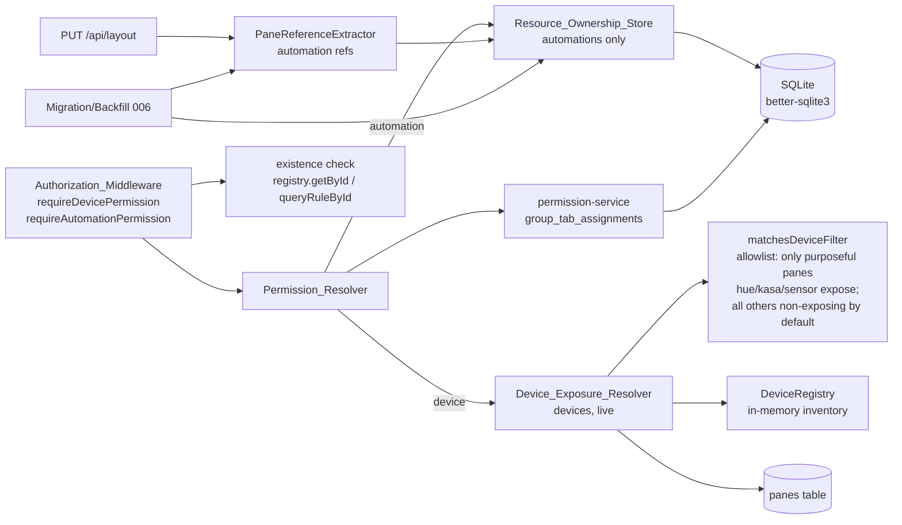
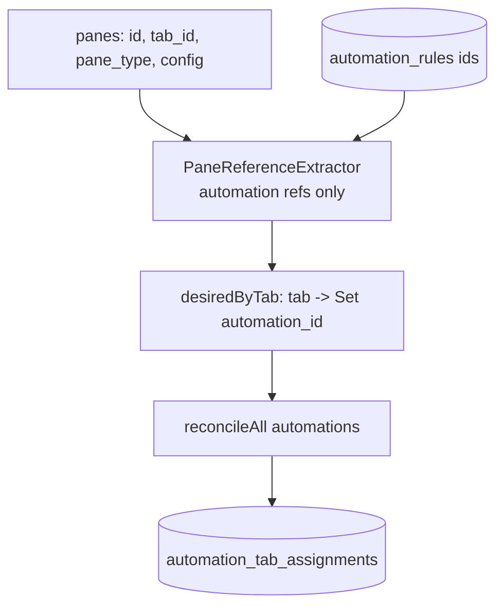
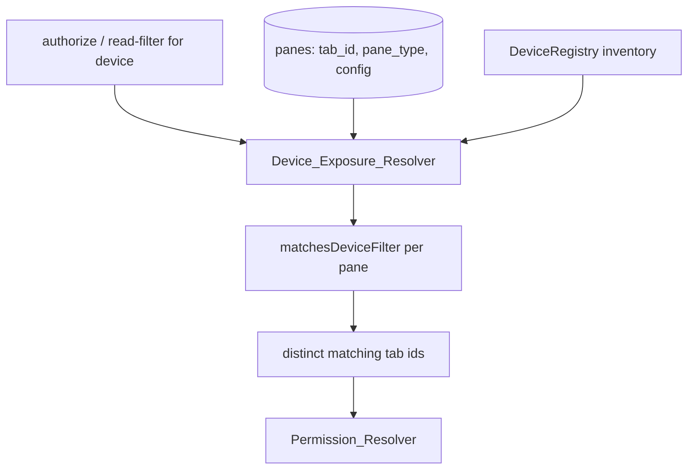

# Design Document

## Overview

This feature closes an authorization bypass in Aeolus. Today, protected device and
automation routes are guarded by `requireTabPermission(level)`
(`src/auth/auth-middleware.ts`), which reads a tab identifier straight from the
request (`req.params.tabId || req.body?.tabId || req.query.tabId`) and checks the
caller's group permission on *that* tab. Because the tab is caller-supplied, any
non-admin who holds `interact` (or higher) on *any* tab can name that tab while
targeting a device or automation that belongs to a *different* tab, and the check
passes. Authorization is decided against attacker-chosen input rather than the
resource being operated on.

The fix moves authorization from "the tab the caller named" to "the tabs that
actually expose the target resource." Crucially, **the resolution mechanism differs
by resource kind**, because devices and automations are referenced differently in the
dashboard layout:

- **Automations** are referenced by an explicit rule identifier in a pane's config
  (`config.ruleId`). Their exposure is stable and cheap to persist, so it is stored
  as an explicit server-side ownership mapping in the `automation_tab_assignments`
  table, kept truthful by migration/backfill and layout-change reconciliation.
- **Devices** are referenced by a *device-selection filter* carried only by
  purposeful, scoped device panes (`hue-control` for Hue lights, `kasa-control` for
  Kasa devices, `sensor-panel` for sensors), optionally narrowed by device type, rather
  than by explicit id. Device exposure is an **allowlist of these purposeful device
  panes**: only `hue-control`, `kasa-control`, and `sensor-panel` expose devices, and
  **every other pane type is non-exposing by default**. Any pane that is not one of
  these purposeful device panes contributes no device exposure — this includes the
  `device-grid` ("all devices") pane (which is being removed from the product; that
  frontend/product removal is a separate, out-of-scope change) and any unknown or legacy
  pane type. A persisted device assignment would go stale the moment a new matching
  device appears. So device exposure is **computed live at evaluation time** by a new
  `Device_Exposure_Resolver`, which evaluates each tab's purposeful device panes'
  filters against the current device inventory. There is **no device assignment table,
  no device backfill, and no device layout maintenance**.

Two new middleware factories — `requireDevicePermission(level)` and
`requireAutomationPermission(level)` — sit where `requireTabPermission` runs today
and:

1. Read the target resource id from the request **path** (never a tab id).
2. Confirm the resource exists (404 before any permission evaluation).
3. Resolve the resource's *exposing tabs* server-side — via the
   `Resource_Ownership_Store` for automations, via the `Device_Exposure_Resolver` for
   devices.
4. Compute the caller's *effective permission* as the most-permissive level their
   group holds across those tabs.
5. Allow when the effective permission meets the required level, else reject 403.

Admins bypass both resolution paths entirely and always proceed (the handler still
returns 404 for a genuinely missing resource). Resources that no tab exposes are
**fail-closed** for non-admins (403). The same effective-permission machinery also
filters device and automation **read** endpoints so a non-admin only sees resources
their group can reach at `read` or above.

The design stays inside existing patterns: `better-sqlite3` prepared statements, the
versioned `Migration` registry in `src/db/migrations/`, the DB singleton used by
`permission-service.ts`, the in-memory `DeviceRegistry` (`src/core/device-registry.ts`),
and the dependency-injected route factories (`createDeviceRoutes`,
`createAutomationRoutes`, `createLayoutRoutes`).

### Goals

- Authorization decisions derive solely from server-side resource identity and the
  caller's server-side group assignments.
- No in-scope legitimate non-admin flow needs to send a tab id to succeed.
- Device exposure is always fresh by construction; a new device matching an existing
  filter is reachable immediately, with no admin action.
- Fail-closed for unexposed resources; admins retain full access.
- Automation backfill and maintenance are idempotent and state-based.

### Non-goals (per requirements, out of scope)

- MQTT publish namespace confinement (`POST /api/mqtt/publish`).
- WebSocket fail-closed visibility filtering.
- Changing the group/tab permission model itself (`group_tab_assignments` is reused
  as-is).
- Frontend/product removal of the `device-grid` pane. That removal is a separate change
  tracked elsewhere. Backend device authorization does not depend on it: because device
  exposure is an allowlist of purposeful device panes, every non-purposeful pane —
  `device-grid` being one example — is already non-exposing by default, so the security
  boundary holds regardless of what the frontend renders.

## Architecture

### Where this sits

Request handling already runs `authenticate` (populates `req.user`) before any route.
The new authorization middleware runs *after* `authenticate` and *before* the route
handler, exactly where `requireTabPermission` runs today. It replaces
`requireTabPermission` on the affected device/automation routes and leaves
`requireAdmin`-gated destructive routes untouched.



### Components

There are now **two resolution paths**, chosen by resource kind:



- **Resource_Ownership_Store** — owns the single `automation_tab_assignments` table.
  Reads exposing tabs for an **automation**; applies a desired assignment set for a
  tab (state-based reconciliation used by backfill and maintenance). It deals only
  with automations; devices are not stored.
- **Device_Exposure_Resolver** — computes a **device's** exposing tabs live at
  evaluation time by reading the current panes and matching each device pane's
  device-selection filter against the current `DeviceRegistry` inventory. Reads
  nothing device-specific from any assignment table (there is none) and nothing from
  the request. Fresh by construction.
- **Permission_Resolver** — computes effective permission for a (user, resource)
  pair. Routes exposing-tab resolution by kind: automations via the
  Resource_Ownership_Store, devices via the Device_Exposure_Resolver. Also exposes a
  batch form for read filtering.
- **Authorization_Middleware** — the two middleware factories. Handle admin bypass,
  existence (404), fail-closed, 403, and logging.
- **PaneReferenceExtractor** — pure function mapping a set of panes to desired
  `(tab → automation ids)` assignment sets from `config.ruleId` references. Shared by
  backfill and maintenance so both derive identical automation results from identical
  inputs. It does **not** produce device assignments.
- **matchesDeviceFilter** — a pure helper encoding the device-selection semantics as an
  allowlist: it matches only for the purposeful scoped panes (hue/kasa/sensor, optionally
  narrowed by device type) and returns `false` for every other pane type by default (all
  non-device panes, the `device-grid` pane, and any unknown/legacy pane type). Used
  **live** by the Device_Exposure_Resolver at request time. This is the device
  counterpart to the extractor, but its output is never persisted.
- **Migration 006** — creates the `automation_tab_assignments` table and runs the
  automation-only backfill inside the versioned migration runner.

### Key design decisions

**1. Resolution mechanism is chosen by resource kind.** Automations have stable,
explicit references, so a persisted mapping is truthful and cheap. Devices are
referenced by filter, so any stored mapping would be stale the instant a matching
device is added; live evaluation is the only way to keep device exposure honest
(R2.2, R2.3). This split is the central change from the prior all-materialized model.

**2. Authorization keys off the request path only.** All affected routes carry the
resource id as `:id` in the path. The middleware reads `req.params.id` and nothing
from body/query, structurally eliminating the caller-supplied-tab vector for both
kinds (R2.6, R3.5, R4.8, R5.10).

**3. Existence is checked before permission (404 before 403).** This matches existing
route behavior and the requirements' explicit ordering (R4.4, R5.4, R10.2, R10.6). The
middleware factories accept an injected existence predicate at composition time:
`registry.getById` for devices, a `queryRuleById`-style lookup for automations. This
keeps middleware and handler agreeing about whether a resource exists.

**4. Admins never touch either resolution path.** For `req.user.role === "admin"` the
middleware calls `next()` immediately, before existence, the store, or the
Device_Exposure_Resolver (R7.1, R7.2). A missing resource then surfaces as the
handler's own 404 (R7.3).

**5. Effective permission is "most permissive across exposing tabs."** A resource
exposed by tabs on which the group holds `read` and `write` resolves to `write`
(R3.2). No exposing tab, or no group, resolves to `none` (R3.3, R3.4), which fails
every non-admin check (fail-closed, R6.1).

**6. Automation ownership is derived from the layout, reconciled as state.** Panes are
the existing, authoritative expression of "what a tab shows." Backfill (R8) and
maintenance (R9) both compute a *desired automation set* from the current panes'
`config.ruleId` references and reconcile the table to match. Because reconciliation
is state-based (delete-what-should-not-exist, insert-what-is-missing,
leave-matches-alone), both operations are naturally idempotent (R8.5, R9.4).

**7. Device exposure needs no maintenance.** Because it is computed live, there is
nothing to backfill (R8.6) and nothing to reconcile on layout change (R9.5). Adding a
device that matches an existing tab's filter makes that device reachable on the next
evaluation with zero writes and no admin action (R2.3).

**8. FK cascades enforce automation referential cleanup.** `foreign_keys = ON` is
already set in `getDatabase()`. Tab and automation deletion cascade-remove dependent
assignment rows in the database engine, so R1.3 and R1.4 hold without application
code. Devices have no assignment rows, so device deletion needs no cleanup.

**9. Device exposure is an allowlist of purposeful panes.** Device exposure for
non-admins comes only from purposeful, scoped device panes (`hue-control`,
`kasa-control`, `sensor-panel`); **every other pane type is non-exposing by default**.
This includes the `device-grid` ("all devices") pane — which is slated for removal from
the product — and any unknown or legacy pane type: none of them contributes a tab to any
device's exposing tabs, regardless of configuration (R2.4). Modeling exposure as an
allowlist rather than a denylist is fail-closed and robust: it holds correctly through
the `device-grid` removal and across legacy layouts, because a new or unrecognized pane
type grants nothing until it is explicitly added to the allowlist. A consequence is that
a device shown only via non-purposeful panes (for example a legacy `device-grid` pane),
with no purposeful device pane matching it, has no non-admin exposure path and fails
closed to an empty exposing-tab set (R2.5) until it is placed in a purposeful pane or
driven through an automation — a deliberate outcome consistent with the platform's
tailored-interface model.

### How pane references map to resources

Panes reference resources heterogeneously (confirmed in
`frontend/src/lib/pane-registry.ts`, `frontend/src/types/dashboard.ts`, and the pane
components):

- The **`automation`** pane carries an explicit resource id in its config:
  `config.ruleId` (a single automation rule). This is the clean, direct reference.
- **Purposeful, scoped device** panes (`hue-control`, `kasa-control`, `sensor-panel`)
  do **not** store explicit device ids. They render devices by a connector/type
  filter/scope resolved at render time against the live device set. These purposeful
  panes are the **only** panes that expose devices for authorization; **every other pane
  type is non-exposing by default**:
  - `hue-control` — devices with `integration === "hue"` and `type === "light"`.
  - `kasa-control` — devices with `integration === "kasa"`.
  - `sensor-panel` — sensor-type devices.
  - `config.deviceType` (from `PaneConfig`) further narrows any of the above.
- **Every other pane type contributes no device exposure by default.** Because exposure
  is an allowlist of the purposeful panes above, any pane that is not one of them grants
  no non-admin device access, regardless of its configuration (including
  `config.deviceType`). This covers all non-device pane types, the `device-grid` ("all
  devices") pane — one example of a non-purposeful pane, and one that is being removed
  from the product (a separate, out-of-scope change) — and any unknown or legacy pane
  type. A legacy `device-grid` pane therefore never contributes a tab to any device's
  exposing tabs.

Because automations are the only explicit references, the **PaneReferenceExtractor**
handles automations only: an `automation` pane contributes
`{ automationId: config.ruleId }` to its owning tab when `ruleId` is a non-empty
string. Device panes contribute nothing to the extractor, because device exposure is
not persisted.

Device matching is instead performed live by the pure helper **matchesDeviceFilter**
(see Components and Interfaces). Snapshot-vs-live is the key difference: automation
assignments are a snapshot reconciled on layout changes; device exposure is evaluated
against the *current* inventory every time.

> **Note.** A `room`-based device scoping dimension was intentionally dropped from the
> device-selection model because the backend `Device` model (`src/core/types.ts`) has
> no room attribute and it does not fit the platform; the dead frontend `config.room`
> filter field is a separate cleanup, outside this spec.

## Components and Interfaces

### Resource_Ownership_Store (automations only)

New module `src/auth/resource-ownership-store.ts`. Uses the DB singleton
(`getDatabase()`), consistent with `permission-service.ts`. It is scoped to
automations; there is no `ResourceKind` parameter and no device code path.

```typescript
export interface ResourceOwnershipStore {
  /** R1.5 — the set of tab ids that expose the given automation. */
  getExposingTabs(automationId: string): string[];

  /**
   * Batch form for automation read filtering (R10.5). Returns a map
   * automationId -> exposing tab ids for every listed automation (empty array when
   * none).
   */
  getExposingTabsBatch(automationIds: string[]): Map<string, string[]>;

  /**
   * State-based reconciliation for a single tab's automation assignments. Makes the
   * stored assignments for `tabId` exactly equal `desiredAutomationIds`:
   *  - inserts missing (automation, tab) pairs (R9.3)
   *  - deletes (automation, tab) pairs no longer desired (R9.1, R9.2)
   *  - leaves already-correct pairs unchanged (R9.4)
   * Idempotent: applying the same desired set twice is a no-op after the first.
   */
  reconcileTab(tabId: string, desiredAutomationIds: Set<string>): void;

  /**
   * Reconcile the whole layout in one transaction: for every tab in
   * `desiredByTab`, make its automation assignments equal the desired set; for tabs
   * present in the store but absent from `desiredByTab`, clear their assignments.
   * Used by both backfill and PUT /api/layout maintenance.
   */
  reconcileAll(desiredByTab: Map<string, Set<string>>): void;
}
```

Reads use straightforward prepared statements, e.g.:

```sql
SELECT tab_id FROM automation_tab_assignments WHERE automation_id = ?;
```

`reconcileTab` computes the current set for the tab, diffs against desired, and issues
`INSERT OR IGNORE` for additions and `DELETE` for removals. The uniqueness constraint
makes `INSERT OR IGNORE` safe. `reconcileAll` wraps the per-tab work in a single
`db.transaction(...)`, matching the atomic-replace style already used in
`layout.routes.ts`.

### Device_Exposure_Resolver (devices, live)

New module `src/auth/device-exposure-resolver.ts`. It reads the current panes (from
the `panes` table) and the current device inventory (from the injected
`DeviceRegistry`) and computes exposing tabs on demand. It persists nothing.

```typescript
export interface DeviceExposureResolver {
  /**
   * R2.1, R2.2, R2.4, R2.5, R2.6 — the set of tab ids that currently expose the given
   * device. A tab is included iff it has at least one purposeful device pane
   * (`hue-control`, `kasa-control`, `sensor-panel`) whose device-selection filter
   * matches the device against the current inventory. Every other pane type is
   * non-exposing by default (device-grid, unknown/legacy panes) and never contributes.
   * Empty when no purposeful pane matches. Reads no tab id from the request.
   */
  getExposingTabs(deviceId: string): string[];

  /**
   * R10.1 — batch form for device read filtering. Returns a map
   * deviceId -> exposing tab ids for every listed device (empty array when none).
   * Loads panes once and evaluates each device against them.
   */
  getExposingTabsBatch(deviceIds: string[]): Map<string, string[]>;
}
```

Algorithm for `getExposingTabs(deviceId)`:

1. Look up the device in the `DeviceRegistry` (`registry.getById`). If absent, return
   `[]` (the middleware's existence check handles 404 before this is reached; a
   read-filter caller simply gets no exposure).
2. Load all panes with their `tab_id` and `pane_type` and `config` (single query).
3. For each pane, evaluate `matchesDeviceFilter(pane, device)`. Because
   `matchesDeviceFilter` is an allowlist that returns `true` only for the purposeful
   scoped panes (`hue-control`, `kasa-control`, `sensor-panel`) and `false` for every
   other pane type by default, only purposeful panes can match. Collect the `tab_id` of
   every pane that matches.
4. Return the distinct set of matching tab ids (R2.1). If none match — including the
   case where the device is shown only by non-purposeful panes such as a legacy
   `device-grid` pane — return `[]` (R2.4, R2.5).

Because step 1 reads the *current* registry and step 2 reads the *current* panes,
resolution always reflects present reality (R2.2). No stored device record exists, so
a newly upserted device that matches an existing pane's filter is included on the very
next call with no additional action (R2.3).

`matchesDeviceFilter(pane, device)` is a pure helper (co-located in the resolver
module or a small `device-filter.ts`) that encodes the same predicates the frontend
uses per device pane type:

```typescript
/** Pure: does this pane's device-selection filter include this device? */
export function matchesDeviceFilter(
  pane: { paneType: string; config: PaneConfig },
  device: Device,
): boolean;
```

- `hue-control` → `device.integration === "hue" && device.type === "light"`.
- `kasa-control` → `device.integration === "kasa"`.
- `sensor-panel` → device is a sensor-type device (mirror the frontend SensorPanel
  scope).
- For these purposeful device panes only (`hue-control`, `kasa-control`,
  `sensor-panel`), `config.deviceType` (when present) further narrows the match by
  requiring `device.type === config.deviceType`.
- **Every other pane type → `false` by default.** Non-device pane types (e.g.
  `automation`, `automation-rules`, `system-stats`, monitoring/topic panes), the
  `device-grid` pane (being removed from the product), and any unknown or legacy pane
  type all match no device, regardless of configuration (including `config.deviceType`)
  (R2.4). This default-`false` case — not a bespoke branch — is what makes a legacy
  `device-grid` pane non-exposing.

In short, the pure helper is an allowlist: it returns `true` only for the purposeful
scoped panes and `false` for every other pane type by default, so only purposeful panes
can ever contribute device exposure (a legacy `device-grid` pane simply falls into the
default-`false` case). Keeping this logic in one pure helper makes it directly unit- and
property-testable and gives a single place to keep it in agreement with the frontend
pane semantics.

### Permission_Resolver

New module `src/auth/permission-resolver.ts`. Builds on `permission-service.ts` rather
than duplicating rank logic. It still parameterizes by kind, but routes exposing-tab
resolution to the appropriate component.

```typescript
export type ResourceKind = "device" | "automation";
export type EffectivePermission = PermissionLevel | "none";

export interface PermissionResolver {
  /**
   * R3 — most-permissive level the user's group holds across the resource's
   * exposing tabs; "none" if the user has no group, or the group holds nothing on
   * any exposing tab, or the resource has no exposing tabs. Exposing tabs are
   * resolved by kind: automations via the Resource_Ownership_Store, devices via the
   * Device_Exposure_Resolver. Does NOT read any tab id from the request.
   */
  effectivePermission(
    userId: string,
    kind: ResourceKind,
    resourceId: string,
  ): EffectivePermission;

  /** True iff effectivePermission(...) rank >= required rank. */
  hasResourcePermission(
    userId: string,
    kind: ResourceKind,
    resourceId: string,
    required: PermissionLevel,
  ): boolean;

  /**
   * R10 — for a set of resources of one kind, return only those the user can reach
   * at >= `required`. Used to filter list endpoints. Loads the user's group tab
   * permissions once and the exposing tabs in batch (store batch for automations,
   * resolver batch for devices).
   */
  filterByPermission(
    userId: string,
    kind: ResourceKind,
    resourceIds: string[],
    required: PermissionLevel,
  ): string[];
}
```

Algorithm for `effectivePermission`:

1. Look up the user (`role`, `group_id`). If `group_id` is null → `none` (R3.4).
   (Admin callers do not reach here; the middleware bypasses first.)
2. Load the group's tab→permission map (reuse `getGroupPermissions(groupId)`).
3. Get exposing tabs for the resource **by kind** (R3.1):
   - `automation` → `ownershipStore.getExposingTabs(resourceId)`.
   - `device` → `deviceExposureResolver.getExposingTabs(resourceId)`.
4. Take the max `PERMISSION_RANK` over exposing tabs present in the group's map;
   `none` if the intersection is empty (R3.2, R3.3).

`filterByPermission` loads the group map once, batches exposing-tab lookups
(`getExposingTabsBatch` on the store for automations, on the resolver for devices),
and keeps resources whose max rank ≥ required rank.

The permission rank table (`read` < `interact` < `write`) already exists in
`permission-service.ts`; `none` is treated as rank 0. The resolver is constructed with
both collaborators (store + device resolver) injected, so tests can supply fakes.

### Authorization_Middleware

Extends `src/auth/auth-middleware.ts` with two factories that mirror the shape of
`requireTabPermission` but take injected dependencies so existence and resolution use
a single source of truth.

```typescript
export interface ResourceGuardDeps {
  resolver: PermissionResolver;
  /** Existence predicate: registry.getById for devices, rule lookup for automations. */
  exists: (resourceId: string) => boolean;
}

export function requireDevicePermission(
  level: PermissionLevel,
  deps: ResourceGuardDeps,
): RequestHandler;

export function requireAutomationPermission(
  level: PermissionLevel,
  deps: ResourceGuardDeps,
): RequestHandler;
```

Shared control flow (identical for both, differing only in `kind`, log labels, and
injected `exists`):

1. If `!req.user` → `UnauthorizedError` (401), matching existing middleware.
2. If `req.user.role === "admin"` → `next()` immediately. No existence check, no store
   access, and no Device_Exposure_Resolver call (R7.1, R7.2). The handler will 404 a
   missing resource (R7.3).
3. Read `resourceId = req.params.id`. Read nothing from body/query (R4.8, R5.10).
4. If `!deps.exists(resourceId)` → `NotFoundError` (404), before permission evaluation
   (R4.4, R5.4).
5. Compute `deps.resolver.hasResourcePermission(userId, kind, resourceId, level)`.
   - `requireDevicePermission` resolves exposing tabs live via the
     Device_Exposure_Resolver; `requireAutomationPermission` resolves via the
     Resource_Ownership_Store (both through the injected resolver, which routes by
     kind).
   - If the resource has no exposing tabs, effective permission is `none` → the check
     fails → 403 (fail-closed, R6.1), and a log entry records `userId` and
     `resourceId` (R6.2).
   - Insufficient permission → `ForbiddenError` (403) (R4.6, R5.6).
   - Sufficient → `next()` (R4.5, R5.5).

Because the factories need `deps`, they are constructed at the composition root (where
`createDeviceRoutes`/`createAutomationRoutes` are wired) and passed into the route
factories. Concretely, `createDeviceRoutes` gains a
`requireDevice: (level) => RequestHandler` parameter (built once from the shared
resolver and `registry.getById`), and `createAutomationRoutes` gains
`requireAutomation: (level) => RequestHandler` (built from the resolver and its rule
lookup). This keeps the route files declarative and avoids the middleware reaching
into the DB for existence in a way that could diverge from the handler.

### Route wiring changes

Device routes (`src/api/routes/device.routes.ts`):

| Route | Before | After |
|-------|--------|-------|
| `POST /api/devices/:id/action` | `requireTabPermission("interact")` | `requireDevicePermission("interact")` (R4.7) |
| `GET /api/devices` | none | non-admin filtered to `read`-reachable devices via the Device_Exposure_Resolver (R10.1, R10.4) |
| `GET /api/devices/:id` | none | 404 if missing (R10.2); else 403 if below `read` (R10.3) |
| `DELETE /api/devices/:id/history` | `requireAdmin` | unchanged (R11.1) |
| `DELETE /api/devices/history/all` | `requireAdmin` | unchanged (R11.1) |

Automation routes (`src/api/routes/automation.routes.ts`):

| Route | Before | After |
|-------|--------|-------|
| `POST /api/automations/:id/fire` | `requireTabPermission("interact")` | `requireAutomationPermission("interact")` (R5.7) |
| `PATCH /api/automations/:id/toggle` | `requireTabPermission("write")` | `requireAutomationPermission("write")` (R5.8) |
| `PUT /api/automations/:id/state` | `requireTabPermission("interact")` | `requireAutomationPermission("interact")` (R5.9) |
| `DELETE /api/automations/:id/state/:key` | `requireTabPermission("interact")` | `requireAutomationPermission("interact")` (R5.9) |
| `GET /api/automations` | none | non-admin filtered to `read`-reachable rules via the store (R10.5, R10.8) |
| `GET /api/automations/:id/state` | none | 404 if missing (R10.6); else 403 if below `read` (R10.7) |
| `GET /api/automations/:id/ui-module` | none | 404 if missing (R10.6); else 403 if below `read` (R10.7) |

Read filtering for the list endpoints applies `filterByPermission` to the ids the
handler would otherwise return, for non-admins only; admins get the full set (R10.4,
R10.8). For detail reads, the same guard shape is used but with required level `read`,
preserving existence-before-permission ordering (404 then 403). The device listing and
detail reads resolve exposure live; the automation reads resolve via the store.

Routes explicitly **not** given a resource permission check: create
(`POST /api/automations`) and the non-scoped reads/catalogs. The requirements scope the
resource guards to the enumerated routes only; this design does not add resource checks
to routes outside R4/R5/R10, and does not add resource checks on top of `requireAdmin`
destructive routes (R11.1).

> Security note: `POST /api/automations` (create) and `PUT/DELETE /api/automations/:id`
> (author/delete) are authoring operations governed by the existing model and are
> outside the enumerated in-scope routes. This design leaves their guards unchanged to
> avoid scope creep; a follow-up may revisit authoring authorization.

### Migration and backfill (automations only)

New migration `src/db/migrations/006-automation-tab-assignments.ts`, registered in
`src/db/migrations/index.ts` with `id: 6`. It runs within the existing transactional
runner (`migration-runner.ts`), which already toggles `foreign_keys` around each
migration and verifies integrity.

`up(db)`:

1. `CREATE TABLE IF NOT EXISTS automation_tab_assignments` and its index (R8.1).
2. Backfill: read all panes joined to their `tab_id`, read the current automation ids,
   run the `PaneReferenceExtractor` to build `desiredByTab` for automations from
   `config.ruleId` references, then call `reconcileAll(desiredByTab)` (R8.2–R8.4).
   Panes whose `config.ruleId` references an automation that no longer exists are
   skipped (R8.4). Because `CREATE TABLE IF NOT EXISTS` plus state-based
   reconciliation is used, re-running produces no duplicates (R8.5); the migration
   runner additionally guarantees a migration id runs at most once.
3. **No device work.** The migration creates no device assignment table and performs
   no device backfill (R8.6); device exposure is computed live.

The backfill is written directly against the `db` handle passed to `up` (not the
singleton), consistent with other migrations, and reuses the same extraction and
reconciliation helpers the maintenance path uses so backfill and steady-state agree.

### Assignment maintenance on layout change (automations only)

`PUT /api/layout` (`src/api/routes/layout.routes.ts`) already atomically replaces
`tabs` and `panes` in one transaction. Maintenance extends this: after the panes are
written, within the same request flow, run the `PaneReferenceExtractor` over the new
pane set to derive the desired automation assignments and call `reconcileAll` for
automations (R9.1). State-based reconciliation yields:

- Automation pane removed and no sibling references the same rule on that tab →
  assignment for that (automation, tab) is deleted (R9.1, R9.2).
- Automation pane added and no assignment exists → assignment created (R9.3).
- Automation pane added and assignment already exists → left unchanged (R9.4).

**No device reconciliation runs** — device exposure requires no maintenance because it
is computed live (R9.5). Adding or removing a device pane changes what
`matchesDeviceFilter` returns on the next evaluation without any write.

`PUT /api/layout` is `requireAdmin`-gated, so maintenance only runs for admins; this is
acceptable because layout editing is already admin-only. The reconciliation runs in the
same transaction as the pane replacement so the layout and the automation assignments
never diverge on a partial failure.

## Data Models

### `automation_tab_assignments` (the only assignment table)

```sql
CREATE TABLE IF NOT EXISTS automation_tab_assignments (
  automation_id TEXT NOT NULL REFERENCES automation_rules(id) ON DELETE CASCADE,
  tab_id        TEXT NOT NULL REFERENCES tabs(id)             ON DELETE CASCADE,
  PRIMARY KEY (automation_id, tab_id)
);

CREATE INDEX IF NOT EXISTS idx_automation_tab_assignments_tab
  ON automation_tab_assignments(tab_id);
```

- Composite `PRIMARY KEY (automation_id, tab_id)` enforces uniqueness of each pair
  (R1.2) and provides the lookup index for "tabs exposing automation X" (R1.5).
- `ON DELETE CASCADE` on `tab_id` removes rows when a tab is deleted (R1.3); on
  `automation_id` removes rows when an automation is deleted (R1.4).
- `idx_..._tab` accelerates per-tab reconciliation and tab-scoped deletes.

> FK note: `foreign_keys = ON` is set in `getDatabase()`, and the migration runner
> re-enables it after each migration, so cascades apply at runtime. `automation_rules`
> uses `id TEXT PRIMARY KEY` and `tabs` uses `id TEXT PRIMARY KEY`, so both referenced
> columns are valid FK targets.

> **No device table.** There is intentionally no `device_tab_assignments` table.
> Device exposure is never persisted; it is derived at evaluation time. This removes an
> entire class of staleness bugs (a device added after the last layout save would
> otherwise be invisible to authorization) and removes device backfill and device
> layout maintenance from the system.

### Live device-exposure computation model

Device exposure is a *computed* relation, not stored data. Its inputs are:

- **Panes** — rows from the `panes` table: `(id, tab_id, pane_type, config)`. Only
  purposeful device panes (`hue-control`, `kasa-control`, `sensor-panel`) feed the
  exposure relation (an allowlist); every other pane type is non-exposing by default and
  is **skipped**, including `device-grid` panes and any unknown or legacy pane type.
- **Device-selection filters** — `matchesDeviceFilter(pane, device)` derived from
  `pane_type` and `config` (`deviceType`), as specified above. This helper returns
  `true` only for purposeful panes and `false` for every other pane type by default, so
  non-purposeful panes drop out of the relation naturally.
- **Current device inventory** — the live `DeviceRegistry` (`registry.getById`,
  `registry.getAll`).

```
exposingTabs(device) =
  { pane.tab_id : pane ∈ panes ∧ matchesDeviceFilter(pane, device) }   // distinct
                                 // allowlist: matchesDeviceFilter = false for every
                                 // non-purposeful pane (device-grid, unknown/legacy)
```

Because `matchesDeviceFilter` is `true` only for purposeful panes and `false` for every
other pane type by default, only purposeful scoped panes contribute tabs. A device shown
solely by non-purposeful panes (for example a legacy `device-grid` pane) therefore
resolves to the empty set (R2.4, R2.5). This relation is recomputed on every
authorization or read evaluation, so it always reflects the current purposeful panes and
the current inventory (R2.1–R2.5).

### Effective permission model (in-memory)

```
PERMISSION_RANK = { read: 1, interact: 2, write: 3 }   // from permission-service.ts
none            = rank 0

effective(user, resource) =
  user.group_id == null                       -> none
  else max( rank(group_perm[t]) for t in exposingTabs(kind, resource)
            if t in group_perm )              -> level, or none if empty

exposingTabs("automation", id) = ownershipStore.getExposingTabs(id)      // table
exposingTabs("device",     id) = deviceExposureResolver.getExposingTabs(id) // live
```

### Data flow: automation backfill / maintenance desired-set derivation



### Data flow: live device exposure (no persistence)



## Correctness Properties

*A property is a characteristic or behavior that should hold true across all valid
executions of a system — essentially, a formal statement about what the system should
do. Properties serve as the bridge between human-readable specifications and
machine-verifiable correctness guarantees.*

The properties below were derived from the acceptance-criteria prework and consolidated
to remove redundancy. They target the pure, input-varying logic of this feature:
permission resolution, fail-closed handling, live device exposure, automation
assignment reconciliation, and the middleware's ordering/soundness guarantees. Route
wiring, table creation, logging side effects, admin store/resolver-avoidance, and the
"no device persistence" invariant are covered by example/integration tests (see Testing
Strategy), not properties.

### Property 1: Effective permission is the most-permissive group level across exposing tabs

*For any* user group tab-permission map and *any* set of tabs that expose a resource
(automation tabs from the store, device tabs from the live resolver), the resolver's
effective permission equals the maximum permission rank the group holds over the tabs
in the intersection of (exposing tabs) and (tabs the group has any permission on); it
never depends on any tab identifier supplied by the caller.

**Validates: Requirements 3.1, 3.2, 3.5**

### Property 2: Fail-closed resolution and denial

*For any* resource and *any* group state, if the user has no group, or the group holds
no permission on any of the resource's exposing tabs, or the resource has no exposing
tabs at all, then the effective permission is `none` and a non-admin request requiring
any level is denied with 403.

**Validates: Requirements 3.3, 3.4, 6.1**

### Property 3: Automation exposing-tabs read consistency

*For any* set of stored automation assignments, querying the Resource_Ownership_Store
for an automation returns exactly the set of tab identifiers recorded for that
automation — no more and no fewer.

**Validates: Requirements 1.5**

### Property 4: Existence is checked before permission (404 before 403)

*For any* request to a resource guard or resource detail-read targeting an identifier
that does not exist, and *for any* permission state, the response is 404 and never
403 — the permission evaluation is not reached.

**Validates: Requirements 4.4, 5.4, 10.2, 10.6**

### Property 5: Authorization soundness without a caller-supplied tab

*For any* existing resource and *any* non-admin user whose effective permission on that
resource is at least the required level, a request carrying no tab identifier in its
params, body, or query is allowed to proceed to the route handler.

**Validates: Requirements 4.5, 5.5, 11.2**

### Property 6: Authorization rejection below the required level

*For any* existing resource and *any* non-admin user whose effective permission on that
resource is below the required level (including `none`), the request is rejected with
403.

**Validates: Requirements 4.6, 5.6, 10.3, 10.7**

### Property 7: Admin bypass is unconditional, store-free, and resolver-free

*For any* resource state — existing or not, exposed by any set of tabs or none — an
admin request is authorized by the middleware and proceeds to the handler, and neither
the Resource_Ownership_Store nor the Device_Exposure_Resolver is consulted to reach
that decision.

**Validates: Requirements 7.1, 7.2**

### Property 8: Read-filter correctness

*For any* inventory of resources, exposing-tab state, and user group state, the
non-admin listing result equals exactly the set of resources whose effective
permission is at least `read` (device exposure resolved live, automation exposure from
the store); and *for any* inventory, an admin listing result equals the full set of
resources.

**Validates: Requirements 10.1, 10.4, 10.5, 10.8**

### Property 9: Automation reconciliation matches the derived desired set

*For any* set of panes and *any* current automation inventory, after backfill or
layout-maintenance reconciliation the stored automation assignments equal the desired
set produced by the PaneReferenceExtractor: one record per (automation, distinct owning
tab) for every existing automation referenced by an automation pane's `config.ruleId`,
and no record for any pane reference to an automation absent from the inventory.

**Validates: Requirements 8.2, 8.3, 8.4, 9.1, 9.2, 9.3**

### Property 10: Automation reconciliation is idempotent

*For any* layout, applying the automation reconciliation twice yields the same stored
assignments as applying it once; already-correct (automation, tab) pairs are left
unchanged and no duplicates are created.

**Validates: Requirements 8.5, 9.4**

### Property 11: Automation deletion cascades remove dependent assignments

*For any* set of stored automation assignments, deleting a tab removes every assignment
referencing that tab, and deleting an automation removes every assignment referencing
that automation, while leaving all unrelated assignments intact.

**Validates: Requirements 1.3, 1.4**

### Property 12: Resolution and authorization are invariant to caller-supplied tab identifiers

*For any* request or exposure resolution, injecting, changing, or removing a `tabId`
(or any tab identifier) in the request params, body, or query never changes the
authorization outcome or the resolved set of exposing tabs for that request — for both
automations and devices.

**Validates: Requirements 2.6, 3.5, 4.8, 5.10**

### Property 13: Device exposure equals live purposeful-pane filter matches against current inventory

*For any* set of tabs and panes (purposeful device panes with device-selection filters
mixed with non-purposeful panes) and *any* current device inventory, the
Device_Exposure_Resolver includes a tab in a device's exposing tabs if and only if that
tab has at least one *purposeful* device pane (`hue-control`, `kasa-control`,
`sensor-panel`) whose filter matches that device against the current inventory. Any
non-purposeful pane — including a legacy `device-grid` pane or an unknown/legacy pane
type — contributes nothing regardless of its configuration; consequently a device
matched by no purposeful pane on any tab resolves to an empty set.

**Validates: Requirements 2.1, 2.2, 2.4, 2.5**

### Property 14: Device exposure is fresh by construction

*For any* pane layout and *any* device newly added to the inventory that matches an
existing tab's purposeful device pane (`hue-control`, `kasa-control`, `sensor-panel`)
device-selection filter, the Device_Exposure_Resolver includes that tab in the device's
exposing tabs on the next evaluation, with no persisted assignment record written and
no administrative action taken.

**Validates: Requirements 2.3**

## Error Handling

The middleware reuses the existing typed error classes from
`src/api/middleware/error-handler.js` so responses stay consistent with the rest of the
API:

- **Missing/invalid token or absent `req.user`** → `UnauthorizedError` (401). Mirrors
  `requireTabPermission`/`requireAdmin`.
- **Resource does not exist** (non-admin path) → `NotFoundError` (404), thrown before
  any permission evaluation (Property 4). Message names the resource kind and id,
  matching existing 404s (e.g. `Device not found: <id>`).
- **Insufficient effective permission**, including the fail-closed no-exposing-tabs
  case → `ForbiddenError` (403) (Properties 2, 6).
- **Admin** → always `next()`; a missing resource then produces the handler's own 404
  (R7.3).

Logging:

- On a fail-closed 403 (resource exists but has no exposing tabs for a non-admin), log
  at `warn` with `{ userId, kind, resourceId }` (R6.2), using the existing `logger`.
- On ordinary insufficient-permission 403, log at `warn` with the same shape for
  auditability. Do not log token contents or secrets.

Store and resolver robustness:

- All store reads use parameterized prepared statements (no string interpolation of
  ids), consistent with `permission-service.ts`.
- The Device_Exposure_Resolver reads panes with parameterized statements and the
  in-memory `DeviceRegistry`; it never writes and holds no cache that could go stale.
  A malformed pane `config` is normalized to `{}` on the read path, and
  `matchesDeviceFilter` treats a config it cannot interpret as matching nothing
  (conservative/fail-closed).
- `reconcileAll` runs inside a single `db.transaction(...)`. On any error the
  transaction rolls back, leaving automation assignments unchanged — a failed layout
  save never produces a partially reconciled ownership state.
- The migration/backfill runs inside the migration runner's per-migration transaction
  with `foreign_key_check`; a failure rolls back and no `schema_migrations` record is
  written, so the migration re-runs cleanly next start.

Malformed pane config:

- The extractor treats an automation pane whose `config.ruleId` is missing, empty, or
  non-string as referencing no automation. `matchesDeviceFilter` treats an unknown or
  empty purposeful-pane config as its pane-type default scope (e.g. `hue-control` still
  means Hue lights) and matches no device for filters it cannot interpret. Every
  non-purposeful pane type matches no device by default (the allowlist's default-`false`
  case), so a malformed config on a `device-grid` or any unknown/legacy pane is moot
  (still non-exposing).

## Testing Strategy

### Dual approach

- **Property-based tests** validate the universal properties above across generated
  inputs (permission maps, exposing-tab sets, pane layouts, device inventories,
  automation inventories).
- **Unit/example tests** cover concrete API existence, route wiring, logging side
  effects, admin store/resolver-avoidance, the "no device persistence" invariant, and
  specific edge cases.
- **Integration tests** cover the real HTTP + SQLite path (Express supertest against an
  in-memory/file DB and a live `DeviceRegistry`) to confirm status codes and end-to-end
  wiring, including live device exposure.

### Property-based testing applicability

PBT applies here: the permission resolver, the automation reconciliation logic, the
pure `matchesDeviceFilter` helper, the Device_Exposure_Resolver, and the middleware
decision function are effectively pure over their inputs and have large input spaces.
The library is **fast-check** (the standard choice for this TypeScript/Vitest codebase;
see existing property tests such as `src/core/device-registry.property.test.ts` — do
not hand-roll generators). Requirements:

- Use `fast-check` with a minimum of **100 iterations** per property
  (`{ numRuns: 100 }` or higher).
- Each property test carries a tag comment referencing its design property, in the
  format: `// Feature: resource-level-authorization, Property N: <property text>`.
- Implement each of Properties 1–14 with a **single** property-based test. Drive the
  store/resolver against a real in-memory SQLite (better-sqlite3 `:memory:`) seeded
  from generated data, or against a thin in-memory fake where a real DB is unnecessary
  (e.g. pure resolver math and `matchesDeviceFilter`). Device-exposure properties (13,
  14) drive the resolver against a generated pane set plus an in-memory
  `DeviceRegistry`. Middleware properties (4, 5, 6, 7, 12) use a fake
  `req`/`res`/`next` and generated resource/permission states.

Generator sketch:

- Tabs, groups, and `group_tab_assignments` (tab → one of read/interact/write).
- Devices as `{ id, type, integration, ... }` and automations as id sets; a subset
  "exists".
- Automation assignment sets as arbitrary subsets of (automation × tab).
- Pane layouts as arrays of panes: each pane has a `tab_id`, a `pane_type`, and a
  config — automation panes carry a `ruleId` drawn from existing/dangling ids;
  purposeful device panes (`hue-control`/`kasa-control`/`sensor-panel`, optionally
  `deviceType`) carry an **exposing** device-selection config that resolves against the
  generated inventory. Non-purposeful panes — including a legacy `device-grid` pane
  (optionally with `deviceType`) and at least one **unknown/legacy** pane type — are
  generated as **non-exposing** and must contribute no exposing tab. Generators should
  mix purposeful and non-purposeful panes on the same tabs so Property 13 exercises the
  allowlist default (only purposeful panes expose; all others contribute nothing).
- Required levels drawn from {read, interact, write}.

### Unit / example tests (non-property criteria)

- `automation_tab_assignments` exists with expected columns after migration on fresh
  and legacy DBs; the unique constraint rejects/ignores duplicate pairs (R1.1, R1.2,
  R8.1).
- The migration creates **no** device assignment table and writes **no** device
  assignment rows (R8.6); a `PUT /api/layout` save performs no device assignment writes
  (R9.5). (Assert absence of any `device_tab_assignments` table.)
- `requireDevicePermission`/`requireAutomationPermission` return functions (R4.1, R5.1)
  and are wired at the correct levels on the enumerated routes (R4.7, R5.7, R5.8, R5.9).
- `matchesDeviceFilter` returns `true` only for the purposeful panes and `false` by
  default for every other pane type — non-device panes, a `device-grid` pane (including
  when `config.deviceType` is set), and an unknown/legacy pane type (R2.4).
- The Device_Exposure_Resolver returns an **empty** exposing-tab set for a device that
  is shown only by non-purposeful panes (for example one or more legacy `device-grid`
  panes and/or an unknown pane type) and by no purposeful device pane on any tab —
  fail-closed (R2.5).
- Fail-closed 403 logs `{ userId, resourceId }` (R6.2, spy on `logger`).
- Admin request consults neither the store nor the Device_Exposure_Resolver (R7.2, mock
  both asserting zero calls); admin + missing resource yields handler 404 (R7.3).
- Destructive history routes remain admin-only with no resource lookup added: a
  non-admin gets 403, an admin proceeds, and neither the store nor the resolver is
  consulted (R11.1).

### Integration tests (HTTP + SQLite + DeviceRegistry)

- The original vulnerability (cross-tab bypass): a non-admin with `interact` on tab A
  cannot act on a device/automation exposed only by tab B, even when supplying tab A's
  id in the body (regression guard for the fix; reinforces Property 12).
- `POST /api/devices/:id/action`, `POST /api/automations/:id/fire`,
  `PATCH /:id/toggle`, `PUT /:id/state`, `DELETE /:id/state/:key` return the expected
  200/403/404 for admin, permitted non-admin, unpermitted non-admin, and missing
  targets.
- `GET /api/devices`, `GET /api/automations` return filtered sets for non-admins and
  full sets for admins; detail reads enforce 404-before-403.
- **Live device exposure (new):** after seeding a tab whose *purposeful* device pane's
  filter would match a device type/integration, add a *new* matching device to the
  registry **without re-saving the layout**, and confirm the non-admin with `read` on
  that tab can immediately see/act on it (freshness — Property 14, R2.3). Conversely,
  changing a device so it no longer matches (e.g. a filter keyed on `type`/`integration`)
  changes its exposure live on the next request, with no layout edit.
- **Non-purposeful panes grant no non-admin access (new):** a device exposed only by
  non-purposeful panes (for example a legacy `device-grid` pane and/or an unknown/legacy
  pane type) and by no purposeful device pane resolves to empty exposing tabs, so a
  non-admin — even one holding `write` on the tab carrying those panes — is rejected 403
  on `GET /api/devices/:id` and `POST /api/devices/:id/action`, and the device is absent
  from that non-admin's `GET /api/devices` listing (fail-closed — R2.4, R2.5). Adding a
  non-purposeful pane such as a `device-grid` pane to a tab (via `PUT /api/layout`)
  grants the non-admin no new device access; admins still reach the device via bypass.
- `PUT /api/layout` reconciles **automation** assignments so a subsequent automation
  action reflects the new exposure (add/remove automation pane changes access
  accordingly); device access changes with the panes without any assignment write.

### Test data cleanup

Property and integration tests that touch SQLite use a fresh `:memory:` database per
run (or a temp file removed on teardown) and a fresh in-memory `DeviceRegistry`, so no
fixtures leak between tests.
