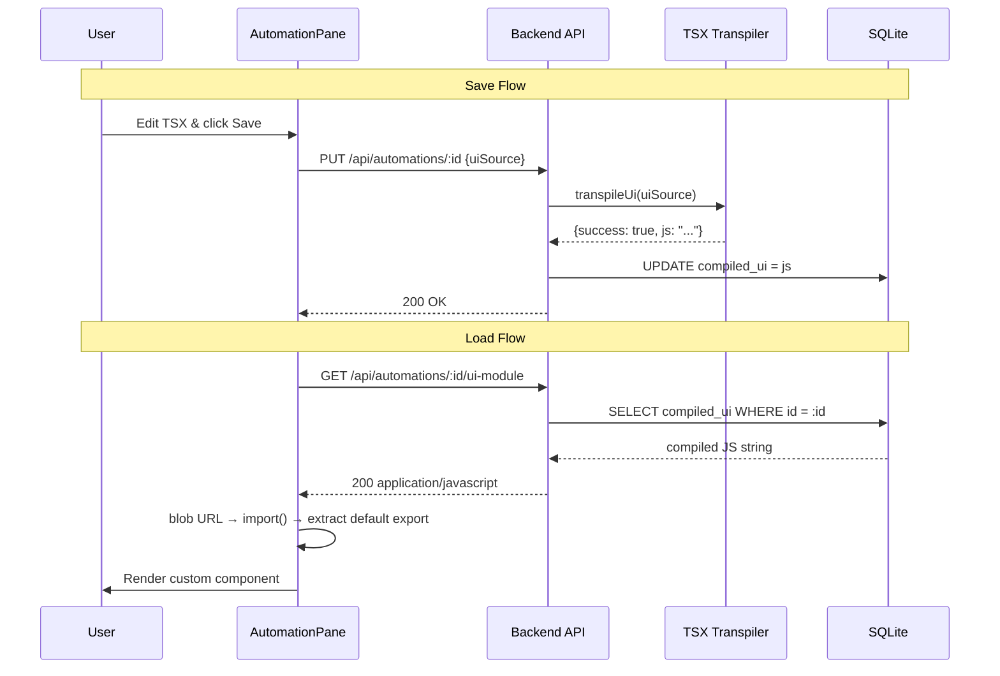

# Design Document: Runtime Custom UI

## Overview

This feature replaces the build-time custom UI pipeline (Docker rebuild) with a runtime loading model. The backend transpiles TSX to ES module JavaScript at save time, stores the compiled output in the database, serves it via a dedicated API endpoint, and the frontend loads it dynamically using blob URLs and `import()`. This eliminates the 1–3 minute Docker rebuild cycle on Raspberry Pi and provides instant feedback after saving a custom component.

The design touches four layers:

1. **Backend transpiler** — Extend `transpiler.ts` with a new `transpileUi()` function that enables JSX (`react-jsx`) and allows React imports.
2. **Database** — Add a `compiled_ui TEXT` column to `automation_rules` via the existing migration pattern.
3. **API** — Add `GET /api/automations/:id/ui-module` to serve compiled JS; update create/update routes to transpile and store compiled UI; remove `CustomUiManager` calls and rebuild endpoints.
4. **Frontend** — Replace the static `CUSTOM_COMPONENTS` registry with a `useDynamicComponent` hook that fetches, blob-imports, and caches compiled modules at runtime.

## Architecture



### Key Design Decisions

1. **Blob URL + `import()` over `<script type="module">`**: Blob URLs allow us to inject the compiled JS as an ES module without writing files to disk or needing a separate static file server. The browser's native `import()` handles module evaluation.

2. **Global injection over import maps**: The compiled TSX emits `import { jsx } from "react/jsx-runtime"`. Before creating the blob URL, the Dynamic_Loader rewrites these import specifiers to reference globals (`window.__AEOLUS_REACT__`, etc.) that are set once at app startup. This avoids import map browser compatibility issues and works reliably in all target environments.

3. **Single `transpileUi()` function**: Rather than modifying the existing `transpile()` function (which intentionally rejects imports for sandbox security), we add a separate `transpileUi()` function with JSX-appropriate compiler options. This keeps the automation script transpiler's security model intact.

4. **No caching layer**: The `Cache-Control: no-cache` header ensures the frontend always gets the latest module after a save. Since modules are served from SQLite (in-memory via sql.js), latency is negligible.

## Components and Interfaces

### 1. `transpileUi()` — Backend TSX Transpiler

**File:** `src/automations/transpiler.ts`

Extends the existing transpiler module with a new exported function:

```typescript
/**
 * Transpile TSX source to ES module JavaScript for custom UI components.
 * Unlike transpile(), this allows import statements (for React/JSX runtime)
 * and configures the JSX transform to emit react-jsx runtime calls.
 */
export function transpileUi(source: string): TranspileResult;
```

**Compiler options:**
- `target`: `ES2022`
- `module`: `ESNext`
- `jsx`: `react-jsx` (emits `import { jsx } from "react/jsx-runtime"`)
- `jsxImportSource`: `react`
- `strict`: `false`
- `removeComments`: `false`
- `sourceMap`: `false`

**Differences from `transpile()`:**
| Aspect | `transpile()` (scripts) | `transpileUi()` (UI components) |
|--------|------------------------|--------------------------------|
| Import/require | Rejected (security) | Allowed (React imports needed) |
| JSX | Not configured | `react-jsx` transform |
| Empty source check | Yes | Yes |

### 2. `GET /api/automations/:id/ui-module` — UI Module Endpoint

**File:** `src/api/routes/automation.routes.ts`

New route added to the existing automation router:

```typescript
/** GET /api/automations/:id/ui-module — serve compiled UI module as JavaScript */
router.get("/:id/ui-module", (req, res) => { ... });
```

**Response:**
- `200` with `Content-Type: application/javascript` and `Cache-Control: no-cache` when `compiled_ui` exists
- `404` when the rule doesn't exist or has no `compiled_ui`

### 3. `useDynamicComponent()` — Frontend Dynamic Loader Hook

**File:** `frontend/src/hooks/useDynamicComponent.ts`

A React hook that manages the lifecycle of dynamically loaded UI components:

```typescript
interface DynamicComponentState {
  Component: ComponentType<CustomComponentProps> | null;
  loading: boolean;
  error: string | null;
}

export function useDynamicComponent(
  ruleId: string,
  hasUiSource: boolean,
): DynamicComponentState;
```

**Behavior:**
1. When `hasUiSource` is true, fetches `GET /api/automations/:ruleId/ui-module`
2. Rewrites React import specifiers in the JS source to reference globals
3. Creates a blob URL from the rewritten source
4. Calls `import(blobUrl)` to load the module
5. Extracts `.default` as the component
6. Validates that the default export is a function
7. Revokes the blob URL after import
8. Returns `{ Component, loading, error }`

**Import rewriting strategy:**

The compiled TSX output contains imports like:
```javascript
import { jsx as _jsx } from "react/jsx-runtime";
import { useState, useEffect } from "react";
```

Before creating the blob URL, the loader rewrites these to reference pre-registered globals:
```javascript
const { jsx: _jsx } = window.__AEOLUS_EXTERNALS__["react/jsx-runtime"];
const { useState, useEffect } = window.__AEOLUS_EXTERNALS__["react"];
```

**Global registration** (in `App.tsx` or `main.tsx`):
```typescript
import * as React from "react";
import * as ReactDOM from "react-dom";
import * as jsxRuntime from "react/jsx-runtime";

window.__AEOLUS_EXTERNALS__ = {
  "react": React,
  "react-dom": ReactDOM,
  "react/jsx-runtime": jsxRuntime,
};
```

### 4. Updated Automation Routes (Create/Update)

**File:** `src/api/routes/automation.routes.ts`

The existing `POST /` and `PUT /:id` handlers are modified:

- When `uiSource` is provided, call `transpileUi(uiSource)` and store the result in `compiled_ui`
- If transpilation fails, return 400 with structured errors (same format as script transpilation errors)
- Remove all `customUiManager` calls (`writeComponent`, `deleteComponent`)
- The `customUiManager` parameter is removed from `createAutomationRoutes()`

### 5. Removals

| Component | File | Action |
|-----------|------|--------|
| `CustomUiManager` class | `src/automations/custom-ui-manager.ts` | Delete file |
| `CustomUiManager` instantiation | `src/index.ts` | Remove import and construction |
| `customUiManager` parameter | `automation.routes.ts` | Remove from function signature and all usages |
| `CUSTOM_COMPONENTS` static registry | `frontend/src/components/panes/custom/index.ts` | Delete file |
| `POST /api/system/rebuild-frontend` | `src/api/routes/system.routes.ts` | Remove route and `startRebuildTracking` |
| `GET /api/system/rebuild-status` | `src/api/routes/system.routes.ts` | Remove route |
| Rebuild status state machine | `src/api/routes/system.routes.ts` | Remove `rebuildStatus`, `startRebuildTracking`, `stopRebuildTracking` |
| "Rebuild Frontend" button | `AutomationPane.tsx` | Remove button, rebuild state, rebuild polling |
| "Rebuild banner" | `AutomationPane.tsx` | Remove `showRebuildBanner` logic |
| Rebuild status indicators | `AutomationPane.tsx` | Remove rebuilding/ready status UI |

## Data Models

### Database Schema Change

Add `compiled_ui` column to `automation_rules`:

```sql
ALTER TABLE automation_rules ADD COLUMN compiled_ui TEXT DEFAULT NULL;
```

This follows the existing migration pattern in `database.ts` (`initSchema` → `addColumn` with try/catch for idempotency):

```typescript
addColumn("compiled_ui", "TEXT DEFAULT NULL");
```

### Updated `StoredRule` Interface

```typescript
interface StoredRule {
  id: string;
  name: string;
  trigger_topic: string;
  condition_type: string | null;
  condition_value: string | null;
  action_type: string;
  action_target: string;
  action_params: string;
  rule_type: "form" | "script";
  script_source: string | null;
  compiled_js: string | null;
  structured_metadata: string | null;
  ui_source: string | null;
  compiled_ui: string | null;  // NEW
  enabled: number;
  created_at: number;
}
```

### `TranspileResult` (unchanged)

The existing `TranspileResult` type is reused by both `transpile()` and `transpileUi()`:

```typescript
export type TranspileResult =
  | { success: true; js: string }
  | { success: false; errors: TranspileError[] };
```

### `DynamicComponentState` (new, frontend)

```typescript
interface DynamicComponentState {
  Component: ComponentType<CustomComponentProps> | null;
  loading: boolean;
  error: string | null;
}
```


## Correctness Properties

*A property is a characteristic or behavior that should hold true across all valid executions of a system — essentially, a formal statement about what the system should do. Properties serve as the bridge between human-readable specifications and machine-verifiable correctness guarantees.*

### Property 1: TSX transpilation round-trip produces valid JavaScript

*For any* valid TSX source string containing a React component with a default export, calling `transpileUi()` SHALL return `{ success: true, js }` where `js` is syntactically valid ES module JavaScript (parseable without errors by the TypeScript compiler in a parse-only mode).

**Validates: Requirements 1.1, 1.6**

### Property 2: Default export preservation

*For any* valid TSX source string that contains an `export default` declaration, the JavaScript output of `transpileUi()` SHALL also contain a default export (either `export default` or an equivalent `exports.default` assignment).

**Validates: Requirements 1.4**

### Property 3: Transpilation error reporting structure

*For any* syntactically invalid TSX source string, `transpileUi()` SHALL return `{ success: false, errors }` where every element in `errors` has numeric `line` (≥ 1) and `column` (≥ 0) fields and a non-empty string `message` field.

**Validates: Requirements 1.2**

### Property 4: React imports are allowed and JSX runtime is emitted

*For any* valid TSX source string containing JSX elements, `transpileUi()` SHALL succeed (not reject the source due to import statements) and the output SHALL contain a reference to `react/jsx-runtime` (the automatic JSX transform import).

**Validates: Requirements 1.5, 5.1**

### Property 5: Import specifier rewriting resolves all React externals

*For any* compiled JavaScript string containing ES module import statements with specifiers from the set `{"react", "react-dom", "react/jsx-runtime"}`, the import rewriting function SHALL replace every such import with a destructuring assignment from the corresponding `window.__AEOLUS_EXTERNALS__` entry, and the resulting string SHALL contain zero remaining `import ... from "react..."` statements for those specifiers.

**Validates: Requirements 4.4, 5.2**

## Error Handling

### Transpilation Layer (`transpileUi`)

| Condition | Behavior |
|-----------|----------|
| Empty source string | Return `{ success: false, errors: [{ line: 1, column: 0, message: "UI source cannot be empty" }] }` |
| Syntax errors in TSX | Return `{ success: false, errors: [...] }` with line/column/message per diagnostic |
| Valid TSX | Return `{ success: true, js: "..." }` |

### API Layer (Create/Update Routes)

| Condition | Behavior |
|-----------|----------|
| `uiSource` provided, transpilation succeeds | Store `compiled_ui` in DB, return 200 |
| `uiSource` provided, transpilation fails | Return 400 with `{ error: "TSX compilation failed", details: [...] }`, do not modify `compiled_ui` |
| `uiSource` cleared (empty/null) | Set `compiled_ui` to null, return 200 |

### API Layer (UI Module Endpoint)

| Condition | Behavior |
|-----------|----------|
| Rule exists with `compiled_ui` | Return 200 with `Content-Type: application/javascript`, `Cache-Control: no-cache` |
| Rule exists without `compiled_ui` | Return 404 with `{ error: "No compiled UI module" }` |
| Rule does not exist | Return 404 with `{ error: "Automation rule not found" }` |

### Frontend Layer (Dynamic Loader)

| Condition | Behavior |
|-----------|----------|
| Fetch succeeds, valid module with default export function | Set `Component`, `loading: false`, `error: null` |
| Fetch returns non-200 | Set `error` with descriptive message (e.g., "Failed to load UI module (404)"), `loading: false` |
| Fetch network error / timeout | Set `error` with connection error message, `loading: false`. Provide retry via re-fetch on next render cycle or explicit retry. |
| Module has no default export | Set `error: "Module does not export a default component"`, `loading: false` |
| Default export is not a function | Set `error: "Module default export is not a valid React component"`, `loading: false` |
| Import rewriting fails | Allow natural failure; `CustomComponentBoundary` catches render error |

### Rendering Layer (Existing Error Boundary)

The existing `CustomComponentBoundary` is retained unchanged. It catches runtime errors thrown during rendering of the dynamically loaded component and displays the error message with a "Show Default View" fallback button.

## Testing Strategy

### Property-Based Tests (fast-check)

The project already uses `fast-check` and `@fast-check/vitest`. Each property test runs a minimum of 100 iterations.

| Property | Test File | Generator Strategy |
|----------|-----------|-------------------|
| Property 1: Round-trip validity | `src/automations/transpiler.test.ts` | Generate random valid TSX component strings (varying component names, prop usage, JSX element nesting, hook calls) |
| Property 2: Default export preservation | `src/automations/transpiler.test.ts` | Generate TSX with `export default function` or `export default` arrow functions |
| Property 3: Error reporting structure | `src/automations/transpiler.test.ts` | Generate random strings with intentional syntax errors (unclosed tags, missing brackets, invalid JSX) |
| Property 4: React imports + JSX runtime | `src/automations/transpiler.test.ts` | Generate TSX containing JSX elements (`<div>`, `<span>`, custom components) |
| Property 5: Import rewriting | `frontend/src/hooks/useDynamicComponent.test.ts` | Generate JS strings with various `import { ... } from "react"` patterns (named imports, default imports, namespace imports) |

**Tag format:** `Feature: runtime-custom-ui, Property N: <property text>`

### Unit Tests (Example-Based)

| Test | What it verifies |
|------|-----------------|
| `transpileUi("")` returns error | Empty source edge case (Req 1.3) |
| `transpileUi` with `import React from "react"` succeeds | Import allowance (Req 1.5) |
| `transpile` with `import React from "react"` fails | Existing behavior preserved |
| UI module endpoint returns 404 for missing rule | Req 3.3 |
| UI module endpoint returns 404 for rule without compiled_ui | Req 3.2 |
| UI module endpoint returns correct Content-Type and Cache-Control | Req 3.1, 3.4 |
| Dynamic loader shows loading state | Req 4.6 |
| Dynamic loader shows error for non-function default export | Req 7.3 |
| Dynamic loader shows error for network failure | Req 7.4 |
| Dynamic loader re-fetches on ruleId/uiSource change | Req 4.5 |
| Error boundary catches render errors from dynamic component | Req 7.1 |

### Integration Tests

| Test | What it verifies |
|------|-----------------|
| POST /api/automations with uiSource stores compiled_ui | Req 2.1 |
| PUT /api/automations/:id with new uiSource updates compiled_ui | Req 2.2 |
| PUT /api/automations/:id with uiSource="" clears compiled_ui | Req 2.3 |
| POST with invalid TSX returns 400, compiled_ui unchanged | Req 2.4 |
| Database migration adds compiled_ui column without breaking existing rows | Req 2.5 |

### Smoke Tests

| Test | What it verifies |
|------|-----------------|
| `CustomUiManager` file does not exist | Req 6.5 |
| `rebuild-frontend` endpoint returns 404 | Req 6.4 |
| AutomationPane does not import CUSTOM_COMPONENTS | Req 6.3 |
