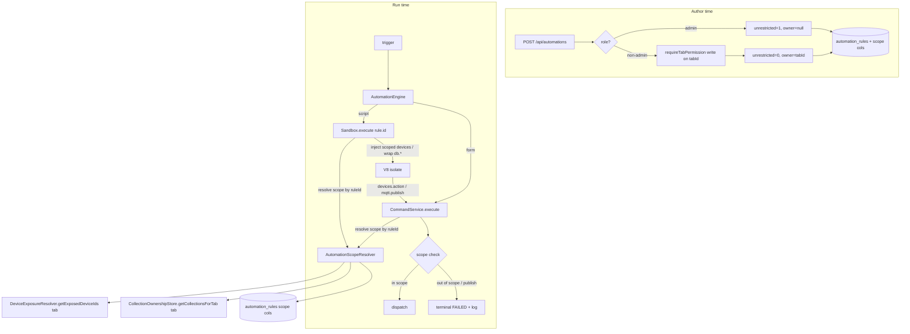

# Design Document

## Overview

Today an automation's runtime authority is unbounded. `Sandbox.setDevicesRefs` copies `deviceRegistry.getAll()` into the isolate, and every host callback (`devices.action`, `mqtt.publish`, `db.*`, `http`) reaches the host through the system-wide `CommandService.execute(action, ruleId, confirm?, tier?)`, which takes no principal or scope. So a non-admin who can get an automation created runs Logic that touches everything.

This feature attaches an explicit **Authorization_Scope** to every automation and enforces it in the runtime. The scope is derived from two new columns on `automation_rules`:

- `authored_unrestricted INTEGER NOT NULL DEFAULT 0` — `1` means system-wide authority (admin-authored, or pre-upgrade rows). `0` means scoped.
- `owner_tab_id TEXT NULL REFERENCES tabs(id) ON DELETE SET NULL` — the single tab a scoped automation is bound to.

A new **`AutomationScopeResolver`** maps a rule id to a resolved scope:

- `authored_unrestricted = 1` → `{ kind: "unrestricted" }`.
- `authored_unrestricted = 0`, `owner_tab_id = T` → `{ kind: "scoped", tabId: T, deviceIds, collections }`, where `deviceIds` is `T`'s live `Tab_Device_Set` and `collections` is `T`'s `Tab_Collection_Set`.
- `authored_unrestricted = 0`, `owner_tab_id = null` → `{ kind: "scoped", tabId: null, deviceIds: ∅, collections: ∅ }` (fail-closed).

Enforcement is defense-in-depth at two layers:

1. **Sandbox** — for a scoped automation, inject only the scoped device set (so `devices.list()`/`devices.get()` reflect reality) and wrap the Data Store callbacks so only in-scope collections are readable/writable and shared buckets are refused.
2. **CommandService** — resolve the scope by rule id on every dispatch and refuse out-of-scope device actions and all raw MQTT publishes for scoped automations. This covers both script host-callbacks and form-rule dispatch, and it catches a script that fabricates an out-of-scope identifier the injected list never contained.

Because non-admins cannot edit the layout, the owning tab is also made an **exposing tab**: `getExposingTabs(automationId)` unions `owner_tab_id` with the pane-derived assignments from `resource-level-authorization`. A scoped author therefore sees, fires, and edits their own automation through the existing resource guards, and that access survives layout saves because it comes from the column, not from panes.

Creation binds the scope: an admin creates unrestricted automations; a non-admin must name a tab they hold `write` on, which becomes the immutable owning tab. This is a legitimate use of a request-supplied tab id — the named tab *is* the resource being authored into and the ceiling on the result — which is exactly what the old create path lacked.

The design reuses the existing `DeviceExposureResolver`, `CollectionOwnershipStore`, `ResourceOwnershipStore`, the versioned migration runner, and the DI route factories. It does not change the group/tab model.

### Goals

- `write` on a tab grants authority over only that tab's resources, whether used directly or through authored Logic.
- Admin-authored automations keep full authority; pre-upgrade automations keep working.
- A scoped automation cannot touch an out-of-scope device, publish raw MQTT, read/write an out-of-scope collection, use shared buckets, or reach internal HTTP targets.
- Losing the owning tab fails closed, never open.
- A scoped author can use their own automation without admin layout edits.

### Non-goals (per requirements)

- Per-automation MQTT publish namespaces (scoped publish is denied for now).
- Consolidating outbound HTTP behind one SSRF-checked host service (form-rule webhooks from scoped automations are denied for now; sandbox `http` keeps its current SSRF policy).
- Multi-tab-spanning scoped automations; non-admin layout editing.

## Architecture



### Components

- **Migration 011 (`011-automation-authorization-scope.ts`)** — adds `authored_unrestricted` and `owner_tab_id` to `automation_rules`; backfills all existing rows to unrestricted.
- **`AutomationScopeResolver` (`src/automations/automation-scope-resolver.ts`)** — pure-ish resolver mapping rule id → `AuthorizationScope`, backed by the automation row plus the `DeviceExposureResolver` and `CollectionOwnershipStore`. Injected into both the `Sandbox` and the `CommandService`.
- **`DeviceExposureResolver`** — gains `getExposedDeviceIds(tabId)` (the inverse of `getExposingTabs`): the ids of the current inventory devices matched by that tab's purposeful device panes.
- **`CollectionOwnershipStore`** — gains `getCollectionsForTab(tabId)` (reads `collection_tab_assignments` by tab).
- **`ResourceOwnershipStore`** — `getExposingTabs` / `getExposingTabsBatch` union the automation's `owner_tab_id`.
- **`Sandbox`** — constructor gains the `AutomationScopeResolver`; `setDevicesRefs` and `setDataStoreRefs` consult the resolved scope for the executing rule.
- **`CommandService`** — constructor gains the `AutomationScopeResolver`; `execute` enforces device scope and publish denial before dispatch.
- **Automation routes** — the create handler binds scope from role + tab; update ignores scope fields for non-admins.
- **Frontend** — owning-tab selection and scope display in the authoring UI.

### AuthorizationScope

```typescript
export type AuthorizationScope =
  | { kind: "unrestricted" }
  | {
      kind: "scoped";
      tabId: string | null;          // null ⇒ owning tab gone ⇒ fail-closed
      deviceIds: ReadonlySet<string>; // Tab_Device_Set (empty when tabId null)
      collections: ReadonlySet<string>; // Tab_Collection_Set (empty when tabId null)
      // Scoped automations never publish raw MQTT and never use shared buckets.
    };
```

The resolver never returns `unrestricted` for a row with `authored_unrestricted = 0` — a null owner yields a `scoped` value with empty sets (R9.3).

## Components and Interfaces

### AutomationScopeResolver

```typescript
export interface AutomationScopeResolver {
  /** Resolve the authorization scope for a rule id. Unknown rule id ⇒ fail-closed scoped-empty. */
  resolve(ruleId: string): AuthorizationScope;
}

export function createAutomationScopeResolver(
  deviceExposureResolver: DeviceExposureResolver,
  collectionOwnershipStore: CollectionOwnershipStore,
  dbOverride?: DatabaseType,
): AutomationScopeResolver;
```

`resolve(ruleId)`:

1. Read `authored_unrestricted, owner_tab_id` for the rule (single parameterized query). If the row is absent → return scoped-empty (fail-closed; a dispatch for an unknown rule should never be unrestricted).
2. `authored_unrestricted = 1` → `{ kind: "unrestricted" }`.
3. Else `owner_tab_id = null` → `{ kind: "scoped", tabId: null, deviceIds: ∅, collections: ∅ }` (R9.1).
4. Else → `{ kind: "scoped", tabId, deviceIds: new Set(deviceExposureResolver.getExposedDeviceIds(tabId)), collections: new Set(collectionOwnershipStore.getCollectionsForTab(tabId)) }`.

Device ids and collections are read live at resolve time (R5.4). Resolution is cheap (indexed reads + one pane scan) and is called once per sandbox execution and once per dispatch; no cache is required for correctness. An optional per-execution memoization keyed by rule id may be added but is not part of the security contract.

### DeviceExposureResolver.getExposedDeviceIds

The inverse direction of the existing `getExposingTabs`. Loads the tab's panes once and returns the ids of the current inventory devices they match:

```typescript
getExposedDeviceIds(tabId: string): string[];
```

Algorithm: load panes for `tabId`; for each device in `registry.getAll()`, include it if some purposeful pane on `tabId` matches it via the existing `matchesDeviceFilter`. Returns distinct ids. Because it reads the live registry and current panes, a device added later that matches a pane is in scope on the next resolve, and one removed drops out — no persistence.

### CollectionOwnershipStore.getCollectionsForTab

```typescript
getCollectionsForTab(tabId: string): string[];
```

`SELECT collection_name FROM collection_tab_assignments WHERE tab_id = ?`. Distinct collection names surfaced by that tab.

### ResourceOwnershipStore exposing-tab union (R3)

`getExposingTabs(automationId)` becomes the union of:

- the pane-derived tab ids in `automation_tab_assignments` (unchanged), and
- the automation's own `owner_tab_id` when non-null.

`getExposingTabsBatch(ids)` unions per id likewise (one extra query fetching `id, owner_tab_id` for the batch). This is the single change that gives a scoped author resource-level access to their own automation without a pane (R3.1, R3.5), and it composes with the existing `PermissionResolver` unchanged. Unrestricted automations have `owner_tab_id = null`, so their exposing set is unchanged (no regression).

### Sandbox scope enforcement

The `Sandbox` constructor gains `scopeResolver: AutomationScopeResolver`. `execute(compiledJs, context, ruleId, tier)` resolves the scope once at the top and passes it to the ref-wiring helpers:

- **`setDevicesRefs`** — when `scope.kind === "scoped"`, filter `this.deviceRegistry.getAll()` to `scope.deviceIds` before serialising into `__devicesData`/`__devicesMap`; when `unrestricted`, inject the full inventory as today (R5.1, R5.3). This makes `devices.list()/get()/filter()` reflect only in-scope devices.
- **`setDataStoreRefs`** — when `scoped`:
  - `db.write(collection, …)` / `db.query(collection, …)`: if `collection ∉ scope.collections`, skip the host operation and log a refusal (R7.1, R7.2).
  - `db.collections()`: return only `scope.collections ∩ dataStore.listCollections()` (R7.3).
  - `db.get/set/delete` (shared buckets): refuse unconditionally for scoped automations (R7.4).
  - when `unrestricted`: wire exactly as today (R7.5).
- **`setMqttRefs`** — the sandbox `mqtt.publish` already dispatches through `CommandService.execute({ type: "publish", … }, ruleId)`, so publish denial is enforced centrally in `CommandService` (R6.1); no sandbox-side change is required beyond passing the rule id (already present).
- **`setHttpRefs`** — unchanged; the existing SSRF blocklist applies to scoped and unrestricted alike (R8.1).

Device-scope at dispatch is still enforced in `CommandService` (below) so the injected-list filtering is defense in depth, not the sole control (R5.2).

### CommandService scope enforcement

The `CommandService` constructor deps gain `scopeResolver: AutomationScopeResolver`. At the top of `execute(action, ruleId, confirm?, tier?)`, before selecting a handler:

1. `const scope = this.deps.scopeResolver.resolve(ruleId);`
2. If `scope.kind === "scoped"`:
   - For `action.type` of `device_action` or `toggle`: if `action.target ∉ scope.deviceIds` → return a terminal `{ success: false, lifecycleState: "FAILED", failureKind: "unauthorized", error: "device out of automation scope" }` and log `{ ruleId, target }` (R5.2, R5.5). No dispatch, no tracker registration.
   - For `action.type` of `publish`: return terminal `FAILED` (`failureKind: "unauthorized"`) and log `{ ruleId }` (R6.1, R6.3). No publish.
   - For `action.type` of `webhook`: return terminal `FAILED` (`failureKind: "unauthorized"`) (R8.2).
3. If `scope.kind === "unrestricted"`: proceed exactly as today (R5.3, R6.2, R8.3, R10.1).

The check sits before the existing handler lookup and tier logic so a refusal is truthful (`FAILED`, never a fake `DISPATCHED`) and never registers a pending command. `failureKind: "unauthorized"` is a new discriminant value on the existing failure taxonomy (a small, additive union extension).

> Why enforce in `CommandService` and not only the sandbox: form-rule dispatch (`registerUiRule`'s action) and script host-callbacks both funnel through `CommandService.execute(descriptor, ruleId, …)`. Enforcing here covers both rule types uniformly and defends against a script that constructs an out-of-scope device id the injected list never contained.

### Route wiring changes

`src/api/routes/automation.routes.ts`:

| Route | Guard (unchanged) | Handler change |
|-------|-------------------|----------------|
| `POST /api/automations` | `requireTabPermission("write")` | Bind scope: admin ⇒ `authored_unrestricted=1, owner_tab_id=null`; non-admin ⇒ `authored_unrestricted=0, owner_tab_id = req.body.tabId`. Persist the two columns in the INSERT. |
| `PUT /api/automations/:id` | `requireAutomation("write")` | Never write scope columns for a non-admin; ignore any scope fields in the body. (Admin scope reclassification is out of scope for v1 beyond leaving the door open.) |
| `DELETE /api/automations/:id` | `requireAutomation("write")` | Unchanged. |
| `POST /:id/fire`, `PATCH /:id/toggle`, `PUT/DELETE /:id/state` | `requireAutomation(...)` | Unchanged — now authorized via the owner-tab-augmented exposing set. |

`requireTabPermission("write")` already: admin bypass; non-admin must supply a `tabId` (from body) and hold `write` on it, else 403. That yields exactly R2.2–R2.4 for the create path. The handler reads `req.user.role` to decide unrestricted vs scoped (R2.1, R2.5) and uses the validated `tabId` as `owner_tab_id` for non-admins.

> Note: this is the one place a request-supplied tab id legitimately participates in authorization. Unlike the original vulnerability, the named tab is the resource being authored into and becomes the automation's authority ceiling; it cannot name one tab to gain authority over another.

### Composition root

`src/index.ts` and `src/__test-helpers__/app-factory.ts` construct one `AutomationScopeResolver` from the existing `DeviceExposureResolver` and `CollectionOwnershipStore`, and inject it into both the `Sandbox` and the `CommandService`. The `ResourceOwnershipStore` change is internal and needs no new wiring.

### Frontend

- **Authoring entry (`AutomationsPage.tsx`, `AutomationPane.tsx`)** — for a non-admin, require choosing an Owning_Tab from `usePermissionsStore` tabs where `canPerform(tabId, "write")`; include `tabId` in the create body (R11.1). If the user has no such tab, hide authoring and show an explanation (R11.2). For an admin, behave as today (no tabId; unrestricted) (R11.4).
- **Scope display** — when viewing/editing a scoped automation, show the owning tab and a note that authority is limited to that tab's devices and collections (R11.3); do not present controls to change owner/unrestricted (R11.5). The create response and automation list should carry `ownerTabId`/`authoredUnrestricted` so the UI can render this (add these fields to the automation read/list payloads).

## Data Models

### `automation_rules` new columns (migration 011)

```sql
ALTER TABLE automation_rules ADD COLUMN authored_unrestricted INTEGER NOT NULL DEFAULT 0;
ALTER TABLE automation_rules ADD COLUMN owner_tab_id TEXT REFERENCES tabs(id) ON DELETE SET NULL;

-- Backfill: everything that exists at upgrade keeps full authority (R1.5, R10.2).
UPDATE automation_rules SET authored_unrestricted = 1 WHERE authored_unrestricted = 0;
```

Notes:
- SQLite `ALTER TABLE ADD COLUMN` cannot both add a column and an inline FK that references another table in every version; the `REFERENCES … ON DELETE SET NULL` clause is honoured for newly added columns under `foreign_keys = ON`. The migration runs inside the existing runner which manages `foreign_keys` and integrity checks. If the inline reference on `ADD COLUMN` proves unsupported on the pinned SQLite, fall back to enforcing the SET-NULL-on-tab-delete behaviour in application code within tab deletion (documented in the migration), keeping R1.4 satisfied.
- The backfill sets `authored_unrestricted = 1` for all existing rows (they predate scoping and must keep working). `owner_tab_id` stays null for them.
- New rows: the create handler sets both columns explicitly, so the `DEFAULT 0` only ever applies transiently.

### Scope resolution model (in-memory)

```
resolve(ruleId):
  row = SELECT authored_unrestricted, owner_tab_id FROM automation_rules WHERE id = ruleId
  row absent                      -> scoped(tabId=null, devices=∅, collections=∅)
  row.authored_unrestricted == 1  -> unrestricted
  row.owner_tab_id == null        -> scoped(tabId=null, devices=∅, collections=∅)
  else                            -> scoped(tabId, devices=exposedDeviceIds(tab), collections=collectionsForTab(tab))
```

### Exposing-tab union (automations)

```
getExposingTabs(automationId) =
  { tab_id in automation_tab_assignments where automation_id = automationId }   // pane-derived
  ∪ ( { owner_tab_id } if owner_tab_id is not null )                            // owner
```

## Correctness Properties

*A property is a characteristic that should hold across all valid executions.* These target the pure decision logic: scope resolution, dispatch enforcement, sandbox injection filtering, the exposing-tab union, and creation binding. Route status codes, migration column creation, logging, and frontend rendering are covered by example/integration tests.

### Property 1: Unrestricted iff explicitly flagged

*For any* automation row, `resolve` returns `unrestricted` if and only if `authored_unrestricted = 1`; a row with `authored_unrestricted = 0` (any `owner_tab_id`, including null) always resolves to a `scoped` value.

**Validates: Requirements 1.2, 1.3, 9.3**

### Property 2: Scoped device set equals the owning tab's live exposed devices

*For any* scoped automation with a non-null owning tab, *any* pane layout, and *any* device inventory, `resolve(...).deviceIds` equals exactly the set of current inventory device ids the owning tab's purposeful panes match; and for a null owning tab the set is empty.

**Validates: Requirements 5.1, 5.4, 9.1**

### Property 3: Dispatch refuses out-of-scope devices and all scoped publishes

*For any* scoped automation and *any* action, `CommandService.execute` refuses (terminal FAILED, no dispatch, no pending registration) a `device_action`/`toggle` whose target is not in the scope's device set, and refuses every `publish` and `webhook`; it dispatches an in-scope device action.

**Validates: Requirements 5.2, 6.1, 8.2**

### Property 4: Unrestricted dispatch is unaffected

*For any* action, when the resolved scope is `unrestricted`, `CommandService.execute` applies no scope restriction and behaves exactly as it does without this feature.

**Validates: Requirements 5.3, 6.2, 8.3, 10.1**

### Property 5: Sandbox injects exactly the scoped device set

*For any* automation and inventory, the device list injected into the isolate equals the full inventory when unrestricted and equals the owning tab's exposed device set (empty when the owning tab is null) when scoped.

**Validates: Requirements 5.1, 5.3, 9.2**

### Property 6: Scoped Data Store access is confined

*For any* scoped automation, a collection read/write is performed only when the collection is in the scope's collection set; `db.collections()` returns only in-scope collections; and every shared-bucket operation is refused. For an unrestricted automation, no such restriction is applied.

**Validates: Requirements 7.1, 7.2, 7.3, 7.4, 7.5**

### Property 7: Fail-closed on a null owning tab

*For any* scoped automation whose `owner_tab_id` is null, the resolved scope has an empty device set and empty collection set, dispatch refuses every device action and publish, and the automation is never treated as unrestricted.

**Validates: Requirements 9.1, 9.2, 9.3**

### Property 8: Exposing tabs include the owning tab

*For any* automation, `getExposingTabs` returns the union of its pane-derived assignment tabs and its `owner_tab_id` (when non-null), and exactly the pane-derived set when `owner_tab_id` is null.

**Validates: Requirements 3.1, 3.5**

### Property 9: Creation binds scope from role, not the body

*For any* create request, an admin caller yields `authored_unrestricted = 1, owner_tab_id = null`, and a non-admin caller yields `authored_unrestricted = 0, owner_tab_id = <named tab>`; the stored unrestricted flag never depends on a body field.

**Validates: Requirements 2.1, 2.2, 2.5**

### Property 10: Non-admin update cannot change scope

*For any* stored automation and *any* update body from a non-admin (including one carrying scope fields), the automation's `authored_unrestricted` and `owner_tab_id` are unchanged after the update.

**Validates: Requirements 4.1, 4.2**

## Error Handling

- **Scope refusal at dispatch** → a terminal `ActionResult { success: false, lifecycleState: "FAILED", failureKind: "unauthorized", error }`, logged at `warn` with `{ ruleId, target? }` (R5.5, R6.3). No pending-command registration, no fake success. Callers (sandbox collector, form-rule engine) already treat a `success:false` result as a failed command, so surfacing is consistent with today.
- **Scoped Data Store refusal** → the sandbox callback logs at `warn` with `{ ruleId, collection|bucket }` and performs no host operation; reads return the same "empty" shape the existing callbacks use on error (`{ records: [], total: 0 }` for query, `[]` for collections, `undefined` for get) so scripts do not crash.
- **Unknown rule id at resolve** → scoped-empty (fail-closed). This should not occur for a registered automation but must never resolve to unrestricted.
- **Owning tab deleted** → `owner_tab_id` is `SET NULL` by FK (or by the documented application fallback), and the resolver yields fail-closed scoped-empty (R1.4, R9).
- **Create by non-admin without/for an unpermitted tab** → `requireTabPermission("write")` throws `ForbiddenError` (403) before the handler (R2.3, R2.4).
- **Migration** runs inside the transactional runner with `foreign_key_check`; a failure rolls back and re-runs cleanly next start.

All scope reads use parameterized prepared statements. The resolver holds no cross-request cache that could go stale; it reads current rows, panes, and inventory each time.

## Testing Strategy

### Dual approach

- **Property-based tests** (fast-check, ≥100 runs, tagged `// Feature: scoped-automation-authoring, Property N: <text>`) for the resolver, dispatch enforcement, sandbox injection filtering, the exposing-tab union, and creation binding.
- **Unit/example tests** for migration columns/backfill, `failureKind: "unauthorized"` results, Data Store callback refusals, and route status codes.
- **Integration tests** (HTTP + SQLite + DeviceRegistry + a real isolate where feasible) for end-to-end scoping.

### Property-based testing applicability

The resolver math, `matchesDeviceFilter`-based exposed-device computation, the dispatch decision, and the union are pure over their inputs and have large input spaces — a good PBT fit. Drive stores against in-memory (`:memory:`) SQLite seeded from generated data; drive the dispatch decision with a fake handler set and generated scopes/actions; drive sandbox injection with a fake registry and generated inventories/pane layouts. Implement each of Properties 1–10 as a single property test.

### Unit / example tests

- Migration 011 adds both columns on a fresh and a legacy DB; backfill sets `authored_unrestricted = 1` for pre-existing rows; new-row default is `0` (R1.1, R1.5, R10.2).
- Deleting a tab nulls `owner_tab_id` for automations it owned and does not flip `authored_unrestricted` (R1.4).
- `CommandService` returns `failureKind: "unauthorized"` and does not call the connector/mqtt for a scoped out-of-scope device action and for a scoped publish/webhook (spy the connector manager and mqtt service asserting zero calls) (R5.2, R6.1, R8.2).
- Sandbox Data Store callbacks: scoped in-scope collection write/query proceed; out-of-scope collection is skipped; `db.collections()` filtered; `db.get/set/delete` refused; unrestricted unaffected (R7).
- Create handler: admin ⇒ unrestricted row; non-admin with a permitted tab ⇒ scoped row bound to it; non-admin without a tab ⇒ 403 (R2).
- Non-admin `PUT` with `authoredUnrestricted`/`ownerTabId` in the body leaves the stored scope unchanged (R4.1, R4.2).

### Integration tests (HTTP + SQLite + DeviceRegistry + isolate)

- **Escalation regression:** a non-admin with `write` on tab A creates a script automation; firing it, the script's `devices.action` on a device exposed only by tab B is refused (FAILED), while an action on a tab-A device succeeds (R5.1, R5.2).
- **Publish denied:** a scoped automation's `mqtt.publish` (and a scoped form-rule publish) is refused; an unrestricted (admin-authored) one publishes (R6).
- **Data Store scope:** a scoped automation reads/writes only its owning tab's collections and cannot use buckets; unrestricted is unaffected (R7).
- **Owner-tab exposure:** immediately after creation (no pane placed), the non-admin author can list, fire, and edit their scoped automation; an unrelated non-admin cannot (R3).
- **Fail-closed:** delete the owning tab, then firing the scoped automation performs no device action or publish (R9).
- **Freshness:** adding a device that matches the owning tab's pane brings it into scope on the next fire without a layout save; removing it drops it out (R5.4).
- **Admin unchanged:** an admin-authored automation touches any device, publishes, and uses any collection (R10.1).

### Test data cleanup

Property and integration tests use a fresh `:memory:` DB and a fresh in-memory `DeviceRegistry` per run; isolate-based tests dispose the isolate in a `finally`.
