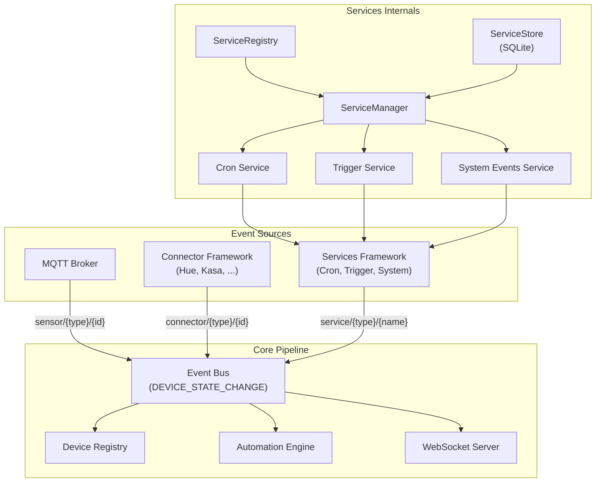

# Design Document: Services Framework

## Overview

The Services Framework introduces a third event source layer to Aeolus alongside Connectors (physical device integrations) and MQTT (raw broker messages). Services are pluggable, non-device event producers — timers, API triggers, system lifecycle events — that emit events on the standard event bus using synthetic `service/{type}/{name}` topics. Automations match on these topics identically to how they match on `sensor/` or `connector/` topics, requiring zero changes to the automation engine.

The framework mirrors the Connector Framework's architecture: `ServiceModule` → `ServiceRegistry` → `ServiceManager` → `ServiceStore`. This symmetry means anyone familiar with the connector code can immediately understand the services code. Three built-in services ship with the framework: Cron Scheduler (time-based automations via `node-cron`), API Trigger (webhook-style on-demand events), and System Events (startup/shutdown lifecycle).

Key design goals:
- Mirror the connector pattern closely for developer familiarity
- Emit events through the existing `DEVICE_STATE_CHANGE` pipeline — no automation engine changes
- Keep the sandbox API simple: `services.get(type)` and `services.list()`
- Make the Services UI page feel like a sibling of the Connectors page
- Enable future services (weather, energy pricing, calendar) to plug in without touching core files

## Architecture

The Services Framework sits alongside the Connector Framework as a peer event source layer. Both feed into the same event bus → device registry → automation engine pipeline.



### Startup Sequence

Services integrate into the existing `index.ts` startup flow:

```
1. Database init
2. Device Registry
3. MQTT Service
4. Connector Framework (registry, store, manager, restore)
5. Services Framework (registry, store, manager, register built-ins, restore)  ← NEW
6. Action Executor, Execution Log, Sandbox (with ServiceManager)              ← MODIFIED
7. Automation Engine
8. Event bus wiring
9. Express app + routes (including /api/services)                              ← NEW
10. HTTP server
```

### Shutdown Sequence

```
1. ServiceManager.disposeAll()   ← NEW (before connectors)
2. ConnectorManager.disposeAll()
3. MQTT disconnect
4. Persist database
5. Close server
```

## Components and Interfaces

### Service Interface (`src/services/service.interface.ts`)

Mirrors `connector.interface.ts` with service-specific adaptations.

```typescript
import type { ConfigFieldDescriptor } from "../connectors/connector.interface.js";
import type { EventEmitter } from "node:events";

/** Static metadata for a service module. */
export interface ServiceMetadata {
  id: string;           // Unique type ID, e.g. "cron", "trigger", "system"
  displayName: string;  // Human-readable name for the UI
  icon: string;         // Lucide icon name
  description: string;  // Short description for the service card
  category: string;     // Grouping category, e.g. "scheduling", "integration", "system"
}

/** Reuse the connector's ConfigFieldDescriptor for config schemas. */
export type ServiceConfigSchema = ConfigFieldDescriptor[];

/** Health status for a running service instance. */
export interface ServiceHealthStatus {
  status: "running" | "degraded" | "stopped";
  lastActivity: number;       // Unix timestamp of last event emission
  errorMessage?: string;      // Present when status is degraded or stopped
}

/** Dependencies injected into the service factory. */
export interface ServiceDependencies {
  eventBus: EventEmitter;
}

/** A running service instance with lifecycle methods. */
export interface ServiceInstance {
  start(): Promise<void>;
  stop(): Promise<void>;
  dispose(): Promise<void>;
  getHealthStatus(): ServiceHealthStatus;
  onConfigUpdate(config: Record<string, unknown>): void;
  getState?(): Record<string, unknown>;
}

/** The standard export shape for a service module. */
export interface ServiceModule {
  metadata: ServiceMetadata;
  configSchema: ServiceConfigSchema;
  createService(
    config: Record<string, unknown>,
    deps: ServiceDependencies,
  ): ServiceInstance;
}

/** Persisted record for a service instance in SQLite. */
export interface ServiceRecord {
  id: string;
  serviceType: string;
  enabled: boolean;
  config: Record<string, unknown>;
  createdAt: number;
  updatedAt: number;
}

/** Runtime info returned by ServiceManager.listEnabled(). */
export interface ServiceInstanceInfo {
  id: string;
  serviceType: string;
  displayName: string;
  icon: string;
  config: Record<string, unknown>;
  health: ServiceHealthStatus;
  enabled: boolean;
}
```

### ServiceRegistry (`src/services/service-registry.ts`)

Mirrors `ConnectorRegistry` — manual registration, validation, lookup.

```typescript
class ServiceRegistry {
  private modules = new Map<string, ServiceModule>();

  register(mod: ServiceModule): void;           // Validate shape, warn on duplicates
  listAvailable(): Array<{ metadata: ServiceMetadata; configSchema: ServiceConfigSchema }>;
  getModule(serviceType: string): ServiceModule | undefined;
}
```

Validation checks: `metadata` object with string `id`, `configSchema` array, `createService` function. Missing exports → log warning, skip registration. Duplicate IDs → log warning, overwrite.

### ServiceStore (`src/services/service-store.ts`)

Mirrors `ConnectorStore` — thin SQLite persistence layer.

```typescript
class ServiceStore {
  constructor(private readonly db: Database);

  save(record: ServiceRecord): void;       // INSERT OR REPLACE
  disable(instanceId: string): void;       // SET enabled = 0
  loadEnabled(): ServiceRecord[];          // WHERE enabled = 1
  loadAll(): ServiceRecord[];
}
```

### ServiceManager (`src/services/service-manager.ts`)

Mirrors `ConnectorManager` — lifecycle management for enabled service instances.

```typescript
class ServiceManager {
  constructor(
    private readonly registry: ServiceRegistry,
    private readonly store: ServiceStore,
    private readonly eventBus: EventEmitter,
  );

  async enable(serviceType: string, config: Record<string, unknown>): Promise<string>;
  async disable(instanceId: string): Promise<void>;
  async updateConfig(instanceId: string, config: Record<string, unknown>): Promise<void>;
  async retry(instanceId: string): Promise<void>;
  listEnabled(): ServiceInstanceInfo[];
  getStatus(instanceId: string): ServiceInstanceInfo | undefined;
  getServiceInstance(serviceType: string): ServiceInstance | undefined;
  async restoreFromStore(): Promise<void>;
  async disposeAll(): Promise<void>;
}
```

Key differences from ConnectorManager:
- No device discovery or polling — services emit events on their own schedule
- No action routing — services are event producers, not device controllers
- `getServiceInstance(serviceType)` exposes the running instance for sandbox queries
- `enable()` calls `start()` instead of `connect()` + `discoverDevices()`

### Event Emission Pattern

Services emit events through the existing `DEVICE_STATE_CHANGE` pipeline using synthetic topics:

```typescript
// Inside a service (e.g. cron service when a schedule fires)
const event: NormalizedEvent = {
  deviceId: `service-${serviceType}`,    // e.g. "service-cron"
  deviceType: "sensor",                   // All service events use "sensor" type
  state: { scheduleName, cronExpression, firedAt: Date.now() },
  topic: `service/cron/${scheduleName}`,  // Synthetic topic
  timestamp: Date.now(),
  integration: "service",
};
eventBus.emit(DEVICE_STATE_CHANGE, event);
```

This means:
- Automations match `service/cron/every-5m` or `service/+/+` or `service/#` using existing topic matching
- Events flow through DeviceRegistry → WebSocket broadcast → frontend automatically
- No changes to the automation engine's `evaluate()` or `topicMatches()` methods

### Built-in Services

#### Cron Service (`src/services/cron/index.ts`)

Uses `node-cron` for schedule management.

```typescript
export const metadata: ServiceMetadata = {
  id: "cron",
  displayName: "Cron Scheduler",
  icon: "clock",
  description: "Time-based event scheduling with cron expressions",
  category: "scheduling",
};

export const configSchema: ServiceConfigSchema = [
  {
    id: "schedules",
    label: "Schedules",
    type: "text",  // JSON array, rendered as custom schedule editor in UI
    required: false,
    default: "[]",
    helpText: "JSON array of { name, cron } schedule objects",
  },
];
```

Config shape: `{ schedules: [{ name: "every-5m", cron: "*/5 * * * *" }, ...] }`

The `CronServiceInstance`:
- On `start()`: parse schedules from config, validate each cron expression with `node-cron`, register valid schedules, log warnings for invalid ones
- On schedule fire: emit `service/cron/{scheduleName}` with state `{ scheduleName, cronExpression, firedAt }`
- On `onConfigUpdate()`: stop all existing schedules, re-register from new config
- On `stop()`: cancel all active cron tasks
- `getState()`: returns `{ schedules: [{ name, cron, nextFireTime }] }`

#### API Trigger Service (`src/services/trigger/index.ts`)

Dead simple — just an endpoint that emits an event.

```typescript
export const metadata: ServiceMetadata = {
  id: "trigger",
  displayName: "API Trigger",
  icon: "webhook",
  description: "Fire automation events via HTTP requests",
  category: "integration",
};

export const configSchema: ServiceConfigSchema = [];  // No config needed
```

The trigger endpoint `POST /api/services/trigger/{name}` is handled in the service routes, not inside the service instance itself. The route handler emits `service/trigger/{name}` on the event bus with the request body as payload.

The `TriggerServiceInstance`:
- On `start()`: no-op (the HTTP endpoint is always available when Aeolus is running)
- `getState()`: returns `{ triggerCount, lastTriggerAt }`
- Health is always "running" when the server is up

#### System Events Service (`src/services/system/index.ts`)

```typescript
export const metadata: ServiceMetadata = {
  id: "system",
  displayName: "System Events",
  icon: "server",
  description: "Emits events on system startup and shutdown",
  category: "system",
};

export const configSchema: ServiceConfigSchema = [];  // No config needed
```

The `SystemEventsServiceInstance`:
- On `start()`: emit `service/system/startup` with `{ bootTimestamp: Date.now() }`
- On `stop()`: emit `service/system/shutdown` with `{ shutdownTimestamp: Date.now() }`
- `getState()`: returns `{ startupTimestamp, uptimeSeconds }`

### Sandbox Services API

The `services` global is added to the sandbox bootstrap script alongside `devices`, `mqtt`, `log`, and `context`.

```typescript
// In sandbox bootstrap script
globalThis.services = {
  get: function(serviceType) {
    return servicesGetRef.applySync(undefined, [serviceType]);
  },
  list: function() {
    return servicesListRef.applySync(undefined, []);
  }
};
```

Host-side callbacks:
- `services.get("cron")` → calls `serviceManager.getServiceInstance("cron")?.getState()` → returns read-only snapshot or `undefined`
- `services.list()` → returns `[{ type: "cron", displayName: "Cron Scheduler", running: true }, ...]`

The `Sandbox` constructor accepts an optional `serviceManager` dependency:

```typescript
export interface SandboxDeps {
  actionExecutor: ActionExecutor;
  deviceRegistry: DeviceRegistry;
  serviceManager?: ServiceManager;  // NEW optional dependency
}
```

### REST API Routes (`src/api/routes/service.routes.ts`)

Mirrors `connector.routes.ts`:

| Method | Path | Description |
|--------|------|-------------|
| `GET` | `/api/services/available` | List registered service types with metadata and config schema |
| `GET` | `/api/services` | List enabled service instances with health and config |
| `POST` | `/api/services` | Enable a service (body: `{ service_type, config }`) |
| `PATCH` | `/api/services/:id` | Update service config |
| `DELETE` | `/api/services/:id` | Disable and dispose a service |
| `GET` | `/api/services/:id/status` | Get detailed health status |
| `POST` | `/api/services/:id/retry` | Retry starting a stopped service |
| `POST` | `/api/services/trigger/:name` | Fire an API trigger event |
| `GET` | `/api/services/topics` | List available service event topics |

### Frontend: Services Page (`frontend/src/components/ServicesPage.tsx`)

Follows the ConnectorsPage pattern:

1. Two sections: "Available Services" (from `/api/services/available`) and "Active Services" (from `/api/services`)
2. Each available service shows as a card with icon, name, description, and enable button
3. Enabling a service shows a dynamic config form (from `configSchema`) — same `ConfigForm` component pattern as ConnectorsPage
4. Active services show health status with colour-coded dot (green/amber/red), config summary, and disable/retry buttons
5. The Cron service gets a custom schedule editor component that renders a friendly UI for adding/editing cron schedules with human-readable descriptions (e.g. "Every 5 minutes", "Daily at 6:00 AM")

The cron schedule editor:
- Displays a list of configured schedules with name, cron expression, and human-readable description
- "Add Schedule" button opens an inline form with name input and cron expression input
- Uses `cronstrue` (npm package) to convert cron expressions to human-readable strings in real-time as the user types
- Preset buttons for common schedules: "Every minute", "Every 5 minutes", "Every hour", "Daily at midnight", "Daily at 6am"
- Validates cron expressions client-side before submission

Sidebar navigation adds a "Services" entry between "Connectors" and "System" in the pinned tabs, using the `Zap` Lucide icon.

### Database Schema

New `services` table added to `initSchema()` in `database.ts`:

```sql
CREATE TABLE IF NOT EXISTS services (
  id TEXT PRIMARY KEY,
  service_type TEXT NOT NULL,
  enabled INTEGER NOT NULL DEFAULT 1,
  config TEXT NOT NULL DEFAULT '{}',
  created_at INTEGER NOT NULL,
  updated_at INTEGER NOT NULL
);
```

Mirrors the `connectors` table structure exactly.

## Data Models

### Service Record (SQLite)

| Column | Type | Description |
|--------|------|-------------|
| `id` | TEXT PRIMARY KEY | UUID generated on enable |
| `service_type` | TEXT NOT NULL | Service type ID (e.g. "cron", "trigger") |
| `enabled` | INTEGER NOT NULL DEFAULT 1 | 1 = enabled, 0 = disabled |
| `config` | TEXT NOT NULL DEFAULT '{}' | JSON-serialized config object |
| `created_at` | INTEGER NOT NULL | Unix timestamp (ms) |
| `updated_at` | INTEGER NOT NULL | Unix timestamp (ms) |

### Service Event Payload (NormalizedEvent)

| Field | Value | Example |
|-------|-------|---------|
| `deviceId` | `service-{serviceType}` | `"service-cron"` |
| `deviceType` | `"sensor"` | `"sensor"` |
| `state` | Service-specific data | `{ scheduleName: "every-5m", cronExpression: "*/5 * * * *", firedAt: 1719000000000 }` |
| `topic` | `service/{type}/{name}` | `"service/cron/every-5m"` |
| `timestamp` | Current time (ms) | `1719000000000` |
| `integration` | `"service"` | `"service"` |

### Cron Service Config

```typescript
{
  schedules: Array<{
    name: string;   // Schedule identifier, used in topic: service/cron/{name}
    cron: string;   // Standard cron expression (5-field)
  }>
}
```

### Trigger Service State

```typescript
{
  triggerCount: number;      // Total triggers fired since service start
  lastTriggerAt: number;     // Unix timestamp of last trigger, 0 if never
}
```

### System Events Service State

```typescript
{
  startupTimestamp: number;  // Unix timestamp when service started
  uptimeSeconds: number;     // Current uptime in seconds
}
```

### Sandbox Services API Types

```typescript
// Added to sandbox-types.d.ts
declare const services: {
  get(serviceType: string): Record<string, unknown> | undefined;
  list(): Array<{ type: string; displayName: string; running: boolean }>;
};
```


## Correctness Properties

*A property is a characteristic or behavior that should hold true across all valid executions of a system — essentially, a formal statement about what the system should do. Properties serve as the bridge between human-readable specifications and machine-verifiable correctness guarantees.*

### Property 1: Registry rejects invalid modules

*For any* object that is missing one or more of the three required ServiceModule members (metadata with string id, configSchema array, createService function), the ServiceRegistry SHALL skip registration and the module SHALL NOT appear in `listAvailable()` or be retrievable via `getModule()`.

**Validates: Requirements 1.1, 1.2, 1.3, 2.2, 2.3**

### Property 2: Registration round-trip

*For any* valid ServiceModule, after calling `register(module)`, the module SHALL be retrievable via `getModule(module.metadata.id)` with matching metadata, and SHALL appear in `listAvailable()`. If a second valid module with the same `metadata.id` is registered, `getModule()` SHALL return the second module.

**Validates: Requirements 2.1, 2.4, 2.5, 2.6**

### Property 3: Store persistence round-trip

*For any* valid ServiceRecord, saving it to the ServiceStore and then loading it back (via `loadEnabled()` or `loadAll()`) SHALL produce a record with identical id, serviceType, enabled state, and config. Disabling a record SHALL preserve the record with `enabled = false` rather than deleting it.

**Validates: Requirements 4.1, 4.2, 4.3**

### Property 4: Manager enable/disable lifecycle

*For any* valid service type registered in the ServiceRegistry and any valid config, enabling it via the ServiceManager SHALL cause it to appear in `listEnabled()` with correct metadata and health status, and `getServiceInstance(serviceType)` SHALL return the running instance. Disabling it SHALL remove it from `listEnabled()` and `getServiceInstance()` SHALL return `undefined`. After `disposeAll()`, `listEnabled()` SHALL return an empty array.

**Validates: Requirements 3.1, 3.2, 3.4, 3.5, 3.7**

### Property 5: Manager restore from store

*For any* set of enabled ServiceRecords persisted in the ServiceStore, calling `restoreFromStore()` SHALL result in all of them appearing in `listEnabled()` with matching service types and configurations.

**Validates: Requirements 3.3, 4.4**

### Property 6: Service event payload format

*For any* service type and event name, when a service emits an event, the resulting NormalizedEvent SHALL have `deviceId` equal to `service-{serviceType}`, `deviceType` equal to `"sensor"`, `topic` matching the pattern `service/{serviceType}/{eventName}`, `integration` equal to `"service"`, and a `state` object containing the event-specific data.

**Validates: Requirements 5.1, 5.3**

### Property 7: Topic matching for service topics

*For any* service topic of the form `service/{type}/{name}`, the automation engine's `topicMatches()` function SHALL correctly match it against exact patterns, single-level wildcard (`+`) patterns, and multi-level wildcard (`#`) patterns, identically to how it matches `sensor/` or `connector/` prefixed topics.

**Validates: Requirements 5.2**

### Property 8: Cron schedule management

*For any* set of cron schedule objects (each with a name and cron expression), when the CronService starts with that config, `getState()` SHALL return all schedules with valid cron expressions and exclude any with invalid expressions. When `onConfigUpdate()` is called with a new schedule set, `getState()` SHALL reflect only the new schedules.

**Validates: Requirements 7.3, 7.5, 7.6, 7.7**

### Property 9: Trigger event emission and state tracking

*For any* trigger name and optional JSON request body, calling `POST /api/services/trigger/{name}` SHALL emit a `DEVICE_STATE_CHANGE` event with topic `service/trigger/{name}` and state containing the trigger name, fire timestamp, and the request body under a `payload` key. After N trigger calls, `getState().triggerCount` SHALL equal N.

**Validates: Requirements 8.2, 8.3, 8.4, 8.5, 8.6**

### Property 10: Service topics reflect enabled services

*For any* set of enabled services, the `GET /api/services/topics` endpoint SHALL return topics that include entries for each enabled service's event topics. For the Cron service, this SHALL include `service/cron/{scheduleName}` for each configured schedule.

**Validates: Requirements 11.1, 11.2**

## Error Handling

| Scenario | Handling | HTTP Status |
|----------|----------|-------------|
| Service type not found in registry | Return descriptive error | 404 |
| Missing required config fields | Return validation error with field names | 400 |
| Service `start()` throws | Mark health as "stopped", log error, allow retry | 200 (enable succeeds, health reflects failure) |
| Invalid cron expression | Log warning, skip that schedule, continue with valid ones | N/A (internal) |
| Service `stop()` throws during disable | Log error, continue with disposal | 200 (disable succeeds) |
| Service `dispose()` throws during shutdown | Log error, continue with next service | N/A (internal) |
| Duplicate service type registration | Log warning, overwrite existing | N/A (internal) |
| ServiceStore JSON parse failure | Log warning, skip malformed record | N/A (internal) |
| Sandbox `services.get()` for non-running service | Return `undefined` | N/A (sandbox) |
| Trigger endpoint called when trigger service not enabled | Emit event anyway (endpoint is always available) | 200 |

## Testing Strategy

### Property-Based Tests (Vitest + fast-check)

Property-based testing is appropriate for this feature because the core components (registry, store, manager) have clear input/output behavior with universal properties that hold across a wide input space.

Library: `fast-check` with Vitest
Minimum iterations: 100 per property test
Tag format: `Feature: services-framework, Property {number}: {property_text}`

Each correctness property maps to a single property-based test:

1. **Registry validation** — Generate random objects with varying combinations of metadata/configSchema/createService, verify only valid ones are registered
2. **Registration round-trip** — Generate random valid ServiceModules, register, verify retrieval matches
3. **Store persistence round-trip** — Generate random ServiceRecords, save/load, verify equality
4. **Manager enable/disable lifecycle** — Generate random service types and configs with mock services, verify enable/disable/disposeAll behavior
5. **Manager restore from store** — Seed store with random enabled records, restore, verify all appear
6. **Service event payload format** — Generate random service types and event names, verify NormalizedEvent shape
7. **Topic matching for service topics** — Generate random service topics and wildcard patterns, verify matching correctness
8. **Cron schedule management** — Generate random mixes of valid/invalid cron expressions, verify getState() reflects only valid ones
9. **Trigger event emission** — Generate random trigger names and bodies, verify event emission and state tracking
10. **Service topics endpoint** — Enable random services, verify topics endpoint returns matching topics

### Unit Tests (Vitest)

Unit tests complement property tests for specific examples and edge cases:

- ServiceRegistry: empty registry returns empty list, specific metadata shape validation
- ServiceStore: empty table returns empty array, disable preserves config
- ServiceManager: start() failure sets health to "stopped", retry after failure
- CronService: specific cron expressions fire correctly, empty schedules config
- TriggerService: health always "running", state tracks trigger count
- SystemEventsService: emits startup/shutdown events, getState() returns uptime
- Sandbox: services.get() returns undefined when no serviceManager provided

### Integration Tests (Vitest + Supertest)

- REST API endpoints: enable/disable/update/retry/status flows
- Trigger endpoint: POST /api/services/trigger/{name} emits correct event
- Topics endpoint: returns topics matching enabled services
- Full lifecycle: enable → configure → events flow → disable
- Startup wiring: services restored before server listens
