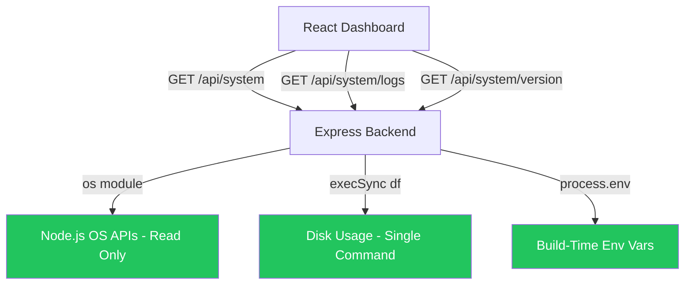
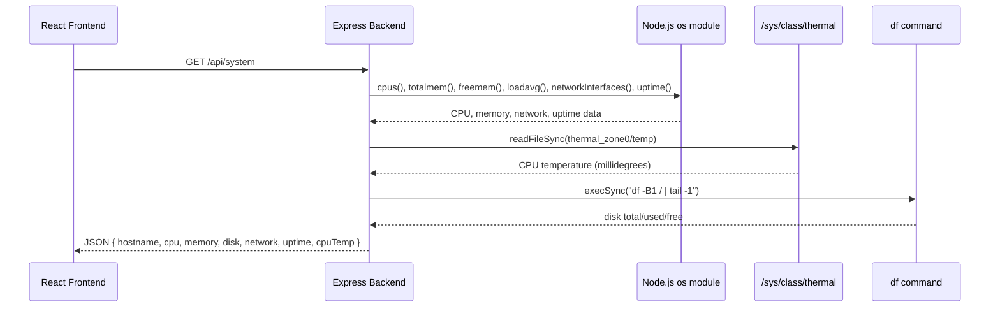
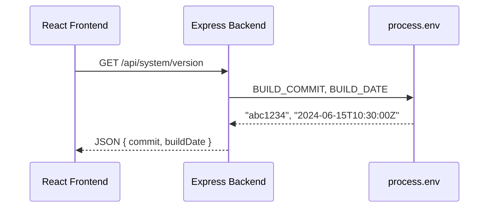
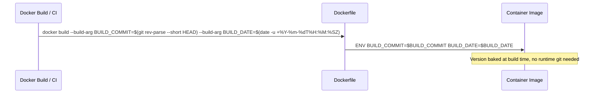

# Design Document: System Security Hardening

## Overview

Aeolus currently exposes dangerous system control endpoints (`/api/system/update`, `/api/system/shutdown`, `/api/system/reboot`, `/api/system/docker-prune`) that grant full root-level access to the host via the Docker socket. These endpoints use `execSync` with string interpolation and spawn privileged containers with `--pid=host` and `nsenter` — giving any attacker who compromises the web UI complete host control.

This feature removes all exec-based system control endpoints, eliminates the Docker socket mount from the compose file, removes docker-ce-cli from the production image, and simplifies the version endpoint to read build-time environment variables instead of running git commands at runtime. The frontend System page retains its read-only diagnostic cards but removes all dangerous action buttons and the Docker disk breakdown section.

The security surface is reduced from "full root on host" to "read-only OS metrics via Node.js `os` module and a single `df` command".

## Architecture

### Current (Insecure) Architecture

```mermaid
graph TD
    UI[React Dashboard] -->|POST /shutdown, /reboot, /update, /docker-prune| BE[Express Backend]
    BE -->|Docker Socket| DS[/var/run/docker.sock]
    DS -->|spawn privileged container| HOST[Host OS - Full Root Access]
    BE -->|execSync git commands| GIT[Git Runtime Operations]
    BE -->|execSync docker CLI| DCLI[docker-ce-cli]
    
    style DS fill:#EF4444,color:#fff
    style HOST fill:#EF4444,color:#fff
    style DCLI fill:#EF4444,color:#fff
    style GIT fill:#F59E0B,color:#000
```

### Target (Hardened) Architecture



## Sequence Diagrams

### System Diagnostics (Retained)



### Version Check (Simplified)



### Docker Build (Build-Time Version Baking)



## Components and Interfaces

### Component 1: System Routes (Hardened)

**Purpose**: Provide read-only host diagnostics and build version info via REST API.

**Interface**:
```typescript
interface SystemRoutes {
  // Retained endpoints
  "GET /api/system": () => SystemDiagnostics;
  "GET /api/system/logs": (query: { count?: number; level?: string }) => LogEntry[];
  "GET /api/system/version": () => BuildVersionInfo;
  
  // REMOVED endpoints (no longer exist)
  // "POST /api/system/update" — REMOVED
  // "POST /api/system/shutdown" — REMOVED
  // "POST /api/system/reboot" — REMOVED
  // "POST /api/system/docker-prune" — REMOVED
}
```

**Responsibilities**:
- Return CPU, memory, disk, temperature, and network metrics from the `os` module
- Return recent application logs from the in-memory log buffer
- Return build-time version info from environment variables
- Never execute Docker commands or spawn privileged containers
- Never run git commands at runtime

### Component 2: Dockerfile (Slimmed)

**Purpose**: Build a minimal production image without Docker CLI or git runtime capabilities.

**Responsibilities**:
- Remove `docker-ce-cli` package and Docker apt repository setup
- Remove `git` from production stage (only needed in builder if at all)
- Remove `git config --global --add safe.directory /aeolus-host`
- Add `ARG BUILD_COMMIT` and `ARG BUILD_DATE` with corresponding `ENV` directives
- Accept version info as build arguments, bake into environment

### Component 3: Docker Compose (Hardened)

**Purpose**: Orchestrate Aeolus services without exposing the host to container escape.

**Responsibilities**:
- Remove `/var/run/docker.sock:/var/run/docker.sock` volume mount
- Remove `.:/aeolus-host` bind mount (no longer needed for git/update operations)
- Remove `AEOLUS_PROJECT_DIR` environment variable
- Retain `backend_data:/app/data` for SQLite persistence

### Component 4: SystemPage Frontend (Simplified)

**Purpose**: Display read-only system diagnostics without dangerous action controls.

**Responsibilities**:
- Remove Update/Reboot/Shutdown buttons from the header
- Remove Docker disk breakdown overlay from the Disk card
- Remove the "reclaimable" prune button
- Remove all state and functions related to update/reboot/shutdown/prune
- Retain: CPU, Memory, Disk (simple), Temperature, Network, Uptime cards
- Retain: Health summary bar (devices, automations, uptime, MQTT)
- Retain: Log viewer
- Display build version info (commit + date) in a simple, non-interactive way

## Data Models

### SystemDiagnostics (Retained - minus Docker)

```typescript
interface SystemDiagnostics {
  hostname: string;
  platform: string;
  arch: string;
  nodeVersion: string;
  cpuModel: string;
  cpuCores: number;
  cpuTemp: number | null;
  loadAvg: { "1m": number; "5m": number; "15m": number };
  memory: { total: number; used: number; free: number; usagePercent: number };
  disk: { total: number; used: number; free: number; usagePercent: number } | null;
  network: { name: string; address: string }[];
  uptime: number;
  // REMOVED: docker field no longer returned
}
```

**Validation Rules**:
- `cpuTemp` is `null` when thermal zone file is not readable (non-Pi hosts)
- `disk` is `null` when `df` command fails
- `memory.usagePercent` is clamped to 0–100
- All numeric values are non-negative

### BuildVersionInfo (New - replaces VersionInfo)

```typescript
interface BuildVersionInfo {
  commit: string;     // Short git SHA baked at build time, e.g. "abc1234"
  buildDate: string;  // ISO 8601 timestamp of build, e.g. "2024-06-15T10:30:00Z"
}
```

**Validation Rules**:
- `commit` defaults to `"unknown"` if `BUILD_COMMIT` env var is not set
- `buildDate` defaults to `"unknown"` if `BUILD_DATE` env var is not set
- No network calls, no git commands, no file system checks

### LogEntry (Unchanged)

```typescript
interface LogEntry {
  level: number;
  levelLabel: string;
  msg: string;
  time: string;
  [key: string]: unknown;
}
```

## Algorithmic Pseudocode

### System Diagnostics Collection

```typescript
ALGORITHM getSystemDiagnostics()
INPUT: none (reads from OS)
OUTPUT: SystemDiagnostics

BEGIN
  // Step 1: Gather CPU info (safe - Node.js os module, no exec)
  cpus ← os.cpus()
  loadAvg ← os.loadavg()
  
  // Step 2: Gather memory info (safe - Node.js os module)
  totalMem ← os.totalmem()
  freeMem ← os.freemem()
  usedMem ← totalMem - freeMem
  
  // Step 3: Read CPU temperature (safe - file read, graceful failure)
  cpuTemp ← TRY readFileSync("/sys/class/thermal/thermal_zone0/temp")
             CATCH → null
  
  // Step 4: Get disk usage (single sandboxed command)
  disk ← TRY execSync("df -B1 / | tail -1") → parse fields
          CATCH → null
  
  // Step 5: Network interfaces (safe - Node.js os module)
  network ← os.networkInterfaces() → filter IPv4, non-internal
  
  RETURN { hostname, platform, arch, cpus, loadAvg, memory, disk, cpuTemp, network, uptime }
END
```

**Preconditions:**
- Node.js `os` module is available
- Process has read access to `/sys/class/thermal/thermal_zone0/temp` (or gracefully fails)
- `df` command is available in container PATH (or gracefully fails)

**Postconditions:**
- Returns valid SystemDiagnostics object
- No child processes spawned with elevated privileges
- No Docker commands executed
- No data written to host filesystem

### Build Version Resolution

```typescript
ALGORITHM getVersionInfo()
INPUT: none (reads from process.env)
OUTPUT: BuildVersionInfo

BEGIN
  commit ← process.env.BUILD_COMMIT ?? "unknown"
  buildDate ← process.env.BUILD_DATE ?? "unknown"
  
  RETURN { commit, buildDate }
END
```

**Preconditions:**
- `process.env` is accessible

**Postconditions:**
- Returns BuildVersionInfo with string values
- Never makes network calls
- Never spawns child processes
- Execution time is O(1)

## Key Functions with Formal Specifications

### getCpuTemp()

```typescript
function getCpuTemp(): number | null
```

**Preconditions:**
- None (handles all failure cases internally)

**Postconditions:**
- Returns temperature in °C (rounded to 1 decimal) if thermal zone is readable
- Returns `null` if file doesn't exist or isn't readable
- No side effects

### getDiskUsage()

```typescript
function getDiskUsage(): { total: number; used: number; free: number } | null
```

**Preconditions:**
- `df` command exists in PATH

**Postconditions:**
- Returns disk stats in bytes if `df` succeeds
- Returns `null` on any failure
- Only executes `df -B1 / | tail -1` — no other commands
- No write operations

### createSystemRoutes()

```typescript
function createSystemRoutes(): Router
```

**Preconditions:**
- Express is available
- `getRecentLogs` from log-buffer module is available

**Postconditions:**
- Returns Router with exactly 3 route handlers: GET /, GET /logs, GET /version
- No POST routes registered
- No imports of `spawn` from `child_process`
- No references to Docker socket, docker CLI, or git commands
- No `setTimeout` with privileged operations

**Loop Invariants:** N/A

## Example Usage

### Backend — Hardened system.routes.ts

```typescript
import { Router } from "express";
import os from "node:os";
import fs from "node:fs";
import { execSync } from "node:child_process";
import { getRecentLogs } from "../../log-buffer.js";

function getCpuTemp(): number | null {
  try {
    const temp = fs.readFileSync("/sys/class/thermal/thermal_zone0/temp", "utf-8");
    return Math.round(Number(temp.trim()) / 100) / 10;
  } catch {
    return null;
  }
}

function getDiskUsage(): { total: number; used: number; free: number } | null {
  try {
    const output = execSync("df -B1 / | tail -1", { encoding: "utf-8" });
    const parts = output.trim().split(/\s+/);
    return { total: Number(parts[1]), used: Number(parts[2]), free: Number(parts[3]) };
  } catch {
    return null;
  }
}

export function createSystemRoutes(): Router {
  const router = Router();

  router.get("/", (_req, res) => {
    // ... gather CPU, memory, disk, temp, network from os module ...
    res.json({ hostname, platform, arch, cpuModel, cpuCores, cpuTemp, loadAvg, memory, disk, network, uptime });
  });

  router.get("/logs", (req, res) => {
    const count = Math.min(Number(req.query.count) || 100, 200);
    const level = req.query.level as string | undefined;
    let logs = getRecentLogs(count);
    if (level) logs = logs.filter((l) => l.levelLabel === level);
    res.json(logs);
  });

  router.get("/version", (_req, res) => {
    res.json({
      commit: process.env.BUILD_COMMIT || "unknown",
      buildDate: process.env.BUILD_DATE || "unknown",
    });
  });

  return router;
}
```

### Dockerfile — Build-time version baking

```dockerfile
FROM node:22-slim AS production
WORKDIR /app

# No docker-ce-cli, no git in production
RUN apt-get update && apt-get install -y --no-install-recommends python3 make g++ wget curl ca-certificates \
    && rm -rf /var/lib/apt/lists/*

ARG BUILD_COMMIT=unknown
ARG BUILD_DATE=unknown
ENV BUILD_COMMIT=$BUILD_COMMIT
ENV BUILD_DATE=$BUILD_DATE

# ... rest of production setup ...
```

### docker-compose.yml — No socket mount

```yaml
backend:
  build:
    context: .
    dockerfile: Dockerfile
    args:
      BUILD_COMMIT: ${BUILD_COMMIT:-unknown}
      BUILD_DATE: ${BUILD_DATE:-unknown}
  volumes:
    - backend_data:/app/data
    # REMOVED: /var/run/docker.sock:/var/run/docker.sock
    # REMOVED: .:/aeolus-host
  environment:
    # REMOVED: AEOLUS_PROJECT_DIR
    NODE_ENV: ${NODE_ENV:-development}
    PORT: ${API_PORT:-3001}
    # ...
```

## Correctness Properties

*A property is a characteristic or behavior that should hold true across all valid executions of a system — essentially, a formal statement about what the system should do. Properties serve as the bridge between human-readable specifications and machine-verifiable correctness guarantees.*

### Property 1: No POST Endpoints on System Router

*For any* route registered on the System_Router, the HTTP method SHALL be GET. No POST, PUT, DELETE, or PATCH routes exist. Requests to any removed POST path return 404.

**Validates: Requirements 1.1, 1.2, 1.3, 1.4, 1.5**

### Property 2: No Spawn Import

*For any* import statement in the system routes source file, the `spawn` function SHALL NOT be imported from `child_process`. Only `execSync` is imported for the single `df` command.

**Validates: Requirements 2.1**

### Property 3: Only df Command Executed

*For any* `execSync` call in the system routes module, the command argument SHALL be exactly `"df -B1 / | tail -1"`. No docker, git, nsenter, or any other system commands are executed.

**Validates: Requirements 2.2, 2.3**

### Property 4: No Docker Socket Mount

*For any* volume definition in the Compose_Configuration backend service, the volume SHALL NOT reference `/var/run/docker.sock`. The Docker socket is never mounted into the backend container.

**Validates: Requirements 3.1**

### Property 5: No Docker CLI or Git in Production Image

*For any* apt-get install command in the production stage of the Dockerfile, the package list SHALL NOT contain `docker-ce-cli` or `git`. The production image only includes packages needed for native module compilation and health checks.

**Validates: Requirements 4.1, 4.2, 4.3, 4.4**

### Property 6: No Host Project Directory Reference

*For any* volume or environment variable definition in the Compose_Configuration backend service, there SHALL be no `.:/aeolus-host` bind mount and no `AEOLUS_PROJECT_DIR` environment variable.

**Validates: Requirements 3.2, 3.3**

### Property 7: Version Endpoint Environment Variable Round-Trip

*For any* string values assigned to `BUILD_COMMIT` and `BUILD_DATE` environment variables, the Version_Endpoint SHALL return those exact values in the `commit` and `buildDate` response fields respectively. When either variable is unset, the corresponding field SHALL default to `"unknown"`. No child processes are spawned and no network calls are made.

**Validates: Requirements 5.3, 5.4, 5.5, 5.6, 5.7**

### Property 8: Frontend Has No System Mutation Calls

*For any* HTTP request made by the System_Page component, the method SHALL be GET. The frontend makes zero POST/PUT/DELETE requests. No buttons trigger mutations on the system.

**Validates: Requirements 8.1, 8.2, 8.5**

## Error Handling

### Error Scenario 1: Thermal Zone Unavailable

**Condition**: `/sys/class/thermal/thermal_zone0/temp` does not exist (non-Pi host, or missing kernel module)
**Response**: `getCpuTemp()` returns `null`; response includes `cpuTemp: null`
**Recovery**: Frontend displays "Not available (non-Pi host)" in temperature card

### Error Scenario 2: df Command Fails

**Condition**: `df` is not available in container, or filesystem is in a bad state
**Response**: `getDiskUsage()` returns `null`; response includes `disk: null`
**Recovery**: Frontend displays "Not available" in disk card

### Error Scenario 3: BUILD_COMMIT/BUILD_DATE Not Set

**Condition**: Image built without `--build-arg` (local dev, older CI pipeline)
**Response**: Version endpoint returns `{ commit: "unknown", buildDate: "unknown" }`
**Recovery**: Frontend shows "unknown" gracefully — no crash, no retry loop

### Error Scenario 4: Attempted Access to Removed Endpoints

**Condition**: Client (or attacker) sends POST to `/api/system/shutdown`, `/api/system/reboot`, `/api/system/update`, or `/api/system/docker-prune`
**Response**: Express returns 404 (no route matches)
**Recovery**: N/A — endpoint simply does not exist

## Testing Strategy

### Unit Testing Approach

Test the hardened `system.routes.ts` with Vitest + supertest:

1. **GET /api/system** — verify response shape, verify no `docker` field, verify all OS fields present
2. **GET /api/system/logs** — verify filtering and count limits work
3. **GET /api/system/version** — verify it reads from `process.env`, returns correct shape
4. **Removed endpoints return 404** — explicitly test that POST /update, /shutdown, /reboot, /docker-prune all return 404
5. **No dangerous imports** — static analysis test that `spawn` is not imported, `docker` string doesn't appear in source

### Property-Based Testing Approach

**Property Test Library**: fast-check

Properties to test:
- For any valid `count` parameter (1–200), logs endpoint returns an array of length ≤ count
- For any `level` filter, all returned logs have matching `levelLabel`
- Version endpoint always returns an object with `commit` and `buildDate` string fields regardless of env var state

### Integration Testing Approach

- Build the Docker image without build args → verify version returns "unknown"/"unknown"
- Build with args → verify correct values returned
- Verify Docker socket is NOT accessible from within the running container
- Verify `docker` command is not available inside the production container

## Security Considerations

### Threat Model (Before)

| Attack Vector | Impact | Likelihood |
|---|---|---|
| Compromised web UI → POST /shutdown | Full host power control | High (no auth on LAN) |
| Compromised web UI → POST /update | Arbitrary code execution via git pull | High |
| Docker socket access → container escape | Full root on host | Critical |
| execSync string interpolation → command injection | Arbitrary command execution | Medium |

### Threat Model (After)

| Attack Vector | Impact | Likelihood |
|---|---|---|
| Compromised web UI → read system metrics | Information disclosure (non-sensitive) | Low impact |
| df command output parsing | Minimal — output is numeric, not user-controlled | Negligible |

### Mitigations Applied

1. **Eliminate Docker socket mount** — removes the most critical privilege escalation path
2. **Remove docker-ce-cli** — even if socket were somehow available, no client to exploit it
3. **Remove all POST endpoints** — system router becomes entirely read-only
4. **Remove `spawn` import** — no child process creation with detached/privileged flags
5. **Remove git from production image** — no runtime code execution via git operations
6. **Build-time version baking** — eliminates need for host filesystem access entirely
7. **Remove host bind mount** — `.:/aeolus-host` no longer needed

### Recommended Update Strategy (Out of Scope)

For users who still want remote updates, recommend:
- **Watchtower** for automatic Docker image updates from registry
- **SSH** for manual intervention
- **GitHub Actions** pushing to a container registry, with Watchtower pulling

## Performance Considerations

- **Improved startup time**: Removes 10-second delayed `setTimeout` for initial version check and `setInterval` for 24h polling
- **Reduced memory**: No cached `VersionInfo` object with git history
- **Faster GET /api/system**: Removes 6+ `execSync` docker commands (each with 10-15s timeouts) from the diagnostics endpoint
- **Smaller image size**: Removing docker-ce-cli and git saves ~100-200MB from production image
- **Version endpoint is O(1)**: Two environment variable reads vs. 7+ git subprocess spawns

## Dependencies

### Removed Dependencies
- `docker-ce-cli` (apt package) — no longer needed
- `git` (apt package in production stage) — no longer needed at runtime
- Docker socket (`/var/run/docker.sock`) — no longer mounted
- Host project bind mount (`.:/aeolus-host`) — no longer mounted

### Retained Dependencies
- `node:os` — CPU, memory, network, uptime (safe, read-only)
- `node:fs` — thermal zone file read (safe, read-only)
- `node:child_process` (`execSync` only) — `df` command for disk usage
- `express` — Router
- `../../log-buffer.js` — in-memory log ring buffer

### New Dependencies
- None. This feature only removes code and dependencies.

### Build-Time Requirements
- Docker `--build-arg BUILD_COMMIT=<sha>` and `--build-arg BUILD_DATE=<iso>` passed during `docker build`
- Can be automated in `docker-compose.yml` via `args:` or in CI/CD pipeline
