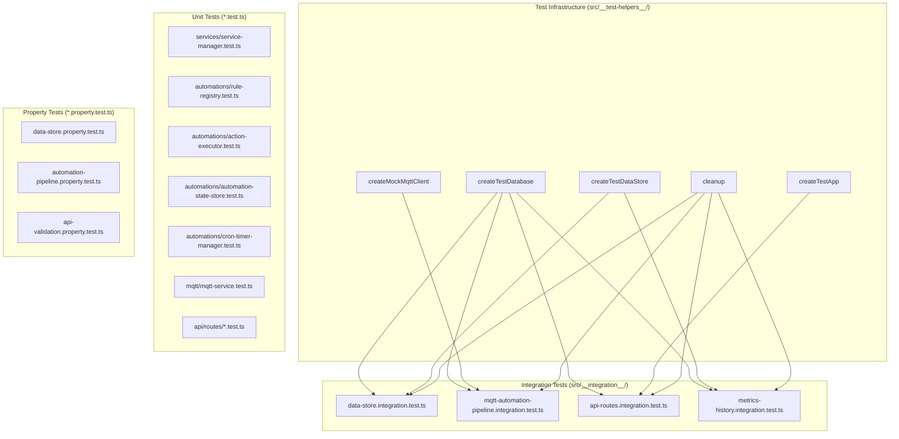
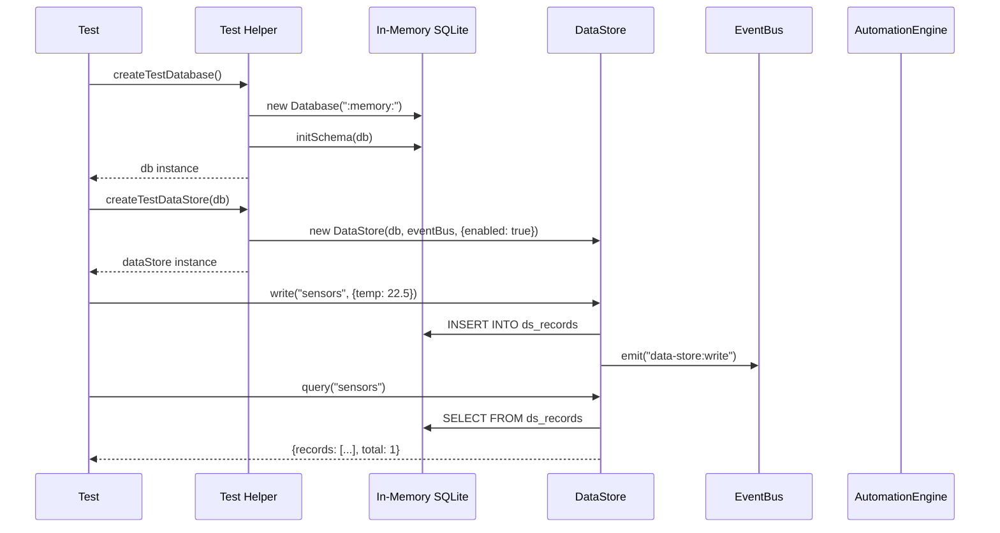

# Design Document: Test Coverage Improvement

## Overview

This design establishes the test infrastructure, integration test architecture, and coverage configuration needed to bring Aeolus backend test coverage from 29.85% to 80%+ line coverage. The approach follows a testing pyramid: unit tests for isolated module logic, integration tests for cross-module flows with real SQLite and real internal services, and property-based tests for universal invariants.

### Key Design Decisions

1. **better-sqlite3 `:memory:` for integration tests** — Each test gets a fresh in-memory database with the full schema applied. No disk I/O, no cleanup between runs, sub-millisecond setup.
2. **Shared test helper module** — A single `src/__test-helpers__/` directory provides factories, mocks, and setup utilities. Tests import what they need rather than duplicating boilerplate.
3. **Mock MQTT client (no broker)** — Integration tests use a mock that records publishes and allows simulating incoming messages via the event bus. No Docker, no network.
4. **Real Express stack for API tests** — Integration tests use `supertest` against a fully-wired Express app (auth middleware, validation, error handler) backed by the in-memory database.
5. **Per-directory coverage thresholds** — Critical modules (`core/`, `mqtt/`, `data-store/`) have higher thresholds than modules with harder-to-test code (`automations/` with isolated-vm).
6. **Property tests for data invariants** — Data Store round-trips, retention logic, and automation pipeline behavior are ideal for property-based testing since they have clear universal properties across varied inputs.

## Architecture



### Integration Test Data Flow



## Components and Interfaces

### Test Helper Module (`src/__test-helpers__/index.ts`)

Central export point for all test utilities.

```typescript
export { createTestDatabase } from "./database-factory.js";
export { createTestDataStore } from "./data-store-factory.js";
export { createMockMqttClient, type MockMqttClient } from "./mock-mqtt.js";
export { createTestApp, createAuthToken } from "./app-factory.js";
export { createTestAutomationEngine } from "./automation-factory.js";
export { cleanup } from "./cleanup.js";
```

### Database Factory (`src/__test-helpers__/database-factory.ts`)

```typescript
import Database from "better-sqlite3";
import type { Database as DatabaseType } from "better-sqlite3";
import { initSchema } from "../db/database.js";

/**
 * Create a fresh in-memory SQLite database with the full Aeolus schema.
 * Each call returns an independent database instance.
 */
export function createTestDatabase(): DatabaseType {
  const db = new Database(":memory:");
  db.pragma("journal_mode = WAL");
  db.pragma("foreign_keys = ON");
  initSchema(db);
  return db;
}
```

### Data Store Factory (`src/__test-helpers__/data-store-factory.ts`)

```typescript
import type { Database as DatabaseType } from "better-sqlite3";
import type { EventEmitter } from "node:events";
import { DataStore, type DataStoreConfig } from "../data-store/data-store.js";

/**
 * Create a DataStore instance backed by the provided in-memory database.
 * Enabled by default with generous limits for testing.
 */
export function createTestDataStore(
  db: DatabaseType,
  eventBus: EventEmitter,
  config?: Partial<DataStoreConfig>,
): DataStore {
  return new DataStore(db, eventBus, {
    enabled: true,
    maxStorageMb: 100,
    maxRecordsPerCollection: 10_000,
    maxCollections: 50,
    ...config,
  });
}
```

### Mock MQTT Client (`src/__test-helpers__/mock-mqtt.ts`)

```typescript
import type { EventEmitter } from "node:events";
import { MQTT_RAW_MESSAGE, DEVICE_STATE_CHANGE } from "../core/event-bus.js";

export interface PublishedMessage {
  topic: string;
  payload: string;
  timestamp: number;
}

export interface MockMqttClient {
  /** All messages published through this mock */
  published: PublishedMessage[];
  
  /** Simulate an incoming MQTT message (emits on event bus) */
  simulateMessage(topic: string, payload: string): void;
  
  /** Publish a message (records it, does not send to broker) */
  publish(topic: string, payload: string): void;
  
  /** Check if connected (always true for mock) */
  isConnected(): boolean;
  
  /** Reset recorded messages */
  reset(): void;
}

export function createMockMqttClient(eventBus: EventEmitter): MockMqttClient {
  const published: PublishedMessage[] = [];

  return {
    published,
    
    simulateMessage(topic: string, payload: string): void {
      eventBus.emit(MQTT_RAW_MESSAGE, { topic, payload, timestamp: Date.now() });
      // Also emit as a device state change if parseable
      try {
        const state = JSON.parse(payload);
        const parts = topic.split("/");
        if (parts.length >= 2) {
          eventBus.emit(DEVICE_STATE_CHANGE, {
            deviceId: parts[1],
            deviceType: parts[0],
            state: typeof state === "object" && state !== null ? state : { value: state },
            topic,
            timestamp: Date.now(),
          });
        }
      } catch {
        // Non-JSON payload — emit raw only
      }
    },
    
    publish(topic: string, payload: string): void {
      published.push({ topic, payload, timestamp: Date.now() });
    },
    
    isConnected(): boolean {
      return true;
    },
    
    reset(): void {
      published.length = 0;
    },
  };
}
```

### App Factory (`src/__test-helpers__/app-factory.ts`)

```typescript
import express, { type Express } from "express";
import type { Database as DatabaseType } from "better-sqlite3";
import type { EventEmitter } from "node:events";
import jwt from "jsonwebtoken";

/**
 * Create a fully-wired Express app with all routes and middleware.
 * Uses the provided in-memory database for all persistence.
 */
export function createTestApp(
  db: DatabaseType,
  eventBus: EventEmitter,
): Express {
  // Wire up the full Express stack with real middleware
  // (error handler, validation, auth, CORS, rate limiter)
  // All backed by the in-memory database
  const app = express();
  app.use(express.json());
  // ... register all middleware and routes with injected dependencies
  return app;
}

/**
 * Generate a valid JWT token for test requests.
 */
export function createAuthToken(options?: {
  userId?: string;
  username?: string;
  role?: "admin" | "user";
  groupId?: string | null;
}): string {
  const payload = {
    userId: options?.userId ?? "test-user-id",
    username: options?.username ?? "testuser",
    role: options?.role ?? "admin",
    groupId: options?.groupId ?? null,
  };
  return jwt.sign(payload, "test-secret", { expiresIn: "15m" });
}
```

### Automation Factory (`src/__test-helpers__/automation-factory.ts`)

```typescript
import type { EventEmitter } from "node:events";
import { AutomationEngine } from "../automations/automation-engine.js";
import { ExecutionLog } from "../automations/execution-log.js";
import type { MockMqttClient } from "./mock-mqtt.js";

export interface TestAutomationEngine {
  engine: AutomationEngine;
  executionLog: ExecutionLog;
}

/**
 * Create an AutomationEngine wired to the event bus with an execution log.
 * No sandbox (isolated-vm) — tests use direct action rules only.
 */
export function createTestAutomationEngine(
  eventBus: EventEmitter,
): TestAutomationEngine {
  const executionLog = new ExecutionLog();
  const engine = new AutomationEngine(eventBus, { executionLog });
  return { engine, executionLog };
}
```

### Cleanup Utility (`src/__test-helpers__/cleanup.ts`)

```typescript
import type { Database as DatabaseType } from "better-sqlite3";
import type { DataStore } from "../data-store/data-store.js";
import type { AutomationEngine } from "../automations/automation-engine.js";

export interface CleanupTargets {
  databases?: DatabaseType[];
  dataStores?: DataStore[];
  engines?: AutomationEngine[];
}

/**
 * Close all database connections and dispose resources.
 * Call in afterEach/afterAll hooks.
 */
export function cleanup(targets: CleanupTargets): void {
  for (const store of targets.dataStores ?? []) {
    store.dispose();
  }
  for (const engine of targets.engines ?? []) {
    engine.dispose();
  }
  for (const db of targets.databases ?? []) {
    db.close();
  }
}
```

## Data Models

### Test Database Schema

Integration tests use the exact same schema as production (via `initSchema()`). No separate test schema. This ensures tests validate real behavior.

### Coverage Configuration (`vitest.config.ts`)

```typescript
import { defineConfig } from "vitest/config";

export default defineConfig({
  test: {
    globals: true,
    root: "src/",
    include: ["**/*.test.ts", "**/*.property.test.ts", "__integration__/**/*.integration.test.ts"],
    testTimeout: 5000,
    coverage: {
      provider: "v8",
      reporter: ["text", "html", "clover"],
      reportsDirectory: "./coverage",
      include: ["**/*.ts"],
      exclude: [
        "index.ts",
        "connectors/_template/**",
        "coverage/**",
        "**/*.test.ts",
        "**/*.property.test.ts",
        "__integration__/**",
        "__test-helpers__/**",
        "node_modules/**",
      ],
      thresholds: {
        lines: 80,
        branches: 70,
        functions: 75,
        "src/core/": { lines: 90 },
        "src/mqtt/": { lines: 80 },
        "src/data-store/": { lines: 80 },
        "src/automations/": { lines: 70 },
      },
    },
  },
});
```

### File Organization

```
src/
├── __test-helpers__/           # Shared test infrastructure
│   ├── index.ts                # Central exports
│   ├── database-factory.ts     # In-memory DB creation
│   ├── data-store-factory.ts   # DataStore instance creation
│   ├── mock-mqtt.ts            # Mock MQTT client
│   ├── app-factory.ts          # Express app wiring
│   ├── automation-factory.ts   # AutomationEngine creation
│   └── cleanup.ts              # Resource disposal
├── __integration__/            # Integration test files
│   ├── data-store.integration.test.ts
│   ├── mqtt-automation-pipeline.integration.test.ts
│   ├── api-routes.integration.test.ts
│   └── metrics-history.integration.test.ts
├── services/
│   ├── service-manager.test.ts         # NEW: unit tests
│   └── ...
├── automations/
│   ├── rule-registry.test.ts           # NEW: unit tests
│   ├── action-executor.test.ts         # NEW: unit tests
│   ├── automation-state-store.test.ts  # NEW: unit tests
│   ├── cron-timer-manager.test.ts      # NEW: unit tests
│   └── ...
├── api/routes/
│   ├── automation.routes.test.ts       # NEW: unit tests
│   ├── data-store.routes.test.ts       # NEW: unit tests
│   ├── device.routes.test.ts           # NEW: unit tests
│   ├── auth.routes.test.ts             # NEW: unit tests
│   └── ...
├── mqtt/
│   ├── mqtt-service.test.ts            # NEW: unit tests (message handling)
│   └── ...
└── metrics/
    ├── metrics-middleware.test.ts       # NEW: unit tests
    └── ...
```

## Correctness Properties

*A property is a characteristic or behavior that should hold true across all valid executions of a system — essentially, a formal statement about what the system should do. Properties serve as the bridge between human-readable specifications and machine-verifiable correctness guarantees.*

### Property 1: Data Store write-query round-trip

*For any* valid collection name, payload object, and optional timestamp, writing a data point to the Data Store and then querying that collection SHALL return a record set containing the written data point with matching payload and timestamp.

**Validates: Requirements 3.1**

### Property 2: Retention enforcement removes only expired data without cross-collection effects

*For any* two collections where one has a retention policy and the other does not, and for any set of data points with timestamps spanning before and after the retention cutoff, enforcing retention SHALL remove exactly those records older than the cutoff in the policy-bearing collection while leaving all records in the other collection unchanged.

**Validates: Requirements 3.2, 3.3**

### Property 3: Key-value bucket last-write-wins

*For any* bucket name, key, and sequence of two or more distinct values written to that key, reading the key SHALL return exactly the last value written.

**Validates: Requirements 3.4**

### Property 4: Time range query returns only in-range data

*For any* collection containing data points with varying timestamps, and for any time range [from, to], querying with that range SHALL return only records whose timestamps fall within [from, to] inclusive, and SHALL not omit any records that are within the range.

**Validates: Requirements 3.5, 6.3**

### Property 5: Matching MQTT message triggers rule action

*For any* registered rule with a trigger topic pattern and any MQTT message whose topic matches that pattern (with the rule's condition evaluating to true), the Automation Engine SHALL execute the rule's action exactly once.

**Validates: Requirements 4.1**

### Property 6: Non-matching topic or false condition prevents action execution

*For any* registered rule and any MQTT message where either the topic does not match the rule's trigger pattern OR the rule's condition evaluates to false, the Automation Engine SHALL not execute the rule's action.

**Validates: Requirements 4.2, 4.3**

### Property 7: Action failure does not crash the automation pipeline

*For any* rule whose action throws an error and any matching MQTT message, the Automation Engine SHALL catch the error, record it in the execution log, and continue processing subsequent messages without crashing.

**Validates: Requirements 4.4**

### Property 8: All matching rules fire for a single message

*For any* set of N registered rules that all match a given MQTT topic (with conditions evaluating to true), emitting a message on that topic SHALL result in exactly N action executions.

**Validates: Requirements 4.5**

### Property 9: Unauthenticated requests to protected routes return 401

*For any* protected API route (not in the PUBLIC_ROUTES list), a request without a valid Bearer token SHALL receive a 401 Unauthorized response.

**Validates: Requirements 5.2**

### Property 10: Invalid request bodies return 400 with error details

*For any* API route with Zod validation and any request body that does not conform to the route's schema, the response SHALL have status 400 and include a structured error message with validation details.

**Validates: Requirements 5.3**

### Property 11: Aggregation produces mathematically correct results

*For any* collection of numeric data points and any aggregation function (min, max, avg, count), the Data Store aggregation query SHALL return a value equal to the independently computed result of applying that function to the matching records' field values.

**Validates: Requirements 6.2**

### Property 12: Service Manager lifecycle calls start/stop on all instances

*For any* set of N registered services, calling `restoreFromStore()` SHALL invoke `start()` on each service instance, and calling `disposeAll()` SHALL invoke `stop()` on each running instance.

**Validates: Requirements 7.2, 7.3**

### Property 13: Service start failure does not prevent other services from starting

*For any* set of services where one or more throw errors during `start()`, the Service Manager SHALL still call `start()` on all remaining services and log errors for the failed ones.

**Validates: Requirements 7.4**

### Property 14: Rule registry CRUD round-trip

*For any* valid rule object, registering it in the Rule Registry and then retrieving it by ID SHALL return the same rule. Unregistering it SHALL cause subsequent retrieval to return undefined.

**Validates: Requirements 9.1**

### Property 15: Action executor routes to correct handler and rejects unknown types

*For any* known action type (mqtt_publish, http_webhook, device_command), the Action Executor SHALL dispatch to the corresponding handler. For any unknown action type string, it SHALL log an error and not dispatch to any handler.

**Validates: Requirements 9.3, 9.4**

### Property 16: Automation state persists across store re-instantiation

*For any* rule ID and enabled/disabled state written to the Automation State Store, creating a new store instance backed by the same database SHALL return the previously written state for that rule ID.

**Validates: Requirements 9.5**

### Property 17: MQTT message receipt emits correct event on bus

*For any* valid MQTT topic and JSON payload received by the MQTT Service's message handler, the internal event bus SHALL emit a DEVICE_STATE_CHANGE event containing the parsed device ID, device type, state object, and original topic.

**Validates: Requirements 10.1**

### Property 18: Malformed MQTT payloads are discarded safely

*For any* MQTT message with a payload that is empty, contains only whitespace, or is unparseable (not valid JSON, not a number, not a non-empty string), the MQTT Service SHALL not emit a DEVICE_STATE_CHANGE event and SHALL not throw an exception.

**Validates: Requirements 10.4**

### Property 19: Mock MQTT client records all published messages

*For any* sequence of publish calls on the Mock MQTT Client, the `published` array SHALL contain exactly those messages in order, each with the correct topic and payload.

**Validates: Requirements 2.3**

## Error Handling

### Test Infrastructure Errors

| Scenario | Handling |
|----------|----------|
| Database factory fails (schema error) | Test fails immediately with descriptive error — indicates schema regression |
| Mock MQTT `simulateMessage` with unparseable topic | Emits raw message event only, no DEVICE_STATE_CHANGE — mirrors real behavior |
| App factory missing dependency | Throws at test setup — indicates wiring issue in test helper |
| Cleanup called with already-closed DB | Silently ignores (better-sqlite3 handles gracefully) |

### Integration Test Error Patterns

- **Timeout errors**: Tests that exceed 5s timeout indicate performance regression or deadlock. The test runner fails the individual test.
- **Database constraint violations**: Indicate schema mismatch or invalid test data. Tests should use factories that produce valid data.
- **Event bus listener leaks**: Each test creates its own EventEmitter instance to avoid cross-test pollution. No global event bus in tests.

### Coverage Threshold Failures

When coverage drops below thresholds, the test run exits with a non-zero code. The CI pipeline treats this as a build failure. The error message identifies which directory/metric fell below the threshold.

## Testing Strategy

### Property-Based Tests (fast-check, minimum 100 iterations)

Property-based testing is appropriate for this feature because the Data Store, automation pipeline, and API validation logic are pure functions (or have clear input/output behavior) where input variation reveals edge cases in query filtering, retention logic, topic matching, and schema validation.

**Library:** `fast-check` + `@fast-check/vitest` (already in devDependencies)

**Property test files:**
- `src/__integration__/data-store.property.test.ts` — Properties 1, 2, 3, 4, 11
- `src/__integration__/automation-pipeline.property.test.ts` — Properties 5, 6, 7, 8
- `src/__integration__/api-validation.property.test.ts` — Properties 9, 10
- `src/services/service-manager.property.test.ts` — Properties 12, 13
- `src/automations/rule-registry.property.test.ts` — Property 14
- `src/automations/action-executor.property.test.ts` — Property 15
- `src/automations/automation-state-store.property.test.ts` — Property 16
- `src/mqtt/mqtt-service.property.test.ts` — Properties 17, 18 (extend existing file)
- `src/__test-helpers__/mock-mqtt.property.test.ts` — Property 19

Each property test must:
- Run minimum 100 iterations (`{ numRuns: 100 }`)
- Reference its design property: `// Feature: test-coverage-improvement, Property N: <title>`
- Use generators for collection names, payloads, timestamps, topics, and rule configurations

### Unit Tests (example-based)

Unit tests focus on specific scenarios, edge cases, and error conditions that don't benefit from randomized input:

**Service Manager** (`src/services/service-manager.test.ts`):
- Enable/disable lifecycle happy path
- Config update propagation
- Cron service scheduling with known expression
- Unknown service type rejection

**API Routes** (`src/api/routes/*.test.ts`):
- Each route handler: valid request → correct status + response shape
- Health endpoint returns 200 without auth
- Login with valid credentials returns JWT
- Error handler middleware produces structured 500 responses

**Automations** (`src/automations/*.test.ts`):
- Cron timer manager: schedule/cancel with known expressions
- Condition registry: evaluate known conditions against known state
- Execution log: push/retrieve entries

**MQTT Service** (`src/mqtt/mqtt-service.test.ts`):
- Reconnection resubscribes all topics (10.3 — tested as example with mock client)
- Connection state transitions

**Metrics** (`src/metrics/metrics-middleware.test.ts`):
- Records request duration and status code for handled requests

### Integration Tests

Integration tests exercise cross-module flows with real dependencies (in-memory SQLite, real Express stack, real event bus):

- `data-store.integration.test.ts` — Write → query → retention → verify
- `mqtt-automation-pipeline.integration.test.ts` — Simulate MQTT → engine evaluates → action fires
- `api-routes.integration.test.ts` — HTTP request → auth → validation → DB → response
- `metrics-history.integration.test.ts` — Sample → store → aggregate → query

### Test Configuration

```typescript
// Each property test configures:
// { numRuns: 100 } minimum
// Tag: // Feature: test-coverage-improvement, Property {N}: {title}

// Integration tests use isolated instances:
// - Fresh EventEmitter per test (no global bus)
// - Fresh in-memory DB per test
// - Fresh DataStore/Engine per test
// - cleanup() in afterEach
```

### Dependencies

No new runtime dependencies. All test dependencies are already available:
- `vitest` ^3.0.4 — test runner
- `@vitest/coverage-v8` ^3.2.4 — coverage measurement
- `fast-check` ^3.23.2 — property-based testing
- `@fast-check/vitest` ^0.1.3 — vitest integration
- `supertest` ^7.2.2 — HTTP integration testing
- `better-sqlite3` ^12.10.0 — in-memory database (already a runtime dep)
