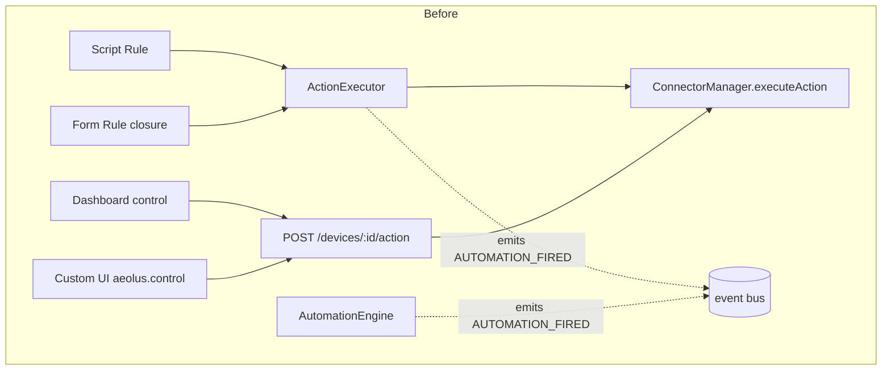
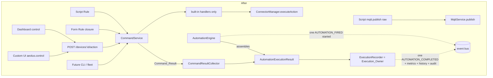
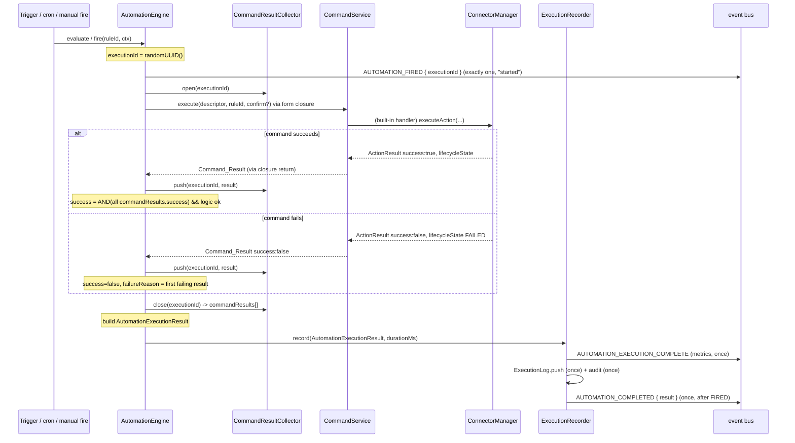
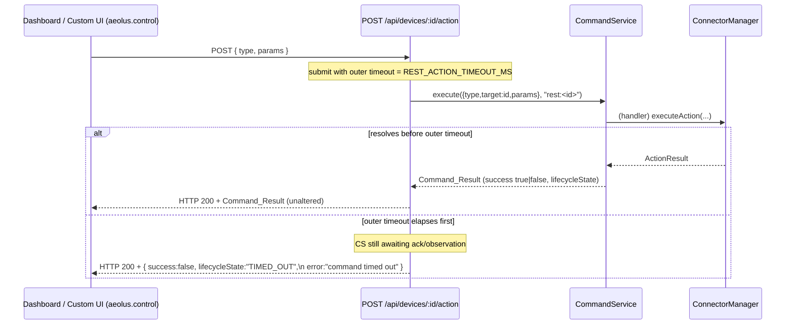

# Design Document

## Overview

Aeolus has a well-designed command lifecycle (owned by **verified-command-execution**), but today only two code paths reach it, and the rest of the system diverges:

- The **script path** (`devices.action()` in `src/automations/sandbox.ts` → `ActionExecutor.execute()`) and **form rules** (the closure built in `registerUiRule()` in `src/api/routes/automation.routes.ts`) both call `ActionExecutor.execute()`, which owns the lifecycle.
- The **REST route** `POST /api/devices/:id/action` (`src/api/routes/device.routes.ts`) calls `connectorManager.executeAction()` **directly**, skipping the lifecycle boundary. The **dashboard controls** and **custom-UI `aeolus.control()`** both reach devices through that same REST route (`SdkBroker.control` → `authFetch(POST /api/devices/:id/action)` in `frontend/src/sandbox/sandbox-host.ts`), so they inherit the bypass.

The result is two divergent paths — `Script → ActionExecutor → ConnectorManager` versus `Dashboard / Custom UI / REST → ConnectorManager` (direct) — so correlation, dispatch, acknowledgement, and observation are applied inconsistently depending on where a command originated.

This design establishes **one physical-command boundary** that every command source routes through. Following the third-party review, the boundary is the evolution of `ActionExecutor` renamed to **`CommandService`** to reflect its grown responsibility as the physical-command orchestrator. `ConnectorManager.executeAction()` is made reachable **only** through `CommandService` by construction — no Command_Source is handed a `ConnectorManager` reference anymore.

The design also fixes truthful end-to-end result propagation. Grounded in the current code, three defects are corrected:

1. The form-rule closure `await actionExecutor.execute(descriptor, stored.id)` **ignores the returned `ActionResult`**. Because `execute()` returns `{ success: false }` instead of throwing, `AutomationEngine.executeDirectRule()` records the automation as **successful even when the physical command failed**.
2. `executeDirectRule()` emits `AUTOMATION_FIRED` **before** the async outcome is known, and `ActionExecutor.execute()` emits `AUTOMATION_FIRED` **again** on success — a successful form action produces a **duplicate** fired event; a failed one still produces an **initial** fired event.
3. The manual `/fire` route does `await engine.fire(id, context)` then returns `{ success: true }` **without awaiting** the eventual automation outcome.

To fix these, a single structured **`AutomationExecutionResult`** (`{ executionId, success, commandResults, failureReason? }`) flows through both form-rule and script-rule execution, and exactly one component — the **Execution_Owner** — owns execution history, metrics, the completion event, and audit logging for a full execution. `AUTOMATION_FIRED` is redefined to mean "execution started" and is paired with a new `AUTOMATION_COMPLETED` event carrying the outcome. The `CommandService` is deliberately kept out of that responsibility: it stops emitting `AUTOMATION_FIRED` entirely.

### Scope

**In scope:** the single `CommandService` boundary; migrating the REST device-action route, dashboard controls, custom-UI control, and form-rule actions onto it; the `AutomationExecutionResult` contract propagated through form and script rules; correct `AUTOMATION_FIRED` (started) / `AUTOMATION_COMPLETED` (outcome) semantics with no duplicate or premature events; the manual `/fire` route awaiting the eventual result; one Execution_Owner for history/metrics/completion/audit; the REST device-action timeout as an outer safety bound; an optional observability signal for raw MQTT published to a device command topic.

**Out of scope (reused from other specs):** lifecycle states/transitions, `PendingCommandTracker`, MQTT correlation, confirmation timeouts, and `selectRequiredTier` (**verified-command-execution**); `ActionResult` / `BulkActionResult` and `ConnectorManager.executeAction()` semantics (**device-action-system-uplift**); the generated `automation()` helper awaiting async device actions (**async-await-in-scripts**, a dependency for full script-path truthfulness); raw `mqtt.publish()` as verified transport — it stays unverified by design.

### Cross-spec dependencies

- **Lifecycle & confirmation** — `CommandLifecycleState`, `PendingCommandTracker`, `ConfirmOptions`, `DEFAULT_CONFIRM_TIMEOUT_MS`, MQTT correlation, and `selectRequiredTier()` are defined in **verified-command-execution** (`src/core/types.ts`, `src/automations/command-lifecycle.ts`, `src/automations/pending-command-tracker.ts`) and reused unchanged.
- **`ActionResult` / `executeAction()`** — defined in **device-action-system-uplift** (`src/core/types.ts`, `src/connectors/connector-manager.ts`); referenced, not redefined. A `Command_Result` in this spec is exactly the `ActionResult` carrying a `lifecycleState`.
- **Truthful script-path propagation depends on async-await-in-scripts.** Requirement 5.3 needs a Script_Rule's `AutomationExecutionResult` to reflect the Command_Results of the commands it issued. That is only accurate once the generated `automation()` helper `await`s asynchronous device actions (owned by **async-await-in-scripts**). Until then the Form_Rule path is fully truthful; the Script_Rule path is truthful only for commands the script actually awaits. This design defines the target contract and the collection mechanism; the async-await-in-scripts fix makes the script path able to satisfy it. This dependency is called out again in the Components section where script-path aggregation is described.

## Architecture

### Component responsibilities

| Component | File | Change |
| --- | --- | --- |
| `CommandService` (was `ActionExecutor`) | `src/automations/command-service.ts` (renamed from `action-executor.ts`) | Renamed identity of the physical-command boundary (Req 1.6). Keeps the lifecycle logic. **Stops emitting `AUTOMATION_FIRED`** (Req 6.3, 8.5). Gains an explicit optional `requiredTier` input on `execute()` (Design Consideration 2). |
| `ConnectorManager` | `src/connectors/connector-manager.ts` | `executeAction()` is reachable only from within `CommandService`'s built-in handlers. No Command_Source is handed a `ConnectorManager` reference (Req 1.1, 2.7, 2.8). |
| `AutomationEngine` | `src/automations/automation-engine.ts` | Owns `AutomationExecutionResult` assembly for form and script rules; assigns `executionId`; emits exactly one `AUTOMATION_FIRED` (started) and delegates recording/`AUTOMATION_COMPLETED` to the Execution_Owner. `fire()` returns the `AutomationExecutionResult` (Req 4, 5, 6, 7). |
| `ExecutionRecorder` (Execution_Owner) | `src/automations/execution-recorder.ts` (new) | The single component that records history, emits `AUTOMATION_EXECUTION_COMPLETE` metrics, emits `AUTOMATION_COMPLETED`, and writes audit — once per execution, all derived from one `AutomationExecutionResult` (Req 8). |
| `CommandResultCollector` | `src/automations/command-result-collector.ts` (new) | Per-execution, keyed by `executionId`; the sink form-rule closures and sandbox host callbacks write each Command_Result into, in issue order (Req 4.3, 5.1, 5.3). |
| REST device-action route | `src/api/routes/device.routes.ts` | Depends on `CommandService` instead of `ConnectorManager`; returns the `Command_Result` unaltered with an outer timeout bound (Req 2.1, 3.1–3.7). |
| `SdkBroker` control dep | `frontend/src/sandbox/sandbox-host.ts`, `frontend/src/sandbox/sdk-broker.ts` | `control` returns the parsed `Command_Result` from the REST response instead of `Promise<void>` (Req 3.4). |
| Event constants | `src/core/event-bus.ts` | Add `AUTOMATION_COMPLETED`. |
| WS mappings | `src/index.ts`, `src/websocket/ws-server.ts` | Add `AUTOMATION_COMPLETED` → `automation-completed` mapping; optionally a per-transition lifecycle mapping (Design Consideration 1). |

### Before / after





Two things are enforced by the after-diagram: (1) `ConnectorManager.executeAction()` has exactly one inbound edge — `CommandService`'s built-in handlers; (2) `AUTOMATION_FIRED` has exactly one emitter — `AutomationEngine` — and `AUTOMATION_COMPLETED` has exactly one emitter — `ExecutionRecorder`. Raw `mqtt.publish()` keeps its own edge to the broker and never touches `CommandService`.

### Enforcing the single boundary "by construction" (Req 1.1, 2.7, 2.8)

The requirement is that `CommandService` is the *only* caller of `ConnectorManager.executeAction()`. Rather than a runtime guard, this is enforced through wiring and visibility:

1. **The physical-command call lives only inside `CommandService`'s built-in handlers.** `handleToggle` / `handleDeviceAction` (the only handlers that call `connectorManager.executeAction()`) are registered on the `CommandService` and receive `ConnectorManager` through `CommandServiceDeps`, which is private to the service. They are not exported to routes.
2. **No Command_Source is handed a `ConnectorManager` reference.** Today `createDeviceRoutes(registry, connectorManager, stateHistory)` receives `ConnectorManager` and calls `executeAction()` directly. After this change the route receives a `CommandService` (plus `registry` for the catalog endpoint) and never sees `ConnectorManager`. The composition root in `src/index.ts` stops passing `connectorManager` to `createDeviceRoutes`.
3. **Dashboard and Custom_UI inherit the fix for free.** Both reach devices only through `POST /api/devices/:id/action`. Once that route routes through `CommandService`, so do they (Req 2.2, 2.3). No frontend routing change is required beyond `SdkBroker.control` returning the structured result.
4. **The `executeAction` surface is narrowed to a capability the service holds.** `ConnectorManager` continues to expose `executeAction()` (device-action-system-uplift owns its semantics), but the composition root grants that reference to exactly one collaborator — the `CommandService` deps object. A short module-level comment and a lint/architecture note document that `connectorManager.executeAction(` must appear only within `command-service.ts` handlers. Because the reference is not distributed, a Command_Source physically cannot reach `executeAction()` without going through the service (Req 2.8): device state cannot change except via the boundary.
5. **`mqtt.publish()` is not a device-command path** and is intentionally excluded from the boundary (Req 2.12). It reaches `MqttService.publish()` directly and never produces a `Command_Result`.

This is "prevention by construction": the only object able to invoke `executeAction()` is the service, so an unverified command cannot reach `ConnectorManager` — there is nothing to guard at runtime because there is no other edge.

### Sequence — form rule (success and failure)



### Sequence — REST / custom-UI command (success and failure)



The REST route always answers HTTP 200 for domain-level outcomes (Req 3.5); failures are communicated through `success:false` + `failureReason`. The custom-UI broker resolves the RPC with the same structured `Command_Result`, including failures (Req 3.4).

### Where the Execution_Owner lives (Req 8, 6.3, 8.5)

The **Execution_Owner is a new dedicated collaborator, `ExecutionRecorder`**, owned by (constructed alongside and called only by) the `AutomationEngine`. Rationale:

- **It must own four things for a *full execution*** — history, metrics, `AUTOMATION_COMPLETED`, audit — and emit each exactly once (Req 8.1–8.3). Concentrating them in one class makes "exactly once, all from the same `AutomationExecutionResult`" a local invariant rather than a cross-file coordination problem (Req 8.4).
- **The `CommandService` must be kept out of this responsibility** (Req 8.5, 6.3). Per-command dispatch is not a full execution; a single execution may issue many commands. By moving history/metrics/completion/audit into `ExecutionRecorder` and removing the `AUTOMATION_FIRED` emission from `CommandService`, the service is reduced to "process one physical command, return one `Command_Result`" and records nothing about executions.
- **`AutomationEngine` assembles the `AutomationExecutionResult`; `ExecutionRecorder` consumes it.** The engine knows the sandbox outcome and the collected Command_Results; it computes `success` / `failureReason`, then hands the finished result to `ExecutionRecorder.record()`. The recorder derives recorded success, metrics status, and audit outcome from that single value, so they cannot disagree (Req 8.4). If the result is unavailable, the recorder writes a recording-failure entry and emits nothing else (Req 8.7).

Assembling `AutomationExecutionResult` from per-command Command_Results:

- **Form rule:** the `registerUiRule()` closure returns the `Command_Result` from `CommandService.execute()` instead of discarding it. The engine pushes it into the `CommandResultCollector` for the execution, so a single-command form rule yields `commandResults=[result]`. `success = result.success && logicOk`; on failure `failureReason` is taken from that result (Req 5.1, 5.2).
- **Script rule:** the sandbox host callbacks (`__actionRef` / `__actionAllRef`) push each issued `Command_Result` into the collector for the running `executionId`. After the sandbox resolves its `SandboxExecutionResult`, the engine combines the sandbox outcome with the collected results: `success = sandbox.success && every(commandResults, r => r.success)`; failure reason comes from the sandbox failure or the first failing command (Req 5.3, 5.4). **This is fully truthful only once async-await-in-scripts lands** so the script actually awaits its actions before the sandbox resolves; until then, commands the script fires-and-forgets may not appear in `commandResults`.

### Correlating callbacks to the running execution

Because Node runs one execution's synchronous/awaited chain without true parallel threads but with interleaved async, the engine needs a reliable way for a host callback to find "which execution am I inside." The design uses **`AsyncLocalStorage<string>`** (Node built-in) holding the current `executionId`, established by the engine when it starts an execution and read by the collector's `pushCurrent(result)` helper. This keeps the sandbox host callbacks unchanged in signature while attributing each `Command_Result` to the right execution even when multiple executions interleave (Req 6.7, 4.2). For form rules the engine already holds the `executionId` directly and can push explicitly.

## Components and Interfaces

### A. `CommandService` (renamed `ActionExecutor`) — Req 1.6

The class is renamed and its file moved; the public surface is unchanged except for (a) dropping the internal `AUTOMATION_FIRED` emission and (b) accepting an explicit optional `requiredTier`.

```typescript
// src/automations/command-service.ts  (was src/automations/action-executor.ts)

import type { ActionResult, CommandLifecycleState, ConfirmOptions } from "../core/types.js";
import type { ConfirmationTier } from "./command-lifecycle.js";

/** Descriptor for a single physical device command to be dispatched. */
export interface ActionDescriptor {
  type: string;
  target: string;
  params: Record<string, unknown>;
  correlation?: { correlationId: string; responseTopic: string };
}

export interface CommandServiceDeps {
  mqttService: MqttService;
  /** The ONLY holder of this reference outside ConnectorManager itself. */
  connectorManager: ConnectorManager;
  logger: Logger;
  deviceRegistry?: DeviceRegistry;
  pendingCommandTracker?: PendingCommandTracker;
  ackResponseTopicBase?: string;
}

export class CommandService {
  constructor(deps: CommandServiceDeps);

  registerHandler(type: string, handler: ActionHandler): void;
  unregisterHandler(type: string): void;

  /**
   * Process exactly one physical device command through the identical
   * dispatch-and-confirmation path regardless of Command_Source (Req 1.2, 2.10).
   * Never throws; always returns one Command_Result carrying a terminal
   * lifecycleState (Req 1.3, 1.7).
   *
   * @param requiredTier optional explicit tier ceiling requested by the author.
   *   When omitted, the service auto-selects the highest available tier
   *   (verified-command-execution behavior). When supplied it is validated
   *   against device capability and clamped — never reporting a tier the device
   *   cannot prove (Design Consideration 2 / Req consuming side).
   */
  execute(
    action: ActionDescriptor,
    ruleId: string,
    confirm?: ConfirmOptions,
    requiredTier?: ConfirmationTier,
  ): Promise<ActionResult>;
}
```

Two behavioral changes versus today's `ActionExecutor.execute()`:

- **No `AUTOMATION_FIRED`.** The private `emitFired()` calls are removed (Req 6.3, 8.5). The engine is now the sole emitter of the started signal.
- **Explicit tier ceiling (Design Consideration 2).** `requiredTier` lets a source require a *lower* tier than the maximum (e.g. treat `DISPATCHED` as success for a fire-and-forget action) or request a higher one for critical actions. The selection mechanism itself stays owned by verified-command-execution; this boundary only *consumes* the resulting tier. Validation: the requested tier is compared to the device's capability ceiling (`observed` needs `ConfirmOptions`; `acknowledged` needs a declared acknowledgement capability). A request exceeding the ceiling is clamped down to the highest provable tier and the clamp is logged; the returned `lifecycleState` is always one that was actually reached, never an aspirational one (Req 1.5, and "never reporting a tier that was not actually reached").

### B. `Command_Result` — reused, not redefined

A `Command_Result` is exactly the `ActionResult` from device-action-system-uplift carrying a `lifecycleState` from verified-command-execution:

```typescript
// src/core/types.ts — already defined; referenced here
export interface ActionResult {
  success: boolean;
  data?: Record<string, unknown>;
  error?: string;
  lifecycleState?: CommandLifecycleState;   // final terminal state
  correlationId?: string;
}
```

A type alias documents intent without introducing a new shape:

```typescript
// src/automations/execution-types.ts (new)
/** The per-command outcome value returned by CommandService. */
export type CommandResult = ActionResult;
```

### C. `AutomationExecutionResult` — Req 4

```typescript
// src/automations/execution-types.ts (new)

/** The structured outcome of one Automation_Execution. */
export interface AutomationExecutionResult {
  /** Unique among concurrently-active executions; not reused while active (Req 4.2). */
  executionId: string;
  /** True iff logic completed AND every commandResult.success is true (Req 4.4, 4.7). */
  success: boolean;
  /** Each issued command's Command_Result, in the order issued (Req 4.3). */
  commandResults: CommandResult[];
  /** Present iff success === false; identifies the failure cause (Req 4.5, 4.6, 4.8). */
  failureReason?: string;
}
```

Assembly rules (pure function, unit/property tested):

```typescript
// src/automations/execution-result.ts (new)

export interface LogicOutcome {
  ok: boolean;      // did the rule's execution logic complete without error?
  error?: string;   // logic failure detail (sandbox failure reason/message, thrown error)
}

/** Combine the execution logic outcome with the collected command results into
 *  the single AutomationExecutionResult (Req 4.4–4.8, 5.2, 5.4, 7 missing-result). */
export function assembleExecutionResult(
  executionId: string,
  logic: LogicOutcome,
  commandResults: CommandResult[],
): AutomationExecutionResult;
```

Semantics enforced by `assembleExecutionResult`:

- `success === true` **iff** `logic.ok === true` **and** every `commandResults[i].success === true` (Req 4.4). Zero commands + `logic.ok` ⇒ `success:true`, empty `commandResults` (Req 4.7).
- If any command failed, `success:false` and `failureReason` describes at least the first failing `Command_Result` (Req 4.5).
- If logic failed (independently of commands), `success:false` and `failureReason` describes the logic failure (Req 4.6).
- A populated `failureReason` is never paired with `success:true` (Req 4.8) — guaranteed because `failureReason` is only set on the `success:false` branch.
- A `null`/`undefined` entry among expected command results (Command_Service returned no result) ⇒ `success:false`, `failureReason` indicates the missing command result (Req 5.7).

### D. Execution_Owner — `ExecutionRecorder` — Req 8

```typescript
// src/automations/execution-recorder.ts (new)

export interface ExecutionRecorderDeps {
  eventBus: EventEmitter;
  executionLog: ExecutionLog;
  logger: Logger;
}

export interface ExecutionRecordInput {
  rule: { id: string; name?: string; ruleType: "form" | "script"; triggerTopic: string };
  result: AutomationExecutionResult;
  /** Measured wall-clock duration; recorded as a non-negative integer ms (Req 8.6). */
  durationMs: number;
}

/**
 * The single component that records an Automation_Execution's history, metrics,
 * completion event, and audit — each exactly once, all derived from the same
 * AutomationExecutionResult (Req 8.1–8.4). The CommandService performs none of
 * these (Req 8.5).
 */
export class ExecutionRecorder {
  constructor(deps: ExecutionRecorderDeps);

  /** Record one execution. Idempotency is guaranteed by being called once per
   *  execution by the engine; ordering guarantees AUTOMATION_COMPLETED is emitted
   *  after AutomationEngine has emitted AUTOMATION_FIRED (Req 6.6). */
  record(input: ExecutionRecordInput): void;

  /** Req 8.7 — when the result needed to record is unavailable, write a
   *  recording-failure log entry and emit NONE of metrics/COMPLETED/history-success. */
  recordUnavailable(
    rule: ExecutionRecordInput["rule"],
    executionId: string,
    durationMs: number,
    reason: string,
  ): void;
}
```

`record()` performs, in order: (1) `ExecutionLog.push(entry)` with `success` and `failureReason` from the result and `duration = durationMs` (Req 5.5, 5.6, 8.1, 8.6); (2) `eventBus.emit(AUTOMATION_EXECUTION_COMPLETE, { status: success ? "success" : "error", durationMs, ruleId, ruleName })` (Req 8.2); (3) audit log at info/error derived from the same `success` (Req 8.4); (4) `eventBus.emit(AUTOMATION_COMPLETED, { result })` (Req 8.3, 6.2). Because all four read the one `result`, recorded success, metrics status, and audit outcome match (Req 8.4).

### E. `AutomationEngine` changes — Req 4, 5, 6, 7

```typescript
// src/automations/automation-engine.ts (changed signatures)

export interface AutomationEngineDeps {
  sandbox?: Sandbox;
  commandService?: CommandService;         // renamed from actionExecutor
  executionRecorder?: ExecutionRecorder;   // Execution_Owner
  collector?: CommandResultCollector;
}

export class AutomationEngine {
  /** Manually fire a rule and RESOLVE WITH the eventual result (Req 7.1). */
  fire(ruleId: string, context: EventContext): Promise<AutomationExecutionResult>;

  // internal:
  private executeScriptRule(rule: Rule, compiledJs: string, ctx: EventContext): Promise<AutomationExecutionResult>;
  private executeDirectRule(rule: Rule, ctx: EventContext): Promise<AutomationExecutionResult>;
}
```

Behavioral changes:

- **One started signal.** Each execution: `executionId = randomUUID()` (Req 4.2), emit exactly one `AUTOMATION_FIRED { executionId, ruleId, ... }` denoting "started" (Req 6.1). The premature emission in `executeDirectRule()` and the per-command emission in the service are both removed, eliminating duplicate/premature fired events.
- **`executeDirectRule` awaits the real outcome.** It runs the rule's action (which now returns a `CommandResult` for form rules), collects it, assembles the `AutomationExecutionResult`, and calls `ExecutionRecorder.record()`. Returns the result.
- **`executeScriptRule` combines sandbox + collected commands.** It sets the `executionId` in `AsyncLocalStorage`, runs the sandbox, reads the collected Command_Results, assembles, records, returns.
- **`fire()` returns the assembled result** so the `/fire` route can surface it (Req 7).
- **Concurrency correlation.** `executionId` ties each `AUTOMATION_FIRED` and `AUTOMATION_COMPLETED` to its execution even when executions interleave (Req 6.7).

Ordering guarantee (Req 6.6): `AUTOMATION_FIRED` is emitted synchronously by the engine at execution start; `AUTOMATION_COMPLETED` is emitted by `ExecutionRecorder.record()`, which the engine calls only after the outcome is known — strictly after FIRED for the same `executionId`.

### F. `CommandResultCollector` — Req 4.3, 5.1, 5.3

```typescript
// src/automations/command-result-collector.ts (new)

export class CommandResultCollector {
  /** Begin collecting for an execution. */
  open(executionId: string): void;
  /** Append a Command_Result in issue order for an explicit execution. */
  push(executionId: string, result: CommandResult): void;
  /** Append for the execution currently on the AsyncLocalStorage context
   *  (used by sandbox host callbacks whose signatures are unchanged). */
  pushCurrent(result: CommandResult): void;
  /** Finish and return the ordered results (Req 4.3). */
  close(executionId: string): CommandResult[];
  /** The AsyncLocalStorage carrying the active executionId. */
  readonly context: AsyncLocalStorage<string>;
}
```

The collector preserves push order, giving `commandResults` in the order commands were issued (Req 4.3).

### G. Form-rule closure change — Req 2.5, 5.1

In `registerUiRule()` the form-rule action returns the Command_Result instead of discarding it. The `Rule.action` type widens to allow returning a `CommandResult`:

```typescript
// src/core/types.ts (Rule.action widened)
action: (context: EventContext) => void | CommandResult | Promise<void | CommandResult>;

// src/api/routes/automation.routes.ts (registerUiRule, form branch)
const action = async (_ctx: EventContext): Promise<CommandResult> => {
  const descriptor: ActionDescriptor = { type: stored.action_type, target: stored.action_target, params };
  return commandService.execute(descriptor, stored.id); // returned, not discarded
};
```

The engine's `executeDirectRule` awaits this, pushes the returned result into the collector (or records a missing-result failure if `undefined`, Req 5.7).

### H. REST device-action route change — Req 2.1, 3.1–3.7

```typescript
// src/api/routes/device.routes.ts (signature + handler)

export function createDeviceRoutes(
  registry: DeviceRegistry,
  commandService: CommandService,   // was ConnectorManager
  stateHistory?: StateHistory,
): Router;

// POST /:id/action
router.post("/:id/action", requireTabPermission("interact"), validateAction, asyncHandler(async (req, res) => {
  const id = req.params.id as string;
  const result = await withTimeout(
    commandService.execute({ type: req.body.type, target: id, params: req.body.params ?? {} }, `rest:${id}`),
    REST_ACTION_TIMEOUT_MS,
    (): ActionResult => ({ success: false, lifecycleState: "TIMED_OUT", error: "Device command timed out" }),
  );
  res.json(result); // HTTP 200 always; success/lifecycleState/error carried in body (Req 3.1–3.5)
}));
```

- Returns the `Command_Result` unaltered (Req 3.1), always HTTP 200 for domain failures (Req 3.5), with `lifecycleState` a defined value (Req 3.2) and a `failureReason`/`error` on failure (Req 3.3).
- The catalog endpoint `GET /:id/actions` still needs the catalog; the route keeps a reference to `connectorManager.getActionCatalog` via a small read-only accessor injected separately, **not** the full manager, preserving the "no Command_Source holds `executeAction`" rule. Concretely `createDeviceRoutes` also receives `getActionCatalog: (id: string) => CapabilityDescriptor[]` bound from the manager at composition.

**Outer timeout bound (Req 3.6, 3.7).** `REST_ACTION_TIMEOUT_MS` is a configured value that MUST be `>=` the maximum confirmation timeout the service can apply. The service's per-command ceiling is `DEFAULT_CONFIRM_TIMEOUT_MS` (5000 ms) unless `ConfirmOptions.timeoutMs` overrides it; the REST route submits without `ConfirmOptions`, so its commands are dispatch/ack-tier and resolve within the ack timeout. The config exposes both so the invariant is checkable:

```typescript
// src/config.ts (additions)
maxConfirmTimeoutMs: number;   // default DEFAULT_CONFIRM_TIMEOUT_MS = 5000
restActionTimeoutMs: number;   // default 7000; MUST be >= maxConfirmTimeoutMs (Req 3.7)
```

A startup assertion enforces `restActionTimeoutMs >= maxConfirmTimeoutMs` so the REST timeout acts only as an outer safety net and never preempts a command still legitimately awaiting acknowledgement/observation.

### I. Custom-UI broker returns the structured result — Req 3.4

`SdkBroker`'s `control` dep and `executeOp` return the parsed `Command_Result` instead of `void`:

```typescript
// frontend/src/sandbox/sdk-broker.ts (BrokerDeps.control return type)
control: (entityId: string, deviceId: string, actionType: string, params?: Record<string, unknown>)
  => Promise<CommandResult>;

// executeOp "control" branch returns the result to the RPC response
case "control":
  return this.deps.control(entityId, params.deviceId as string, params.actionType as string,
                           params.params as Record<string, unknown> | undefined);

// frontend/src/sandbox/sandbox-host.ts (control impl)
async function control(_e, deviceId, actionType, params): Promise<CommandResult> {
  const res = await authFetch(`${API_URL}/api/devices/${deviceId}/action`, {
    method: "POST", headers: { "Content-Type": "application/json" },
    body: JSON.stringify({ type: actionType, params }),
  });
  return (await res.json()) as CommandResult; // resolves with success:false too (Req 3.4)
}
```

`aeolus.control(...)` now resolves with the structured `Command_Result` — including `success:false` — rather than resolving as success independently of the outcome.

### J. Event constants — Req 6.2

```typescript
// src/core/event-bus.ts (addition)
export const AUTOMATION_COMPLETED = "automation:completed" as const;
```

Existing constants are unchanged. `AUTOMATION_FIRED` keeps its string value but its **meaning** is redefined to "execution started"; the only remaining emitter is `AutomationEngine`. `AUTOMATION_EXECUTION_COMPLETE` (the metrics event) is retained and emitted only by `ExecutionRecorder`.

### K. WebSocket mapping — Design Consideration 1

`AUTOMATION_COMPLETED` is added to `WS_MAPPINGS` so the terminal outcome reaches the frontend through the existing data-driven mapping in `ws-server.ts`:

```typescript
// src/index.ts (WS_MAPPINGS additions)
{ eventName: AUTOMATION_COMPLETED, messageType: "automation-completed" },
```

**Live lifecycle progress — recommendation.** The requirements guarantee a "started" signal and a terminal per-command outcome, which suffices for a final-state UI (badges showing each command's terminal `lifecycleState`). A live view showing each command advance through `REQUESTED → DISPATCHED → ACKNOWLEDGED → OBSERVED` would require the `CommandService` to emit a per-transition lifecycle event and a matching WS mapping to forward it.

**Recommendation: ship terminal outcomes only in this feature; do not emit per-transition events yet.** Reasons: (1) it keeps `CommandService` free of broadcast concerns and preserves the "service records nothing about executions" boundary; (2) terminal `lifecycleState` per command already lets the UI render final-state badges from the `AUTOMATION_COMPLETED` payload; (3) per-transition streaming multiplies event volume on constrained hardware (Raspberry Pi) for a cosmetic gain. If live progress is later desired, the clean extension is a dedicated `COMMAND_LIFECYCLE_TRANSITION` event emitted by the `PendingCommandTracker`/service and a `{ eventName: COMMAND_LIFECYCLE_TRANSITION, messageType: "command-lifecycle" }` mapping — additive, and it does not change this feature's contract.

## Data Models

### AutomationExecutionResult
`{ executionId: string; success: boolean; commandResults: CommandResult[]; failureReason?: string }` (section C). Transient; flows from engine → recorder; the `AUTOMATION_COMPLETED` payload carries it.

### CommandResult
Alias of `ActionResult` (section B) — `{ success, data?, error?, lifecycleState?, correlationId? }`. Owned by device-action-system-uplift + verified-command-execution.

### ExecutionLogEntry (reused, already additive)
`src/automations/execution-log.ts` already carries optional `reason` and `lifecycleState` on `actions[]` and a required `duration`. The recorder now also stores the execution-level `success` and, on failure, a `failureReason`. Because the log is an in-memory ring buffer (cap 200), the shape change is additive at runtime — no persisted migration. The `actions[]` array is populated from `commandResults` (one entry per command, each with its terminal `lifecycleState`), plus a synthesized entry for script/logic outcome:

```typescript
// execution-log.ts — additive fields
export interface ExecutionLogEntry {
  // ...existing...
  success?: boolean;        // execution-level success (Req 5.5)
  failureReason?: string;   // execution-level failure reason (Req 5.6)
}
```

### Event payloads
- `AUTOMATION_FIRED` → `{ executionId: string; ruleId: string; ruleName: string; topic: string; deviceId: string; timestamp: number }` (adds `executionId`).
- `AUTOMATION_COMPLETED` → `{ result: AutomationExecutionResult; ruleId: string; ruleName: string; timestamp: number }` (new).
- `AUTOMATION_EXECUTION_COMPLETE` → unchanged `{ ruleId, ruleName, status, durationMs }`.

### Config additions
`maxConfirmTimeoutMs` (default 5000) and `restActionTimeoutMs` (default 7000, asserted `>= maxConfirmTimeoutMs`) in `src/config.ts` (section H).

### ConfirmationTier (reused)
`"dispatch" | "acknowledged" | "observed"` from `src/automations/command-lifecycle.ts`; now also an explicit optional input to `CommandService.execute()` (section A).

## Correctness Properties

*A property is a characteristic or behavior that should hold true across all valid executions of a system — essentially, a formal statement about what the system should do. Properties serve as the bridge between human-readable specifications and machine-verifiable correctness guarantees.*

Property-based testing applies well to the pure, deterministic logic this feature introduces: execution-result assembly (`assembleExecutionResult`), command-result ordering (`CommandResultCollector`), `executionId` uniqueness, tier selection/clamping, and the event count/ordering invariants (verifiable against a lightweight emitter model). Architectural single-boundary invariants (Req 1.1, 2.7, 2.8), the rename (1.6), source-migration wiring (2.1–2.6), the REST timeout edge (3.6), the config bound assertion (3.7), and the recorder's unavailable branch (8.7) are covered by architecture, example, and edge tests in the Testing Strategy rather than PBT.

The properties below were derived from the prework and consolidated to remove redundancy (e.g. the many "success mirrors the result" criteria in Req 5/7/8 collapse into the assembly and single-owner properties; the fired/completed count/ordering criteria in Req 6/8 collapse into one event-semantics property).

### Property 1: Source-independent command processing

*For any* command descriptor, `CommandService.execute()` produces the same `Command_Result` (same `success` and terminal `lifecycleState`) regardless of which Command_Source submitted it — the function exposes no source discriminator, so identical descriptors under identical device capability and tracker state yield identical outcomes.

**Validates: Requirements 1.2, 2.10**

### Property 2: Every command yields exactly one terminal Command_Result and never rejects

*For any* handler outcome — success, explicit `{ success:false }`, or a thrown error — `CommandService.execute()` resolves (never rejects) to exactly one `ActionResult` whose `lifecycleState` is a terminal state, and whose `success` is `false` for the failure/throw cases with a non-empty `error`.

**Validates: Requirements 1.3, 1.7**

### Property 3: Tier is capability-gated and never exceeds the device ceiling

*For any* combination of supplied `ConfirmOptions`, declared acknowledgement capability, and an optional author-requested `requiredTier`, the effective tier follows Observed > Acknowledged > Dispatch, never exceeds the device's provable ceiling (Observed requires confirm; Acknowledged requires a declared capability; Dispatch otherwise), and the reported terminal `lifecycleState` is one that is actually reachable for the effective tier — an over-requested tier is clamped down, never reported as reached.

**Validates: Requirements 1.5, and the author-selectable-tier Design Consideration (explicit tier input validated against capability)**

### Property 4: Validation rejects before the connector is reached

*For any* command that fails pre-flight validation (no handler registered for the action type, or a confirmation observed-device that does not exist), `CommandService.execute()` returns `success:false` with a terminal failure `lifecycleState` and the underlying `ConnectorManager.executeAction()` is never invoked, leaving device state unchanged.

**Validates: Requirements 1.8, 2.9**

### Property 5: Raw MQTT publishing stays unverified and unblocked

*For any* topic and payload — including topics the device registry identifies as command topics — the raw `mqtt.publish()` path publishes the message without rejecting or blocking, and produces no `Command_Result` and no `lifecycleState`; only `CommandService.execute()` produces a lifecycle-bearing verified result.

**Validates: Requirements 2.11, 2.12, 2.13**

### Property 6: The REST route returns the Command_Result truthfully over HTTP 200

*For any* `Command_Result` produced by the service, the REST device-action route responds with HTTP 200 and a body whose `success` equals the result's `success`, whose `lifecycleState` is one of the defined `CommandLifecycleState` values, and which — when `success` is `false` — carries a non-empty human-readable failure reason; the route never alters the `success` value or converts a domain failure into an HTTP error status.

**Validates: Requirements 3.1, 3.2, 3.3, 3.5**

### Property 7: Custom-UI control resolves with the structured outcome

*For any* `Command_Result` body returned by the REST route, the custom-UI `control` operation resolves with that same structured result — including when `success` is `false` — rather than resolving as success independently of the outcome.

**Validates: Requirements 3.4**

### Property 8: Execution-result assembly is faithful

*For any* execution-logic outcome and any list of collected command results (including the empty list and lists containing a missing/undefined result), `assembleExecutionResult` sets `success` to `true` if and only if the logic completed without error and every command result reports `success === true`; whenever `success` is `false` it populates `failureReason` describing at least the first failing command, the logic failure, or the missing command result as applicable; and it never pairs a populated `failureReason` with `success === true`.

**Validates: Requirements 4.1, 4.4, 4.5, 4.6, 4.7, 4.8, 5.2, 5.3, 5.4, 5.7**

### Property 9: Command results are collected in issue order and fully incorporated

*For any* sequence of command results pushed for an execution, the collector returns them on `close()` in the exact order they were pushed with the same length, so the assembled `AutomationExecutionResult.commandResults` contains every issued command's result in issue order.

**Validates: Requirements 4.3, 5.1**

### Property 10: Execution ids are unique across concurrently active executions

*For any* sequence of started executions, the assigned `executionId` values are pairwise distinct across all executions active at the same time, and an id is not reused while its execution remains active.

**Validates: Requirements 4.2**

### Property 11: Fired/completed event semantics

*For any* set of executions (single or interleaved, each issuing zero or more commands), the engine emits exactly one `AUTOMATION_FIRED` (started) and exactly one `AUTOMATION_COMPLETED` per `executionId`, the `AUTOMATION_FIRED` for an execution precedes its `AUTOMATION_COMPLETED`, each event is correlated to its execution by `executionId`, the `AUTOMATION_COMPLETED` payload's `success` equals the execution result's `success`, and the `CommandService` emits zero `AUTOMATION_FIRED` events no matter how many commands it processes.

**Validates: Requirements 6.1, 6.2, 6.3, 6.4, 6.5, 6.6, 6.7, 8.5**

### Property 12: Single-owner, exactly-once recording derived from one result

*For any* execution recorded through the Execution_Owner, exactly one execution-history entry is written, exactly one `AUTOMATION_EXECUTION_COMPLETE` metrics event and exactly one `AUTOMATION_COMPLETED` event are emitted, the recorded success, the metrics status, and the audit outcome all correspond to the same `AutomationExecutionResult.success` (and the recorded `failureReason` matches when unsuccessful), and the recorded duration is a non-negative integer number of milliseconds.

**Validates: Requirements 5.5, 5.6, 8.1, 8.2, 8.3, 8.4, 8.6**

### Property 13: Manual fire resolves with the eventual result

*For any* manually fired execution, `engine.fire()` resolves only after the execution reaches an outcome and yields the same `AutomationExecutionResult` that was recorded — so the manual-fire response reports that result's `success`, includes its `executionId`, and (when unsuccessful) includes its non-empty `failureReason`.

**Validates: Requirements 7.1, 7.2, 7.3, 7.4, 7.5**

## Error Handling

- **Command dispatch failures.** `CommandService.execute()` never throws. A thrown handler error or an explicit `{ success:false }` handler result becomes a `FAILED` terminal `Command_Result` with the underlying message (Req 1.7). This preserves the existing "always returns an ActionResult" contract.
- **Validation failures.** Missing handler for the action type, or a confirmation observed-device that does not exist, produce a `FAILED` result before any connector call (Req 1.8, 2.9). No device state changes.
- **REST outer timeout.** If the service does not produce a result within `restActionTimeoutMs`, the route returns a synthesized `{ success:false, lifecycleState:"TIMED_OUT", error:"Device command timed out" }` (Req 3.6). The in-flight service promise is allowed to settle on its own (the tracker's per-command timer bounds it); the route simply stops waiting. The startup assertion `restActionTimeoutMs >= maxConfirmTimeoutMs` guarantees this never preempts a command still legitimately confirming (Req 3.7).
- **Missing command result during assembly.** If an expected command yields no result (service returned nothing for a dispatched command), `assembleExecutionResult` marks the execution unsuccessful with a missing-result `failureReason` (Req 5.7).
- **Logic failures.** A script sandbox failure (`SandboxExecutionResult.success === false`) or a form-closure throw is treated as `logic.ok === false`; the execution result is unsuccessful with the logic failure reason (Req 4.6, 5.4).
- **Recording unavailable.** If the `AutomationExecutionResult` needed to record is unavailable, `ExecutionRecorder.recordUnavailable()` writes a single recording-failure log entry and emits no metrics, no `AUTOMATION_COMPLETED`, and no success history (Req 8.7).
- **Raw MQTT failures.** Raw `mqtt.publish()` retains its current behavior — a disconnected broker surfaces through the existing publish path, never as a verified `Command_Result` (Req 2.12). The optional command-topic observability signal is best-effort and non-blocking: its failure never affects the publish (Req 2.13).
- **Custom-UI broker.** If the REST call itself fails at the transport level, the broker's existing `OP_FAILED` response path applies; a domain failure (HTTP 200 with `success:false`) resolves normally with the structured result (Req 3.4).

## Testing Strategy

The repository uses **Vitest + fast-check** (see `src/automations/command-lifecycle.property.test.ts`, `pending-command-tracker.property.test.ts`, `action-executor.property.test.ts`). This feature follows the same conventions: property tests run a minimum of **100 iterations** (existing suites use `{ numRuns: 200 }`), and each property test is tagged with a comment referencing the design property.

### Property-based tests (Vitest + fast-check)

Each of the 13 correctness properties maps to a single property-based test. Suggested files:

- `src/automations/command-service.property.test.ts` — Properties 1, 2, 3, 4 (using a spy `ConnectorManager`/handler and a fake `PendingCommandTracker` so no real MQTT/network is exercised).
- `src/automations/execution-result.property.test.ts` — Property 8 (pure `assembleExecutionResult`).
- `src/automations/command-result-collector.property.test.ts` — Property 9.
- `src/automations/automation-engine.property.test.ts` — Properties 10, 11, 13 (against an in-memory event-bus model capturing emissions; a fake `CommandService` returning generated results; a spy `ExecutionRecorder`).
- `src/automations/execution-recorder.property.test.ts` — Property 12 (spy `ExecutionLog` + captured event emissions).
- `src/api/routes/device.routes.property.test.ts` — Property 6 (supertest against the route with a fake `CommandService` returning generated results).
- `frontend/src/sandbox/sdk-broker.property.test.ts` — Property 7 (extend existing file; fake `control` dep returning generated results, assert the RPC response echoes them).
- `src/automations/raw-mqtt.property.test.ts` — Property 5 (spy `MqttService.publish`; assert publish-only, no lifecycleState).

Each test uses the tag format, e.g.:

```typescript
// Feature: unified-command-boundary, Property 8: Execution-result assembly is faithful
```

fast-check arbitraries: `fc.record` for command results (`success`, optional `error`, `lifecycleState` from `fc.constantFrom(...terminalStates)`), `fc.array` for command-result lists (including empty and undefined-bearing), `fc.constantFrom` for tiers/capability flags, and `fc.uuid`/counters for execution sequences.

### Example and integration tests

- **Single-boundary architecture (Req 1.1, 2.7, 2.8, 1.6).** A test that scans the source tree asserting `connectorManager.executeAction(` (or `.executeAction(`) appears only inside `src/automations/command-service.ts` handlers; a composition test asserting `createDeviceRoutes` and the broker deps receive no `ConnectorManager`/`executeAction` reference; a type/import test asserting `CommandService` is the exported boundary.
- **Source migration (Req 2.1–2.6).** Example tests: REST route delegates to `CommandService`; the form-rule closure returns the service result; the sandbox host callback invokes the service; the broker `control` op hits `/api/devices/:id/action`. Dashboard/custom-UI are covered transitively via the REST route test.
- **Dispatch ordering (Req 1.4).** Example that a dispatch-only device yields `DISPATCHED`.
- **REST outer timeout (Req 3.6).** Example with fake timers: a service promise that never resolves ⇒ route returns `success:false`, `lifecycleState:"TIMED_OUT"`.
- **Config bound (Req 3.7).** Assertion test that startup rejects `restActionTimeoutMs < maxConfirmTimeoutMs` and that defaults satisfy the bound.
- **Recorder unavailable branch (Req 8.7).** Example asserting `recordUnavailable()` writes one failure entry and emits nothing else.

### Unit tests

Focused unit tests cover: the `withTimeout` helper; `assembleExecutionResult` boundary examples (empty list, single failing command, logic-fail-with-successful-commands); and the tier-clamp helper for specific (requested, ceiling) pairs.

Property tests handle broad input coverage; unit/example tests handle specific scenarios, integration points, and the architectural invariants that are not "for all inputs" statements.

## Requirements-to-Property Mapping

| Requirement | Covered by |
| --- | --- |
| 1.1 Only-caller of executeAction | Architecture test (single call site) |
| 1.2 Source-independent path | Property 1 |
| 1.3 Exactly one terminal Command_Result | Property 2 |
| 1.4 Dispatch before ConnectorManager | Example test |
| 1.5 Capability-gated handoffs | Property 3 |
| 1.6 Renamed identity | Type/import test |
| 1.7 executeAction failure ⇒ terminal failure, no throw | Property 2 |
| 1.8 Validation rejects before executeAction | Property 4 |
| 2.1 REST via Command_Service | Example test |
| 2.2 Dashboard via Command_Service | Example test (transitive via REST) |
| 2.3 Custom-UI via Command_Service | Example test (broker → REST) |
| 2.4 Script via Command_Service | Example test |
| 2.5 Form via Command_Service | Example test |
| 2.6 Future fleet/CLI same path | Example test |
| 2.7 Only path to ConnectorManager | Architecture test |
| 2.8 Cannot reach ConnectorManager otherwise | Composition/architecture test |
| 2.9 Unverifiable ⇒ reject, don't forward | Property 4 |
| 2.10 Identical verification per source | Property 1 |
| 2.11 Only path representing verified execution | Property 5 |
| 2.12 Raw MQTT unverified, no Command_Result | Property 5 |
| 2.13 Raw MQTT to command topic not blocked | Property 5 |
| 3.1 REST returns Command_Result unaltered | Property 6 |
| 3.2 Response includes defined lifecycleState | Property 6 |
| 3.3 Failure ⇒ success:false + reason | Property 6 |
| 3.4 Custom-UI resolves structured result | Property 7 |
| 3.5 HTTP 200 for domain failures | Property 6 |
| 3.6 No result within timeout ⇒ timed-out result | Example test (fake timers) |
| 3.7 REST timeout >= max confirm timeout | Assertion/smoke test |
| 4.1 AutomationExecutionResult shape | Property 8 |
| 4.2 executionId uniqueness | Property 10 |
| 4.3 commandResults in issue order | Property 9 |
| 4.4 All success + logic ok ⇒ success | Property 8 |
| 4.5 Any failure ⇒ failureReason from first | Property 8 |
| 4.6 Logic failure ⇒ success false + reason | Property 8 |
| 4.7 No commands + logic ok ⇒ success, empty | Property 8 |
| 4.8 failureReason never with success | Property 8 |
| 5.1 Form result incorporated | Property 9 |
| 5.2 Form failure ⇒ unsuccessful + reason | Property 8 |
| 5.3 Script success + all ok ⇒ success | Property 8 |
| 5.4 Sandbox/command failure ⇒ unsuccessful | Property 8 |
| 5.5 Recorded uses result.success | Property 12 |
| 5.6 Unsuccessful records failureReason | Property 12 |
| 5.7 Missing command result ⇒ unsuccessful | Property 8 |
| 6.1 Exactly one FIRED (started) | Property 11 |
| 6.2 Exactly one COMPLETED | Property 11 |
| 6.3 Service emits no FIRED | Property 11 |
| 6.4 Multi-command ⇒ <=1 fired/completed | Property 11 |
| 6.5 Failure ⇒ COMPLETED success false | Property 11 |
| 6.6 FIRED before COMPLETED | Property 11 |
| 6.7 Concurrent correlation by executionId | Property 11 |
| 7.1 Manual fire awaits outcome | Property 13 |
| 7.2 Response reports result.success | Property 13 |
| 7.3 Failed fire ⇒ success false | Property 13 |
| 7.4 Failed fire ⇒ non-empty failureReason | Property 13 |
| 7.5 Response includes executionId | Property 13 |
| 8.1 Single recorder of history, once | Property 12 |
| 8.2 Single metrics emitter, once | Property 12 |
| 8.3 Single AUTOMATION_COMPLETED emitter, once | Property 12 |
| 8.4 Success/metrics/audit all from one result | Property 12 |
| 8.5 Service records none of these | Property 11 |
| 8.6 Duration non-negative integer ms | Property 12 |
| 8.7 Result unavailable ⇒ recording-failure only | Example/edge test |
| Design Consideration 1 (live progress) | Recommendation: terminal outcomes only; WS `automation-completed` mapping |
| Design Consideration 2 (author-selectable tier) | Property 3 + `requiredTier` input |
