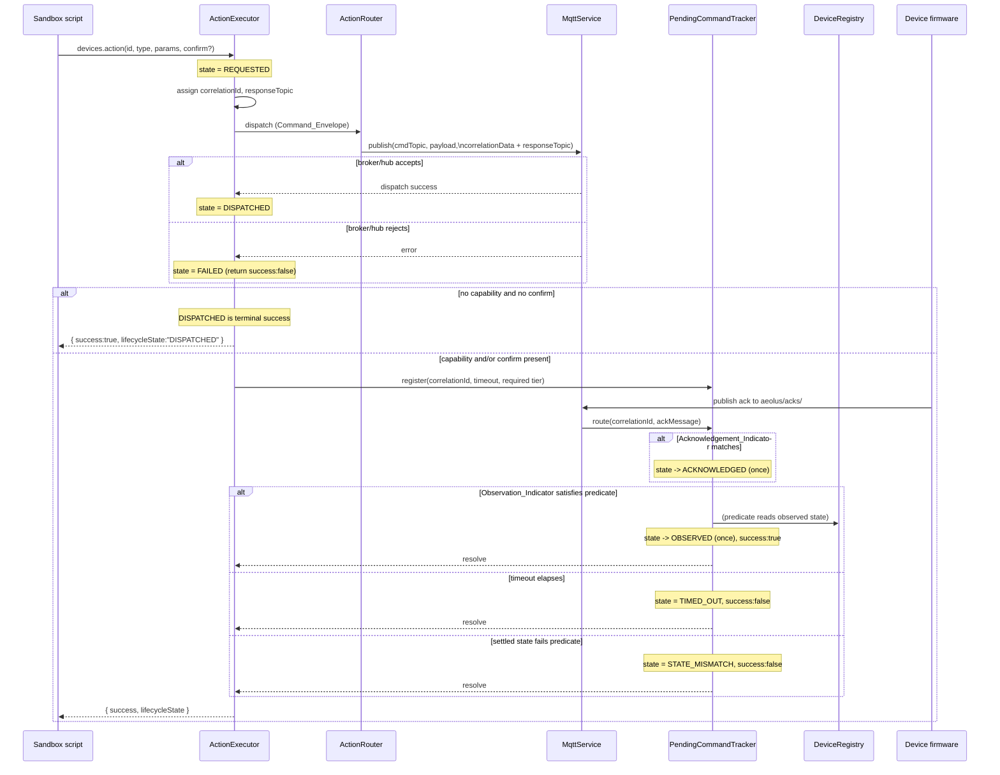
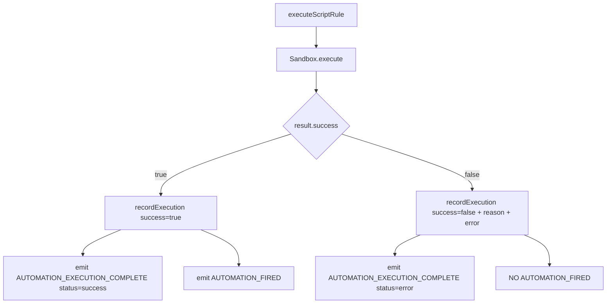

# Design Document

## Overview

Aeolus currently claims success in two places where success is not established. `Sandbox.execute()` returns `Promise<void>`, catches every isolate error, logs it, and resolves regardless of outcome — so runtime throws, 5 s timeouts, and 32 MB memory-limit kills are all recorded as successful executions. Separately, an action reported `{ success: true }` the moment a connector or the MQTT broker *accepted* a command, conflating dispatch with physical reality.

This design makes Aeolus report success only when success actually happened, across three truthful tiers:

1. **Dispatch (universal)** — the hub/broker accepted the command → `DISPATCHED`.
2. **Acknowledged (capability-gated)** — the device itself confirms receipt/execution via a message on a topic Aeolus already subscribes to → `ACKNOWLEDGED`.
3. **Observed (opt-in via `confirm`)** — an observable device's state satisfies a predicate → `OBSERVED`.

Tiers above dispatch are opt-in, so simple devices terminate truthfully at `DISPATCHED` and every existing `devices.action()` / `devices.actionAll()` caller keeps working unchanged.

The design is grounded in the current code:

- `Sandbox.execute()` (`src/automations/sandbox.ts`) gains a discriminated `SandboxExecutionResult` return type, still never rejecting.
- `AutomationEngine.executeScriptRule()` (`src/automations/automation-engine.ts`) branches on the real result; its current `.catch()` branch is dead code (the promise never rejects) and is removed.
- `ActionExecutor.execute()` (`src/automations/action-executor.ts`) threads a `CommandLifecycleState` through `ActionResult`, and evaluates optional `confirm` predicates against `DeviceRegistry` state.
- A new `PendingCommandTracker` correlates MQTT acks/observations back to the command that produced them.
- `Connector` (`src/connectors/connector.interface.ts`) gains an acknowledgement-capability declaration, following the existing `getActionCatalog()` pattern.
- `MqttService` (`src/mqtt/mqtt-service.ts`) sets MQTT 5 Correlation Data / Response Topic properties on publish and routes response-topic messages to the tracker.

### Scope

**In scope:** truthful sandbox results; accurate execution-log/metrics/event emission for script rules; the command lifecycle; the acknowledgement-capability surface; the optional confirm/observe mechanism; backward compatibility; per-device bulk outcomes; MQTT command correlation and observability.

**Out of scope:** fleet/multi-site management, new connectors (Modbus/Deye), frontend UI sandboxing, database migration overhaul, licensing.

## Architecture

### Component responsibilities

| Component | File | Change |
| --- | --- | --- |
| `Sandbox` | `src/automations/sandbox.ts` | `execute()` returns `SandboxExecutionResult`; classifies runtime/timeout/memory/unavailable; host callbacks accept optional 4th `confirm` arg. |
| `AutomationEngine` | `src/automations/automation-engine.ts` | `executeScriptRule()` acts on the real result; removes dead `.catch()`; records reason + duration; gates `AUTOMATION_FIRED`. |
| `ActionExecutor` | `src/automations/action-executor.ts` | Owns the lifecycle state machine; evaluates `confirm`; assigns `correlationId`; registers pending commands. |
| `PendingCommandTracker` | `src/automations/pending-command-tracker.ts` (new) | In-memory map keyed by `correlationId`; per-command timeouts; idempotent transitions. |
| `Connector` | `src/connectors/connector.interface.ts` | Optional `getAcknowledgementCapability(deviceId)` declaration. |
| `MqttService` | `src/mqtt/mqtt-service.ts` | `publish()` sets MQTT 5 `correlationData` + `responseTopic`; `handleMessage()` recognises response-topic messages and routes them to the tracker. |
| `DeviceRegistry` | `src/core/device-registry.ts` | Unchanged; read as the Observed_Device source (already fed by `DEVICE_STATE_CHANGE`). |

### Command dispatch and confirmation flow



### Sandbox result flow



### Where the lifecycle lives

The lifecycle state machine is owned by `ActionExecutor.execute()`. For dispatch-only commands the whole lifecycle resolves synchronously within `execute()` (REQUESTED → DISPATCHED | FAILED). When acknowledgement capability or `confirm` is in play, `execute()` hands the command's terminal resolution to the `PendingCommandTracker`, `await`s the tracker's promise, and returns the final `ActionResult`. This keeps `execute()`'s existing "never throws, always returns an `ActionResult`" contract intact.

## Components and Interfaces

### A. Sandbox execution result

```typescript
// src/automations/sandbox.ts

/** Categorized cause of a sandbox execution failure. */
export type SandboxFailureReason = "runtime" | "timeout" | "memory" | "unavailable";

/** Discriminated result of a single sandbox execution. Never rejects. */
export type SandboxExecutionResult =
  | { success: true }
  | { success: false; error: string; reason: SandboxFailureReason };
```

`Sandbox.execute()` signature changes from `Promise<void>` to `Promise<SandboxExecutionResult>`. It still resolves for every outcome (Req 1.7).

**Failure classification from isolated-vm.** `isolated-vm` surfaces the three failure modes distinctly, but not through a single typed error class, so classification inspects the thrown error and isolate state in a fixed chronological order (Req 1.8 — report the first-detected condition):

1. **Unavailable** — checked *before* running: if the conditionally-imported `ivm` module is `null`, return `{ success:false, reason:"unavailable", error:"Sandbox execution unavailable — isolated-vm is not installed" }` (Req 1.6).
2. **Timeout** — `script.run(ctx, { timeout })` rejects with an error whose message contains `"Script execution timed out"`. Detection: `/timed out/i.test(err.message)` → `reason:"timeout"` (Req 1.3).
3. **Memory** — when the 32 MB limit is exceeded the isolate is torn down; `isolate.wasDisposed` becomes `true` and/or the error is a `RangeError` whose message references the memory limit (e.g. contains `"memory limit"` or `"disposed"`). Detection order: check `isolate?.wasDisposed === true` OR `/memory limit|array buffer allocation failed|disposed/i.test(err.message)` → `reason:"memory"` (Req 1.4).
4. **Runtime** — any other thrown error (user `throw`, `TypeError`, etc.) → `reason:"runtime"` (Req 1.2).

Because timeout and memory can both look like disposal, the classifier checks the timeout signature first, then memory, then defaults to runtime. The `error` string is always the underlying `err.message` (Req 1.5). A helper isolates this so it is unit- and property-testable without a live isolate:

```typescript
// src/automations/sandbox.ts (exported for testing)
export function classifySandboxError(
  err: Error,
  isolateWasDisposed: boolean,
): { reason: Exclude<SandboxFailureReason, "unavailable">; error: string };
```

The host callbacks (`__actionRef`, `__actionAllRef`) already return `ActionResult` / `BulkActionResult`; those results are unchanged in shape except for the new lifecycle field (below). Success of the *script* is independent of the success of individual actions the script dispatched.

### B. Command lifecycle

```typescript
// src/core/types.ts

/** Ordered lifecycle states a device command passes through. */
export type CommandLifecycleState =
  | "REQUESTED"
  | "DISPATCHED"
  | "ACKNOWLEDGED"
  | "OBSERVED"
  | "FAILED"
  | "TIMED_OUT"
  | "STATE_MISMATCH";
```

**Allowed transitions** (enforced centrally; any other transition is rejected as a no-op and logged):

```
REQUESTED  -> DISPATCHED | FAILED
DISPATCHED -> ACKNOWLEDGED | OBSERVED | TIMED_OUT | STATE_MISMATCH
ACKNOWLEDGED -> OBSERVED | TIMED_OUT | STATE_MISMATCH
(FAILED, OBSERVED, TIMED_OUT, STATE_MISMATCH are terminal)
```

Terminal success states: `DISPATCHED` (when neither capability nor confirm applies), `OBSERVED`. Terminal failure states: `FAILED`, `TIMED_OUT`, `STATE_MISMATCH`. `ACKNOWLEDGED` is an intermediate waypoint, never a terminal success on its own unless it is also the required tier for that command (a device that declares acknowledgement capability but is given no `confirm` treats `ACKNOWLEDGED` as its terminal success; if no ack arrives it goes `TIMED_OUT`).

A small pure helper guards transitions so the monotonic-advance property is centrally enforced:

```typescript
// src/automations/command-lifecycle.ts (new)
export function canTransition(from: CommandLifecycleState, to: CommandLifecycleState): boolean;
export function isTerminal(state: CommandLifecycleState): boolean;
export function isSuccessState(state: CommandLifecycleState): boolean; // DISPATCHED | OBSERVED | ACKNOWLEDGED-as-terminal
```

### C. Confirmation options

```typescript
// src/core/types.ts

/** Optional confirmation of a command's physical effect. */
export interface ConfirmOptions {
  /** Device to observe; defaults to the command's target device when omitted. */
  deviceId?: string;
  /** Predicate evaluated against the Observed_Device state. */
  condition: (state: Record<string, unknown>) => boolean;
  /** Timeout in ms before TIMED_OUT. Defaults to DEFAULT_CONFIRM_TIMEOUT_MS. */
  timeoutMs?: number;
}

/** Default confirmation timeout applied when ConfirmOptions omit timeoutMs (Req 5.7). */
export const DEFAULT_CONFIRM_TIMEOUT_MS = 5000;
```

`condition` is a function, so it originates from inside the sandbox for script rules. The sandbox host callbacks accept the predicate as an isolated-vm `Reference` and wrap it in a host-side function that applies it to observed state (see host-callback note below). Evaluation is wrapped in try/catch: a throw → `FAILED` with the thrown message (Req 5.6).

### D. Extended ActionResult / BulkActionResult

```typescript
// src/core/types.ts (additions marked)

export interface ActionResult {
  success: boolean;
  data?: Record<string, unknown>;
  error?: string;
  /** Final Command_Lifecycle state. NEW — optional for backward compatibility. */
  lifecycleState?: CommandLifecycleState;
  /** Correlation id assigned at dispatch. NEW — present for MQTT commands that correlate. */
  correlationId?: string;
}

export interface BulkActionResult {
  total: number;
  succeeded: number;
  failed: number;
  /** Each entry carries its own lifecycleState via the embedded ActionResult. */
  results: Array<{ deviceId: string } & ActionResult>;
}
```

`lifecycleState` is optional so existing readers of `success` / `data` / `error` are unaffected (Req 6.2). It is always populated by the new code path; optionality is purely a type-compatibility/migration concern.

### E. Acknowledgement capability surface

Follows the existing optional-method pattern on `Connector` (like `getActionCatalog?`):

```typescript
// src/connectors/connector.interface.ts

/** Declares whether a device can itself acknowledge command receipt/execution. */
export interface AcknowledgementCapability {
  /** True when this device publishes a Device_Acknowledgement Aeolus can ingest. */
  supported: boolean;
  /** Response-topic space the device publishes acks to (e.g. "aeolus/acks/controller-1"). */
  responseTopic?: string;
  /** Field name in the ack message whose presence/value confirms receipt (default "status"). */
  ackIndicatorField?: string;
  /** Value(s) of ackIndicatorField that count as acknowledgement (default: any non-empty). */
  ackIndicatorValues?: string[];
}

export interface Connector {
  // ...existing members...

  /**
   * Return the acknowledgement capability for a device, or undefined to
   * indicate the device reaches at most the Dispatch tier. Analogous to
   * getActionCatalog(). Requirements: 9.1
   */
  getAcknowledgementCapability?(deviceId: string): AcknowledgementCapability | undefined;
}
```

MQTT devices without a connector-declared capability default to no acknowledgement (Dispatch tier), consistent with `resolveActionCatalog()`'s fallback behaviour.

### F. Pending command tracker

```typescript
// src/automations/pending-command-tracker.ts (new)

export interface AckMessage {
  correlationId: string;
  /** Acknowledgement_Indicator field value (e.g. status="executed"). */
  status?: string;
  /** Observation_Indicator payload / device state (e.g. { state: "running" }). */
  state?: Record<string, unknown>;
}

/** What tier a pending command must reach to resolve as success. */
export type RequiredTier = "acknowledged" | "observed";

export interface PendingCommand {
  correlationId: string;
  targetDeviceId: string;
  observedDeviceId: string;
  requiredTier: RequiredTier;
  condition?: (state: Record<string, unknown>) => boolean;
  timeoutMs: number;
  state: CommandLifecycleState; // starts DISPATCHED
}

export interface PendingResolution {
  lifecycleState: CommandLifecycleState;
  success: boolean;
  error?: string;
}

export class PendingCommandTracker {
  /** Register a dispatched command awaiting ack/observation. Returns a promise that
   *  resolves once with the terminal resolution (never rejects). Starts the timeout. */
  register(cmd: PendingCommand): Promise<PendingResolution>;

  /** Route a correlated message. Idempotent per tier; ignores late/unknown ids (Req 10.13, 10.14). */
  route(msg: AckMessage): void;

  /** Feed a subsequent DEVICE_STATE_CHANGE for observation-only satisfaction (Req 5.8, 10.10). */
  observeState(deviceId: string, state: Record<string, unknown>): void;

  /** True if a correlationId is currently outstanding. */
  has(correlationId: string): boolean;

  /** Number of outstanding commands (for observability/tests). */
  get size(): number;
}
```

**Lifecycle inside the tracker.** On `register`, the command is `DISPATCHED` and a timer for `timeoutMs` is armed. Incoming messages:

- **Acknowledgement_Indicator matches** → transition to `ACKNOWLEDGED` at most once (Req 10.9, 10.14). If `requiredTier === "acknowledged"`, resolve success.
- **Observation_Indicator satisfies `condition`** → transition to `OBSERVED` at most once (Req 10.10), resolve `{ success:true }` (Req 5.2). A single message can drive both transitions (Req 10.11, 5-way single-message-satisfies-both).
- **Settled state fails `condition`** → `STATE_MISMATCH`, resolve `{ success:false }` (Req 5.4). "Settled" means the message is a definitive observation (an ack carrying `state`, or a `DEVICE_STATE_CHANGE` for the observed device) whose value does not satisfy the predicate. Ambient non-matching states before any correlated observation are ignored until timeout.
- **Timeout fires first** → `TIMED_OUT`, resolve `{ success:false }` (Req 5.3, 10.12).
- **Predicate throws** → `FAILED`, resolve `{ success:false, error }` (Req 5.6).

After resolution the command is removed from the map; any later message for that `correlationId` finds nothing and is ignored (idempotent late-ack handling, Req 10.13). Duplicate acks that arrive before removal are absorbed by the "at most once per tier" guard.

**Process restart / MQTT reconnect.** The tracker is purely in-memory. On process restart or a mid-flight MQTT reconnect, outstanding `PendingCommand`s are lost; their `register()` promises would never resolve, so `register()` arms an OS timer that is independent of MQTT connectivity — a command whose ack is lost across a reconnect still resolves via `TIMED_OUT` rather than hanging forever. This is documented as an accepted limitation: correlation is best-effort and bounded by the per-command timeout; Aeolus never persists pending commands.

### G. Command envelope and MQTT 5 properties

```typescript
// src/automations/pending-command-tracker.ts or a shared types module

export interface CommandEnvelope {
  correlationId: string;
  responseTopic: string;
  /** The device command payload, mirrored with correlation fields for firmware
   *  that reads the JSON rather than MQTT 5 properties. */
  payload: Record<string, unknown> & { correlationId: string; responseTopic: string };
}
```

`MqttService.publish()` is extended to accept and set MQTT 5 properties:

```typescript
// src/mqtt/mqtt-service.ts
publish(
  topic: string,
  payload: string,
  options?: {
    messageExpiryInterval?: number;
    correlationData?: Buffer;   // MQTT 5 Correlation Data (Req 10.1)
    responseTopic?: string;     // MQTT 5 Response Topic (Req 10.1)
  },
): void;
```

The existing single `messageExpiryInterval` property is preserved; the new properties are added to the same `properties` object only when provided, so all current callers are unaffected. The `correlationId` is also mirrored into the JSON payload so firmware reading either mechanism can respond (Req 10.1).

### H. Ack ingestion routing

`MqttService.handleMessage()` currently emits `DEVICE_STATE_CHANGE` for every subscribed topic. The extension recognises response-topic messages and routes them to the tracker instead of (or in addition to) normal ingestion:

- Aeolus subscribes to the response-topic space (e.g. `aeolus/acks/#`) via the existing client and topic list.
- On each message, `handleMessage()` checks whether the topic matches the configured ack topic space (a prefix/wildcard test, injected as config so it is testable without a broker).
- **If it is an ack topic:** read the correlation id from the MQTT 5 Correlation Data property when present, else from the payload `correlationId` field (Req 10.5–10.8). If both present, prefer Correlation Data (Req 10.6). If neither yields a resolvable id, do not match any pending command (Req 10.8) — the message is dropped for correlation (and optionally still logged).
- Route the resolved `AckMessage` to `PendingCommandTracker.route()`.
- **Normal (non-ack) topics** continue to emit `DEVICE_STATE_CHANGE` unchanged, which both updates the `DeviceRegistry` and feeds `PendingCommandTracker.observeState()` for observation-only confirmation (Req 5.8).

Because the tracker holds the wiring between MQTT and `ActionExecutor`, it is constructed once at composition and injected into both `ActionExecutor` (to `register`) and the MQTT ingestion path (to `route` / `observeState`). To avoid a hard `MqttService → ActionExecutor` dependency, routing is done through a thin callback the tracker exposes, subscribed via the event bus or a direct reference set at composition time (mirroring `ActionRouter.setMqttService()`).

### I. Sandbox host-callback backward compatibility

The bootstrap `devices.action` / `devices.actionAll` wrappers gain an optional 4th `confirm` argument while preserving the 3-arg form (Req 6.4):

```javascript
// inside BOOTSTRAP_SCRIPT
globalThis.devices = {
  // ...
  action: function(deviceId, actionType, params, confirm) {
    return actionRef.apply(undefined,
      [deviceId, actionType, params, confirm], // confirm may be undefined
      { result: { promise: true } });
  },
  actionAll: function(filter, actionType, params, confirm) {
    return actionAllRef.apply(undefined,
      [filter, actionType, params, confirm],
      { result: { promise: true } });
  }
};
```

The host-side `__actionRef` / `__actionAllRef` receive `confirm` as an isolated-vm `Reference` to the predicate (or `undefined`). When present, the host wraps the reference in a plain function `(state) => predicateRef.applySync(undefined, [new ivm.ExternalCopy(state).copyInto()])` and passes it as `ConfirmOptions.condition` to `ActionExecutor.execute()`. When `confirm` is `undefined`, behaviour is byte-for-byte the current dispatch-only path (Req 6.1, 6.3).

### J. Asynchronous script completion and fail-fast (Req 11)

The `automation()` bootstrap helper becomes `async` and awaits each action callback in order. To detect a *logical* (non-throwing) command failure without depending on user callbacks returning the result, the in-isolate `devices.action` / `devices.actionAll` wrappers set an isolate-global failure flag whenever a returned `ActionResult` / `BulkActionResult` has `success === false`. After each action, `automation()` checks that flag and, unless `config.continueOnFailure === true`, stops the loop — fail-fast (Req 11.3, 11.4). When `continueOnFailure` is `true`, every action is invoked regardless of individual failures and the aggregate outcome is reported (Req 11.5).

Independently of `automation()`, the **await gap** is closed generally. The host-side `__actionRef` / `__actionAllRef` register each in-flight action promise in a per-execution set, and `Sandbox.execute()` awaits `Promise.allSettled` of that set (within the collector's `AsyncLocalStorage` context) AFTER `script.run()` returns and BEFORE resolving. This guarantees every `collector.pushCurrent()` lands before `AutomationEngine` calls `collector.close()` (Req 11.2). Because isolated-vm runs classic scripts with no top-level await, this host-side drain — not script-level await — is what guarantees completion, and it also covers imperative scripts that call `devices.action()` directly without `automation()` (Req 11.1).

The drain is bounded by a completion budget that is separate from the isolate CPU `EXECUTION_TIMEOUT_MS` (which still guards synchronous CPU work), so an action that never settles cannot hang `execute()` (Req 11.7). Note the current code comment in `automation-engine.ts` `executeScriptRule()` flagging this exact dependency (the "cross-spec seam" / async-await-in-scripts note); remove or update it once implemented.

### K. Register-before-dispatch ordering (Req 12)

`CommandService.execute()` currently computes tier + `correlationId` + envelope, then dispatches via `handler(...)`, then (for tracked tiers) calls `pendingCommandTracker.register(...)` and awaits. The corrected sequence computes tier + `correlationId` + envelope as today, then for a tracked tier calls `pendingCommandTracker.register(...)` to obtain the resolution promise (this synchronously inserts the map entry and arms the timer) BEFORE calling `handler(...)` to dispatch. If the handler throws or returns `success:false`, it calls the new `pendingCommandTracker.cancel(correlationId)` and returns a `FAILED` result (Req 12.2); otherwise it `await`s the registration promise as today.

Add a new method to `PendingCommandTracker`: `cancel(correlationId: string): void` that clears the entry's timer, deletes it from the map, and resolves its promise with a terminal failure resolution (`{ lifecycleState: "FAILED", success: false }`) so any awaiter settles (Req 12.4, 12.5). This eliminates the window where a fast device reply arrives during the connector publish/await (before `register`) and is dropped as an unknown/late correlation id, after which the command wrongly `TIMED_OUT` (Req 12.1, 12.3). The dispatch-only path (no tracker involvement) is unchanged, so its terminal `ActionResult` is unaffected (Req 12.6).

### L. End-to-end ack integration harness (Req 13)

An integration test uses the existing mock MQTT client pattern (see `src/mqtt/*.integration.test.ts` and `src/__integration__/mqtt-automation-pipeline.integration.test.ts`, plus the `__test-helpers__`): wire a real `MqttService` with `setAckRouter(tracker)`, a `CommandService` with the tracker and a `connectorManager` stub whose `getAcknowledgementCapability` returns `{ supported: true, responseTopic: "aeolus/acks/<device>" }`. It dispatches a command, simulates the device publishing an ack to the response topic with the matching correlation id (driven through the real routing path — `resolveCorrelationId` and the ack-topic match calling `PendingCommandTracker.route`), and asserts `ACKNOWLEDGED` (Req 13.1, 13.2, 13.3). A no-reply case asserts `TIMED_OUT` using fake timers (Req 13.4).

## Data Models

### Sandbox execution result
Discriminated union `SandboxExecutionResult` (section A). `reason` present only on failure.

### Command lifecycle
`CommandLifecycleState` string union (section B) with a central transition table.

### ExecutionLogEntry (migration)
`ExecutionLogEntry.actions[]` entries gain optional fields. Existing readers tolerate the additions because they are optional:

```typescript
// src/automations/execution-log.ts
actions: Array<{
  type: string;
  target: string;
  success: boolean;
  error?: string;
  reason?: SandboxFailureReason;          // NEW — script failures (Req 2.3)
  lifecycleState?: CommandLifecycleState; // NEW — command outcomes (Req 8.4)
}>;
```

`duration` remains required and is always recorded (Req 2.4). No stored-schema migration is required because the execution log is an in-memory ring buffer (`ExecutionLog`, capped at 200), not a persisted table — so the shape change is purely additive at runtime.

### Pending command
`PendingCommand` / `AckMessage` / `PendingResolution` (section F), all transient in-memory.

### Command envelope
`CommandEnvelope` (section G): `correlationId` (UUID via `randomUUID()`), `responseTopic`, and a payload mirroring both.

## Correctness Properties

*A property is a characteristic or behavior that should hold true across all valid executions of a system — essentially, a formal statement about what the system should do. Properties serve as the bridge between human-readable specifications and machine-verifiable correctness guarantees.*

The properties below were derived from the acceptance criteria via the prework analysis and consolidated to remove redundancy. They target the pure, deterministic logic introduced by this feature — error classification, result mapping, the lifecycle state machine, bulk arithmetic, correlation-id resolution, and idempotent transitions — all of which are amenable to property-based testing with `fast-check`. Logging, interface declarations, and MQTT-broker wiring are covered by example/integration tests in the Testing Strategy instead.

### Property 1: Sandbox error classification is accurate and honors precedence

*For any* thrown error and isolate-disposed flag, `classifySandboxError` returns `reason === "timeout"` when the message carries the timeout signature, otherwise `reason === "memory"` when the isolate was disposed or the message carries a memory signature, otherwise `reason === "runtime"`; and in every failure case the returned `error` is a non-empty string equal to the underlying message. When more than one signature matches, the timeout classification wins over memory (first-detected chronological order).

**Validates: Requirements 1.2, 1.3, 1.4, 1.5, 1.8**

### Property 2: Sandbox execution always resolves

*For any* execution outcome (success, runtime, timeout, memory, or unavailable), `Sandbox.execute()` resolves its promise with a `SandboxExecutionResult` and never rejects.

**Validates: Requirements 1.7**

### Property 3: The engine faithfully mirrors the sandbox result into the execution log

*For any* `SandboxExecutionResult`, the execution-log entry the engine records has `success` equal to the result's `success`, and when the result is a failure the entry includes the result's `error` string and `reason`.

**Validates: Requirements 2.1, 2.2, 2.3**

### Property 4: Metrics and events reflect the true script outcome

*For any* `SandboxExecutionResult`, the engine emits an `AUTOMATION_EXECUTION_COMPLETE` event with status `success` if and only if the result's `success` is `true` (and `error` otherwise), and emits an `AUTOMATION_FIRED` event if and only if the result's `success` is `true`.

**Validates: Requirements 3.1, 3.2, 3.3, 3.4**

### Property 5: Dispatch outcome maps to DISPATCHED or FAILED

*For any* dispatch attempt, a command that is accepted without error advances to `DISPATCHED`, and a command whose dispatch produces an error advances to `FAILED` with a non-empty error message.

**Validates: Requirements 4.3, 4.4**

### Property 6: ACKNOWLEDGED requires declared capability; dispatch-only terminates truthfully at DISPATCHED

*For any* command whose target device's connector declares no Acknowledgement_Capability and which is given no Confirmation_Options, the final lifecycle state is `DISPATCHED` (with `success === true`) or `FAILED`, and is never `ACKNOWLEDGED`; equivalently, no command ever reaches `ACKNOWLEDGED` without a declared Acknowledgement_Capability.

**Validates: Requirements 4.5, 4.7, 4.8, 9.2, 9.3, 9.5**

### Property 7: Every reported outcome carries a terminal lifecycle state

*For any* command outcome returned by the Action_Executor or recorded in the Execution_Log, the reported `lifecycleState` is present and is one of the terminal states `DISPATCHED`, `OBSERVED`, `ACKNOWLEDGED`(as-terminal), `FAILED`, `TIMED_OUT`, or `STATE_MISMATCH`.

**Validates: Requirements 4.9, 8.4**

### Property 8: Confirmation resolves to the correct terminal state

*For any* command with Confirmation_Options observing a present device: if a correlated or observed state satisfies the predicate before the timeout, the command reaches `OBSERVED` with `success === true` (regardless of whether the connector declares an Acknowledgement_Capability); if a correlated settled observation fails the predicate, the command reaches `STATE_MISMATCH` with `success === false`; if the predicate throws, the command reaches `FAILED` with `success === false` and the thrown message; and if no satisfying observation arrives before the timeout, the command reaches `TIMED_OUT` with `success === false`.

**Validates: Requirements 5.2, 5.3, 5.4, 5.6, 5.9, 10.10, 10.12**

### Property 9: Bulk action arithmetic and per-device fidelity

*For any* set of matched devices and their individual outcomes, `devices.actionAll()` returns one entry per matched device, `total` equals the matched count, `succeeded` equals the number of entries with `success === true`, `failed` equals the number with `success === false`, `succeeded + failed === total` holds, each entry's `success` reflects that device's own outcome, and each entry carries a valid terminal `lifecycleState`. When zero devices match, `total`, `succeeded`, and `failed` are all zero and `results` is empty.

**Validates: Requirements 7.1, 7.2, 7.3, 7.4, 7.5, 7.6, 7.7**

### Property 10: Highest available confirmation tier is selected

*For any* combination of declared Acknowledgement_Capability and supplied Confirmation_Options, the required confirmation tier is `observed` when Confirmation_Options are present, otherwise `acknowledged` when the capability is declared, otherwise `dispatch` — following the ordering Observed > Acknowledged > Dispatch.

**Validates: Requirements 9.6**

### Property 11: Command envelope mirrors correlation across both mechanisms

*For any* dispatched correlating command, the `correlationId` carried in the MQTT 5 Correlation Data equals the `correlationId` mirrored in the JSON payload, and the Response_Topic is likewise present in both the MQTT 5 Response Topic property and the payload.

**Validates: Requirements 10.1**

### Property 12: Correlation ids are unique across outstanding commands

*For any* sequence of dispatched commands (single or bulk), the assigned `correlationId` values are pairwise distinct across all commands outstanding at the same time.

**Validates: Requirements 10.2, 10.3**

### Property 13: Correlation id resolution honors source precedence

*For any* incoming response-topic message, the resolved `correlationId` is taken from the MQTT 5 Correlation Data property when present, otherwise from the payload `correlationId` field; when both are present the MQTT 5 value is used; and when neither is present no Pending_Command is matched.

**Validates: Requirements 10.5, 10.6, 10.7, 10.8**

### Property 14: Correlated acknowledgement drives the ACKNOWLEDGED transition, including combined satisfaction

*For any* Pending_Command whose connector declares an Acknowledgement_Capability, a correlated Ack_Message whose Acknowledgement_Indicator confirms receipt advances the command to `ACKNOWLEDGED`; and when a single correlated message both confirms acknowledgement and satisfies the Confirmation_Options predicate, both the `ACKNOWLEDGED` and `OBSERVED` transitions are applied for that command.

**Validates: Requirements 4.6, 10.9, 10.11**

### Property 15: Late and duplicate acknowledgements are idempotent

*For any* Pending_Command, delivering any number of correlated Ack_Messages that satisfy the same tier applies the corresponding lifecycle transition at most once, and any correlated message arriving after the command has reached a terminal state causes no further state transition.

**Validates: Requirements 10.13, 10.14**

### Property 16: Fail-fast action ordering

*For any* ordered sequence of automation-body actions with individual success/failure outcomes, the runner invokes actions in order and, when `continueOnFailure` is false, invokes no action after the first failing one; when `continueOnFailure` is true, it invokes every action regardless of failures.

**Validates: Requirements 11.3, 11.5**

### Property 17: Pending-command cancellation is idempotent and settles the awaiter

*For any* registered Pending_Command, calling `cancel()` clears its timer, removes it from the tracker, and settles its `register()` promise with a `FAILED`/`success:false` resolution; a subsequent `cancel()` or any late routed message for that correlation id causes no further transition and does not re-settle.

**Validates: Requirements 12.4, 12.5**

## Error Handling

- **Sandbox never rejects.** `execute()` wraps all isolate work in try/catch and returns a `SandboxExecutionResult`. The `unavailable` case is handled before any isolate is created. This preserves the existing "never propagate" contract while making the outcome inspectable (Req 1.6, 1.7).
- **Dead catch removal.** `AutomationEngine.executeScriptRule()`'s `.catch()` branch is unreachable once `execute()` resolves a result object; it is removed and replaced by a single `.then(result => ...)` that branches on `result.success`. If `execute()` itself is refactored to `async/await`, the branch is a straight `if/else`.
- **ActionExecutor never throws.** The existing guarantee is retained. New failure modes map to lifecycle states: dispatch error → `FAILED`; missing observed device → `success:false` with an identifying error (Req 5.5) before any pending command is registered; predicate throw → `FAILED` (Req 5.6); timeout → `TIMED_OUT` (Req 5.3); settled mismatch → `STATE_MISMATCH` (Req 5.4).
- **Tracker resolves exactly once.** `register()`'s promise resolves once; the timer and message routes race but the first terminal transition wins and subsequent routes are ignored (Req 10.13, 10.14). Timers are cleared on resolution to avoid leaks.
- **Restart / reconnect.** In-memory pending commands are lost on restart or across a reconnect; the per-command OS timer guarantees eventual `TIMED_OUT` resolution rather than an indefinite hang. Documented as an accepted limitation — Aeolus never persists pending commands.
- **Malformed ack messages.** Messages on the response-topic space with no resolvable correlation id are dropped for correlation (Req 10.8) and may be logged; they are not treated as ordinary device state.
- **Observability.** Terminal transitions log target, final state, and error (Req 8.1); `TIMED_OUT` / `STATE_MISMATCH` additionally log the observed device id and the applied timeout (Req 8.2); script failures log rule id, reason, and error (Req 8.3).

## Testing Strategy

This repo already uses `fast-check` extensively (e.g. `src/automations/sandbox.property.test.ts`, `action-executor.property.test.ts`). The strategy uses property-based tests for the pure logic above and example/integration tests for wiring and side effects.

### Property-based tests

- **Library:** `fast-check` with `vitest` (existing setup). Do not hand-roll generators for shared shapes — reuse `makeDevice`-style helpers already present in `sandbox.property.test.ts`.
- **Iterations:** minimum 100 runs per property (`{ numRuns: 200 }` where existing tests already use 200, to stay consistent).
- **Tagging:** each property test is tagged with a comment in the form
  `// Feature: verified-command-execution, Property {number}: {property_text}`.
- **One property → one property test.** Each of Properties 1–15 is implemented by a single property-based test.
- **Determinism for timers:** timeout-driven properties (P8, P15) use `vitest` fake timers so the `TIMED_OUT` path is exercised deterministically rather than by wall-clock waiting.
- **Isolation:** the classifier (P1), lifecycle transition table (P5, P6, P7), tracker (P8, P14, P15), bulk arithmetic (P9), tier selection (P10), envelope construction (P11), id uniqueness (P12), and id resolution (P13) are all tested against their pure helpers without a live isolate or broker — mirroring how `sandbox.property.test.ts` simulates `__actionAllRef` directly.

Suggested test files:

- `src/automations/sandbox.property.test.ts` — extend with P1, P2.
- `src/automations/automation-engine.property.test.ts` — P3, P4, P7.
- `src/automations/command-lifecycle.property.test.ts` — P5, P6, P10.
- `src/automations/pending-command-tracker.property.test.ts` — P8, P13, P14, P15.
- `src/automations/action-executor.property.test.ts` — extend with P9, P12.
- `src/mqtt/command-envelope.property.test.ts` — P11.

### Unit / example tests

- Sandbox `unavailable` branch when `ivm` is null (Req 1.6); duration recorded ≥ 0 (Req 2.4, 3.5); initial `REQUESTED` assignment (Req 4.2).
- Missing observed device → identifying error (Req 5.5); default timeout applied when omitted (Req 5.7); observation sourced from `DEVICE_STATE_CHANGE` state (Req 5.8).
- Backward compatibility: 3-arg `devices.action()` / `devices.actionAll()` calls, `success`/`data`/`error` field retention, unchanged bulk shape without confirm (Req 6.1–6.4, 7 shape).
- Connector `getAcknowledgementCapability?()` declaration presence and fallback to Dispatch tier (Req 9.1).

### Integration tests

- MQTT round trip with a mocked client: `publish()` sets MQTT 5 `correlationData` + `responseTopic` alongside `messageExpiryInterval`; a message on `aeolus/acks/#` is routed to the tracker rather than emitted as ordinary `DEVICE_STATE_CHANGE` (Req 9.4, 10.1, 10.5).
- Logging assertions for terminal-state, timeout/mismatch, and script-failure logs (Req 8.1–8.3) using a spied logger.

### Backward-compatibility and migration checks

- `ExecutionLogEntry.actions[]` additions (`reason`, `lifecycleState`) are optional; assert existing consumers (execution-log API serialization) tolerate their presence and absence. No persisted-schema migration is needed (in-memory ring buffer).
- `ActionResult` additions (`lifecycleState`, `correlationId`) are optional; assert current readers of `success`/`data`/`error` are unaffected.
- `MqttService.publish()` third-argument extension is additive; assert all existing callers (which pass no options or only `messageExpiryInterval`) behave identically.

### Tests for the P0 deltas (Req 11–13)

- Extract the automation-body runner as a pure helper so Property 16 is testable without a live isolate. P16 goes in a new `src/automations/sandbox-automation-runner.property.test.ts` (or extend `sandbox.property.test.ts`).
- P17 (cancellation idempotence / awaiter settlement) extends `src/automations/pending-command-tracker.property.test.ts`.
- Req 13 is the new integration test `src/__integration__/command-ack-flow.integration.test.ts`, driving the real MqttService ack-routing path (per section L).
