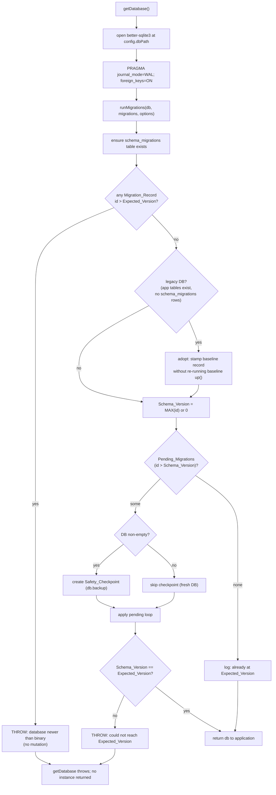

# Design Document

## Overview

This feature replaces the ad-hoc schema evolution logic currently living inside `initSchema()` in `src/db/database.ts` with a versioned, ordered, transactional migration system. The system tracks which migrations have been applied in a `schema_migrations` table, applies pending migrations in order inside per-migration transactions, adopts pre-existing unversioned ("legacy") databases at a known baseline without data loss, and gates application startup on the database reaching the version the running binary expects.

The current code depends entirely on `CREATE TABLE IF NOT EXISTS`, swallowed `ALTER TABLE` errors, and one bespoke table-reconstruction routine (`migrateRemoveTypeCheck`) being safe to re-run on every boot. That works for a prototype but gives no way to know what schema version a deployed device is at, no defined ordering, no rollback safety, and no tested upgrade path. This design formalizes all of it.

### Key design decisions

- **`schema_migrations` table as the primary version mechanism.** A table that records one row per applied migration (`id`, `name`, `applied_at`) is the source of truth. `Schema_Version` is derived as `MAX(id)`. This is chosen over relying solely on `PRAGMA user_version` because the table preserves *history* — which migrations ran and when — which the requirements (R1.1, R11) demand. `PRAGMA user_version` is a single 32-bit integer with no history and no per-migration record.
  - **`PRAGMA user_version` as an optional complementary fast-path.** The runner MAY additionally keep `user_version` in sync with `Schema_Version` as a cheap integer check readable without a query planner, but it is never the authority and is never required. This design keeps it as a documented, optional mirror and does not depend on it for correctness.
- **Synchronous, matching `better-sqlite3`.** All migration operations are synchronous (`up(db)` returns `void`), because `better-sqlite3` is a native synchronous binding. No promises, no async migration loop.
- **Forward-only for v1.** Migrations only advance. The `Migration` interface leaves room for a future optional `down(db)` without changing existing ids or ordering (R10).
- **Recovery via checkpoint + transaction rollback, not reverse migrations.** A pre-migration `Safety_Checkpoint` (online backup) plus per-migration transactional rollback are the recovery mechanisms (R3, R8, R10.3).

### In scope / out of scope

In scope: version tracking, ordered exactly-once application, transactional rollback with halt-on-first-failure, a baseline migration + legacy adoption, conversion of the existing `addColumn`/backfill/`migrateRemoveTypeCheck` logic into ordered guarded migrations, startup integration and version gating, newer-than-binary fail-safe, pre-migration safety checkpoint, WAL + `foreign_keys` handling, observability logging, and testable upgrades.

Out of scope: reverse/`down` migrations (structure only), other database engines, the verified-command-execution and custom-ui-sandboxing specs, and multi-node/fleet coordination.

## Architecture

The migration runner is a new module, `src/db/migration-runner.ts`, plus a migrations registry under `src/db/migrations/`. `getDatabase()` opens the connection, sets pragmas, and delegates all schema work to `runMigrations()` instead of calling `initSchema()`. `initSchema()` is retained only as the body of the baseline migration (id 1) and for existing tests during transition.

```
src/db/
  database.ts            # getDatabase(): open connection, set pragmas, call runMigrations()
  migration-runner.ts    # runMigrations(), version queries, legacy detection/adoption, checkpoint
  migrations/
    index.ts             # ordered `migrations` array (the registry) + duplicate-id guard
    001-baseline.ts      # full current production schema
    002-automation-rules-columns.ts   # addColumn set + rule_type backfill, guarded
    003-devices-remove-check.ts        # devices table reconstruction, guarded
```

### Startup flow



The four startup cases the runner distinguishes:
- **Fresh** — file absent or no application tables: apply baseline + all later migrations.
- **Legacy** — application tables exist but no `schema_migrations` table/rows: adopt at baseline, then apply migrations with `id > 1`.
- **Up-to-date** — `Schema_Version == Expected_Version`: no-op, log, return.
- **Newer-than-binary** — a record with `id > Expected_Version` exists: throw, no mutation.

### Per-migration apply sequence

The critical correctness detail is that **`PRAGMA foreign_keys` cannot be changed inside a transaction** — SQLite silently ignores the pragma while a transaction is open. Table-reconstruction migrations (like the devices rebuild) require `foreign_keys = OFF`. Therefore the pragma is toggled *outside* the transaction, around it, and referential integrity is re-checked after re-enabling.

```mermaid
sequenceDiagram
  participant R as runMigrations
  participant DB as better-sqlite3

  Note over R,DB: For each Pending_Migration in ascending id
  R->>DB: PRAGMA foreign_keys = OFF   (outside txn, before begin)
  R->>DB: BEGIN (db.transaction)
  R->>DB: migration.up(db)            (schema/data change)
  R->>DB: INSERT INTO schema_migrations (id, name, applied_at)
  alt up() or insert throws
    DB-->>R: error
    R->>DB: ROLLBACK (automatic via db.transaction)
    R->>DB: PRAGMA foreign_keys = ON  (restore)
    R->>R: halt; throw MigrationError(failing id, cause)
  else success
    R->>DB: COMMIT (automatic)
    R->>DB: PRAGMA foreign_keys = ON  (restore)
    R->>DB: PRAGMA foreign_key_check  (integrity verify)
    alt violations found
      R->>R: throw (integrity error)
    else clean
      R->>R: log applied id; continue
    end
  end
```

Because `foreign_keys` toggling must live outside the transaction, the runner sets `foreign_keys = OFF` before `BEGIN` for every migration (harmless for migrations that do not reconstruct tables) and restores `foreign_keys = ON` after the transaction resolves (commit or rollback), then runs `PRAGMA foreign_key_check` to satisfy R9.5. Setting it off unconditionally keeps the loop uniform and avoids per-migration branching; a migration that needs FK enforcement during its own body is not a pattern this codebase uses.

### Concurrency model

Per R12, the runner assumes a single Aeolus process with the single synchronous `better-sqlite3` connection from `database.ts`. All pending migrations complete during one synchronous startup before the database serves application traffic. No cross-process or cross-node coordination is used or needed.

## Components and Interfaces

### Migration

A migration is a plain object with a numeric id, a human name, and a synchronous forward operation. The optional `down` is reserved for a future version and is never invoked in v1.

```typescript
import type { Database as DatabaseType } from "better-sqlite3";

export interface Migration {
  /** Unique, ascending identifier that defines ordering. Baseline is 1. */
  id: number;
  /** Human-readable name for logs and history, e.g. "baseline" */
  name: string;
  /** Forward operation. Synchronous to match better-sqlite3. Must be guarded/idempotent-safe. */
  up(db: DatabaseType): void;
  /** Reserved for a future version (R10.4). Never called in v1. */
  down?(db: DatabaseType): void;
}
```

### Migration registry

Migrations are registered in a single ordered array. Order in the file is by ascending id; the runner does not rely on source order and sorts by id defensively.

```typescript
// src/db/migrations/index.ts
import { baseline } from "./001-baseline.js";
import { automationRulesColumns } from "./002-automation-rules-columns.js";
import { devicesRemoveCheck } from "./003-devices-remove-check.js";

export const migrations: Migration[] = [
  baseline,                 // id 1
  automationRulesColumns,   // id 2
  devicesRemoveCheck,       // id 3
];
```

Duplicate-id detection (R2.5) runs before any application:

```typescript
export function assertUniqueIds(migrations: Migration[]): void {
  const seen = new Set<number>();
  for (const m of migrations) {
    if (seen.has(m.id)) {
      throw new Error(`Duplicate migration id detected: ${m.id}`);
    }
    seen.add(m.id);
  }
}
```

### MigrationRunner API

```typescript
export interface RunMigrationsOptions {
  /** Path used to derive the checkpoint file name. Defaults to config.dbPath. */
  dbPath?: string;
  /** Disable the safety checkpoint (used by in-memory tests). Default false. */
  skipCheckpoint?: boolean;
  /** Injectable clock for deterministic applied_at in tests. Default Date.now. */
  now?: () => number;
}

export interface RunMigrationsResult {
  fromVersion: number;      // Schema_Version before this run
  toVersion: number;        // Schema_Version after this run (== Expected_Version on success)
  applied: number[];        // Migration_Ids applied this run (empty if up-to-date)
  adoptedLegacy: boolean;   // true if a legacy DB was stamped at baseline this run
  checkpointPath?: string;  // path to the Safety_Checkpoint, if one was taken
}

/** Entry point called by getDatabase(). Applies all pending migrations or throws. */
export function runMigrations(
  db: DatabaseType,
  migrations: Migration[],
  options?: RunMigrationsOptions
): RunMigrationsResult;
```

Supporting internal functions (exported for testing):

```typescript
/** Create schema_migrations if absent (R1.5). Idempotent. */
export function ensureMigrationHistory(db: DatabaseType): void;

/** Schema_Version = MAX(id) in schema_migrations, or 0 if none (R1.2, R1.3). */
export function getSchemaVersion(db: DatabaseType): number;

/** Expected_Version = MAX(id) across the known migration set (R2.6). */
export function getExpectedVersion(migrations: Migration[]): number;

/** Pending = migrations whose id is absent from history, ascending (R2.2, R2.3). */
export function getPendingMigrations(db: DatabaseType, migrations: Migration[]): Migration[];

/** True when app tables exist but schema_migrations has no rows (R4.3). */
export function isLegacyDatabase(db: DatabaseType): boolean;

/** True when the DB file/connection has no application tables (Fresh_Database). */
export function isFreshDatabase(db: DatabaseType): boolean;

/** Stamp baseline record without running baseline.up() (R4.4). */
export function adoptLegacyDatabase(db: DatabaseType, baseline: Migration, now: () => number): void;

/** Online, WAL-consistent backup to a timestamped file (R8). Returns the path. */
export function createSafetyCheckpoint(db: DatabaseType, dbPath: string): Promise<string> | string;

/** Detect a Migration_Record newer than Expected_Version (R7). */
export function findNewerThanBinary(db: DatabaseType, expected: number): number | null;
```

### schema_migrations DDL

```sql
CREATE TABLE IF NOT EXISTS schema_migrations (
  id INTEGER PRIMARY KEY,        -- Migration_Id; PRIMARY KEY enforces at-most-once (R1.6)
  name TEXT NOT NULL,            -- migration name for observability
  applied_at INTEGER NOT NULL    -- epoch ms when the record was written
);
```

`id` as `INTEGER PRIMARY KEY` makes a duplicate insert fail at the database level, backstopping R1.6 and R2.4 in addition to the in-memory pending computation.

### Legacy detection and adoption

Legacy detection inspects `sqlite_master`: a database is legacy when a sentinel application table exists but `schema_migrations` does not (or has no rows). The requirements name `automation_rules` as a stable sentinel.

```typescript
export function isLegacyDatabase(db: DatabaseType): boolean {
  const hasApp = db.prepare(
    `SELECT 1 FROM sqlite_master WHERE type='table' AND name='automation_rules'`
  ).get();
  const hasHistory = db.prepare(
    `SELECT 1 FROM sqlite_master WHERE type='table' AND name='schema_migrations'`
  ).get();
  if (!hasApp) return false;                 // fresh, not legacy
  if (!hasHistory) return true;              // app tables, no history -> legacy
  const rows = db.prepare(`SELECT COUNT(*) AS n FROM schema_migrations`).get() as { n: number };
  return rows.n === 0;                        // history table but empty -> still legacy
}
```

Adoption stamps the baseline record only; it does not run `baseline.up()`, because the legacy tables already exist and re-running create statements is unnecessary (and `initSchema` create statements use `IF NOT EXISTS`, so even an accidental run is non-destructive):

```typescript
export function adoptLegacyDatabase(db: DatabaseType, baseline: Migration, now: () => number): void {
  ensureMigrationHistory(db);
  db.prepare(
    `INSERT INTO schema_migrations (id, name, applied_at) VALUES (?, ?, ?)`
  ).run(baseline.id, baseline.name, now());
}
```

**Reconciling varied legacy states.** A legacy database can be at many intermediate states: some `addColumn` columns present, the `rule_type` backfill done or not, the devices `CHECK` already removed or not. Adoption stamps only the baseline (id 1). Post-baseline migrations (002, 003) then run — and each is written to be *guarded* so it is a no-op when the change is already present:
- **002** checks `PRAGMA table_info(automation_rules)` before each `ALTER TABLE ... ADD COLUMN`, adding only missing columns, then runs the `rule_type` backfill (which is naturally idempotent: `UPDATE ... WHERE rule_type IS NULL`).
- **003** inspects `sqlite_master` for the `CHECK(` pattern on `devices` and reconstructs only if present; otherwise it leaves the table and rows untouched (R5.5).

If the legacy schema is structurally incompatible with what the guarded migrations expect (for example `automation_rules` is missing entirely while another app table exists, or a required table has an unexpected shape that a guard cannot reconcile), the runner halts with a descriptive error rather than mutating data (R4.6).

### Migration 002 (automation_rules columns + backfill), guarded

```typescript
export const automationRulesColumns: Migration = {
  id: 2,
  name: "automation-rules-columns",
  up(db) {
    const existing = new Set(
      (db.prepare(`PRAGMA table_info(automation_rules)`).all() as Array<{ name: string }>)
        .map((c) => c.name)
    );
    const add = (col: string, def: string) => {
      if (!existing.has(col)) db.exec(`ALTER TABLE automation_rules ADD COLUMN ${col} ${def};`);
    };
    add("rule_type", "TEXT NOT NULL DEFAULT 'form'");
    add("script_source", "TEXT DEFAULT NULL");
    add("compiled_js", "TEXT DEFAULT NULL");
    add("structured_metadata", "TEXT DEFAULT NULL");
    add("ui_source", "TEXT DEFAULT NULL");
    add("compiled_ui", "TEXT DEFAULT NULL");
    add("trigger_type", "TEXT DEFAULT 'mqtt'");
    add("cron_expression", "TEXT DEFAULT NULL");
    db.exec(`UPDATE automation_rules SET rule_type = 'form' WHERE rule_type IS NULL;`);
  },
};
```

Guarding on `table_info` (rather than the old swallow-the-error pattern) makes the migration explicit and keeps duplicate-column situations from throwing (R5.4).

### Migration 003 (devices CHECK removal), guarded

```typescript
export const devicesRemoveCheck: Migration = {
  id: 3,
  name: "devices-remove-check",
  up(db) {
    const row = db.prepare(
      `SELECT sql FROM sqlite_master WHERE type='table' AND name='devices'`
    ).get() as { sql: string } | undefined;
    if (!row || !/CHECK\s*\(/i.test(row.sql)) return; // already migrated or fresh (R5.5)

    // NOTE: foreign_keys is already OFF (set by the runner outside the transaction).
    db.exec(`ALTER TABLE devices RENAME TO devices_old;`);
    db.exec(`CREATE TABLE devices (
      id TEXT PRIMARY KEY,
      name TEXT NOT NULL,
      type TEXT NOT NULL,
      capabilities TEXT NOT NULL DEFAULT '[]',
      state TEXT NOT NULL DEFAULT '{}',
      integration TEXT NOT NULL DEFAULT 'mqtt',
      last_seen INTEGER NOT NULL
    );`);
    db.exec(`INSERT INTO devices (id, name, type, capabilities, state, integration, last_seen)
             SELECT id, name, type, capabilities, state, integration, last_seen FROM devices_old;`);
    db.exec(`DROP TABLE devices_old;`);
  },
};
```

Unlike today's `migrateRemoveTypeCheck`, this migration does **not** manage `BEGIN/COMMIT/ROLLBACK` or the `foreign_keys` pragma itself — the runner owns both (transaction via `db.transaction`, pragma toggled outside it). This is the critical ordering fix: the pragma is set outside the transaction because SQLite ignores `PRAGMA foreign_keys` while a transaction is open.

### The apply loop

```typescript
export function runMigrations(db, migrations, options = {}) {
  const now = options.now ?? Date.now;
  assertUniqueIds(migrations);
  ensureMigrationHistory(db);

  const expected = getExpectedVersion(migrations);

  // R7: newer-than-binary fail-safe, before any mutation
  const newer = findNewerThanBinary(db, expected);
  if (newer !== null) {
    throw new DatabaseNewerThanBinaryError(getSchemaVersion(db), expected);
  }

  // R4: adopt legacy DB at baseline (stamp only)
  let adoptedLegacy = false;
  if (isLegacyDatabase(db)) {
    adoptLegacyDatabase(db, migrations.find((m) => m.id === 1)!, now);
    adoptedLegacy = true;
    logger.info({ version: 1 }, "Adopted legacy database at baseline");
  }

  const fromVersion = getSchemaVersion(db);
  const pending = getPendingMigrations(db, migrations); // ascending
  if (pending.length === 0) {
    logger.info({ version: fromVersion }, "Database already at expected version");
    return { fromVersion, toVersion: fromVersion, applied: [], adoptedLegacy };
  }

  logger.info({ fromVersion, expected }, "Applying pending migrations");

  // R8: checkpoint non-empty DBs before mutating
  let checkpointPath: string | undefined;
  if (!options.skipCheckpoint && !isFreshDatabase(db)) {
    checkpointPath = createSafetyCheckpoint(db, options.dbPath ?? config.dbPath);
  }

  const applied: number[] = [];
  for (const m of pending) {
    db.pragma("foreign_keys = OFF");            // outside transaction (SQLite requirement)
    try {
      const tx = db.transaction(() => {
        m.up(db);
        db.prepare(`INSERT INTO schema_migrations (id, name, applied_at) VALUES (?,?,?)`)
          .run(m.id, m.name, now());
      });
      tx();                                       // commit or throw+rollback atomically
    } catch (err) {
      db.pragma("foreign_keys = ON");             // R9.3 restore on rollback
      logger.error({ id: m.id, err }, "Migration failed; halting");
      throw new MigrationError(m.id, err);        // R3.2, R3.3, R3.4
    }
    db.pragma("foreign_keys = ON");               // R9.2 restore after commit
    const violations = db.pragma("foreign_key_check"); // R9.5
    if (Array.isArray(violations) && violations.length > 0) {
      throw new IntegrityError(m.id, violations);
    }
    applied.push(m.id);
    logger.info({ id: m.id }, "Migration applied");
  }

  const toVersion = getSchemaVersion(db);
  if (toVersion !== expected) {
    throw new Error(`Migrations completed but version ${toVersion} != expected ${expected}`);
  }
  logger.info({ toVersion }, "Migrations complete");
  return { fromVersion, toVersion, applied, adoptedLegacy, checkpointPath };
}
```

### Safety checkpoint

`better-sqlite3` exposes an online backup via `db.backup(destPath)` that is WAL-consistent (it uses SQLite's backup API and copies a consistent snapshot). The checkpoint is written to a timestamped sibling file of the database.

```typescript
export function createSafetyCheckpoint(db: DatabaseType, dbPath: string): string {
  const stamp = new Date().toISOString().replace(/[:.]/g, "-");
  const dest = `${dbPath}.pre-migration.${stamp}.bak`;
  try {
    // better-sqlite3 backup() returns a Promise; runner awaits or uses the sync file copy variant.
    db.backup(dest);            // WAL-consistent online backup (R8.4)
    logger.info({ dest }, "Safety checkpoint created");
    return dest;
  } catch (err) {
    logger.error({ err, dest }, "Safety checkpoint failed");
    throw new CheckpointError(dest, err);   // R8.3 halt before applying
  }
}
```

> Note: `db.backup()` in better-sqlite3 is asynchronous (returns a Promise). Because `runMigrations` is synchronous, the checkpoint is taken via the synchronous equivalent — a serialized snapshot written with `fs` after a `wal_checkpoint(TRUNCATE)`, or the DB file is copied while holding the connection. The implementation task will pick the concrete synchronous mechanism; the design requirement is only that the checkpoint be WAL-consistent and complete before any migration mutates the DB. Fresh databases skip this step (R8.2).

Retention: checkpoints are kept on success (R8.5). A simple retention policy (keep the N most recent `*.pre-migration.*.bak` files, default N=5) prevents unbounded growth; cleanup runs after a successful migration set, never before confirmation.

### Startup integration in database.ts

```typescript
export function getDatabase(): DatabaseType {
  if (db) return db;
  const dir = path.dirname(config.dbPath);
  fs.mkdirSync(dir, { recursive: true });
  db = new Database(config.dbPath);
  db.pragma("journal_mode = WAL");
  db.pragma("foreign_keys = ON");
  runMigrations(db, migrations, { dbPath: config.dbPath }); // throws on any failure (R6.3)
  logger.info({ dbPath: config.dbPath }, "Database initialized (migrations applied)");
  return db;
}
```

If `runMigrations` throws (failed migration, newer-than-binary, checkpoint failure, unreachable version), the exception propagates out of `getDatabase()` and no instance is returned for application use (R6.3, R7.2).

## Data Models

### schema_migrations (Migration_History)

| Column       | Type    | Notes                                                        |
|--------------|---------|--------------------------------------------------------------|
| `id`         | INTEGER | PRIMARY KEY. The Migration_Id. Enforces at-most-once (R1.6). |
| `name`       | TEXT    | NOT NULL. Migration name for logs/history.                   |
| `applied_at` | INTEGER | NOT NULL. Epoch milliseconds when the record was written.    |

Derived values (not stored):
- **Schema_Version** = `SELECT MAX(id) FROM schema_migrations` (0 when empty).
- **Expected_Version** = `max(m.id for m in migrations)` from the binary's registry.
- **Pending_Migrations** = registry migrations whose `id` is not present in `schema_migrations`, ascending.

### Migration (in-memory, not persisted)

`{ id: number; name: string; up(db): void; down?(db): void }` — described under Components and Interfaces.

### Optional PRAGMA user_version mirror

If enabled, `user_version` is set to `Schema_Version` after each successful run purely as a fast integer probe. It is never read as authority and carries no history; the `schema_migrations` table is always the source of truth.

## Correctness Properties

*A property is a characteristic or behavior that should hold true across all valid executions of a system — essentially, a formal statement about what the system should do. Properties serve as the bridge between human-readable specifications and machine-verifiable correctness guarantees.*

The migration runner is a strong fit for property-based testing: it is deterministic logic over an in-memory `better-sqlite3` database, its behavior varies meaningfully with the starting schema state and migration set, and it has clear universal invariants (convergence, idempotence, exactly-once, data preservation). The properties below were derived from the prework analysis, with redundant convergence/idempotence criteria consolidated. These will be exercised with `@fast-check/vitest`, mirroring the existing `src/db/database.property.test.ts`.

### Property 1: Migration history records each applied migration exactly once with a timestamp

*For any* fresh in-memory database and valid migration set, after `runMigrations` completes there is exactly one `schema_migrations` row per applied Migration_Id, each with a non-null `applied_at`, and no id appears more than once.

**Validates: Requirements 1.1, 1.6**

### Property 2: Schema_Version equals the maximum recorded Migration_Id

*For any* subset of Migration_Ids stamped into `schema_migrations` (including the empty subset), `getSchemaVersion` returns the maximum stamped id, or 0 when the subset is empty.

**Validates: Requirements 1.2, 1.3**

### Property 3: Pending migrations are exactly the unrecorded migrations, ascending

*For any* migration registry and any subset of its ids already recorded in history, `getPendingMigrations` returns exactly the registry migrations whose id is absent from history, ordered by ascending id.

**Validates: Requirements 2.2**

### Property 4: Migrations are applied in ascending id order

*For any* set of pending migrations, the order in which their `up` functions are invoked (and the order of resulting `schema_migrations` records) is strictly ascending by Migration_Id.

**Validates: Requirements 2.3, 10.1**

### Property 5: Duplicate ids are rejected

*For any* migration set containing two entries with the same Migration_Id, `runMigrations` (via `assertUniqueIds`) throws an error whose message identifies the duplicated id, and no migration is applied.

**Validates: Requirements 2.1, 2.5**

### Property 6: Convergence to Expected_Version with an equivalent final schema

*For any* starting database — whether fresh or a seeded legacy database — running `runMigrations` brings the Schema_Version to the Expected_Version, and the resulting schema is equivalent to the reference schema produced by today's `initSchema()`. In particular, a fresh-migrated database and an adopted-then-migrated legacy database converge to the same schema.

**Validates: Requirements 2.6, 4.2, 4.7, 5.7, 6.2, 13.2, 13.6**

### Property 7: Idempotence and exactly-once application

*For any* database and any number of successive `runMigrations` invocations, each migration's `up` runs at most once, the second and later runs apply nothing, and the Schema_Version after the first full run never changes.

**Validates: Requirements 1.6, 2.4, 13.5**

### Property 8: Halt-and-rollback leaves the prior consistent state

*For any* migration sequence with a failure injected at an arbitrary position k, `runMigrations` rolls back the failing migration (neither its schema change nor its `schema_migrations` record persists), does not invoke any migration after k, retains the records of all migrations before k, leaves the Schema_Version equal to the value it held before migration k, and leaves `foreign_keys` enforcement enabled.

**Validates: Requirements 1.4, 3.1, 3.2, 3.3, 3.5, 3.6, 9.3**

### Property 9: Data preservation across adoption and reconstruction

*For any* set of rows seeded into a legacy database (including `devices` rows with the old `CHECK(type IN (...))` constraint present), after adoption and full migration every seeded row is still present and every column value is unchanged — in particular each `devices` row preserves its `id`, `name`, `type`, `capabilities`, `state`, `integration`, and `last_seen`.

**Validates: Requirements 4.5, 5.6, 13.3**

### Property 10: Legacy database classification

*For any* database state, `isLegacyDatabase` returns true exactly when application tables exist but `schema_migrations` has no rows, and false for fresh databases and databases that already have migration history.

**Validates: Requirements 4.3**

### Property 11: Guarded migrations are safe no-ops when their change already exists

*For any* database that already contains some or all of the automation_rules columns a migration would add, or a `devices` table that already lacks the `CHECK` constraint, applying the corresponding migration does not throw and leaves the already-present columns, table structure, and their data unchanged.

**Validates: Requirements 5.4, 5.5**

### Property 12: Newer-than-binary databases are rejected without mutation

*For any* database containing a `schema_migrations` record whose id exceeds the Expected_Version, `runMigrations` throws an error reporting both the database Schema_Version and the binary Expected_Version, and the database schema and data are left completely unchanged.

**Validates: Requirements 7.1, 7.4**

### Property 13: Referential integrity holds after table reconstruction

*For any* database migrated through the `devices` reconstruction, `PRAGMA foreign_key_check` reports no violations after `foreign_keys` enforcement is restored; and if a reconstruction would leave a dangling foreign-key reference, `runMigrations` surfaces an integrity error.

**Validates: Requirements 9.5**

## Error Handling

All failure modes converge on one guarantee: `getDatabase()` either returns a database at the Expected_Version or throws, never a half-migrated instance.

- **Duplicate migration id (`assertUniqueIds`).** Thrown before any mutation. Message names the duplicated id. Nothing is applied. (R2.5)
- **Migration failure (`MigrationError`).** If `up()` or the record insert throws, the surrounding `db.transaction` rolls back atomically, so neither the schema change nor the `schema_migrations` row survives. The runner restores `foreign_keys = ON`, logs the failing id and underlying error, and rethrows a `MigrationError` that includes the failing Migration_Id and the cause's message. The loop halts — no later migration is attempted. Records of earlier committed migrations remain. (R3.2–R3.6, R9.3, R11.4)
- **Newer-than-binary (`DatabaseNewerThanBinaryError`).** Detected before any mutation by scanning for a recorded id greater than Expected_Version. The runner throws with both versions in the message and logs them; no schema or data is touched. (R7.1–R7.4, R11.6)
- **Unreachable version.** If, after applying all pending migrations, `Schema_Version !== Expected_Version` (or version is below Expected with no pending able to advance it), the runner throws a startup error rather than letting the app serve on a mismatched schema. (R6.2, R6.4)
- **Checkpoint failure (`CheckpointError`).** If the pre-migration safety checkpoint cannot be created for a non-empty database, the runner halts before applying any migration and surfaces an error describing the checkpoint failure. No migration runs. (R8.3)
- **Reconciliation mismatch.** If a legacy database's schema cannot be reconciled to the baseline by the guarded migrations (e.g. a required table is missing or has an incompatible shape a guard cannot handle), the runner throws a descriptive error rather than mutating data. (R4.6)
- **Integrity violation (`IntegrityError`).** After a reconstruction migration re-enables `foreign_keys`, `PRAGMA foreign_key_check` runs; any reported violation causes the runner to throw. (R9.5)

Error types (all extend `Error`, carry structured fields for logging):

```typescript
class MigrationError extends Error { constructor(public id: number, public cause: unknown) { super(...) } }
class DatabaseNewerThanBinaryError extends Error { constructor(public dbVersion: number, public expected: number) { super(...) } }
class CheckpointError extends Error { constructor(public dest: string, public cause: unknown) { super(...) } }
class IntegrityError extends Error { constructor(public id: number, public violations: unknown[]) { super(...) } }
```

## Testing Strategy

Testing uses **vitest** with **`@fast-check/vitest`**, matching the existing `src/db/database.test.ts` (example/unit) and `src/db/database.property.test.ts` (property) files. Property tests run a minimum of **100 iterations** (`{ numRuns: 100 }`) and are tagged with a comment referencing the design property in the format **`Feature: versioned-db-migrations, Property N: <text>`**.

### Property-based tests

One property-based test per correctness property (Properties 1–13). Each uses an in-memory `better-sqlite3` database (`new Database(":memory:")`) with `skipCheckpoint: true` so no filesystem is touched, and an injected `now` for deterministic `applied_at`. Generators produce:
- arbitrary subsets of Migration_Ids to stamp (version derivation, pending set, idempotence),
- synthetic migration sets with an injectable failing/throwing `up` at a random position (halt-and-rollback, ascending order, duplicate ids),
- arbitrary seeded rows for `devices`/`automation_rules` and other tables, with and without the `CHECK` constraint and with arbitrary subsets of the added columns present (data preservation, guarded no-ops, reconstruction),
- database states classified as fresh / legacy / versioned (legacy detection, convergence, newer-than-binary).

For convergence (Property 6), the reference oracle is a database built by the legacy `initSchema()`; the test normalizes and compares `sqlite_master` entries (table and index definitions) between the migrated database and the oracle, and between fresh-migrated and legacy-adopted-migrated databases.

### Unit / example tests

- Baseline produces all 13 named tables + 3 indexes on a fresh DB (R4.1) — mirrors the existing `initSchema` table-list test.
- `ensureMigrationHistory` creates `schema_migrations` and is safe to call twice (R1.5).
- Automation_rules gains all 8 columns; null `rule_type` rows are backfilled to `'form'` (R5.1, R5.2).
- Devices `CHECK` removal mirrors the existing `migrateRemoveTypeCheck` scenario against the runner: seed a `devices` table with the `CHECK` constraint and a row, run the runner, assert the constraint is gone and the row survives, and a novel `type` value now inserts (R5.3, R13.4) — direct port of the current `database.test.ts` and `database.property.test.ts` cases.
- Error content: `MigrationError` includes failing id + cause message (R3.4); `DatabaseNewerThanBinaryError` includes both versions (R7.3).
- Startup: `runMigrations` failure propagates so `getDatabase()` throws and returns no instance (R6.3); `foreign_keys` is `1` after a run that includes reconstruction (R6.5, R9.1, R9.2).
- Forward-only: migrations expose a `down` spy that is never invoked in v1 (R10.2).
- Observability: with a logger spy, assert the start (from/expected), per-migration applied id, final version, failure (id+err), adoption (version 1), newer-than-binary (both versions), and already-at-expected log lines (R11.1–R11.7).
- Checkpoint behavior (uses a real temp-file DB, not in-memory): non-empty DB with pending migrations creates a checkpoint file before mutation and retains it on success (R8.1, R8.5); fresh DB skips it (R8.2); an injected failing checkpoint function halts before applying and surfaces the error (R8.3).

### Integration / infrastructure tests

- **WAL consistency of the checkpoint (R8.4):** on a file-backed WAL database, write and commit data, take a checkpoint, open the checkpoint file as a separate database, and assert it is a complete, consistent copy. This exercises SQLite's backup/WAL behavior (external), so it uses 1–2 representative cases rather than property iteration.
- **Full run in WAL mode (R9.4):** run the complete migration set against a file-backed WAL-mode database and assert success and `foreign_keys = 1`.

### Out of scope for tests

Reverse/`down` execution (structure only, R10.3, R10.4), the single-writer concurrency assumptions (R12, architectural), and multi-node coordination are not covered by automated tests in this version and are noted as design-level guarantees.
