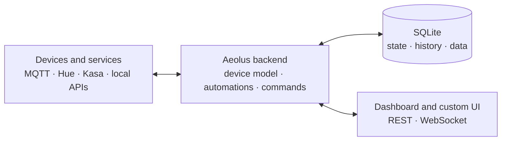

<p align="center">
  
</p>

<h1 align="center">Aeolus</h1>

<h3 align="center">Local-first edge automation platform</h3>

<p align="center">
  
  
  
  
  
  
</p>

<p align="center">
  <a href="#quick-start">Quick Start</a> •
  <a href="#features">Features</a> •
  <a href="#dashboard">Dashboard</a> •
  <a href="#automations">Automations</a> •
  <a href="#security">Security</a> •
  <a href="#observability">Observability</a> •
  <a href="#data-store">Data Store</a> •
  <a href="#connectors">Connectors</a> •
  <a href="#architecture">Architecture</a> •
  <a href="docs/ROADMAP.md">Roadmap</a>
</p>

---

Aeolus is a self-hosted platform for developers who need to make a collection of physical devices behave like one system. It brings MQTT hardware, commercial integrations, automation code, local data and custom dashboards into one place.

An automation in Aeolus can be a small edge application of its own. It can contain backend logic, a purpose-built React interface and private state shared between the two.

Aeolus started around real rural infrastructure, but it is not a farm product. The same runtime can drive a greenhouse panel, an escape-room console, a vessel instrument display, a stage cue system or any other site where the software needs to fit the job rather than the other way around.

- **Local-first:** the important work stays on site and does not require a vendor cloud.
- **Code-first:** write JavaScript or TypeScript with Monaco IntelliSense instead of squeezing complex behaviour into YAML or a large flow graph.
- **Hardware-agnostic:** MQTT devices and connector-backed products enter the same event and device model.
- **Full-stack automations:** pair isolated backend logic with sandboxed custom UI.
- **Built to operate:** inspect devices, messages, state, history, logs, metrics and command results from the dashboard.

Three core services. One local control plane. No required cloud account.

> For a plain-English introduction, read [**What Is Aeolus?**](docs/WHAT_IS_AEOLUS.md). For the deeper technical argument, read [**Why Aeolus?**](docs/WHY_AEOLUS.md).

<!--
MEDIA TODO: README hero GIF
File: docs/media/aeolus-overview.gif
Length: 12 to 18 seconds, silent, cropped to the application window.
Show:
1. Open a coherent custom tab for one real site (preferably the Koonorigan farm/shed deployment).
2. A live tank, solar or temperature value changes.
3. Trigger one safe manual action.
4. Open an automation pane and briefly reveal the Logic/UI tabs.
5. Return to the live control view.
Avoid: rapidly cycling through every demo domain. The first impression should be one believable operating environment, not a feature montage.
-->
<!--  -->

## Project status

Aeolus is an **early-alpha platform under active development**. The core runtime, dashboard, MQTT integration, connector framework, data store, migrations, authentication and sandboxing are implemented; APIs and operating assumptions may still change.

It is appropriate for development, supervised pilots and non-safety-critical automation with independent physical safeguards. It is not a replacement for certified control systems, hardwired interlocks, motor protection, dry-run protection, emergency stops or other safety equipment.

## Quick Start

### Requirements

- Linux host
- Docker Engine with Docker Compose
- Raspberry Pi 4/5 or another Linux machine

Aeolus uses host networking for LAN discovery and direct communication with devices such as Kasa plugs and Hue bridges. Docker Desktop on Windows and macOS can be used for limited dashboard evaluation, but a Linux host is required for the intended deployment model.

### Start Aeolus

```bash
git clone https://github.com/j-a-m-i-e-c/aeolus.git
cd aeolus
docker compose up --build
```

Open **http://localhost:3000** and create the first administrator account.

This default path uses host networking, which is what the Pi/Linux deployment needs for LAN discovery.

### Desktop / dev (Docker Desktop)

On Docker Desktop (Windows/macOS), host networking runs inside a VM, so the containers are not reachable on `localhost`. For local evaluation, opt in to bridge networking by loading the desktop override explicitly:

```bash
docker compose -f docker-compose.yml -f docker-compose.desktop.yml up --build
```

The override is not loaded automatically, so cloning the repo never silently switches network mode away from the deterministic host-networking default.

### Explore without hardware

After creating the administrator account, seed the platform with demo devices, dashboards and automations:

```bash
make seed PASS=your-password
```

`USER` defaults to `admin` and can be overridden:

```bash
make seed USER=jamie PASS=your-password
```

The seeder runs in a temporary Docker container, so it does not require Node.js on the host.

The seed demo is intentionally eclectic. It includes agriculture, a research vessel, an underground mine, a spacecraft, a stage show, an escape room, wildlife monitoring, an off-grid bunker and a small space-data dashboard.

The scenarios are simulated demonstrations of the platform model. They are there to show how the same Logic, UI, device, state and data primitives can be shaped into very different applications. They are not claims that Aeolus already ships every specialised hardware integration shown in the demo.

<!--
MEDIA TODO: First-run screenshot
File: docs/media/first-run.png
Show: the clean post-login dashboard with the System sidebar, one custom tab and enough seeded data to make the product understandable. Do not show an empty state.
Recommended size: 1600×900 or larger.
-->
<!--  -->

### Raspberry Pi installation

```bash
curl -sSL https://raw.githubusercontent.com/j-a-m-i-e-c/aeolus/main/scripts/setup-pi.sh | bash
```

The setup script installs Docker, clones the repository, starts the services, enables restart-on-boot and sets the hostname to `aeolus`. The dashboard is then available at **http://aeolus.local:3000** on supported local networks.

## Features

| Area | What Aeolus provides |
|---|---|
| **Automation runtime** | JavaScript/TypeScript logic executed in isolated V8 contexts with memory and execution limits |
| **Custom application UI** | React/TSX components rendered in sandboxed iframes with opaque origins and connected to the host through a capability-scoped RPC bridge |
| **MQTT** | Wildcard ingestion, automatic device discovery, raw message inspection and command publishing through Eclipse Mosquitto |
| **Connectors** | A TypeScript framework for integrating commercial ecosystems; Hue and TP-Link Kasa are included |
| **Unified event model** | MQTT and connector events flow through the same internal event bus and device registry |
| **Command outcomes** | Structured action results, with dispatch, acknowledgement and observed-state confirmation available where the integration and automation support them |
| **Dashboard** | Custom tabs, drag-and-drop panes, device controls, automation editors and monitoring tools |
| **State and data** | Automation-local state, device history, time series collections and shared key/value buckets |
| **Security** | Local authentication, user groups, dashboard permissions, MQTT credential modes and isolated user-authored code |
| **Operations** | Structured logs, Prometheus metrics, built-in metric history, health checks and versioned database migrations |
| **Deployment** | Docker Compose on Linux, with Raspberry Pi installation and no mandatory hosted service |

## Dashboard

Aeolus provides four pinned operational areas: **System**, **Connectors**, **Data** and **Security**. You can then add custom tabs for a site, workflow or operating context.

Custom tabs are composed from draggable and resizable panes. Built-in panes include:

- connector and device controls
- automation editors and automation lists
- sensor panels, state-history charts and Data Store collection views
- MQTT inspector and topic tree
- event logs, schedules and trigger controls
- live system and metrics views.

The dashboard is intended to support both development and daily operation. A technical user can edit automation logic in the same environment where another user sees a focused operational interface.

<!--
MEDIA TODO: Primary dashboard screenshot
File: docs/media/site-dashboard.png
Show one polished, coherent dashboard rather than every pane at once. The real farm or shed deployment is the best primary image. A second screenshot could use one of the seeded applications, such as the research vessel CTD profiler, escape-room game master console or stage cue stack, to show that the layout is not tied to one domain.
-->
<!--  -->

<!--
MEDIA TODO: Responsive dashboard GIF
File: docs/media/responsive-dashboard.gif
Length: 6 to 10 seconds.
Show: the same custom tab resizing from desktop width to tablet/mobile width, demonstrating that panes reflow rather than merely shrinking.
-->
<!--  -->

## Automations

An Aeolus automation is an **Automation Project**: a bounded local source tree with backend Logic and, optionally, a React UI. Small automations can stay in one file; larger ones can split into sensible modules without becoming separate services.

```text
my-automation/
├── logic/
│   ├── index.ts
│   └── helpers.ts
├── ui/
│   ├── index.tsx
│   └── types.ts
└── shared/
    └── constants.ts
```

Logic and UI are bundled in memory and then run through Aeolus' existing isolated backend and opaque-origin UI sandboxes. The project model improves authoring and organisation; it does not widen the runtime privilege boundary. See [Automation Projects](docs/architecture/AUTOMATION_PROJECTS.md).

Together the two sides behave like a small edge application. Each automation has its own persistent state namespace, giving its Logic and UI a simple shared channel without exposing the UI directly to the backend process.

### How data flows between Logic and UI

```text
┌──────────────────────────────┐        ┌──────────────────────────────┐
│ Logic tab: backend           │        │ UI tab: React                │
│                              │        │                              │
│ state.set("mode", "auto")   ├───────►│ aeolus.read("mode")          │
│                              │ SQLite │                              │
│                              │  + WS  │                              │
│ state.get("target")          │◄───────┤ aeolus.save("target", 70)    │
│                              │ HTTP + │                              │
│                              │ SQLite │                              │
│ context.topic / state        │◄───────┤ aeolus.fire("apply", {...})  │
│                              │  HTTP  │                              │
└──────────────────────────────┘        └──────────────────────────────┘
```

- **Logic → UI, live:** `state.set(key, value)` persists the value to SQLite and broadcasts it over WebSocket. Components using `aeolus.read(key)` update when the new value arrives.
- **UI → Logic, persistent:** `aeolus.save(key, value)` writes to the same state store. Logic can read it with `state.get(key)` the next time it runs.
- **UI → Logic, immediate:** `aeolus.fire(eventName, payload)` runs the associated Logic now with `context.topic = "ui/{ruleId}/{eventName}"` and `context.state = payload`.
- **Save and run:** `aeolus.saveAndFire(key, value)` requests both persistence and an immediate `state-set` Logic event carrying `{ key, value }`. The immediate run can use `context.state`; later runs can read the stored value.

### Logic: normal module-style TypeScript

```ts
// logic/index.ts
export default async function run(context: EventContext) {
  const puzzleId = context.deviceId ?? context.topic.split("/").at(-1);
  const solved = Boolean(context.state.solved);
  const completed = new Set(state.get("completedPuzzles") ?? []);

  if (solved && puzzleId && !completed.has(puzzleId)) {
    completed.add(puzzleId);
    state.set("completedPuzzles", [...completed]);
    await devices.action(`lock-${puzzleId}`, "unlock");
  }
}
```

New projects use ordinary modules and relative imports. Aeolus adds the existing completion/action wrapper when it bundles the Logic entrypoint, so authors do not need to understand or write the helper scaffold.

The legacy `automation()` helper remains available for backwards compatibility and deliberately simple condition/action rules. It is no longer the default authoring experience or the source model used by the seeded demos.

### UI tab: purpose-built React

```tsx
export default function GameMaster(aeolus: CustomComponentProps) {
  const completed = (aeolus.read("completedPuzzles") ?? []) as string[];
  const lastEvent = String(aeolus.read("lastEvent") ?? "Game ready");

  return (
    <section className="p-4 space-y-3">
      <h3 className="font-semibold">Game master</h3>
      <p>{completed.length} puzzles complete</p>
      <p>{lastEvent}</p>

      <button
        onClick={() =>
          aeolus.fire("send-hint", { text: "Look beneath the clock." })
        }
      >
        Send hint
      </button>
    </section>
  );
}
```

The project editor uses Monaco with a real file tree and Aeolus-specific definitions for autocomplete, parameter hints and inline documentation. UI components are transpiled on save and loaded into an `allow-scripts` iframe with an opaque origin. Privileged operations go through a broker in the host, so the frame never receives the user’s authentication token or general access to the host application.

### Sandbox APIs

| Global | Purpose |
|---|---|
| `context` | The event that triggered the execution |
| `devices` | Query the registry and request device actions |
| `mqtt` | Publish MQTT messages |
| `state` | Read and write the automation’s private persistent state |
| `db` | Write/query time series collections and key/value buckets when enabled |
| `http` | Make bounded HTTP requests to external or local services |
| `log` | Emit structured application logs |
| `automation()` | Optional conditions/actions helper used for flow visualisation |

### Command outcomes

Physical control has more uncertainty than a normal database write. Depending on the device, connector, and confirmation options, Aeolus can distinguish:

- **requested**: the platform accepted the intent
- **dispatched**: the command was handed to the relevant transport or integration
- **acknowledged**: a capable device or integration confirmed receipt
- **observed**: a device or independent sensor reported the expected effect
- **failed, timed out, or mismatched**: the requested outcome was not established.

This is a capability model, not a claim that every device can provide every level of confirmation. Simple devices may only support dispatch; richer integrations can provide acknowledgement or observed-state verification.

<!--
MEDIA TODO: Logic/UI state flow GIF
File: docs/media/logic-ui-state-flow.gif
Length: 12 to 18 seconds.
Show:
1. The Logic tab calls state.set() for a visible value.
2. Switch to status mode and show the custom UI update without a page refresh.
3. Change a target in the UI using aeolus.save().
4. Trigger aeolus.fire() and show the Logic execution/event topic.
Keep the example to one coherent automation so the relationship between Logic, state, and UI is obvious.
-->
<!--  -->

<!--
MEDIA TODO: Full-stack automation screenshot
File: docs/media/full-stack-automation.png
Show: the Logic and UI editors for the same automation, either side-by-side or as two clearly labelled captures. Use readable code from one coherent application. The escape-room sequencer, CTD profiler or a real site workflow would all work well.
-->
<!--  -->

<!--
MEDIA TODO: Command lifecycle screenshot
File: docs/media/command-lifecycle.png
Show: one execution/audit view for a command with its lifecycle clearly visible. Use any command where the difference between sent and confirmed is easy to understand. A pump plus flow sensor is still the clearest real-world example. Include correlation/timestamps only if they remain legible.
-->
<!--  -->


## Microcontrollers

Custom hardware connects through MQTT. An ESP32, Arduino-class board or other client can publish state and subscribe to commands through the local broker.

```cpp
mqtt.publish("sensor/shed/temperature", "{\"value\":23.5,\"unit\":\"C\"}");
```

```cpp
mqtt.subscribe("pump/transfer/command");
```

Devices are derived from incoming topic/state data and appear in the registry without a separate platform-specific provisioning format.

See [**Microcontroller integration guide**](docs/MICROCONTROLLERS.md) for publish-only sensors, actuators, authentication and reconnection examples.

> Aeolus does not compile or flash firmware. Device firmware remains responsible for local electrical safety, watchdogs and fail-safe behaviour.

## Connectors

MQTT is the simplest path for custom devices. The connector framework handles hardware and services that use another API or discovery protocol.

Built-in connectors currently include:

- **Philips Hue**: guided bridge pairing, light controls and Hue-specific editor snippets
- **TP-Link Kasa**: LAN discovery, plug controls and energy data where supported.

A connector supplies metadata, configuration fields and an implementation of the connector lifecycle:

```typescript
interface Connector {
  connect(): Promise<void>;
  disconnect(): Promise<void>;
  discoverDevices(): Promise<Device[]>;
  execute(action: DeviceAction): Promise<ActionResult>;
  getHealthStatus(): ConnectorHealth;
}
```

The framework handles connector registration, persistence, setup flows, health reporting, discovery and device-registry integration. Connectors can also contribute action handlers, reusable conditions and editor snippets.

Start with the [**connector developer guide**](src/connectors/README.md) and [`src/connectors/_template`](src/connectors/_template/).

<!--
MEDIA TODO: Connector setup GIF
File: docs/media/connector-setup.gif
Length: 10 to 15 seconds.
Show: enable a connector, complete a short setup/pairing step, then show discovered devices appearing in the dashboard. Hue is visually clear; Kasa is useful for power data.
-->
<!--  -->

## Data Store

Aeolus includes SQLite-backed storage for data that must outlive one event or one automation execution.

### Time-series collections

Use collections for measurements and events such as temperatures, CTD casts, game sessions, equipment readings, power data or command outcomes. Queries support time ranges, tags and basic aggregation.

```javascript
db.write("ctd-casts", {
  depth: Number(context.state.depth),
  temperature: Number(context.state.temperature),
  salinity: Number(context.state.salinity),
}, {
  tags: { cast: state.get("castId") },
});

const average = db.query("ctd-casts", {
  from: "6h",
  aggregate: "avg",
  field: "temperature",
});
```

### Key-value buckets

Buckets store configuration or computed values shared across automations:

```javascript
db.set("show-config", "defaultFadeMs", 1200);
const fadeMs = db.get("show-config", "defaultFadeMs");
```

The Data Store is disabled by default until storage limits are configured. Safeguards include collection limits, record limits, retention policies and FIFO eviction.

<!--
MEDIA TODO: Data explorer screenshot
File: docs/media/data-explorer.png
Show: one collection with a meaningful chart and filters, plus the collection/bucket navigation. Use a signal with a story behind it, such as a CTD depth cast, mine gas reading, game session timeline or real site sensor history.
-->
<!--  -->

## Security

Aeolus is intended to run trusted local infrastructure while still treating user-authored code and network access as explicit boundaries.

### Application authentication

- initial administrator creation
- bcrypt password hashing
- short-lived access tokens and HTTP-only refresh cookies
- rate-limited login
- authenticated WebSocket connections
- user groups and dashboard-level read/interact/write permissions.

### Code isolation

- backend automation logic executes in a fresh `isolated-vm` context
- each execution has a 32 MB isolate limit and a 5-second timeout
- filesystem, process and module access are not exposed
- custom UI runs in an opaque origin sandboxed iframe
- UI privileges are mediated through a schema-validated `MessageChannel` RPC broker.

### MQTT access

Aeolus includes dashboard controls and APIs for three broker security modes:

| Mode | Intended use |
|---|---|
| **Open** | Development or tightly trusted networks |
| **Shared password** | One credential for all external MQTT clients |
| **Per-device** | Separate credentials for individual devices |

Applying those settings automatically requires a provisioning-enabled deployment with scoped access to the Mosquitto files and reload mechanism. The default Docker Compose setup keeps those privileges out of the backend, so broker security is configured manually there. See [MQTT security](docs/security/mqtt.md).

Aeolus should still be deployed on a segmented or otherwise trusted network when it controls meaningful physical equipment.

## Observability

Operational visibility is built into the platform rather than requiring a separate monitoring stack for basic diagnosis.

- live system health and logs
- MQTT message inspector and topic tree
- connector health and action latency
- device state history and charts
- automation execution history
- Prometheus-compatible `/metrics` endpoint
- built-in short-term and aggregated metric history.

The Prometheus endpoint can be protected with `METRICS_TOKEN`.

<!--
MEDIA TODO: Operations screenshot
File: docs/media/operations.png
Show: metrics/history and logs in one coherent view, preferably while a real sensor is publishing. The image should communicate that Aeolus can be operated and debugged, not merely configured.
-->
<!--  -->

## Architecture

At README level, the architecture is simple: equipment talks to one local Aeolus backend, the backend keeps local state and data, and people use the dashboard to build and operate the system.



The backend normalises incoming device events, maintains the device registry, runs isolated automation Logic, persists state and data, and routes commands back to devices. The React dashboard provides both the development environment and the finished operational interfaces.

For the component-level view and a walkthrough of the internal event flow, sandbox boundaries, connector lifecycle and command path, see the [**detailed architecture**](docs/WHY_AEOLUS.md#detailed-architecture) in **Why Aeolus?**

### Core services

| Service | Default port | Responsibility |
|---|---:|---|
| `aeolus-mosquitto` | `1883` | Local MQTT broker |
| `aeolus-backend` | `3001` | API, WebSocket, connectors, registry, automation runtime and storage |
| `aeolus-frontend` | `3000` | React dashboard served through nginx |

### Technology

| Layer | Stack |
|---|---|
| Backend | Node.js 22, TypeScript, Express, SQLite, mqtt.js, `ws`, `isolated-vm`, pino, prom-client |
| Frontend | React 19, Vite, Zustand, Tailwind CSS, Monaco Editor, react-grid-layout |
| Infrastructure | Docker Compose, Eclipse Mosquitto, Linux host networking |

Versioned migrations run at backend startup. Aeolus records applied schema versions, creates a pre-migration backup before upgrades and refuses to run an older binary against a newer database schema.

## Configuration

Defaults work with Docker Compose. Common environment variables include:

| Variable | Default | Purpose |
|---|---|---|
| `MQTT_BROKER_URL` | `mqtt://localhost:1883` | Broker used by the backend |
| `MQTT_TOPICS` | `#` | MQTT subscription filter |
| `MQTT_DISCOVERY_IGNORED_TOPIC_SUFFIXES` | `set,command,cmd,heartbeat,availability` | Topic leaf names excluded from automatic device discovery |
| `MQTT_MANAGED_PROVISIONING_ENABLED` | `false` | Enables experimental dashboard management of Shared / Per-Device broker security |
| `PORT` / `API_PORT` | `3001` | Backend API port |
| `DB_PATH` | `./data/aeolus.db` | SQLite path outside Docker |
| `LOG_LEVEL` | `info` | Application logging level |
| `NODE_ENV` | `development` | Runtime environment |
| `JWT_SECRET` | generated if absent | Access-token signing secret |
| `METRICS_TOKEN` | unset | Optional bearer token for `/metrics` |

See [`.env.example`](.env.example), [`frontend/.env.example`](frontend/.env.example) and [`docker-compose.yml`](docker-compose.yml) for deployment starting points. Runtime defaults live in [`src/config.ts`](src/config.ts).

## Documentation

| Document | Audience |
|---|---|
| [**Documentation map**](docs/README.md) | All guides and references, organised by task and audience |
| [**What Is Aeolus?**](docs/WHAT_IS_AEOLUS.md) | Grant reviewers, designers, employers and non-software stakeholders |
| [**Why Aeolus?**](docs/WHY_AEOLUS.md) | Developers and technical reviewers evaluating the product and architecture |
| [**Technical reference**](docs/reference/README.md) | Architecture, runtime, API, storage, dashboard and operations |
| [**Security reference**](docs/security/README.md) | Authentication, permissions, tokens and MQTT security |
| [**Microcontrollers**](docs/MICROCONTROLLERS.md) | ESP32 and Arduino MQTT integration |
| [**Production deployment**](docs/production-deployment.md) | Operational deployment guidance |
| [**Public demo hosting**](infra/public-demo/README.md) | Lightsail + Cloudflare Tunnel IaC and demo release runbook |
| [**Testing**](docs/TESTING.md) | Test strategy, coverage and CI |
| [**Connector guide**](src/connectors/README.md) | Building a new integration |
| [**Roadmap**](docs/ROADMAP.md) | Current priorities and longer-term directions |
| [**Contributing**](CONTRIBUTING.md) | Development workflow and pull requests |

## Roadmap

The immediate priority is to make the common platform experience solid: reliable execution, clear device state, repeatable upgrades, good documentation and a few convincing real deployments.

Longer-term opportunities include:

- Modbus and energy-system integrations
- more local device ecosystems
- better provisioning and offline queues
- exportable Aeolus applications
- multi-node and fleet tooling
- visual helpers that sit alongside code
- local AI and on-device inference as ordinary event sources

See the complete [roadmap](docs/ROADMAP.md).

## Contributing

See [CONTRIBUTING.md](CONTRIBUTING.md) for repository setup, development workflow and pull request expectations. Connector contributions should begin with the [connector template](src/connectors/_template/) and [developer guide](src/connectors/README.md).

## Licence

The applicable licence is defined in [LICENSE](LICENSE).
