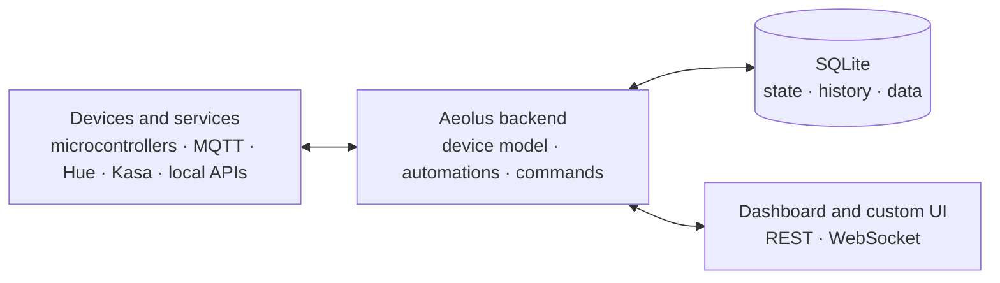

<p align="center">
  
</p>

<h1 align="center">Aeolus</h1>

<h3 align="center">Local software for the physical world</h3>

<p align="center">
  
  
  
  
  
  
</p>

<p align="center">
  <a href="#why-aeolus">Why Aeolus</a> ·
  <a href="#quick-start">Quick Start</a> ·
  <a href="#automation-projects">Automation Projects</a> ·
  <a href="#architecture">Architecture</a> ·
  <a href="#documentation">Documentation</a>
</p>

Aeolus is a local first, self hosted application platform for developers building software around physical devices and places.

Most smart equipment works well on its own. The problem is that every manufacturer tends to bring its own app, cloud account and data model. Hardware you build yourself, such as an ESP32 sensor or controller, has no natural place in those systems.

Aeolus puts both kinds of hardware in the same local system. Custom microcontrollers, MQTT devices and commercial integrations can share state, trigger the same automation logic, write to the same history and appear in interfaces built for the job.

Aeolus can still call cloud APIs, use remote services and be accessed remotely when needed. The difference is that the core system stays on site and does not depend on an internet connection to keep working.

**One local control plane. No required cloud account.**

<!--
MEDIA TODO: README hero
File: docs/media/aeolus-overview.gif
Purpose: make Aeolus understandable before the reader reaches the first heading.
Length: about 12 to 16 seconds, silent, cropped to the application window.
Use one believable environment rather than a montage of unrelated demos.
Suggested sequence:
1. Start on the real rural property / shed dashboard. Tank level, pump, solar or battery data should visibly be live. If possible, make at least one visible value come from a custom microcontroller.
2. Trigger one safe manual action or show one automatic transition.
3. Open that workflow's Automation Project and briefly reveal Logic and UI.
4. Return to the operating dashboard and show the resulting state/history update.
The first frame matters because GitHub may show it before animation starts. Make that frame a polished site dashboard.
-->
<!--  -->

## Why Aeolus

Physical places increasingly contain smart equipment, but "smart" often means one app per product family. Those apps are useful until the site needs devices to respond to each other, keep shared history or present one interface built around the job rather than the brand.

Aeolus began on a rural property with pumps, tanks, solar equipment, weather data, commercial smart devices and small controllers I could build myself. Some equipment came with its own app. Some exposed a local API. Other jobs were simple enough to solve with an ESP32, Arduino class board or another small controller. Making each part work was not the hard bit. Making them work together was.

The repeated work was software infrastructure: device ingestion, state, automation execution, storage, interfaces, authentication, logs, upgrades and deployment. A pile of scripts could solve the first problem, but it would leave the same platform work to rebuild for the next one.

Aeolus brings the tools and practices of modern software development to physical systems. It supplies the repeated edge plumbing so the developer can spend more time on the behaviour and interface that are specific to the site.

> **Edge automation should feel like application development.**

Aeolus treats the site as the system boundary. A custom microcontroller and a commercial device reached through a connector become peers in the same device and event model. Automation code can work with both without being built around the vendor protocol underneath. External services can still take part. The cloud can be useful without becoming the owner of the runtime.

> **Build the part that is unique to the place on top of a common local platform.**

Aeolus is designed for developers and technical integrators working with mixed hardware, custom behaviour and interfaces that need to match the job. It is less useful when a standard product already fits the site.

Aeolus is not trying to replace mature home automation platforms, PLCs or SCADA systems. Home automation platforms are a better fit when broad device support and simple setup matter most. PLC and SCADA systems are the right choice for deterministic control, certified safety functions and hard real time requirements. Aeolus is for custom supervisory software where the hardware is mixed and the behaviour is easier to express as ordinary application code.

For the full technical argument, including where mature alternatives are stronger, read [**Why Aeolus?**](docs/WHY_AEOLUS.md). For a code free introduction, read [**What Is Aeolus?**](docs/WHAT_IS_AEOLUS.md).

## What it looks like

The same Aeolus installation can be both the development environment and the finished operating interface.

A builder can inspect devices, MQTT traffic, state, history and logs, then open an Automation Project and work in TypeScript and React. An operator can use a focused dashboard that exposes only the information and controls needed for the job.

<!--
MEDIA TODO: Primary dashboard screenshot
File: docs/media/site-dashboard.png
Purpose: prove that Aeolus can become a real operating screen rather than a grid of generic IoT cards.
Use the strongest real rural property / shed dashboard.
Show 3 to 5 related concerns, for example header tank, transfer pump, solar/battery state, weather and recent flow/history.
Avoid showing every possible pane. Composition and believability matter more than density.
Recommended capture: 1600 x 900 or larger, clean browser crop, no devtools.
-->
<!--  -->

Automation Projects keep backend Logic and the operator interface in one project. Logic handles events, decisions and device actions. The optional React UI provides the controls and display for that same workflow.

<!--
MEDIA TODO: Automation Project screenshot
File: docs/media/automation-project.png
Purpose: communicate the core developer idea in one image.
Suggested composition: Logic editor on the left or upper section, UI preview on the right or lower section. Keep the code readable enough to look like normal application code.
Use a real workflow that also appears in the dashboard screenshot so the relationship is obvious.
The image should say "this operating screen is backed by code here" without needing a caption to explain it.
-->
<!--  -->

## Quick Start

### Requirements

* Linux host
* Docker Engine with Docker Compose
* Raspberry Pi 4/5 or another Linux machine

Aeolus uses Linux host networking for LAN discovery and direct communication with devices such as Kasa plugs and Hue bridges. The normal Docker Compose deployment is therefore intentionally Linux only. Source development uses the Node version pinned in [`.nvmrc`](.nvmrc).

### Start Aeolus

```bash
git clone https://github.com/j-a-m-i-e-c/aeolus.git
cd aeolus
make up
```

Open **http://localhost:3000** and create the first administrator account.

`make up` starts Aeolus itself. It does not start the simulator or add showcase content.

### Explore without hardware

The showcase runs the same unrestricted application with simulated hardware and seeded Automation Projects:

```bash
make showcase
make showcase-seed PASS=your-password
```

`USER` defaults to `admin` and can be overridden:

```bash
make showcase-seed USER=jamie PASS=your-password
```

The showcase uses very different simulated sites to demonstrate that the same Logic, UI, device, state and data model can be reused across different physical systems. It is not a claim that the repository ships certified integrations for every scenario shown.

### Raspberry Pi installation

```bash
curl -sSL https://raw.githubusercontent.com/j-a-m-i-e-c/aeolus/main/scripts/setup-pi.sh | bash
```

The setup script installs Docker, clones the repository, starts the services, enables restart on boot and sets the hostname to `aeolus`. The dashboard is then available at **http://aeolus.local:3000** on supported local networks.

## Core capabilities

| Area | What Aeolus provides |
|---|---|
| **Automation runtime** | JavaScript and TypeScript Logic executed in isolated V8 contexts with memory and execution limits |
| **Automation Projects** | Backend Logic, React UI, project files and private persistent state kept together as one edge application unit |
| **Devices** | Custom microcontrollers over MQTT, automatic discovery, commercial connectors and one common device/event model |
| **Operator UI** | Custom tabs, movable panes and sandboxed React interfaces made for a site or workflow |
| **State and data** | Automation state, reactive Shared State, device history and optional time series Collections |
| **Command outcomes** | Structured results that can represent request, dispatch, acknowledgement and observed physical confirmation |
| **Security** | Local authentication, groups, dashboard permissions, MQTT credential modes and isolated user written code |
| **Operations** | Logs, health, metrics, history, database backups and versioned migrations |
| **Concurrent users** | Server owned revisions prevent stale dashboard or Automation Project edits from silently overwriting newer work |
| **Deployment** | Docker Compose on Linux and Raspberry Pi, with no mandatory hosted Aeolus service |

## One environment for building and operating

Aeolus provides four pinned areas: **System**, **Connectors**, **Data** and **Security**. Custom tabs can then be built around a site, workflow or operating role.

A custom tab is made from movable and resizable panes. Built in panes cover devices, automations, sensor values, history, MQTT traffic, events, schedules, logs and system health. Automation Projects can also render their own purpose built React interface inside a pane.

This means a technical user can work on the system in the same environment where another user sees a much simpler operating view.

Several people can view and operate the same site at once. Aeolus does not attempt Google Docs style collaborative text editing.


## Automation Projects

An Aeolus automation can contain backend Logic, an optional React UI and supporting files. Larger projects can use ordinary files and relative imports instead of growing into one large script.

```text
my-automation/
├── logic/
│   ├── index.ts          # readable orchestration entry point
│   ├── policy.ts
│   └── commands.ts
├── ui/
│   ├── index.tsx         # readable UI composition entry point
│   ├── Dashboard.tsx
│   └── hooks.ts
└── shared/
    └── constants.ts
```

For substantial projects, `logic/index.ts` and `ui/index.tsx` should stay readable enough to show the shape of the automation. Detailed policy, device handling, projections and visual components can live in named files.

Logic and UI are bundled in memory but run through separate isolation boundaries. Keeping them in one project does not give either side extra runtime privileges. See [Automation Projects](docs/architecture/AUTOMATION_PROJECTS.md).

### Logic, UI and state

```text
┌──────────────────────────────┐        ┌──────────────────────────────┐
│ Logic: backend               │        │ UI: React                    │
│                              │        │                              │
│ state.set("mode", "auto")    ├───────►│ aeolus.read("mode")          │
│                              │ SQLite │                              │
│                              │  + WS  │                              │
│ state.get("target")          │◄───────┤ aeolus.save("target", 70)    │
│                              │ HTTP + │                              │
│                              │ SQLite │                              │
│ context.topic / state        │◄───────┤ aeolus.fire("apply", {...})  │
│                              │  HTTP  │                              │
└──────────────────────────────┘        └──────────────────────────────┘
```

* `state.set()` writes an automation's private persistent state. UI components reading the key update over WebSocket.
* `aeolus.save()` writes to the same store from the UI so Logic can read the value on later runs.
* `aeolus.fire()` immediately invokes Logic with an operator event and payload.
* `aeolus.saveAndFire()` persists a value and fires Logic when both behaviours are wanted together.

For the method level model, see [**Custom UI SDK: state, events and operator intent**](docs/reference/custom-ui-sdk.md).

### Logic stays ordinary TypeScript

```ts
// logic/index.ts
import { decideTransfer, recordTransfer } from "./water-transfer";

export default async function run(context: EventContext) {
  if (context.topic !== "sensor/header-tank/level") return;

  const decision = decideTransfer({
    level: context.state.level,
    battery: shared.get("site-energy", "battery"),
  });

  if (!decision.start) return;

  const result = await devices.execute("transfer-pump", "on");
  recordTransfer(decision, result);
}
```

Aeolus supplies the surrounding runtime: event delivery, device access, state, data, isolation, logging, command results and deployment. The project contains the part that belongs to this particular place.

### Custom UI stays close to the behaviour

A project's UI can read automation state, persist operator choices and fire explicit events back into Logic. It is compiled on save and loaded into a sandboxed iframe with an opaque origin. Privileged operations pass through a capability scoped RPC bridge, so the frame never receives the user's authentication token or general access to the host application.

The main sandbox APIs are:

| Global | Purpose |
|---|---|
| `context` | Event that triggered the Logic execution |
| `devices` | Query the registry and request device actions |
| `mqtt` | Publish MQTT messages |
| `state` | Private persistent state for one Automation Project |
| `shared` | Durable current values intentionally shared between automations |
| `events` | Emit a discrete occurrence other automations can trigger on |
| `db` | Historical time series Collections when enabled |
| `http` | Bounded HTTP(S) requests to public services |
| `log` | Structured application logs |
| `automation()` | Optional condition/action helper used for simple rules and flow visualisation |

## Devices and connectors

Custom microcontrollers can join Aeolus directly over MQTT. An ESP32, Arduino class board or other MQTT client can publish telemetry, expose state and subscribe to commands through the local broker. Aeolus then represents that hardware in the same device registry used by commercial connectors.

```cpp
mqtt.publish("sensor/shed/temperature", "{\"value\":23.5,\"unit\":\"C\"}");
mqtt.subscribe("pump/transfer/command");
```

Incoming topic and state data can populate the device registry without a platform specific firmware format. Device firmware remains responsible for local electrical safety, watchdogs and fail safe behaviour.

See the [**Microcontroller integration guide**](docs/MICROCONTROLLERS.md) for sensor, actuator, authentication and reconnection examples.

<!--
MEDIA TODO: Custom microcontroller integration
File: docs/media/custom-microcontroller.png
Purpose: show that hardware you build yourself becomes a normal part of the same Aeolus system as commercial devices.
Best option: use a real ESP32 or Arduino class board connected to a useful sensor or actuator, with its live Aeolus device/state view visible beside it.
Prefer one believable piece of hardware from the real property over a breadboard assembled only for the screenshot.
The image should make the path obvious: custom hardware -> local MQTT -> Aeolus device/state -> automation or operator UI.
-->
<!--  -->

Commercial products and services can enter through connectors. Built in connectors currently include:

* **Philips Hue**, with guided bridge pairing, light controls and editor snippets
* **TP Link Kasa**, with LAN discovery, plug controls and energy data where supported

A connector plugs its own discovery and action model into the same Aeolus device registry used by MQTT hardware. Start with the [**connector developer guide**](src/connectors/README.md) and [`src/connectors/_template`](src/connectors/_template/).


## State, history and physical outcomes

Aeolus separates several kinds of information that are often collapsed into one generic state store.

**Automation state** belongs to one Automation Project and is shared between its Logic and UI.

**Shared State** holds durable current values that automations intentionally share. Writing the value a key already holds is a no op, so projection automations can recompute freely without producing event noise.

**Automation Events** are discrete occurrences rather than values: an alarm, a detection, a completed cycle. Another automation can trigger on one. They are deliberately never coalesced, because collapsing two alarms that happen to share a topic would lose a fact.

**Collections** hold history: measurements, events, sessions, equipment readings, power data or command outcomes. Queries support time ranges, tags and basic aggregation. Historical Collections are optional and have explicit storage and retention limits.

The distinction is deliberate. A current value, an occurrence and a historical series answer different questions, and a store that treats them alike makes the wrong one convenient.

Physical commands also have more uncertainty than an ordinary function call. Where the integration supports it, Aeolus can distinguish between a command being requested, dispatched, acknowledged by a device and confirmed through observed state.

<!--
MEDIA TODO: Command outcome GIF
File: docs/media/command-verification.gif
Purpose: show one of the less generic parts of Aeolus.
Use a real or simulated pump, relay or light where state confirmation is visible.
Sequence: operator action or automation decision -> dispatched -> acknowledged if available -> observed result -> history/log entry.
Keep the labels readable and do not imply observed confirmation on integrations that cannot provide it.
-->
<!--  -->

<!--
MEDIA TODO: Data explorer screenshot
File: docs/media/data-explorer.png
Purpose: make local history tangible.
Use one signal with a story, preferably real site water, energy, temperature or flow data.
Show enough of the Collection explorer and filters to establish that this is queryable history, not just a decorative chart.
-->
<!--  -->

## Operations and deployment

Aeolus includes the tooling needed to monitor, troubleshoot and maintain a deployed site:

* live health, logs and MQTT inspection
* connector status and action latency
* device state and automation execution history
* Prometheus compatible metrics
* optional built in metric history when the Data Store is enabled
* versioned database migrations with backups before upgrade
* health checks and repeatable Docker deployment

Security boundaries are explicit too. Backend Logic executes in fresh `isolated-vm` contexts with memory and execution limits. Custom UI runs in opaque origin sandboxed iframes. Authentication, user groups, dashboard permissions and MQTT credential modes are built into the local control plane.

Aeolus should still be deployed on a segmented or otherwise trusted network when it controls meaningful physical equipment. It is not a substitute for independent electrical, mechanical or certified safety protection.

<!--
MEDIA TODO: Operations screenshot
File: docs/media/operations.png
Purpose: show that Aeolus is diagnosable after deployment.
Compose one view with live system health, logs and a meaningful history/metric panel while a real sensor is publishing.
Avoid a wall of tiny widgets. The image should read as an operating tool, not a monitoring collage.
-->
<!--  -->

## Architecture

At the highest level, equipment talks to one local Aeolus backend. The backend keeps local state and data, runs Automation Projects and routes commands. People use the dashboard to build and operate the system.


```mermaid
flowchart LR
    Devices[Devices and services<br/>microcontrollers · MQTT · Hue · Kasa · local APIs] <--> Core[Aeolus backend<br/>device model · automations · commands]
    Core <--> Storage[(SQLite<br/>state · history · data)]
    Core <--> Interface[Dashboard and custom UI<br/>REST · WebSocket]
```

The backend normalises incoming events, maintains the device registry, executes isolated Logic, persists state and data, and routes commands back to equipment. The React dashboard is both the development environment and the home of finished operator interfaces.

| Service | Default port | Responsibility |
|---|---:|---|
| `aeolus-mosquitto` | `1883` | Local MQTT broker |
| `aeolus-mosquitto-reloader` | not exposed | Scoped sidecar for managed Mosquitto reloads |
| `aeolus-backend` | `3001` | API, WebSocket, connectors, registry, automations and storage |
| `aeolus-frontend` | `3000` | React dashboard served through nginx |

| Layer | Stack |
|---|---|
| Backend | Node.js 24, TypeScript, Express, SQLite, mqtt.js, `ws`, `isolated-vm`, pino, prom-client |
| Frontend | React 19, Vite, Zustand, Tailwind CSS, Monaco Editor, react-grid-layout |
| Infrastructure | Docker Compose, Eclipse Mosquitto, Linux host networking |

For the component level architecture, event flow, connector lifecycle, sandbox boundaries and command path, see the [**detailed architecture**](docs/WHY_AEOLUS.md#detailed-architecture).

## Project maturity

Aeolus is an **early alpha platform under active development**.

The core runtime, dashboard, Automation Project model, MQTT integration, connector framework, local data, migrations, authentication, code isolation and concurrent authoring protections are implemented. APIs and operating assumptions can still change while the project gains more deployment experience.

It is appropriate for development, supervised pilots and automation that is not safety critical, with independent physical safeguards. It is not a replacement for certified control systems, hardwired interlocks, motor protection, dry run protection, emergency stops or other safety equipment.

The present design is centred on a trusted single site deployment. Aeolus is not currently a fleet manager, hard real time control system or hostile multi tenant platform.

## Configuration

Runtime defaults come from [`src/config.ts`](src/config.ts). `docker-compose.yml` overrides a few values for the container deployment.

Common environment variables include:

| Variable | Default | Purpose |
|---|---|---|
| `MQTT_BROKER_URL` | `mqtt://localhost:1883` | Broker used by the backend |
| `MQTT_TOPICS` | `#` | MQTT subscription filter |
| `MQTT_DISCOVERY_IGNORED_TOPIC_SUFFIXES` | `set,command,cmd,heartbeat,availability` | Topic leaf names excluded from automatic discovery |
| `PORT` / `API_PORT` | `3001` | Backend API port |
| `DB_PATH` | `./data/aeolus.db` (`/app/data/aeolus.db` in Compose) | SQLite database path |
| `LOG_LEVEL` | `debug` (`info` in Compose) | Application logging level |
| `NODE_ENV` | `development` (`production` in Compose) | Runtime environment |
| `JWT_SECRET` | generated and persisted in SQLite if absent | Access token signing secret |
| `METRICS_TOKEN` | unset | Optional bearer token for `/metrics` |

See [`.env.example`](.env.example), [`frontend/.env.example`](frontend/.env.example) and [`docker-compose.yml`](docker-compose.yml) for deployment starting points.

## Documentation

The README is meant to explain the product and get a developer running. The deeper material lives in the documentation set.

| Document | Audience |
|---|---|
| [**Documentation map**](docs/README.md) | All guides and references, organised by task and audience |
| [**What Is Aeolus?**](docs/WHAT_IS_AEOLUS.md) | Non software readers who want the product idea without implementation detail |
| [**Why Aeolus?**](docs/WHY_AEOLUS.md) | Developers and technical reviewers evaluating the product and architecture |
| [**Technical reference**](docs/reference/README.md) | Runtime, API, storage, dashboard and operations reference |
| [**Security reference**](docs/security/README.md) | Authentication, permissions, tokens and MQTT security |
| [**Microcontrollers**](docs/MICROCONTROLLERS.md) | ESP32 and Arduino MQTT integration |
| [**Production deployment**](docs/production-deployment.md) | Operational deployment guidance |
| [**Demo subsystem**](demo/README.md) | Showcase boundaries, seeding and operations |
| [**Testing**](docs/TESTING.md) | Test strategy, coverage and CI |
| [**Connector guide**](src/connectors/README.md) | Building a new integration |
| [**Roadmap**](docs/ROADMAP.md) | Current priorities and longer term directions |
| [**Contributing**](CONTRIBUTING.md) | Development workflow and pull requests |

## Roadmap

The near term focus is to prove the platform on real equipment, make the development and operating experience solid, and keep deployment easy to understand and recover.

Longer term work includes more industrial and energy integrations, exportable Automation Projects, stable external APIs, stronger offline queues, optional visual helpers, local inference as another event source and eventually multiple locally autonomous sites.

See the complete [roadmap](docs/ROADMAP.md).

## Contributing

See [CONTRIBUTING.md](CONTRIBUTING.md) for repository setup, development workflow and pull request expectations. Connector contributions can begin with [`src/connectors/_template`](src/connectors/_template/) and the [connector developer guide](src/connectors/README.md).

## Licence

Aeolus is open source under the [GNU Affero General Public License v3.0](LICENSE) (`AGPL-3.0-only`). You may use, modify and redistribute Aeolus, including commercially, under the terms of that licence. If you modify the covered software and make that modified version available for users to interact with over a network, the AGPL requires those users to be offered the corresponding source code.

See [LICENSING.md](LICENSING.md) for the licensing model, third party software and possible alternative commercial terms.
