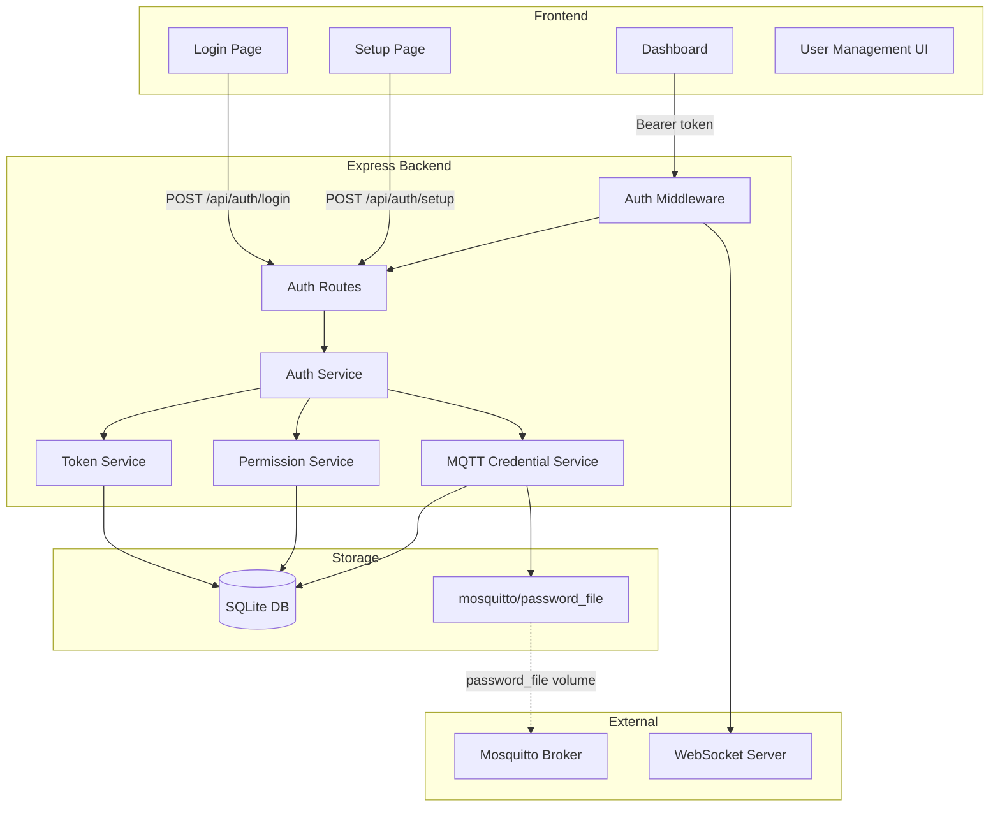
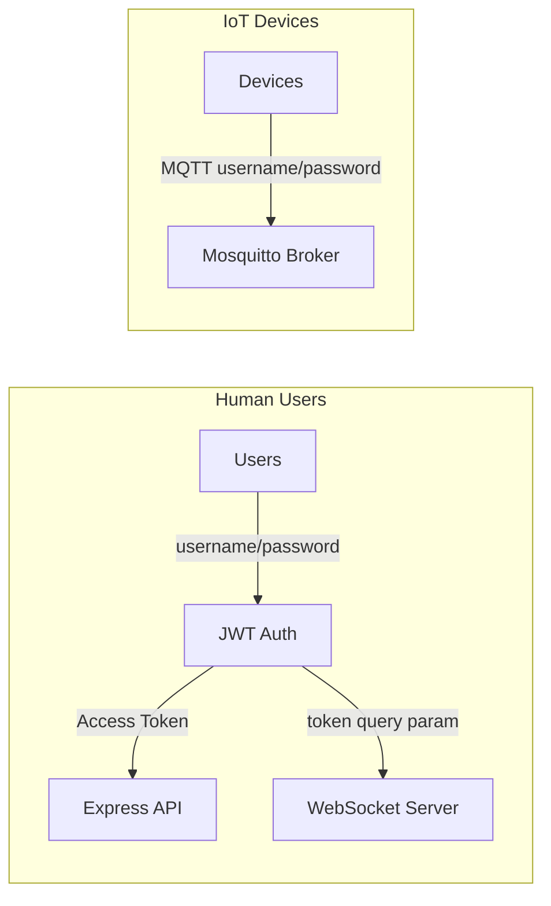
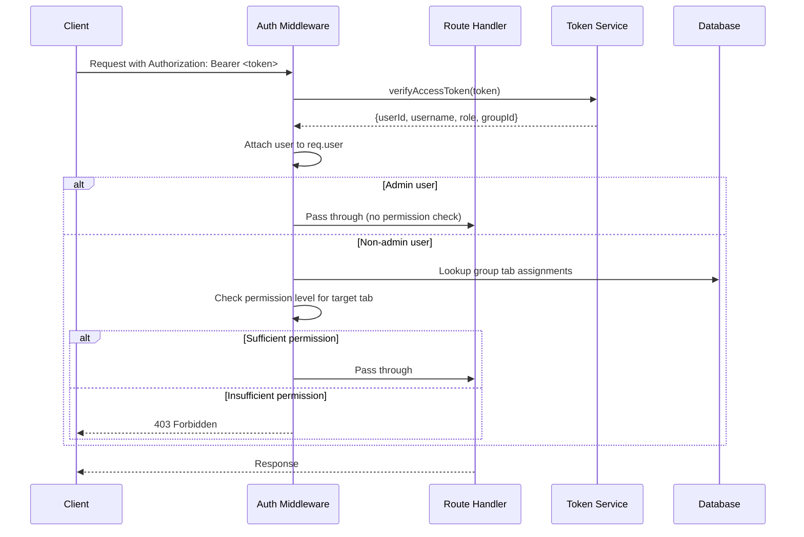
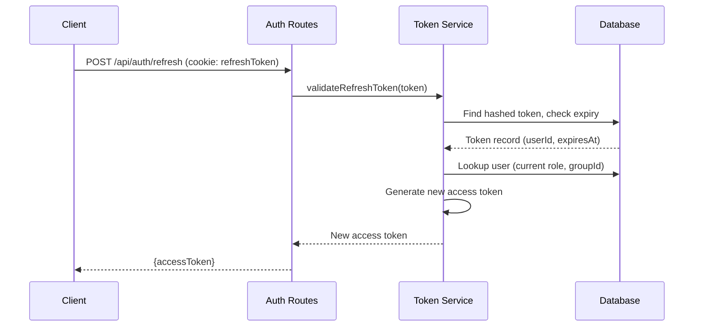
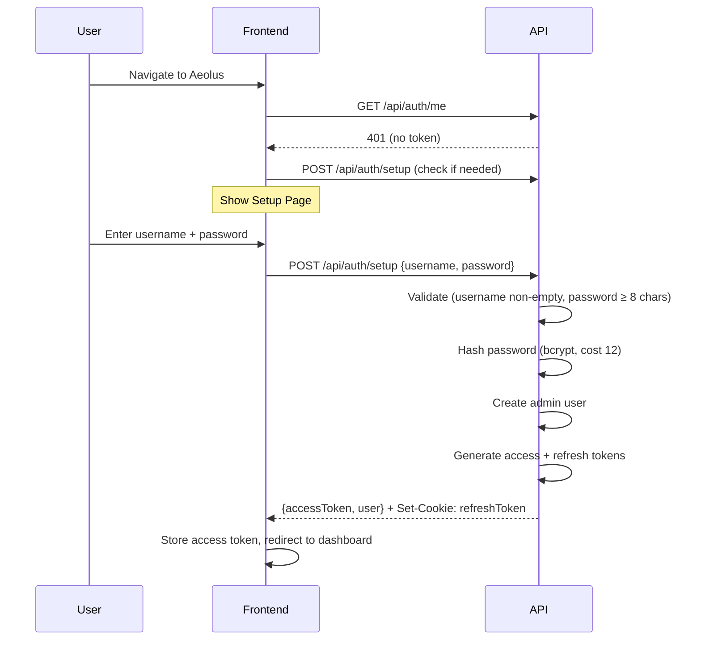
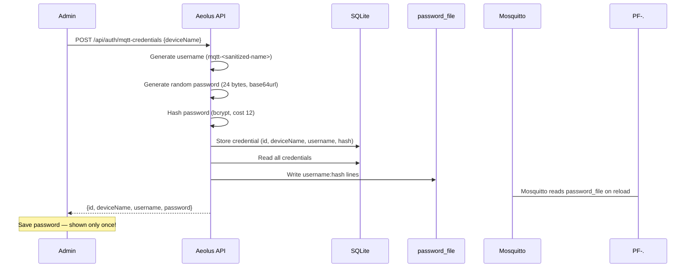

# Authentication

Aeolus uses a JWT-based authentication system with group-based, tab-level permissions. Authentication is always active — there is no disabled mode. The system protects the HTTP API, WebSocket connections, and MQTT broker.

## Architecture Overview



### Two Separate Auth Systems

Aeolus manages two independent authentication mechanisms:



| System | Audience | Mechanism | Storage |
|--------|----------|-----------|---------|
| JWT Auth | Human users (dashboard) | Access token (15min) + Refresh token (7 days) | SQLite `users`, `refresh_tokens` tables |
| MQTT Auth | IoT devices + backend | Username/password pairs | SQLite `mqtt_credentials` + `mosquitto/password_file` |

---

## Request Flow

Every authenticated API request passes through the auth middleware before reaching the route handler:



---

## Token Refresh Flow

Access tokens expire after 15 minutes. The frontend silently refreshes them using the httpOnly refresh cookie:



---

## Permission Model

### Three Permission Levels

| Level | Description | Allows |
|-------|-------------|--------|
| `read` | View only | See tab content, observe device states |
| `interact` | Device control | Toggle devices, fire automations, adjust sliders |
| `write` | Full control | Edit automation code, manage panes, configure connectors |

### Permission Hierarchy

```
write > interact > read
```

A permission check for `interact` passes if the user has `interact` OR `write`. A check for `read` passes if the user has any of the three levels.

### How It Works

1. The admin creates **groups** (e.g., "Family", "Guests")
2. Each group has **tab assignments** — a mapping of tab IDs to permission levels
3. Each non-admin user belongs to exactly **one group**
4. The **admin** bypasses all permission checks and sees all tabs with full access

### Examples

**Group: "Family"**
| Tab | Permission |
|-----|-----------|
| Living Room | write |
| Kitchen | interact |
| System | read |

A user in the "Family" group can:
- Edit automations and manage panes on the Living Room tab
- Toggle lights and fire automations on the Kitchen tab
- View system information but not change anything on the System tab
- NOT access any other tabs

**Group: "Guests"**
| Tab | Permission |
|-----|-----------|
| Living Room | interact |

A user in the "Guests" group can:
- Toggle devices in the Living Room
- NOT edit automations or manage panes in the Living Room
- NOT access any other tabs

### Admin-Only Actions

Regardless of tab assignments, only the admin can:
- Create/delete users and groups
- Create/delete tabs
- Manage MQTT credentials
- Manage connectors and services

---

## First-Run Setup

When Aeolus starts for the first time (no admin user exists), it serves the Setup Page on all frontend routes.



**Requirements:**
- Username must not be empty
- Password must be at least 8 characters
- Setup can only be performed once (returns 409 if admin already exists)

---

## API Reference

### Public Endpoints (no auth required)

#### `POST /api/auth/setup`

First-run admin account creation.

**Request:**
```json
{
  "username": "admin",
  "password": "securepassword123"
}
```

**Response (201):**
```json
{
  "accessToken": "eyJhbGciOiJIUzI1NiIs...",
  "user": {
    "id": "550e8400-e29b-41d4-a716-446655440000",
    "username": "admin",
    "role": "admin"
  }
}
```

Also sets `refreshToken` as an httpOnly cookie.

**Errors:**
- `400` — Username empty or password < 8 characters
- `409` — Setup already completed

---

#### `POST /api/auth/login`

Authenticate with credentials. Rate limited to 5 requests/minute/IP.

**Request:**
```json
{
  "username": "admin",
  "password": "securepassword123"
}
```

**Response (200):**
```json
{
  "accessToken": "eyJhbGciOiJIUzI1NiIs...",
  "user": {
    "id": "550e8400-e29b-41d4-a716-446655440000",
    "username": "admin",
    "role": "admin"
  }
}
```

Also sets `refreshToken` as an httpOnly cookie.

**Errors:**
- `401` — Invalid username or password
- `429` — Too many login attempts (Retry-After header included)

---

#### `POST /api/auth/refresh`

Exchange the refresh token cookie for a new access token.

**Request:** No body. The `refreshToken` cookie is sent automatically.

**Response (200):**
```json
{
  "accessToken": "eyJhbGciOiJIUzI1NiIs..."
}
```

**Errors:**
- `401` — No refresh token, invalid, or expired

---

### Authenticated Endpoints

All endpoints below require `Authorization: Bearer <accessToken>` header.

#### `POST /api/auth/logout`

Revoke the refresh token and clear the cookie.

**Response (200):**
```json
{
  "success": true
}
```

---

#### `PUT /api/auth/password`

Change the authenticated user's own password.

**Request:**
```json
{
  "currentPassword": "oldpassword123",
  "newPassword": "newpassword456"
}
```

**Response (200):**
```json
{
  "success": true
}
```

**Errors:**
- `401` — Current password is incorrect
- `400` — New password < 8 characters

---

#### `GET /api/auth/me`

Get the current user's info and accessible tabs.

**Response (200):**
```json
{
  "id": "550e8400-e29b-41d4-a716-446655440000",
  "username": "admin",
  "role": "admin",
  "groupId": null,
  "accessibleTabs": [
    { "tabId": "tab-living-room", "permission": "write" },
    { "tabId": "tab-kitchen", "permission": "write" }
  ]
}
```

---

### User Management (Admin Only)

#### `GET /api/auth/users`

List all users.

**Response (200):**
```json
[
  {
    "id": "550e8400-e29b-41d4-a716-446655440000",
    "username": "admin",
    "role": "admin",
    "groupId": null,
    "createdAt": 1700000000000
  },
  {
    "id": "660e8400-e29b-41d4-a716-446655440001",
    "username": "alice",
    "role": "user",
    "groupId": "group-family",
    "createdAt": 1700001000000
  }
]
```

---

#### `POST /api/auth/users`

Create a new user.

**Request:**
```json
{
  "username": "alice",
  "password": "alicepassword1",
  "groupId": "group-family"
}
```

**Response (201):**
```json
{
  "id": "660e8400-e29b-41d4-a716-446655440001",
  "username": "alice",
  "role": "user",
  "groupId": "group-family",
  "createdAt": 1700001000000
}
```

**Errors:**
- `400` — Validation failed (password < 8 chars, missing fields)
- `409` — Username already exists

---

#### `PUT /api/auth/users/:id`

Update a user's group or reset their password.

**Request:**
```json
{
  "groupId": "group-guests",
  "password": "newpassword123"
}
```

Both fields are optional — include only what you want to change.

**Response (200):**
```json
{
  "id": "660e8400-e29b-41d4-a716-446655440001",
  "username": "alice",
  "role": "user",
  "groupId": "group-guests",
  "createdAt": 1700001000000
}
```

---

#### `DELETE /api/auth/users/:id`

Delete a user and invalidate all their tokens.

**Response (200):**
```json
{
  "success": true
}
```

**Errors:**
- `404` — User not found
- `409` — Cannot delete the last admin user

---

### Group Management (Admin Only)

#### `GET /api/auth/groups`

List all groups with their tab assignments.

**Response (200):**
```json
[
  {
    "id": "group-family",
    "name": "Family",
    "tabAssignments": [
      { "tabId": "tab-living-room", "permission": "write" },
      { "tabId": "tab-kitchen", "permission": "interact" }
    ],
    "createdAt": 1700000500000
  }
]
```

---

#### `POST /api/auth/groups`

Create a new group.

**Request:**
```json
{
  "name": "Guests",
  "tabAssignments": [
    { "tabId": "tab-living-room", "permission": "interact" }
  ]
}
```

**Response (201):**
```json
{
  "id": "group-guests",
  "name": "Guests",
  "tabAssignments": [
    { "tabId": "tab-living-room", "permission": "interact" }
  ],
  "createdAt": 1700002000000
}
```

---

#### `PUT /api/auth/groups/:id`

Update a group's name and tab assignments.

**Request:**
```json
{
  "name": "Guests (Updated)",
  "tabAssignments": [
    { "tabId": "tab-living-room", "permission": "read" },
    { "tabId": "tab-kitchen", "permission": "interact" }
  ]
}
```

**Response (200):** Updated group object.

---

#### `DELETE /api/auth/groups/:id`

Delete a group. All users in this group lose access until reassigned.

**Response (200):**
```json
{
  "success": true
}
```

**Errors:**
- `404` — Group not found

---

### MQTT Credential Management (Admin Only)

#### `GET /api/auth/mqtt-credentials`

List all MQTT credentials (passwords are never returned).

**Response (200):**
```json
[
  {
    "id": "cred-001",
    "deviceName": "Living Room Sensor",
    "username": "mqtt-living-room-sensor",
    "createdAt": 1700003000000
  },
  {
    "id": "cred-backend",
    "deviceName": "aeolus-backend",
    "username": "aeolus-backend",
    "createdAt": 1700000000000
  }
]
```

---

#### `POST /api/auth/mqtt-credentials`

Create a new MQTT credential for a device. The password is only returned once.

**Request:**
```json
{
  "deviceName": "Garden Sensor"
}
```

**Response (201):**
```json
{
  "id": "cred-002",
  "deviceName": "Garden Sensor",
  "username": "mqtt-garden-sensor",
  "password": "dGhpcyBpcyBhIHJhbmRvbSBwYXNzd29yZA"
}
```

> **Important:** Save the password immediately. It cannot be retrieved again.

---

#### `DELETE /api/auth/mqtt-credentials/:id`

Delete an MQTT credential and regenerate the password file.

**Response (200):**
```json
{
  "success": true
}
```

---

## MQTT Credential Workflow



The password file is regenerated from scratch on every create/delete operation, ensuring it always matches the database state exactly.

**Username format:** Device names are sanitized to `mqtt-<lowercase-alphanumeric-hyphens>`. For example:
- "Living Room Sensor" → `mqtt-living-room-sensor`
- "Garden_Temp" → `mqtt-garden-temp`

The backend maintains its own credential (`aeolus-backend`) for publishing MQTT messages to the broker.

---

## Environment Variables

| Variable | Required | Default | Description |
|----------|----------|---------|-------------|
| `JWT_SECRET` | No | Auto-generated | 256-bit key for signing JWT access tokens. If not set, Aeolus generates a random key on first run and stores it in the database. |
| `MQTT_PASSWORD_FILE` | No | `mosquitto/password_file` | Path to the Mosquitto password file. Aeolus writes this file when MQTT credentials change. |

### JWT Secret Behavior

1. **First run (no env var, no stored key):** Aeolus generates a random 256-bit key and stores it in the `system_settings` table.
2. **Subsequent runs (no env var):** Aeolus loads the stored key from the database.
3. **Environment variable set:** Aeolus uses `JWT_SECRET` from the environment, ignoring any stored key.
4. **Secret changes:** All existing access and refresh tokens become invalid. Users must log in again.

---

## Token Details

| Token | Type | Lifetime | Storage | Contains |
|-------|------|----------|---------|----------|
| Access Token | JWT (HS256) | 15 minutes | Frontend memory (not localStorage) | userId, username, role, groupId |
| Refresh Token | Opaque (32 random bytes, base64url) | 7 days | httpOnly cookie + SHA-256 hash in DB | — |

### Cookie Attributes

The refresh token cookie is set with:
- `HttpOnly` — Not accessible via JavaScript
- `SameSite=Strict` — Not sent on cross-origin requests
- `Path=/api/auth` — Only sent to auth endpoints
- `Max-Age=604800` — 7 days

---

## Troubleshooting

### Access Token Expired

**Symptom:** API returns `401 Unauthorized` after working previously.

**Cause:** Access tokens expire after 15 minutes. The frontend should silently refresh them.

**Fix:** The frontend automatically calls `POST /api/auth/refresh` before the token expires. If this fails (e.g., refresh token also expired), the user is redirected to the login page. Simply log in again.

---

### Locked Out (Forgot Password)

**Symptom:** Cannot log in, no other admin accounts exist.

**Fix:** The admin can reset any user's password via `PUT /api/auth/users/:id`. If the admin themselves is locked out, see "Reset Admin" below.

---

### Reset Admin (Emergency Recovery)

**Symptom:** The admin password is lost and there's no way to log in.

**Fix:** Delete the users table to trigger the first-run setup flow again:

1. Stop Aeolus
2. Open the SQLite database file (default: `data/aeolus.db`)
3. Run:
   ```sql
   DELETE FROM users;
   DELETE FROM refresh_tokens;
   ```
4. Restart Aeolus
5. The Setup Page will appear — create a new admin account

> **Warning:** This deletes ALL user accounts. Groups and their tab assignments are preserved.

---

### Rate Limited (429 Too Many Requests)

**Symptom:** Login returns `429 Too Many Requests`.

**Cause:** More than 5 login attempts in 1 minute from the same IP.

**Fix:** Wait for the duration specified in the `Retry-After` response header (up to 60 seconds), then try again.

---

### WebSocket Connection Rejected (4001)

**Symptom:** WebSocket connection closes immediately with code 4001.

**Cause:** The `token` query parameter is missing, invalid, or expired.

**Fix:** Ensure the WebSocket connection URL includes a valid access token:
```
ws://localhost:3000/ws?token=<valid-access-token>
```

If the token is expired, refresh it first via `POST /api/auth/refresh`, then reconnect.

---

### MQTT Device Cannot Connect

**Symptom:** A device fails to authenticate with the Mosquitto broker.

**Possible causes:**
1. The credential was deleted — check `GET /api/auth/mqtt-credentials`
2. The password file is out of sync — delete and recreate the credential
3. Mosquitto hasn't reloaded the password file — restart the Mosquitto container

---

### User Has No Access After Group Deletion

**Symptom:** A user can log in but sees no tabs.

**Cause:** Their group was deleted, setting their `groupId` to null.

**Fix:** The admin must assign the user to a new group via `PUT /api/auth/users/:id` with a valid `groupId`.
