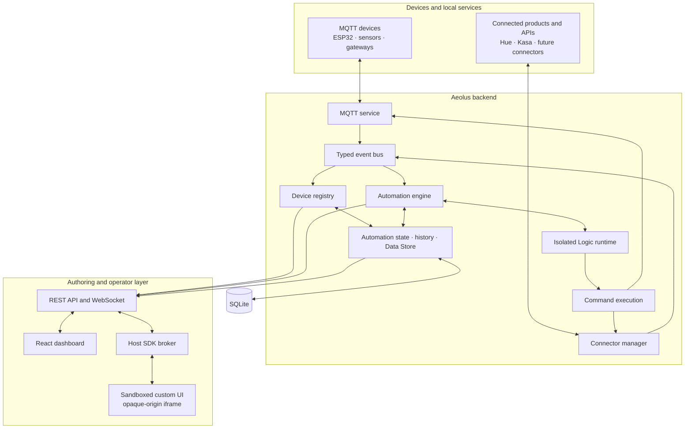
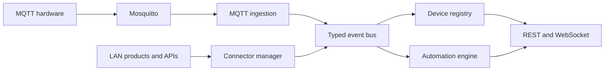

# Why Aeolus?

> **Audience:** software engineers, technical reviewers, systems integrators and anyone evaluating the architecture or product thesis. For a code-free introduction, start with [What Is Aeolus?](./WHAT_IS_AEOLUS.md).

Aeolus is a local-first platform for building software around physical devices and places.

It receives events from hardware and services, puts them into a common model, runs user-authored logic, stores state and history, sends commands back out and renders interfaces made for the job at hand. It runs on site and does not need an Aeolus cloud service to keep doing its core work.

The technical idea is straightforward:

> Edge automation should feel like application development. Developers should get real code, clear APIs, persistent data, isolation, useful debugging, versioned migrations and the freedom to build the interface the operator actually needs.

Aeolus is not trying to replace every home automation platform, PLC or SCADA system. It is aimed at the awkward middle: sites that are too unusual for a fixed product, but too small or changeable to justify rebuilding the whole software stack from scratch.

<!--
MEDIA TODO: WHY hero image
File: media/why-aeolus-hero.png
Show: one believable site dashboard beside an open Logic/UI automation pane. The image should communicate “operational system + development environment”, not just a smart-home dashboard.
Recommended composition: 60% live site view, 40% editor/custom component.
-->
<!--  -->

---

## It started with a real place

I started Aeolus on a rural property because the equipment around me did not behave like one system. There were pumps, tanks, solar equipment, weather data, cameras, commercial smart devices and small controllers I could build myself.

Each part was useful. Joining them together was the problem:

- every product had its own protocol, application or cloud service
- there was no shared view of the site
- simple automation tools became awkward once the behaviour started looking like an application
- generic dashboards could show values, but struggled to become a purpose-built operating screen
- a pile of scripts could solve the immediate problem, but would leave me rebuilding the same platform work for every new idea

The first version could have stayed as a personal collection of MQTT topics, Node scripts and dashboards. Instead, I pulled the repeated pieces into a reusable runtime: device ingestion, state, automation execution, storage, interfaces, authentication, logs, upgrades and deployment.

The property is still the best real reference for Aeolus, but it is only one example. The seed demo deliberately stretches the same primitives across agriculture, a research vessel, underground mining, spacecraft operations, a stage show, an escape room, wildlife monitoring and an off-grid bunker. Those are simulations, not claims of finished industry integrations. Their purpose is to show that Aeolus is a platform model rather than a pump controller with ambitions.

## The gap Aeolus is trying to fill

There are already excellent tools around physical systems. Aeolus exists because they optimise for different constraints.

### Vendor applications

Vendor applications are often the fastest route to controlling one product family. The trade-off is that logic, history, identity and remote access remain organised around the vendor rather than the site.

Aeolus treats the site as the system boundary. A Hue light, Kasa plug, ESP32 sensor and future Modbus inverter should be able to participate in the same automation and appear in the same operational interface.

### Configuration-first automation

Configuration and visual editors are highly effective when the problem fits the available model. They become harder to reason about when behaviour needs:

- branching and composition
- reusable functions and data structures
- external API calls
- state accumulated across events
- richer failure handling
- a custom interface coupled to one workflow
- version control, review and testing using normal software practices.

Aeolus deliberately assumes its author is comfortable writing code. That narrows the audience, but it avoids forcing increasingly application-like behaviour through an abstraction designed for simple rules.

### Flow-based programming

Flow graphs make event movement visible and are excellent for integration work. Large or highly stateful flows can nevertheless become difficult to review, reuse and test as ordinary software.

Aeolus keeps visualisation as a useful view of execution, not the source of truth. A structured helper can generate a flow diagram, while the underlying implementation remains code.

### Bespoke applications

A completely custom application offers maximum control, but each project must rebuild familiar infrastructure: authentication, MQTT integration, device state, dashboards, persistence, migrations, logs, metrics, deployment and failure boundaries.

Aeolus aims to make the bespoke part small. The developer writes the logic and interface specific to the site; the platform supplies the edge runtime and operational plumbing.

### Industrial control and SCADA

Traditional PLC/SCADA systems are the correct choice for deterministic control, certified safety functions, hard real-time requirements and large industrial deployments. Aeolus is not currently a substitute for those systems.

Its potential role is below or beside that tier: custom supervisory logic, data integration, operator interfaces and orchestration for smaller or heterogeneous sites, while independent hardware retains responsibility for safety-critical protection.

## Design principles

The architecture follows several principles rather than a checklist of device integrations.

### 1. Local-first, not local-only

Core operation should continue on the site when the internet is unavailable. Sensor ingestion, rules, state, dashboards and local device control should not depend on a hosted account.

That does not forbid external services. An automation may call a weather API, remote access may be added deliberately and data may be exported elsewhere. The distinction is that the cloud is an optional participant, not the runtime owner.

### 2. Code is the primary authoring model

Aeolus exposes JavaScript/TypeScript, a Monaco editor and explicit platform APIs. The goal is not code for its own sake; it is to preserve the expressiveness, structure and tooling that software engineers already use.

### 3. An automation can be a full-stack edge application

Logic, persistent state and a custom interface belong together when they implement one operational concern. Aeolus makes that relationship explicit.

### 4. Hardware enters through a common model

MQTT and connectors may use different protocols, but automations should receive the same shape of event and query the same device registry.

### 5. User-authored code needs real boundaries

Backend logic and frontend components are powerful enough to damage stability or expose privileges if executed directly in the host context. Aeolus uses separate isolation mechanisms for each.

### 6. The platform should not pretend

Software can send a command without producing the result a person expected. Aeolus keeps room for different levels of evidence, from a dispatched request through to a device acknowledgement or an observed physical result.

### 7. Operational concerns are part of the product

Migrations, logs, metrics, history, health and backups are not optional polish. A system that operates physical equipment needs to be diagnosable and upgradable.

### 8. Safety remains layered

Software orchestration must not replace independent electrical and mechanical protection. A pump still needs appropriate dry-run protection, overload protection and tank safeguards. Aeolus may coordinate the equipment; it should not be the only barrier preventing damage.

## Detailed architecture

The README keeps the architecture deliberately simple. This is the component-level view for readers who want to see what is actually happening inside the platform.



The important paths are:

1. MQTT devices and connector-backed products enter through different adapters, then become the same kind of internal event.
2. The typed event bus updates the device registry and triggers matching automations.
3. Automation Logic runs in isolated V8 contexts and uses platform APIs for state, data and device commands.
4. Commands leave through the transport that owns the device, such as MQTT or a connector.
5. SQLite stores platform configuration, automation state, history and user-created data locally.
6. The dashboard uses REST and WebSocket APIs. Custom UI runs in a sandboxed iframe and reaches the host only through a restricted SDK broker.

The diagram shows the main runtime relationships, not every class. Later sections break down the Logic runtime, UI sandbox, event model, connectors, command results, persistence and security separately.

## The core abstraction: paired Logic and UI

Every code-driven automation can contain two halves:

- **Logic:** backend JavaScript/TypeScript executed when an event, schedule or manual/UI trigger fires.
- **UI:** an optional React/TSX component rendered as the automation’s operational surface.

The two halves share a private persistent state namespace.

```text
┌────────────────────────────────┐          ┌────────────────────────────────┐
│ Logic                          │          │ UI                             │
│ isolated V8 execution          │          │ iframe with opaque origin           │
│                                │          │                                │
│ state.set("mode", "automatic")├─────────►│ aeolus.read("mode")           │
│ state.get("target")            │   WS/API │ aeolus.save("target", 65)     │
│ receives UI event payloads     │◄─────────┤ aeolus.fire("apply", payload) │
└────────────────────────────────┘          └────────────────────────────────┘
```

This is more than dashboard customisation. It changes the deployment unit.

A tank manager, escape-room sequencer, CTD profiler or stage cue controller can carry:

- the code that makes decisions
- its own configuration and computed state
- the interface an operator actually needs
- history and execution context relevant to that function.

The platform handles transport, persistence, authentication, real-time updates and isolation.

### State flow

The automation state store supports three common interaction patterns:

1. **Logic to UI:** `state.set()` persists a value and pushes an update to the component.
2. **UI to future Logic execution:** `aeolus.save()` persists a setting that the next event can read.
3. **UI to immediate Logic execution:** `aeolus.fire()` sends a named event and payload to the associated script.

This makes it possible to keep device decisions in backend logic while exposing a narrowly tailored operator interface.

<!--
MEDIA TODO: Full-stack authoring GIF
File: media/logic-ui-roundtrip.gif
Length: 15 to 25 seconds.
Show:
1. A Logic tab writing two state keys.
2. A UI tab reading those keys.
3. Save the UI and show it render without a platform rebuild.
4. Interact with the UI and show the related Logic execution/history entry.
Use one practical workflow. A real water controller is a strong choice, but the escape-room sequencer or research-vessel CTD profiler would show the range more clearly.
-->
<!--  -->

## Backend execution model

Logic runs inside a fresh `isolated-vm` V8 isolate. The runtime provides a deliberately constrained global API rather than Node.js process access.

```text
┌──────────────────────────────────────────────┐
│ V8 isolate                                   │
│                                              │
│ context     triggering event                 │
│ devices     registry queries and actions     │
│ mqtt        message publishing               │
│ state       automation-local persistence     │
│ db          time series and shared KV data   │
│ http        bounded HTTP requests             │
│ log         structured logging               │
│ automation  optional structured helper       │
│                                              │
│ no process · no filesystem · no require      │
│ 32 MB isolate limit · 5 second timeout       │
└──────────────────────────────────────────────┘
                     │ controlled host references
                     ▼
┌──────────────────────────────────────────────┐
│ Aeolus host                                  │
│ registry · command layer · MQTT · data store │
└──────────────────────────────────────────────┘
```

The isolation boundary limits memory, execution time and host capabilities. A script failure is returned as a structured execution result rather than being silently treated as success.

### Code-first, with optional structure

Free-form code is available when the automation starts behaving like an application:

```javascript
const puzzleId = context.deviceId ?? context.topic.split("/").at(-1);
const solved = Boolean(context.state.solved);
const completed = new Set(state.get("completedPuzzles") ?? []);

if (solved && puzzleId && !completed.has(puzzleId)) {
  completed.add(puzzleId);
  state.set("completedPuzzles", [...completed]);
  state.set("lastEvent", `${puzzleId} solved`);
  mqtt.publish(`escape-room/locks/${puzzleId}/command`, "unlock");
}

if (context.topic.endsWith("/send-hint")) {
  mqtt.publish("escape-room/display/hint", JSON.stringify(context.state));
}
```

For a small condition/action rule, the optional `automation()` helper can keep the structure obvious and produce a flow view:

```javascript
automation({
  conditions: [
    function greenhouseIsDry(ctx) {
      return Number(ctx.state.soilMoisture) < 30;
    },
    function daytime() {
      const hour = new Date().getHours();
      return hour >= 6 && hour < 18;
    },
  ],
  actions: [
    function requestIrrigation() {
      devices.action("zone-3-valve", "on");
    },
  ],
});
```

The diagram is derived from the code. It is not a separate configuration representation that can drift away from the implementation.

### Authoring experience

The Logic editor uses Monaco with Aeolus-specific type definitions supplied by the backend. It provides:

- autocomplete and parameter hints for platform globals
- hover documentation
- syntax and transpilation errors with line/column markers
- platform and connector-contributed snippets
- inline API documentation
- Logic/UI editing in the same automation pane.

Scripts and TSX are transpiled with esbuild for a fast save cycle. Type annotations are optional and stripped during transpilation; the editor experience is typed, while runtime validation remains the responsibility of the script and platform APIs.

## Frontend execution model

Custom UI code should not run with the host dashboard’s authentication token, DOM access or unrestricted browser privileges.

Aeolus loads each custom component into an iframe configured with `sandbox="allow-scripts"` and no `allow-same-origin`. The frame therefore receives an opaque origin.

Communication occurs through a dedicated `MessageChannel`:

```text
Custom component
      │ schema-validated RPC
      ▼
MessagePort in iframe with opaque origin
      │
      ▼
Host-side SDK broker
      │ immutable automation/panel grant
      ▼
Explicit Aeolus operations
```

The broker in the host exposes only named operations such as:

- read or save automation state
- fire the associated logic
- request a device action
- publish an MQTT message
- receive state and props updates.

The frame does not receive `authFetch`, a generic HTTP proxy or the user’s token. The broker ignores frame-supplied identity and scopes entity operations to the immutable grant created by the host.

This is a capability boundary, not complete third-party marketplace security. Today, custom UIs should still be treated as administrator-authored or explicitly trusted code, particularly because a component may be granted broad device-control or MQTT capabilities. A future distribution model should add manifest-level permissions for specific devices, topics and data.

### Runtime lifecycle

To limit browser memory on constrained clients, the dashboard maintains a bounded pool of custom UI frames. Components receive state and prop updates without reconstructing the frame for every change.

<!--
MEDIA TODO: UI isolation diagram or screenshot
File: media/ui-sandbox.png
Show: a concise diagram of Host Dashboard → sandboxed iframe → MessageChannel → SDK Broker. This should be a designed diagram, not a screenshot of source code.
-->
<!--  -->

## One event and device model

Aeolus accepts two broad classes of source:

- **MQTT devices:** custom sensors, microcontrollers, gateways and software publishers
- **connectors:** integrations that speak a vendor or protocol-specific API.

Both are normalised into a shared internal model and placed on the typed event bus.



An automation should not need a separate programming model for each transport. It receives a context containing topic, device identity, state and timestamp, then uses the registry and action APIs.

### MQTT as a first-class path

MQTT is intentionally foundational because it is small, widely implemented and suitable for local, heterogeneous systems.

An incoming message can:

1. arrive through the local Mosquitto broker;
2. be parsed into a normalised event;
3. create or update a device in the registry;
4. emit a typed state-change event;
5. trigger matching automations;
6. update connected dashboards.

Wildcard topic matching supports single-level (`+`) and multi-level (`#`) patterns.

Automatic discovery reduces friction for prototypes and custom hardware, but production deployments may eventually require a more explicit provisioning and identity model. Topic-derived identity is convenient; it is not the final answer for every fleet or security boundary.

## Connector framework

Connectors adapt non-MQTT ecosystems to the Aeolus device and event model.

A connector provides metadata, a configuration schema and an implementation of the lifecycle:

```typescript
interface Connector {
  connect(): Promise<void>;
  disconnect(): Promise<void>;
  discoverDevices(): Promise<Device[]>;
  execute(action: DeviceAction): Promise<ActionResult>;
  getHealthStatus(): ConnectorHealth;
}
```

The platform handles:

- connector registration and persisted configuration
- enable/disable lifecycle
- guided setup steps
- health polling
- device discovery and registry updates
- action routing
- optional editor snippets, conditions and connector-specific handlers.

Hue and TP-Link Kasa are included as reference implementations.

The framework matters more than the current connector count. Aeolus cannot compete with mature ecosystems on breadth today. Its goal is to make support for unusual or site-specific hardware an ordinary TypeScript contribution rather than a core-platform rewrite.

<!--
MEDIA TODO: Connector architecture screenshot/GIF
File: media/connector-onboarding.gif
Length: 10 to 15 seconds.
Show: enable one connector, complete setup, discover devices, then open the generated devices in a pane. Keep credentials and IP addresses obscured.
-->
<!--  -->

## Command results

Physical systems have more uncertainty than an ordinary function call. A command may be accepted by Aeolus, handed to a transport, acknowledged by a device or confirmed by another sensor. Those are different facts.

Aeolus has a command result model that can represent stages such as `REQUESTED`, `DISPATCHED`, `ACKNOWLEDGED` and `OBSERVED`, along with failures, timeouts and mismatches. The level of proof depends on the device and the way the installation is built.

A pump plus a flow meter is an easy example, but the model is broader than pumps. A stage controller might confirm that a lighting gateway accepted a cue. An escape room might check that a door sensor changed after a lock command. A ventilation system might compare a fan request with airflow or gas readings.

This is one part of Aeolus, not the whole pitch. Its purpose is simple: when the platform knows only that it sent a request, it should say exactly that.

<!--
MEDIA TODO: Command lifecycle GIF
File: media/command-verification.gif
Length: 12 to 20 seconds.
Show one successful command and one failed or timed-out command. A pump plus flow meter is visually clear, but another domain is fine if the evidence is easy to understand.
-->
<!--  -->

## Data and state

Aeolus separates several kinds of persistence because they serve different purposes.

### Device registry

The registry stores known devices and their latest platform state. It gives automations and the dashboard one query surface across transports.

### Automation state

Each automation has a private key/value namespace used for Logic/UI communication and workflow state.

### Device state history

Selected device values can be retained for diagnosis and trend visualisation.

### Data Store

The Data Store provides:

- timestamped collections
- tag-based filtering
- time-window queries
- basic aggregation (`sum`, `avg`, `min`, `max`, `count`)
- key/value buckets shared across automations
- retention, collection and record limits.

It is disabled until storage limits are configured, reducing the risk of silently filling a Raspberry Pi storage device.

The Data Store is not intended to replace a specialised analytical database at large scale. It gives edge applications enough local persistence to calculate trends, retain operational context and continue working offline.

## Dashboard as an operating environment

The dashboard is a modular workspace rather than one fixed device page.

Pinned areas cover system health, connectors, data and security. Custom tabs contain draggable, resizable panes for the site or role.

Built-in pane categories include:

- device and connector controls
- automation authoring and status
- sensors and state history
- MQTT inspection and event logs
- schedules and triggers
- system and metrics monitoring.

The same platform can therefore expose different levels of complexity:

- a developer sees editors, logs and topic inspectors
- an operator sees a purpose-built control surface
- an administrator sees accounts, connectors and system health.

Permissions currently organise access around dashboard roles and tabs. That suits the present single-site model. A future multi-site product would need permissions tied more directly to sites, devices, automations and data.

## Observability

Aeolus includes operational feedback at several levels:

- structured application logs
- connector health
- MQTT connection and message metrics
- device state history
- automation execution history
- HTTP and WebSocket metrics
- process memory, CPU and event-loop measurements
- Prometheus-compatible output
- built-in short-term and aggregated metric charts.

The purpose is not to recreate a full observability stack. It is to make a local deployment diagnosable before an operator has to attach external tooling.

<!--
MEDIA TODO: Observability screenshot
File: media/observability.png
Show: one screen combining a device trend, recent automation execution, connector health and system metrics. Use readable labels and one real incident/failure if possible.
-->
<!--  -->

## Database lifecycle and deployment

The core deployment uses three services:

1. Eclipse Mosquitto;
2. the Aeolus backend;
3. the React/nginx frontend.

SQLite stores the central application data. Mosquitto also maintains its own broker data and credential files, so “one database” should be understood as the application control plane rather than every byte written by the deployment.

### Versioned migrations

Aeolus tracks schema migrations in `schema_migrations` and applies pending migrations at startup.

The migration system includes:

- ordered numeric migration IDs
- duplicate-ID validation
- legacy database adoption
- per-migration transactions
- pre-migration backups
- backup retention
- downgrade refusal when a database is newer than the binary
- migration and property-based tests.

For edge installations, upgrade behaviour matters as much as clean installation. A device may be deployed for years and updated remotely after its local data has become valuable.

### Linux and host networking

The intended deployment target is Linux. The backend uses host networking for local discovery and direct LAN protocols. This is practical for a small on-site appliance, but it also makes network segmentation and host hardening important.

### Remote access

Aeolus is local-first. Remote access should be added through an explicit secure path rather than by exposing the dashboard or broker directly to the public internet.

## Security model

Aeolus includes several distinct security boundaries.

### Authentication

- initial administrator creation
- bcrypt password hashing
- short-lived access tokens
- HTTP-only refresh cookies
- login rate limiting
- authenticated WebSockets.

### Authorisation

User groups and read/interact/write tab permissions support different dashboard roles. The current model is aimed at a trusted single-site deployment rather than hostile multi-tenant isolation.

### MQTT credentials

The broker can operate in open, shared-password or per-device modes. Open mode is intended only for development or tightly trusted networks.

### User-authored code

Backend logic is isolated in V8. Custom UI is isolated in iframe with opaque origins and reaches privileged operations only through the broker API.

### Trust boundaries

The sandboxes limit what user-authored code can reach, but they do not turn unknown code into something automatically trustworthy. HTTP access can still reach network services, UI components can be granted control capabilities and the Linux host still needs ordinary network hardening. Aeolus should describe those boundaries plainly and keep third-party code reviewable.

## Testing and engineering posture

Aeolus has unit, integration, property-based, component and Playwright end-to-end tests, along with type checks, production builds and Docker Compose CI paths.

That breadth matters because edge software tends to fail in the joins: ordering, reconnects, state transitions, upgrades and partial outages. Test count is not the goal by itself. The useful tests are the ones that make those awkward paths repeatable before they happen on a remote machine in the rain.

## Where Aeolus fits

The comparison below is intentionally about design centre, not a feature-score competition.

| Approach | Optimised for | Aeolus difference |
|---|---|---|
| **Home Assistant** | broad consumer integrations and accessible home automation | Aeolus narrows the audience to developers and makes code plus custom application UI the primary model |
| **Node-RED** | visual message flows and integration composition | Aeolus keeps code as source of truth and packages Logic, UI and state as one edge application unit |
| **Bespoke Node/Python app** | complete project-specific control | Aeolus supplies the repeated platform work: registry, MQTT, dashboards, storage, auth, isolation and operations |
| **Traditional PLC/SCADA** | deterministic industrial control and mature operational tooling | Aeolus targets smaller software-defined edge applications and is not a certified safety-control replacement |
| **Cloud IoT platform** | fleet connectivity, central analytics and managed services | Aeolus keeps the core runtime and data on site, with remote/cloud functions added deliberately |

### Where mature alternatives win

Aeolus should be explicit about the areas where other products are presently stronger:

- breadth of supported commercial devices
- community size and third-party packages
- turnkey onboarding for non-programmers
- certified industrial control and safety features
- fleet management, high availability and remote lifecycle operations
- large-scale time series analytics
- long-term production deployments across many organisations.

### Where Aeolus is strongest

Aeolus is most compelling when:

- the author is a developer or technical integrator
- the site contains custom or unusual hardware
- behaviour is application-like rather than a list of simple rules
- cloud dependence is undesirable
- operators need a custom interface rather than a generic device card
- local data, history and external APIs must be composed in code
- command outcomes and physical confirmation need to be represented explicitly.

## Example applications

The multi-domain seed demo is partly a product demo and partly a stress test for the abstraction. It asks whether the same platform can make sense in very different settings without adding a new core architecture for each one.

### Rural property or farm

Bring tanks, troughs, pumps, fencing, solar, weather and custom sensors into one local system. This is the original and most grounded Aeolus use case.

### Research vessel

Build a CTD profiler, underway seawater display, ROV telemetry view and station-keeping panel. The UI can look like a scientific instrument rather than a generic grid of devices.

### Underground mine

Combine atmospheric readings, ventilation demand, personnel muster and dewatering status. Aeolus would sit at the supervisory software layer, not replace certified mine safety systems.

### Stage and show control

Give an operator a lighting board, cue stack, atmosphere controls and a show log. The same Logic/UI pairing that manages a water workflow can also become a purpose-built production console.

### Escape room

Track puzzle state, unlock sequences, hints, timers and lighting scenes from a game-master interface. This is a good example of application-like automation that becomes clumsy as a long list of disconnected rules.

### Spacecraft or remote station

Model life support, power budget, attitude data and communications windows. The seed is simulated, but the local-first and event-driven ideas suit remote systems where connectivity is intermittent.

### Off-grid bunker

Track generator fuel, battery reserves, air filtration, perimeter events and supplies. This one is partly serious resilience planning and partly an excuse to have fun with the demo.

### Wildlife and on-device vision

Treat a camera model’s detections as ordinary events, alongside nest-box sensors or deterrent controls. Wildlife is one application of the platform, not the identity of Aeolus.

These scenarios do not mean the repository already contains certified mine, marine or spacecraft integrations. They show how far the core model can stretch before it stops feeling natural.

## Why the project may be useful

None of the underlying technologies is novel in isolation. MQTT, React, SQLite, V8 isolation, WebSockets, Docker and event buses are established tools.

The value is in their composition around a consistent edge-development model:

- heterogeneous devices become one event and registry model
- site-specific logic remains ordinary code
- each workflow can carry its own interface and state
- user-authored code is separated from the host
- operation does not depend on a remote service
- physical command uncertainty can be represented instead of hidden
- deployment and schema evolution are treated as platform responsibilities.

The interesting question is not whether the individual technologies are new. They are not. The question is whether this combination saves developers and integrators from rebuilding the same edge platform every time a physical site becomes too custom for an off-the-shelf product. Real deployments will answer that better than another long feature list.

## Summary

Aeolus is an attempt to make software for physical places feel like software development again.

It keeps the important runtime on site, but it can still use external services. It treats code as the source of truth, while leaving room for visual helpers. It works with tiny MQTT sensors and richer commercial integrations. It can show a generic device pane or a custom interface that looks nothing like an automation dashboard.

Most importantly, it gives the developer a reusable place to put the boring but necessary parts: device state, persistence, dashboards, isolation, logs, upgrades and deployment. That leaves more time for the part that is actually unique to the site.

> **Aeolus is a developer-oriented edge application platform for building local software around real devices, real data and real places.**
