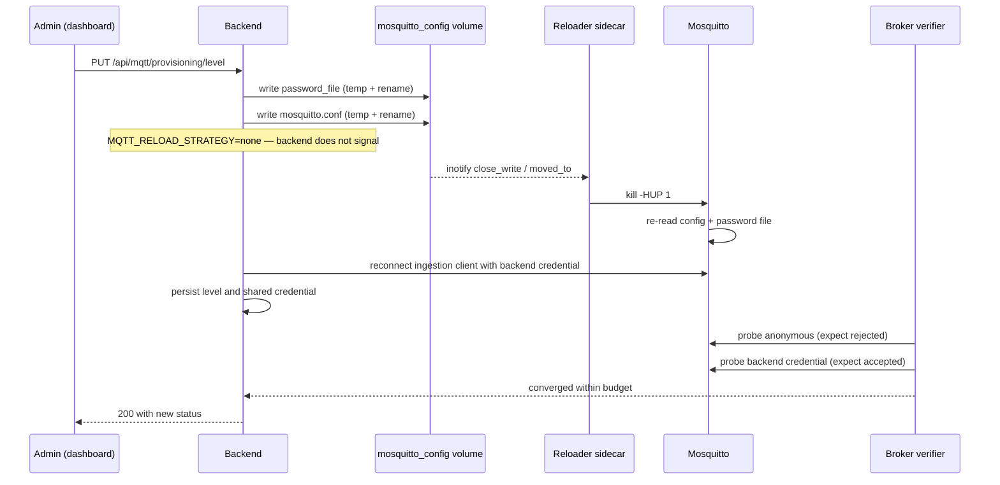

# ADR-0018: Mosquitto reload sidecar and Docker isolation

- **Status:** Accepted
- **Date:** 2026-09-30

## Context

[ADR-0017](0017-mqtt-security-modes.md) makes Open, Shared Password and Per-Device first-class MQTT security modes. That decision is only deliverable if Aeolus can change a *running* broker's policy. This ADR records how, because the mechanism is a separate architectural question from the security model it enables: it is about how Aeolus manages an external service it does not own, at runtime, without acquiring privilege over the host.

Mosquitto re-reads its configuration and password file on `SIGHUP`. It does not watch them. So a policy change is two distinct problems:

1. **Write** the new configuration and password file without the broker ever reading a half-written file.
2. **Deliver a signal** to the broker process so it applies them.

The second problem is the hard one in a container deployment. The backend and the broker are separate containers with separate PID namespaces, so the backend cannot signal the broker process directly. The obvious workaround — mount `/var/run/docker.sock` and call `docker kill --signal=SIGHUP` — is the single largest privilege escalation available in a Compose stack. The Docker socket is root-equivalent on the host: a compromised backend could start a privileged container, mount the host filesystem, and own the machine. Aeolus is an edge service that renders user-authored UI and runs user-authored automation logic, so the backend is exactly the container that should not hold that capability.

A further constraint is that the committed `mosquitto/` directory is source, tracked in Git. A container writing into it would change file ownership on the host and break ordinary Git operations for the operator.

## Decision

Aeolus reloads Mosquitto through a **narrowly scoped sidecar container that shares the broker's PID namespace and watches a shared configuration volume read-only**. No container in the stack mounts the Docker socket.

The pattern has four parts:

**A private mutable config volume.** Live broker configuration lives in the Docker-managed `mosquitto_config` volume, not in the tracked `mosquitto/` directory. A one-shot `mosquitto-config-init` service seeds `mosquitto.conf` from the committed source copy only when the live file does not already exist, and `mosquitto` waits on that service completing successfully. Tracked source and mutable runtime state stay separate.

**Atomic writes from the backend.** The backend writes new content to a temporary file in the same directory, then renames it over the target. Rename within a directory is atomic, so the broker either reads the whole old file or the whole new one.

**A watcher sidecar with no authority beyond signalling.** `mosquitto-reloader` is an Alpine image whose only addition is `inotify-tools`. It mounts `mosquitto_config` at `/watch:ro` — it cannot write configuration at all — and runs with `pid: "service:mosquitto"`, which places it in the broker's PID namespace so it can signal the broker process directly.

**Reload delegated, not performed, by the backend.** `MQTT_RELOAD_STRATEGY` defaults to `none`: the backend writes files and does nothing else, because the sidecar observes the write and reloads. The backend therefore needs no privilege over the broker at all. The `signal`, `command` and `docker` strategies remain for custom runtimes; `docker` requires the socket and is retained only for backward compatibility.

## Mechanism

The sidecar arms its directory watch *before* doing anything else, then sends one reconciliation `SIGHUP`:

```sh
inotifywait -m -e close_write -e moved_to -e create --format '%e %f' /watch |
  while read -r event file; do kill -HUP 1; done &
watcher_pid=$!
sleep 1
kill -HUP 1          # startup reconciliation
wait "$watcher_pid"
```

The ordering is deliberate and was the subject of an earlier fix. An earlier version waited for `password_file` to appear before watching, which the backend could beat: the first Open-to-authenticated transition then landed before anything was watching and was never applied. Arming first covers every later change, and the single reconciliation `SIGHUP` covers any write that happened before the watch existed. A change is therefore applied whether it lands before, during or after sidecar startup.

The full sequence for a mode change, using Shared Password as the example:



Files are written before the reload is triggered, and the level is persisted before verification runs, so a delayed reload still converges rather than leaving stored state disagreeing with the broker.

## The critical invariant: why `kill -HUP 1` reaches Mosquitto

The sidecar signals PID 1. That is only correct because of a chain of three conditions, and all three must hold:

1. **`pid: "service:mosquitto"`** puts the sidecar in the broker container's PID namespace rather than its own. Without it, PID 1 is the sidecar's own shell and the signal goes to itself.
2. **Mosquitto is PID 1 inside that namespace.** The `eclipse-mosquitto:2` entrypoint `exec`s the broker, so the broker replaces the entrypoint shell and inherits PID 1 rather than running as its child.
3. **No init shim is inserted.** The stack does not set `init: true` on `mosquitto` and does not wrap the broker in a supervisor.

Break any one of them and the reload silently stops working — silently because `kill -HUP 1` will still succeed against *something*, so the sidecar logs a sent signal while the broker never reloads. The observable symptom is a mode change that returns `503` from broker verification while the files on disk are correct.

What would break it in practice:

| Change | Effect |
|---|---|
| Removing or altering `pid: "service:mosquitto"` | Signal goes to the sidecar's own shell |
| Adding `init: true` or `--init` to `mosquitto` | PID 1 becomes the init shim; the broker is a child |
| An upstream image that no longer `exec`s the broker | PID 1 becomes a wrapper script |
| Wrapping the broker in a supervisor or shell that does not `exec` | Same |
| Running the broker as a non-PID-1 process in a multi-process container | Signal targets the wrong process |

Anything in that column requires replacing PID-1 signalling with explicit PID discovery inside the shared namespace — the sidecar would need to locate the `mosquitto` process rather than assume it. Verify the invariant after touching the broker service or bumping its image:

```bash
docker compose exec mosquitto ps -o pid,comm
# PID 1 must be mosquitto
```

## Persistence is not activation

Writing the files proves only that Aeolus recorded an intent. It does not prove the broker enforces it. With `MQTT_RELOAD_STRATEGY=none` the reload is asynchronous by construction — the backend never learns when, or whether, the sidecar signalled the broker.

This is why broker-side verification is a required part of the pattern rather than an optional extra. After each change the backend opens short-lived throwaway MQTT connections and classifies the outcome as accepted, rejected or unreachable, polling within a bounded budget so an asynchronous reload is tolerated without reporting premature success. Switching to an authenticated mode is confirmed only once anonymous connections are actually refused *and* the backend credential is actually accepted.

Verification is deliberately connection-based rather than mechanism-based, so it behaves identically whether the reload arrived via the sidecar, a signal, or a custom command. It observes the broker's behaviour, not Aeolus' own bookkeeping — the same argument ADR-0006 makes for command completion, applied to configuration.

## Failure behaviour

**The sidecar crashes or is not running.** `restart: unless-stopped` brings it back, and its startup reconciliation `SIGHUP` applies whatever was written while it was down. Between the crash and the restart, changes are written but not activated, and verification returns `503` for them — a change reported as not-confirmed rather than as applied.

**An event is missed.** The persistent directory watch plus the startup reconciliation cover the startup window. One narrow residual race remains: the reconciliation `SIGHUP` fires one second after the watcher is backgrounded, so a write landing after that second but before `inotifywait` has actually installed its watch would be covered by neither. Accepted, because the window requires `inotifywait` to take longer than a second to arm, and the consequence is a `503` on a change that is already safely on disk.

**The broker never converges.** Verification exhausts its budget and the API returns `503` carrying the reason. The change is still saved and applies on the broker's next reload or restart. The failure mode is an honest "not confirmed", never a false success.

**A reload cannot be triggered at all.** Reload failure is never fatal in the backend. Files are already written, so the broker picks them up when it next starts.

**Mosquitto restarts.** The live configuration is in the volume, so policy survives. Restart persistence across all three modes was exercised on a Raspberry Pi deployment.

One asymmetry is worth knowing: the broker's Compose healthcheck is an anonymous `mosquitto_sub` probe, so it reports unhealthy under Shared Password or Per-Device even when the broker is working correctly. It is observability for the default configuration only, and the backend deliberately does not gate startup on it.

## Security boundaries

| Container | `mosquitto_config` access | Can signal broker | Docker socket |
|---|---|---|---|
| `mosquitto-config-init` (one-shot) | read-write | no | no |
| `mosquitto` | read-write | n/a (is the broker) | no |
| `mosquitto-reloader` | **read-only** (`/watch:ro`) | yes (shared PID namespace) | no |
| `backend` | read-write | no | no |

The split is the point. The container that can *write* broker policy cannot *signal* the broker; the container that can *signal* the broker cannot *write* policy. Neither can reach the Docker daemon. A compromised backend can write a bad Mosquitto configuration — it already controls broker policy by design — but it cannot start containers, touch the host filesystem, or signal arbitrary processes. A compromised sidecar can send `SIGHUP` to Mosquitto and read broker configuration, which is the whole of its authority; with only `inotify-tools` on top of Alpine it has no MQTT client, no shell access to other containers and nothing to escalate into.

The tracked `mosquitto/` directory is never used as mutable runtime storage, so no container changes ownership of files Git tracks.

## Why this fits Aeolus

Aeolus is installed on hardware the operator owns, frequently a Raspberry Pi on a home or site network, and it runs code the operator authored. Its recurring architectural argument is to take the smallest capability that accomplishes the job rather than the most convenient one — V8 isolates instead of `vm` (ADR-0004), an opaque-origin iframe with capability-scoped RPC instead of trusted embedding (ADR-0005), evidence-based command completion instead of assumed success (ADR-0006).

"Mount the Docker socket so the app can restart a container" is the opposite of that argument. It buys one signal and grants root-equivalent host control in exchange. Sharing one PID namespace with one specific service buys the same signal and grants the ability to signal that one service. The pattern also generalises: any future case where Aeolus must reload an external process it co-deploys can reuse the shape — private volume, atomic write, read-only watcher in the target's PID namespace, behavioural verification — without reopening the privilege question.

## Alternatives considered

### Mount the Docker socket and `docker kill --signal=SIGHUP`

The most direct option, and the `docker` reload strategy still implements it for custom runtimes. Rejected as the default because the Docker socket is root-equivalent on the host. It would make the container that renders user-authored UI and runs user-authored automation code also the container that can start privileged containers and mount the host filesystem. Docs state plainly that the socket is deliberately never mounted and should not be exposed to make this feature work.

### Restart the broker container on every change

Conceptually simpler and needs no signal. Rejected because it drops every connected MQTT client on a routine administrative action. Aeolus sites run devices that reconnect on their own schedule, and retained state and in-flight QoS handling would be disturbed for a change Mosquitto is perfectly capable of applying in place. A reload is the correct granularity; a restart is a bigger hammer with visible physical consequences.

### Signal the broker directly from the backend

No extra container. Rejected because it requires the backend to share the broker's PID namespace, which inverts the isolation this ADR is built on: the backend would become both the writer of policy and a process with signalling reach into another service. The `signal` strategy exists for deployments that genuinely run the broker beside the backend, but making it the default would put the most exposed component in the most privileged position. A dedicated sidecar keeps the two capabilities in different containers.

### Poll the configuration files from a sidecar instead of using inotify

Avoids a dependency on inotify semantics inside a Docker volume. Rejected because it trades a correctness property for a smaller dependency: polling adds latency proportional to the interval on every change, and the interesting failure — a change that is written but never activated — is exactly what a bounded-latency watch avoids. `inotify-tools` is a few hundred kilobytes on Alpine.

### Have Mosquitto watch its own configuration

Would remove the sidecar entirely. Not available: Mosquitto re-reads configuration on `SIGHUP` and does not watch its files. This is the upstream constraint that creates the problem.

### Let the backend write into the tracked `mosquitto/` directory

Removes the seeded volume and the init service. Rejected because a container writing there changes file ownership on the host and breaks ordinary Git operations for the operator, and it erases the distinction between committed source and mutable runtime state.

## Consequences

### Positive

- No container in the stack mounts the Docker socket, so no application compromise escalates to host control through the Docker daemon.
- Write authority and signal authority live in different containers, and the signalling container holds no write access.
- Policy changes apply without dropping connected MQTT clients.
- Live configuration survives broker and host restarts, and is seeded on first creation without touching tracked source.
- A change is applied whether it lands before, during or after sidecar startup.
- The pattern is reusable for any co-deployed external process Aeolus must reload.

### Negative / accepted trade-offs

- **The stack carries an extra container** whose entire job is to forward one signal.
- **`kill -HUP 1` depends on an unenforced invariant.** Nothing in the Compose file fails loudly if Mosquitto stops being PID 1; the symptom is a `503` on mode changes. The table above exists because the constraint cannot currently be asserted in code.
- **The reload mechanism lives inline in `docker-compose.yml`** as a shell command rather than a versioned script, so it is harder to test in isolation than the backend's reload strategies.
- **A single logical write can produce more than one `SIGHUP`.** The watch fires on `create`, `close_write` and `moved_to`, so the temporary file and the rename can each trigger a signal. Harmless, since re-reading configuration is idempotent, but the log is noisier than one line per change.
- **A one-second `sleep` before reconciliation is a timing assumption**, leaving the narrow residual race described under failure behaviour.
- **The broker healthcheck is wrong under authenticated modes**, because it probes anonymously. Retained deliberately, but it means container health is not a reliable broker signal once anonymous access is refused.
- **Custom non-Compose runtimes must supply equivalent plumbing** — writable config and password paths plus a reload path — before Aeolus can apply security changes. Runtimes without it report `brokerManagementAvailable: false` rather than pretending.
- **`pid: "service:mosquitto"` couples the sidecar's lifecycle to the broker container**, which is a Compose-specific arrangement and one of the things an equivalent Kubernetes or systemd deployment would have to re-express rather than copy.

## Revisit when

- Mosquitto gains native configuration watching, which would remove the need for a signal path entirely.
- Aeolus needs to manage a second co-deployed external service this way. At two instances the shape should become a documented internal pattern with shared tooling rather than a per-service compose stanza.
- The deployment target stops being single-host Compose. A Kubernetes deployment would express this as a shared process namespace within one pod, and the PID-1 assumption would need restating.
- The PID-1 invariant is broken by an upstream image change. Replace PID-1 signalling with explicit process discovery inside the shared namespace rather than reintroducing the Docker socket.
- Broker policy needs to change often enough that one `SIGHUP` per write becomes a measurable cost, which would justify coalescing writes before signalling.

## Implementation anchors

- `docker-compose.yml` — `mosquitto-config-init`, `mosquitto`, `mosquitto-reloader` (the inline watch-and-signal command), `mosquitto_config` volume
- `mosquitto/reloader.Dockerfile` — the sidecar image (Alpine plus `inotify-tools`)
- `mosquitto/mosquitto.conf` — committed source config, seeded into the runtime volume
- `src/mqtt/mosquitto-config-writer.ts` — atomic config writes
- `src/auth/mqtt-credential-service.ts` — atomic password-file writes (`writePasswordFile`)
- `src/mqtt/mosquitto-reloader.ts` — backend reload strategies, `none` by default
- `src/mqtt/broker-verifier.ts` — behavioural confirmation that a change was activated
- `src/mqtt/mqtt-provisioning-service.ts` — write, reload, reconnect, persist, verify ordering
- `docs/security/mqtt.md` — shared-volume wiring, change verification, reload strategies
- `docs/production-deployment.md` — deployment wiring and host-hardening posture
- `docs/adr/0017-mqtt-security-modes.md` — the security modes this mechanism enables
