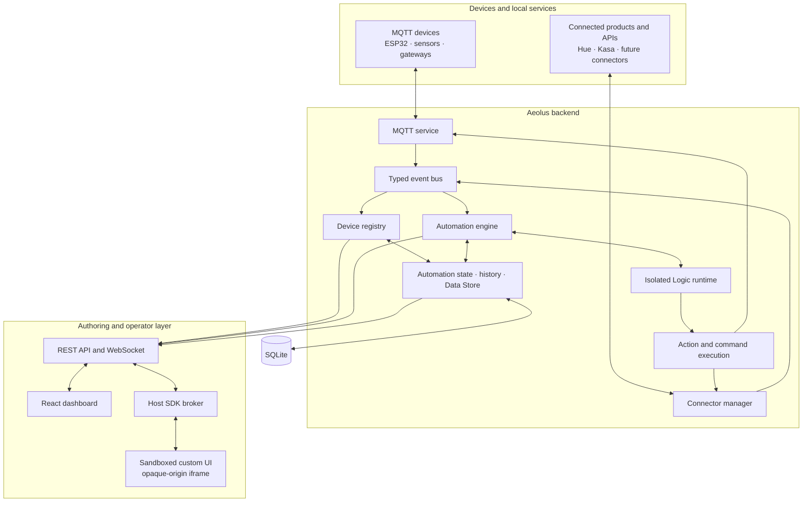

# Architecture

Aeolus is a local application platform that sits between physical devices, automation logic, stored data and the people operating a site.

The project README uses a deliberately simple mental model:

```text
Devices and services
        ↕
Aeolus backend
        ↕
Local data and user interfaces
```

The component-level view is below.



## Runtime flow

1. MQTT messages and connector updates are normalised into internal events.
2. The event bus feeds the device registry, state history, WebSocket broadcasts and matching automations.
3. Script automations execute inside isolated V8 contexts. Form rules use the same action layer without user-authored code.
4. Device commands leave through the transport that owns the device.
5. SQLite stores platform configuration, users, layouts, automations, automation state, history and Data Store records.
6. The dashboard reads through the REST API and receives live changes over WebSocket.
7. Custom automation UI runs in a sandboxed iframe and communicates with the host through a restricted message-based SDK.

## Main process boundaries

### Mosquitto

The local MQTT broker accepts device telemetry and command traffic. Aeolus models Open, Shared and Per-Device broker security modes. Applying broker changes automatically depends on deployment-specific provisioning access.

### Backend

The Node.js backend owns:

- authentication and permissions;
- device registry and history;
- MQTT ingestion;
- connector lifecycle;
- automation execution;
- platform state and Data Store;
- REST and WebSocket APIs;
- metrics and structured logging.

### Frontend

The React application provides:

- system and device views;
- connector setup;
- automation Logic and UI editors;
- draggable dashboard panes;
- Data Store exploration;
- user and MQTT security administration;
- logs, metrics and diagnostics.

### SQLite

Aeolus uses `better-sqlite3` for local persistence. Versioned migrations run at startup before normal services are initialised.

## Event model

The internal event bus decouples input transports from platform behaviour. Current event families include:

- device state changes;
- raw MQTT traffic;
- automation execution and automation state;
- WebSocket state changes;
- Data Store writes and collection deletion.

An MQTT device and a Hue light enter through different adapters, but both become devices and events inside the same platform model.

## Device model

A device record contains:

- stable ID;
- display name;
- type;
- capabilities;
- current state;
- owning integration;
- last-seen time.

`integration` identifies the transport or connector responsible for actions. MQTT devices use the MQTT path; connector-backed devices are routed to the matching connector instance.

## Further reading

- [Automation runtime](automations.md)
- [Connector architecture](connectors.md)
- [Data and storage](data-and-storage.md)
- [API and WebSocket](api.md)
- [Dashboard architecture](dashboard.md)
- [Security](../security/README.md)
